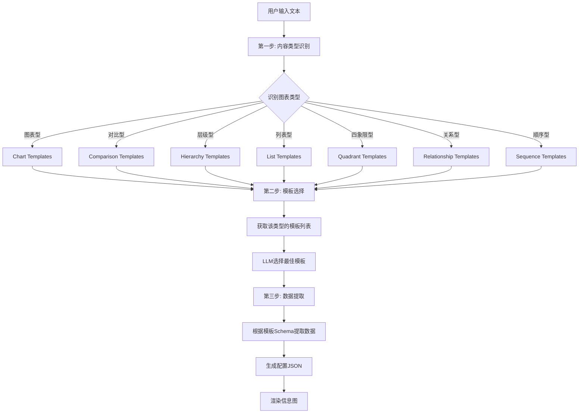
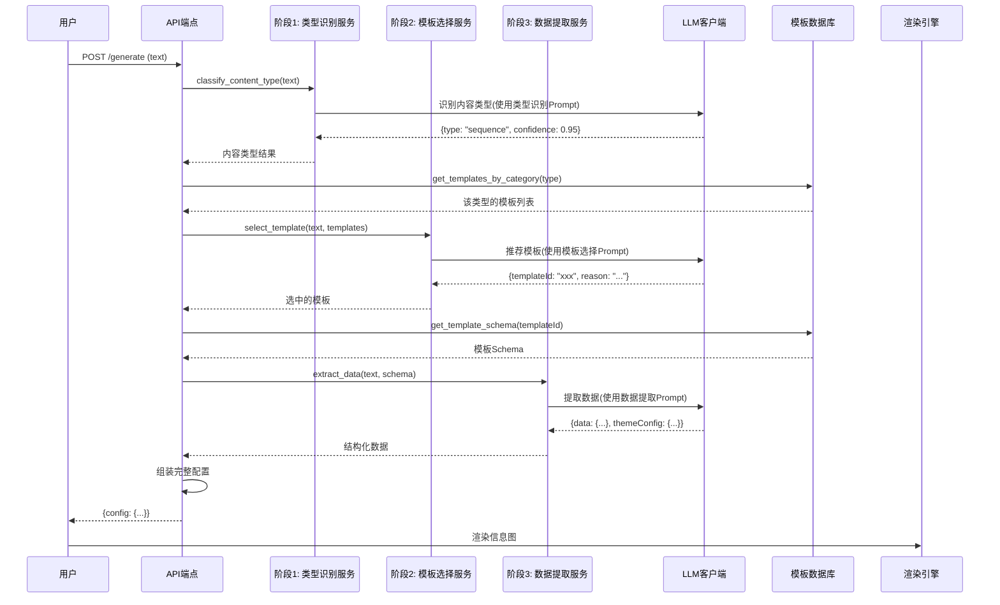

# 图表类型分类和处理设计文档

## 需求背景

当前系统仅有少数几种图表类型能够正常生成信息图，需要扩展支持AntV Infographic官网展示的所有模板类型。目标是支持官网（https://infographic.antv.vision/examples）宣称的所有模板，包括7大类型：**图表型、对比型、层级型、列表型、四象限型、关系型和顺序型**。

### 核心问题

1. 缺少完整的模板类型分类体系
2. 大模型处理流程缺少类型判定和模板选择步骤
3. LLM提示词不可配置，无法针对不同类型优化输出

## 设计目标

1. 建立完整的AntV Infographic模板分类体系
2. 优化大模型处理流程，增加类型识别和模板选择环节
3. 将LLM提示词配置化，支持灵活调整和优化

## 系统架构

### 整体流程



## 模板分类体系

### 分类标准

基于AntV Infographic内置的structure类型前缀，将所有模板分为7大类：

| 分类代码 | 中文名称 | Structure前缀 | 典型特征 | 适用场景 |
|---------|---------|--------------|---------|---------|
| chart | 图表型 | `chart-*` | 包含数值数据、统计信息、量化指标 | 销售数据、用户增长、KPI指标、市场分析 |
| comparison | 对比型 | `compare-*` | 两个或多个事物的对比、优劣分析 | 产品对比、竞品分析、SWOT分析 |
| hierarchy | 层级型 | `hierarchy-*` | 上下级、父子关系、树形结构 | 组织架构、知识体系、产品分类 |
| list | 列表型 | `list-*` | 并列项目、要点、特性、清单 | 功能列表、要点罗列、步骤说明 |
| quadrant | 四象限型 | `quadrant` | 两个维度划分、四个区域 | 优先级矩阵、时间管理、风险评估 |
| relationship | 关系型 | `relation-*` | 元素间的关联、因果、依赖 | 业务流程、系统架构、关系网络 |
| sequence | 顺序型 | `sequence-*` | 有先后顺序、时间线、流程 | 时间轴、操作流程、项目进度 |

### 模板映射表

基于`antv_infographic/infographic/src/templates/built-in.ts`中的BUILT_IN_TEMPLATES，按类型分类：

#### 1. 图表型 (Chart)

| 模板ID | Structure类型 | 适用数据 |
|-------|--------------|---------|
| chart-column-simple | chart-column | 柱状图数据（带数值） |

#### 2. 对比型 (Comparison)

| 模板ID | Structure类型 | 适用数据 |
|-------|--------------|---------|
| compare-hierarchy-left-right-circle-node-pill-badge | compare-hierarchy-left-right | 左右对比层级数据 |
| compare-hierarchy-left-right-circle-node-plain-text | compare-hierarchy-left-right | 左右对比层级数据 |
| compare-swot | compare-hierarchy-row | SWOT四象限分析 |
| compare-hierarchy-row-letter-card-compact-card | compare-hierarchy-row | 行式层级对比 |
| compare-hierarchy-row-letter-card-rounded-rect-node | compare-hierarchy-row | 行式层级对比 |
| compare-binary-horizontal-simple-fold | compare-binary-horizontal | 二元横向对比（折叠样式） |
| compare-binary-horizontal-underline-text-fold | compare-binary-horizontal | 二元横向对比（折叠样式） |
| compare-binary-horizontal-badge-card-fold | compare-binary-horizontal | 二元横向对比（折叠样式） |
| compare-binary-horizontal-compact-card-fold | compare-binary-horizontal | 二元横向对比（折叠样式） |
| compare-binary-horizontal-simple-arrow | compare-binary-horizontal | 二元横向对比（箭头样式） |
| compare-binary-horizontal-underline-text-arrow | compare-binary-horizontal | 二元横向对比（箭头样式） |
| compare-binary-horizontal-badge-card-arrow | compare-binary-horizontal | 二元横向对比（箭头样式） |
| compare-binary-horizontal-compact-card-arrow | compare-binary-horizontal | 二元横向对比（箭头样式） |
| compare-binary-horizontal-simple-vs | compare-binary-horizontal | 二元横向对比（VS样式） |
| compare-binary-horizontal-underline-text-vs | compare-binary-horizontal | 二元横向对比（VS样式） |
| compare-binary-horizontal-badge-card-vs | compare-binary-horizontal | 二元横向对比（VS样式） |
| compare-binary-horizontal-compact-card-vs | compare-binary-horizontal | 二元横向对比（VS样式） |

#### 3. 层级型 (Hierarchy)

| 模板ID | Structure类型 | 适用数据 |
|-------|--------------|---------|
| list-pyramid-rounded-rect-node | list-pyramid | 金字塔层级 |
| list-pyramid-badge-card | list-pyramid | 金字塔层级 |
| list-pyramid-compact-card | list-pyramid | 金字塔层级 |
| hierarchy-tree-* | hierarchy-tree | 树形层级结构 |

#### 4. 列表型 (List)

| 模板ID | Structure类型 | 适用数据 |
|-------|--------------|---------|
| list-column-done-list | list-column | 纵向清单列表 |
| list-column-vertical-icon-arrow | list-column | 纵向图标箭头列表 |
| list-grid-badge-card | list-grid | 网格卡片列表 |
| list-grid-candy-card-lite | list-grid | 网格糖果卡片列表 |
| list-grid-circular-progress | list-grid | 网格环形进度列表 |
| list-grid-compact-card | list-grid | 网格紧凑卡片列表 |
| list-grid-done-list | list-grid | 网格清单列表 |
| list-grid-horizontal-icon-arrow | list-grid | 网格横向图标箭头列表 |
| list-grid-progress-card | list-grid | 网格进度卡片列表 |
| list-grid-ribbon-card | list-grid | 网格丝带卡片列表 |
| list-grid-simple | list-grid | 网格简单列表 |
| list-row-circular-progress | list-row | 横向环形进度列表 |
| list-row-horizontal-icon-arrow | list-row | 横向图标箭头列表 |
| list-column-simple-vertical-arrow | list-column | 纵向简单箭头列表 |
| list-row-simple-horizontal-arrow | list-row | 横向简单箭头列表 |
| list-row-horizontal-icon-line | list-row | 横向图标线条列表 |
| list-sector-simple | list-sector | 扇形简单列表 |
| list-sector-plain-text | list-sector | 扇形纯文本列表 |
| list-sector-half-plain-text | list-sector | 半扇形纯文本列表 |
| list-row-simple-illus | list-row | 横向插图列表 |

#### 5. 四象限型 (Quadrant)

| 模板ID | Structure类型 | 适用数据 |
|-------|--------------|---------|
| quadrant-quarter-simple-card | quadrant | 四象限卡片 |
| quadrant-quarter-circular | quadrant | 四象限圆形 |
| quadrant-simple-illus | quadrant | 四象限插图 |

#### 6. 关系型 (Relationship)

| 模板ID | Structure类型 | 适用数据 |
|-------|--------------|---------|
| relation-circle-circular-progress | relation-circle | 圆形环状关系 |
| relation-circle-icon-badge | relation-circle | 圆形图标徽章关系 |

#### 7. 顺序型 (Sequence)

| 模板ID | Structure类型 | 适用数据 |
|-------|--------------|---------|
| sequence-steps-badge-card | sequence-steps | 步骤徽章卡片 |
| sequence-steps-simple | sequence-steps | 简单步骤 |
| sequence-timeline-done-list | sequence-timeline | 时间轴清单 |
| sequence-timeline-plain-text | sequence-timeline | 时间轴纯文本 |
| sequence-timeline-rounded-rect-node | sequence-timeline | 时间轴圆角矩形节点 |
| sequence-ascending-steps | sequence-ascending-steps | 上升步骤 |
| sequence-timeline-simple | sequence-timeline | 简单时间轴 |
| sequence-cylinders-3d-simple | sequence-cylinders-3d | 3D圆柱体顺序 |
| sequence-snake-steps-compact-card | sequence-snake-steps | 蛇形步骤紧凑卡片 |
| sequence-snake-steps-pill-badge | sequence-snake-steps | 蛇形步骤胶囊徽章 |
| sequence-snake-steps-simple | sequence-snake-steps | 简单蛇形步骤 |
| sequence-color-snake-steps-horizontal-icon-line | sequence-color-snake-steps | 彩色蛇形步骤横向图标线 |
| sequence-pyramid-simple | sequence-pyramid | 简单金字塔顺序 |
| sequence-roadmap-vertical-plain-text | sequence-roadmap-vertical | 垂直路线图纯文本 |
| sequence-roadmap-vertical-simple | sequence-roadmap-vertical | 简单垂直路线图 |
| sequence-roadmap-vertical-badge-card | sequence-roadmap-vertical | 垂直路线图徽章卡片 |
| sequence-roadmap-vertical-pill-badge | sequence-roadmap-vertical | 垂直路线图胶囊徽章 |
| sequence-roadmap-vertical-quarter-circular | sequence-roadmap-vertical | 垂直路线图四分圆形 |
| sequence-roadmap-vertical-quarter-simple-card | sequence-roadmap-vertical | 垂直路线图四分简单卡片 |
| sequence-horizontal-zigzag-simple-illus | sequence-horizontal-zigzag | 横向之字形插图 |
| sequence-horizontal-zigzag-horizontal-icon-line | sequence-horizontal-zigzag | 横向之字形图标线 |
| sequence-horizontal-zigzag-plain-text | sequence-horizontal-zigzag | 横向之字形纯文本 |
| sequence-horizontal-zigzag-simple-horizontal-arrow | sequence-horizontal-zigzag | 横向之字形简单箭头 |
| sequence-horizontal-zigzag-simple | sequence-horizontal-zigzag | 简单横向之字形 |
| sequence-color-snake-steps-simple-illus | sequence-color-snake-steps | 彩色蛇形步骤插图 |
| sequence-snake-steps-simple-illus | sequence-snake-steps | 蛇形步骤插图 |
| sequence-steps-simple-illus | sequence-steps | 步骤插图 |
| sequence-timeline-simple-illus | sequence-timeline | 时间轴插图 |
| sequence-zigzag-steps-underline-text | sequence-zigzag-steps | 之字形步骤下划线文本 |
| sequence-horizontal-zigzag-underline-text | sequence-horizontal-zigzag | 横向之字形下划线文本 |
| sequence-roadmap-vertical-underline-text | sequence-roadmap-vertical | 垂直路线图下划线文本 |
| sequence-snake-steps-underline-text | sequence-snake-steps | 蛇形步骤下划线文本 |
| sequence-circle-arrows-indexed-card | sequence-circle-arrows | 圆形箭头索引卡片 |
| sequence-zigzag-pucks-3d-simple | sequence-zigzag-pucks-3d | 3D之字形圆盘简单 |
| sequence-zigzag-pucks-3d-underline-text | sequence-zigzag-pucks-3d | 3D之字形圆盘下划线文本 |
| sequence-zigzag-pucks-3d-indexed-card | sequence-zigzag-pucks-3d | 3D之字形圆盘索引卡片 |
| sequence-ascending-stairs-3d-simple | sequence-ascending-stairs-3d | 3D上升楼梯简单 |
| sequence-ascending-stairs-3d-underline-text | sequence-ascending-stairs-3d | 3D上升楼梯下划线文本 |
| sequence-circular-underline-text | sequence-circular | 环形下划线文本 |
| sequence-circular-simple | sequence-circular | 简单环形 |
| sequence-filter-mesh-underline-text | sequence-filter-mesh | 过滤网格下划线文本 |
| sequence-filter-mesh-simple | sequence-filter-mesh | 简单过滤网格 |
| sequence-mountain-underline-text | sequence-mountain | 山形下划线文本 |

## 大模型处理流程优化

### 三阶段处理架构



### 阶段1: 内容类型识别

**目标**：识别用户文本属于哪种图表类型

**输入**：用户文本

**输出**：
```json
{
  "type": "sequence",
  "confidence": 0.95,
  "reason": "文本包含明确的步骤顺序和流程描述"
}
```

**判定规则**：

| 类型 | 关键词 | 特征描述 |
|-----|-------|---------|
| chart | 数据、增长率、百分比、统计、指标 | 包含数值数据 |
| comparison | VS、对比、优劣势、差异、选择 | 对比性描述 |
| hierarchy | 组织架构、层级、分类、体系、树形 | 上下级关系 |
| list | 要点、特性、功能、清单、列举 | 并列项目 |
| quadrant | 矩阵、象限、维度、重要紧急 | 两维度划分 |
| relationship | 关系、因果、影响、联系、依赖 | 元素关联 |
| sequence | 步骤、流程、顺序、阶段、时间线 | 先后顺序 |

### 阶段2: 模板选择

**目标**：从该类型的模板中选择最适合的一个

**输入**：
- 用户文本
- 识别出的类型
- 该类型下的所有模板列表

**输出**：
```json
{
  "templateId": "sequence-timeline-simple",
  "templateName": "简单时间轴",
  "confidence": 0.92,
  "reason": "用户文本描述了按时间顺序的事件，时间轴模板最适合"
}
```

**选择策略**：
- 优先考虑数据匹配度（是否包含必需字段）
- 考虑视觉复杂度（简单文本用简单模板，复杂数据用丰富模板）
- 考虑数据项数量（少量用卡片式，大量用列表式）

### 阶段3: 数据提取

**目标**：根据模板Schema提取结构化数据

**输入**：
- 用户文本
- 选中的模板ID
- 模板的数据Schema

**输出**：
```json
{
  "template": "sequence-timeline-simple",
  "data": {
    "title": "产品开发流程",
    "desc": "从需求到上线的完整流程",
    "items": [
      {"label": "需求分析", "desc": "收集并分析用户需求"},
      {"label": "设计", "desc": "UI/UX设计"},
      {"label": "开发", "desc": "编码实现功能"},
      {"label": "测试", "desc": "质量保证"},
      {"label": "上线", "desc": "部署到生产环境"}
    ]
  },
  "themeConfig": {
    "palette": "antv"
  }
}
```

## LLM提示词配置化

### 配置方案

提示词配置支持两种方式：

#### 方案一：环境变量配置（简单调整）

在`.env`文件中添加：

```bash
# LLM提示词配置
LLM_TYPE_CLASSIFICATION_SYSTEM_PROMPT="你是一位专业的信息图分类专家，擅长识别文本内容的结构类型。"
LLM_TEMPLATE_SELECTION_SYSTEM_PROMPT="你是一位专业的信息图设计专家，擅长根据内容选择最合适的可视化模板。"
LLM_DATA_EXTRACTION_SYSTEM_PROMPT="你是一位专业的数据分析师，擅长从文本中提取关键信息并转换为结构化数据。"

# 可选：调整LLM参数
LLM_TYPE_CLASSIFICATION_TEMPERATURE=0.3
LLM_TEMPLATE_SELECTION_TEMPERATURE=0.3
LLM_DATA_EXTRACTION_TEMPERATURE=0.2
```

#### 方案二：配置文件管理（高级定制）

创建 `backend/app/config/llm_prompts.yaml`：

```yaml
# 类型识别提示词
type_classification:
  system_prompt: |
    你是一位专业的信息图分类专家，擅长识别文本内容的结构类型。
  
  user_prompt_template: |
    请分析以下用户输入的文本内容，判断其最适合使用哪种信息图类型。
    
    用户输入文本：
    """
    {user_text}
    """
    
    ## 信息图7大分类体系：
    
    ### 1. 图表型 (chart)
    - **特征**：包含数值数据、统计信息、量化指标
    - **关键词**：数据、增长率、比例、百分比、趋势、统计、图表、指标
    
    ### 2. 对比型 (comparison)
    - **特征**：两个或多个事物的对比、优劣分析、差异展示
    - **关键词**：VS、对比、优劣势、差异、区别、选择、竞争、比较
    
    ### 3. 层级型 (hierarchy)
    - **特征**：具有上下级、父子关系、分级结构
    - **关键词**：组织架构、层级、分类、体系、级别、树形、上下级
    
    ### 4. 列表型 (list)
    - **特征**：并列的项目、要点、特性、步骤
    - **关键词**：要点、步骤、特性、功能、特点、清单、列举
    
    ### 5. 四象限型 (quadrant)
    - **特征**：两个维度划分，四个区域
    - **关键词**：矩阵、象限、维度、重要紧急、优先级、分类
    
    ### 6. 关系型 (relationship)
    - **特征**：元素之间的关联、因果、依赖、影响
    - **关键词**：关系、因果、影响、联系、相关、交互、依赖
    
    ### 7. 顺序型 (sequence)
    - **特征**：有先后顺序、时间线、流程
    - **关键词**：步骤、流程、过程、顺序、阶段、时间线、发展、历史
    
    请以JSON格式返回分析结果：
    {
      "type": "类型代码(chart/comparison/hierarchy/list/quadrant/relationship/sequence)",
      "confidence": 置信度(0-1之间的数值),
      "reason": "判定理由"
    }
  
  temperature: 0.3
  model: null  # null表示使用默认模型

# 模板选择提示词
template_selection:
  system_prompt: |
    你是一位专业的信息图设计专家，擅长根据文本内容推荐最合适的可视化模板。
  
  user_prompt_template: |
    用户文本内容：
    """
    {user_text}
    """
    
    内容类型：{content_type}
    
    可选模板列表：
    {templates_list}
    
    请从上述模板中选择最适合的一个，返回JSON格式：
    {
      "templateId": "模板ID",
      "templateName": "模板名称",
      "confidence": 置信度(0-1),
      "reason": "选择理由"
    }
  
  temperature: 0.3
  model: null

# 数据提取提示词
data_extraction:
  system_prompt: |
    你是一位专业的数据分析师，擅长从文本中提取关键信息并转换为结构化数据。
  
  user_prompt_template: |
    用户输入文本：
    """
    {user_text}
    """
    
    目标模板ID：{template_id}
    
    要求的数据结构（JSON Schema）：
    {schema}
    
    请严格按照Schema提取数据，返回JSON格式。
  
  temperature: 0.2
  model: null
```

### 提示词加载机制

创建提示词管理器 `backend/app/utils/prompt_manager.py`：

**功能**：
- 加载配置文件或环境变量中的提示词
- 提供提示词模板渲染功能
- 支持运行时热更新（可选）

**接口**：

| 方法 | 功能 | 输入 | 输出 |
|-----|------|------|------|
| get_type_classification_prompt | 获取类型识别提示词 | user_text | 完整prompt |
| get_template_selection_prompt | 获取模板选择提示词 | user_text, type, templates | 完整prompt |
| get_data_extraction_prompt | 获取数据提取提示词 | user_text, template_id, schema | 完整prompt |
| reload_prompts | 重新加载配置 | - | - |

## 数据模型

### 模板元数据扩展

在数据库表 `templates` 中新增字段：

| 字段名 | 类型 | 说明 |
|-------|------|------|
| category | VARCHAR(50) | 分类代码：chart/comparison/hierarchy/list/quadrant/relationship/sequence |
| structure_type | VARCHAR(100) | AntV structure类型（如list-row、sequence-timeline） |
| data_schema | JSON | 数据结构Schema定义 |
| example_data | JSON | 示例数据（可选，用于LLM参考） |
| keywords | TEXT | 关键词列表（用于匹配） |

### 类型识别结果

```typescript
interface TypeClassificationResult {
  type: 'chart' | 'comparison' | 'hierarchy' | 'list' | 'quadrant' | 'relationship' | 'sequence';
  confidence: number;  // 0-1
  reason: string;
}
```

### 模板选择结果

```typescript
interface TemplateSelectionResult {
  templateId: string;
  templateName: string;
  confidence: number;  // 0-1
  reason: string;
}
```

### 数据提取结果

```typescript
interface DataExtractionResult {
  template: string;
  data: {
    title?: string;
    desc?: string;
    items: Array<{
      label: string;
      desc?: string;
      value?: number;
      icon?: string;
      children?: any[];
      [key: string]: any;
    }>;
    [key: string]: any;
  };
  themeConfig: {
    palette: string;
    colorPrimary?: string;
    [key: string]: any;
  };
}
```

## 实现策略

### 后端服务改造

#### 新增服务类

**TypeClassificationService** (`backend/app/services/type_classification_service.py`)

- 职责：识别用户文本的内容类型
- 依赖：LLMClient、PromptManager
- 主要方法：`classify(user_text) -> TypeClassificationResult`

**TemplateSelectionService** (`backend/app/services/template_selection_service.py`)

- 职责：从指定类型的模板中选择最合适的
- 依赖：LLMClient、PromptManager、TemplateRepository
- 主要方法：`select(user_text, content_type) -> TemplateSelectionResult`

#### 修改现有服务

**GenerateService** (`backend/app/services/generate_service.py`)

- 重构 `generate()` 方法为三阶段流程
- 集成 TypeClassificationService 和 TemplateSelectionService
- 保留原有 DataExtractionService 逻辑

#### 提示词管理

**PromptManager** (`backend/app/utils/prompt_manager.py`)

- 加载配置文件或环境变量
- 提供模板渲染功能
- 支持热更新（可选）

### 数据库迁移

创建迁移脚本 `backend/app/migrations/add_template_category.py`：

**操作**：
1. 添加 `category` 字段
2. 添加 `structure_type` 字段
3. 扩展 `data_schema` 字段
4. 根据模板ID规则自动填充 `category` 值
5. 创建 `category` 索引

### 模板数据初始化

创建脚本 `backend/scripts/init_template_categories.py`：

**功能**：
1. 读取 `antv_infographic/infographic/src/templates/built-in.ts`
2. 解析所有内置模板
3. 根据 structure.type 前缀自动分类
4. 生成 JSON 配置文件
5. 导入到数据库

**分类规则**：

```python
def classify_template(structure_type: str) -> str:
    if structure_type.startswith('chart-'):
        return 'chart'
    elif structure_type.startswith('compare-'):
        return 'comparison'
    elif structure_type.startswith('hierarchy-') or structure_type == 'list-pyramid':
        return 'hierarchy'
    elif structure_type.startswith('list-'):
        return 'list'
    elif structure_type == 'quadrant':
        return 'quadrant'
    elif structure_type.startswith('relation-'):
        return 'relationship'
    elif structure_type.startswith('sequence-'):
        return 'sequence'
    else:
        return 'list'  # 默认分类
```

### API端点调整

**调整 `/api/v1/generate/extract` 端点**：

现有流程：
```
POST /api/v1/generate/extract
Body: { text, templateId }
→ extract_data(text, templateId)
→ return config
```

新流程：
```
POST /api/v1/generate/extract
Body: { text }  // 不再需要templateId
→ classify_type(text)
→ select_template(text, type)
→ extract_data(text, templateId)
→ return config
```

**保留兼容性**：

如果请求中包含 `templateId`，则跳过前两个步骤，直接提取数据（保持向后兼容）。

### 配置文件管理

#### 默认提示词配置

创建 `backend/app/config/llm_prompts.yaml`，包含默认提示词模板。

#### 环境变量支持

在 `backend/app/config.py` 中新增：

```python
# LLM提示词配置
LLM_PROMPTS_CONFIG_PATH: str = Field(
    default="app/config/llm_prompts.yaml",
    description="LLM提示词配置文件路径"
)

# 或通过环境变量直接覆盖
LLM_TYPE_CLASSIFICATION_SYSTEM_PROMPT: Optional[str] = None
LLM_TEMPLATE_SELECTION_SYSTEM_PROMPT: Optional[str] = None
LLM_DATA_EXTRACTION_SYSTEM_PROMPT: Optional[str] = None
```

**优先级**：环境变量 > 配置文件 > 默认值

## 测试策略

### 单元测试

测试用例 `backend/tests/test_type_classification.py`：

| 测试场景 | 输入文本 | 期望类型 |
|---------|---------|---------|
| 数值数据 | "2023年销售额1000万，增长20%" | chart |
| 对比分析 | "产品A vs 产品B的功能对比" | comparison |
| 组织架构 | "公司组织架构：CEO-部门经理-员工" | hierarchy |
| 功能列表 | "产品的五大功能：1.推荐 2.分析..." | list |
| 优先级矩阵 | "任务分为重要紧急、重要不紧急..." | quadrant |
| 因果关系 | "用户增长影响因素：产品质量、营销..." | relationship |
| 流程步骤 | "开发流程：需求-设计-开发-测试-上线" | sequence |

测试用例 `backend/tests/test_template_selection.py`：

针对每种类型，测试不同文本场景下的模板选择准确性。

测试用例 `backend/tests/test_data_extraction.py`：

针对每个常用模板，测试数据提取的完整性和准确性。

### 集成测试

测试用例 `backend/tests/test_generate_flow.py`：

验证从文本输入到配置生成的完整流程：
- 类型识别准确性
- 模板选择合理性
- 数据提取完整性
- 配置可渲染性

## 实施计划

### 第一阶段：基础设施

**任务**：
1. 创建提示词配置文件结构
2. 实现 PromptManager
3. 数据库迁移（添加category等字段）
4. 编写模板分类脚本

**产出**：
- `llm_prompts.yaml` 配置文件
- `PromptManager` 类
- 数据库表结构更新
- 所有模板已分类标记

### 第二阶段：服务层开发

**任务**：
1. 实现 TypeClassificationService
2. 实现 TemplateSelectionService
3. 重构 GenerateService
4. 调整API端点

**产出**：
- 三个新服务类
- 重构后的生成流程
- 更新的API接口

### 第三阶段：测试与优化

**任务**：
1. 编写单元测试
2. 编写集成测试
3. 收集真实案例测试
4. 优化提示词和逻辑

**产出**：
- 完整的测试套件
- 测试报告
- 优化后的提示词配置

### 第四阶段：文档与交付

**任务**：
1. 编写用户文档
2. 编写开发者文档
3. 准备演示案例
4. 部署上线

**产出**：
- 用户使用指南
- 开发者API文档
- 演示案例集
- 生产环境部署

## 风险与应对

### 风险1：LLM识别准确率不足

**表现**：类型识别或模板选择错误率高

**应对**：
- 提供用户反馈机制，允许手动切换模板
- 收集错误案例，持续优化提示词
- 考虑引入Few-shot示例提升准确性

### 风险2：某些模板数据提取失败

**表现**：特定模板的数据提取成功率低

**应对**：
- 完善模板Schema定义，提供更详细的字段说明
- 在提示词中增加示例数据
- 对特定模板提供专用提示词

### 风险3：提示词配置管理复杂

**表现**：用户难以理解和修改提示词

**应对**：
- 提供详细的配置文档和注释
- 提供Web界面管理提示词（可选）
- 预设多个提示词模板供选择

### 风险4：性能问题

**表现**：三阶段LLM调用导致响应时间过长

**应对**：
- 优化提示词长度，减少token消耗
- 使用更快的模型（如gpt-4o-mini）
- 缓存类型识别结果（相似文本复用）
- 并行处理模板推荐和数据提取（部分场景）

## 后续优化方向

### 智能缓存

对相似文本的类型识别结果进行缓存，减少LLM调用次数。

**实现**：
- 使用文本向量化（embedding）计算相似度
- 相似度超过阈值时复用缓存结果

### 用户反馈学习

收集用户对模板选择的反馈，优化推荐算法。

**实现**：
- 记录用户最终选择的模板
- 分析与LLM推荐的差异
- 调整提示词或引入监督学习

### 模板推荐增强

结合多种策略提升推荐准确性。

**策略**：
- 基于规则的预筛选
- LLM推荐
- 协同过滤（基于用户历史）
- 混合排序

### Web界面管理

提供可视化的提示词和模板管理界面。

**功能**：
- 提示词在线编辑和测试
- 模板分类管理
- 实时预览效果
- A/B测试支持

## 附录

### 附录A：完整模板列表

参考 `antv_infographic/infographic/src/templates/built-in.ts`，共94个内置模板。

### 附录B：提示词示例

详见 `backend/app/config/llm_prompts.yaml` 配置文件。

### 附录C：数据Schema规范

基于AntV Infographic的数据结构要求：

**基础结构**：
```typescript
{
  title?: string;
  desc?: string;
  items: ItemDatum[];
  illus?: Record<string, string | ResourceConfig>;
}
```

**ItemDatum结构**：
```typescript
{
  icon?: string | ResourceConfig;
  label?: string;
  desc?: string;
  value?: number;
  illus?: string | ResourceConfig;
  children?: ItemDatum[];
  [key: string]: any;
}
```
