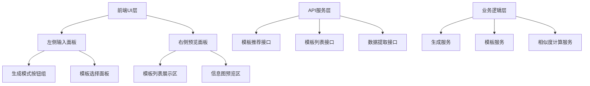
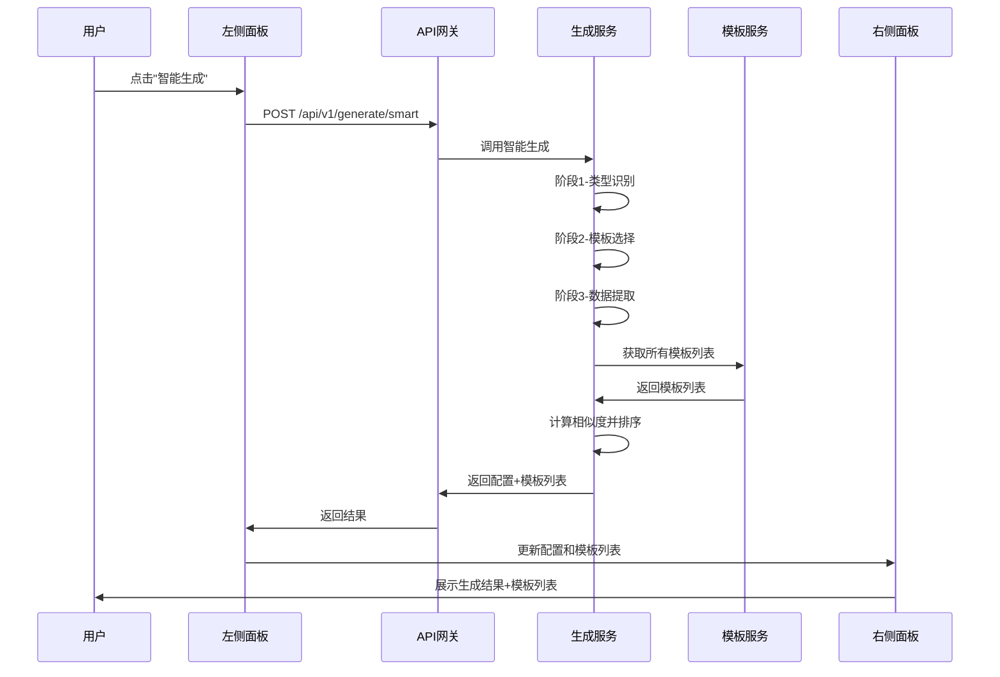
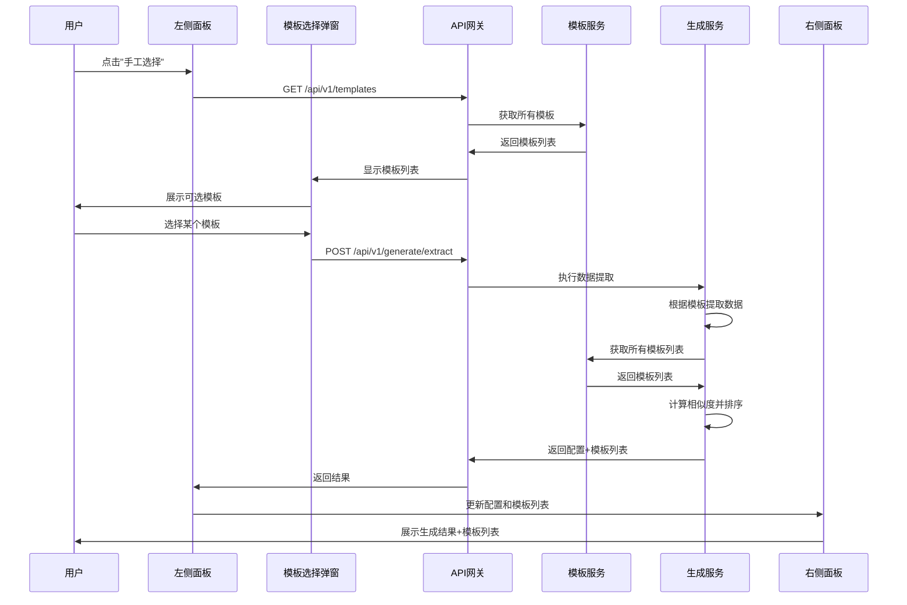
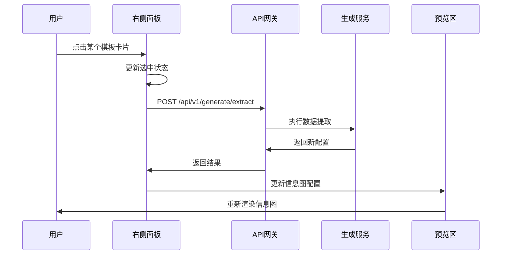
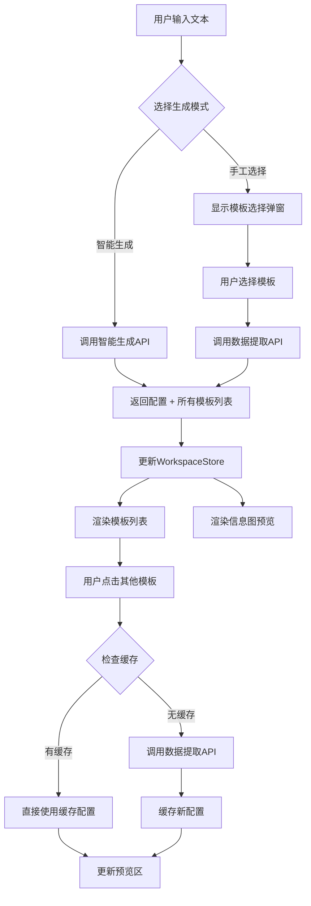

# 模板选择交互优化设计

## 需求概述

优化当前智能模板推荐流程的用户交互体验，为用户提供两种生成模式选择，并在生成结果后展示所有可用模板供用户切换。

### 核心改进点

1. **增加生成模式选择**：用户输入内容后，提供"智能生成"和"手工选择"两种操作模式
2. **扩展模板展示**：生成结果后展示所有支持的信息图模板，按相似度排序，供用户自由切换

## 功能目标

### 用户价值

- 提供灵活的模板选择方式，满足不同用户的使用习惯
- 增强用户对生成结果的控制感和探索能力
- 降低对AI推荐准确性的依赖，提升用户体验的容错性

### 业务价值

- 提高用户对系统的满意度和信任度
- 增加模板的曝光度和使用率
- 收集用户对模板的实际选择数据，优化推荐算法

## 系统架构影响分析

### 涉及的系统组件



### 核心流程变更

当前智能生成流程保持不变，新增手工选择流程和模板切换流程。

## 详细设计

### 1. 生成模式选择功能

#### 1.1 UI交互设计

**位置布局**
- 左侧输入面板底部，原"分析并推荐模板"按钮位置
- 改为两个并排按钮，宽度比例 1:1

**按钮样式**
- 智能生成：主要按钮样式（Primary），强调推荐使用
- 手工选择：次要按钮样式（Default）

**交互状态**
- 输入文本少于10字：两个按钮均禁用，提示"请输入至少10个字的内容"
- 输入文本达到要求：两个按钮均可用
- 点击任一按钮后：显示加载状态，禁用两个按钮

#### 1.2 智能生成流程

保持现有流程不变，执行三阶段生成：



**接口调用**
- 端点：`POST /api/v1/generate/smart`
- 请求参数：
  - text: 用户输入文本
  - includeAllTemplates: true（新增参数，标识需要返回所有模板）
- 响应内容（扩展）：
  - config: 生成的信息图配置
  - classification: 类型识别结果
  - selection: 选中的模板信息
  - timing: 耗时统计
  - allTemplates: 所有可用模板列表（按相似度排序）

#### 1.3 手工选择流程

新增流程，允许用户先选择模板再生成数据：



**模板选择弹窗设计**
- 展示形式：模态对话框
- 列表展示：分类标签页，每个分类下显示对应模板
- 模板卡片信息：
  - 模板名称
  - 分类标签
  - 适用场景描述
  - 预览缩略图（如有）
- 筛选功能：支持按关键词搜索模板名称和描述
- 分页机制：每页显示12个模板

**接口调用**
- 端点1：`GET /api/v1/templates?page=1&pageSize=100`（获取模板列表）
- 端点2：`POST /api/v1/generate/extract`（执行数据提取）
  - 请求参数：
    - text: 用户输入文本
    - templateId: 用户选择的模板ID
    - includeAllTemplates: true（新增参数）
  - 响应内容：
    - config: 生成的信息图配置
    - selectedTemplate: 选中的模板信息
    - allTemplates: 所有可用模板列表（按相似度排序）

### 2. 模板列表展示与切换功能

#### 2.1 展示位置与布局

**位置设计**
- 右侧预览面板顶部，信息图预览区上方
- 垂直滚动区域，高度固定为视口高度的25%
- 横向排列模板卡片，支持横向滚动

**布局规范**
- 模板卡片尺寸：宽度160px，高度120px
- 卡片间距：12px
- 排序原则：相似度从高到低，从左到右排列

#### 2.2 模板卡片设计

**卡片内容**
- 模板名称（顶部居中）
- 相似度标识（右上角徽章，显示百分比）
- 分类标签（左上角，颜色区分）
- 缩略图（中间区域，如无则显示占位图标）
- 当前选中状态（边框高亮显示）

**相似度标识样式**
- 相似度 >= 80%：绿色徽章
- 相似度 60% - 79%：蓝色徽章
- 相似度 40% - 59%：橙色徽章
- 相似度 < 40%：灰色徽章

**交互行为**
- 鼠标悬停：卡片轻微放大，显示阴影
- 点击卡片：触发模板切换操作
- 当前选中：边框高亮，显示对勾标识

#### 2.3 模板切换逻辑



**切换流程说明**
- 用户点击某个模板卡片
- 系统使用当前输入文本和新模板ID重新调用数据提取接口
- 获取新配置后更新预览区
- 模板列表中的选中状态同步更新

**性能优化策略**
- 切换时显示加载状态（预览区显示骨架屏）
- 请求防抖：500ms内多次点击仅触发最后一次
- 数据缓存：已生成的模板配置缓存在前端，切换回已加载模板时直接使用缓存

### 3. 相似度计算与排序

#### 3.1 相似度计算策略

相似度计算基于以下维度：

**维度权重分配**

| 维度 | 权重 | 说明 |
|------|------|------|
| 类型匹配度 | 30% | 模板分类与识别类型的匹配程度 |
| 关键词相似度 | 25% | 用户文本与模板标签的关键词重合度 |
| 语义相似度 | 25% | 用户文本与模板描述的语义相似度 |
| 结构匹配度 | 20% | 文本结构特征与模板数据结构的匹配度 |

**计算逻辑**

对于每个模板，计算综合相似度分数：

```
相似度分数 = 
  类型匹配度 × 0.3 + 
  关键词相似度 × 0.25 + 
  语义相似度 × 0.25 + 
  结构匹配度 × 0.2
```

**特殊规则**
- 智能生成模式下，AI选中的模板相似度自动设为100%
- 手工选择模式下，用户选中的模板相似度自动设为100%
- 同分类模板优先级高于跨分类模板

#### 3.2 排序规则

**主排序键**：相似度分数（降序）

**次排序键**：
1. 模板热度（使用频率，降序）
2. 模板创建时间（降序）
3. 模板ID（字母序）

**分类展示优化**
- 优先展示与识别类型相同分类的模板（相似度 >= 40%）
- 其次展示其他分类中相似度较高的模板（相似度 >= 30%）
- 最后展示剩余模板

## 后端API设计

### API-1: 智能生成接口（扩展）

**端点**：`POST /api/v1/generate/smart`

**请求参数**

| 参数名 | 类型 | 必填 | 说明 |
|--------|------|------|------|
| text | string | 是 | 用户输入文本，至少10字 |
| includeAllTemplates | boolean | 否 | 是否返回所有模板，默认false |

**响应结构**

```json
{
  "success": true,
  "data": {
    "config": { /* 信息图配置对象 */ },
    "classification": {
      "type": "list",
      "confidence": 0.95,
      "reason": "识别为列表型内容"
    },
    "selection": {
      "templateId": "list-grid-icon-card",
      "templateName": "网格图标卡片列表",
      "confidence": 0.92,
      "reason": "适合展示多项内容"
    },
    "timing": {
      "phase1_classification": 1.2,
      "phase2_selection": 1.5,
      "phase3_extraction": 2.3,
      "total": 5.0
    },
    "allTemplates": [
      {
        "templateId": "list-grid-icon-card",
        "templateName": "网格图标卡片列表",
        "category": "list",
        "similarityScore": 1.0,
        "reason": "AI推荐模板"
      },
      {
        "templateId": "list-column-icon-card",
        "templateName": "纵向图标卡片列表",
        "category": "list",
        "similarityScore": 0.85,
        "reason": "相似的列表展示形式"
      }
      /* 更多模板... */
    ]
  },
  "message": "智能生成成功"
}
```

### API-2: 数据提取接口（扩展）

**端点**：`POST /api/v1/generate/extract`

**请求参数**

| 参数名 | 类型 | 必填 | 说明 |
|--------|------|------|------|
| text | string | 是 | 用户输入文本 |
| templateId | string | 是 | 指定的模板ID |
| includeAllTemplates | boolean | 否 | 是否返回所有模板，默认false |

**响应结构**

```json
{
  "success": true,
  "data": {
    "config": { /* 信息图配置对象 */ },
    "selectedTemplate": {
      "templateId": "compare-binary-horizontal",
      "templateName": "横向二元对比",
      "category": "comparison"
    },
    "allTemplates": [
      {
        "templateId": "compare-binary-horizontal",
        "templateName": "横向二元对比",
        "category": "comparison",
        "similarityScore": 1.0,
        "reason": "用户选择的模板"
      }
      /* 更多模板... */
    ]
  },
  "message": "数据提取成功"
}
```

### API-3: 模板列表接口（保持不变）

**端点**：`GET /api/v1/templates`

**请求参数**

| 参数名 | 类型 | 必填 | 说明 |
|--------|------|------|------|
| category | string | 否 | 分类筛选 |
| keyword | string | 否 | 关键词搜索 |
| page | integer | 否 | 页码，默认1 |
| pageSize | integer | 否 | 每页数量，默认20 |

**响应结构**

```json
{
  "success": true,
  "data": {
    "templates": [
      {
        "id": "list-grid-icon-card",
        "name": "网格图标卡片列表",
        "category": "list",
        "description": "适合展示多个并列的产品特性或服务项",
        "useCases": "产品功能、服务优势、团队介绍",
        "tags": ["列表", "网格", "图标", "卡片"]
      }
      /* 更多模板... */
    ],
    "total": 50,
    "page": 1,
    "pageSize": 20
  },
  "message": "获取模板列表成功"
}
```

## 前端状态管理

### Store状态扩展

**WorkspaceStore 新增状态**

| 状态字段 | 类型 | 说明 |
|----------|------|------|
| generationMode | string | 生成模式：'smart' 或 'manual' |
| allTemplates | Array | 所有可用模板列表（带相似度） |
| templateCache | Map | 模板配置缓存，key为templateId |

**WorkspaceStore 新增方法**

| 方法名 | 参数 | 说明 |
|--------|------|------|
| setGenerationMode | mode: string | 设置生成模式 |
| setAllTemplates | templates: Array | 设置模板列表 |
| cacheTemplateConfig | templateId, config | 缓存模板配置 |
| getCachedConfig | templateId | 获取缓存的配置 |

### 组件职责划分

**LeftInputPanel（左侧输入面板）**
- 渲染两个生成模式按钮
- 处理"智能生成"按钮点击事件
- 处理"手工选择"按钮点击事件
- 显示模板选择弹窗

**TemplateSelectionModal（模板选择弹窗）**
- 展示分类标签页
- 渲染模板卡片列表
- 处理模板搜索和筛选
- 处理用户选择并触发生成

**RightPreviewPanel（右侧预览面板）**
- 渲染模板列表展示区
- 渲染信息图预览区
- 处理模板切换事件
- 管理加载状态

**TemplateListBar（模板列表组件）**
- 渲染横向滚动的模板卡片列表
- 标识当前选中模板
- 处理卡片点击事件

## 数据流转图



## 交互细节规范

### 按钮状态

| 状态 | 视觉呈现 | 说明 |
|------|----------|------|
| 默认 | 正常颜色和边框 | 可点击状态 |
| 禁用 | 灰色，不可点击 | 输入不满足条件 |
| 加载中 | 显示旋转图标，禁用点击 | 请求进行中 |
| 悬停 | 颜色加深，显示阴影 | 鼠标悬停效果 |

### 加载状态

**左侧面板加载**
- 显示位置：两个按钮区域
- 加载样式：按钮内显示旋转图标 + "生成中..."文字
- 持续时长：直到API返回或超时（30秒）

**右侧面板加载**
- 显示位置：预览区
- 加载样式：骨架屏占位符
- 持续时长：直到配置更新完成

**模板列表加载**
- 显示位置：模板列表区域
- 加载样式：水平滚动的占位卡片
- 持续时长：直到模板数据加载完成

### 错误处理

**生成失败**
- 提示方式：消息提示（Message）
- 提示内容：具体错误原因（如"网络超时"、"模板不存在"）
- 操作指引：提供重试按钮

**模板切换失败**
- 提示方式：消息提示（Message）
- 提示内容："切换模板失败，请稍后重试"
- 降级策略：保持当前模板不变

**模板列表加载失败**
- 提示方式：空状态占位
- 提示内容："模板加载失败"
- 操作指引：提供刷新按钮

## 性能优化策略

### 前端优化

**懒加载模板卡片**
- 模板列表超过20个时启用虚拟滚动
- 仅渲染可见区域的卡片，减少DOM节点数量

**请求防抖与节流**
- 模板切换请求：500ms防抖
- 搜索输入：300ms防抖

**配置缓存机制**
- 使用Map结构缓存已生成的模板配置
- 切换回已加载模板时直接读取缓存，无需再次请求
- 缓存生命周期：当前会话有效

**异步加载策略**
- 模板列表数据与信息图配置并行加载
- 优先显示配置，模板列表延迟200ms加载

### 后端优化

**相似度计算优化**
- 预计算模板的特征向量，存储在数据库中
- 运行时仅计算用户文本的特征向量，减少计算量
- 使用向量相似度算法加速匹配

**缓存策略**
- 模板列表数据缓存（Redis），有效期1小时
- 相同文本的推荐结果缓存（Redis），有效期10分钟

**并发控制**
- 单用户并发请求限制：最多2个生成请求
- 请求队列：超出限制时返回友好提示

## 兼容性与降级策略

### 浏览器兼容性

**支持范围**
- Chrome 90+
- Edge 90+
- Firefox 88+
- Safari 14+

**不支持的功能降级**
- 虚拟滚动：降级为普通滚动
- 骨架屏：降级为简单加载提示

### API兼容性

**参数向后兼容**
- includeAllTemplates参数可选，默认false
- 旧版前端调用时不返回allTemplates字段

**响应格式兼容**
- 保持现有字段不变，新增字段不影响旧版解析

## 测试验证要点

### 功能测试

**生成模式测试**
- 验证两个按钮的启用/禁用条件
- 验证智能生成流程完整性
- 验证手工选择流程完整性

**模板选择测试**
- 验证弹窗展示和关闭
- 验证模板搜索功能
- 验证分类筛选功能
- 验证分页功能

**模板切换测试**
- 验证点击卡片触发切换
- 验证选中状态同步
- 验证预览区更新
- 验证缓存机制生效

**相似度排序测试**
- 验证排序结果符合规则
- 验证相似度标识正确显示

### 性能测试

**加载性能**
- 智能生成总耗时 < 8秒
- 模板切换响应时间 < 2秒
- 模板列表加载时间 < 1秒

**并发测试**
- 支持10个用户同时生成
- 请求队列机制正常工作

### 兼容性测试

**浏览器测试**
- 各主流浏览器功能正常
- 降级策略生效

**移动端测试**
- 响应式布局适配
- 触摸操作正常

## 实施计划

### 开发阶段

**阶段一：后端接口开发（预计2天）**
- 扩展智能生成接口，增加allTemplates返回
- 扩展数据提取接口，增加allTemplates返回
- 实现相似度计算服务
- 完成接口测试

**阶段二：前端UI开发（预计3天）**
- 修改左侧面板，增加两个按钮
- 开发模板选择弹窗组件
- 开发模板列表展示组件
- 实现模板切换逻辑
- 完成样式调整

**阶段三：前后端联调（预计1天）**
- 测试智能生成流程
- 测试手工选择流程
- 测试模板切换流程
- 修复联调问题

**阶段四：优化与测试（预计2天）**
- 性能优化
- 缓存机制测试
- 异常场景测试
- 用户体验优化

### 上线计划

**灰度发布**
- 初期开放给10%用户
- 收集反馈，监控性能指标
- 修复问题后逐步扩大至100%

**回滚策略**
- 保留旧版本代码分支
- 出现严重问题时可快速回滚

## 潜在风险与应对

### 风险识别

**性能风险**
- 模板数量增多后相似度计算耗时增加
- 应对：引入异步计算 + 缓存机制

**用户体验风险**
- 模板切换频繁可能影响流畅性
- 应对：实施防抖策略和缓存优化

**数据一致性风险**
- 用户输入文本变化后模板列表未刷新
- 应对：监听输入文本变化，清空缓存

### 监控指标

**关键指标**
- 智能生成使用率 vs 手工选择使用率
- 模板切换次数统计
- 用户最终选择的模板与AI推荐模板的一致性
- 平均生成耗时
- API错误率

**优化目标**
- 智能生成准确率（用户不切换模板）> 70%
- 模板切换响应时间 < 2秒
- API成功率 > 99%

## 后续优化方向

### 功能增强

**模板预览优化**
- 鼠标悬停模板卡片时显示大图预览
- 提供模板使用示例

**智能推荐优化**
- 基于用户历史选择数据训练推荐模型
- 引入协同过滤算法提升推荐准确度

**批量生成**
- 支持多个模板同时生成并对比
- 提供模板对比视图

### 用户体验优化

**快捷键支持**
- 左右方向键切换模板
- Enter键确认生成

**历史记录**
- 记录用户最近使用的模板
- 提供快速访问入口

**个性化推荐**
- 根据用户偏好调整排序权重
- 学习用户的模板选择习惯
