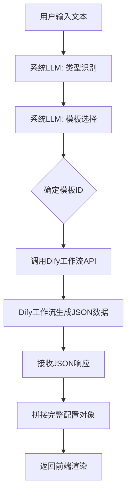
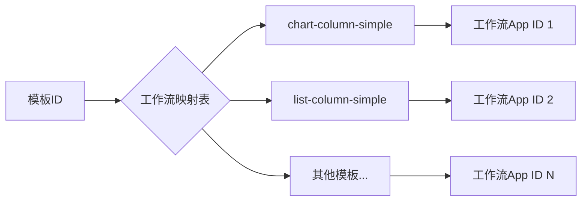
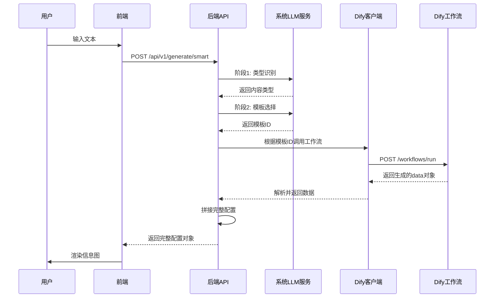
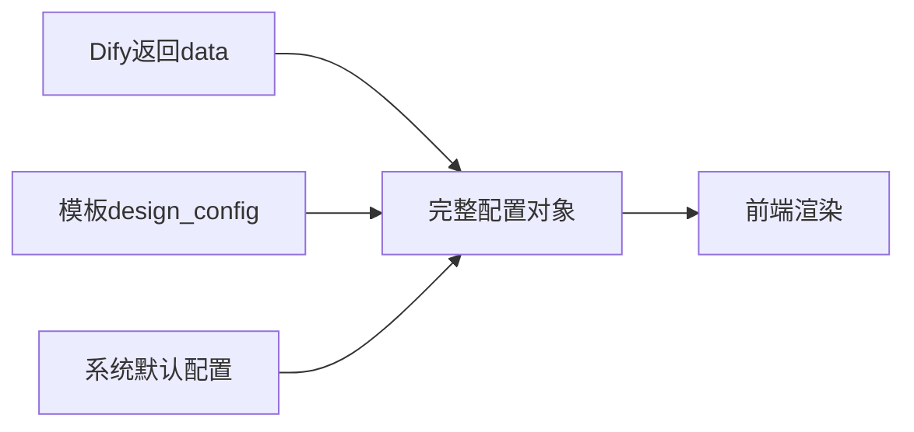
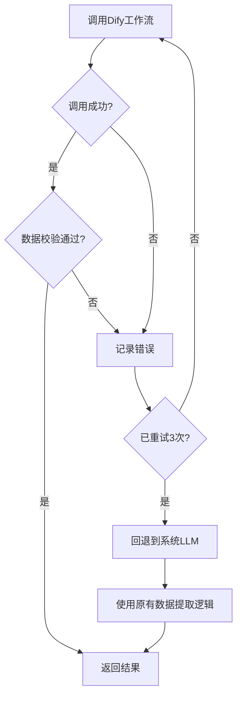
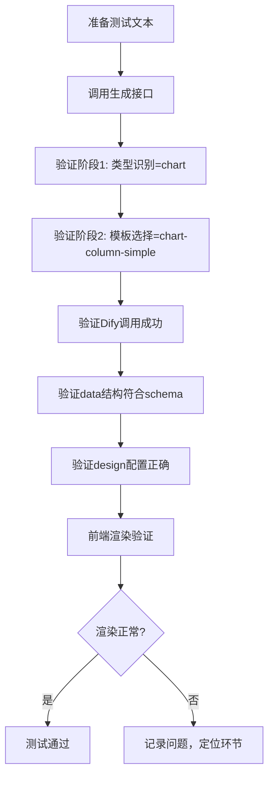
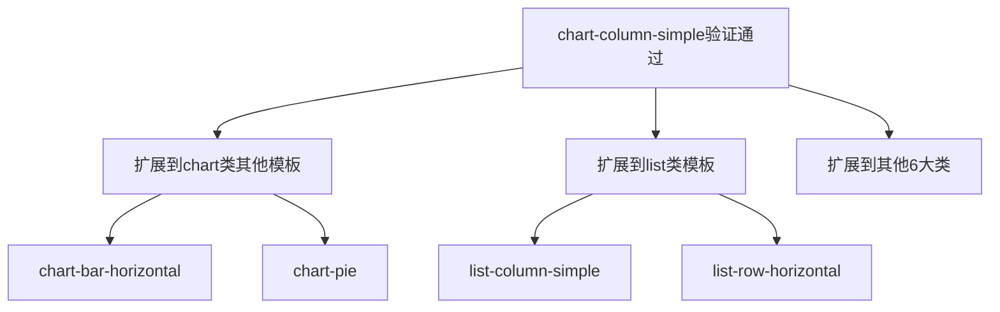

# 信息图模板测试数据生成功能设计

## 一、需求背景

### 当前问题
系统现有的LLM智能生成功能存在较多模板生成报错，需要通过测试数据验证模板的可用性和正确性。

### 解决方案
将LLM生成工作拆分为两部分：
1. **系统内置LLM**：负责分析用户输入，判断适合哪种信息图模板（保留现有的类型识别和模板选择逻辑）
2. **Dify工作流**：负责根据选定的模板生成符合该模板数据结构的JSON数据

### 核心价值
- 解耦数据生成逻辑，通过外部工作流提升数据生成质量
- 为每个模板建立测试数据生成能力，便于验证模板可用性
- 先验证chart-column-simple模板，逐步扩展到其他模板

---

## 二、架构设计

### 系统架构流程

### 职责划分

| 组件 | 职责 | 输入 | 输出 |
|------|------|------|------|
| 系统LLM - 类型识别 | 分析文本内容类型 | 用户文本 | 内容类型（chart/list/sequence等） |
| 系统LLM - 模板选择 | 选择最适合的模板 | 用户文本 + 内容类型 | 模板ID（如chart-column-simple） |
| Dify工作流调用层 | 路由到对应工作流 | 用户文本 + 模板ID | Dify API响应 |
| Dify工作流 | 生成模板数据JSON | 用户文本 | 符合模板schema的data对象 |
| 配置拼接层 | 组装完整配置 | data + design_config | AntV Infographic完整配置 |

---

## 三、Dify工作流集成设计

### 3.1 环境配置

需要在`.env`文件中新增以下配置项：

| 配置项 | 说明 | 示例值 |
|--------|------|--------|
| DIFY_API_BASE_URL | Dify API基础地址 | http://dify-uat.42lab.cn/v1 |
| DIFY_API_KEY | Dify API密钥 | app-ufCoCpuVJbL627fuaBC61KHT |
| DIFY_API_TIMEOUT | 工作流调用超时时间（秒） | 30 |
| DIFY_RESPONSE_MODE | 响应模式 | streaming 或 blocking |

### 3.2 工作流映射表设计

建立模板ID到Dify工作流的映射关系：

映射表数据结构：

| 字段 | 类型 | 说明 |
|------|------|------|
| template_id | string | 模板唯一标识 |
| dify_app_id | string | Dify工作流的App ID（如为null则使用默认key） |
| workflow_name | string | 工作流名称（用于日志） |
| enabled | boolean | 是否启用该工作流 |
| fallback_to_system_llm | boolean | 失败时是否回退到系统LLM |

### 3.3 Dify API调用规范

#### 请求结构

调用Dify工作流时的标准请求格式：

| 参数 | 类型 | 必填 | 说明 |
|------|------|------|------|
| inputs | object | 是 | 工作流输入参数，包含用户文本 |
| response_mode | string | 是 | streaming（流式）或 blocking（阻塞） |
| user | string | 是 | 用户标识 |

inputs对象结构（根据工作流定义）：

| 参数 | 类型 | 说明 |
|------|------|------|
| user_text | string | 用户输入的原始文本 |
| template_id | string | 模板ID（可选，帮助工作流理解目标结构） |

#### 响应处理

**阻塞模式（blocking）响应结构：**

| 字段路径 | 类型 | 说明 |
|----------|------|------|
| data.outputs | object | 工作流输出结果 |
| data.outputs.data | object | 符合模板schema的数据对象 |
| data.status | string | 执行状态（succeeded/failed） |
| data.error | string | 错误信息（失败时） |

**流式模式（streaming）事件类型：**

| 事件类型 | 说明 | 关键数据 |
|----------|------|----------|
| workflow_started | 工作流开始 | workflow_run_id |
| node_started | 节点开始执行 | node_id, node_type |
| text_chunk | 文本片段输出 | text, from_variable_selector |
| node_finished | 节点执行完成 | outputs, status |
| workflow_finished | 工作流完成 | outputs, status, error |

---

## 四、数据流设计

### 4.1 完整数据流程

### 4.2 配置拼接逻辑

最终返回的完整配置对象结构：

| 字段 | 来源 | 说明 |
|------|------|------|
| data | Dify工作流 | 业务数据（如items数组、title等） |
| design | 模板表design_config | 设计配置（structure、title、item等） |
| theme | 系统默认 | 主题配置 |
| layout | 系统默认 | 布局配置 |

拼接策略：

---

## 五、错误处理策略

### 5.1 错误分类

| 错误类型 | 场景 | 处理策略 |
|----------|------|----------|
| 工作流映射缺失 | 模板ID无对应工作流 | 回退到系统LLM数据提取 |
| Dify API调用失败 | 网络超时、服务不可用 | 重试3次后回退到系统LLM |
| 工作流执行失败 | Dify返回error状态 | 记录日志，回退到系统LLM |
| 数据格式校验失败 | 返回数据不符合schema | 尝试修复，失败则回退 |

### 5.2 回退机制

### 5.3 日志记录要求

每次Dify调用需记录以下信息：

| 字段 | 说明 |
|------|------|
| timestamp | 调用时间戳 |
| template_id | 模板ID |
| workflow_run_id | Dify工作流运行ID |
| user_text_length | 用户文本长度 |
| response_time | 响应耗时（毫秒） |
| status | 调用状态（success/failed/fallback） |
| error_message | 错误信息（如有） |

---

## 六、chart-column-simple模板验证方案

### 6.1 模板数据结构

chart-column-simple模板的预期数据结构：

| 字段路径 | 类型 | 必填 | 说明 |
|----------|------|------|------|
| data.title | string | 否 | 图表标题 |
| data.items | array | 是 | 数据项数组 |
| data.items[].label | string | 是 | 类别名称 |
| data.items[].value | number | 是 | 数值 |

design配置结构：

| 字段路径 | 值 | 说明 |
|----------|-----|------|
| design.structure.type | chart-column | 柱状图结构类型 |
| design.title | default | 标题样式 |
| design.items[0].type | simple | 简单样式 |
| design.items[0].showIcon | false | 不显示图标 |
| design.items[0].usePaletteColor | true | 使用调色板颜色 |

### 6.2 测试场景设计

| 测试用例 | 用户输入文本示例 | 预期data输出 | 验证要点 |
|----------|------------------|--------------|----------|
| 基础数值对比 | "2023年销售额：北京1000万，上海1200万，广州800万" | title: "2023年销售额", items: [{label:"北京",value:1000}, {label:"上海",value:1200}, {label:"广州",value:800}] | 数值提取准确性 |
| 百分比数据 | "市场份额：产品A占30%，产品B占45%，产品C占25%" | 转换为数值：30, 45, 25 | 百分比转数值 |
| 带单位数据 | "季度收入：Q1 5000万元，Q2 6200万元，Q3 5800万元" | 提取纯数值：5000, 6200, 5800 | 单位剔除 |
| 无标题场景 | "苹果100，橙子80，香蕉60" | title: null/空, items正常 | 可选字段处理 |

### 6.3 验证步骤

---

## 七、扩展性设计

### 7.1 模板工作流扩展路径

### 7.2 工作流批量创建策略

为所有模板创建Dify工作流的实施步骤：

| 阶段 | 范围 | 产出 |
|------|------|------|
| 第一阶段 | 验证单个模板（chart-column-simple） | 工作流模板、调用逻辑验证 |
| 第二阶段 | 扩展chart类（5-10个模板） | chart类工作流集合 |
| 第三阶段 | 扩展list/sequence类 | 流程型工作流集合 |
| 第四阶段 | 扩展comparison/hierarchy类 | 对比层级工作流集合 |
| 第五阶段 | 全量覆盖 | 100个模板全覆盖 |

### 7.3 工作流复用机制

相似模板可共享工作流，通过参数区分：

| 模板组 | 共享工作流ID | 区分参数 |
|--------|--------------|----------|
| chart-column系列 | chart-column-workflow | item_style: simple/badge/card |
| list-column系列 | list-column-workflow | show_icon: true/false |
| timeline系列 | timeline-workflow | direction: horizontal/vertical |

---

## 八、技术实现要点

### 8.1 服务层设计

新增服务模块：

| 模块名称 | 职责 | 主要方法 |
|----------|------|----------|
| DifyWorkflowClient | Dify API封装 | call_workflow(template_id, user_text) |
| WorkflowMapper | 模板工作流映射管理 | get_workflow_config(template_id) |
| DataValidator | 数据校验 | validate_against_schema(data, schema) |
| ConfigAssembler | 配置拼接 | assemble_config(data, design, theme) |

### 8.2 配置管理

工作流映射配置存储方式：

**方式一：数据库表存储**

| 字段 | 类型 | 说明 |
|------|------|------|
| id | int | 主键 |
| template_id | varchar(100) | 模板ID |
| dify_app_id | varchar(100) | Dify应用ID |
| workflow_name | varchar(200) | 工作流名称 |
| enabled | boolean | 是否启用 |
| fallback_enabled | boolean | 是否启用回退 |
| created_at | timestamp | 创建时间 |
| updated_at | timestamp | 更新时间 |

**方式二：配置文件（推荐初期使用）**

YAML配置文件位置：`backend/app/config/dify_workflows.yaml`

配置示例结构：
- template_id: 模板标识
- dify_app_id: 工作流应用ID（null表示使用环境变量中的默认key）
- workflow_name: 工作流名称
- enabled: 启用状态
- fallback_to_system_llm: 失败时回退到系统LLM

### 8.3 API接口调整

对现有`POST /api/v1/generate/smart`接口进行增强：

响应结构新增字段：

| 字段路径 | 类型 | 说明 |
|----------|------|------|
| data.generation_method | string | 数据生成方法（dify_workflow/system_llm） |
| data.workflow_info | object | Dify工作流信息（如使用） |
| data.workflow_info.workflow_run_id | string | 工作流运行ID |
| data.workflow_info.app_id | string | 工作流应用ID |
| data.timing.dify_call_time | float | Dify调用耗时（秒） |

---

## 九、性能与监控

### 9.1 性能指标

| 指标 | 目标值 | 说明 |
|------|--------|------|
| Dify调用响应时间 | < 5秒（P95） | 阻塞模式下的整体响应时间 |
| 完整生成流程耗时 | < 10秒（P95） | 从请求到返回完整配置 |
| Dify调用成功率 | > 95% | 排除回退情况 |
| 数据校验通过率 | > 90% | Dify返回数据符合schema比例 |

### 9.2 监控埋点

需要监控的关键节点：

每个节点记录：时间戳、耗时、状态、错误信息（如有）

### 9.3 降级策略

当Dify服务出现问题时的降级方案：

| 触发条件 | 降级措施 |
|----------|----------|
| Dify API连续失败>10次 | 全局切换到系统LLM模式，持续5分钟 |
| 单个模板失败率>50% | 禁用该模板的Dify调用，使用系统LLM |
| Dify响应时间>10秒 | 切换response_mode为blocking，减少流式处理开销 |

---

## 十、实施计划

### 阶段一：基础设施搭建（验证阶段）

| 任务 | 产出 |
|------|------|
| 环境配置扩展 | .env文件新增Dify相关配置 |
| Dify客户端封装 | DifyWorkflowClient服务类 |
| chart-column-simple工作流验证 | 确认现有工作流可用性 |
| 单模板集成测试 | 端到端验证生成流程 |

### 阶段二：核心功能开发

| 任务 | 产出 |
|------|------|
| 工作流映射管理 | WorkflowMapper服务 + 配置文件 |
| 数据校验模块 | DataValidator服务 |
| 配置拼接逻辑 | ConfigAssembler服务 |
| 错误处理与回退 | 完整的异常处理和降级机制 |
| 日志与监控 | 关键节点埋点和日志输出 |

### 阶段三：测试与优化

| 任务 | 产出 |
|------|------|
| chart-column-simple完整测试 | 测试报告和问题修复 |
| 性能压测 | 性能优化方案 |
| 错误场景测试 | 回退机制验证 |
| 文档完善 | 开发文档、API文档更新 |

### 阶段四：扩展与推广

| 任务 | 产出 |
|------|------|
| chart类其他模板扩展 | 5-10个chart类模板工作流 |
| 其他类型模板扩展 | list/sequence等类型工作流 |
| 工作流复用优化 | 相似模板共享工作流策略 |
| 全量覆盖 | 100个模板全覆盖 |

---

## 十一、风险评估

| 风险项 | 影响 | 可能性 | 应对措施 |
|--------|------|--------|----------|
| Dify服务稳定性问题 | 高 | 中 | 实施完善的回退机制，保留系统LLM方案 |
| 工作流数据格式不符 | 中 | 高 | 数据校验+自动修复，记录问题模板 |
| 批量创建工作流工作量大 | 中 | 高 | 采用工作流复用策略，分阶段实施 |
| Dify API调用成本 | 中 | 中 | 监控调用量，必要时限流或缓存 |
| 响应时间过长 | 中 | 中 | 优化提示词，使用阻塞模式减少开销 |
