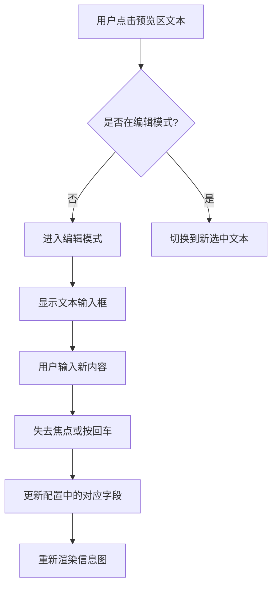
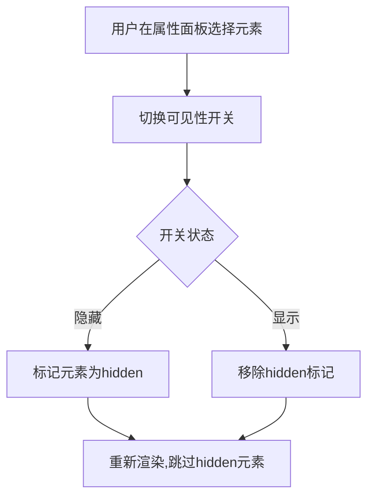
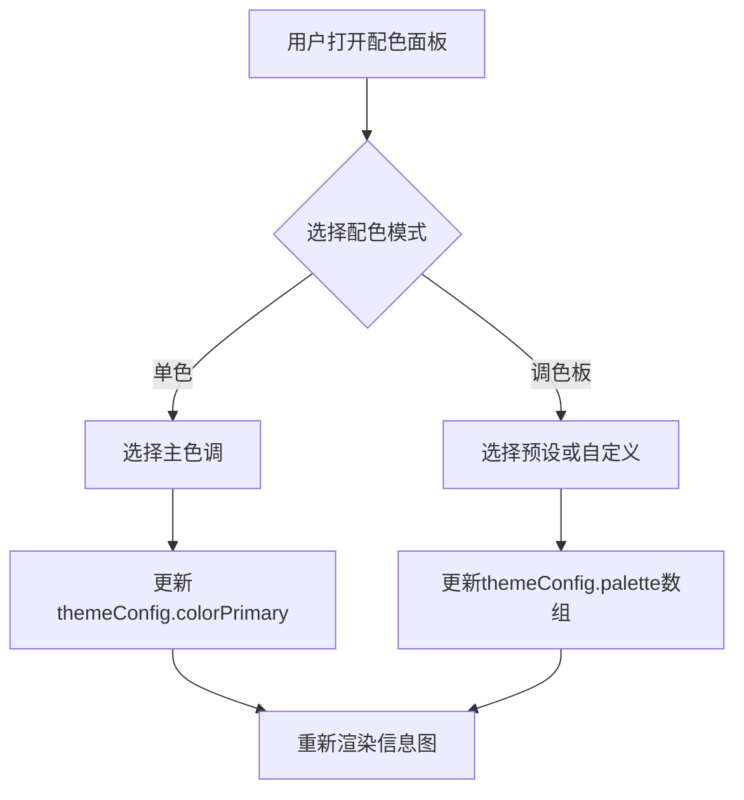
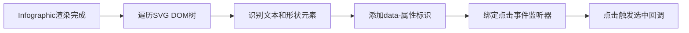
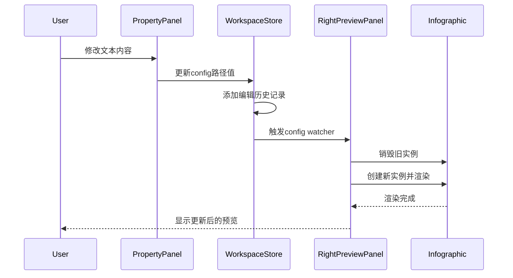
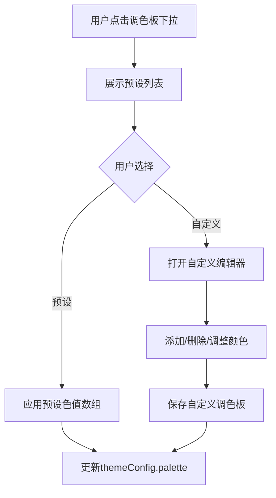
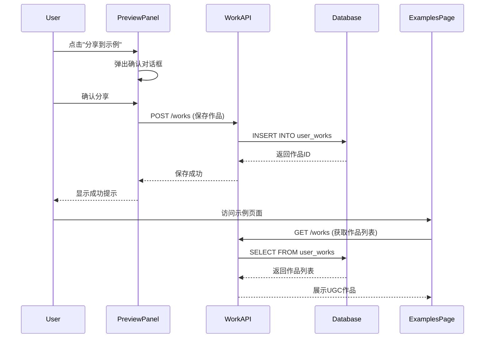

# 信息图调整功能设计

## 概述

为AI信息图生成系统增加交互式调整功能,使用户能够对已生成的信息图进行细粒度定制,包括文本内容修改、元素可见性控制和配色方案调整。该功能将以所见即所得(WYSIWYG)方式提供直观的编辑体验。

## 设计目标

### 核心价值
- **快速迭代**:用户无需重新生成即可调整细节
- **精准控制**:直接操作具体元素而非全局重新配置
- **降低门槛**:通过可视化交互替代复杂的配置编辑

### 设计原则
- 保持一个视口内完整显示(适配1920x1080和4K分辨率)
- 所有界面元素使用中文
- 非破坏性编辑(原始配置可恢复)
- 实时预览反馈

## 功能需求

### 1. 文本编辑

**需求描述**  
用户可修改信息图中的任何文本内容,包括标题、描述、数据项标签、数值等。

**编辑方式**
- 直接点击预览区域中的文本元素,触发行内编辑模式
- 或在右侧属性面板中编辑选中元素的文本属性

**涉及数据字段**
- 标题(title)
- 描述(desc)
- 数据项标签(items[].label)
- 数据项描述(items[].desc)
- 数据项数值(items[].value)
- 时间标记(items[].time)
- 数据项图标(items[].icon) - 如"icon:mdi/check-circle"
- 数据项插图(items[].illus) - 如"illus:mathematics-cuate-7503"

**交互流程**



### 2. 元素可见性控制

**需求描述**  
用户可隐藏或显示信息图中的特定元素,包括标题、描述、图标、单个数据项等。

**控制范围**
- 整体标题区域(title)
- 整体描述区域(desc)
- 单个数据项(items[index])
- 数据项内的图标(items[].icon)
- 数据项内的插图(items[].illus)
- 数据项内的描述文字(items[].desc)
- 数据项内的数值(items[].value)

**实现方式**  
通过属性面板中的复选框控制元素可见性,隐藏的元素从渲染配置中临时移除,但保留在编辑历史中。

**交互流程**



### 3. 配色方案调整

**需求描述**  
用户可调整信息图的整体配色,包括主色调、背景色和数据项调色板。

**可调整属性**
- 主色调(themeConfig.colorPrimary)
- 背景色(themeConfig.colorBg)
- 调色板(themeConfig.palette)

**配色模式**
- **单色模式**:所有数据项使用统一主色调
- **调色板模式**:数据项按顺序使用调色板中的颜色

**交互界面**
- 颜色选择器:选择主色调和背景色
- 预设调色板选择器:选择内置调色板方案(如AntV默认色板)
- 自定义调色板:手动添加/删除/排序颜色

**交互流程**



## 界面布局设计

### 整体布局

当前系统布局为左侧输入面板(21%)和右侧预览面板(79%),调整功能在右侧预览面板内扩展。

### 预览面板改造

将右侧预览面板分为三部分:

**工具栏显示状态**
```
┌────────────────────────────────────────────────────────────────┐
│  [信息图预览] [查看配置] [导出▼] [保存] [分享到示例] [▼]│ ← 工具栏(可隐藏)
├────────────────────────────────────────────────────────────────┤
│  ┌────┐  ┌──────────────────┐  ┌──────────┐                │
│  │模板│  │                  │  │属性编辑器│                │
│  │选择│  │   画布预览区     │  │          │                │
│  │(可│  │                  │  │• 文本编辑│                │
│  │隐藏│  │                  │  │• 可见性  │                │
│  │)  │  │                  │  │• 配色方案│                │
│  └────┘  └──────────────────┘  └──────────┘                │
│   5-10%       60-75%              15-20%                    │
└────────────────────────────────────────────────────────────────┘
```

**工具栏隐藏状态**
```
┌────────────────────────────────────────────────────────────────┐
│  [▲] (点击展开工具栏)                                          │
├────────────────────────────────────────────────────────────────┤
│  ┌────┐  ┌──────────────────┐  ┌──────────┐                │
│  │模板│  │                  │  │属性编辑器│                │
│  │选择│  │                  │  │          │                │
│  │(可│  │   画布预览区     │  │• 文本编辑│                │
│  │隐藏│  │  (更大空间)      │  │• 可见性  │                │
│  │)  │  │                  │  │• 配色方案│                │
│  └────┘  └──────────────────┘  └──────────┘                │
│   5-10%       60-75%              15-20%                    │
└────────────────────────────────────────────────────────────────┘
```

**关键区域**
1. **工具栏**(顶部,**可隐藏**):包含查看配置、导出、保存、分享按钮
   - 默认显示,右侧有折叠按钮[▼]
   - 隐藏后画布区域高度增加,仅保留展开按钮[▲]
2. **模板选择栏**(左侧,可隐藏):现有功能,可折叠以释放空间
3. **画布预览区**(中央):渲染信息图,支持点击选中元素
   - 宽度占比60-75%(根据属性编辑器状态调整)
4. **属性编辑器**(右侧,新增):编辑选中元素的属性
   - **最大宽度限制为20%**,最小15%
   - 未选中元素时可自动隐藏,释放更多空间

### 属性编辑器结构

```
┌──────────────────────┐
│ 编辑器 [收起]        │
├──────────────────────┤
│ 选中: 标题文本       │
├──────────────────────┤
│ [文本]               │
│  "企业数字化..."     │
├──────────────────────┤
│ [可见性]             │
│  ☑ 显示              │
├──────────────────────┤
│ [配色](全局)         │
│  主色: 🎨            │
│  背景: 🎨            │
│  调色板: [预设▼]     │
└──────────────────────┘
```

**宽度约束**
- 最小宽度: 15% (约240px @ 1920px)
- 最大宽度: **20%** (约384px @ 1920px)
- 自适应: 根据屏幕分辨率调整,保证布局不超出视口

## 数据模型

### 编辑状态模型

在前端workspace store中扩展编辑状态:

| 字段名 | 类型 | 说明 |
|--------|------|------|
| `editMode` | `boolean` | 是否处于编辑模式 |
| `selectedElement` | `ElementSelection \| null` | 当前选中的元素 |
| `editHistory` | `EditHistory[]` | 编辑历史栈 |
| `hiddenElements` | `Set<string>` | 隐藏元素的标识符集合 |

**ElementSelection结构**

| 字段 | 类型 | 说明 |
|------|------|------|
| `type` | `'title' \| 'desc' \| 'item' \| 'item-field'` | 元素类型 |
| `path` | `string` | 元素在配置中的路径(如'data.items[0].label') |
| `value` | `any` | 当前值 |

**EditHistory结构**

| 字段 | 类型 | 说明 |
|------|------|------|
| `action` | `'modify' \| 'hide' \| 'show' \| 'colorChange'` | 操作类型 |
| `path` | `string` | 操作目标路径 |
| `oldValue` | `any` | 修改前的值 |
| `newValue` | `any` | 修改后的值 |
| `timestamp` | `number` | 操作时间戳 |

### 配置修改映射

编辑操作最终更新InfographicConfig对象:

**文本修改**
- 路径: `data.title` / `data.items[index].label` 等
- 操作: 直接替换字符串值

**可见性控制**
- 路径: 同文本修改路径
- 操作: 
  - 隐藏时将元素路径加入`hiddenElements` Set
  - 渲染时过滤掉hidden元素
  - 或将字段值置为空字符串(取决于渲染器行为)

**配色调整**
- 路径: `themeConfig.colorPrimary` / `themeConfig.palette`
- 操作: 替换颜色值或数组

## 技术实现策略

### 前端组件架构

新增组件:

**1. PropertyPanel组件**
- 职责: 渲染属性编辑界面
- 输入: selectedElement, currentConfig
- 输出: 配置更新事件

**2. ElementSelector组件**
- 职责: 在预览画布上识别可选中元素
- 实现: 为渲染的SVG元素添加点击事件监听
- 输出: 元素选中事件

**3. ColorPicker组件**
- 职责: 颜色选择器界面
- 基于: 使用ant-design-vue的ColorPicker组件

### 元素选中机制

由于AntV Infographic渲染为SVG,需要在渲染后为SVG元素添加交互能力:

**实现方案**



**标识符方案**
- 为每个可编辑元素添加`data-edit-path`属性,值为配置路径
- 例如: `<text data-edit-path="data.title">标题文本</text>`

**实现位置**  
在RightPreviewPanel.vue的`renderInfographic`方法之后,调用`attachElementListeners`方法为渲染的SVG添加交互。

### 配置更新流程



### 撤销/重做功能

基于编辑历史栈实现:

**操作逻辑**

| 操作 | 历史栈变化 | 配置变化 |
|------|-----------|----------|
| 新编辑 | 入栈 | 应用newValue |
| 撤销 | 指针前移 | 应用oldValue |
| 重做 | 指针后移 | 应用newValue |

**界面位置**  
在工具栏添加撤销/重做按钮,快捷键Ctrl+Z / Ctrl+Y。

## 配色方案库

### 预设调色板

提供以下内置调色板供快速选择:

| 名称 | 色值数组 | 适用场景 |
|------|---------|---------|
| AntV默认 | `['#5B8FF9', '#5AD8A6', '#5D7092', '#F6BD16', '#E86452']` | 通用 |
| 商务蓝 | `['#1890ff', '#096dd9', '#0050b3', '#003a8c', '#002766']` | 企业报告 |
| 活力渐变 | `['#f94144', '#f3722c', '#f8961e', '#f9c74f', '#90be6d']` | 创意展示 |
| 清新绿 | `['#52c41a', '#73d13d', '#95de64', '#b7eb8f', '#d9f7be']` | 环保主题 |
| 紫色系 | `['#722ed1', '#9254de', '#b37feb', '#d3adf7', '#efdbff']` | 科技感 |

### 调色板选择器交互

**选择流程**



## 边界条件与约束

### 编辑限制

1. **结构不可变**:不支持添加/删除数据项,仅编辑现有内容
2. **类型约束**:数值字段仅接受数字输入
3. **长度限制**:
   - 标题: 最多50字符
   - 描述: 最多200字符
   - 标签: 最多30字符

### 错误处理

| 错误场景 | 处理策略 |
|---------|---------|
| 输入无效字符 | 拦截输入,显示提示 |
| 颜色值格式错误 | 回退到上次有效值 |
| 渲染失败 | 显示错误提示,保留编辑器状态 |

## 性能考量

### 渲染优化

- **防抖处理**:文本编辑输入时,使用300ms防抖延迟更新渲染
- **增量更新**:颜色修改时仅更新themeConfig,不重建整个配置

### 内存管理

- 编辑历史栈限制为最多50条记录
- 销毁旧的Infographic实例时确保清理事件监听器

## 用户体验细节

### 视觉反馈

- **选中状态**:选中的元素周围显示蓝色虚线框
- **悬停提示**:鼠标悬停在可编辑元素上时显示铅笔图标
- **颜色预览**:颜色选择器旁边实时显示预览色块

### 键盘快捷键

| 快捷键 | 功能 |
|--------|------|
| `Esc` | 取消选中/退出编辑模式 |
| `Ctrl+Z` | 撤销 |
| `Ctrl+Y` | 重做 |
| `Enter` | 确认文本编辑 |

### 响应式适配

- **1920x1080**: 属性面板宽度25%
- **4K分辨率**: 属性面板宽度固定600px,画布区域居中

## 配置JSON查看功能

### 需求描述
用户可查看当前信息图的完整配置JSON,便于理解配置结构、导出配置或分享给开发者。

### 交互设计

**触发方式**  
在工具栏新增"查看配置"按钮,点击后弹出模态窗口显示JSON代码。

**弹窗界面**

```
┌──────────────────────────────────────┐
│  信息图配置代码         [复制] [关闭] │
├──────────────────────────────────────┤
│  {                                   │
│    "template": "list-row-...",      │
│    "data": {                         │
│      "title": "...",                │
│      "items": [...]                 │
│    },                                │
│    "themeConfig": {                  │
│      "colorPrimary": "#FF356A"      │
│    }                                 │
│  }                                   │
│  (代码编辑器,支持语法高亮)           │
└──────────────────────────────────────┘
```

**功能特性**
- 语法高亮显示JSON代码
- 一键复制到剪贴板
- 只读模式(不可编辑,避免配置混乱)
- 代码格式化(缩进美化)

### 技术实现

**组件选择**  
使用Monaco Editor或简单的代码高亮库(如Prism.js)

**数据来源**  
从workspace store的`infographicConfig`字段获取,使用`JSON.stringify(config, null, 2)`格式化。

**交互流程**

```mermaid
flowchart TD
    A[用户点击"查看配置"按钮] --> B[读取当前配置]
    B --> C[格式化为JSON字符串]
    C --> D[弹出模态窗口]
    D --> E[渲染代码编辑器]
    E --> F{用户操作}
    F -->|点击复制| G[复制到剪贴板]
    G --> H[显示成功提示]
    F -->|点击关闭| I[关闭弹窗]
```

## 分享到示例库功能

### 功能目标
允许用户将满意的作品分享到示例库,替代当前的静态模板示例,形成由真实用户生成内容(UGC)驱动的案例展示。

### 业务流程



### 界面改造

**预览面板工具栏**

在RightPreviewPanel的工具栏中,在"保存"按钮旁边新增"分享到示例"按钮:

```
[信息图预览] [查看配置] [导出▼] [保存] [分享到示例]
```

**分享确认对话框**

点击"分享到示例"后弹出确认对话框:

```
┌────────────────────────────────────┐
│  分享到示例库                       │
├────────────────────────────────────┤
│  您的作品将展示在示例页面,           │
│  供其他用户参考学习。                │
│                                    │
│  作品标题: [________________]      │
│            (可选,默认使用数据标题)  │
│                                    │
│       [取消]        [确认分享]      │
└────────────────────────────────────┘
```

### 示例页面改造

**数据来源切换**

将Examples.vue的数据源从模板列表(`/templates`)切换到作品列表(`/works`)。

**展示内容**

| 原字段(模板) | 新字段(作品) | 说明 |
|-------------|-------------|------|
| `template.name` | `work.title` | 作品标题 |
| `template.category` | 从`work.templateId`推断 | 分类标签 |
| `template.description` | 从`work.inputText`提取前100字 | 描述 |
| `template.designConfig` | `work.infographicConfig` | 渲染配置 |

**布局保持不变**  
继续使用现有的网格布局、分类筛选和预览弹窗,仅数据源切换。

### 数据模型扩展

当前UserWork模型已包含必要字段,无需修改数据库schema:

| 字段 | 类型 | 用途 |
|------|------|------|
| `title` | String | 作品标题(展示在卡片上) |
| `template_id` | String | 关联模板ID(用于分类) |
| `input_text` | Text | 用户输入(可作为描述) |
| `infographic_config` | JSON | 完整配置(用于渲染) |
| `thumbnail_url` | String | 缩略图URL(可选,未来优化) |
| `created_at` | DateTime | 创建时间(排序) |

### 后端API扩展

**现有API复用**

- `POST /works` - 已存在,用于保存作品
- `GET /works` - 已存在,用于获取作品列表

**新增API需求**

无需新增,现有API已满足需求。可在未来扩展:
- `PATCH /works/{id}` - 更新作品(如修改标题)
- `DELETE /works/{id}` - 删除作品(管理功能)

### 前端状态管理

在workspace store中新增分享状态:

| 字段 | 类型 | 说明 |
|------|------|------|
| `isSharing` | `boolean` | 是否正在分享 |
| `shareDialogVisible` | `boolean` | 分享对话框可见性 |
| `shareTitle` | `string` | 分享时的作品标题 |

### 权限与审核

**当前阶段**  
所有分享的作品直接展示,无审核机制(MVP版本)。

**未来扩展**
- 添加`is_public`字段控制可见性
- 添加`status`字段(待审核/已发布/已拒绝)
- 管理员审核后台

### 缩略图生成(可选优化)

**问题**  
作品列表中每个卡片都需要渲染Infographic实例,大量卡片时性能压力大。

**优化方案**  
在分享时生成缩略图并保存到`thumbnail_url`字段:

1. 前端导出PNG缩略图(使用Infographic的导出功能)
2. 上传到云存储(OSS/S3)或后端存储
3. 保存URL到数据库
4. 示例页面直接展示图片,点击后才渲染完整Infographic

**实现优先级**: 第二阶段优化项

## 实现优先级

### 第一阶段:核心编辑功能
1. 文本编辑
2. 配色方案调整(主色调、背景色)
3. 配置JSON查看
4. 分享到示例库

### 第二阶段:可见性与扩展
1. 元素可见性控制
2. 调色板选择
3. 编辑历史面板
4. 基础撤销/重做

### 第三阶段:体验优化
1. 键盘快捷键
2. 自定义调色板编辑
3. 批量操作(如批量隐藏图标)
4. 缩略图生成与优化
