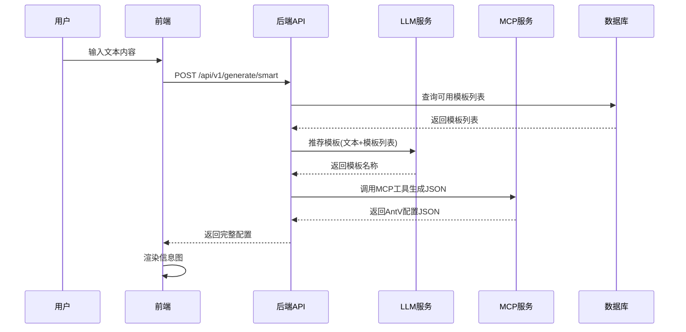
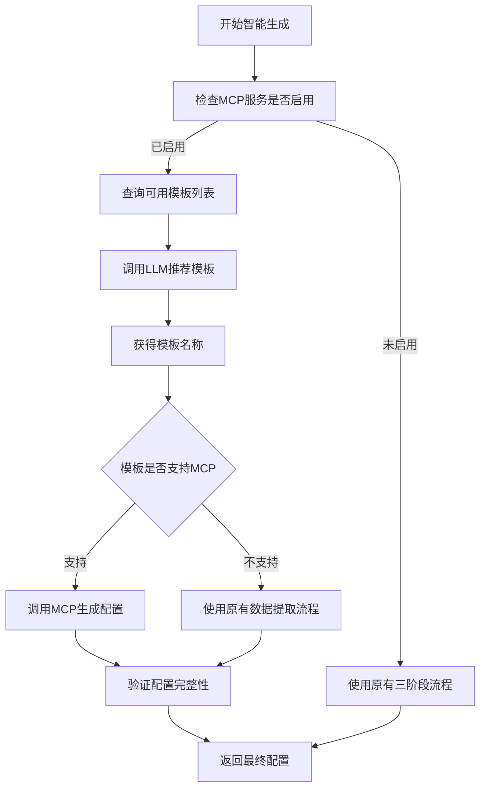

# MCP服务集成设计

## 一、需求背景

### 当前问题
现有智能生成流程存在较多生成失败场景,主要原因是系统内LLM需要同时完成:
- 类型识别
- 模板选择  
- 数据提取
- JSON配置生成

多阶段流程增加了失败概率,且对LLM的prompt工程要求较高。

### 解决方案
将核心的JSON配置生成工作交给专门的Dify MCP服务处理,简化系统职责:
- **系统内LLM**: 仅负责根据用户内容选择合适的模板名称
- **Dify MCP服务**: 负责根据模板名称和用户内容生成完整的AntV Infographic JSON配置

### MCP服务信息
- **服务地址**: `http://dify-uat.42lab.cn/mcp/server/wNSkE5VjPZSTKlfb/mcp`
- **当前支持模板**: `chart-column-simple` (后续会陆续完善)

## 二、架构设计

### 2.1 整体流程



### 2.2 职责划分

| 组件 | 职责 | 输入 | 输出 |
|------|------|------|------|
| **前端** | 接收用户输入,渲染信息图 | 用户文本 | 可视化信息图 |
| **后端API** | 流程编排,服务调用 | 用户文本 | AntV配置JSON |
| **系统LLM** | 模板推荐 | 用户文本 + 模板列表 | 模板名称 |
| **MCP服务** | JSON配置生成 | 用户文本 + 模板名称 | AntV配置JSON |
| **数据库** | 模板元数据管理 | 查询条件 | 模板列表 |

### 2.3 数据流转


## 三、技术方案

### 3.1 配置管理

#### 环境变量配置
在 `.env` 文件中新增MCP服务配置:

| 配置项 | 说明 | 示例值 |
|--------|------|--------|
| `MCP_SERVICE_ENABLED` | 是否启用MCP服务 | `true` |
| `MCP_SERVICE_URL` | MCP服务地址 | `http://dify-uat.42lab.cn/mcp/server/wNSkE5VjPZSTKlfb/mcp` |
| `MCP_TIMEOUT` | 请求超时时间(秒) | `30` |
| `MCP_MAX_RETRIES` | 最大重试次数 | `2` |

#### 配置读取
在 `app/config.py` 中添加配置类属性,支持从环境变量读取MCP相关配置。

### 3.2 MCP客户端服务

#### 服务职责
封装MCP服务调用逻辑,提供统一的接口供生成服务使用。

#### 核心方法

| 方法名 | 参数 | 返回值 | 说明 |
|--------|------|--------|------|
| `generate_config` | user_text: str<br>template_name: str | Dict[str, Any] | 调用MCP生成配置 |
| `health_check` | - | bool | 检查MCP服务健康状态 |

#### 调用协议
根据MCP标准协议进行通信:
- 请求方法: 根据MCP服务实际协议确定
- 请求参数: 包含用户文本和模板名称
- 响应格式: AntV Infographic配置JSON
- 错误处理: 捕获网络异常、超时、服务返回错误等场景

#### 异常处理策略

| 异常类型 | 处理方式 |
|----------|----------|
| 网络超时 | 记录日志,返回友好错误提示 |
| 连接失败 | 记录日志,返回服务不可用提示 |
| 服务返回错误 | 解析错误信息,返回具体错误原因 |
| JSON解析失败 | 记录原始响应,返回格式错误提示 |

### 3.3 生成服务改造

#### 改造范围
修改 `generate_service.py` 中的 `generate_smart` 方法。

#### 新流程逻辑



#### 模板支持判断
- 从数据库查询模板元数据,检查模板是否标记为支持MCP生成
- 或者维护一个支持MCP的模板白名单列表
- 初期仅 `chart-column-simple` 支持

#### 降级策略
当MCP服务调用失败时:
- 记录详细错误日志
- 自动降级到原有的三阶段LLM生成流程
- 在响应中添加降级标识,便于监控和分析

### 3.4 LLM服务调整

#### 简化模板推荐
保留原有 `recommend_templates` 方法,但简化其职责:
- 输入: 用户文本 + 可用模板列表
- 输出: 推荐的模板名称(单个或多个)
- 不再需要生成完整的数据结构

#### Prompt优化
调整提示词,明确LLM只需返回模板名称:
- 系统提示词: 强调仅需推荐最合适的模板,无需提取数据
- 用户提示词: 包含用户文本和模板列表,要求返回模板ID
- 响应格式: JSON格式,包含templateId和推荐理由

### 3.5 数据库支持

#### 模板元数据扩展
在模板表中新增字段标识MCP支持状态:

| 字段名 | 类型 | 说明 | 默认值 |
|--------|------|------|--------|
| `supports_mcp` | boolean | 是否支持MCP生成 | false |
| `mcp_template_name` | string | MCP服务中的模板名称 | null |

#### 数据迁移
为现有 `chart-column-simple` 模板更新字段:
- `supports_mcp`: true
- `mcp_template_name`: "chart-column-simple"

## 四、接口设计

### 4.1 后端API

#### 智能生成接口(改造)

**路径**: `POST /api/v1/generate/smart`

**请求体**:
```json
{
  "text": "2023年Q1销售额100万，Q2增长到120万，Q3达到150万，Q4达到180万"
}
```

**响应体**:
```json
{
  "success": true,
  "data": {
    "config": {
      "design": {
        "structure": {"type": "chart-column"},
        "title": "default",
        "items": [{"type": "simple"}]
      },
      "data": {
        "title": "2023年销售额",
        "data": [
          {"label": "Q1", "value": 100},
          {"label": "Q2", "value": 120},
          {"label": "Q3", "value": 150},
          {"label": "Q4", "value": 180}
        ]
      },
      "themeConfig": {"palette": "antv"}
    },
    "templateInfo": {
      "templateId": "chart-column-simple",
      "templateName": "简单柱状图",
      "generatedBy": "mcp"
    },
    "timing": {
      "template_recommendation": 0.8,
      "mcp_generation": 1.2,
      "total": 2.0
    }
  },
  "message": "智能生成成功"
}
```

**新增字段说明**:
- `generatedBy`: 标识配置生成方式,值为 "mcp" 或 "llm"
- `timing.mcp_generation`: MCP服务调用耗时

### 4.2 MCP服务调用

#### 请求格式(待确认)

根据MCP服务实际协议,预期请求格式为:

```json
{
  "user_text": "用户输入的原始文本",
  "template_name": "chart-column-simple"
}
```

#### 响应格式(待确认)

预期MCP服务返回标准AntV Infographic配置:

```json
{
  "design": {
    "structure": {"type": "chart-column"},
    "title": "default",
    "items": [...]
  },
  "data": {
    "title": "...",
    "data": [...]
  },
  "themeConfig": {...}
}
```

## 五、实施计划

### 5.1 第一阶段: 基础集成

#### 任务清单

| 任务 | 优先级 | 说明 |
|------|--------|------|
| 添加MCP配置到.env | P0 | 配置服务地址等参数 |
| 创建MCP客户端服务 | P0 | 封装MCP调用逻辑 |
| 改造生成服务 | P0 | 集成MCP调用流程 |
| 数据库迁移 | P1 | 添加MCP支持字段 |
| 测试验证 | P0 | 验证chart-column-simple |

#### 验证目标
使用 `chart-column-simple` 模板完成端到端测试:
- 用户输入包含数值数据的文本
- 系统正确推荐 chart-column-simple 模板
- MCP服务成功生成配置
- 前端正确渲染柱状图

### 5.2 第二阶段: 完善与优化

#### 任务清单

| 任务 | 说明 |
|------|------|
| 降级策略验证 | 测试MCP服务不可用时的降级流程 |
| 监控日志 | 添加详细的调用日志和性能监控 |
| 错误处理优化 | 完善各类异常场景的处理 |
| 支持更多模板 | 配合Dify服务扩展更多模板支持 |

### 5.3 第三阶段: 全量迁移

待Dify MCP服务完善更多模板后:
- 逐步将模板标记为MCP支持
- 监控MCP生成成功率
- 最终可考虑移除原有三阶段LLM流程

## 六、风险与对策

### 6.1 技术风险

| 风险 | 影响 | 对策 |
|------|------|------|
| MCP服务不稳定 | 生成失败率增加 | 实现降级机制,保留原有流程 |
| 网络延迟 | 用户体验下降 | 设置合理超时,添加loading提示 |
| 协议不匹配 | 调用失败 | 第一阶段验证协议,确认接口规范 |
| JSON格式错误 | 渲染失败 | 添加配置验证,异常时降级 |

### 6.2 业务风险

| 风险 | 影响 | 对策 |
|------|------|------|
| 模板支持不足 | 功能覆盖率低 | 保留原有流程作为补充 |
| 生成质量下降 | 用户满意度降低 | 对比测试,监控生成质量 |

## 七、监控与运维

### 7.1 监控指标

| 指标名称 | 说明 | 告警阈值 |
|----------|------|----------|
| MCP调用成功率 | MCP服务调用成功次数/总次数 | < 90% |
| MCP响应时间 | MCP服务平均响应时间 | > 5s |
| 降级触发率 | 降级到LLM流程的次数/总次数 | > 20% |
| 生成失败率 | 整体生成失败次数/总次数 | > 10% |

### 7.2 日志规范

所有MCP调用相关日志应包含:
- 请求ID(便于追踪)
- 用户文本摘要
- 模板名称
- 调用耗时
- 成功/失败状态
- 错误详情(如失败)

### 7.3 运维建议

- 定期检查MCP服务健康状态
- 监控MCP服务响应时间趋势
- 收集生成失败案例,反馈优化MCP服务
- 定期对比MCP生成与LLM生成的质量差异

## 八、测试策略

### 8.1 单元测试

| 测试对象 | 测试内容 |
|----------|----------|
| MCP客户端 | 正常调用、超时、网络错误、JSON解析错误 |
| 生成服务 | MCP流程、降级流程、配置验证 |
| 配置读取 | 环境变量正确读取 |

### 8.2 集成测试

| 场景 | 预期结果 |
|------|----------|
| 正常生成流程 | 成功生成配置并渲染 |
| MCP服务不可用 | 自动降级到LLM流程 |
| 不支持的模板 | 使用LLM流程 |
| 网络超时 | 返回友好错误提示 |

### 8.3 端到端测试

使用 `chart-column-simple` 模板完成以下测试:
- 包含数值数据的文本输入
- 验证模板推荐正确性
- 验证MCP配置生成正确性
- 验证前端渲染效果
- 验证错误处理逻辑

## 九、附录

### 9.1 相关文件清单

| 文件路径 | 说明 |
|----------|------|
| `backend/.env` | 环境配置文件 |
| `backend/app/config.py` | 配置类 |
| `backend/app/services/mcp_client.py` | MCP客户端服务(新建) |
| `backend/app/services/generate_service.py` | 生成服务(改造) |
| `backend/app/services/llm_client.py` | LLM客户端(调整) |
| `backend/app/models/template.py` | 模板模型(扩展) |
| `backend/scripts/add_mcp_support_fields.py` | 数据库迁移脚本(新建) |

### 9.2 术语表

| 术语 | 说明 |
|------|------|
| MCP | Model Context Protocol,模型上下文协议 |
| Dify | 低代码LLM应用开发平台 |
| AntV Infographic | 信息图可视化库 |
| 降级 | 当优先方案失败时,自动切换到备用方案 |
