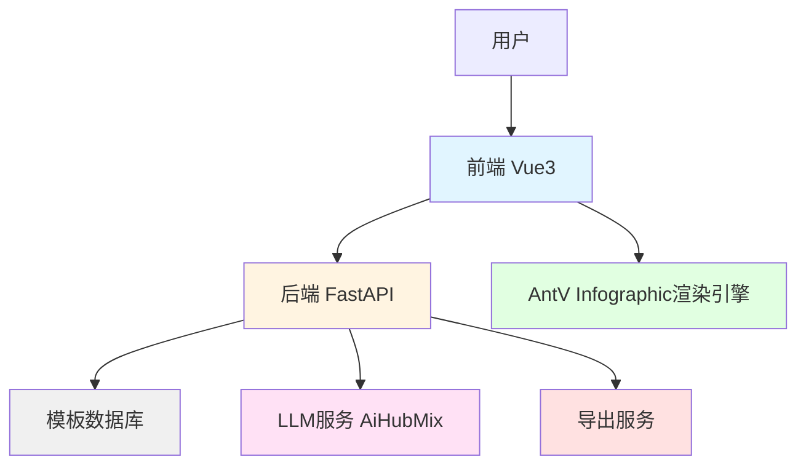
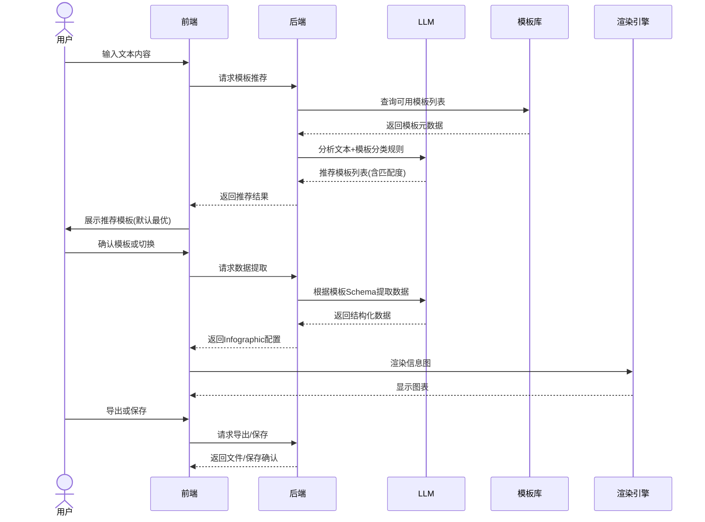
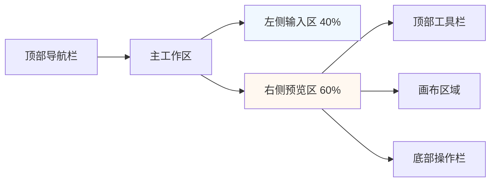
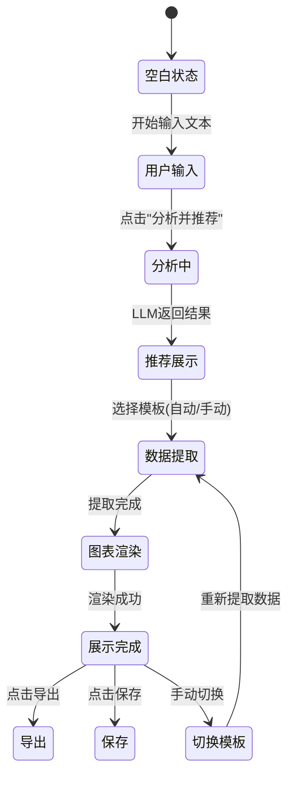

# 模板增强与分类系统设计文档

## 1. 需求概述

当前系统仅包含4个模板,需要扩展至100个官方模板,并实现分类管理和智能推荐功能。参考AntV Infographic官网示例(https://infographic.antv.vision/examples),将模板分为7大类型,优化大模型选择策略,同时改进前端界面为AI工作区风格。

### 1.1 核心目标

- 整理并导入100个官方模板,按7大分类存储至数据库
- 优化LLM提示词,使其能根据用户输入智能选择最适合的模板分类和具体模板
- 重构前端界面为AI工作区风格,提供更好的交互体验
- 支持多格式导出(图片、PDF、SVG、PPTX)和保存功能

### 1.2 模板分类定义

| 分类 | 适用场景 | 典型用例 |
|------|---------|---------|
| 图表型 | 数值展示,柱状图等可视化图表 | 销售数据、统计报表、指标展示 |
| 对比型 | 优劣对比、SWOT分析 | 产品对比、方案评估、竞品分析 |
| 层级型 | 组织结构、分类信息 | 公司架构、知识分类、系统层级 |
| 列表型 | 步骤说明、清单、简单信息罗列 | 操作指南、检查清单、要点列举 |
| 四象限型 | 市场定位、风险评估 | 波士顿矩阵、优先级矩阵、决策分析 |
| 关系型 | 关系网络、关联分析 | 利益相关者、流程关系、依赖关系 |
| 顺序型 | 时间线、流程图、递进关系 | 项目里程碑、发展历程、工作流 |

## 2. 系统架构设计

### 2.1 整体架构

系统采用前后端分离架构,后端负责模板管理、LLM调用和数据处理,前端负责用户交互和图表渲染。



### 2.2 核心流程



## 3. 数据库设计

### 3.1 模板表结构

**表名**: `templates`

| 字段名 | 类型 | 约束 | 说明 |
|--------|------|------|------|
| id | VARCHAR(100) | PRIMARY KEY | 模板唯一标识 |
| name | VARCHAR(200) | NOT NULL | 模板名称(中文) |
| category | VARCHAR(50) | NOT NULL, INDEX | 分类(7类之一) |
| description | TEXT | NULL | 模板描述 |
| use_cases | TEXT | NULL | 适用场景说明 |
| preview_url | VARCHAR(500) | NULL | 预览图URL |
| data_schema | JSON | NOT NULL | 数据结构Schema |
| design_config | JSON | NOT NULL | AntV设计配置 |
| tags | JSON | NULL | 标签数组,便于搜索 |
| sort_order | INT | DEFAULT 0 | 排序权重 |
| is_active | BOOLEAN | DEFAULT TRUE | 是否启用 |
| created_at | TIMESTAMP | DEFAULT NOW() | 创建时间 |
| updated_at | TIMESTAMP | DEFAULT NOW() | 更新时间 |

**索引设计**:
- 主键索引: `id`
- 分类索引: `category`
- 复合索引: `(category, sort_order)`
- 全文索引: `name, description, use_cases` (用于搜索)

### 3.2 用户作品表结构

**表名**: `user_works`

| 字段名 | 类型 | 约束 | 说明 |
|--------|------|------|------|
| id | BIGINT | PRIMARY KEY, AUTO_INCREMENT | 作品ID |
| user_id | VARCHAR(100) | INDEX | 用户标识(可选,后期扩展) |
| title | VARCHAR(200) | NULL | 作品标题 |
| template_id | VARCHAR(100) | FOREIGN KEY | 使用的模板ID |
| input_text | TEXT | NOT NULL | 用户输入的原始文本 |
| infographic_config | JSON | NOT NULL | 完整的Infographic配置 |
| thumbnail_url | VARCHAR(500) | NULL | 缩略图URL |
| created_at | TIMESTAMP | DEFAULT NOW() | 创建时间 |
| updated_at | TIMESTAMP | DEFAULT NOW() | 更新时间 |

## 4. 模板数据迁移方案

### 4.1 模板数据采集策略

由于AntV Infographic官网的100个示例,需要系统化整理:

#### 4.1.1 数据采集步骤

1. **页面爬取**: 从官网示例页面提取模板列表
   - 目标URL: https://infographic.antv.vision/examples
   - 提取内容: 模板ID、名称、分类、预览图

2. **示例代码分析**: 每个模板的详情页包含完整配置
   - 提取`design`配置: structure、items、title等
   - 提取`data`结构: 数据字段定义

3. **Schema生成**: 根据示例数据反推Schema定义
   - 分析数据字段类型(string、number、array、object)
   - 标记必填和可选字段
   - 生成字段描述(用于LLM理解)

#### 4.1.2 数据整理规范

| 分类 | 预计模板数量 | 关键特征 |
|------|------------|---------|
| 图表型 | 约5个 | 包含chart、bar、column等结构 |
| 对比型 | 约15个 | 包含compare、versus、swot等 |
| 层级型 | 约25个 | 包含hierarchy、tree、pyramid等 |
| 列表型 | 约20个 | 包含list、checklist等 |
| 四象限型 | 约5个 | 包含quadrant、matrix等 |
| 关系型 | 约5个 | 包含network、relation等 |
| 顺序型 | 约25个 | 包含timeline、flow、process等 |

#### 4.1.3 数据导入脚本设计

创建数据迁移脚本,执行流程:

1. 读取整理好的模板JSON文件
2. 验证数据完整性(必填字段、格式校验)
3. 批量插入数据库
4. 生成导入日志和统计报告

### 4.2 模板Schema标准化

为确保LLM能准确理解每个模板,Schema需包含:

```
{
  "description": "模板用途简述",
  "category": "所属分类",
  "dataFields": {
    "field_name": {
      "type": "string|number|array|object",
      "required": true|false,
      "description": "字段用途说明",
      "example": "示例值",
      "itemSchema": {} // 如果是array类型
    }
  }
}
```

## 5. LLM优化设计

### 5.1 模板推荐提示词增强

#### 5.1.1 系统角色定义

定义LLM为"信息图模板推荐专家",明确其职责:
- 理解用户文本的核心意图和信息类型
- 根据7大分类规则进行分类判断
- 从候选模板中选择最匹配的3-5个

#### 5.1.2 分类判断规则

提示词中需明确每个分类的特征:

**图表型判断规则**:
- 文本包含大量数值、百分比、统计数据
- 需要柱状图、折线图、饼图等可视化
- 关键词: 数据、统计、增长、占比、排名

**对比型判断规则**:
- 文本涉及两个或多个对象的比较
- 包含优劣势分析、SWOT、竞品对比
- 关键词: 对比、优劣、比较、优势、劣势、机会、威胁

**层级型判断规则**:
- 文本描述组织结构、分类体系
- 存在上下级关系、包含关系
- 关键词: 组织、架构、分类、层级、部门、下属

**列表型判断规则**:
- 文本为步骤说明、清单、要点罗列
- 信息简洁、并列关系
- 关键词: 步骤、清单、要点、列表、注意事项

**四象限型判断规则**:
- 文本涉及二维矩阵分析
- 市场定位、风险评估、优先级判断
- 关键词: 象限、矩阵、高低、重要紧急、定位

**关系型判断规则**:
- 文本描述实体间的关联关系
- 网络结构、关联分析
- 关键词: 关系、关联、网络、连接、影响

**顺序型判断规则**:
- 文本具有时间顺序或逻辑递进
- 时间线、流程、发展历程
- 关键词: 时间、阶段、流程、然后、接下来、历程

#### 5.1.3 推荐输出格式

要求LLM返回结构化JSON:

```
{
  "analysis": "对用户文本的分析说明",
  "detectedCategory": "判断出的主分类",
  "recommendations": [
    {
      "templateId": "模板ID",
      "matchScore": 95,
      "reason": "推荐理由"
    }
  ]
}
```

### 5.2 数据提取提示词优化

#### 5.2.1 Schema驱动提取

提供给LLM的提示词应包含:
- 完整的模板Schema定义
- 每个字段的详细说明和示例
- 数据提取的注意事项(如时间格式、数值单位等)

#### 5.2.2 数据验证规则

要求LLM在提取后自我验证:
- 必填字段是否完整
- 数据类型是否匹配
- 数组长度是否合理(如4-6个要点,不要过多或过少)

## 6. API设计

### 6.1 模板管理API

#### 6.1.1 获取模板列表

**接口**: `GET /api/v1/templates`

**请求参数**:
| 参数 | 类型 | 必填 | 说明 |
|------|------|------|------|
| category | string | 否 | 分类筛选 |
| page | int | 否 | 页码(默认1) |
| pageSize | int | 否 | 每页数量(默认20) |
| keyword | string | 否 | 搜索关键词 |

**响应示例**:
```
{
  "success": true,
  "data": {
    "total": 100,
    "page": 1,
    "pageSize": 20,
    "templates": [
      {
        "id": "list-row-horizontal-icon-arrow",
        "name": "图标横向流程图",
        "category": "顺序型",
        "description": "带图标和箭头的横向流程图",
        "useCases": "产品流程、服务流程、工作流程",
        "previewUrl": "https://...",
        "tags": ["流程", "横向", "图标"]
      }
    ]
  },
  "message": "获取成功"
}
```

#### 6.1.2 获取分类列表

**接口**: `GET /api/v1/templates/categories`

**响应示例**:
```
{
  "success": true,
  "data": [
    {
      "name": "图表型",
      "code": "chart",
      "description": "适合数值展示",
      "count": 5
    },
    {
      "name": "对比型",
      "code": "comparison",
      "description": "适合优劣对比",
      "count": 15
    }
  ]
}
```

#### 6.1.3 智能推荐模板

**接口**: `POST /api/v1/templates/recommend`

**请求体**:
```
{
  "text": "用户输入的文本内容",
  "maxRecommendations": 5
}
```

**响应示例**:
```
{
  "success": true,
  "data": {
    "analysis": "文本描述了一个产品开发的步骤流程",
    "detectedCategory": "顺序型",
    "recommendations": [
      {
        "templateId": "timeline-horizontal-arrow",
        "templateName": "横向时间轴",
        "matchScore": 95,
        "reason": "最适合展示线性流程步骤",
        "preview": {
          "id": "timeline-horizontal-arrow",
          "name": "横向时间轴",
          "category": "顺序型",
          "previewUrl": "https://..."
        }
      }
    ],
    "analysisTime": 1.23
  }
}
```

### 6.2 信息图生成API

#### 6.2.1 提取结构化数据

**接口**: `POST /api/v1/generate/extract`

**请求体**:
```
{
  "text": "用户输入的文本",
  "templateId": "list-row-horizontal-icon-arrow"
}
```

**响应示例**:
```
{
  "success": true,
  "data": {
    "config": {
      "template": "list-row-horizontal-icon-arrow",
      "data": {
        "title": "产品开发流程",
        "items": [
          {
            "label": "需求分析",
            "desc": "收集用户需求",
            "icon": "icon:mdi/clipboard-text"
          }
        ]
      },
      "themeConfig": {
        "palette": "antv"
      }
    },
    "extractionTime": 2.15
  }
}
```

### 6.3 作品管理API

#### 6.3.1 保存作品

**接口**: `POST /api/v1/works`

**请求体**:
```
{
  "title": "我的信息图",
  "templateId": "list-row-horizontal-icon-arrow",
  "inputText": "用户输入的原始文本",
  "infographicConfig": { /* 完整配置 */ }
}
```

**响应示例**:
```
{
  "success": true,
  "data": {
    "workId": 12345,
    "thumbnailUrl": "https://...",
    "createdAt": "2024-01-01T10:00:00Z"
  }
}
```

#### 6.3.2 获取作品列表

**接口**: `GET /api/v1/works`

**请求参数**:
| 参数 | 类型 | 必填 | 说明 |
|------|------|------|------|
| page | int | 否 | 页码 |
| pageSize | int | 否 | 每页数量 |

#### 6.3.3 获取作品详情

**接口**: `GET /api/v1/works/{workId}`

### 6.4 导出API

#### 6.4.1 导出为图片

**接口**: `POST /api/v1/export/image`

**请求体**:
```
{
  "config": { /* Infographic配置 */ },
  "format": "png",
  "width": 1920,
  "height": 1080,
  "scale": 2
}
```

**响应**: 返回图片文件流或图片URL

#### 6.4.2 导出为SVG

**接口**: `POST /api/v1/export/svg`

**请求体**:
```
{
  "config": { /* Infographic配置 */ }
}
```

**响应**: 返回SVG文件

#### 6.4.3 导出为PDF

**接口**: `POST /api/v1/export/pdf`

**请求体**:
```
{
  "config": { /* Infographic配置 */ },
  "pageSize": "A4",
  "orientation": "landscape"
}
```

#### 6.4.4 导出为PPTX

**接口**: `POST /api/v1/export/pptx`

**请求体**:
```
{
  "config": { /* Infographic配置 */ },
  "slideSize": "16:9"
}
```

## 7. 前端界面设计

### 7.1 整体布局

参考https://infographic.antv.vision/ai 的AI工作区设计风格,采用左右分栏布局。

#### 7.1.1 布局结构



#### 7.1.2 界面区域划分

**顶部导航栏**:
- Logo和应用名称
- 用户头像(可选,后期扩展)
- 帮助文档链接

**左侧输入区(40%宽度)**:
- 顶部标题: "输入内容"
- 文本输入框(多行,可自动扩展)
- 字数统计(实时显示)
- 底部操作按钮:
  - "分析并推荐模板"(主按钮)
  - "清空"(次要按钮)

**右侧预览区(60%宽度)**:
- 顶部工具栏:
  - 模板切换下拉菜单(显示推荐的模板)
  - 导出按钮(下拉菜单: PNG、SVG、PDF、PPTX)
  - 保存按钮
- 画布区域:
  - 信息图实时预览
  - 加载状态动画
  - 错误提示(如有)
- 底部操作栏:
  - 缩放控制(适应屏幕、放大、缩小)
  - 分享按钮(可选,后期扩展)

### 7.2 交互流程设计

#### 7.2.1 初始状态



#### 7.2.2 关键交互细节

**文本输入体验**:
- 支持粘贴大段文本
- 实时字数统计
- 建议输入长度提示(如"建议100-500字")
- 支持Markdown格式(可选)

**模板推荐展示**:
- 默认展示匹配度最高的模板生成的信息图
- 顶部下拉菜单显示所有推荐模板(带匹配度评分)
- 每个推荐项显示:模板名称、分类、匹配度、推荐理由

**模板切换**:
- 点击下拉菜单选择其他推荐模板
- 切换后自动重新提取数据并渲染
- 提供加载动画,避免用户等待焦虑

**实时预览**:
- 图表自动适应画布大小
- 支持鼠标滚轮缩放
- 支持拖拽平移(如果图表超出画布)

**导出功能**:
- 点击导出按钮弹出格式选择菜单
- 选择格式后立即下载,无需二次确认
- 下载进度提示(如果文件较大)

**保存功能**:
- 点击保存后弹出确认对话框
- 可输入作品标题(可选)
- 保存成功后显示Toast提示

### 7.3 视觉设计规范

#### 7.3.1 色彩方案

参考AntV官网风格,采用清爽现代的配色:

| 用途 | 颜色值 | 说明 |
|------|--------|------|
| 主色调 | #1890ff | 按钮、链接、强调元素 |
| 辅助色 | #52c41a | 成功状态、完成标识 |
| 背景色1 | #ffffff | 主背景 |
| 背景色2 | #f5f5f5 | 次级背景、分隔区域 |
| 文本主色 | #262626 | 标题、主要文本 |
| 文本次色 | #8c8c8c | 辅助文本、说明 |
| 边框色 | #d9d9d9 | 分隔线、卡片边框 |

#### 7.3.2 字体规范

| 元素 | 字体大小 | 字重 | 行高 |
|------|---------|------|------|
| 页面标题 | 24px | 600 | 1.5 |
| 区域标题 | 16px | 500 | 1.5 |
| 正文 | 14px | 400 | 1.6 |
| 辅助文本 | 12px | 400 | 1.5 |
| 按钮文字 | 14px | 500 | 1 |

#### 7.3.3 组件样式

**输入框**:
- 圆角: 4px
- 边框: 1px solid #d9d9d9
- 聚焦状态: 边框变为主色调,添加2px阴影

**按钮**:
- 主按钮: 背景主色调,白色文字,圆角4px
- 次要按钮: 白色背景,主色调文字,边框1px
- 悬停效果: 亮度增加10%

**下拉菜单**:
- 背景白色,圆角4px,阴影2px
- 选项悬停: 背景#f5f5f5
- 选中项: 背景#e6f7ff

### 7.4 响应式设计

虽然主要面向桌面端,但需考虑不同屏幕尺寸:

| 屏幕宽度 | 布局调整 |
|---------|---------|
| ≥1440px | 左右分栏(40% / 60%) |
| 1024-1439px | 左右分栏(35% / 65%) |
| 768-1023px | 上下布局,输入区在上,预览区在下 |
| <768px | 单列布局,隐藏部分次要功能 |

## 8. 技术实现方案

### 8.1 后端技术选型

| 模块 | 技术选择 | 理由 |
|------|---------|------|
| Web框架 | FastAPI | 已使用,异步支持,性能优秀 |
| 数据库 | SQLite(开发)/PostgreSQL(生产) | SQLite便于开发,PostgreSQL支持JSON字段和全文搜索 |
| ORM | SQLAlchemy 2.0+ | 成熟稳定,支持异步 |
| LLM客户端 | 现有llm_client.py | 已配置AiHubMix |
| 导出引擎 | Playwright(PNG) + ReportLab(PDF) + python-pptx(PPTX) | 成熟的Python库 |
| 缓存 | Redis(可选) | 缓存模板列表,减少数据库查询 |

### 8.2 前端技术选型

| 模块 | 技术选择 | 理由 |
|------|---------|------|
| 框架 | Vue 3 | 已使用,组合式API灵活 |
| 状态管理 | Pinia | 已集成,轻量高效 |
| UI组件库 | Ant Design Vue 4.x | 符合AntV风格,组件丰富 |
| 图表渲染 | AntV Infographic | 核心依赖,已集成 |
| HTTP客户端 | Axios | 已使用,拦截器方便 |
| 样式方案 | SCSS + CSS Modules | 组件化样式,避免冲突 |

### 8.3 核心模块设计

#### 8.3.1 后端模块划分

```
backend/
├── app/
│   ├── models/              # 新增: 数据库模型
│   │   ├── template.py      # 模板模型
│   │   └── work.py          # 作品模型
│   ├── repositories/        # 新增: 数据访问层
│   │   ├── template_repo.py
│   │   └── work_repo.py
│   ├── services/
│   │   ├── template_service.py  # 重构: 改为从数据库读取
│   │   ├── llm_client.py        # 优化: 增强提示词
│   │   ├── generate_service.py  # 保持
│   │   └── export_service.py    # 新增: 导出功能
│   ├── api/v1/
│   │   ├── templates.py     # 扩展: 新增分类接口
│   │   ├── generate.py      # 保持
│   │   ├── works.py         # 新增: 作品管理
│   │   └── export.py        # 新增: 导出接口
│   └── utils/
│       ├── prompts.py       # 重构: 增强分类规则
│       └── db.py            # 新增: 数据库连接
├── scripts/
│   ├── import_templates.py  # 新增: 模板导入脚本
│   └── validate_templates.py # 新增: 模板验证脚本
└── data/
    └── templates.json       # 新增: 100个模板的整理数据
```

#### 8.3.2 前端模块划分

```
frontend/src/
├── views/
│   └── AIWorkspace/         # 新增: AI工作区页面
│       ├── AIWorkspace.vue
│       ├── LeftInputPanel.vue
│       ├── RightPreviewPanel.vue
│       └── components/
│           ├── TemplateSelector.vue
│           ├── ExportMenu.vue
│           └── InfographicCanvas.vue
├── components/              # 新增: 通用组件
│   ├── LoadingSpinner.vue
│   └── ErrorDisplay.vue
├── stores/
│   ├── workspace.ts         # 新增: 工作区状态管理
│   └── template.ts          # 新增: 模板状态管理
├── api/
│   ├── template.ts          # 扩展: 新增接口
│   ├── work.ts              # 新增: 作品API
│   └── export.ts            # 新增: 导出API
└── utils/
    └── infographic.ts       # 新增: Infographic工具函数
```

### 8.4 数据库迁移策略

#### 8.4.1 迁移步骤

1. **创建数据库表**
   - 使用SQLAlchemy定义模型
   - 通过Alembic生成迁移脚本
   - 执行迁移创建表结构

2. **导入模板数据**
   - 从整理好的JSON文件读取
   - 批量插入数据库
   - 验证数据完整性

3. **生成预览图**
   - 使用Playwright渲染每个模板的示例
   - 截图保存为预览图
   - 更新数据库中的previewUrl字段

#### 8.4.2 迁移脚本设计

脚本功能:
- 读取`data/templates.json`
- 逐条验证数据格式
- 批量插入数据库(每次50条,避免内存占用过大)
- 生成导入报告(成功数、失败数、错误详情)
- 支持增量导入(跳过已存在的模板)

### 8.5 LLM集成增强

#### 8.5.1 提示词模板结构

**模板推荐提示词**:
```
系统角色: 你是一个信息图模板推荐专家...

任务: 分析用户文本,推荐最合适的信息图模板

分类规则:
1. 图表型: [判断规则]
2. 对比型: [判断规则]
...

可用模板列表:
[模板ID、名称、分类、适用场景]

用户文本:
{用户输入}

输出要求:
返回JSON格式,包含analysis、detectedCategory、recommendations
```

**数据提取提示词**:
```
系统角色: 你是一个数据提取专家...

任务: 从用户文本中提取符合模板Schema的结构化数据

模板Schema:
{模板Schema定义}

用户文本:
{用户输入}

提取规则:
- 必填字段不能缺失
- 数组长度建议4-6项
- 时间格式统一为ISO 8601
- 数值保留2位小数

输出要求:
返回严格符合Schema的JSON数据
```

#### 8.5.2 错误处理机制

- LLM调用超时: 设置30秒超时,超时后返回友好错误提示
- 返回数据格式错误: 尝试修复,修复失败则使用默认值或提示用户
- API额度不足: 捕获错误,提示用户联系管理员
- 网络错误: 自动重试3次,仍失败则提示用户

### 8.6 导出功能实现

#### 8.6.1 PNG导出

技术方案:
- 前端将Infographic配置发送到后端
- 后端使用Playwright启动无头浏览器
- 加载HTML页面,注入AntV Infographic库和配置
- 等待渲染完成,截图保存为PNG
- 返回图片文件或上传至对象存储返回URL

关键参数:
- 宽度、高度: 支持自定义
- 缩放比例: 默认2x(视网膜屏适配)
- 背景色: 支持透明或自定义

#### 8.6.2 SVG导出

技术方案:
- AntV Infographic本身支持导出SVG
- 前端调用Infographic实例的`exportSVG()`方法
- 后端接收SVG字符串,直接返回或保存

#### 8.6.3 PDF导出

技术方案:
- 先生成PNG图片
- 使用ReportLab将图片嵌入PDF
- 支持设置页面大小(A4、A3等)和方向(横向、纵向)

#### 8.6.4 PPTX导出

技术方案:
- 先生成PNG图片
- 使用python-pptx创建PPTX文件
- 插入图片到幻灯片
- 支持设置幻灯片尺寸(16:9、4:3)

## 9. 开发计划

### 9.1 里程碑规划

| 阶段 | 目标 | 预计工期 | 产出 |
|------|------|---------|------|
| 阶段1: 数据准备 | 整理100个模板数据 | 3天 | templates.json文件 |
| 阶段2: 后端基础 | 数据库设计与迁移 | 2天 | 数据库表、迁移脚本 |
| 阶段3: 模板API | 模板管理接口开发 | 2天 | 模板CRUD接口 |
| 阶段4: LLM优化 | 提示词增强与测试 | 3天 | 优化后的推荐和提取 |
| 阶段5: 前端重构 | AI工作区界面开发 | 4天 | 新UI界面 |
| 阶段6: 导出功能 | 多格式导出实现 | 3天 | 导出接口和功能 |
| 阶段7: 作品管理 | 保存和查看功能 | 2天 | 作品管理功能 |
| 阶段8: 测试优化 | 集成测试与优化 | 3天 | 测试报告、Bug修复 |

总计: 约22个工作日

### 9.2 任务优先级

**P0 (必须完成)**:
- 模板数据整理和导入
- 数据库设计与迁移
- 模板列表和推荐API
- LLM提示词优化
- 前端AI工作区基础布局
- PNG/SVG导出

**P1 (重要)**:
- 模板分类和搜索
- 作品保存功能
- PDF导出
- 前端响应式适配

**P2 (可选)**:
- PPTX导出
- 作品列表查看
- 预览图自动生成
- Redis缓存优化

## 10. 风险评估与应对

### 10.1 技术风险

| 风险 | 影响 | 概率 | 应对措施 |
|------|------|------|---------|
| 模板数据整理工作量超预期 | 延期 | 中 | 优先整理高频使用的分类,分批导入 |
| LLM推荐准确率不足 | 用户体验差 | 中 | 提供手动分类筛选,持续优化提示词 |
| AntV Infographic某些模板渲染异常 | 功能缺失 | 低 | 单独测试每个模板,异常的标记为不可用 |
| 导出PDF/PPTX格式复杂 | 功能延期 | 中 | P0只实现PNG/SVG,PDF/PPTX作为P1/P2 |
| 数据库性能问题 | 响应慢 | 低 | 添加索引,使用缓存,分页查询 |

### 10.2 数据风险

| 风险 | 影响 | 概率 | 应对措施 |
|------|------|------|---------|
| 模板Schema定义不准确 | 数据提取失败 | 中 | 每个模板手动验证,提供示例数据 |
| 用户输入文本过长 | LLM调用失败 | 低 | 前端限制输入长度(如5000字) |
| 作品数据存储占用空间大 | 成本增加 | 低 | 定期清理过期作品,压缩存储 |

### 10.3 用户体验风险

| 风险 | 影响 | 概率 | 应对措施 |
|------|------|------|---------|
| LLM响应时间过长 | 等待焦虑 | 中 | 添加进度提示,显示预计时间 |
| 推荐模板不符合预期 | 满意度低 | 中 | 提供模板切换功能,支持手动选择 |
| 导出文件质量不佳 | 可用性差 | 低 | 支持自定义分辨率和尺寸 |

## 11. 测试策略

### 11.1 单元测试

**后端测试**:
- 模板服务: 测试CRUD操作、分类筛选、搜索功能
- LLM服务: 测试提示词构建、响应解析、错误处理
- 导出服务: 测试各格式导出逻辑

**前端测试**:
- API调用: 测试请求参数、响应处理
- 状态管理: 测试Pinia store的actions和getters
- 工具函数: 测试数据格式化、验证逻辑

### 11.2 集成测试

**核心流程测试**:
1. 用户输入文本 → 推荐模板 → 验证推荐结果
2. 选择模板 → 提取数据 → 验证配置格式
3. 渲染图表 → 导出PNG → 验证图片质量
4. 保存作品 → 查询作品 → 验证数据一致性

**边界场景测试**:
- 空文本输入
- 超长文本输入
- 特殊字符输入
- 网络异常
- LLM返回格式错误

### 11.3 性能测试

**关键指标**:
- 模板列表加载: <500ms
- LLM推荐响应: <5s
- LLM数据提取: <10s
- 图表渲染: <1s
- PNG导出: <5s

**并发测试**:
- 模拟10个并发用户同时生成信息图
- 监控API响应时间、数据库连接数、内存占用

### 11.4 用户验收测试

**测试场景**:
1. 新用户首次使用,从输入到导出完整流程
2. 切换不同分类的模板,验证推荐准确性
3. 导出多种格式,验证文件可用性
4. 保存和查看作品,验证数据持久化

**验收标准**:
- 功能完整性: 所有P0功能正常可用
- 易用性: 非技术用户能独立完成操作
- 稳定性: 连续使用30分钟无崩溃
- 性能: 符合性能测试指标

## 12. 部署方案

### 12.1 开发环境

- 后端: 本地运行,SQLite数据库
- 前端: Vite开发服务器
- LLM: 调用AiHubMix API

### 12.2 生产环境(可选规划)

**后端部署**:
- 服务器: Linux服务器或云容器(如阿里云ECS)
- 数据库: PostgreSQL 14+
- Web服务器: Nginx + Uvicorn
- 进程管理: Supervisor或systemd

**前端部署**:
- 构建: `npm run build`生成静态文件
- 托管: Nginx静态文件服务
- CDN: 可选,加速静态资源加载

**文件存储**:
- 预览图、导出文件: 对象存储(如阿里云OSS、AWS S3)

### 12.3 配置管理

- 敏感配置(API密钥、数据库密码): 环境变量
- 应用配置: 配置文件(支持多环境)
- 前端配置: `.env.production`文件

## 13. 监控与维护

### 13.1 日志记录

**后端日志**:
- 请求日志: 记录所有API请求和响应时间
- 错误日志: 记录异常堆栈和上下文信息
- LLM调用日志: 记录提示词、响应、耗时

**前端日志**:
- 错误监控: 捕获JS错误和API错误
- 用户行为: 记录关键操作(可选)

### 13.2 性能监控

- API响应时间监控
- 数据库查询性能监控
- LLM调用成功率和耗时统计
- 前端页面加载时间

### 13.3 定期维护

- 数据库备份: 每日自动备份
- 日志清理: 保留最近30天日志
- 作品清理: 清理超过90天未访问的作品(可选)
- 依赖更新: 定期更新第三方库,修复安全漏洞

## 14. 扩展性设计

### 14.1 自定义模板支持

未来可支持用户上传自定义模板:
- 定义模板上传接口
- 验证模板格式和Schema
- 用户私有模板库
- 模板审核和共享机制

### 14.2 多语言支持

未来可支持国际化:
- 模板名称和描述多语言
- 界面文案多语言
- LLM提示词多语言

### 14.3 协作功能

未来可支持团队协作:
- 作品分享链接
- 协作编辑(实时同步)
- 评论和反馈

### 14.4 模板智能优化

未来可利用用户数据优化推荐:
- 记录用户选择的模板
- 分析文本特征与模板匹配规律
- 使用机器学习优化推荐算法
