# AI智能功能

<cite>
**本文档引用的文件**
- [generate_service.py](file://backend/app/services/generate_service.py)
- [template_selection_service.py](file://backend/app/services/template_selection_service.py)
- [type_classification_service.py](file://backend/app/services/type_classification_service.py)
- [dify_workflow_client.py](file://backend/app/services/dify_workflow_client.py)
- [llm_client.py](file://backend/app/services/llm_client.py)
- [workflow_mapper.py](file://backend/app/services/workflow_mapper.py)
- [data_validator.py](file://backend/app/services/data_validator.py)
- [prompt_manager.py](file://backend/app/utils/prompt_manager.py)
- [llm_prompts.yaml](file://backend/app/config/llm_prompts.yaml)
- [dify_workflows.yaml](file://backend/app/config/dify_workflows.yaml)
- [generate.py](file://backend/app/api/v1/generate.py)
- [config.py](file://backend/app/config.py)
- [test_smart_generation.py](file://tests/backend/test_smart_generation.py)
</cite>

## 目录
1. [简介](#简介)
2. [系统架构](#系统架构)
3. [核心组件](#核心组件)
4. [智能生成流程](#智能生成流程)
5. [提示工程设计](#提示工程设计)
6. [Dify工作流集成](#dify工作流集成)
7. [数据提取算法](#数据提取算法)
8. [性能优化策略](#性能优化策略)
9. [错误处理与降级](#错误处理与降级)
10. [配置管理](#配置管理)
11. [测试与监控](#测试与监控)
12. [总结](#总结)

## 简介

AI智能功能是基于大语言模型（LLM）的信息图生成系统的核心组件，通过三阶段智能生成流程，实现了从用户输入文本到结构化信息图配置的自动化转换。该系统采用模块化设计，支持多种LLM提供商，并集成了Dify工作流平台，提供了灵活、可靠的智能生成能力。

### 主要特性

- **三阶段智能生成**：类型识别 → 模板选择 → 数据提取
- **多LLM支持**：支持系统内置LLM和Dify工作流
- **提示工程优化**：精心设计的提示词模板和参数调优
- **智能降级机制**：工作流失败时自动回退到系统LLM
- **数据校验与修复**：确保生成数据的完整性和准确性
- **性能监控**：实时跟踪各阶段耗时和成功率

## 系统架构

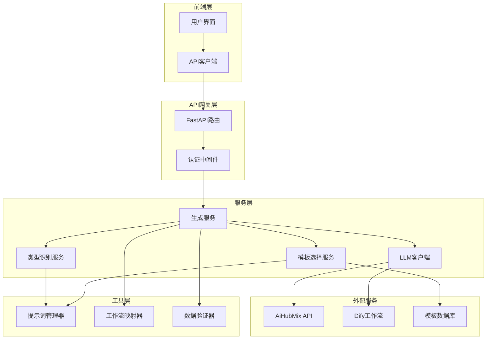

**架构图来源**
- [generate_service.py](file://backend/app/services/generate_service.py#L33-L465)
- [llm_client.py](file://backend/app/services/llm_client.py#L14-L217)
- [dify_workflow_client.py](file://backend/app/services/dify_workflow_client.py#L15-L196)

## 核心组件

### 生成服务（GenerateService）

生成服务是整个AI智能功能的核心协调器，负责管理三阶段智能生成流程：

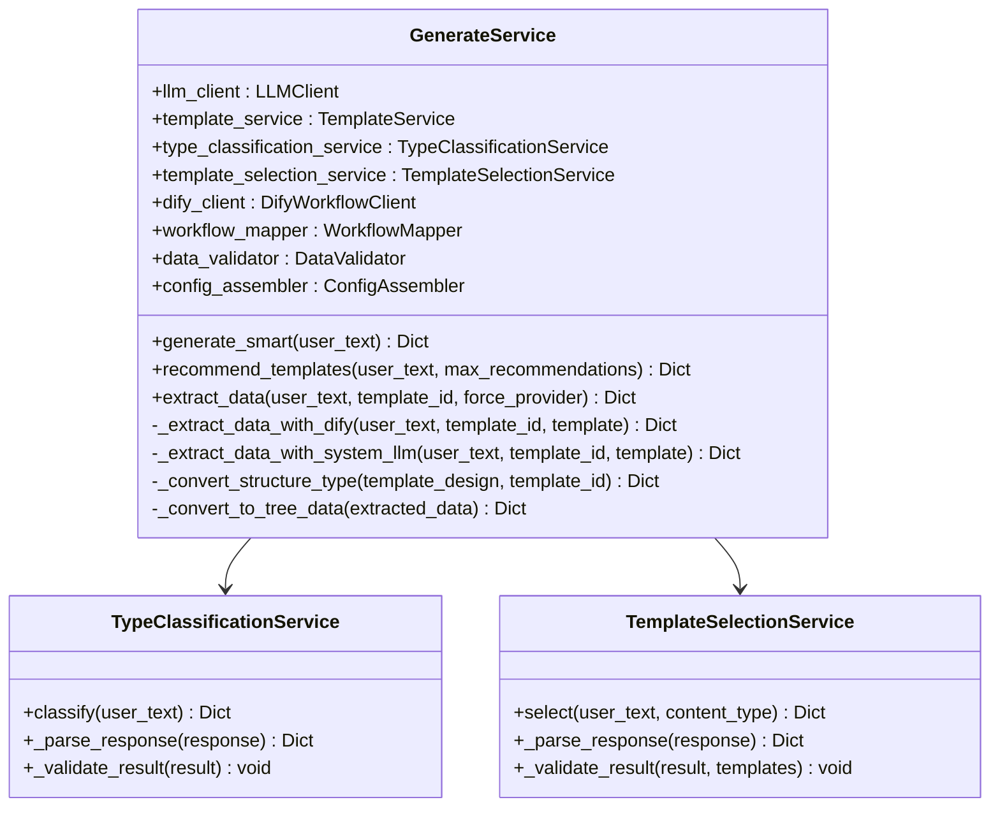

**类图来源**
- [generate_service.py](file://backend/app/services/generate_service.py#L33-L465)
- [type_classification_service.py](file://backend/app/services/type_classification_service.py#L14-L149)
- [template_selection_service.py](file://backend/app/services/template_selection_service.py#L15-L169)

### 类型识别服务

类型识别服务负责分析用户输入文本，将其归类到7种预定义的信息图类型之一：

| 类型 | 特征 | 关键词 | 示例 |
|------|------|--------|------|
| chart | 数值数据、统计信息 | 数据、增长率、比例、百分比 | "2023年Q1销售额1000万，Q2增长20%" |
| comparison | 事物对比、优劣分析 | VS、对比、优劣势、差异 | "产品A与产品B的功能对比" |
| hierarchy | 层级关系、等级划分 | 组织架构、层级、分类、体系 | "公司组织架构：CEO-部门经理-员工" |
| list | 并列项目、要点列举 | 要点、步骤、特性、功能 | "产品的五大功能：1.智能推荐 2.数据分析..." |
| quadrant | 二维划分、四象限 | 矩阵、象限、维度、重要紧急 | "任务分为重要紧急、重要不紧急等" |
| relationship | 关联关系、因果影响 | 关系、因果、影响、联系 | "用户增长影响因素：产品质量、营销投入" |
| sequence | 时间顺序、流程步骤 | 步骤、流程、过程、顺序 | "产品开发流程：需求分析-设计-开发" |

**表格来源**
- [llm_prompts.yaml](file://backend/app/config/llm_prompts.yaml#L19-L78)
- [type_classification_service.py](file://backend/app/services/type_classification_service.py#L22-L80)

### 模板选择服务

模板选择服务基于类型识别结果和用户输入内容，在相应类型的所有模板中选择最合适的模板：

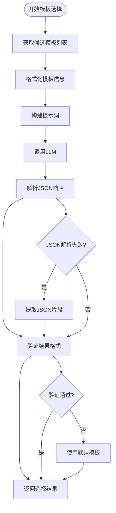

**流程图来源**
- [template_selection_service.py](file://backend/app/services/template_selection_service.py#L24-L88)

**节来源**
- [template_selection_service.py](file://backend/app/services/template_selection_service.py#L1-L169)

## 智能生成流程

智能生成流程是AI功能的核心，采用三阶段流水线架构：

### 阶段1：类型识别

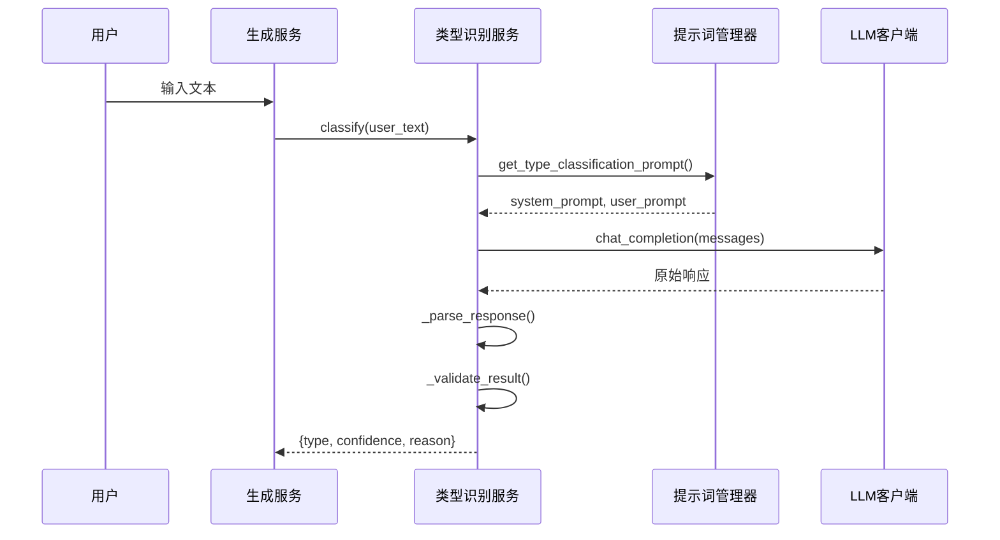

**序列图来源**
- [generate_service.py](file://backend/app/services/generate_service.py#L68-L72)
- [type_classification_service.py](file://backend/app/services/type_classification_service.py#L22-L73)

### 阶段2：模板选择

模板选择服务会根据识别的类型和用户输入内容，在相应类型的所有模板中进行智能匹配：

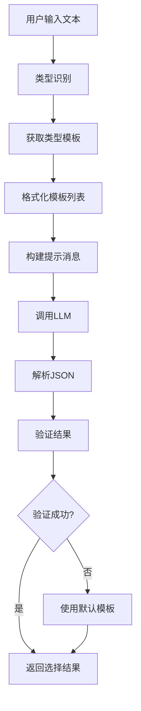

**流程图来源**
- [template_selection_service.py](file://backend/app/services/template_selection_service.py#L46-L88)

### 阶段3：数据提取

数据提取阶段支持两种模式：Dify工作流和系统LLM，优先使用Dify工作流，失败时自动回退：

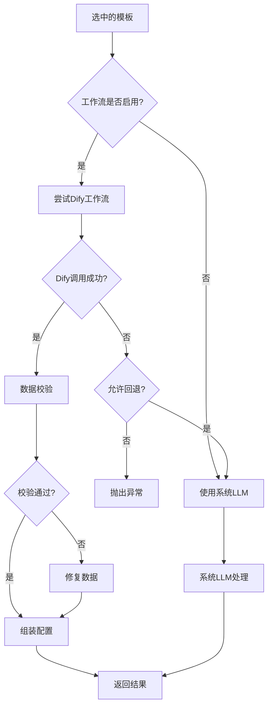

**流程图来源**
- [generate_service.py](file://backend/app/services/generate_service.py#L159-L257)

**节来源**
- [generate_service.py](file://backend/app/services/generate_service.py#L47-L118)

## 提示工程设计

提示工程是AI智能功能的核心技术，通过精心设计的提示词模板实现高质量的AI交互。

### 提示词管理架构

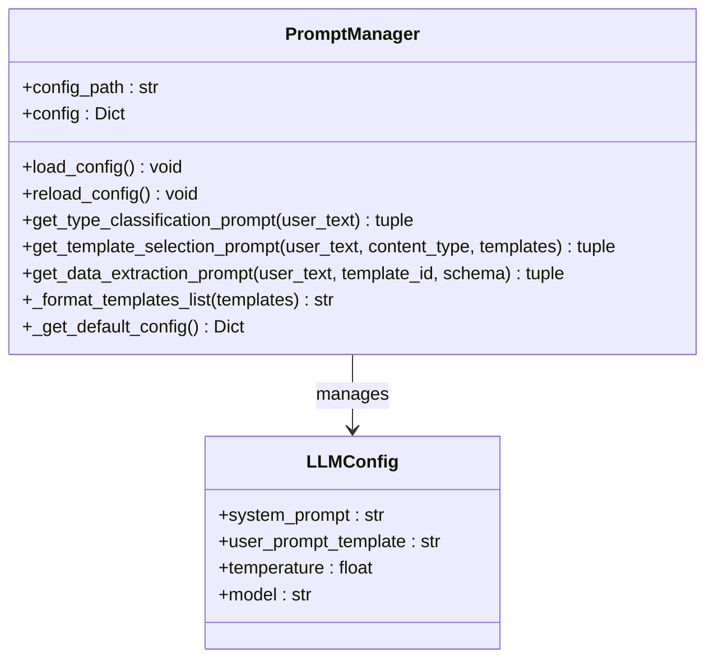

**类图来源**
- [prompt_manager.py](file://backend/app/utils/prompt_manager.py#L14-L216)

### 类型识别提示词设计

类型识别提示词采用了7大分类体系，每个分类都有明确的特征描述和关键词：

**系统提示词**：
```
你是一位专业的信息图分类专家，擅长识别文本内容的结构类型。
```

**用户提示词模板**：
```
请分析以下用户输入的文本内容，判断其最适合使用哪种信息图类型。

用户输入文本：
"{user_text}"

## 信息图7大分类体系：

### 1. 图表型 (chart)
- 特征：包含数值数据、统计信息、量化指标
- 关键词：数据、增长率、比例、百分比、趋势、统计、图表、指标
- 适用场景：销售数据、用户增长、KPI指标、财务报表、市场分析

### 2. 对比型 (comparison)
- 特征：两个或多个事物的对比、优劣分析、差异展示
- 关键词：VS、对比、优劣势、差异、区别、选择、竞争、比较
- 适用场景：产品对比、竞品分析、方案比较、优缺点对比

### 3. 层级型 (hierarchy)
- 特征：具有上下级、父子关系、分级结构、等级划分、荣誉体系
- 关键词：组织架构、层级、分类、体系、级别、树形、上下级、等级、荣誉、会员、徽章、段位、金字塔
- 适用场景：公司架构、产品分类、知识体系、职级体系、会员等级、荣誉体系、需求优先级

### 4. 列表型 (list)
- 特征：并列的项目、要点、特性、步骤
- 关键词：要点、步骤、特性、功能、特点、清单、列举
- 适用场景：产品功能、解决方案、服务项目、特性列表

### 5. 四象限型 (quadrant)
- 特征：两个维度划分，四个区域
- 关键词：矩阵、象限、维度、重要紧急、优先级、分类
- 适用场景：时间管理矩阵、优先级分类、SWOT分析、风险矩阵

### 6. 关系型 (relationship)
- 特征：元素之间的关联、因果、依赖、影响
- 关键词：关系、因果、影响、联系、相关、交互、依赖
- 适用场景：因果分析、业务流程、系统架构、关系网络

### 7. 顺序型 (sequence)
- 特征：有先后顺序、时间线、流程
- 关键词：步骤、流程、过程、顺序、阶段、时间线、发展、历史
- 适用场景：操作流程、项目进度、历史进程、用户旅程

## 分析指南：
1. 识别内容类型...
2. 特别注意...
3. 评估置信度...

请**必须以纯JSON格式返回**，不要包含任何markdown代码块标记，直接返回JSON对象：
```

**节来源**
- [llm_prompts.yaml](file://backend/app/config/llm_prompts.yaml#L1-L201)

### 模板选择提示词设计

模板选择提示词强调数据匹配度、视觉复杂度、数据项数量等选择策略：

**选择策略要点**：
1. **数据匹配度**：优先考虑模板的数据结构是否匹配文本中的信息
2. **视觉复杂度**：简单文本内容 → 选择simple、plain-text等简单模板
3. **数据项数量**：根据项目数量选择合适的布局
4. **特殊特征**：图标、数值百分比、时间信息等特征的影响
5. **层级型优先规则**：荣誉、会员、等级词汇的特殊处理

### 数据提取提示词设计

数据提取提示词提供了详细的字段说明和提取指导：

**关键字段说明**：
- `title`: 信息图的标题（如果文本没有明确标题，可以根据内容生成）
- `desc`: 信息图的描述或副标题
- `items`: 数据项列表，每个item包含label、desc等字段
  - `label`: 简短的标题或名称
  - `desc`: 详细的描述内容
  - `icon`: 图标标识（如果适用）
  - `value`: 数值（如果有百分比、分数等）

**节来源**
- [prompt_manager.py](file://backend/app/utils/prompt_manager.py#L1-L216)

## Dify工作流集成

Dify工作流集成提供了强大的数据生成能力，支持复杂的业务逻辑处理。

### 工作流映射配置

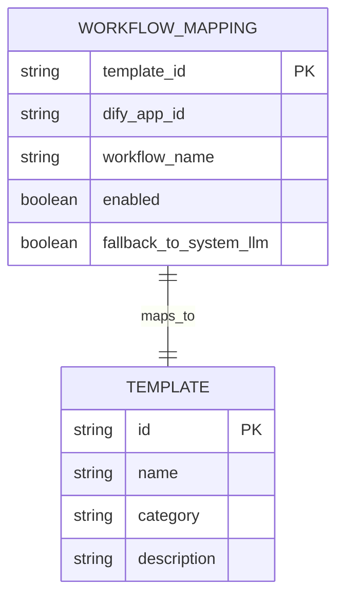

**实体关系图来源**
- [dify_workflows.yaml](file://backend/app/config/dify_workflows.yaml#L1-L81)
- [workflow_mapper.py](file://backend/app/services/workflow_mapper.py#L13-L157)

### Dify工作流客户端

Dify工作流客户端提供了完整的API调用封装：

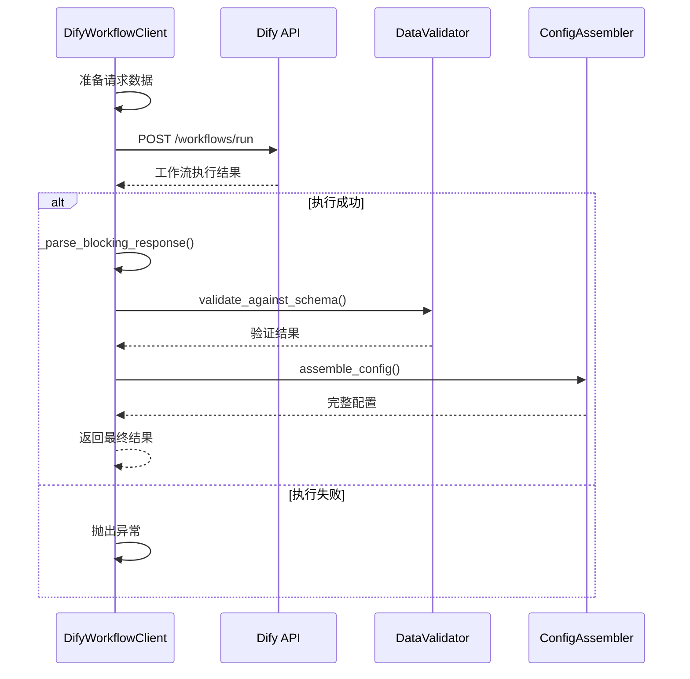

**序列图来源**
- [dify_workflow_client.py](file://backend/app/services/dify_workflow_client.py#L31-L196)

### 工作流调用机制

工作流调用支持重试机制和超时控制：

**主要特性**：
- **重试机制**：最多3次重试，指数退避
- **超时控制**：30秒超时限制
- **状态检查**：严格检查工作流执行状态
- **错误处理**：详细的错误信息和降级策略

**节来源**
- [dify_workflow_client.py](file://backend/app/services/dify_workflow_client.py#L1-L196)
- [workflow_mapper.py](file://backend/app/services/workflow_mapper.py#L1-L157)

## 数据提取算法

数据提取算法是AI智能功能的核心，负责将自然语言文本转换为结构化数据。

### 数据提取流程

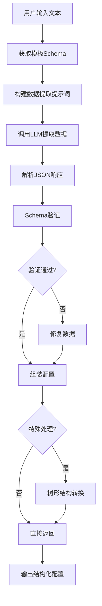

**流程图来源**
- [generate_service.py](file://backend/app/services/generate_service.py#L318-L452)

### 特殊数据处理

系统针对特定模板类型提供了专门的数据处理逻辑：

**组织架构树处理**：
- 将扁平的items数组转换为树形结构
- 支持层级关系的自动识别和转换
- 保留图标、描述等视觉元素信息

**结构类型转换**：
- 支持不兼容结构类型的自动转换
- 提供fallback映射机制
- 确保生成配置的兼容性

### 数据验证与修复

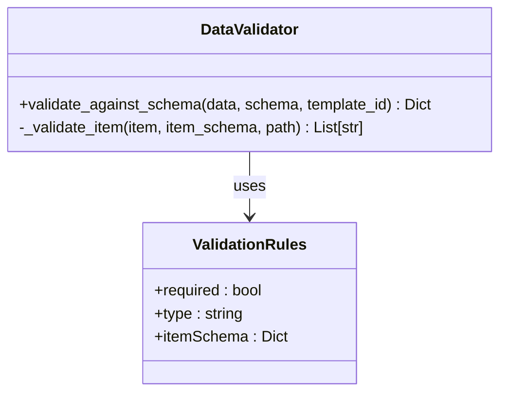

**类图来源**
- [data_validator.py](file://backend/app/services/data_validator.py#L11-L160)

**验证规则**：
1. **必填字段检查**：确保所有必需字段存在
2. **类型验证**：严格检查字段类型匹配
3. **数组项验证**：递归验证数组内对象结构
4. **自动修复**：尝试将字符串转换为数字等

**节来源**
- [generate_service.py](file://backend/app/services/generate_service.py#L318-L452)
- [data_validator.py](file://backend/app/services/data_validator.py#L1-L160)

## 性能优化策略

### 异步处理架构

系统采用完全异步的处理架构，确保高并发性能：

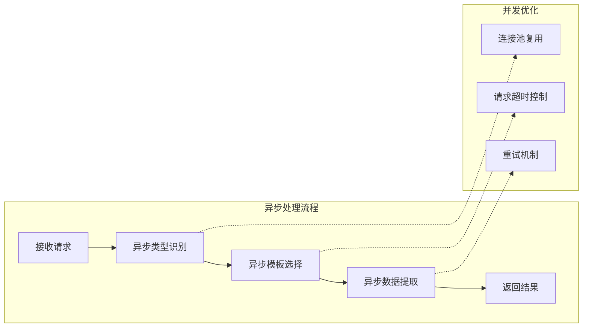

### 缓存机制

虽然当前版本主要依赖外部LLM服务，但系统设计支持多种缓存策略：

**潜在缓存点**：
1. **模板缓存**：缓存模板元数据和配置
2. **提示词缓存**：缓存生成的提示词模板
3. **LLM响应缓存**：缓存相似查询的结果
4. **工作流结果缓存**：缓存Dify工作流执行结果

### 性能监控

系统提供了详细的性能监控指标：

| 监控指标 | 描述 | 用途 |
|----------|------|------|
| phase1_classification | 类型识别耗时 | 评估识别效率 |
| phase2_selection | 模板选择耗时 | 优化选择算法 |
| phase3_extraction | 数据提取耗时 | 监控LLM性能 |
| dify_call_time | Dify工作流耗时 | 评估外部服务性能 |
| total | 总处理时间 | 整体性能评估 |

**节来源**
- [generate_service.py](file://backend/app/services/generate_service.py#L104-L117)

## 错误处理与降级

### 多层错误处理机制

系统实现了完善的错误处理和降级机制：

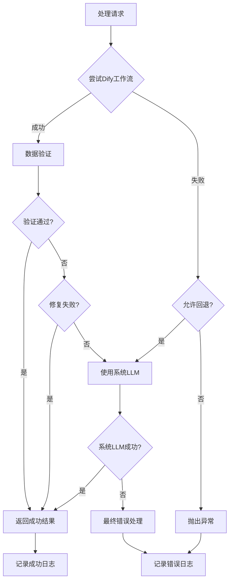

**流程图来源**
- [generate_service.py](file://backend/app/services/generate_service.py#L218-L246)

### 降级策略

**工作流降级**：
1. **自动检测**：系统自动检测工作流执行状态
2. **条件回退**：根据配置决定是否回退到系统LLM
3. **无缝切换**：保证用户体验不受影响

**LLM降级**：
1. **模型切换**：从主要模型切换到备用模型
2. **参数调整**：降低温度参数提高稳定性
3. **提示词简化**：使用更简单的提示词模板

### 错误恢复机制

**重试策略**：
- **指数退避**：每次重试间隔逐渐增加
- **最大重试次数**：避免无限重试
- **超时控制**：防止长时间等待

**异常分类**：
1. **网络异常**：重试或降级
2. **API异常**：参数调整或模型切换
3. **解析异常**：提示词修正或手动干预

**节来源**
- [generate_service.py](file://backend/app/services/generate_service.py#L218-L246)
- [dify_workflow_client.py](file://backend/app/services/dify_workflow_client.py#L115-L131)

## 配置管理

### 配置层次结构

系统采用分层配置管理，支持环境变量覆盖和动态配置更新：

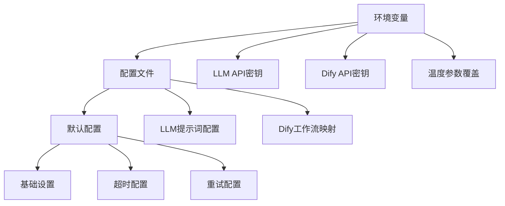

**配置来源**
- [config.py](file://backend/app/config.py#L9-L51)
- [llm_prompts.yaml](file://backend/app/config/llm_prompts.yaml#L1-L201)
- [dify_workflows.yaml](file://backend/app/config/dify_workflows.yaml#L1-L81)

### 动态配置更新

系统支持配置的热更新：

**支持热更新的配置**：
1. **提示词配置**：无需重启即可更新提示词模板
2. **工作流映射**：动态启用或禁用工作流
3. **LLM参数**：实时调整温度、模型等参数

**更新机制**：
- **文件监控**：监听配置文件变化
- **手动刷新**：提供API接口手动刷新配置
- **渐进式更新**：确保更新过程的稳定性

**节来源**
- [config.py](file://backend/app/config.py#L1-L51)
- [prompt_manager.py](file://backend/app/utils/prompt_manager.py#L53-L57)

## 测试与监控

### 单元测试

系统提供了完整的单元测试覆盖：

**测试范围**：
1. **类型识别服务测试**：验证7种类型的识别准确性
2. **模板选择服务测试**：测试模板匹配逻辑
3. **数据提取服务测试**：验证数据转换准确性
4. **工作流集成测试**：测试Dify工作流调用

**测试用例设计**：
```python
# 测试用例示例
test_cases = [
    {
        "name": "顺序型 - 产品开发流程",
        "text": "产品开发流程包括：需求分析、设计、开发、测试、上线五个阶段",
        "expected_type": "sequence"
    },
    {
        "name": "列表型 - 产品功能列表",
        "text": "我们的产品有五大核心功能：智能推荐、数据分析、用户管理、报表生成、权限控制",
        "expected_type": "list"
    }
]
```

### 集成测试

集成测试验证完整的三阶段流程：

**测试重点**：
1. **流程完整性**：验证三阶段流程的正确性
2. **性能指标**：监控各阶段耗时
3. **错误处理**：测试各种异常情况
4. **结果一致性**：确保多次运行结果一致

### 监控指标

系统提供了全面的监控指标：

**核心指标**：
- **成功率**：各阶段的成功率统计
- **响应时间**：各阶段的平均响应时间
- **错误率**：各类错误的发生频率
- **资源使用**：LLM API调用次数和费用

**告警机制**：
- **性能告警**：响应时间超过阈值时告警
- **错误告警**：错误率超过阈值时告警
- **可用性告警**：服务不可用时告警

**节来源**
- [test_smart_generation.py](file://tests/backend/test_smart_generation.py#L1-L157)

## 总结

AI智能功能通过模块化设计和多层次的优化策略，实现了高效、可靠的智能生成能力。系统的主要优势包括：

### 技术优势

1. **模块化架构**：清晰的职责分离，便于维护和扩展
2. **多LLM支持**：灵活的提供商选择和自动降级机制
3. **智能提示工程**：精心设计的提示词模板和参数调优
4. **完善的错误处理**：多层次的错误处理和降级策略
5. **性能监控**：全面的性能指标和监控机制

### 应用价值

1. **提升用户体验**：自动化程度高，操作简单直观
2. **提高生成质量**：基于LLM的智能分析确保生成质量
3. **降低使用门槛**：无需专业知识即可生成专业级信息图
4. **支持个性化定制**：灵活的配置选项满足不同需求

### 发展方向

1. **缓存优化**：引入多级缓存机制提升性能
2. **模型优化**：持续优化提示词和模型参数
3. **功能扩展**：支持更多类型的模板和数据结构
4. **性能监控**：建立更完善的监控和告警体系

该AI智能功能为信息图生成提供了强大而灵活的解决方案，通过持续的技术优化和功能完善，将为用户提供更加优秀的智能创作体验。