# 工作流集成

<cite>
**本文档引用的文件**
- [dify_workflows.yaml](file://backend/app/config/dify_workflows.yaml)
- [dify_workflow_client.py](file://backend/app/services/dify_workflow_client.py)
- [workflow_mapper.py](file://backend/app/services/workflow_mapper.py)
- [generate_service.py](file://backend/app/services/generate_service.py)
- [config.py](file://backend/app/config.py)
- [generate.py](file://backend/app/api/v1/generate.py)
- [client.ts](file://frontend/src/api/client.ts)
- [work.ts](file://frontend/src/api/work.ts)
- [.env](file://backend/.env)
- [test_dify_integration.py](file://tests/backend/test_dify_integration.py)
- [test_dify_simple.py](file://tests/backend/test_dify_simple.py)
- [check_workflow_config.py](file://tests/backend/check_workflow_config.py)
</cite>

## 目录
1. [简介](#简介)
2. [系统架构概览](#系统架构概览)
3. [YAML配置文件详解](#yaml配置文件详解)
4. [Dify工作流客户端](#dify工作流客户端)
5. [工作流映射管理器](#工作流映射管理器)
6. [生成服务集成](#生成服务集成)
7. [客户端API调用](#客户端api调用)
8. [错误处理与重试机制](#错误处理与重试机制)
9. [配置热更新能力](#配置热更新能力)
10. [监控与日志记录](#监控与日志记录)
11. [最佳实践与故障排除](#最佳实践与故障排除)

## 简介

Dify工作流集成是AntV Infographic系统的核心功能之一，它通过外部工作流引擎增强AI能力，提供更专业、结构化的数据生成功能。该集成机制允许系统根据不同的图表模板自动选择合适的工作流，实现智能化的数据提取和结构化处理。

### 主要特性

- **模板驱动的工作流映射**：每个图表模板对应特定的Dify工作流
- **智能回退机制**：当工作流失败时自动回退到系统LLM
- **异步处理能力**：支持长时间任务的异步执行
- **配置热更新**：无需重启服务即可应用新的工作流设置
- **完善的错误处理**：多层次的重试和错误恢复机制
- **详细的监控日志**：全面的执行状态跟踪和性能监控

## 系统架构概览

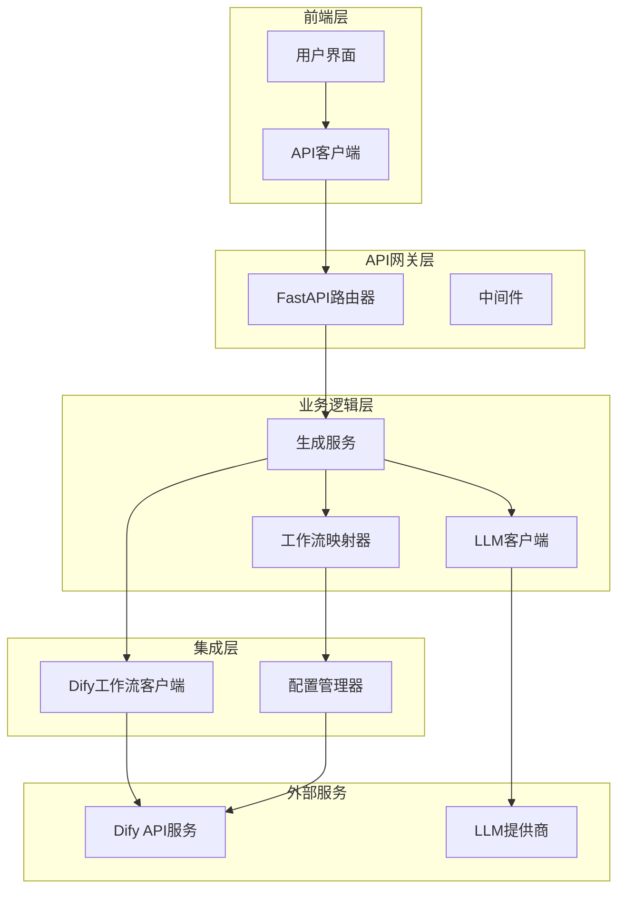

**架构图源文件**
- [generate_service.py](file://backend/app/services/generate_service.py#L33-L465)
- [dify_workflow_client.py](file://backend/app/services/dify_workflow_client.py#L15-L196)
- [workflow_mapper.py](file://backend/app/services/workflow_mapper.py#L13-L157)

## YAML配置文件详解

### 配置文件结构

Dify工作流配置存储在`backend/app/config/dify_workflows.yaml`文件中，采用YAML格式定义模板与工作流的映射关系。

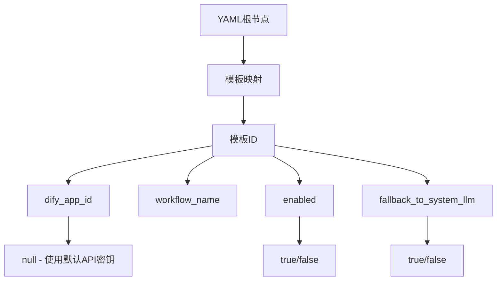

**配置图源文件**
- [dify_workflows.yaml](file://backend/app/config/dify_workflows.yaml#L1-L81)

### 配置项说明

| 配置项 | 类型 | 描述 | 默认值 |
|--------|------|------|--------|
| `dify_app_id` | string/null | Dify应用ID，null表示使用环境变量中的默认API密钥 | null |
| `workflow_name` | string | 工作流显示名称，用于日志和调试 | 必填 |
| `enabled` | boolean | 是否启用该模板的工作流 | true |
| `fallback_to_system_llm` | boolean | 工作流失败时是否回退到系统LLM | true |

### 支持的模板类型

系统支持多种图表模板的工作流集成：

| 模板类别 | 支持的模板 | 工作流用途 |
|----------|------------|------------|
| **图表类** | `chart-column-simple`, `bar-chart-vertical`, `chart-bar-horizontal` | 数据可视化图表生成 |
| **列表类** | `list-column-simple`, `list-row-horizontal-icon-arrow` | 结构化列表数据生成 |
| **层级类** | `org-tree`, `pyramid-layer` | 层级关系数据生成 |
| **关系类** | `mindmap-radial` | 思维导图关系数据生成 |
| **时间线类** | `timeline-horizontal` | 时间序列数据生成 |
| **对比类** | `comparison-column` | 对比分析数据生成 |
| **四象限类** | `quadrant-swot` | 分析模型数据生成 |

**章节源文件**
- [dify_workflows.yaml](file://backend/app/config/dify_workflows.yaml#L1-L81)

## Dify工作流客户端

### 客户端架构

Dify工作流客户端封装了与Dify API的所有交互逻辑，支持阻塞模式调用和异步处理。

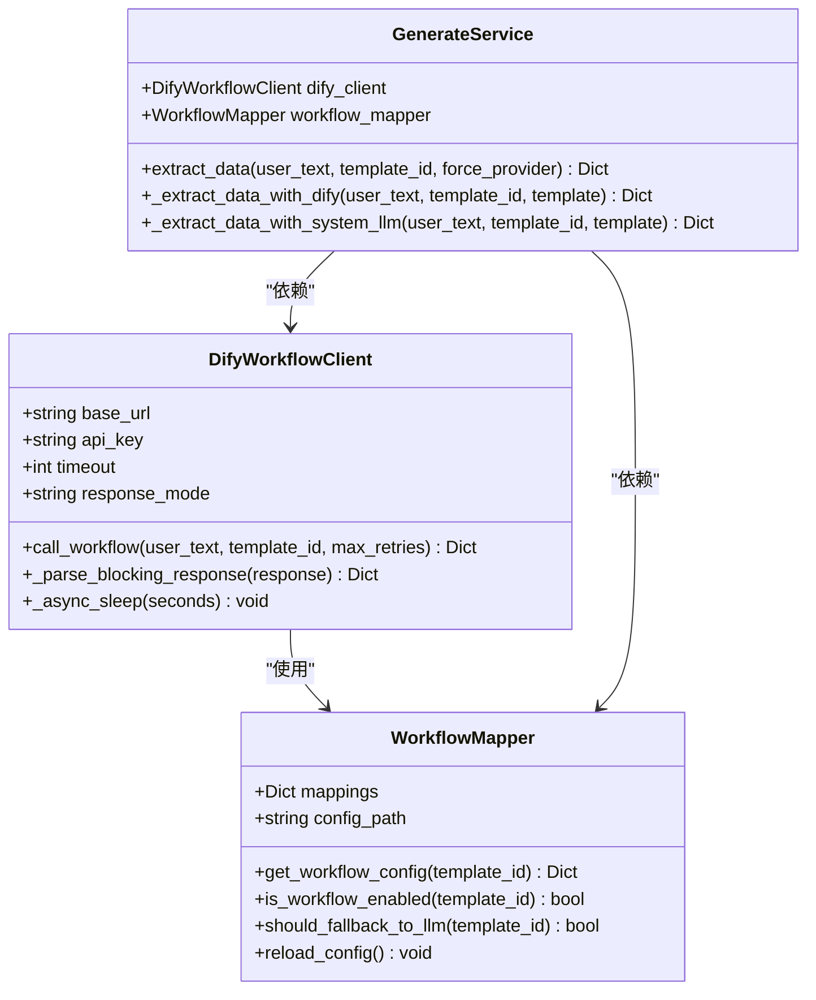

**类图源文件**
- [dify_workflow_client.py](file://backend/app/services/dify_workflow_client.py#L15-L196)
- [workflow_mapper.py](file://backend/app/services/workflow_mapper.py#L13-L157)
- [generate_service.py](file://backend/app/services/generate_service.py#L33-L465)

### API调用流程

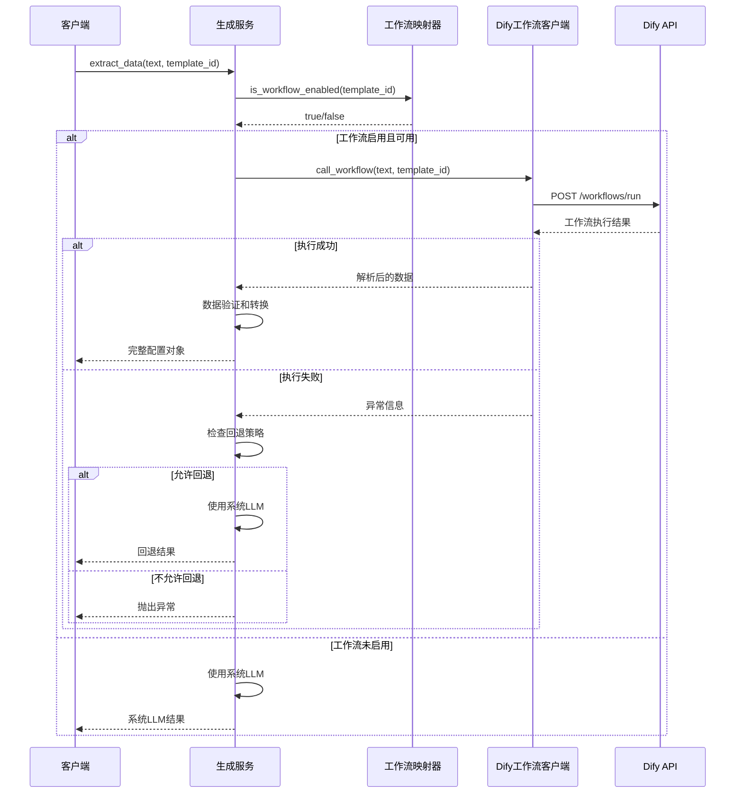

**序列图源文件**
- [generate_service.py](file://backend/app/services/generate_service.py#L159-L257)
- [dify_workflow_client.py](file://backend/app/services/dify_workflow_client.py#L31-L132)

### 请求参数格式

Dify工作流客户端发送的请求遵循以下格式：

| 参数 | 类型 | 描述 | 示例 |
|------|------|------|------|
| `inputs.content` | string | 用户输入的文本内容 | "2023年各城市销售额..." |
| `inputs.template` | string | 模板ID（可选） | "bar-chart-vertical" |
| `response_mode` | string | 响应模式 | "blocking" |
| `user` | string | 用户标识 | "system-user" |

### 响应解析机制

客户端实现了智能的响应解析逻辑：

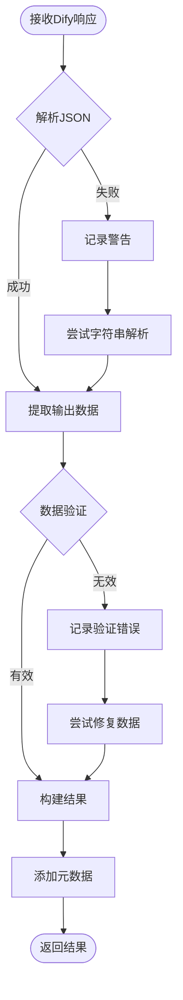

**流程图源文件**
- [dify_workflow_client.py](file://backend/app/services/dify_workflow_client.py#L134-L178)

**章节源文件**
- [dify_workflow_client.py](file://backend/app/services/dify_workflow_client.py#L1-L196)

## 工作流映射管理器

### 映射器职责

工作流映射管理器负责维护模板ID与Dify工作流之间的映射关系，提供配置加载、查询和热更新功能。

### 配置加载机制

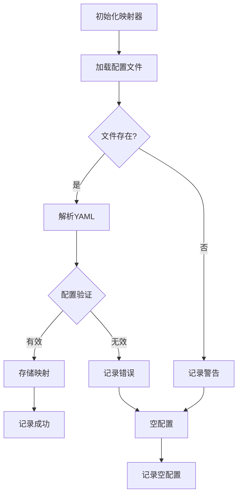

**流程图源文件**
- [workflow_mapper.py](file://backend/app/services/workflow_mapper.py#L27-L48)

### 查询接口

映射器提供了多个查询接口来满足不同场景的需求：

| 方法 | 功能 | 返回类型 | 用途 |
|------|------|----------|------|
| `get_workflow_config()` | 获取完整配置 | Dict | 完整配置查询 |
| `is_workflow_enabled()` | 检查是否启用 | bool | 启用状态检查 |
| `should_fallback_to_llm()` | 检查回退策略 | bool | 错误处理决策 |
| `get_workflow_name()` | 获取工作流名称 | string | 日志和调试 |
| `get_app_id()` | 获取应用ID | string/null | API调用 |

### 热更新支持

映射器支持配置的热更新，无需重启服务即可应用新的工作流设置：

```python
# 重新加载配置
mapper.reload_config()
```

**章节源文件**
- [workflow_mapper.py](file://backend/app/services/workflow_mapper.py#L1-L157)

## 生成服务集成

### 三阶段生成流程

生成服务实现了智能的三阶段生成流程，充分利用Dify工作流的能力：

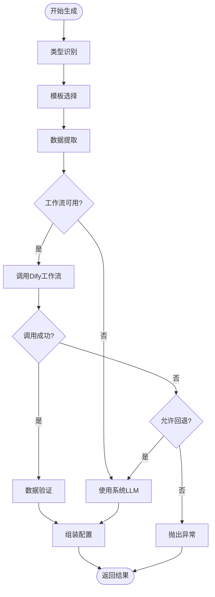

**流程图源文件**
- [generate_service.py](file://backend/app/services/generate_service.py#L47-L118)

### 强制提供商选择

生成服务支持强制指定数据提取提供商：

| 提供商 | 描述 | 使用场景 |
|--------|------|----------|
| `system` | 使用系统LLM | 测试、调试、离线模式 |
| `dify` | 使用Dify工作流 | 生产环境、高质量数据 |
| `None` | 自动选择 | 默认行为，智能决策 |

### 数据验证与转换

系统实现了完善的数据验证和转换机制：

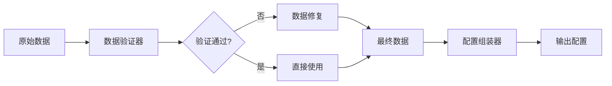

**图表源文件**
- [generate_service.py](file://backend/app/services/generate_service.py#L284-L306)

**章节源文件**
- [generate_service.py](file://backend/app/services/generate_service.py#L1-L465)

## 客户端API调用

### 前端API客户端

前端使用TypeScript封装了与后端的通信逻辑，支持异步调用和错误处理。

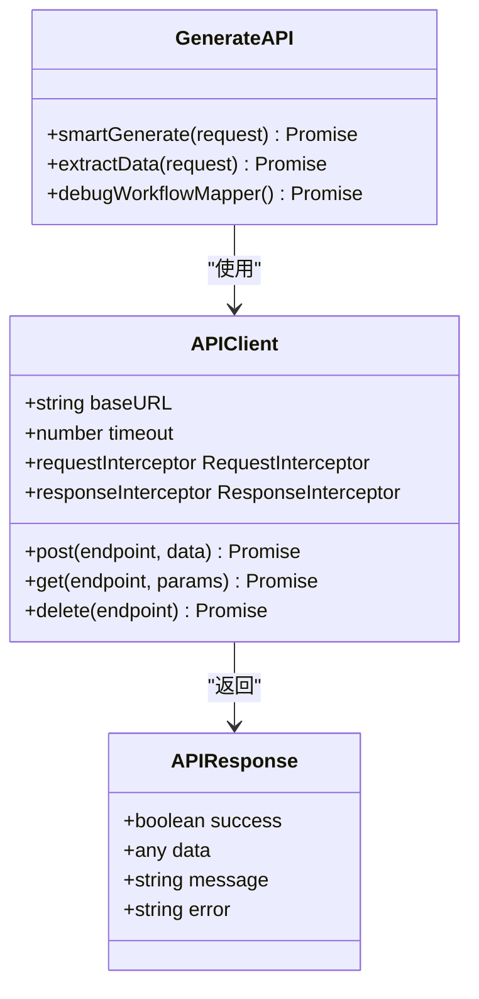

**类图源文件**
- [client.ts](file://frontend/src/api/client.ts#L1-L45)
- [work.ts](file://frontend/src/api/work.ts#L1-L62)

### 超时配置

前端API客户端配置了适当的超时时间以支持Dify工作流的处理：

| 配置项 | 值 | 说明 |
|--------|-----|------|
| `timeout` | 120000ms | 2分钟超时，支持长时间工作流处理 |
| `headers.Content-Type` | `application/json` | JSON请求格式 |

### 错误处理

客户端实现了完整的错误处理机制：

```typescript
// 请求拦截器
apiClient.interceptors.request.use(
  (config) => {
    // 添加认证等处理
    return config;
  },
  (error) => {
    return Promise.reject(error);
  }
);

// 响应拦截器
apiClient.interceptors.response.use(
  (response) => {
    return response.data;
  },
  (error) => {
    console.error('API请求失败:', error);
    return Promise.reject(error);
  }
);
```

**章节源文件**
- [client.ts](file://frontend/src/api/client.ts#L1-L45)

## 错误处理与重试机制

### 多层次错误处理

系统实现了多层次的错误处理和重试机制：

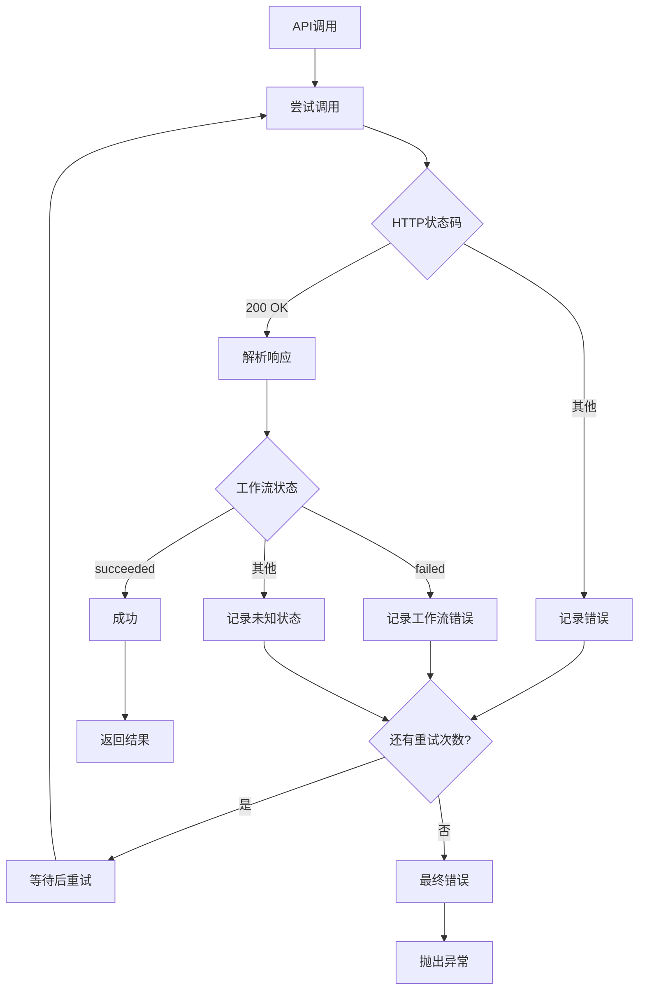

**流程图源文件**
- [dify_workflow_client.py](file://backend/app/services/dify_workflow_client.py#L80-L132)

### 重试策略

| 错误类型 | 重试次数 | 重试间隔 | 处理策略 |
|----------|----------|----------|----------|
| `httpx.TimeoutException` | 3次 | 1秒 | 记录警告，继续重试 |
| `httpx.RequestError` | 3次 | 1秒 | 记录警告，继续重试 |
| 其他异常 | 3次 | 1秒 | 记录警告，继续重试 |
| 工作流执行失败 | 0次 | N/A | 直接抛出异常 |

### 错误恢复机制

系统提供了智能的错误恢复机制：

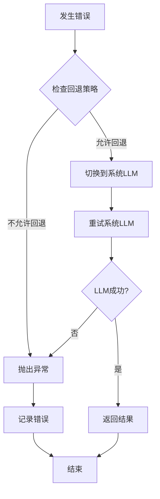

**图表源文件**
- [generate_service.py](file://backend/app/services/generate_service.py#L240-L245)

**章节源文件**
- [dify_workflow_client.py](file://backend/app/services/dify_workflow_client.py#L108-L132)
- [generate_service.py](file://backend/app/services/generate_service.py#L238-L245)

## 配置热更新能力

### 环境变量支持

系统支持通过环境变量动态配置Dify工作流：

| 环境变量 | 描述 | 示例值 |
|----------|------|--------|
| `DIFY_API_BASE_URL` | Dify API基础URL | `https://dify-uat.42lab.cn/v1` |
| `DIFY_API_KEY` | API访问密钥 | `app-ufCoCpuVJbL627fuaBC61KHT` |
| `DIFY_API_TIMEOUT` | API调用超时时间（秒） | `90` |
| `DIFY_RESPONSE_MODE` | 响应模式 | `blocking` |

### 配置重新加载

映射器支持配置的热更新：

```python
# 重新加载配置
mapper.reload_config()

# 获取最新配置
current_config = mapper.get_workflow_config(template_id)
```

### 热更新流程

```mermaid
sequenceDiagram
operator[运维人员] ->> config_file[修改配置文件]
config_file ->> watcher[文件监控器]
watcher ->> mapper[通知配置变更]
mapper ->> mapper[重新加载配置]
mapper -->> service[配置已更新]
service ->> service[使用新配置]
```

**序列图源文件**
- [workflow_mapper.py](file://backend/app/services/workflow_mapper.py#L138-L141)

**章节源文件**
- [config.py](file://backend/app/config.py#L31-L36)
- [workflow_mapper.py](file://backend/app/services/workflow_mapper.py#L138-L141)

## 监控与日志记录

### 日志级别配置

系统使用Python的logging模块实现分级日志记录：

| 日志级别 | 使用场景 | 示例消息 |
|----------|----------|----------|
| `DEBUG` | 详细调试信息 | `[DifyWorkflowClient] 调用工作流 (尝试 1/3)` |
| `INFO` | 一般信息记录 | `[DifyWorkflowClient] 调用成功 - 工作流ID: xxx, 耗时: 2.34s` |
| `WARNING` | 警告信息 | `[DifyWorkflowClient] 请求超时: timeout` |
| `ERROR` | 错误信息 | `[DifyWorkflowClient] Dify工作流调用失败` |

### 关键监控指标

系统监控以下关键指标：

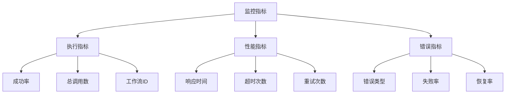

### 调试端点

系统提供了专门的调试端点用于监控工作流状态：

```python
@router.get("/debug/workflow-mapper", summary="查看WorkflowMapper调试信息")
async def debug_workflow_mapper():
    """调试端点：查看WorkflowMapper的状态"""
    mapper = get_workflow_mapper()
    
    test_template_ids = ['bar-chart-vertical', 'list-row-horizontal-icon-arrow', 'chart-column-simple']
    
    debug_info = {
        "config_path": mapper.config_path,
        "total_mappings": len(mapper.mappings),
        "all_template_ids": list(mapper.mappings.keys()),
        "test_results": {}
    }
    
    for template_id in test_template_ids:
        debug_info["test_results"][template_id] = {
            "is_workflow_enabled": mapper.is_workflow_enabled(template_id),
            "config": mapper.get_workflow_config(template_id),
            "workflow_name": mapper.get_workflow_name(template_id)
        }
    
    return APIResponse(success=True, data=debug_info, message="WorkflowMapper调试信息")
```

### 日志示例

以下是典型的工作流调用日志：

```
[2024-01-15 10:30:15] INFO [DifyWorkflowClient] 调用工作流 (尝试 1/3) - 模板: bar-chart-vertical, 文本长度: 120
[2024-01-15 10:30:18] INFO [DifyWorkflowClient] HTTP状态码: 200
[2024-01-15 10:30:18] INFO [DifyWorkflowClient] 响应内容: {"data":{"status":"succeeded","outputs":{"output":"{\"items\":[...]}"}}}
[2024-01-15 10:30:18] INFO [DifyWorkflowClient] 调用成功 - 工作流ID: wf-123456789, 耗时: 2.34s
```

**章节源文件**
- [generate.py](file://backend/app/api/v1/generate.py#L90-L115)
- [dify_workflow_client.py](file://backend/app/services/dify_workflow_client.py#L83-L111)

## 最佳实践与故障排除

### 配置最佳实践

1. **工作流命名规范**
   - 使用描述性的工作流名称
   - 包含模板类型和用途信息
   - 避免使用特殊字符

2. **回退策略配置**
   - 生产环境建议启用回退机制
   - 测试环境可根据需求调整
   - 关键业务必须启用回退

3. **超时时间设置**
   - 根据工作流复杂度调整超时时间
   - 建议生产环境设置为60-120秒
   - 开发环境可适当缩短

### 故障排除指南

#### 常见问题及解决方案

| 问题症状 | 可能原因 | 解决方案 |
|----------|----------|----------|
| 工作流调用失败 | API密钥无效 | 检查DIFY_API_KEY配置 |
| 响应超时 | 网络连接问题 | 检查网络连通性，增加超时时间 |
| 数据格式错误 | 工作流输出格式变化 | 更新数据解析逻辑 |
| 配置不生效 | 配置文件路径错误 | 检查配置文件路径和权限 |

#### 调试步骤

1. **检查配置文件**
   ```bash
   python tests/backend/check_workflow_config.py
   ```

2. **测试API连接**
   ```bash
   python tests/backend/test_dify_simple.py
   ```

3. **运行完整集成测试**
   ```bash
   python tests/backend/test_dify_integration.py
   ```

4. **查看日志输出**
   - 检查Dify API调用日志
   - 分析错误堆栈信息
   - 监控重试机制

### 性能优化建议

1. **缓存策略**
   - 缓存工作流映射配置
   - 实现客户端请求缓存
   - 使用CDN加速静态资源

2. **并发控制**
   - 限制同时进行的工作流调用数量
   - 实现请求队列机制
   - 设置合理的超时阈值

3. **监控告警**
   - 设置成功率告警
   - 监控响应时间趋势
   - 建立错误率基线

### 安全考虑

1. **API密钥保护**
   - 使用环境变量存储敏感信息
   - 定期轮换API密钥
   - 限制密钥访问权限

2. **输入验证**
   - 验证用户输入长度和格式
   - 过滤危险字符
   - 实施速率限制

3. **审计日志**
   - 记录所有API调用
   - 跟踪工作流执行历史
   - 监控异常访问模式

**章节源文件**
- [test_dify_integration.py](file://tests/backend/test_dify_integration.py#L1-L64)
- [test_dify_simple.py](file://tests/backend/test_dify_simple.py#L1-L41)
- [check_workflow_config.py](file://tests/backend/check_workflow_config.py#L1-L43)