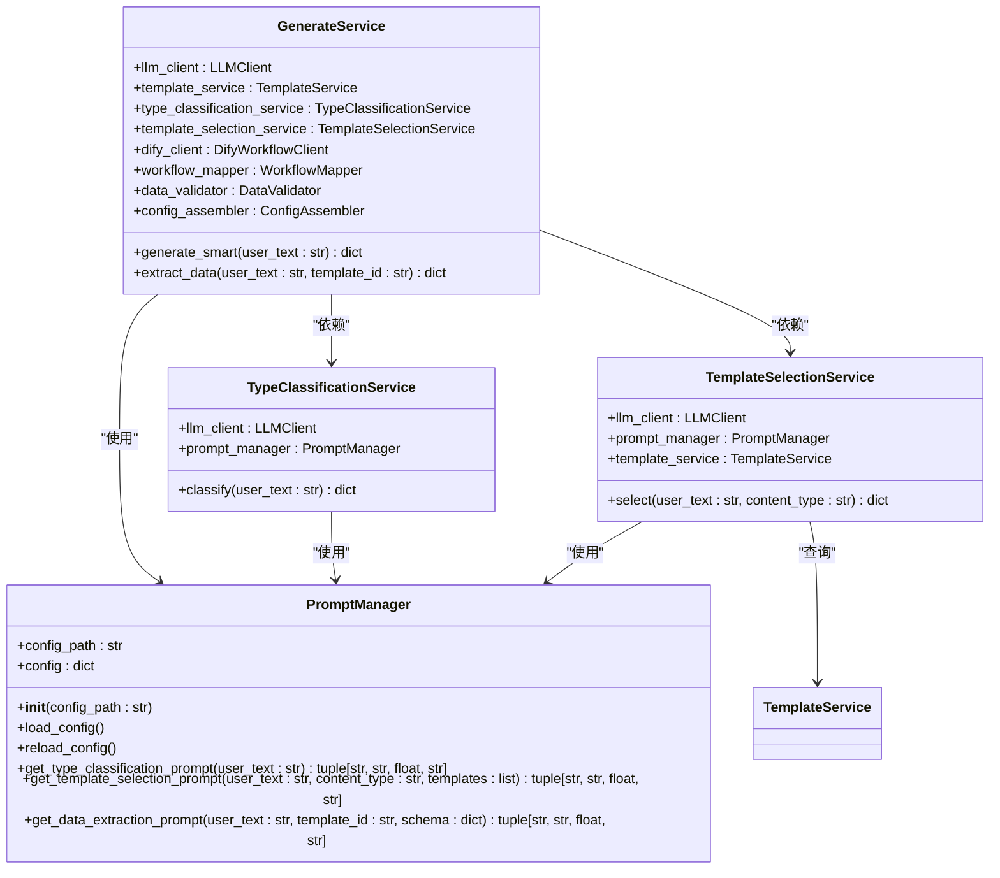
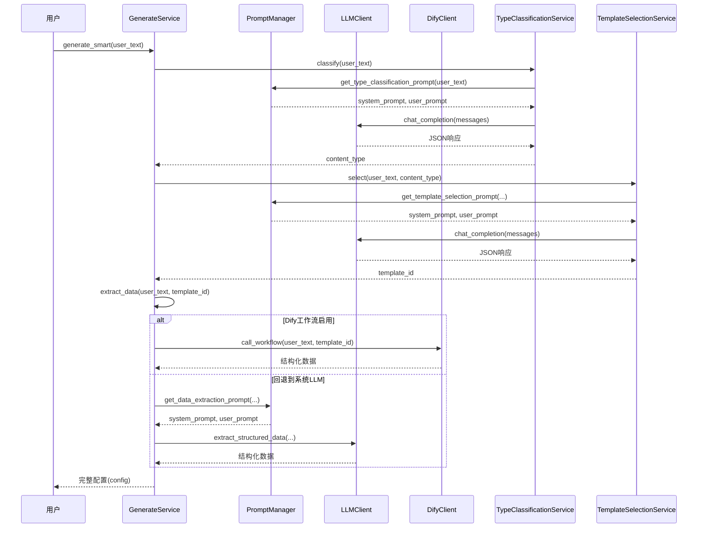

# 提示工程

<cite>
**本文档中引用的文件**   
- [prompt_manager.py](file://backend/app/utils/prompt_manager.py)
- [prompts.py](file://backend/app/utils/prompts.py)
- [llm_prompts.yaml](file://backend/app/config/llm_prompts.yaml)
- [dify_workflows.yaml](file://backend/app/config/dify_workflows.yaml)
- [generate_service.py](file://backend/app/services/generate_service.py)
- [type_classification_service.py](file://backend/app/services/type_classification_service.py)
- [template_selection_service.py](file://backend/app/services/template_selection_service.py)
- [data_validator.py](file://backend/app/services/data_validator.py)
- [config_assembler.py](file://backend/app/services/config_assembler.py)
- [workflow_mapper.py](file://backend/app/services/workflow_mapper.py)
- [template_service.py](file://backend/app/services/template_service.py)
- [template.py](file://backend/app/models/template.py)
</cite>

## 目录
1. [引言](#引言)
2. [提示模板的组织结构与管理机制](#提示模板的组织结构与管理机制)
3. [YAML配置文件与运行时动态组装](#yaml配置文件与运行时动态组装)
4. [提示词版本控制与多语言支持](#提示词版本控制与多语言支持)
5. [安全防护措施](#安全防护措施)
6. [A/B测试机制](#ab测试机制)
7. [最佳实践指南](#最佳实践指南)
8. [结论](#结论)

## 引言

本项目是一个基于大语言模型（LLM）的智能信息图生成系统，其核心在于一套精密的提示工程（Prompt Engineering）设计。系统通过三阶段智能生成流程，将用户输入的自然语言文本自动转换为结构化的信息图配置。该流程包括：内容类型识别、模板智能选择和数据提取生成。整个过程由精心设计的提示词（Prompts）驱动，这些提示词通过YAML配置文件进行集中管理，并在运行时根据上下文动态组装，确保了系统的灵活性和可维护性。

**Section sources**
- [generate_service.py](file://backend/app/services/generate_service.py#L47-L118)

## 提示模板的组织结构与管理机制

系统的提示模板采用分层分类的组织结构，围绕信息图的7大核心分类体系构建。这7大分类分别是：图表型（chart）、对比型（comparison）、层级型（hierarchy）、列表型（list）、四象限型（quadrant）、关系型（relationship）和顺序型（sequence）。每个分类都有其独特的特征、关键词和适用场景。

提示模板的管理由`PromptManager`类负责，它是一个单例模式的管理器，负责加载和管理所有LLM提示词配置。该管理器从`llm_prompts.yaml`配置文件中读取提示词模板，并提供统一的接口供上层服务调用。这种设计实现了提示词与业务逻辑的解耦，使得提示词的修改和优化无需改动核心代码。



**Diagram sources**
- [prompt_manager.py](file://backend/app/utils/prompt_manager.py#L14-L216)
- [generate_service.py](file://backend/app/services/generate_service.py#L33-L465)
- [type_classification_service.py](file://backend/app/services/type_classification_service.py#L14-L149)
- [template_selection_service.py](file://backend/app/services/template_selection_service.py#L15-L169)

**Section sources**
- [prompt_manager.py](file://backend/app/utils/prompt_manager.py#L14-L216)
- [prompts.py](file://backend/app/utils/prompts.py#L9-L247)

## YAML配置文件与运行时动态组装

系统的核心提示词配置存储在`llm_prompts.yaml`文件中。该文件定义了三个关键阶段的提示词：类型识别（`type_classification`）、模板选择（`template_selection`）和数据提取（`data_extraction`）。每个阶段都包含一个系统提示词（`system_prompt`）和一个用户提示词模板（`user_prompt_template`）。

在运行时，系统会动态地将这些模板中的占位符（如`{user_text}`、`{content_type}`、`{templates_list}`）替换为实际的运行时数据，从而组装出最终发送给LLM的完整提示词。例如，在类型识别阶段，系统会将用户输入的文本填充到`user_prompt_template`中，形成一个具体的、上下文相关的指令。

此外，系统还通过`dify_workflows.yaml`文件管理Dify工作流的映射关系。该文件定义了哪些模板ID启用了外部Dify工作流，以及相应的回退策略。这使得系统可以在使用外部高级工作流和内部LLM之间灵活切换，实现了提示生成策略的动态组装。



**Diagram sources**
- [llm_prompts.yaml](file://backend/app/config/llm_prompts.yaml#L1-L201)
- [dify_workflows.yaml](file://backend/app/config/dify_workflows.yaml#L1-L81)
- [generate_service.py](file://backend/app/services/generate_service.py#L159-L357)

**Section sources**
- [llm_prompts.yaml](file://backend/app/config/llm_prompts.yaml#L1-L201)
- [dify_workflows.yaml](file://backend/app/config/dify_workflows.yaml#L1-L81)
- [generate_service.py](file://backend/app/services/generate_service.py#L159-L357)

## 提示词版本控制与多语言支持

本项目通过配置文件实现了提示词的版本控制。`llm_prompts.yaml`文件作为提示词的单一事实来源，其变更可以通过Git等版本控制系统进行追踪。每次对提示词的修改都会生成一个新的提交，记录了修改的内容、时间和作者，从而实现了完整的版本历史。此外，系统还支持通过环境变量（如`LLM_TYPE_CLASSIFICATION_SYSTEM_PROMPT`）覆盖配置文件中的提示词，这为快速实验和A/B测试提供了便利。

在多语言支持方面，系统的设计具有良好的扩展性。虽然核心代码和配置文件目前以中文为主，但其结构允许轻松集成多语言支持。例如，`template.py`模型中的`name`字段可以存储不同语言的模板名称。未来可以通过为`llm_prompts.yaml`文件创建不同语言的变体（如`llm_prompts_en.yaml`），并根据用户的语言偏好动态加载相应的配置文件来实现全面的多语言支持。

**Section sources**
- [llm_prompts.yaml](file://backend/app/config/llm_prompts.yaml#L1-L201)
- [template.py](file://backend/app/models/template.py#L15-L54)

## 安全防护措施

系统实施了多层次的安全防护措施，以防止提示注入攻击和其他潜在风险。

首先，在提示词设计上，系统强制要求LLM以纯JSON格式返回结果，并明确禁止包含任何Markdown代码块标记（如```json）。这通过在提示词中添加明确的指令（"请**必须以纯JSON格式返回**,不要包含任何markdown代码块标记"）来实现，有效防止了攻击者通过注入恶意代码来操控输出格式。

其次，在服务端，系统对LLM返回的响应进行严格的解析和验证。`TypeClassificationService`和`TemplateSelectionService`中的`_parse_response`方法会尝试从响应中提取JSON对象，即使响应被包裹在Markdown代码块中。`DataValidator`类则进一步对Dify工作流返回的数据进行校验，确保其符合预定义的Schema，包括字段类型、必填性等，防止了结构不一致或恶意数据的注入。

最后，系统通过`workflow_mapper.py`实现了对Dify工作流的访问控制。只有在`dify_workflows.yaml`中明确启用的模板才能调用外部工作流，并且可以配置是否在失败时回退到更安全的内部LLM，从而限制了外部服务的潜在攻击面。

**Section sources**
- [llm_prompts.yaml](file://backend/app/config/llm_prompts.yaml#L82-L88)
- [type_classification_service.py](file://backend/app/services/type_classification_service.py#L82-L105)
- [data_validator.py](file://backend/app/services/data_validator.py#L14-L102)
- [workflow_mapper.py](file://backend/app/services/workflow_mapper.py#L49-L75)

## A/B测试机制

系统内置了支持A/B测试的机制，主要通过两个层面实现：

1.  **提示词参数化**：在`llm_prompts.yaml`配置文件中，每个提示词阶段都定义了`temperature`参数。该参数控制LLM输出的随机性。通过为不同用户组或实验组配置不同的`temperature`值（例如，A组使用0.3，B组使用0.7），可以测试不同创造性水平对生成结果质量的影响。

2.  **强制生成器选择**：`GenerateService`的`extract_data`方法接受一个`force_provider`参数。该参数允许强制指定使用`system`（内部LLM）或`dify`（外部工作流）作为数据提取的生成器。这使得开发者可以精确地对比两种不同生成策略的效果，例如，评估Dify工作流在特定模板上的准确率是否显著高于内部LLM。

通过结合版本控制和这些参数化选项，团队可以系统地进行A/B测试，持续优化提示词和生成策略。

**Section sources**
- [llm_prompts.yaml](file://backend/app/config/llm_prompts.yaml#L90-L91)
- [generate_service.py](file://backend/app/services/generate_service.py#L163-L173)

## 最佳实践指南

为了设计高效、准确的提示词以提升生成质量，建议遵循以下最佳实践：

1.  **明确角色和任务**：在`system_prompt`中清晰地定义LLM的角色（如“你是一位专业的信息图分类专家”），使其进入正确的“思维模式”。
2.  **提供详细指南**：在`user_prompt_template`中包含详细的分析指南和分类标准，例如列出每个信息图类型的特征、关键词和示例，为LLM提供充分的上下文。
3.  **强制结构化输出**：始终要求LLM以纯JSON格式返回结果，并提供精确的输出Schema，避免自由文本响应带来的解析困难。
4.  **设置合理的温度**：根据任务需求调整`temperature`。对于需要确定性的任务（如数据提取），使用较低的值（如0.2）；对于需要创造性的任务，可以使用较高的值。
5.  **利用环境变量**：使用环境变量来覆盖配置文件中的提示词，便于在不修改代码的情况下进行快速迭代和测试。
6.  **实施验证和回退**：对LLM的输出进行严格的验证，并设计合理的回退机制（如当Dify工作流失败时回退到内部LLM），确保系统的鲁棒性。

**Section sources**
- [llm_prompts.yaml](file://backend/app/config/llm_prompts.yaml#L6-L201)
- [prompts.py](file://backend/app/utils/prompts.py#L32-L126)

## 结论

本项目的提示工程设计体现了模块化、可配置和安全性的核心原则。通过将提示词集中管理在YAML文件中，并利用`PromptManager`进行动态组装，系统实现了高度的灵活性和可维护性。三阶段的智能生成流程清晰地划分了职责，每个阶段都有其专用的提示词和验证逻辑。同时，通过版本控制、多语言支持潜力、严格的安全防护和A/B测试能力，该设计为构建一个稳定、可扩展且持续优化的AI驱动应用奠定了坚实的基础。