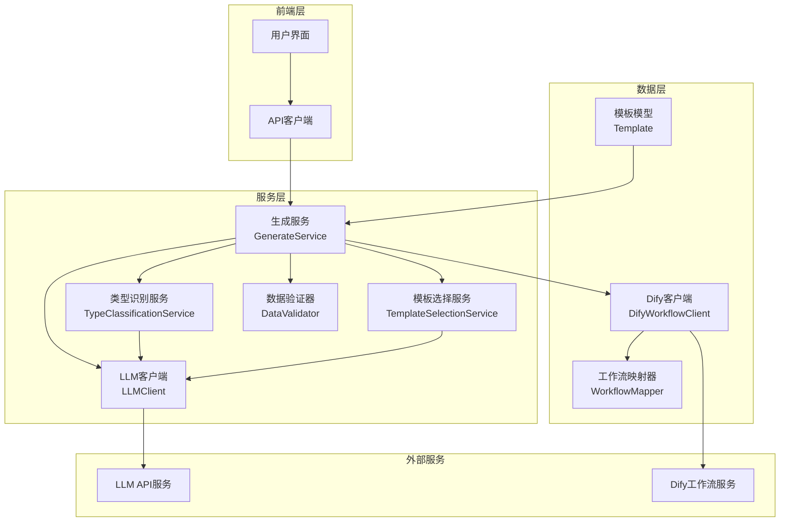
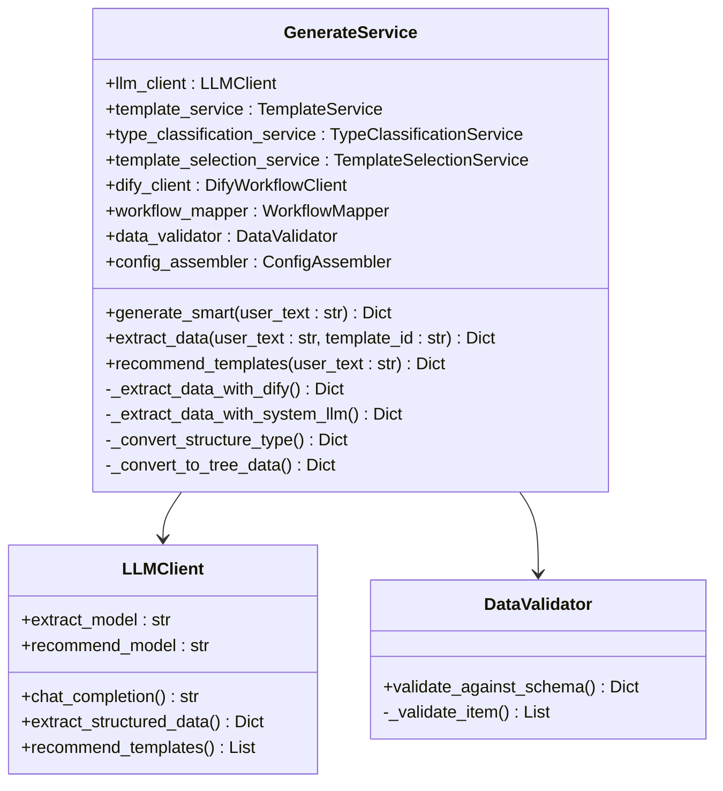
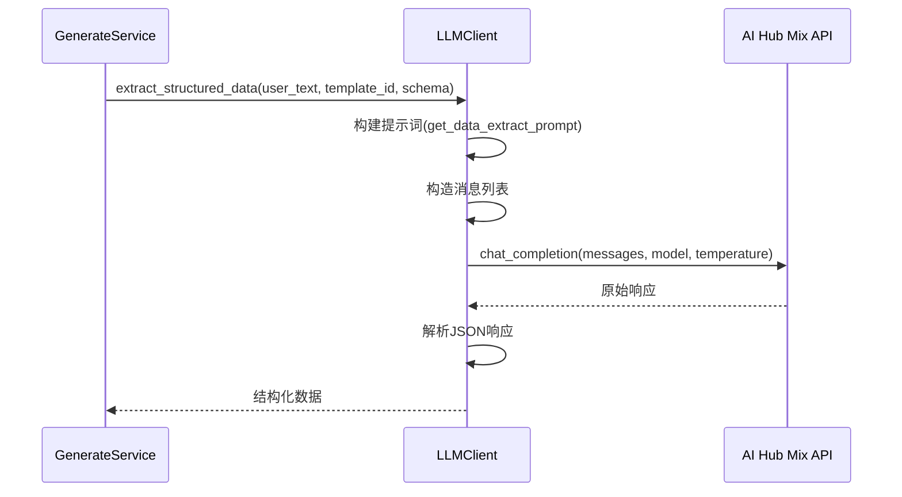
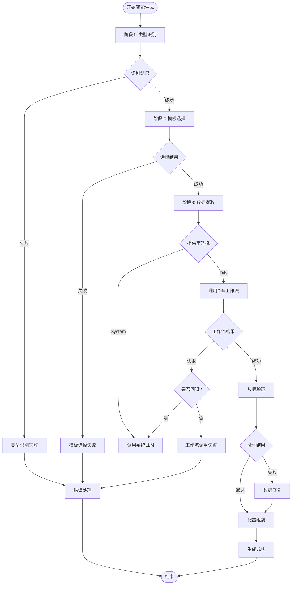
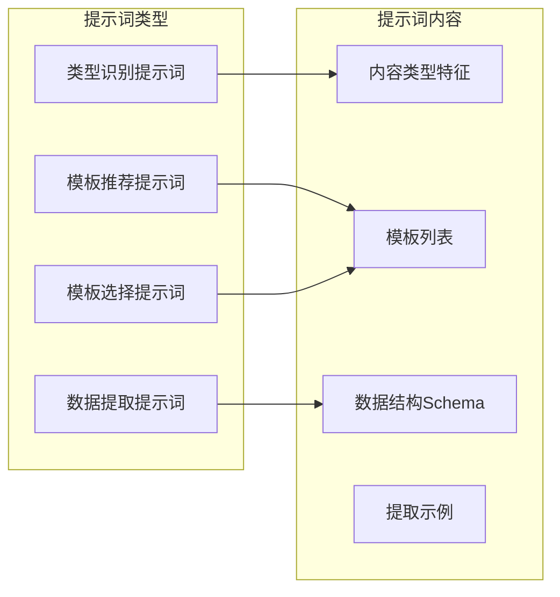
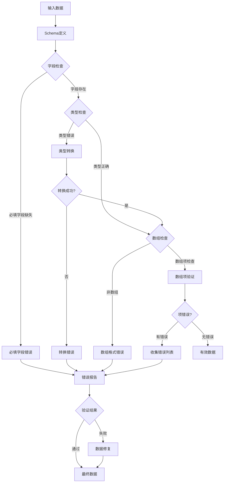
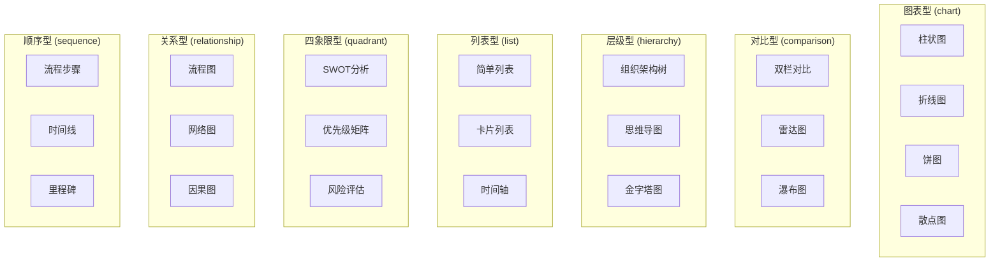
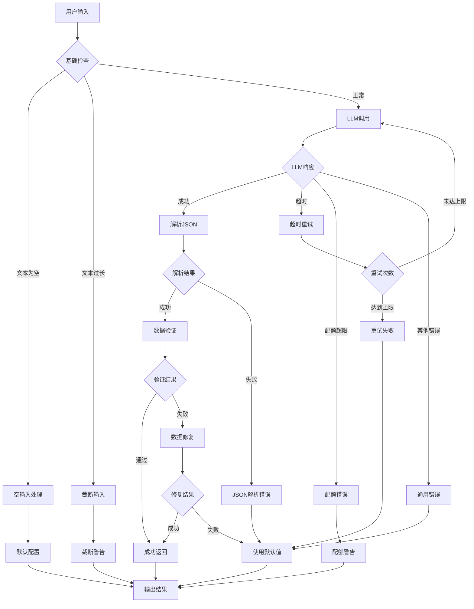
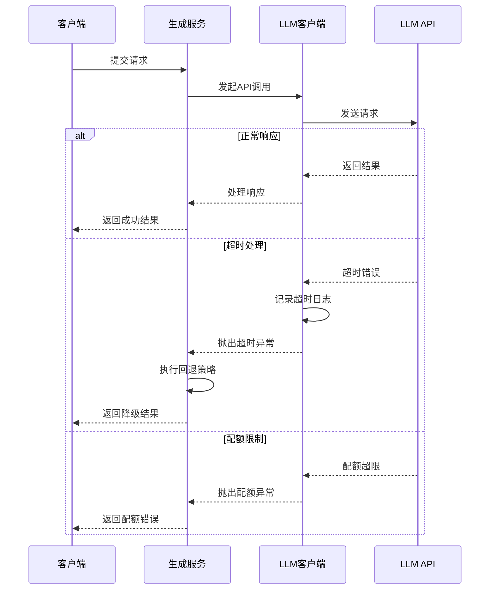
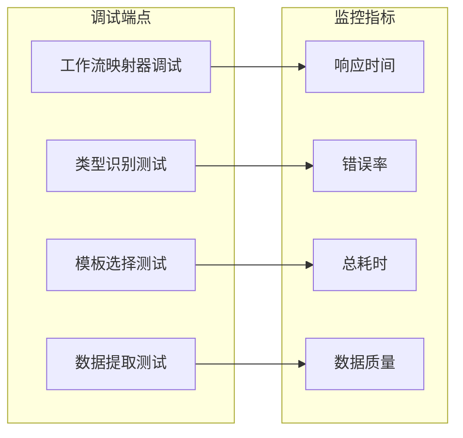

# 数据提取

<cite>
**本文档引用的文件**
- [generate_service.py](file://backend/app/services/generate_service.py)
- [llm_client.py](file://backend/app/services/llm_client.py)
- [data_validator.py](file://backend/app/services/data_validator.py)
- [type_classification_service.py](file://backend/app/services/type_classification_service.py)
- [template_selection_service.py](file://backend/app/services/template_selection_service.py)
- [prompts.py](file://backend/app/utils/prompts.py)
- [llm_prompts.yaml](file://backend/app/config/llm_prompts.yaml)
- [generate.py](file://backend/app/api/v1/generate.py)
- [template.py](file://backend/app/models/template.py)
- [dify_workflow_client.py](file://backend/app/services/dify_workflow_client.py)
- [workflow_mapper.py](file://backend/app/services/workflow_mapper.py)
</cite>

## 目录
1. [简介](#简介)
2. [系统架构概览](#系统架构概览)
3. [核心组件分析](#核心组件分析)
4. [数据提取流程详解](#数据提取流程详解)
5. [LLM集成与请求构建](#llm集成与请求构建)
6. [数据验证机制](#数据验证机制)
7. [模板类型与数据结构](#模板类型与数据结构)
8. [容错策略与默认值处理](#容错策略与默认值处理)
9. [性能优化与超时控制](#性能优化与超时控制)
10. [故障排除指南](#故障排除指南)
11. [总结](#总结)

## 简介

智能数据提取功能是GenAI Chart系统的核心组件，它通过大语言模型(LLM)从非结构化文本中提取关键信息并转换为结构化的信息图配置。该系统采用三阶段智能生成流程，支持多种数据提取策略，包括系统LLM提取和Dify工作流提取，并具备完善的容错机制和性能优化策略。

## 系统架构概览

智能数据提取系统采用模块化架构设计，主要包含以下核心层次：

**图表来源**
- [generate_service.py](file://backend/app/services/generate_service.py#L33-L465)
- [llm_client.py](file://backend/app/services/llm_client.py#L14-L217)

## 核心组件分析

### 生成服务 (GenerateService)

生成服务是整个数据提取系统的核心协调器，负责管理三阶段智能生成流程：

**图表来源**
- [generate_service.py](file://backend/app/services/generate_service.py#L33-L465)
- [llm_client.py](file://backend/app/services/llm_client.py#L14-L217)
- [data_validator.py](file://backend/app/services/data_validator.py#L11-L160)

**章节来源**
- [generate_service.py](file://backend/app/services/generate_service.py#L33-L465)

### LLM客户端服务

LLM客户端封装了与AI Hub Mix API的通信，提供了统一的接口来调用不同的LLM功能：

**图表来源**
- [llm_client.py](file://backend/app/services/llm_client.py#L155-L206)
- [prompts.py](file://backend/app/utils/prompts.py#L131-L209)

**章节来源**
- [llm_client.py](file://backend/app/services/llm_client.py#L14-L217)

## 数据提取流程详解

系统采用智能三阶段流程来处理数据提取：

**图表来源**
- [generate_service.py](file://backend/app/services/generate_service.py#L47-L118)

**章节来源**
- [generate_service.py](file://backend/app/services/generate_service.py#L47-L118)

### 智能生成流程

智能生成流程包含三个核心阶段：

1. **类型识别阶段**：分析用户输入文本，确定最适合的信息图类型
2. **模板选择阶段**：从识别的类型中选择最合适的模板
3. **数据提取阶段**：根据选定模板的数据结构提取关键信息

**章节来源**
- [generate_service.py](file://backend/app/services/generate_service.py#L69-L86)

## LLM集成与请求构建

### 提示词工程

系统使用精心设计的提示词模板来指导LLM完成数据提取任务：

**图表来源**
- [prompts.py](file://backend/app/utils/prompts.py#L9-L247)
- [llm_prompts.yaml](file://backend/app/config/llm_prompts.yaml#L1-L126)

### 请求参数构造

系统根据不同的LLM模型类型动态调整请求参数：

| 参数类型 | 系统LLM | Dify工作流 | 说明 |
|---------|---------|------------|------|
| 模型名称 | extract_model | 自动选择 | 根据功能选择最优模型 |
| 温度参数 | 0.2 | 0.3 | 控制创造性输出 |
| 响应格式 | JSON Object | 自动检测 | 确保JSON输出格式 |
| 推理强度 | medium | 不支持 | o1系列模型专用 |

**章节来源**
- [llm_client.py](file://backend/app/services/llm_client.py#L175-L206)
- [prompts.py](file://backend/app/utils/prompts.py#L131-L209)

## 数据验证机制

数据验证器确保从LLM提取的数据符合模板的Schema定义：

**图表来源**
- [data_validator.py](file://backend/app/services/data_validator.py#L14-L160)

### 验证规则

数据验证遵循严格的规则集：

| 验证类型 | 规则说明 | 处理方式 |
|---------|---------|----------|
| 必填字段 | 检查必需字段是否存在 | 缺失时记录错误 |
| 数据类型 | 验证字段类型匹配 | 尝试类型转换 |
| 数组验证 | 检查数组项结构 | 过滤无效项 |
| Schema一致性 | 验证整体数据结构 | 返回修复建议 |

**章节来源**
- [data_validator.py](file://backend/app/services/data_validator.py#L14-L160)

## 模板类型与数据结构

### 信息图类型分类

系统支持七种主要的信息图类型，每种类型都有对应的模板和数据结构：

**图表来源**
- [llm_prompts.yaml](file://backend/app/config/llm_prompts.yaml#L17-L125)

### 数据结构差异

不同模板类型的数据结构存在显著差异：

| 模板类型 | 主要字段 | 特殊处理 | 示例用途 |
|---------|---------|----------|----------|
| 图表型 | title, desc, items | 数值数据标准化 | 销售数据可视化 |
| 对比型 | title, comparisonItems | 数据对齐 | 产品功能对比 |
| 层级型 | title, items, children | 树形结构 | 组织架构图 |
| 列表型 | title, desc, items | 简单数组 | 功能特性列表 |
| 四象限型 | quadrants, items | 坐标分配 | SWOT分析 |
| 关系型 | nodes, links, items | 图结构 | 流程网络 |
| 顺序型 | steps, timeline, items | 时间排序 | 项目流程 |

**章节来源**
- [generate_service.py](file://backend/app/services/generate_service.py#L374-L452)

## 容错策略与默认值处理

### 多层容错机制

系统实现了多层次的容错策略来处理各种异常情况：

**图表来源**
- [generate_service.py](file://backend/app/services/generate_service.py#L169-L372)
- [llm_client.py](file://backend/app/services/llm_client.py#L79-L92)

### 默认值填充策略

当数据提取不完整或质量不佳时，系统采用智能默认值填充策略：

| 场景 | 默认值策略 | 实现方式 |
|------|-----------|----------|
| 缺少标题 | 基于内容生成标题 | LLM辅助生成 |
| 缺少描述 | 空字符串 | 直接填充 |
| 缺少图标 | 系统默认图标 | icon:mdi/information |
| 缺少数值 | 0或平均值 | 数据分析计算 |
| 缺少颜色 | 主题色 | 从主题配置继承 |

**章节来源**
- [generate_service.py](file://backend/app/services/generate_service.py#L318-L372)

## 性能优化与超时控制

### 请求超时管理

系统实现了完善的超时控制机制：

**图表来源**
- [llm_client.py](file://backend/app/services/llm_client.py#L79-L92)

### 重试机制

系统实现了指数退避重试机制：

| 错误类型 | 重试策略 | 最大重试次数 | 退避因子 |
|---------|---------|-------------|----------|
| 网络超时 | 指数退避 | 3次 | 2.0 |
| API配额 | 立即失败 | 0次 | N/A |
| 服务器错误 | 指数退避 | 3次 | 2.0 |
| JSON解析 | 立即失败 | 0次 | N/A |

**章节来源**
- [llm_client.py](file://backend/app/services/llm_client.py#L79-L92)

## 故障排除指南

### 常见问题诊断

| 问题症状 | 可能原因 | 解决方案 |
|---------|---------|----------|
| 数据提取失败 | LLM API不可用 | 检查API密钥和网络连接 |
| JSON解析错误 | LLM输出格式异常 | 检查提示词模板和模型兼容性 |
| 模板选择错误 | 类型识别不准确 | 调整类型识别提示词 |
| 数据验证失败 | 输入数据不符合Schema | 检查数据格式和必填字段 |
| Dify工作流失败 | 工作流配置错误 | 检查工作流映射配置 |

### 调试工具

系统提供了多种调试工具来帮助排查问题：

**图表来源**
- [generate.py](file://backend/app/api/v1/generate.py#L89-L116)

**章节来源**
- [generate.py](file://backend/app/api/v1/generate.py#L89-L116)

## 总结

智能数据提取功能通过精心设计的架构和完善的容错机制，实现了从非结构化文本到结构化信息图配置的高效转换。系统的主要优势包括：

1. **多模态提取策略**：支持系统LLM和Dify工作流两种提取方式
2. **智能类型识别**：基于7大分类体系的精准内容分析
3. **完善的数据验证**：确保输出数据的质量和一致性
4. **强大的容错能力**：多层次的异常处理和默认值填充
5. **性能优化**：超时控制和重试机制保障服务稳定性

该系统为用户提供了一个可靠、高效的智能数据提取解决方案，能够满足各种复杂的信息图生成需求。