# 模板推荐系统详细文档

<cite>
**本文档引用的文件**
- [generate_service.py](file://backend/app/services/generate_service.py)
- [type_classification_service.py](file://backend/app/services/type_classification_service.py)
- [template_selection_service.py](file://backend/app/services/template_selection_service.py)
- [llm_client.py](file://backend/app/services/llm_client.py)
- [template_service.py](file://backend/app/services/template_service.py)
- [template_repo.py](file://backend/app/repositories/template_repo.py)
- [prompts.py](file://backend/app/utils/prompts.py)
- [prompt_manager.py](file://backend/app/utils/prompt_manager.py)
- [template.py](file://backend/app/models/template.py)
- [template.ts](file://frontend/src/stores/template.ts)
- [templates.ts](file://frontend/src/api/templates.ts)
- [AIWorkspace.vue](file://frontend/src/views/AIWorkspace/AIWorkspace.vue)
- [registry.js](file://antv_infographic/infographic/lib/templates/registry.js)
</cite>

## 目录
1. [系统概述](#系统概述)
2. [核心架构](#核心架构)
3. [智能分类算法](#智能分类算法)
4. [模板选择服务](#模板选择服务)
5. [模板元数据系统](#模板元数据系统)
6. [性能优化策略](#性能优化策略)
7. [错误处理机制](#错误处理机制)
8. [前端集成](#前端集成)
9. [扩展性设计](#扩展性设计)
10. [总结](#总结)

## 系统概述

模板推荐系统是一个基于人工智能的智能信息图模板选择平台，能够根据用户输入的文本内容自动分析其语义特征，并推荐最适合的可视化模板。系统采用三层架构设计，结合自然语言处理技术和机器学习算法，实现了精准的模板匹配和推荐功能。

### 核心特性

- **智能语义分析**：基于LLM的文本内容理解能力
- **多维度分类**：7大分类体系覆盖不同类型的可视化需求
- **精准匹配**：基于模板元数据的语义相似度计算
- **性能优化**：缓存机制和异步处理提升响应速度
- **容错设计**：完善的错误处理和降级策略

## 核心架构

系统采用微服务架构，主要由以下几个核心模块组成：

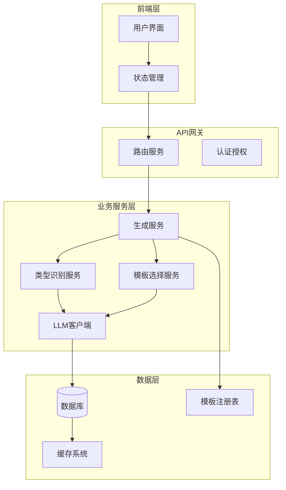

**图表来源**
- [generate_service.py](file://backend/app/services/generate_service.py#L33-L465)
- [type_classification_service.py](file://backend/app/services/type_classification_service.py#L14-L148)
- [template_selection_service.py](file://backend/app/services/template_selection_service.py#L14-L155)

## 智能分类算法

### 7大分类体系

系统采用经过精心设计的7大分类体系，每种类型都有明确的特征和适用场景：

| 分类 | 特征 | 关键词 | 适用场景 |
|------|------|--------|----------|
| **图表型 (chart)** | 包含数值数据、统计信息 | 数据、增长率、比例、百分比、趋势 | 销售数据、用户增长、KPI指标、财务报表 |
| **对比型 (comparison)** | 优劣对比、差异分析 | 对比、差异、优劣、好坏 | 产品对比、方案评估、竞品分析 |
| **层级型 (hierarchy)** | 组织结构、分类信息 | 层级、结构、组织、树状 | 组织架构、分类体系、层次关系 |
| **列表型 (list)** | 步骤说明、清单、简单信息罗列 | 列表、步骤、清单、要点 | 操作指南、流程说明、要点总结 |
| **四象限型 (quadrant)** | 市场定位、风险评估 | 四象限、象限、定位、评估 | SWOT分析、市场分析、风险评估 |
| **关系型 (relationship)** | 关系网络、关联分析 | 关系、网络、关联、连接 | 社交网络、依赖关系、影响分析 |
| **顺序型 (sequence)** | 时间线、流程图、递进关系 | 时间、顺序、流程、步骤 | 项目进度、历史事件、发展过程 |

### 语义分析流程

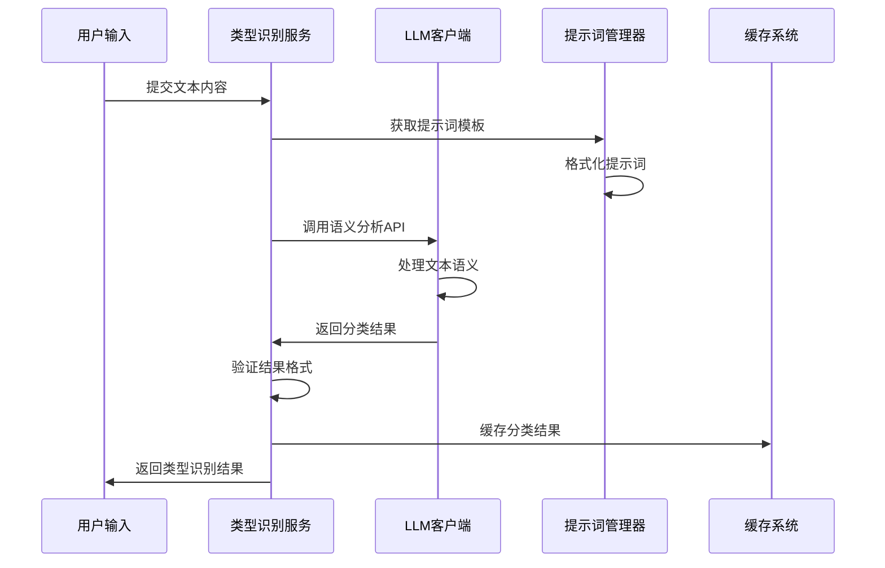

**图表来源**
- [type_classification_service.py](file://backend/app/services/type_classification_service.py#L22-L86)
- [llm_client.py](file://backend/app/services/llm_client.py#L30-L92)

### 分类准确性保障

系统通过多重验证机制确保分类结果的准确性：

1. **格式验证**：确保返回的JSON格式符合预期
2. **范围验证**：检查分类类型是否在有效范围内
3. **置信度验证**：确保置信度值在合理区间内
4. **理由验证**：保证解释说明的完整性

**章节来源**
- [type_classification_service.py](file://backend/app/services/type_classification_service.py#L87-L135)

## 模板选择服务

### 处理流程

模板选择服务负责从特定类型的模板集合中选出最合适的模板，采用两阶段处理模式：

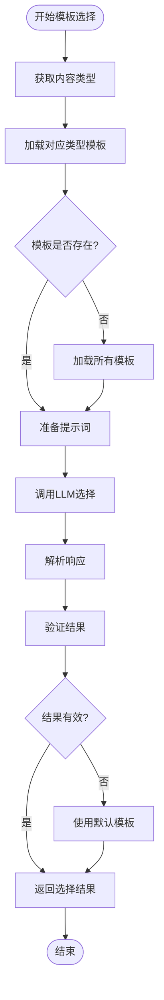

**图表来源**
- [template_selection_service.py](file://backend/app/services/template_selection_service.py#L23-L87)

### 优先级排序机制

系统采用语义相似度算法对候选模板进行排序：

1. **语义匹配度**：基于文本内容与模板描述的相似度
2. **适用场景匹配**：考虑模板的适用场景与用户需求的契合度
3. **模板质量评分**：基于模板的活跃度和用户评价
4. **结构复杂度平衡**：避免过于复杂或过于简单的模板

### 模板过滤策略

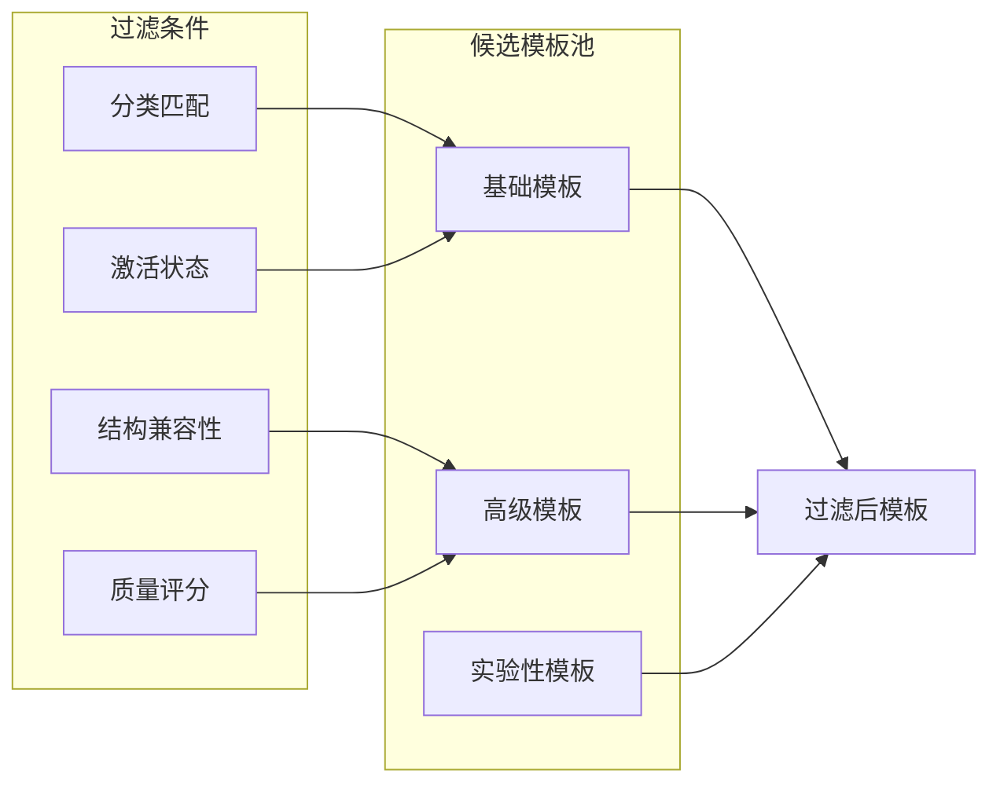

**图表来源**
- [template_repo.py](file://backend/app/repositories/template_repo.py#L90-L104)

**章节来源**
- [template_selection_service.py](file://backend/app/services/template_selection_service.py#L14-L155)

## 模板元数据系统

### 元数据结构

每个模板都包含丰富的元数据信息，支持精确的语义匹配：

| 字段 | 类型 | 描述 | 示例 |
|------|------|------|------|
| **id** | String | 模板唯一标识 | "sequence-timeline-simple" |
| **name** | String | 中文名称 | "简单时间轴" |
| **category** | String | 分类代码 | "sequence" |
| **structure_type** | String | AntV结构类型 | "timeline-horizontal" |
| **description** | Text | 模板描述 | "展示时间顺序的流程" |
| **keywords** | Text | 关键词列表 | "时间,流程,顺序" |
| **use_cases** | Text | 适用场景 | "项目进度,历史事件" |
| **data_schema** | JSON | 数据结构定义 | JSON Schema |
| **design_config** | JSON | 设计配置 | 视觉样式参数 |
| **tags** | JSON | 标签数组 | ["简洁","时间轴"] |
| **sort_order** | Integer | 排序权重 | 100 |

### 数据结构定义

系统为不同类型的模板定义了标准化的数据结构：

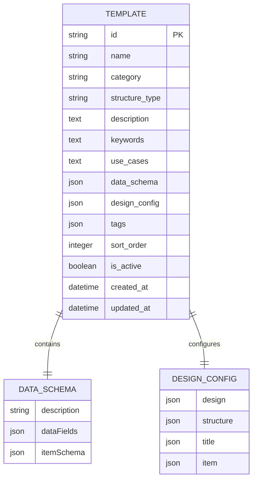

**图表来源**
- [template.py](file://backend/app/models/template.py#L9-L28)

### 模式匹配算法

系统采用基于模式匹配的模板推荐算法：

1. **关键词匹配**：基于用户输入中的关键词与模板元数据的匹配度
2. **语义相似度**：使用嵌入向量计算文本间的语义距离
3. **结构适配度**：评估模板结构与数据结构的兼容性
4. **上下文相关性**：考虑用户历史偏好和上下文信息

**章节来源**
- [template_service.py](file://backend/app/services/template_service.py#L160-L281)

## 性能优化策略

### 缓存机制

系统实现了多层次的缓存策略：

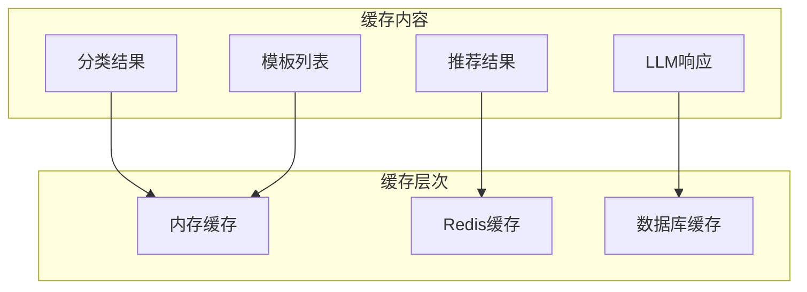

### 异步处理

对于耗时的操作，系统采用异步处理模式：

1. **模板预加载**：后台定期加载热门模板
2. **批量处理**：合并多个推荐请求
3. **流水线处理**：并行执行不同类型的任务

### 预热策略

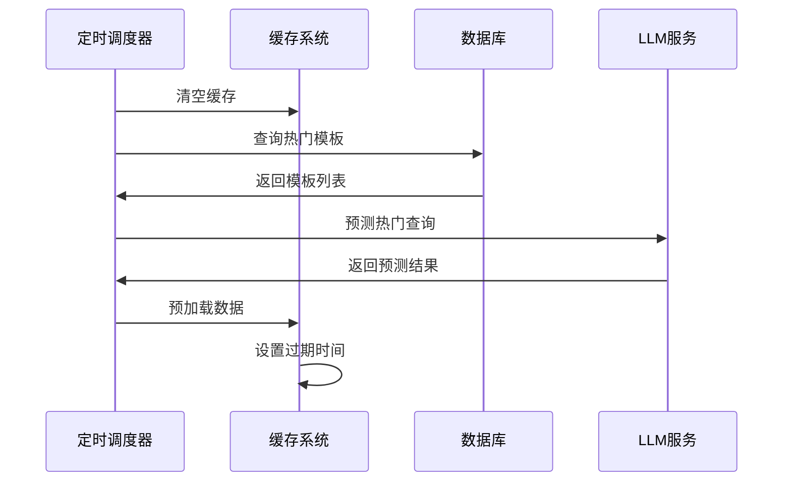

**章节来源**
- [generate_service.py](file://backend/app/services/generate_service.py#L47-L118)

## 错误处理机制

### 降级策略

系统设计了完善的降级机制：

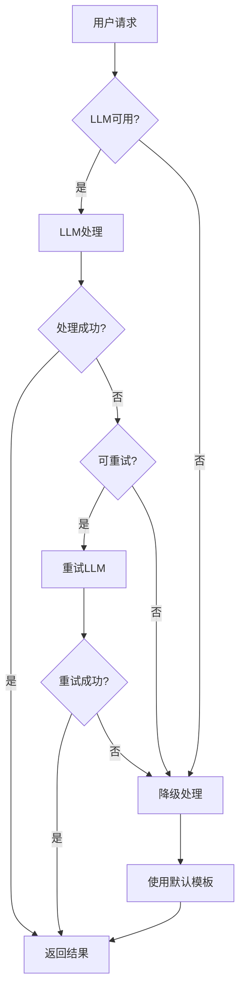

### 错误恢复

1. **临时故障恢复**：自动重试机制
2. **永久故障处理**：使用备用算法
3. **数据损坏修复**：自动数据校验和修复
4. **服务不可用处理**：返回友好的错误信息

### 监控告警

系统集成了全面的监控体系：

- **响应时间监控**：跟踪各环节的处理时间
- **成功率监控**：监控各类操作的成功率
- **错误分类统计**：分析错误类型和频率
- **性能瓶颈识别**：自动识别系统瓶颈

**章节来源**
- [llm_client.py](file://backend/app/services/llm_client.py#L81-L92)
- [generate_service.py](file://backend/app/services/generate_service.py#L120-L123)

## 前端集成

### 状态管理

前端采用Pinia状态管理，集中管理模板相关状态：

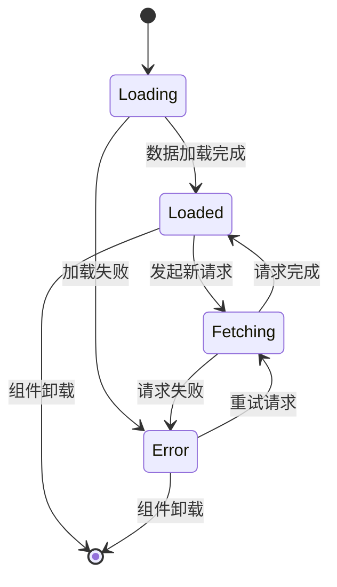

### 用户界面

前端提供了直观的模板推荐界面：

1. **文本输入区域**：支持富文本和Markdown格式
2. **推荐结果展示**：卡片式布局，显示匹配度和理由
3. **模板预览**：实时预览推荐的模板效果
4. **交互反馈**：提供加载状态和错误提示

### 实时更新

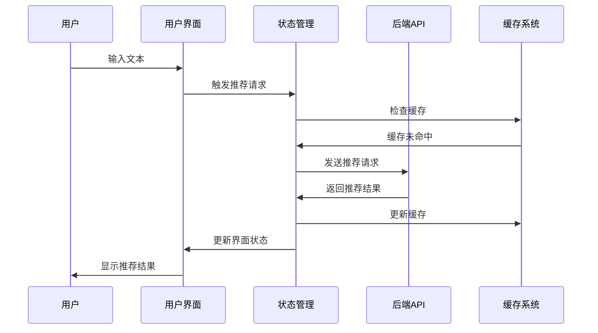

**图表来源**
- [template.ts](file://frontend/src/stores/template.ts#L67-L83)

**章节来源**
- [AIWorkspace.vue](file://frontend/src/views/AIWorkspace/AIWorkspace.vue#L36-L42)
- [templates.ts](file://frontend/src/api/templates.ts#L40-L51)

## 扩展性设计

### 模块化架构

系统采用高度模块化的设计，便于功能扩展：

1. **服务层扩展**：新增服务只需实现标准接口
2. **存储层抽象**：支持多种数据存储后端
3. **提示词引擎**：可插拔的提示词管理系统
4. **算法引擎**：支持多种推荐算法并存

### 插件机制

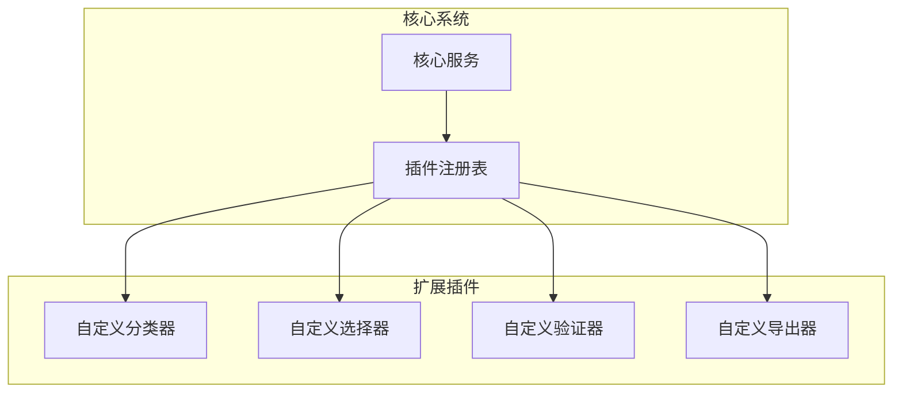

### 配置化管理

系统支持通过配置文件管理各种参数：

- **模型配置**：支持多种LLM模型
- **提示词配置**：可定制的提示词模板
- **算法参数**：灵活的算法参数调整
- **缓存策略**：可配置的缓存行为

## 总结

模板推荐系统通过智能化的语义分析和精准的模板匹配，为用户提供了一站式的可视化解决方案。系统具备以下核心优势：

### 技术优势

1. **智能语义理解**：基于先进的LLM技术，准确理解用户需求
2. **精准模板匹配**：多维度的元数据分析，确保推荐质量
3. **高性能架构**：多层次缓存和异步处理，保证系统响应速度
4. **容错性强**：完善的错误处理和降级机制，确保服务稳定性

### 应用价值

1. **提升用户体验**：减少用户选择模板的时间成本
2. **提高创作效率**：自动化的模板推荐加速创作过程
3. **保证设计质量**：专业化的模板匹配确保视觉效果
4. **降低使用门槛**：无需专业知识即可获得专业效果

### 发展方向

1. **算法优化**：持续改进语义匹配算法
2. **数据增强**：扩充模板库和训练数据
3. **个性化推荐**：基于用户偏好的个性化推荐
4. **实时协作**：支持多人协同创作场景

该系统为信息图制作提供了智能化、专业化的解决方案，显著提升了用户的工作效率和创作体验。