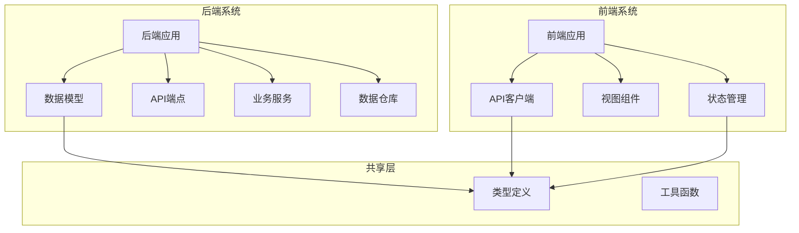
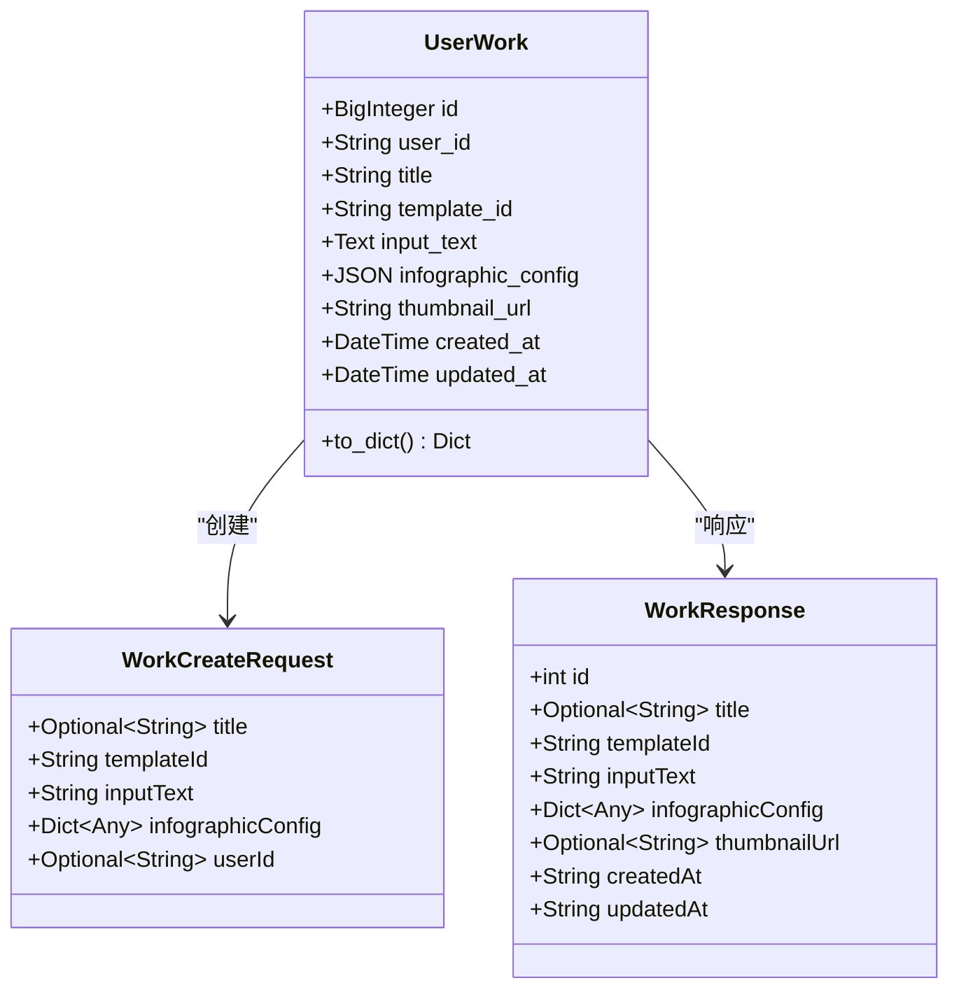
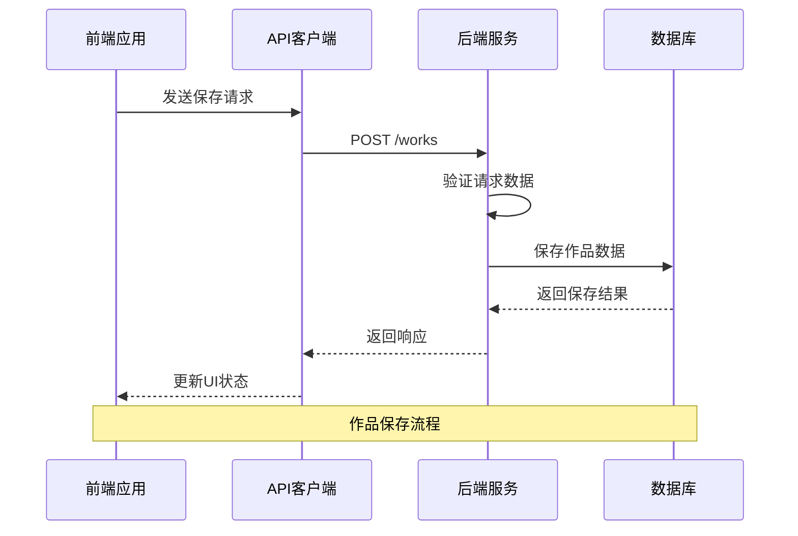
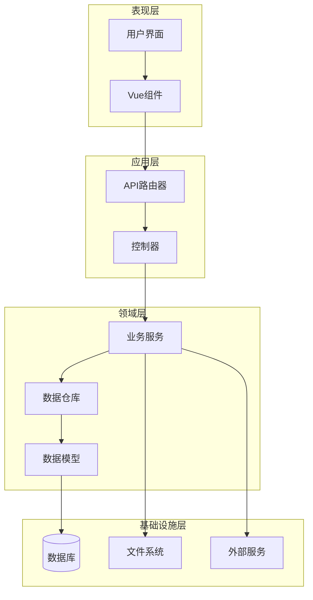
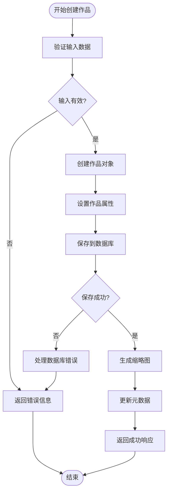
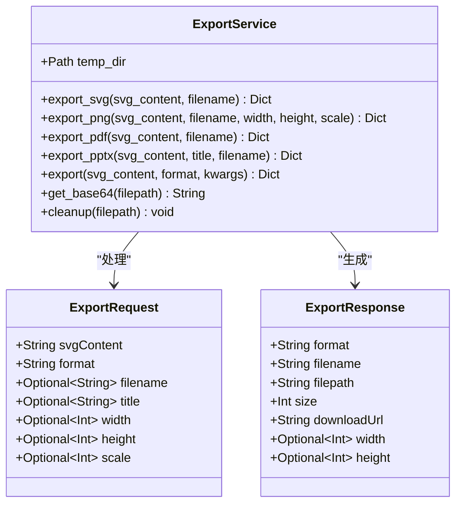
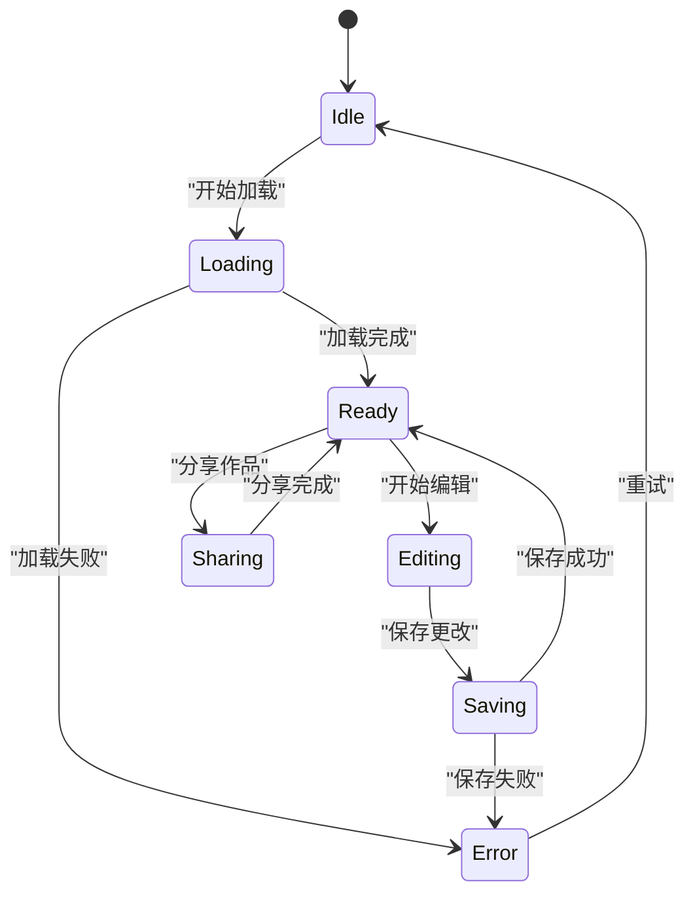
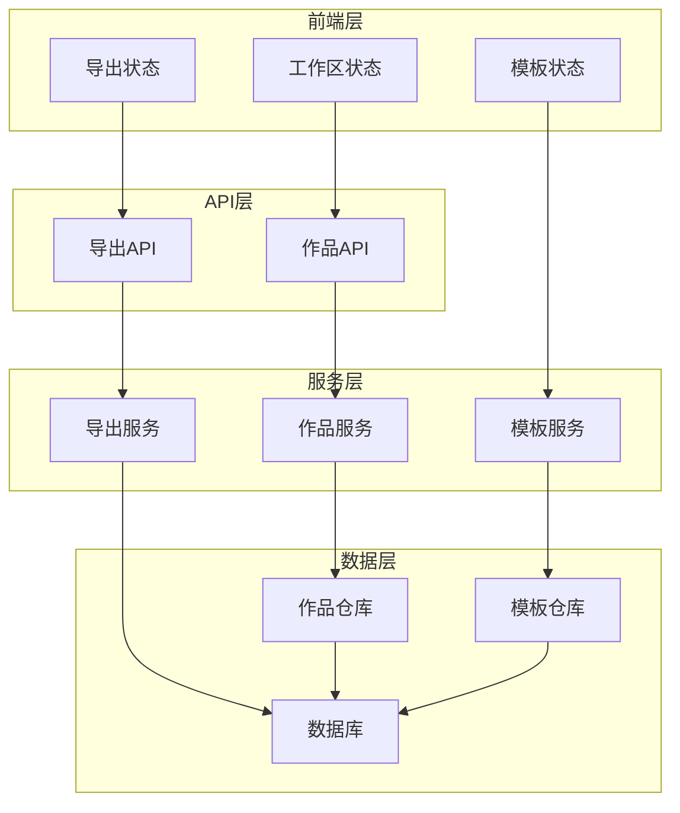

# 作品管理

<cite>
**本文档中引用的文件**
- [backend/app/models/work.py](file://backend/app/models/work.py)
- [backend/app/api/v1/works.py](file://backend/app/api/v1/works.py)
- [backend/app/repositories/work_repo.py](file://backend/app/repositories/work_repo.py)
- [backend/app/schemas/work.py](file://backend/app/schemas/work.py)
- [backend/app/services/export_service.py](file://backend/app/services/export_service.py)
- [backend/app/api/v1/export.py](file://backend/app/api/v1/export.py)
- [frontend/src/api/work.ts](file://frontend/src/api/work.ts)
- [frontend/src/stores/workspace.ts](file://frontend/src/stores/workspace.ts)
- [frontend/src/views/AIWorkspace/components/RightPreviewPanel.vue](file://frontend/src/views/AIWorkspace/components/RightPreviewPanel.vue)
- [backend/app/utils/db.py](file://backend/app/utils/db.py)
- [backend/app/services/template_service.py](file://backend/app/services/template_service.py)
- [backend/app/services/workflow_mapper.py](file://backend/app/services/workflow_mapper.py)
- [antv_infographic/infographic/dev/src/utils/storage.ts](file://antv_infographic/infographic/dev/src/utils/storage.ts)
- [frontend/src/stores/settings.ts](file://frontend/src/stores/settings.ts)
</cite>

## 目录
1. [简介](#简介)
2. [项目结构](#项目结构)
3. [核心组件](#核心组件)
4. [架构概览](#架构概览)
5. [详细组件分析](#详细组件分析)
6. [依赖关系分析](#依赖关系分析)
7. [性能考虑](#性能考虑)
8. [故障排除指南](#故障排除指南)
9. [结论](#结论)

## 简介

作品管理系统是一个完整的信息图创作和管理平台，支持用户创建、保存、加载、编辑和导出信息图作品。该系统采用前后端分离架构，后端使用FastAPI提供RESTful API，前端使用Vue.js构建交互式界面。

系统的核心功能包括：
- 作品的全生命周期管理（创建、保存、加载、编辑）
- 多种导出格式支持（SVG、PNG、PDF、PPTX）
- 模板系统和智能推荐
- 前后端数据持久化
- 版本控制和历史记录
- 并发编辑处理

## 项目结构

作品管理系统采用模块化的项目结构，主要分为以下几个部分：

**图表来源**
- [backend/app/models/work.py](file://backend/app/models/work.py#L1-L37)
- [backend/app/api/v1/works.py](file://backend/app/api/v1/works.py#L1-L106)
- [frontend/src/api/work.ts](file://frontend/src/api/work.ts#L1-L61)

**章节来源**
- [backend/app/models/work.py](file://backend/app/models/work.py#L1-L37)
- [backend/app/api/v1/works.py](file://backend/app/api/v1/works.py#L1-L106)
- [frontend/src/api/work.ts](file://frontend/src/api/work.ts#L1-L61)

## 核心组件

### 数据模型设计

作品管理系统的核心数据模型围绕`UserWork`实体展开，该模型定义了作品的基本属性和元数据：

**图表来源**
- [backend/app/models/work.py](file://backend/app/models/work.py#L9-L37)
- [backend/app/schemas/work.py](file://backend/app/schemas/work.py#L8-L27)

### 前后端协作机制

系统采用RESTful API进行前后端通信，前端通过API客户端与后端服务交互：

**图表来源**
- [frontend/src/api/work.ts](file://frontend/src/api/work.ts#L33-L40)
- [backend/app/api/v1/works.py](file://backend/app/api/v1/works.py#L15-L47)

**章节来源**
- [backend/app/models/work.py](file://backend/app/models/work.py#L9-L37)
- [backend/app/schemas/work.py](file://backend/app/schemas/work.py#L8-L27)
- [frontend/src/api/work.ts](file://frontend/src/api/work.ts#L1-L61)

## 架构概览

作品管理系统采用分层架构设计，确保各层职责清晰、耦合度低：

**图表来源**
- [backend/app/api/v1/works.py](file://backend/app/api/v1/works.py#L12-L13)
- [backend/app/repositories/work_repo.py](file://backend/app/repositories/work_repo.py#L12-L23)
- [backend/app/utils/db.py](file://backend/app/utils/db.py#L18-L40)

## 详细组件分析

### 作品创建和保存流程

作品的创建和保存是系统的核心功能，涉及多个组件的协同工作：

**图表来源**
- [backend/app/api/v1/works.py](file://backend/app/api/v1/works.py#L15-L47)
- [backend/app/repositories/work_repo.py](file://backend/app/repositories/work_repo.py#L24-L37)

### 导出功能实现

系统支持多种导出格式，每种格式都有专门的处理逻辑：

**图表来源**
- [backend/app/services/export_service.py](file://backend/app/services/export_service.py#L19-L670)
- [backend/app/api/v1/export.py](file://backend/app/api/v1/export.py#L16-L36)

### 前端状态管理

前端使用Pinia进行状态管理，确保作品数据的一致性和响应性：

**图表来源**
- [frontend/src/stores/workspace.ts](file://frontend/src/stores/workspace.ts#L14-L74)
- [frontend/src/views/AIWorkspace/components/RightPreviewPanel.vue](file://frontend/src/views/AIWorkspace/components/RightPreviewPanel.vue#L443-L460)

**章节来源**
- [backend/app/api/v1/works.py](file://backend/app/api/v1/works.py#L15-L47)
- [backend/app/services/export_service.py](file://backend/app/services/export_service.py#L19-L670)
- [frontend/src/stores/workspace.ts](file://frontend/src/stores/workspace.ts#L14-L74)

### 模板系统和智能推荐

系统提供了强大的模板管理功能，支持智能推荐和自定义配置：

| 功能特性 | 描述 | 实现方式 |
|---------|------|----------|
| 模板分类 | 按类型、用途对模板进行分类 | 基于模板元数据的分类系统 |
| 智能推荐 | 根据输入内容推荐合适的模板 | 基于内容分析和机器学习算法 |
| 自定义配置 | 支持高级用户自定义模板配置 | JSON Schema验证和动态渲染 |
| 版本管理 | 模板配置的历史版本跟踪 | 数据库版本控制机制 |

**章节来源**
- [backend/app/services/template_service.py](file://backend/app/services/template_service.py#L160-L281)
- [backend/app/services/workflow_mapper.py](file://backend/app/services/workflow_mapper.py#L13-L141)

## 依赖关系分析

系统各组件之间的依赖关系体现了良好的分层架构设计：

**图表来源**
- [backend/app/api/v1/works.py](file://backend/app/api/v1/works.py#L1-L10)
- [backend/app/repositories/work_repo.py](file://backend/app/repositories/work_repo.py#L1-L8)
- [frontend/src/stores/workspace.ts](file://frontend/src/stores/workspace.ts#L1-L5)

**章节来源**
- [backend/app/api/v1/works.py](file://backend/app/api/v1/works.py#L1-L106)
- [backend/app/repositories/work_repo.py](file://backend/app/repositories/work_repo.py#L1-L82)
- [frontend/src/stores/workspace.ts](file://frontend/src/stores/workspace.ts#L1-L74)

## 性能考虑

### 数据库优化

系统采用了多种数据库优化策略来确保高性能：

- **连接池管理**：使用SQLAlchemy连接池，支持并发连接
- **索引优化**：为常用查询字段建立索引
- **事务管理**：合理使用事务边界，避免长时间锁定
- **分页查询**：大数据集采用分页查询，减少内存占用

### 前端性能优化

- **状态缓存**：使用localStorage缓存用户设置和配置
- **懒加载**：按需加载组件和资源
- **防抖处理**：对频繁触发的操作进行防抖处理
- **增量更新**：只更新变化的部分，减少重绘

### 导出性能优化

- **异步处理**：大型导出任务采用异步处理
- **临时文件管理**：及时清理临时文件，避免磁盘空间浪费
- **格式优化**：根据目标格式进行相应的优化处理

## 故障排除指南

### 常见问题及解决方案

#### 保存失败
**症状**：作品保存后无法加载或显示错误
**原因**：数据库连接问题或数据验证失败
**解决方法**：
1. 检查数据库连接状态
2. 验证作品数据格式
3. 查看服务器日志获取详细错误信息

#### 导出失败
**症状**：导出过程中出现错误或文件损坏
**原因**：缺少必要的依赖库或文件权限问题
**解决方法**：
1. 安装所需的Python包（cairosvg、python-pptx等）
2. 检查临时目录权限
3. 验证SVG内容的有效性

#### 模板加载缓慢
**症状**：模板列表加载时间过长
**原因**：数据库查询效率低或网络延迟
**解决方法**：
1. 优化数据库查询语句
2. 添加适当的索引
3. 实现本地缓存机制

**章节来源**
- [backend/app/utils/db.py](file://backend/app/utils/db.py#L58-L77)
- [backend/app/services/export_service.py](file://backend/app/services/export_service.py#L646-L670)

## 结论

作品管理系统是一个功能完整、架构清晰的信息图创作平台。系统通过合理的分层设计、完善的错误处理机制和丰富的导出功能，为用户提供了优秀的创作体验。

### 主要优势

1. **完整的生命周期管理**：从创建到导出的全流程支持
2. **灵活的导出选项**：支持多种格式，满足不同需求
3. **智能模板系统**：提供丰富的模板和智能推荐
4. **良好的扩展性**：模块化设计便于功能扩展
5. **可靠的稳定性**：完善的错误处理和性能优化

### 技术特色

- **前后端分离**：清晰的职责划分，便于维护和扩展
- **类型安全**：使用TypeScript和Pydantic确保类型安全
- **异步处理**：支持高并发和长时间运行的任务
- **国际化支持**：支持多语言界面和内容

该系统为信息图创作提供了一个强大而灵活的平台，能够满足个人用户和企业用户的多样化需求。随着功能的不断完善和技术的持续优化，系统将在信息可视化领域发挥更大的作用。