# API集成

<cite>
**本文档引用的文件**
- [client.ts](file://frontend/src/api/client.ts)
- [generate.ts](file://frontend/src/api/generate.ts)
- [templates.ts](file://frontend/src/api/templates.ts)
- [work.ts](file://frontend/src/api/work.ts)
- [export.ts](file://frontend/src/api/export.ts)
- [generate.py](file://backend/app/api/v1/generate.py)
- [templates.py](file://backend/app/api/v1/templates.py)
- [works.py](file://backend/app/api/v1/works.py)
- [export.py](file://backend/app/api/v1/export.py)
- [template.ts](file://frontend/src/stores/template.ts)
- [workspace.ts](file://frontend/src/stores/workspace.ts)
</cite>

## 目录
1. [API客户端封装策略](#api客户端封装策略)
2. [API模块接口定义](#api模块接口定义)
3. [典型调用场景](#典型调用场景)
4. [错误处理与重试机制](#错误处理与重试机制)
5. [类型安全与数据模型映射](#类型安全与数据模型映射)
6. [缓存策略](#缓存策略)

## API客户端封装策略

前端通过axios封装了统一的API客户端，实现了请求拦截、响应处理和错误统一捕获。API客户端配置了120秒的超时时间，以支持Dify工作流的长时间处理。

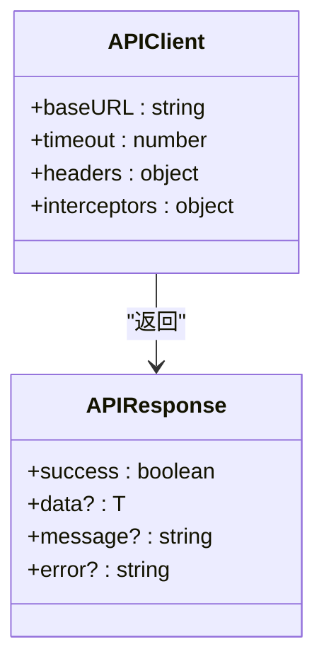

**图示来源**
- [client.ts](file://frontend/src/api/client.ts#L9-L14)

**本节来源**
- [client.ts](file://frontend/src/api/client.ts#L1-L46)

## API模块接口定义

### 生成模块

生成模块提供智能生成和传统模式两种API接口。智能生成采用三阶段流程：类型识别、模板选择和数据提取。

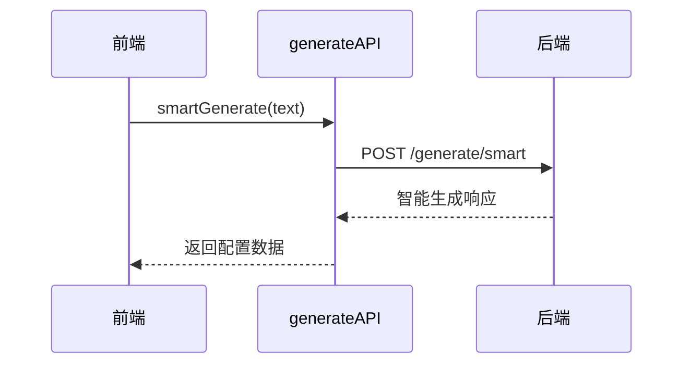

**图示来源**
- [generate.ts](file://frontend/src/api/generate.ts#L7-L25)
- [generate.py](file://backend/app/api/v1/generate.py#L31-L58)

**本节来源**
- [generate.ts](file://frontend/src/api/generate.ts#L7-L25)
- [generate.py](file://backend/app/api/v1/generate.py#L1-L116)

### 模板模块

模板模块提供模板列表获取、分类查询和AI推荐功能。模板数据结构包含ID、名称、分类和描述等字段。

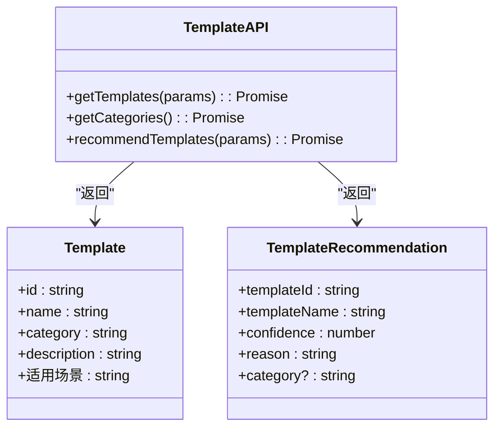

**图示来源**
- [templates.ts](file://frontend/src/api/templates.ts#L6-L22)
- [templates.py](file://backend/app/api/v1/templates.py#L17-L40)

**本节来源**
- [templates.ts](file://frontend/src/api/templates.ts#L1-L52)
- [templates.py](file://backend/app/api/v1/templates.py#L1-L99)

### 作品模块

作品模块管理用户创建的信息图作品，支持作品的创建、查询和删除操作。

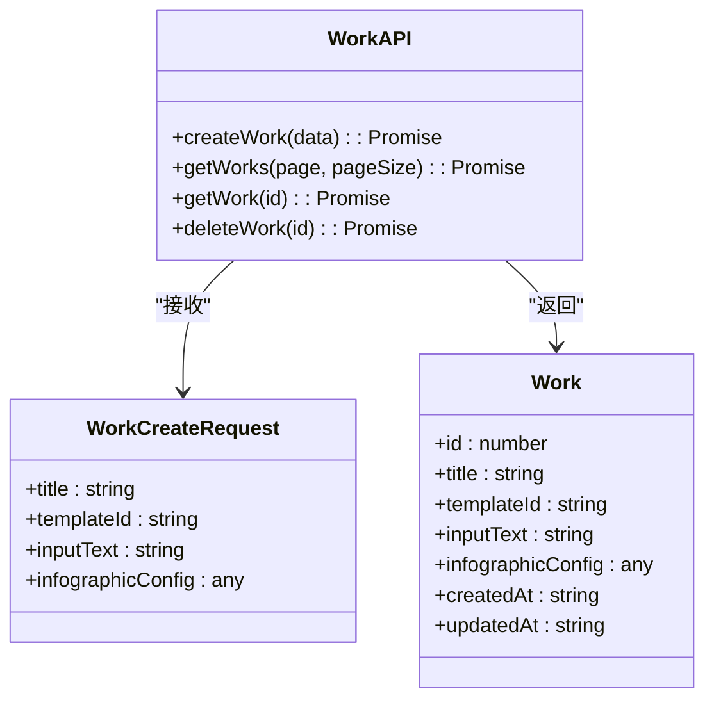

**图示来源**
- [work.ts](file://frontend/src/api/work.ts#L10-L28)
- [works.py](file://backend/app/api/v1/works.py#L16-L48)

**本节来源**
- [work.ts](file://frontend/src/api/work.ts#L1-L62)
- [works.py](file://backend/app/api/v1/works.py#L1-L106)

### 导出模块

导出模块支持将信息图导出为SVG、PNG、PDF和PPTX等多种格式，并提供文件下载和清理功能。

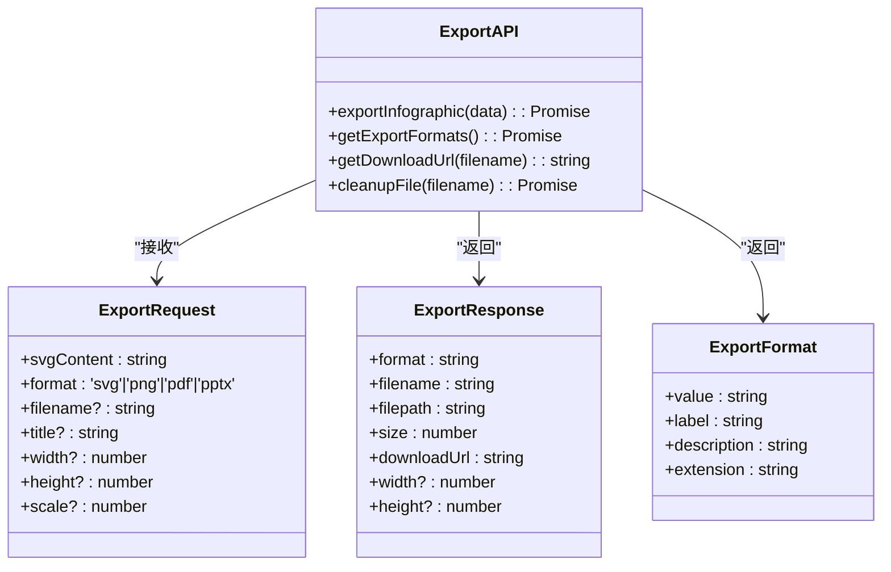

**图示来源**
- [export.ts](file://frontend/src/api/export.ts#L10-L41)
- [export.py](file://backend/app/api/v1/export.py#L16-L36)

**本节来源**
- [export.ts](file://frontend/src/api/export.ts#L1-L74)
- [export.py](file://backend/app/api/v1/export.py#L1-L208)

## 典型调用场景

### 发起AI生成请求

通过智能生成接口，系统自动识别文本类型、选择合适模板并提取结构化数据。

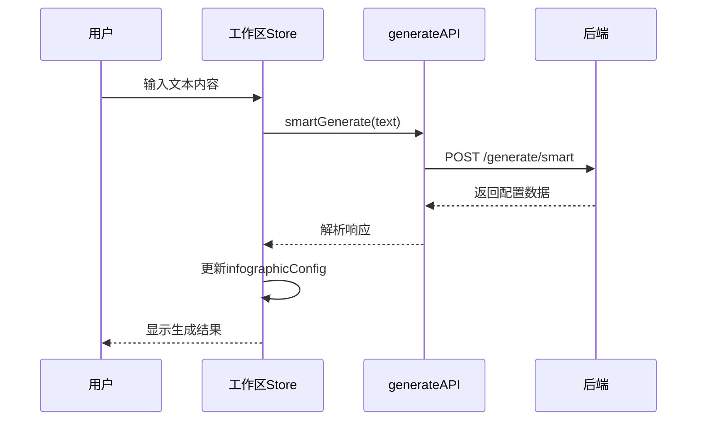

**图示来源**
- [workspace.ts](file://frontend/src/stores/workspace.ts#L7-L12)
- [generate.ts](file://frontend/src/api/generate.ts#L11-L13)

**本节来源**
- [generate.ts](file://frontend/src/api/generate.ts#L11-L13)
- [workspace.ts](file://frontend/src/stores/workspace.ts#L1-L74)

### 获取模板列表

获取所有可用模板或按分类筛选模板，支持分页查询。

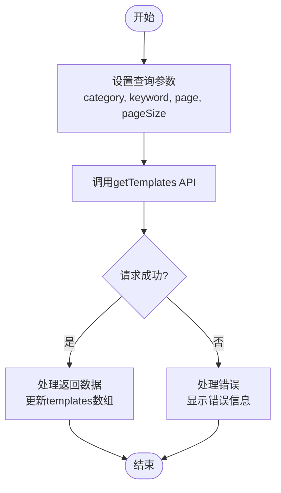

**图示来源**
- [templates.ts](file://frontend/src/api/templates.ts#L26-L28)
- [template.ts](file://frontend/src/stores/template.ts#L44-L53)

**本节来源**
- [templates.ts](file://frontend/src/api/templates.ts#L26-L28)
- [template.ts](file://frontend/src/stores/template.ts#L36-L102)

### 保存用户作品

将用户创建的信息图作品保存到服务器，包括标题、模板ID、输入文本和配置数据。

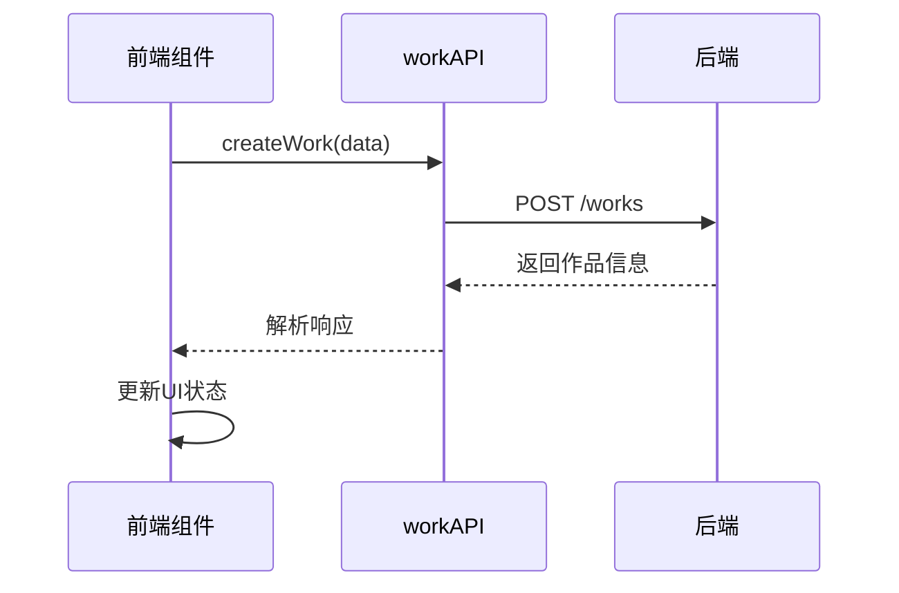

**图示来源**
- [work.ts](file://frontend/src/api/work.ts#L33-L35)
- [works.py](file://backend/app/api/v1/works.py#L16-L48)

**本节来源**
- [work.ts](file://frontend/src/api/work.ts#L33-L35)
- [works.py](file://backend/app/api/v1/works.py#L16-L48)

## 错误处理与重试机制

API客户端实现了统一的错误处理机制，所有请求失败都会在控制台输出错误信息。后端API返回标准的响应结构，包含success、data、message和error字段。

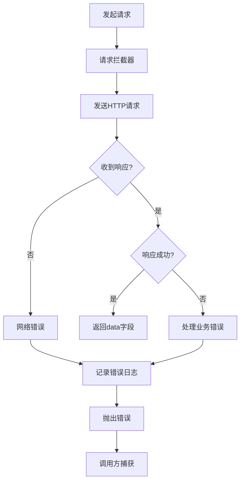

**图示来源**
- [client.ts](file://frontend/src/api/client.ts#L36-L45)
- [generate.py](file://backend/app/api/v1/generate.py#L58-L59)

**本节来源**
- [client.ts](file://frontend/src/api/client.ts#L36-L45)
- [generate.py](file://backend/app/api/v1/generate.py#L58-L59)

## 类型安全与数据模型映射

前端使用TypeScript定义了与后端数据模型对应的接口类型，确保类型安全的前后端通信。API响应结构统一，便于类型推断和错误处理。

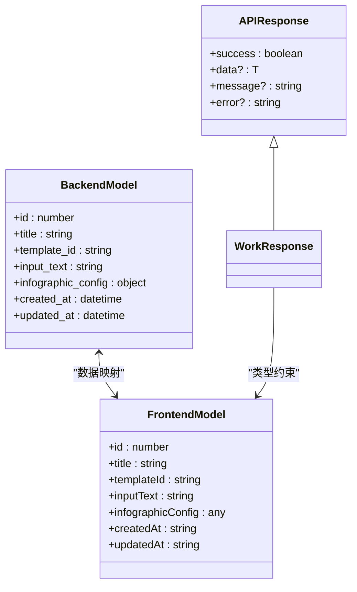

**图示来源**
- [work.ts](file://frontend/src/api/work.ts#L5-L28)
- [works.py](file://backend/app/api/v1/works.py#L7-L10)

**本节来源**
- [work.ts](file://frontend/src/api/work.ts#L5-L28)
- [works.py](file://backend/app/api/v1/works.py#L7-L10)

## 缓存策略

系统通过Pinia状态管理实现了模板数据的客户端缓存，减少重复API调用。模板列表和分类信息在首次获取后存储在store中，后续访问直接从内存读取。

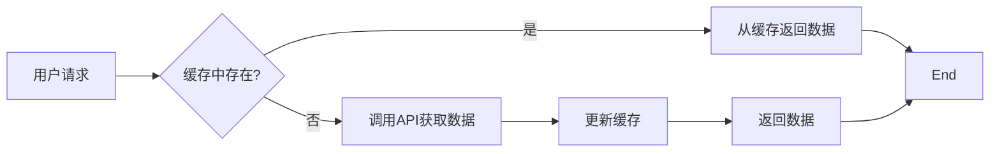

**图示来源**
- [template.ts](file://frontend/src/stores/template.ts#L38-L41)
- [template.ts](file://frontend/src/stores/template.ts#L44-L53)

**本节来源**
- [template.ts](file://frontend/src/stores/template.ts#L36-L102)