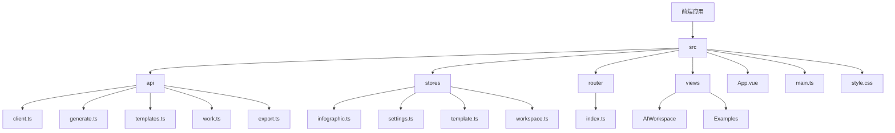
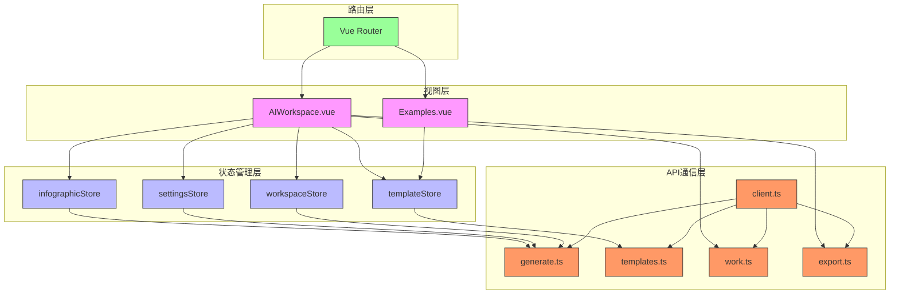
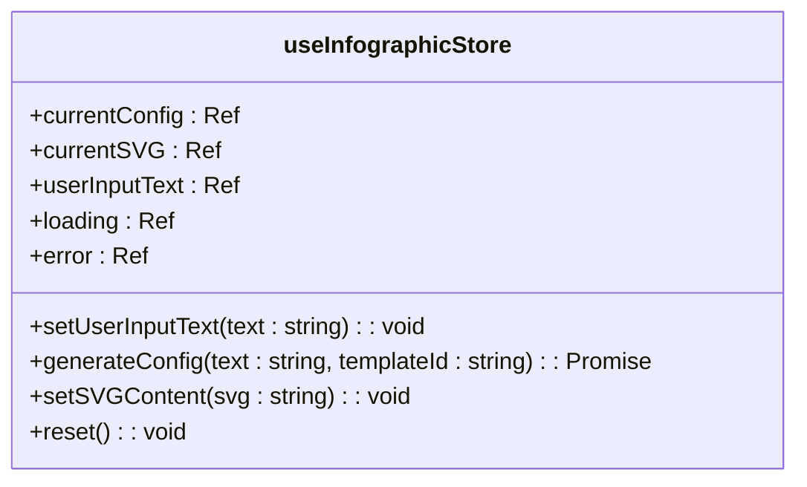
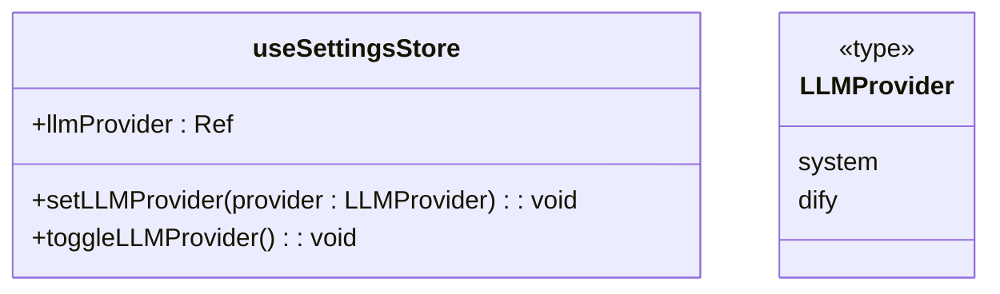
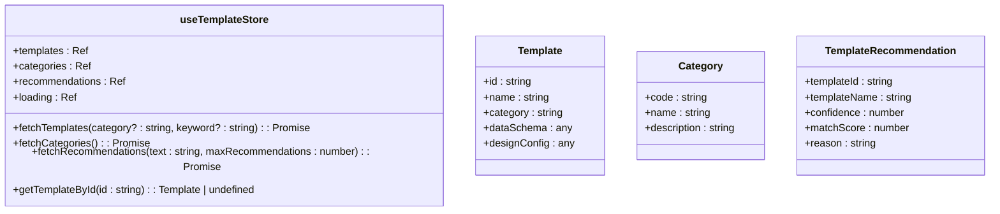
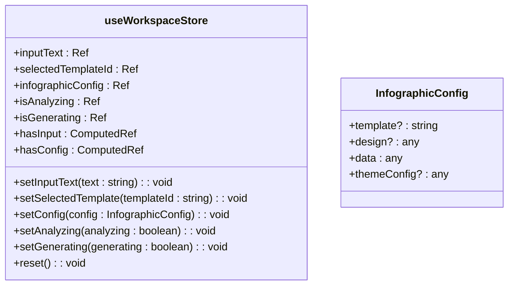
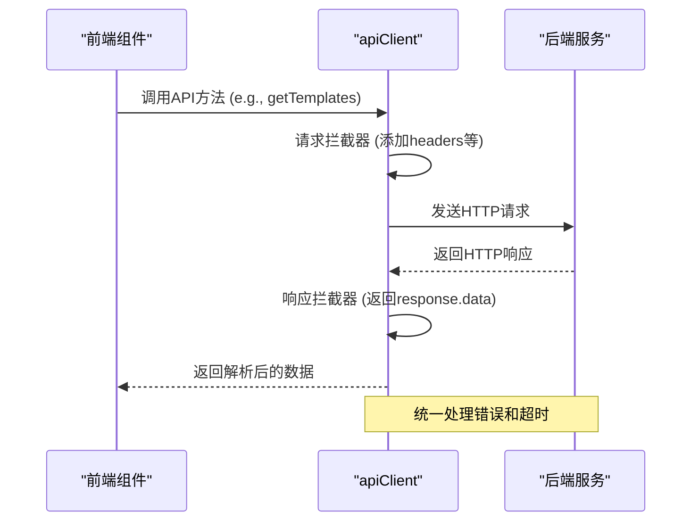
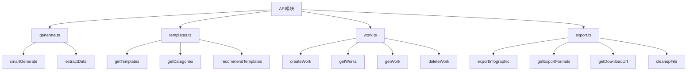
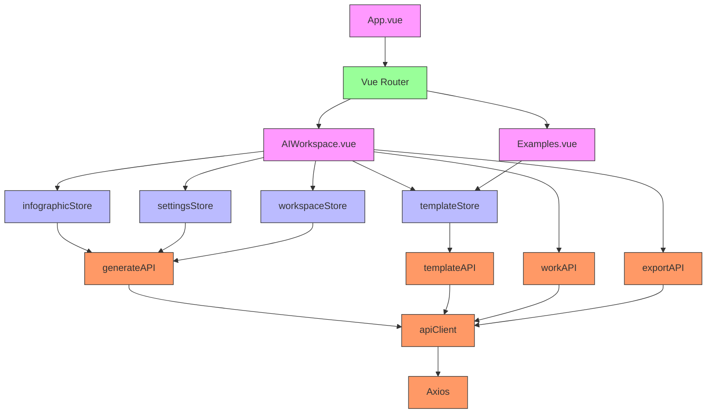

# 前端应用

<cite>
**本文档中引用的文件**  
- [main.ts](file://frontend/src/main.ts)
- [App.vue](file://frontend/src/App.vue)
- [index.ts](file://frontend/src/router/index.ts)
- [package.json](file://frontend/package.json)
- [vite.config.ts](file://frontend/vite.config.ts)
- [infographic.ts](file://frontend/src/stores/infographic.ts)
- [settings.ts](file://frontend/src/stores/settings.ts)
- [template.ts](file://frontend/src/stores/template.ts)
- [workspace.ts](file://frontend/src/stores/workspace.ts)
- [client.ts](file://frontend/src/api/client.ts)
- [generate.ts](file://frontend/src/api/generate.ts)
- [templates.ts](file://frontend/src/api/templates.ts)
- [work.ts](file://frontend/src/api/work.ts)
- [export.ts](file://frontend/src/api/export.ts)
- [style.css](file://frontend/src/style.css)
</cite>

## 目录
1. [项目结构](#项目结构)
2. [核心组件](#核心组件)
3. [架构概述](#架构概述)
4. [详细组件分析](#详细组件分析)
5. [依赖分析](#依赖分析)
6. [性能考虑](#性能考虑)
7. [故障排除指南](#故障排除指南)
8. [结论](#结论)

## 项目结构

前端应用采用基于Vue 3的模块化架构，组织清晰，职责分明。主要目录包括`src/api`（API客户端）、`src/stores`（Pinia状态管理）、`src/router`（路由配置）、`src/views`（视图组件）和`src/style.css`（全局样式）。项目通过Vite构建，配置了别名`@`指向`src`目录，并将`@antv/infographic`指向本地开发库，便于集成信息图渲染功能。



**Diagram sources**
- [main.ts](file://frontend/src/main.ts#L1-L17)
- [App.vue](file://frontend/src/App.vue#L1-L39)
- [vite.config.ts](file://frontend/vite.config.ts#L1-L25)

**Section sources**
- [frontend](file://frontend)
- [frontend/src](file://frontend/src)

## 核心组件

本应用的核心组件围绕Vue 3的组合式API和Pinia状态管理构建。`main.ts`是应用的入口点，负责初始化Vue应用、Pinia状态管理、Vue Router和Ant Design Vue组件库。`App.vue`作为根组件，仅包含一个`<router-view />`，用于渲染当前路由对应的视图。全局样式在`style.css`中定义，确保了跨组件的一致性。

**Section sources**
- [main.ts](file://frontend/src/main.ts#L1-L17)
- [App.vue](file://frontend/src/App.vue#L1-L39)
- [style.css](file://frontend/src/style.css#L1-L97)

## 架构概述

该前端应用采用现代化的Vue 3架构，以组件化和状态驱动为核心。整体架构分为四个主要层次：路由层、状态管理层、视图层和API通信层。



**Diagram sources**
- [main.ts](file://frontend/src/main.ts#L1-L17)
- [index.ts](file://frontend/src/router/index.ts#L1-L34)
- [infographic.ts](file://frontend/src/stores/infographic.ts#L1-L71)
- [settings.ts](file://frontend/src/stores/settings.ts#L1-L77)
- [template.ts](file://frontend/src/stores/template.ts#L1-L102)
- [workspace.ts](file://frontend/src/stores/workspace.ts#L1-L74)
- [client.ts](file://frontend/src/api/client.ts#L1-L46)

## 详细组件分析

### 状态管理分析

应用使用Pinia进行全局状态管理，将不同领域的状态分离到独立的store中，实现了良好的关注点分离。

#### infographicStore分析
`infographicStore`负责管理信息图的核心数据和状态，包括当前配置、SVG内容、用户输入文本、加载状态和错误信息。它提供了`generateConfig`方法来调用后端API生成信息图配置，并通过`setSVGContent`方法更新渲染结果。



**Diagram sources**
- [infographic.ts](file://frontend/src/stores/infographic.ts#L1-L71)

#### settingsStore分析
`settingsStore`管理用户的全局设置，特别是LLM提供商的选择（'system'或'dify'）。它利用`localStorage`实现持久化存储，并通过`watch`监听状态变化自动保存。这确保了用户偏好在页面刷新后依然保留。



**Diagram sources**
- [settings.ts](file://frontend/src/stores/settings.ts#L1-L77)

#### templateStore分析
`templateStore`集中管理模板数据，包括模板列表、分类信息和AI推荐结果。它提供了`fetchTemplates`、`fetchCategories`和`fetchRecommendations`等异步操作来从后端获取数据，并通过`getTemplateById`提供便捷的查找功能。



**Diagram sources**
- [template.ts](file://frontend/src/stores/template.ts#L1-L102)

#### workspaceStore分析
`workspaceStore`管理AI工作区的用户交互状态，如输入文本、选中的模板ID和生成的配置。它还包含`hasInput`和`hasConfig`等计算属性，用于简化视图中的条件判断。



**Diagram sources**
- [workspace.ts](file://frontend/src/stores/workspace.ts#L1-L74)

### API客户端分析

API客户端层封装了与后端服务的所有通信，确保了代码的可维护性和可测试性。

#### API客户端核心
`client.ts`文件创建了一个Axios实例，配置了基础URL、超时时间和默认请求头。它还定义了全局的请求和响应拦截器，其中响应拦截器直接返回`response.data`，简化了API调用。



**Diagram sources**
- [client.ts](file://frontend/src/api/client.ts#L1-L46)

#### API模块化设计
API功能被拆分为多个模块：`generate.ts`处理信息图生成，`templates.ts`处理模板管理，`work.ts`处理作品管理，`export.ts`处理文件导出。这种模块化设计使得代码结构清晰，易于扩展。



**Diagram sources**
- [generate.ts](file://frontend/src/api/generate.ts#L1-L26)
- [templates.ts](file://frontend/src/api/templates.ts#L1-L52)
- [work.ts](file://frontend/src/api/work.ts#L1-L62)
- [export.ts](file://frontend/src/api/export.ts#L1-L74)

### 路由配置分析

Vue Router负责管理应用的页面导航，当前配置了两个主要路由：根路径`/`指向`AIWorkspace`视图，`/examples`路径指向`Examples`视图。路由使用懒加载（`import('@/views/...')`），有助于优化初始加载性能。

```mermaid
graph TD
A[路由] --> B[/]
A --> C[/examples]
B --> D[AIWorkspace.vue]
C --> E[Examples.vue]
```

**Diagram sources**
- [index.ts](file://frontend/src/router/index.ts#L1-L34)

## 依赖分析

应用的依赖关系清晰，遵循单向数据流原则。视图组件依赖于Pinia stores来获取状态和调用操作，stores则依赖于API模块来与后端通信。API模块依赖于Axios进行HTTP请求。Vite配置中的别名简化了模块导入。



**Diagram sources**
- [package.json](file://frontend/package.json#L1-L27)
- [main.ts](file://frontend/src/main.ts#L1-L17)
- [vite.config.ts](file://frontend/vite.config.ts#L1-L25)

**Section sources**
- [package.json](file://frontend/package.json#L1-L27)
- [vite.config.ts](file://frontend/vite.config.ts#L1-L25)

## 性能考虑

应用在性能方面采取了多项优化措施。首先，使用Vite作为构建工具，提供了快速的开发服务器启动和热模块替换（HMR）。其次，路由配置采用了懒加载，将`AIWorkspace`和`Examples`视图的代码分割到独立的块中，减少了初始包的大小。API客户端设置了120秒的超时，以适应后端Dify工作流可能较长的处理时间。状态管理通过Pinia的响应式系统高效地更新视图，避免了不必要的重新渲染。

**Section sources**
- [vite.config.ts](file://frontend/vite.config.ts#L1-L25)
- [index.ts](file://frontend/src/router/index.ts#L1-L34)
- [client.ts](file://frontend/src/api/client.ts#L1-L46)

## 故障排除指南

### 常见问题
1. **路由错误**：`router.onError`已配置，会在控制台记录详细的路由错误信息。
2. **API请求失败**：`apiClient`的响应拦截器会记录错误，检查网络请求和后端服务状态。
3. **状态持久化失败**：`settingsStore`在读写`localStorage`时有try-catch处理，失败时会输出警告但不影响主流程。
4. **代理配置问题**：Vite配置了`/api`到`http://localhost:8000`的代理，确保开发环境下的跨域请求正常。

### 调试建议
- 使用浏览器开发者工具检查网络请求（Network tab）。
- 在控制台（Console tab）查看详细的错误堆栈。
- 检查`localStorage`中的`user_settings`键值以验证设置存储。
- 确认后端服务（`http://localhost:8000`）正在运行。

**Section sources**
- [index.ts](file://frontend/src/router/index.ts#L22-L31)
- [client.ts](file://frontend/src/api/client.ts#L41-L44)
- [settings.ts](file://frontend/src/stores/settings.ts#L17-L41)

## 结论

该前端应用是一个结构良好、功能完整的Vue 3单页应用。它成功地实现了基于组件化架构的设计，利用Pinia进行高效的状态管理，并通过模块化的API客户端与后端服务进行通信。路由配置清晰，性能优化得当。代码组织遵循最佳实践，具有良好的可维护性和可扩展性。通过详细的文档记录，开发者可以快速理解应用的各个组成部分及其交互方式。