# 状态管理

<cite>
**本文档引用的文件**
- [main.ts](file://frontend/src/main.ts)
- [infographic.ts](file://frontend/src/stores/infographic.ts)
- [settings.ts](file://frontend/src/stores/settings.ts)
- [template.ts](file://frontend/src/stores/template.ts)
- [workspace.ts](file://frontend/src/stores/workspace.ts)
- [LeftInputPanel.vue](file://frontend/src/views/AIWorkspace/components/LeftInputPanel.vue)
- [RightPreviewPanel.vue](file://frontend/src/views/AIWorkspace/components/RightPreviewPanel.vue)
- [WorkspaceHeader.vue](file://frontend/src/views/AIWorkspace/components/WorkspaceHeader.vue)
- [generate.ts](file://frontend/src/api/generate.ts)
- [templates.ts](file://frontend/src/api/templates.ts)
- [work.ts](file://frontend/src/api/work.ts)
</cite>

## 目录
1. [概述](#概述)
2. [项目架构](#项目架构)
3. [核心Store设计](#核心store设计)
4. [模块化Store组织](#模块化store组织)
5. [状态管理最佳实践](#状态管理最佳实践)
6. [跨Store数据交互](#跨store数据交互)
7. [持久化存储机制](#持久化存储机制)
8. [错误处理与监控](#错误处理与监控)
9. [性能优化策略](#性能优化策略)
10. [实际应用案例](#实际应用案例)
11. [总结](#总结)

## 概述

该项目采用Pinia作为状态管理解决方案，构建了四个核心store：infographic、settings、template和workspace。这种模块化的状态管理架构为复杂的AI信息图表生成应用提供了清晰的数据流管理和组件间通信机制。

Pinia作为Vue 3的官方状态管理库，提供了TypeScript友好的API、热重载支持和开发者工具集成，特别适合本项目的复杂业务场景。

## 项目架构

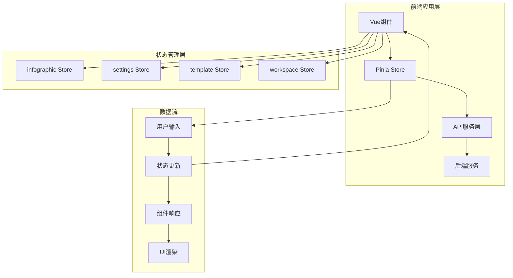

**图表来源**
- [main.ts](file://frontend/src/main.ts#L1-L17)
- [infographic.ts](file://frontend/src/stores/infographic.ts#L1-L71)
- [settings.ts](file://frontend/src/stores/settings.ts#L1-L77)
- [template.ts](file://frontend/src/stores/template.ts#L1-L102)
- [workspace.ts](file://frontend/src/stores/workspace.ts#L1-L74)

**章节来源**
- [main.ts](file://frontend/src/main.ts#L1-L17)

## 核心Store设计

### infographic Store - 信息图状态管理

infographic store负责管理信息图的生成配置、SVG内容和用户输入数据。

#### 数据结构设计

| 状态属性 | 类型 | 描述 | 默认值 |
|---------|------|------|--------|
| currentConfig | any | 当前信息图配置对象 | null |
| currentSVG | string | 生成的SVG内容 | '' |
| userInputText | string | 用户输入的原始文本 | '' |
| loading | boolean | 生成过程加载状态 | false |
| error | string \| null | 错误信息 | null |

#### 核心功能实现

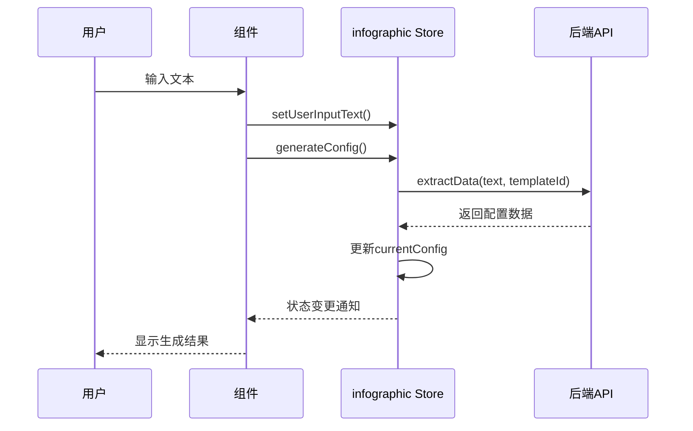

**图表来源**
- [infographic.ts](file://frontend/src/stores/infographic.ts#L18-L40)
- [LeftInputPanel.vue](file://frontend/src/views/AIWorkspace/components/LeftInputPanel.vue#L81-L126)

**章节来源**
- [infographic.ts](file://frontend/src/stores/infographic.ts#L1-L71)

### settings Store - 用户设置管理

settings store专门管理用户的全局配置，特别是LLM提供商的选择和持久化。

#### 类型定义与持久化

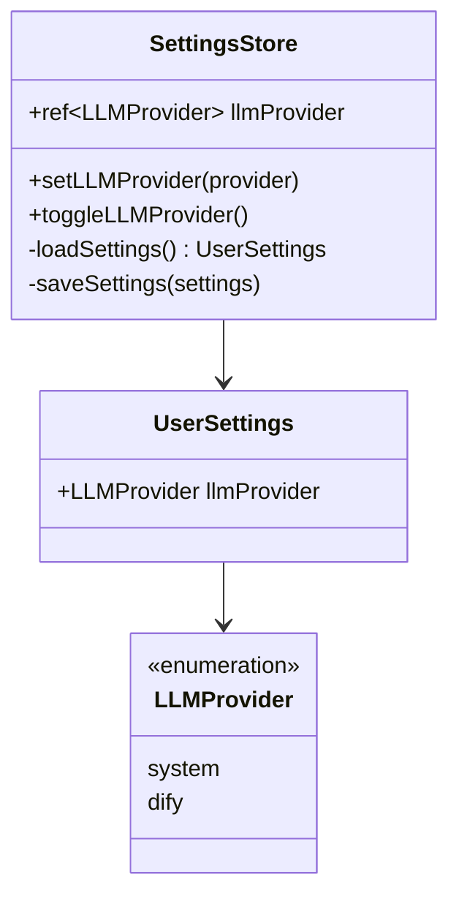

**图表来源**
- [settings.ts](file://frontend/src/stores/settings.ts#L8-L14)
- [settings.ts](file://frontend/src/stores/settings.ts#L43-L76)

#### 持久化机制

settings store实现了自动化的本地存储同步：

- **自动加载**：应用启动时从localStorage恢复设置
- **实时同步**：状态变更时自动保存到localStorage
- **错误处理**：存储失败时提供降级处理

**章节来源**
- [settings.ts](file://frontend/src/stores/settings.ts#L1-L77)

### template Store - 模板管理

template store负责模板数据的获取、缓存和推荐算法。

#### 数据模型设计

| 接口类型 | 属性 | 类型 | 描述 |
|---------|------|------|------|
| Template | id | string | 模板唯一标识 |
| Template | name | string | 模板名称 |
| Template | category | string | 所属分类 |
| Template | dataSchema | any | 数据结构定义 |
| Template | designConfig | any | 设计配置 |
| Category | code | string | 分类代码 |
| Category | name | string | 分类名称 |
| TemplateRecommendation | templateId | string | 推荐模板ID |
| TemplateRecommendation | confidence | number | 置信度(0-1) |
| TemplateRecommendation | matchScore | number | 匹配分数(%) |

#### 异步数据流程

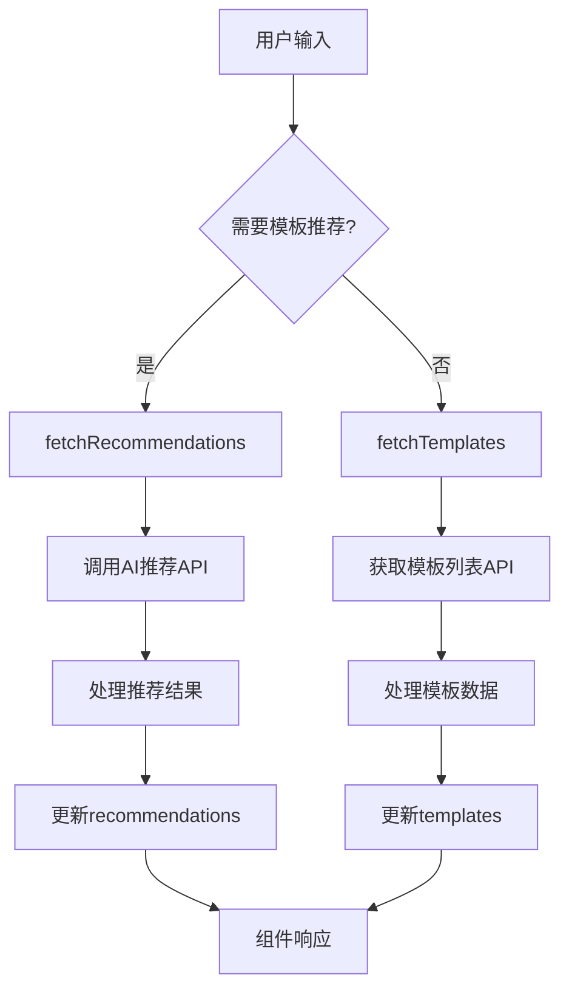

**图表来源**
- [template.ts](file://frontend/src/stores/template.ts#L44-L83)
- [templates.ts](file://frontend/src/api/templates.ts#L37-L45)

**章节来源**
- [template.ts](file://frontend/src/stores/template.ts#L1-L102)

### workspace Store - 工作区状态

workspace store管理整个工作区的业务流程状态，是连接其他store的核心枢纽。

#### 状态计算属性

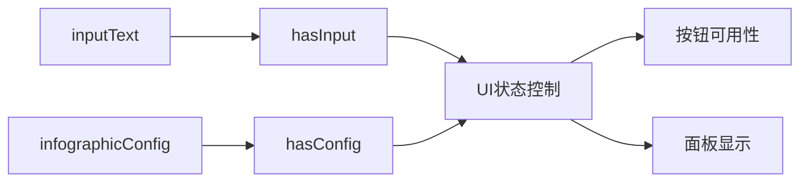

**图表来源**
- [workspace.ts](file://frontend/src/stores/workspace.ts#L23-L24)

#### 工作流程状态管理

| 状态标志 | 类型 | 用途 | 触发条件 |
|---------|------|------|----------|
| isAnalyzing | boolean | 分析过程状态 | 开始智能分析时 |
| isGenerating | boolean | 生成过程状态 | 开始信息图生成时 |
| hasInput | computed | 输入有效性检查 | inputText变化时 |
| hasConfig | computed | 配置完整性检查 | infographicConfig变化时 |

**章节来源**
- [workspace.ts](file://frontend/src/stores/workspace.ts#L1-L74)

## 模块化Store组织

### Store间依赖关系

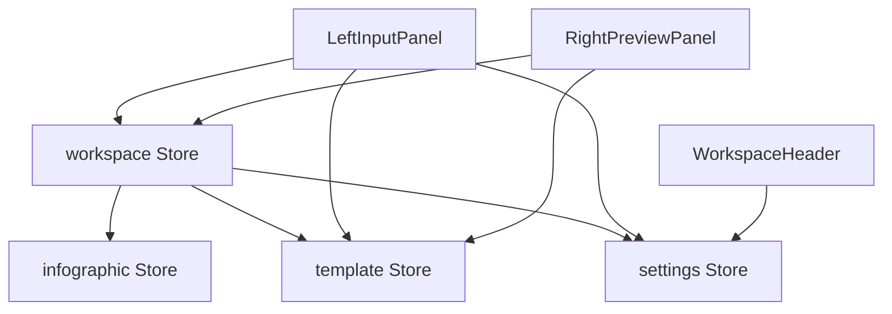

**图表来源**
- [LeftInputPanel.vue](file://frontend/src/views/AIWorkspace/components/LeftInputPanel.vue#L53-L58)
- [RightPreviewPanel.vue](file://frontend/src/views/AIWorkspace/components/RightPreviewPanel.vue#L160-L161)
- [WorkspaceHeader.vue](file://frontend/src/views/AIWorkspace/components/WorkspaceHeader.vue#L83-L84)

### Store注册与初始化

项目在主应用入口统一注册Pinia实例：

```typescript
// 主应用初始化
const app = createApp(App)
const pinia = createPinia()
app.use(pinia)
app.use(router)
app.use(Antd)
app.mount('#app')
```

这种集中式注册方式确保了：
- 全局状态管理的一致性
- 开发者工具的统一访问
- 热重载功能的正常工作

**章节来源**
- [main.ts](file://frontend/src/main.ts#L1-L17)

## 状态管理最佳实践

### 响应式状态设计

所有store都采用Vue 3的响应式系统：

- **ref**：用于基本数据类型的响应式包装
- **computed**：用于派生状态的计算属性
- **watch**：用于状态变化的监听和副作用处理

### 异步操作模式

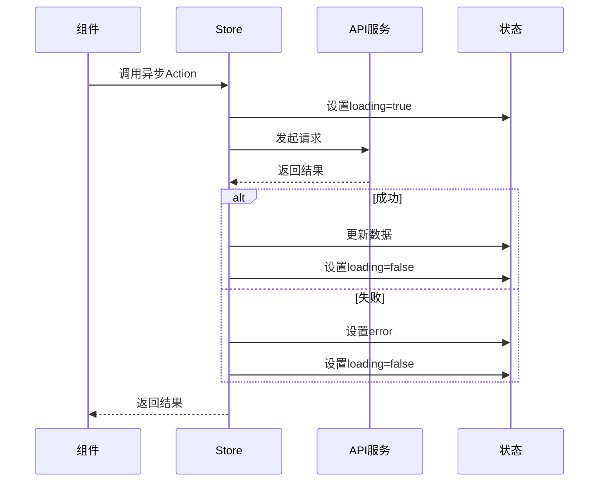

**图表来源**
- [infographic.ts](file://frontend/src/stores/infographic.ts#L25-L40)
- [template.ts](file://frontend/src/stores/template.ts#L44-L53)

### 错误边界处理

每个异步操作都包含完整的错误处理：

- **统一错误捕获**：所有API调用都在try-catch块中
- **错误状态管理**：明确的错误状态标识
- **用户友好提示**：通过message组件提供反馈

**章节来源**
- [infographic.ts](file://frontend/src/stores/infographic.ts#L34-L36)
- [template.ts](file://frontend/src/stores/template.ts#L62-L64)

## 跨Store数据交互

### 数据流向设计

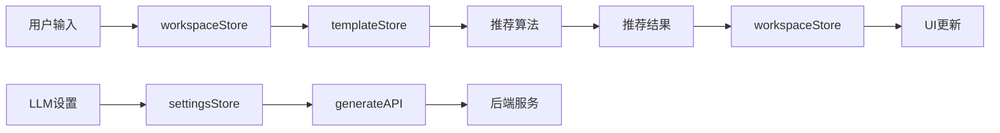

**图表来源**
- [LeftInputPanel.vue](file://frontend/src/views/AIWorkspace/components/LeftInputPanel.vue#L90-L115)
- [RightPreviewPanel.vue](file://frontend/src/views/AIWorkspace/components/RightPreviewPanel.vue#L248-L259)

### 组件间状态共享

通过组合式API实现store的解耦使用：

```typescript
// 在组件中使用多个store
const workspaceStore = useWorkspaceStore()
const templateStore = useTemplateStore()
const settingsStore = useSettingsStore()

// 计算属性绑定
const hasInput = computed(() => workspaceStore.hasInput)
const recommendations = computed(() => templateStore.recommendations)
const llmProvider = computed(() => settingsStore.llmProvider)
```

### 状态同步机制

- **自动同步**：settings store的变更自动触发localStorage保存
- **手动同步**：workspace store的状态变更通过组件响应式更新
- **事件驱动**：通过watch监听关键状态变化

**章节来源**
- [LeftInputPanel.vue](file://frontend/src/views/AIWorkspace/components/LeftInputPanel.vue#L67-L70)
- [RightPreviewPanel.vue](file://frontend/src/views/AIWorkspace/components/RightPreviewPanel.vue#L177-L182)

## 持久化存储机制

### 自动持久化策略

settings store实现了完整的自动持久化：

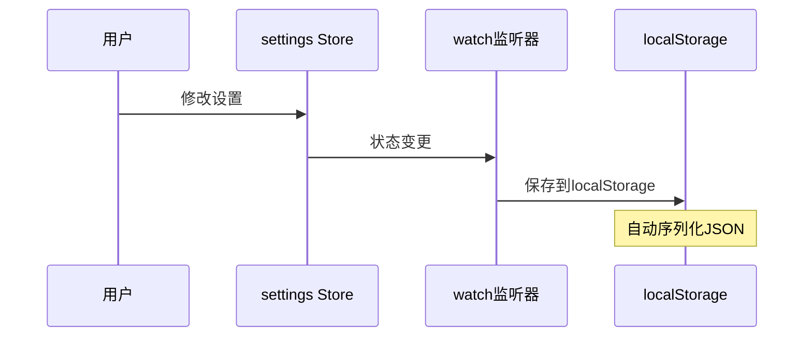

**图表来源**
- [settings.ts](file://frontend/src/stores/settings.ts#L50-L57)

### 存储策略特点

| 特性 | 实现方式 | 优势 |
|------|----------|------|
| 自动加载 | 应用启动时读取 | 无需手动初始化 |
| 实时同步 | watch监听状态变化 | 确保数据一致性 |
| 错误容错 | try-catch包裹 | 防止存储失败影响应用 |
| 类型安全 | TypeScript接口约束 | 编译时类型检查 |

### 数据迁移处理

对于settings store，实现了版本兼容性：

- **默认值提供**：缺失字段自动使用默认值
- **类型转换**：确保存储数据的类型正确性
- **降级处理**：存储损坏时提供安全的降级方案

**章节来源**
- [settings.ts](file://frontend/src/stores/settings.ts#L16-L32)

## 错误处理与监控

### 分层错误处理

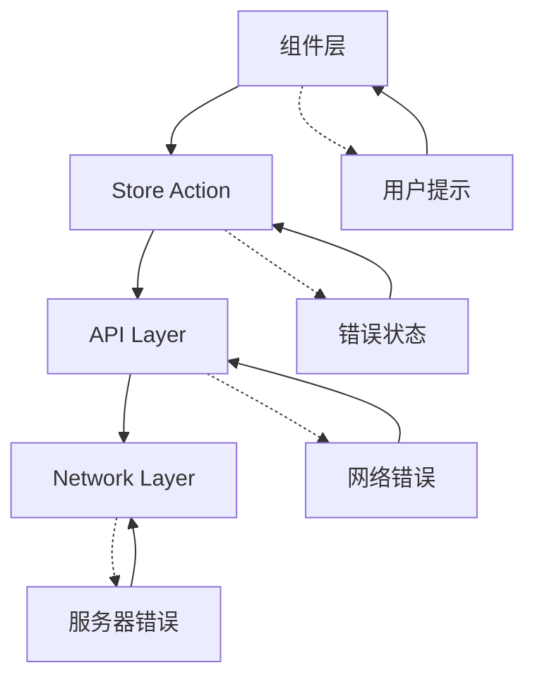

### 错误处理策略

| 层级 | 处理方式 | 用户体验 |
|------|----------|----------|
| 组件层 | message警告 | 友好提示 |
| Store层 | 设置error状态 | 状态反馈 |
| API层 | 统一错误响应 | 标准化处理 |
| 网络层 | 网络状态检测 | 连接状态提示 |

### 监控与调试

- **开发者工具集成**：Pinia DevTools提供状态可视化
- **日志记录**：关键操作的console日志
- **状态快照**：支持状态的保存和恢复

**章节来源**
- [infographic.ts](file://frontend/src/stores/infographic.ts#L34-L36)
- [template.ts](file://frontend/src/stores/template.ts#L62-L64)

## 性能优化策略

### 状态更新优化

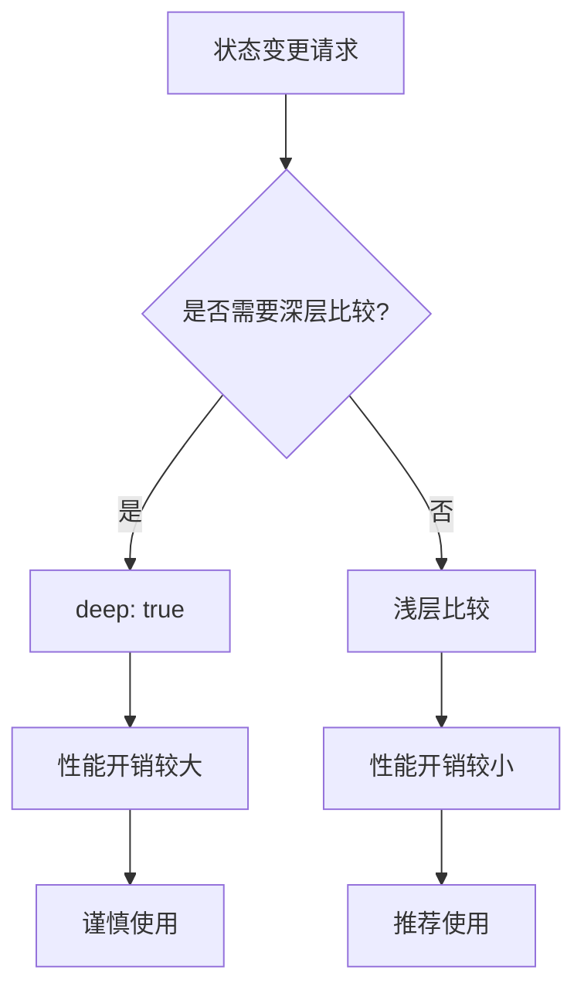

### 内存管理

- **及时清理**：组件卸载时清理相关状态
- **避免循环引用**：合理设计数据结构
- **懒加载**：按需加载大型数据集

### 响应式优化

- **计算属性缓存**：利用Vue的计算属性缓存机制
- **细粒度更新**：只更新必要的状态部分
- **批量操作**：合并多个状态变更

**章节来源**
- [RightPreviewPanel.vue](file://frontend/src/views/AIWorkspace/components/RightPreviewPanel.vue#L208-L231)

## 实际应用案例

### 智能模板推荐流程

这是一个典型的多store协作场景：

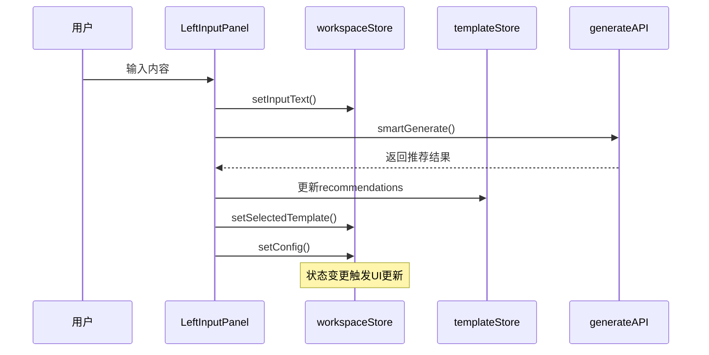

**图表来源**
- [LeftInputPanel.vue](file://frontend/src/views/AIWorkspace/components/LeftInputPanel.vue#L81-L126)

### 信息图生成工作流

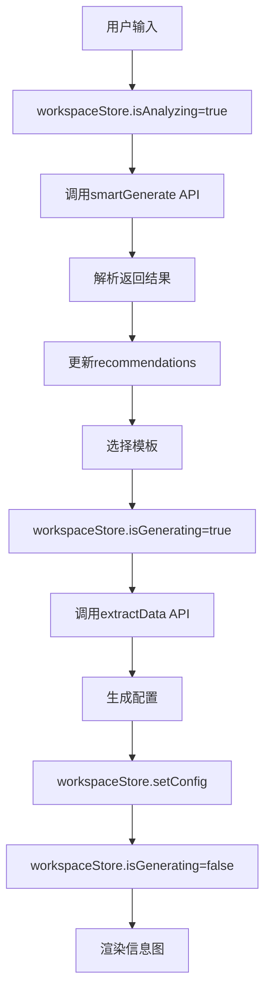

**图表来源**
- [LeftInputPanel.vue](file://frontend/src/views/AIWorkspace/components/LeftInputPanel.vue#L129-L158)

### 设置变更影响链

settings store的变更会影响到多个业务流程：

- **LLM提供商切换**：影响所有AI生成操作
- **自动保存机制**：确保设置持久化
- **全局状态更新**：即时反映在所有相关组件

**章节来源**
- [LeftInputPanel.vue](file://frontend/src/views/AIWorkspace/components/LeftInputPanel.vue#L133-L138)
- [WorkspaceHeader.vue](file://frontend/src/views/AIWorkspace/components/WorkspaceHeader.vue#L93-L95)

## 总结

基于Pinia的状态管理模式为该项目带来了以下优势：

### 架构优势

1. **模块化设计**：四个store各司其职，职责清晰
2. **类型安全**：完整的TypeScript类型定义
3. **开发体验**：优秀的开发者工具支持
4. **性能表现**：响应式更新机制高效

### 可维护性提升

- **状态集中管理**：便于调试和追踪
- **组件解耦**：通过store实现松耦合
- **错误处理完善**：分层错误处理机制
- **持久化支持**：重要设置自动保存

### 扩展性考虑

- **易于扩展**：新增store不影响现有架构
- **API标准化**：统一的异步操作模式
- **类型系统**：新功能的类型安全保障

这种状态管理模式不仅满足了当前业务需求，也为未来的功能扩展奠定了坚实的基础。通过合理的抽象和封装，项目实现了复杂业务逻辑的有效管理，同时保持了代码的可读性和可维护性。