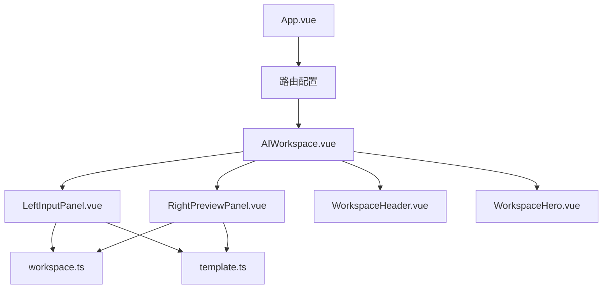
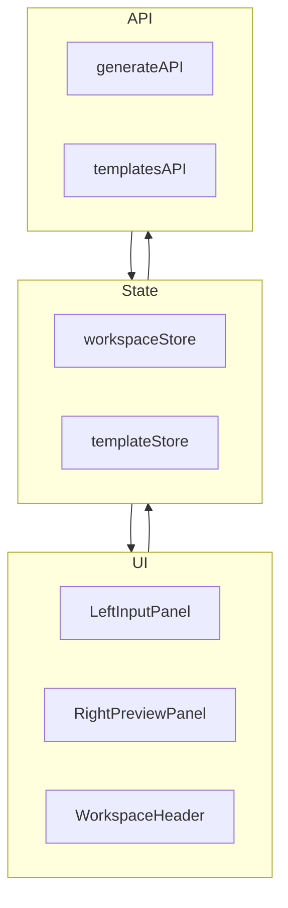
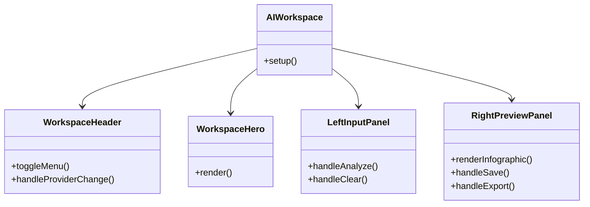
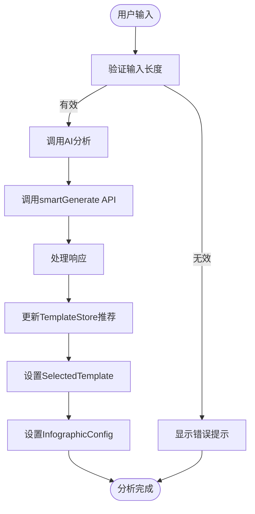
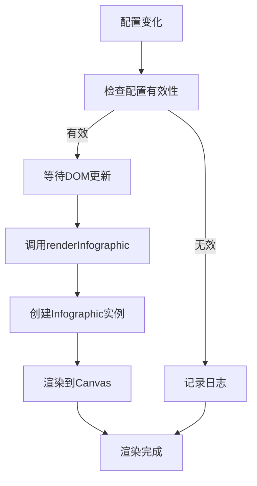
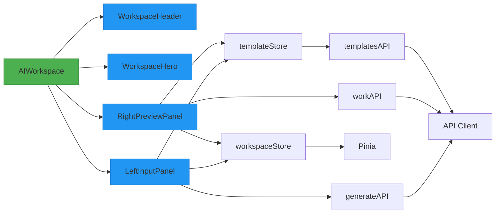

# 组件架构

<cite>
**本文档引用的文件**  
- [AIWorkspace.vue](file://frontend/src/views/AIWorkspace/AIWorkspace.vue)
- [LeftInputPanel.vue](file://frontend/src/views/AIWorkspace/components/LeftInputPanel.vue)
- [RightPreviewPanel.vue](file://frontend/src/views/AIWorkspace/components/RightPreviewPanel.vue)
- [WorkspaceHeader.vue](file://frontend/src/views/AIWorkspace/components/WorkspaceHeader.vue)
- [workspace.ts](file://frontend/src/stores/workspace.ts)
- [template.ts](file://frontend/src/stores/template.ts)
- [generate.ts](file://frontend/src/api/generate.ts)
- [main.ts](file://frontend/src/main.ts)
</cite>

## 目录
1. [简介](#简介)
2. [项目结构](#项目结构)
3. [核心组件](#核心组件)
4. [架构概述](#架构概述)
5. [详细组件分析](#详细组件分析)
6. [依赖分析](#依赖分析)
7. [性能考虑](#性能考虑)
8. [故障排除指南](#故障排除指南)
9. [结论](#结论)

## 简介
本项目是一个基于Vue 3的AI图表生成器，采用单文件组件（SFC）架构设计。系统通过AI分析用户输入的文本内容，智能推荐并生成可视化信息图。前端采用Vue 3组合式API，配合Pinia状态管理，实现了响应式数据流和组件间通信。主要功能包括文本输入、模板推荐、信息图预览和导出等。

## 项目结构
项目采用典型的Vue 3单页应用结构，核心功能集中在`frontend`目录下。`AIWorkspace`作为主工作区组件，包含左右两个主要面板：左侧输入面板和右侧预览面板。状态管理采用Pinia，API调用通过模块化方式组织。

**图表来源**
- [AIWorkspace.vue](file://frontend/src/views/AIWorkspace/AIWorkspace.vue)
- [LeftInputPanel.vue](file://frontend/src/views/AIWorkspace/components/LeftInputPanel.vue)
- [RightPreviewPanel.vue](file://frontend/src/views/AIWorkspace/components/RightPreviewPanel.vue)

**章节来源**
- [AIWorkspace.vue](file://frontend/src/views/AIWorkspace/AIWorkspace.vue)
- [main.ts](file://frontend/src/main.ts)

## 核心组件
系统核心由AIWorkspace及其子组件构成，采用清晰的职责划分。LeftInputPanel负责用户输入和AI分析，RightPreviewPanel负责信息图渲染和交互，通过Pinia状态管理实现数据共享和响应式更新。

**章节来源**
- [AIWorkspace.vue](file://frontend/src/views/AIWorkspace/AIWorkspace.vue)
- [LeftInputPanel.vue](file://frontend/src/views/AIWorkspace/components/LeftInputPanel.vue)
- [RightPreviewPanel.vue](file://frontend/src/views/AIWorkspace/components/RightPreviewPanel.vue)

## 架构概述
系统采用分层架构，从上至下包括UI组件层、状态管理层和API服务层。UI组件通过props和事件进行通信，共享状态通过Pinia store集中管理。右侧预览面板监听配置变化，动态渲染信息图。

**图表来源**
- [workspace.ts](file://frontend/src/stores/workspace.ts)
- [template.ts](file://frontend/src/stores/template.ts)
- [generate.ts](file://frontend/src/api/generate.ts)

**章节来源**
- [workspace.ts](file://frontend/src/stores/workspace.ts)
- [template.ts](file://frontend/src/stores/template.ts)

## 详细组件分析
### AIWorkspace组件分析
AIWorkspace作为根组件，负责协调子组件和初始化应用状态。通过路由配置加载，初始化时获取模板分类数据。

#### 组件关系图

**图表来源**
- [AIWorkspace.vue](file://frontend/src/views/AIWorkspace/AIWorkspace.vue)
- [WorkspaceHeader.vue](file://frontend/src/views/AIWorkspace/components/WorkspaceHeader.vue)
- [WorkspaceHero.vue](file://frontend/src/views/AIWorkspace/components/WorkspaceHero.vue)

**章节来源**
- [AIWorkspace.vue](file://frontend/src/views/AIWorkspace/AIWorkspace.vue)
- [router/index.ts](file://frontend/src/router/index.ts)

### LeftInputPanel组件分析
左侧输入面板负责用户输入和AI分析，通过计算属性与状态管理store同步数据。

#### 数据流图

**图表来源**
- [LeftInputPanel.vue](file://frontend/src/views/AIWorkspace/components/LeftInputPanel.vue)
- [workspace.ts](file://frontend/src/stores/workspace.ts)
- [template.ts](file://frontend/src/stores/template.ts)

**章节来源**
- [LeftInputPanel.vue](file://frontend/src/views/AIWorkspace/components/LeftInputPanel.vue)
- [generate.ts](file://frontend/src/api/generate.ts)

### RightPreviewPanel组件分析
右侧预览面板负责信息图渲染和用户交互，监听配置变化并动态更新视图。

#### 渲染流程图

**图表来源**
- [RightPreviewPanel.vue](file://frontend/src/views/AIWorkspace/components/RightPreviewPanel.vue)
- [workspace.ts](file://frontend/src/stores/workspace.ts)

**章节来源**
- [RightPreviewPanel.vue](file://frontend/src/views/AIWorkspace/components/RightPreviewPanel.vue)
- [workspace.ts](file://frontend/src/stores/workspace.ts)

## 依赖分析
系统依赖关系清晰，采用模块化设计，各组件职责分明。

**图表来源**
- [main.ts](file://frontend/src/main.ts)
- [workspace.ts](file://frontend/src/stores/workspace.ts)
- [template.ts](file://frontend/src/stores/template.ts)

**章节来源**
- [main.ts](file://frontend/src/main.ts)
- [workspace.ts](file://frontend/src/stores/workspace.ts)

## 性能考虑
系统在性能方面做了多项优化：
- 使用`nextTick`双层调用确保DOM更新完成
- 采用懒加载方式导入API模块
- 通过Pinia store集中管理状态，避免不必要的重新渲染
- 在组件卸载时清理实例，防止内存泄漏

**章节来源**
- [RightPreviewPanel.vue](file://frontend/src/views/AIWorkspace/components/RightPreviewPanel.vue)
- [LeftInputPanel.vue](file://frontend/src/views/AIWorkspace/components/LeftInputPanel.vue)

## 故障排除指南
常见问题及解决方案：
- **配置变化未触发渲染**：检查`watch`的`deep`和`immediate`选项
- **Canvas未就绪**：确保`nextTick`调用足够等待DOM更新
- **资源加载失败**：检查网络连接和资源URL格式
- **状态不同步**：验证Pinia store的getter和setter是否正确

**章节来源**
- [RightPreviewPanel.vue](file://frontend/src/views/AIWorkspace/components/RightPreviewPanel.vue)
- [workspace.ts](file://frontend/src/stores/workspace.ts)

## 结论
本项目展示了基于Vue 3的现代化前端组件架构设计。通过单文件组件、组合式API和Pinia状态管理，实现了清晰的组件划分和高效的状态管理。AIWorkspace及其子组件的协作模式为类似应用提供了良好的参考范例。