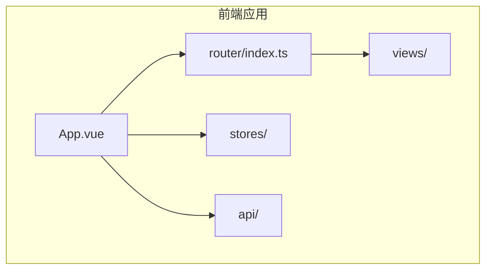
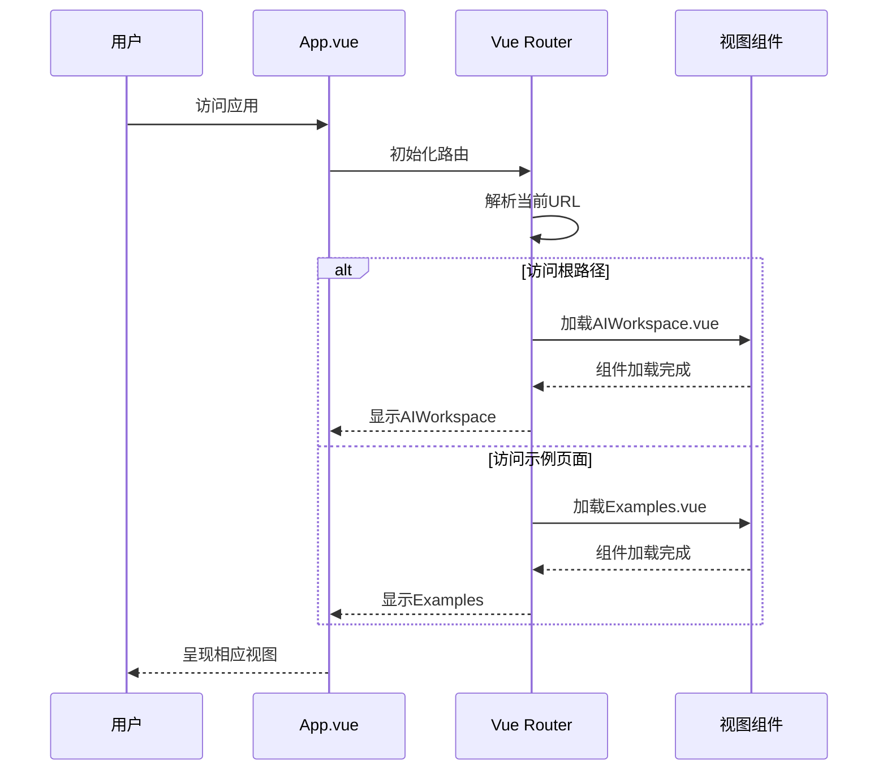
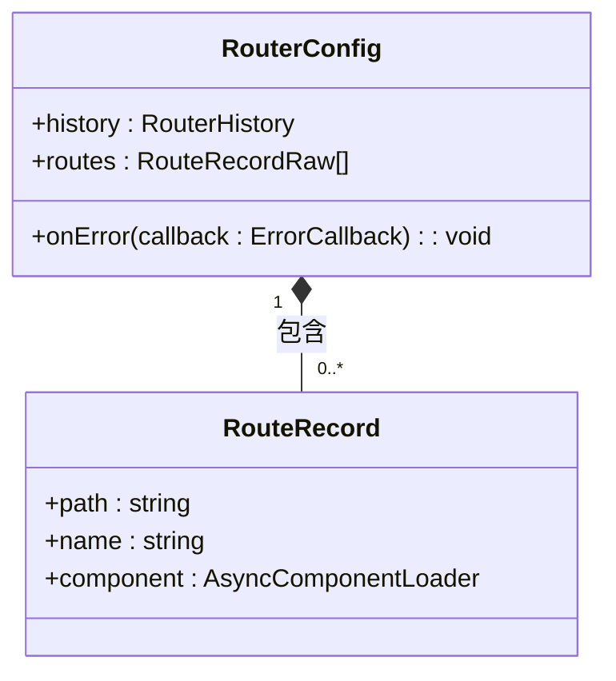
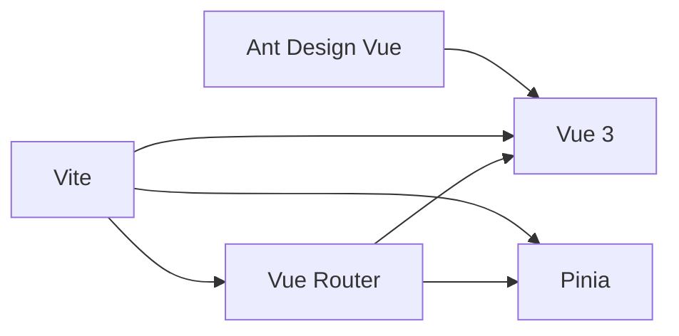

# 路由系统

<cite>
**本文档中引用的文件**  
- [index.ts](file://frontend/src/router/index.ts)
- [App.vue](file://frontend/src/App.vue)
- [main.ts](file://frontend/src/main.ts)
- [AIWorkspace.vue](file://frontend/src/views/AIWorkspace/AIWorkspace.vue)
- [Examples.vue](file://frontend/src/views/Examples/Examples.vue)
- [vite.config.ts](file://frontend/vite.config.ts)
- [package.json](file://frontend/package.json)
</cite>

## 目录
1. [项目结构](#项目结构)
2. [核心组件](#核心组件)
3. [架构概述](#架构概述)
4. [详细组件分析](#详细组件分析)
5. [依赖分析](#依赖分析)
6. [性能考虑](#性能考虑)
7. [故障排除指南](#故障排除指南)
8. [结论](#结论)

## 项目结构

该项目的前端路由系统基于Vue Router 4构建，采用模块化设计，将路由配置独立于主应用逻辑之外。整个项目结构清晰地划分为多个功能模块，其中`frontend/src/router/index.ts`是路由配置的核心文件，负责定义所有路由规则和导航行为。

**图示来源**  
- [index.ts](file://frontend/src/router/index.ts#L1-L33)
- [App.vue](file://frontend/src/App.vue#L1-L39)

**本节来源**  
- [index.ts](file://frontend/src/router/index.ts#L1-L33)
- [App.vue](file://frontend/src/App.vue#L1-L39)
- [main.ts](file://frontend/src/main.ts#L1-L17)

## 核心组件

路由系统的核心组件包括路由配置文件、视图组件和主应用入口。`index.ts`文件通过`createRouter`和`createWebHistory`创建了一个基于HTML5 History API的路由器实例，并定义了两个主要路由：根路径`/`映射到AIWorkspace视图，`/examples`路径映射到Examples视图。这两个路由均采用动态导入（懒加载）策略，以优化首屏加载性能。

路由错误处理机制也被集成在配置中，通过`router.onError`监听路由跳转过程中的错误，并在控制台输出详细的错误信息，包括错误消息、堆栈跟踪、错误名称和原因，便于开发调试。

**本节来源**  
- [index.ts](file://frontend/src/router/index.ts#L1-L33)
- [AIWorkspace.vue](file://frontend/src/views/AIWorkspace/AIWorkspace.vue)
- [Examples.vue](file://frontend/src/views/Examples/Examples.vue)

## 架构概述

整个路由系统的架构遵循Vue 3的组合式API设计模式，通过Pinia进行状态管理，与路由系统协同工作。应用启动时，在`main.ts`中创建Vue应用实例，并依次注册Pinia状态管理、Vue Router和Ant Design Vue组件库，最后挂载到DOM元素上。

路由系统采用基于文件路径的懒加载策略，通过`import('@/views/...')`语法实现代码分割，确保只有当用户访问特定路由时，对应的视图组件才会被加载，从而显著减少初始加载时间。这种设计模式不仅提高了应用性能，还增强了可维护性。

**图示来源**  
- [main.ts](file://frontend/src/main.ts#L1-L17)
- [index.ts](file://frontend/src/router/index.ts#L1-L33)
- [App.vue](file://frontend/src/App.vue#L1-L39)

## 详细组件分析

### 路由配置分析

路由配置文件`index.ts`采用了简洁而高效的配置方式，定义了应用的路由表。每个路由对象包含路径（path）、名称（name）和组件（component）三个基本属性。组件属性使用动态导入语法，实现了路由级别的代码分割。

**图示来源**  
- [index.ts](file://frontend/src/router/index.ts#L6-L20)

#### 路由参数与查询处理

虽然当前配置中未直接体现路由参数和查询参数的处理，但Vue Router 4支持通过`params`和`query`对象访问动态路由参数和URL查询参数。在视图组件中，可以通过`useRoute`组合式API钩子获取当前路由的完整信息，包括路径参数、查询参数、哈希值等。

编程式导航通过`useRouter`钩子提供的`push`、`replace`等方法实现，允许在组件逻辑中动态控制导航行为，如表单提交后跳转、权限验证失败重定向等场景。

**本节来源**  
- [index.ts](file://frontend/src/router/index.ts#L1-L33)

### 视图组件分析

视图组件位于`frontend/src/views`目录下，目前包含AIWorkspace和Examples两个主要视图。这些组件作为路由的目标，负责呈现特定页面的内容和交互逻辑。通过在`App.vue`中使用`<router-view />`标签，Vue Router会根据当前URL自动渲染匹配的视图组件。

AIWorkspace作为默认工作区，可能包含图表生成、编辑等核心功能；Examples页面则用于展示各种图表模板和示例，帮助用户快速了解系统能力。

**本节来源**  
- [App.vue](file://frontend/src/App.vue#L1-L39)
- [AIWorkspace.vue](file://frontend/src/views/AIWorkspace/AIWorkspace.vue)
- [Examples.vue](file://frontend/src/views/Examples/Examples.vue)

## 依赖分析

路由系统依赖于多个核心库和配置文件。`package.json`文件明确列出了`vue-router`作为项目依赖，版本为`^4.6.3`，确保了路由功能的稳定性和兼容性。Vite构建工具通过`vite.config.ts`中的别名配置，简化了模块导入路径，使`@`符号可以指向`src`目录，提高了代码的可读性和可维护性。

**图示来源**  
- [package.json](file://frontend/package.json#L1-L27)
- [vite.config.ts](file://frontend/vite.config.ts#L1-L25)

**本节来源**  
- [package.json](file://frontend/package.json#L1-L27)
- [vite.config.ts](file://frontend/vite.config.ts#L1-L25)
- [main.ts](file://frontend/src/main.ts#L1-L17)

## 性能考虑

路由级别的代码分割（懒加载）是本系统性能优化的关键策略。通过将不同视图组件分割成独立的代码块，仅在需要时加载，显著减少了初始包大小，加快了首屏渲染速度。这种按需加载的模式特别适合包含多个功能模块的大型单页应用。

此外，错误处理机制的内置也提升了应用的健壮性，能够在路由跳转失败时提供详细的调试信息，帮助开发者快速定位问题，间接提高了开发效率和用户体验。

## 故障排除指南

当遇到路由相关问题时，应首先检查以下方面：
- 确认路由路径拼写正确，与视图组件的实际路径匹配
- 检查动态导入语法是否正确，确保组件路径无误
- 查看浏览器控制台是否有模块解析错误或网络请求失败
- 验证Vite配置中的别名是否正确设置

路由错误处理函数已经内置了详细的错误日志输出，包括错误消息、堆栈跟踪等信息，可直接用于问题诊断。

**本节来源**  
- [index.ts](file://frontend/src/router/index.ts#L22-L31)

## 结论

该Vue Router配置简洁高效，充分利用了Vue 3生态系统的优势，实现了清晰的路由管理、良好的性能优化和完善的错误处理机制。通过动态导入实现的懒加载策略有效提升了应用加载速度，而与Pinia状态管理的集成则确保了页面切换时状态的一致性。整体架构合理，易于扩展和维护，为用户提供流畅的导航体验。