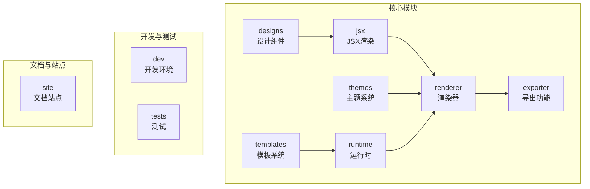
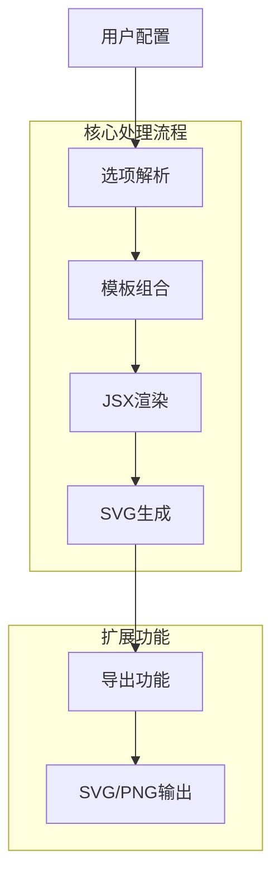
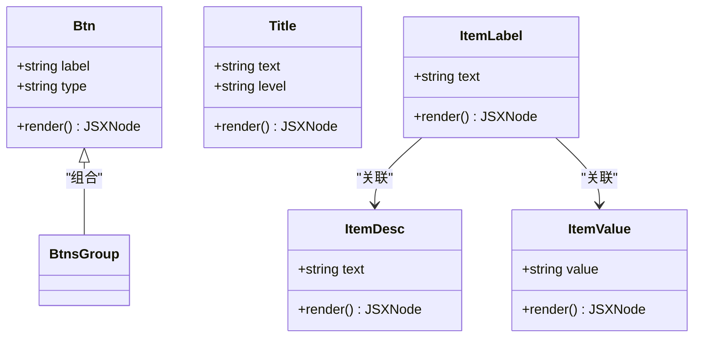
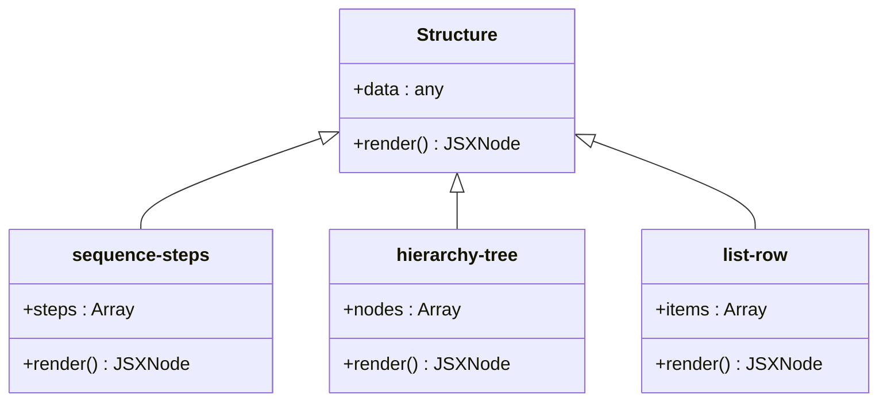
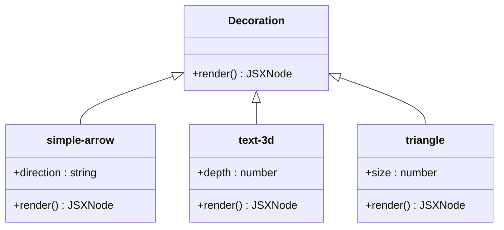
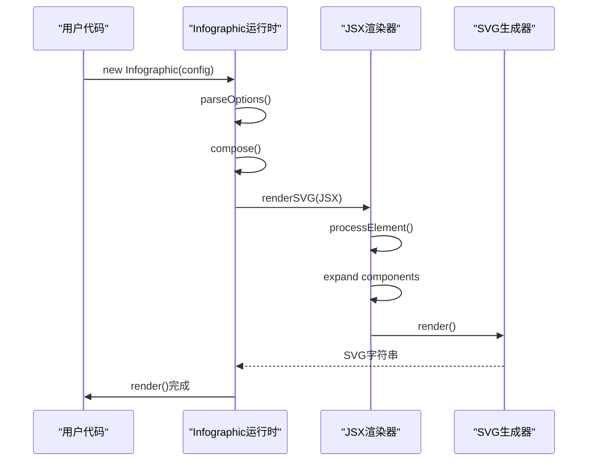
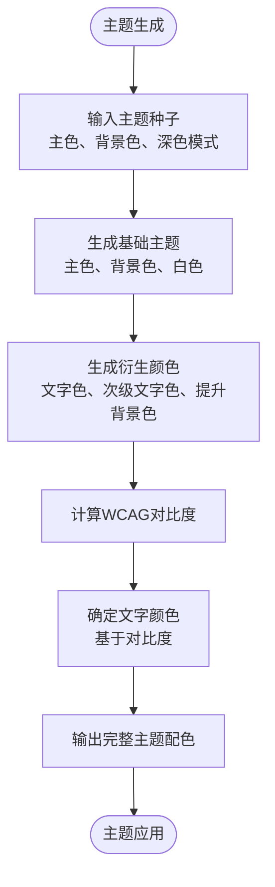
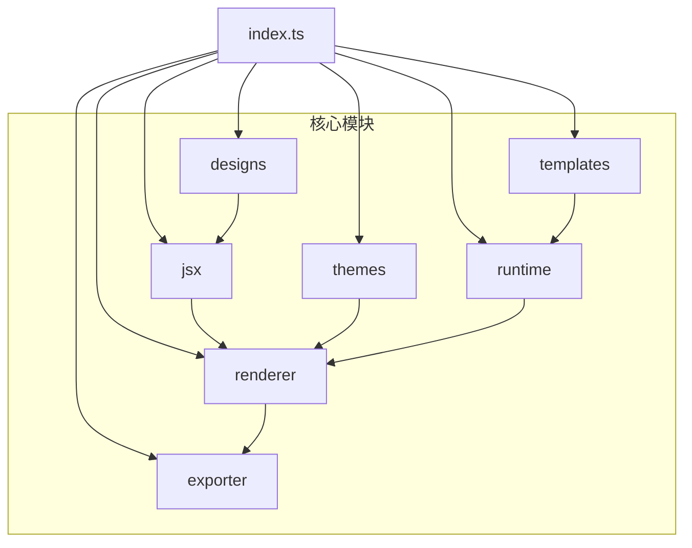

# 可视化引擎

<cite>
**本文档中引用的文件**   
- [README.md](file://antv_infographic/infographic/README.md)
- [index.ts](file://antv_infographic/infographic/src/index.ts)
- [Infographic.tsx](file://antv_infographic/infographic/src/runtime/Infographic.tsx)
- [renderer.ts](file://antv_infographic/infographic/src/jsx/renderer.ts)
- [types.ts](file://antv_infographic/infographic/src/designs/types.ts)
- [generator.ts](file://antv_infographic/infographic/src/themes/generator.ts)
- [svg.ts](file://antv_infographic/infographic/src/exporter/svg.ts)
- [png.ts](file://antv_infographic/infographic/src/exporter/png.ts)
</cite>

## 目录
1. [简介](#简介)
2. [项目结构](#项目结构)
3. [核心组件](#核心组件)
4. [架构概述](#架构概述)
5. [详细组件分析](#详细组件分析)
6. [依赖分析](#依赖分析)
7. [性能考虑](#性能考虑)
8. [故障排除指南](#故障排除指南)
9. [结论](#结论)

## 简介
AntV Infographic 是一个声明式的可视化信息图生成与渲染框架，旨在将结构化数据转化为高质量的信息图表。该引擎采用统一的语法和组件化架构，支持快速组装信息图表，并具备主题化、可组合性和AI友好等特性。通过JSX语法定义信息图结构，开发者可以灵活地创建各种数据可视化内容。

## 项目结构
AntV Infographic 项目采用模块化设计，主要分为以下几个核心目录：

**Diagram sources**
- [src/index.ts](file://antv_infographic/infographic/src/index.ts)

**Section sources**
- [src/index.ts](file://antv_infographic/infographic/src/index.ts)

## 核心组件
AntV Infographic 的核心组件体系基于组件化设计原则，主要包括内置组件、结构组件和装饰元素三大类。这些组件通过JSX语法进行组合，形成完整的信息图。

**Section sources**
- [src/designs/components](file://antv_infographic/infographic/src/designs/components)
- [src/designs/items](file://antv_infographic/infographic/src/designs/items)
- [src/designs/structures](file://antv_infographic/infographic/src/designs/structures)
- [src/designs/decorations](file://antv_infographic/infographic/src/designs/decorations)

## 架构概述
AntV Infographic 的架构采用分层设计，从配置解析到最终渲染形成完整的处理流程。

**Diagram sources**
- [src/runtime/Infographic.tsx](file://antv_infographic/infographic/src/runtime/Infographic.tsx)
- [src/jsx/renderer.ts](file://antv_infographic/infographic/src/jsx/renderer.ts)

## 详细组件分析

### 组件化设计分析
AntV Infographic 的组件系统分为多个类别，每个类别都有特定的用途和功能。

#### 内置组件

**Diagram sources**
- [src/designs/components/Btn.tsx](file://antv_infographic/infographic/src/designs/components/Btn.tsx)
- [src/designs/components/Title.tsx](file://antv_infographic/infographic/src/designs/components/Title.tsx)
- [src/designs/components/ItemLabel.tsx](file://antv_infographic/infographic/src/designs/components/ItemLabel.tsx)

#### 结构组件

**Diagram sources**
- [src/designs/structures/sequence-steps.tsx](file://antv_infographic/infographic/src/designs/structures/sequence-steps.tsx)
- [src/designs/structures/hierarchy-tree.tsx](file://antv_infographic/infographic/src/designs/structures/hierarchy-tree.tsx)
- [src/designs/structures/list-row.tsx](file://antv_infographic/infographic/src/designs/structures/list-row.tsx)

#### 装饰元素

**Diagram sources**
- [src/designs/decorations/simple-arrow.tsx](file://antv_infographic/infographic/src/designs/decorations/simple-arrow.tsx)
- [src/designs/decorations/text-3d.tsx](file://antv_infographic/infographic/src/designs/decorations/text-3d.tsx)
- [src/designs/decorations/triangle.tsx](file://antv_infographic/infographic/src/designs/decorations/triangle.tsx)

### JSX语法应用分析
JSX语法在AntV Infographic中扮演着核心角色，用于定义信息图的结构和内容。

**Diagram sources**
- [src/runtime/Infographic.tsx](file://antv_infographic/infographic/src/runtime/Infographic.tsx)
- [src/jsx/renderer.ts](file://antv_infographic/infographic/src/jsx/renderer.ts)

### 主题与样式定制机制
主题系统通过种子颜色生成完整的调色板，支持深色模式和自定义配色。

**Diagram sources**
- [src/themes/generator.ts](file://antv_infographic/infographic/src/themes/generator.ts)

## 依赖分析
AntV Infographic 的依赖关系清晰，各模块之间耦合度适中。

**Diagram sources**
- [src/index.ts](file://antv_infographic/infographic/src/index.ts)

**Section sources**
- [src/index.ts](file://antv_infographic/infographic/src/index.ts)

## 性能考虑
AntV Infographic 在性能方面进行了多项优化，包括：

1. **组件预处理**：在渲染前对组件树进行预处理，展开所有函数组件和布局组件
2. **虚拟DOM**：使用轻量级的JSX元素表示，减少内存占用
3. **按需渲染**：只渲染可见部分的组件，提高渲染效率
4. **缓存机制**：对常用的样式和配置进行缓存，避免重复计算

## 故障排除指南
常见问题及解决方案：

**Section sources**
- [src/runtime/Infographic.tsx](file://antv_infographic/infographic/src/runtime/Infographic.tsx)
- [src/jsx/renderer.ts](file://antv_infographic/infographic/src/jsx/renderer.ts)

### 渲染问题
- **问题**：信息图未正确渲染
- **解决方案**：确保在调用 `toDataURL` 前已调用 `render` 方法

### 导出问题
- **问题**：PNG导出失败
- **解决方案**：检查浏览器环境是否支持Canvas API

### 主题应用问题
- **问题**：自定义主题未生效
- **解决方案**：确认已正确调用 `registerTheme` 方法注册主题

## 结论
AntV Infographic 提供了一个强大而灵活的信息图可视化解决方案。通过组件化设计、JSX语法支持和完善的主题系统，开发者可以轻松创建高质量的信息图表。其模块化架构和清晰的依赖关系使得系统易于扩展和维护。导出功能支持多种格式，满足不同场景的需求。整体设计充分考虑了性能和用户体验，是一个优秀的可视化引擎选择。