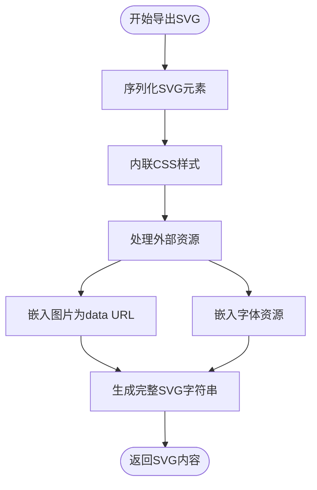
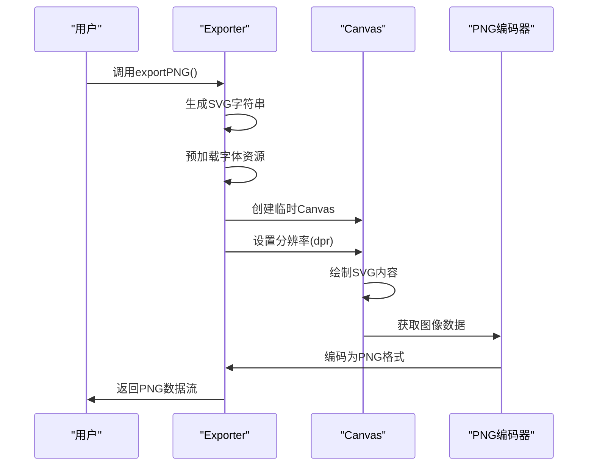
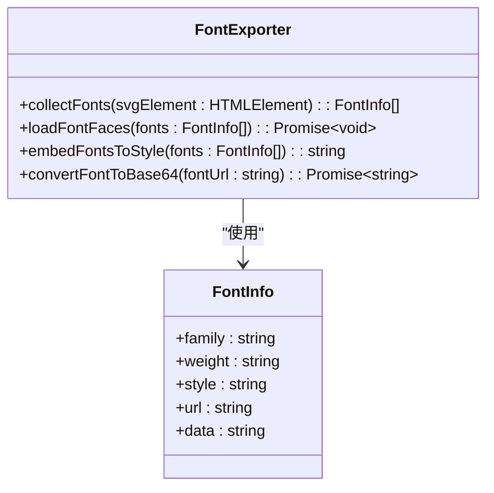

# 导出功能

<cite>
**本文档中引用的文件**  
- [svg.ts](file://src/exporter/svg.ts)
- [png.ts](file://src/exporter/png.ts)
- [font.ts](file://src/exporter/font.ts)
- [index.ts](file://src/exporter/index.ts)
- [types.ts](file://src/exporter/types.ts)
</cite>

## 目录
1. [简介](#简介)
2. [SVG导出机制](#svg导出机制)
3. [PNG导出流程](#png导出流程)
4. [字体处理模块](#字体处理模块)
5. [导出API使用示例](#导出api使用示例)
6. [常见问题诊断与解决方案](#常见问题诊断与解决方案)
7. [性能优化建议](#性能优化建议)

## 简介
AntV Infographic 提供了强大的信息图导出功能，支持将可视化内容导出为多种格式，包括 SVG 和 PNG。本文档详尽阐述了导出功能的实现原理，涵盖 SVG 序列化、样式内联、资源嵌入、Canvas 渲染、字体加载和图像编码等核心技术。同时提供 API 使用示例、常见问题解决方案以及大尺寸信息图的性能优化策略。

## SVG导出机制

SVG 导出器负责将信息图的虚拟 DOM 结构序列化为标准的 SVG 字符串，并确保样式和外部资源正确嵌入。其核心工作流程包括 DOM 遍历、样式内联和资源转换。

**Diagram sources**  
- [svg.ts](file://src/exporter/svg.ts#L1-L100)

**Section sources**  
- [svg.ts](file://src/exporter/svg.ts#L1-L150)

## PNG导出流程

PNG 导出通过将 SVG 内容渲染到 Canvas 上，再进行图像编码来实现。该过程涉及 SVG 到 Canvas 的转换、字体预加载、高分辨率渲染和图像数据编码。

**Diagram sources**  
- [png.ts](file://src/exporter/png.ts#L1-L80)

**Section sources**  
- [png.ts](file://src/exporter/png.ts#L1-L120)

## 字体处理模块

字体处理模块确保导出的图像中所有文本都能正确显示，避免出现字体缺失或显示异常的问题。该模块通过收集文档中使用的所有字体，将其转换为 base64 编码并内联到 SVG 样式中。

**Diagram sources**  
- [font.ts](file://src/exporter/font.ts#L1-L60)

**Section sources**  
- [font.ts](file://src/exporter/font.ts#L1-L100)

## 导出API使用示例

导出 API 提供了统一的接口用于导出不同格式的文件，支持配置分辨率、质量等参数。

**Section sources**  
- [index.ts](file://src/exporter/index.ts#L1-L50)
- [types.ts](file://src/exporter/types.ts#L1-L30)

## 常见问题诊断与解决方案

### 图片模糊
**原因**：默认导出分辨率较低或设备像素比(DPR)设置不当。  
**解决方案**：在导出 PNG 时设置较高的 `dpr` 参数（如 2 或 3）。

### 字体缺失
**原因**：自定义字体未正确加载或未内联到 SVG 中。  
**解决方案**：确保字体文件可访问，并在导出前调用字体预加载功能。

### 透明度异常
**原因**：某些 PNG 编码器不正确处理 alpha 通道。  
**解决方案**：检查 Canvas 的 `alpha` 配置并确保编码器支持透明通道。

**Section sources**  
- [png.ts](file://src/exporter/png.ts#L50-L100)
- [svg.ts](file://src/exporter/svg.ts#L80-L120)

## 性能优化建议

对于大尺寸信息图的导出，建议采取以下优化措施：
1. **分块渲染**：对于超大图像，考虑分区域渲染后拼接
2. **限制DPR**：根据实际需求设置合理的设备像素比，避免过度渲染
3. **资源预加载**：提前加载所有字体和图片资源，减少导出时的等待时间
4. **内存管理**：及时释放临时创建的 Canvas 和 DOM 元素

**Section sources**  
- [png.ts](file://src/exporter/png.ts#L100-L120)
- [svg.ts](file://src/exporter/svg.ts#L120-L150)