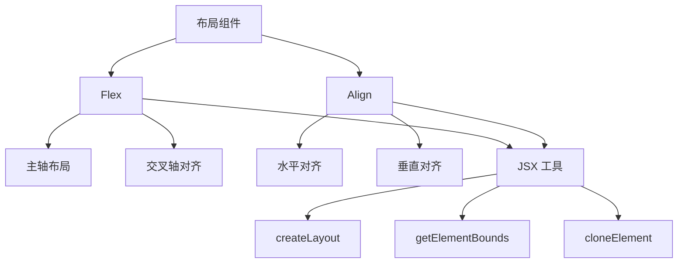
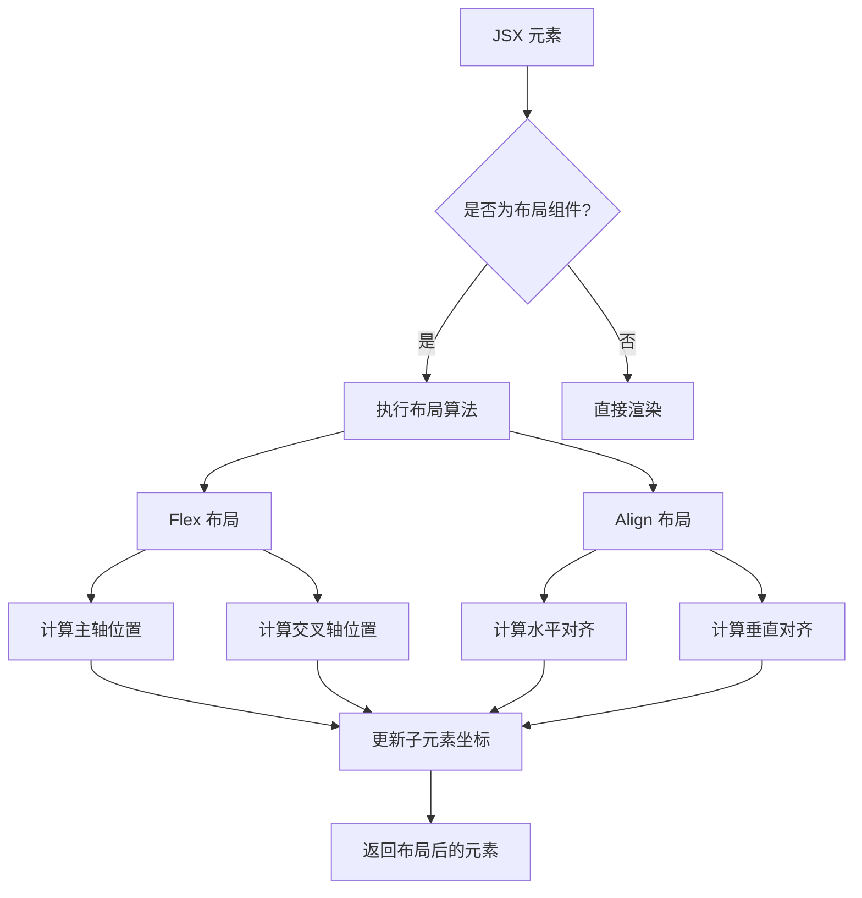
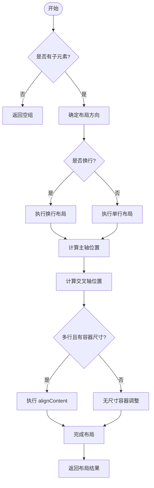
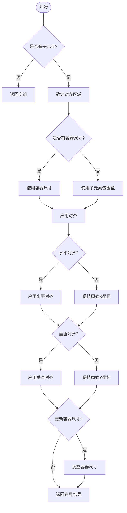
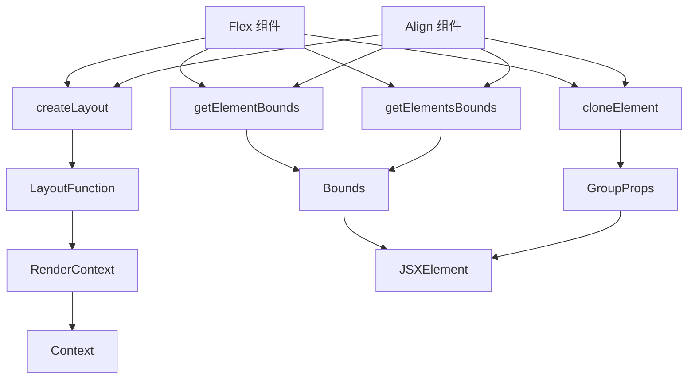

# 布局组件

<cite>
**本文档中引用的文件**  
- [Flex.tsx](file://antv_infographic/infographic/src/designs/layouts/Flex.tsx)
- [Align.tsx](file://antv_infographic/infographic/src/designs/layouts/Align.tsx)
- [layout.ts](file://antv_infographic/infographic/src/jsx/layout.ts)
- [index.ts](file://antv_infographic/infographic/src/jsx/index.ts)
</cite>

## 目录
1. [简介](#简介)
2. [项目结构](#项目结构)
3. [核心组件](#核心组件)
4. [架构概述](#架构概述)
5. [详细组件分析](#详细组件分析)
6. [依赖分析](#依赖分析)
7. [性能考虑](#性能考虑)
8. [故障排除指南](#故障排除指南)
9. [结论](#结论)

## 简介
本文档深入解析 AntV Infographic 中的布局组件 Flex 和 Align。详细说明 Flex 容器的主轴与交叉轴布局算法、对齐方式（justifyContent、alignItems）及响应式行为。解释 Align 组件的定位机制与对齐策略。结合实际代码示例展示嵌套布局的构建方式，分析布局属性如何影响子元素的尺寸与位置计算。提供常见布局问题（如溢出、错位）的调试方法与修复方案，并说明如何通过自定义样式扩展布局能力。

## 项目结构
AntV Infographic 的布局组件主要位于 `src/designs/layouts/` 目录下，包含 Flex 和 Align 两个核心布局组件。这些组件基于 JSX 布局系统构建，通过 `createLayout` 函数创建布局组件，并利用 `jsx` 模块中的工具函数进行元素边界计算和克隆。

**Diagram sources**
- [Flex.tsx](file://antv_infographic/infographic/src/designs/layouts/Flex.tsx)
- [Align.tsx](file://antv_infographic/infographic/src/designs/layouts/Align.tsx)
- [layout.ts](file://antv_infographic/infographic/src/jsx/layout.ts)

**Section sources**
- [Flex.tsx](file://antv_infographic/infographic/src/designs/layouts/Flex.tsx)
- [Align.tsx](file://antv_infographic/infographic/src/designs/layouts/Align.tsx)

## 核心组件
Flex 和 Align 是 AntV Infographic 中两个核心的布局组件，分别实现了弹性布局和对齐布局功能。Flex 组件支持行/列方向的弹性布局，包含主轴对齐（justifyContent）和交叉轴对齐（alignItems）功能，同时支持多行布局（flexWrap）和行间对齐（alignContent）。Align 组件则专注于子元素的精确定位，提供水平和垂直方向的对齐控制。

**Section sources**
- [Flex.tsx](file://antv_infographic/infographic/src/designs/layouts/Flex.tsx)
- [Align.tsx](file://antv_infographic/infographic/src/designs/layouts/Align.tsx)

## 架构概述
AntV Infographic 的布局系统基于 JSX 扩展实现，通过 `createLayout` 函数创建布局组件。布局组件本质上是带有特殊符号类型（Symbol）的 JSX 元素，渲染器通过 `isLayoutComponent` 检测布局组件，并调用 `performLayout` 执行布局算法。

**Diagram sources**
- [layout.ts](file://antv_infographic/infographic/src/jsx/layout.ts)
- [Flex.tsx](file://antv_infographic/infographic/src/designs/layouts/Flex.tsx)
- [Align.tsx](file://antv_infographic/infographic/src/designs/layouts/Align.tsx)

## 详细组件分析
### Flex 组件分析
Flex 组件实现了完整的弹性布局算法，支持多种布局模式和对齐方式。其核心算法包括主轴布局计算、交叉轴对齐和多行布局处理。

#### Flex 布局算法流程

**Diagram sources**
- [Flex.tsx](file://antv_infographic/infographic/src/designs/layouts/Flex.tsx#L21-L274)

#### Flex 组件属性说明
| 属性 | 类型 | 默认值 | 说明 |
|------|------|--------|------|
| flexDirection | 'row' \| 'column' \| 'row-reverse' \| 'column-reverse' | 'row' | 主轴方向 |
| justifyContent | 'flex-start' \| 'flex-end' \| 'center' \| 'space-between' | 'flex-start' | 主轴对齐方式 |
| alignItems | 'flex-start' \| 'flex-end' \| 'center' | 'flex-start' | 交叉轴对齐方式 |
| alignContent | 'flex-start' \| 'flex-end' \| 'center' \| 'space-between' | 'flex-start' | 多行交叉轴对齐方式 |
| flexWrap | 'wrap' \| 'nowrap' | 'nowrap' | 是否换行 |
| gap | number | 0 | 子元素间距 |

**Section sources**
- [Flex.tsx](file://antv_infographic/infographic/src/designs/layouts/Flex.tsx#L12-L19)

### Align 组件分析
Align 组件提供了精确的对齐控制，支持水平和垂直方向的对齐定位。

#### Align 组件对齐逻辑

**Diagram sources**
- [Align.tsx](file://antv_infographic/infographic/src/designs/layouts/Align.tsx#L17-L104)

#### Align 组件属性说明
| 属性 | 类型 | 说明 |
|------|------|------|
| horizontal | 'left' \| 'center' \| 'right' | 水平对齐方式 |
| vertical | 'top' \| 'middle' \| 'bottom' | 垂直对齐方式 |

**Section sources**
- [Align.tsx](file://antv_infographic/infographic/src/designs/layouts/Align.tsx#L10-L15)

## 依赖分析
Flex 和 Align 组件依赖于 JSX 布局系统的核心功能，包括布局创建、元素边界计算和元素克隆。

**Diagram sources**
- [Flex.tsx](file://antv_infographic/infographic/src/designs/layouts/Flex.tsx)
- [Align.tsx](file://antv_infographic/infographic/src/designs/layouts/Align.tsx)
- [layout.ts](file://antv_infographic/infographic/src/jsx/layout.ts)
- [index.ts](file://antv_infographic/infographic/src/jsx/index.ts)

**Section sources**
- [Flex.tsx](file://antv_infographic/infographic/src/designs/layouts/Flex.tsx)
- [Align.tsx](file://antv_infographic/infographic/src/designs/layouts/Align.tsx)
- [layout.ts](file://antv_infographic/infographic/src/jsx/layout.ts)

## 性能考虑
Flex 和 Align 组件在布局计算时需要遍历所有子元素并计算其边界，因此在处理大量子元素时可能影响性能。建议在以下情况下优化性能：

1. 避免在 Flex 容器中嵌套过多层级的布局组件
2. 为容器设置明确的宽高，避免动态计算容器尺寸
3. 减少频繁的布局更新，尽量批量处理布局变化
4. 对于静态布局，考虑使用预计算的坐标值

## 故障排除指南
### 常见布局问题及解决方案
1. **子元素溢出容器**
   - 检查容器是否设置了明确的宽高
   - 确认 `flexWrap` 属性设置是否正确
   - 调整 `gap` 间距值

2. **元素错位**
   - 检查子元素是否已有固定的 x/y 坐标
   - 确认 `alignItems` 和 `alignContent` 设置是否符合预期
   - 验证 `flexDirection` 方向是否正确

3. **对齐失效**
   - 确保容器有足够的空间进行对齐
   - 检查 `justifyContent` 和 `alignItems` 属性值
   - 确认子元素的尺寸是否影响对齐效果

4. **响应式布局异常**
   - 检查 `flexWrap` 设置
   - 验证多行布局时的 `alignContent` 行为
   - 确认 `gap` 间距在不同屏幕尺寸下的表现

**Section sources**
- [Flex.tsx](file://antv_infographic/infographic/src/designs/layouts/Flex.tsx)
- [Align.tsx](file://antv_infographic/infographic/src/designs/layouts/Align.tsx)

## 结论
Flex 和 Align 组件为 AntV Infographic 提供了强大的布局能力。Flex 组件实现了完整的弹性布局系统，支持复杂的多行、多列布局需求，而 Align 组件则提供了精确的对齐控制。两者结合使用可以构建出各种复杂的图表布局结构。通过理解其内部算法和属性含义，开发者可以更有效地利用这些组件创建高质量的数据可视化作品。