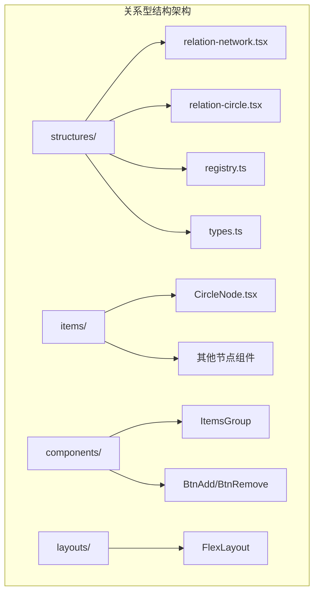
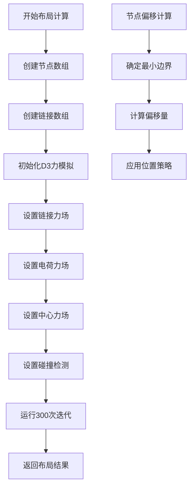
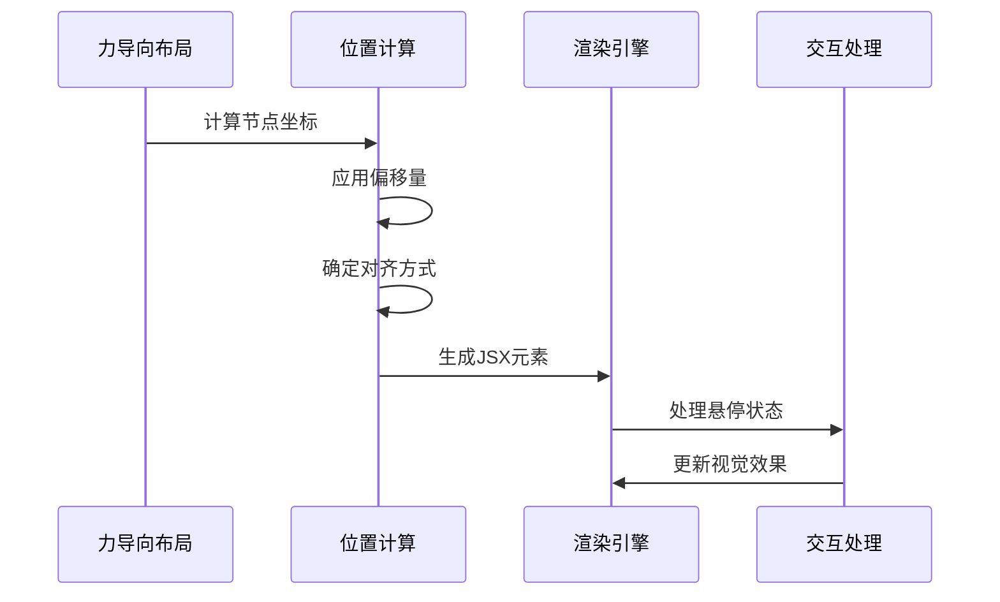
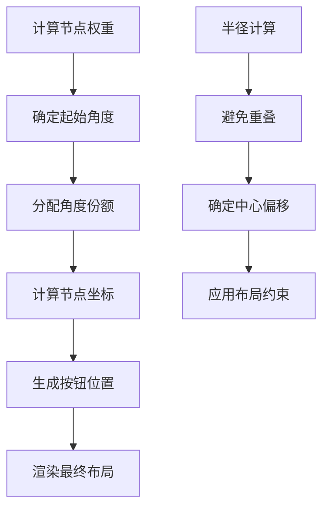
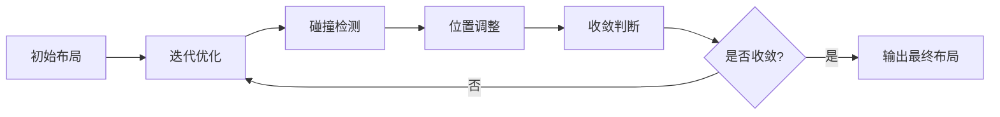
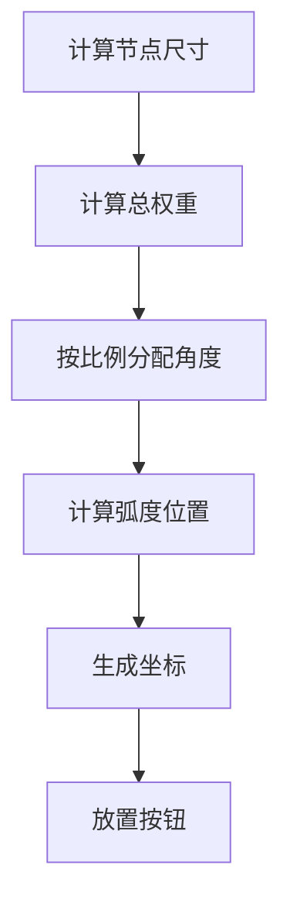
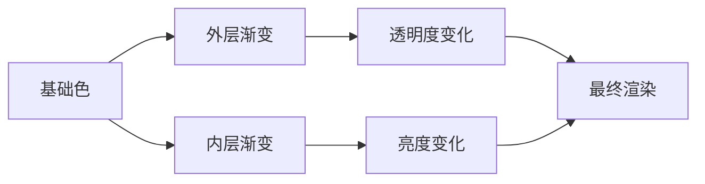
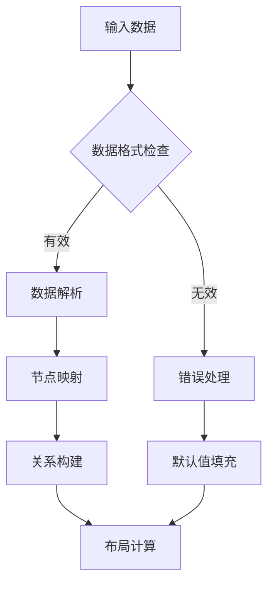
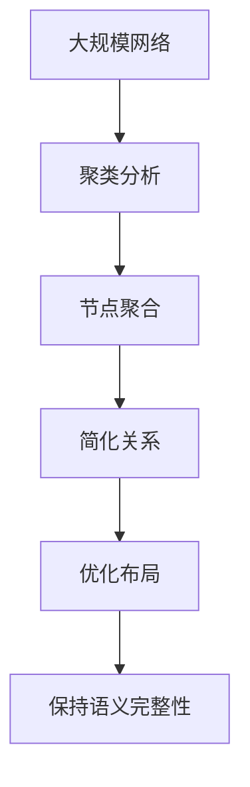
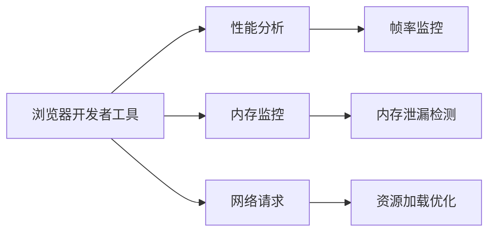

# 关系型结构

<cite>
**本文档中引用的文件**
- [relation-network.tsx](file://antv_infographic/infographic/src/designs/structures/relation-network.tsx)
- [relation-circle.tsx](file://antv_infographic/infographic/src/designs/structures/relation-circle.tsx)
- [registry.ts](file://antv_infographic/infographic/src/designs/structures/registry.ts)
- [types.ts](file://antv_infographic/infographic/src/designs/structures/types.ts)
- [CircleNode.tsx](file://antv_infographic/infographic/src/designs/items/CircleNode.tsx)
- [hierarchy-tree.tsx](file://antv_infographic/infographic/src/designs/structures/hierarchy-tree.tsx)
- [sequence-cylinders-3d.tsx](file://antv_infographic/infographic/src/designs/structures/sequence-cylinders-3d.tsx)
- [data.test.ts](file://antv_infographic/infographic/__tests__/unit/utils/data.test.ts)
</cite>

## 目录
1. [简介](#简介)
2. [项目结构](#项目结构)
3. [核心组件](#核心组件)
4. [架构概览](#架构概览)
5. [详细组件分析](#详细组件分析)
6. [数据模型定义](#数据模型定义)
7. [布局算法实现](#布局算法实现)
8. [样式配置与交互](#样式配置与交互)
9. [数据转换与优化](#数据转换与优化)
10. [性能优化建议](#性能优化建议)
11. [故障排除指南](#故障排除指南)
12. [结论](#结论)

## 简介

关系型结构是AntV Infographic框架中的重要组成部分，专门用于展示实体间的关联、依赖或互动网络。该系统提供了两种主要的关系图类型：**网络关系图（relation-network）**和**环形关系图（relation-circle）**，每种都针对不同的应用场景进行了优化设计。

网络关系图采用力导向布局（Force-Directed Layout），通过物理模拟算法自动计算节点位置，适用于展示复杂的关系网络和依赖结构。环形关系图则采用环形布局（Circular Layout），将节点均匀分布在圆形路径上，适合展示层次结构或循环关系。

## 项目结构

关系型结构的代码组织遵循模块化设计原则，主要分为以下几个层次：



**图表来源**
- [relation-network.tsx](file://antv_infographic/infographic/src/designs/structures/relation-network.tsx#L1-L191)
- [relation-circle.tsx](file://antv_infographic/infographic/src/designs/structures/relation-circle.tsx#L1-L150)

**章节来源**
- [registry.ts](file://antv_infographic/infographic/src/designs/structures/registry.ts#L1-L16)
- [types.ts](file://antv_infographic/infographic/src/designs/structures/types#L1-L26)

## 核心组件

关系型结构系统包含以下核心组件：

### 网络关系图（RelationNetwork）
- **功能**：基于D3.js力导向布局的关系图
- **特点**：自动计算节点位置，避免重叠
- **适用场景**：复杂关系网络、依赖图、社交网络

### 环形关系图（RelationCircle）
- **功能**：环形分布的节点排列
- **特点**：均匀分布，支持动态添加删除
- **适用场景**：层次结构、循环关系、生态系统

### 数据模型接口
- **NetworkNode**：网络节点数据结构
- **NetworkLink**：网络边数据结构
- **RelationNetworkProps**：网络关系图属性接口

**章节来源**
- [relation-network.tsx](file://antv_infographic/infographic/src/designs/structures/relation-network.tsx#L10-L25)
- [relation-circle.tsx](file://antv_infographic/infographic/src/designs/structures/relation-circle.tsx#L8-L11)

## 架构概览

关系型结构采用分层架构设计，确保了良好的可扩展性和维护性：

```mermaid
classDiagram
class BaseStructureProps {
+Title : ComponentType
+Item : ComponentType
+Items : ComponentType[]
+data : Data
+options : ParsedInfographicOptions
}
class RelationNetwork {
+spacing : number
+showConnections : boolean
+runForceLayout() : {nodes, links}
+render() : JSXElement
}
class RelationCircle {
+radius : number
+startMode : 'top' | 'equal'
+calculatePositions() : void
+render() : JSXElement
}
class NetworkNode {
+id : number
+data : any
+isCenter : boolean
+_originalIndex : number[]
+x : number
+y : number
}
class NetworkLink {
+source : number | NetworkNode
+target : number | NetworkNode
}
BaseStructureProps <|-- RelationNetwork
BaseStructureProps <|-- RelationCircle
RelationNetwork --> NetworkNode
RelationNetwork --> NetworkLink
```

**图表来源**
- [types.ts](file://antv_infographic/infographic/src/designs/structures/types.ts#L7-L25)
- [relation-network.tsx](file://antv_infographic/infographic/src/designs/structures/relation-network.tsx#L10-L25)

## 详细组件分析

### 网络关系图组件分析

网络关系图是关系型结构的核心组件，实现了基于D3.js的力导向布局算法：

#### 力导向布局实现



**图表来源**
- [relation-network.tsx](file://antv_infographic/infographic/src/designs/structures/relation-network.tsx#L61-L95)

#### 节点渲染逻辑

网络关系图的节点渲染过程包括位置计算、偏移处理和交互定位：



**图表来源**
- [relation-network.tsx](file://antv_infographic/infographic/src/designs/structures/relation-network.tsx#L111-L131)

**章节来源**
- [relation-network.tsx](file://antv_infographic/infographic/src/designs/structures/relation-network.tsx#L27-L190)

### 环形关系图组件分析

环形关系图采用数学算法计算节点在圆形路径上的位置：

#### 圆形布局算法



**图表来源**
- [relation-circle.tsx](file://antv_infographic/infographic/src/designs/structures/relation-circle.tsx#L51-L127)

#### 角度分配策略

环形关系图支持两种起始模式：
- **top模式**：第一个节点位于顶部
- **equal模式**：节点均匀分布

**章节来源**
- [relation-circle.tsx](file://antv_infographic/infographic/src/designs/structures/relation-circle.tsx#L13-L149)

## 数据模型定义

关系型结构使用明确的数据模型来描述网络关系：

### 网络节点数据结构

| 属性名 | 类型 | 描述 | 必需 |
|--------|------|------|------|
| id | number | 节点唯一标识符 | 是 |
| data | any | 节点承载的原始数据 | 是 |
| isCenter | boolean | 是否为中心节点 | 是 |
| _originalIndex | number[] | 原始索引数组 | 是 |
| x | number | X坐标（力模拟后） | 否 |
| y | number | Y坐标（力模拟后） | 否 |

### 网络边数据结构

| 属性名 | 类型 | 描述 | 必需 |
|--------|------|------|------|
| source | number \| NetworkNode | 边的起始节点 | 是 |
| target | number \| NetworkNode | 边的目标节点 | 是 |

### 数据转换示例

关系型结构支持多种数据格式的输入：

```typescript
// 基础节点数据
interface NodeData {
  label: string;
  desc?: string;
  icon?: string;
}

// 关系图数据结构
interface RelationGraphData {
  title?: string;
  desc?: string;
  items: NodeData[];
}
```

**章节来源**
- [relation-network.tsx](file://antv_infographic/infographic/src/designs/structures/relation-network.tsx#L10-L20)
- [data.test.ts](file://antv_infographic/infographic/__tests__/unit/utils/data.test.ts#L88-L211)

## 布局算法实现

### 力导向布局算法

网络关系图使用D3.js的力导向布局算法，通过物理模拟实现最优的节点分布：

#### 力场配置

| 力场类型 | 参数 | 作用 | 默认值 |
|----------|------|------|--------|
| link | distance | 连接长度 | spacing参数 |
| charge | strength | 排斥强度 | -50 |
| center | - | 中心约束 | (0, 0) |
| collision | radius | 碰撞半径 | 节点半径+10 |

#### 布局优化流程



**图表来源**
- [relation-network.tsx](file://antv_infographic/infographic/src/designs/structures/relation-network.tsx#L74-L92)

### 环形布局算法

环形关系图使用几何算法计算节点位置：

#### 权重分配算法



**图表来源**
- [relation-circle.tsx](file://antv_infographic/infographic/src/designs/structures/relation-circle.tsx#L57-L127)

**章节来源**
- [relation-network.tsx](file://antv_infographic/infographic/src/designs/structures/relation-network.tsx#L61-L95)
- [relation-circle.tsx](file://antv_infographic/infographic/src/designs/structures/relation-circle.tsx#L51-L127)

## 样式配置与交互

### 节点样式配置

关系型结构支持丰富的节点样式配置：

#### CircleNode组件特性

| 配置项 | 类型 | 默认值 | 描述 |
|--------|------|--------|------|
| width | number | 240 | 节点宽度 |
| height | number | 240 | 节点高度 |
| positionH | string | 'normal' | 水平对齐方式 |
| themeColors | object | - | 主题色彩配置 |

#### 渐变效果实现



**图表来源**
- [CircleNode.tsx](file://antv_infographic/infographic/src/designs/items/CircleNode.tsx#L33-L46)

### 连线样式配置

#### 网络关系图连线

| 属性 | 值 | 描述 |
|------|----|----- |
| stroke | getColorPrimary(options) | 连线颜色 |
| strokeWidth | 2 | 连线宽度 |
| strokeOpacity | 0.6 | 连线透明度 |
| strokeDasharray | '' | 虚线模式 |

#### 交互行为支持

- **悬停效果**：节点高亮显示
- **点击事件**：支持节点选择和操作
- **拖拽功能**：动态调整节点位置（网络关系图）

**章节来源**
- [CircleNode.tsx](file://antv_infographic/infographic/src/designs/items/CircleNode.tsx#L14-L113)
- [relation-network.tsx](file://antv_infographic/infographic/src/designs/structures/relation-network.tsx#L158-L166)

## 数据转换与优化

### 数据预处理

关系型结构支持多种数据格式的输入和转换：

#### 数据验证机制



**图表来源**
- [data.test.ts](file://antv_infographic/infographic/__tests__/unit/utils/data.test.ts#L88-L211)

### 性能优化策略

#### 大规模数据处理

对于包含大量节点的关系图，系统采用以下优化策略：

| 优化技术 | 实现方式 | 效果 |
|----------|----------|------|
| 虚拟化渲染 | 只渲染可见区域节点 | 减少DOM操作 |
| 延迟加载 | 按需加载节点数据 | 提升初始渲染速度 |
| 缓存机制 | 缓存布局计算结果 | 避免重复计算 |
| 批量更新 | 合并多个状态更新 | 减少重绘次数 |

#### 内存管理


**章节来源**
- [data.test.ts](file://antv_infographic/infographic/__tests__/unit/utils/data.test.ts#L88-L211)

## 性能优化建议

### 物理参数调优

#### 力导向布局参数优化

| 参数 | 推荐值 | 调优建议 |
|------|--------|----------|
| 迭代次数 | 300 | 根据节点数量调整 |
| 排斥强度 | -50 | 负值越大排斥越强 |
| 连接距离 | spacing | 根据节点大小设置 |
| 碰撞半径 | 节点半径+10 | 避免节点重叠 |

#### 环形布局优化

| 优化项 | 建议 | 注意事项 |
|--------|------|----------|
| 半径设置 | 最小半径=max(radius, 节点尺寸) | 避免节点重叠 |
| 起始角度 | top模式适合层次结构 | equal模式适合循环关系 |
| 节点间距 | 保持适当间距 | 防止文字重叠 |

### 聚类与降维

#### 大规模网络处理



#### 分层渲染策略

- **优先级渲染**：先渲染核心节点，再渲染边缘节点
- **LOD技术**：根据缩放级别调整细节程度
- **异步加载**：后台预计算布局，前台流畅渲染

### 渲染性能优化

#### 图形优化技巧

| 技术 | 应用场景 | 性能提升 |
|------|----------|----------|
| SVG优化 | 复杂图形路径 | 减少渲染时间 |
| Canvas替代 | 大量简单图形 | 提升绘制效率 |
| WebGL加速 | 超大规模网络 | 显著提升性能 |
| Web Workers | 后台计算 | 避免阻塞主线程 |

## 故障排除指南

### 常见问题诊断

#### 节点重叠问题

**症状**：节点之间发生重叠，影响可读性

**解决方案**：
1. 调整碰撞检测半径
2. 增加排斥力强度
3. 优化初始布局
4. 调整节点大小

#### 布局发散问题

**症状**：节点位置异常，布局无法收敛

**解决方案**：
1. 检查数据完整性
2. 调整力场参数
3. 增加迭代次数
4. 设置合理的边界约束

#### 性能问题

**症状**：大数据量时渲染缓慢

**解决方案**：
1. 启用虚拟化渲染
2. 减少不必要的重绘
3. 使用Web Workers
4. 优化数据结构

### 调试工具与技巧

#### 开发者工具使用



#### 日志记录策略

- **布局计算日志**：记录关键参数和中间结果
- **性能指标收集**：测量渲染时间和内存使用
- **错误追踪**：捕获和报告异常情况

**章节来源**
- [relation-network.tsx](file://antv_infographic/infographic/src/designs/structures/relation-network.tsx#L61-L95)
- [relation-circle.tsx](file://antv_infographic/infographic/src/designs/structures/relation-circle.tsx#L51-L127)

## 结论

关系型结构为AntV Infographic框架提供了强大的关系图可视化能力。通过网络关系图和环形关系图两种核心组件，系统能够满足从简单层次结构到复杂网络关系的各种展示需求。

### 主要优势

1. **算法先进**：基于D3.js的力导向布局算法，提供自然美观的节点分布
2. **灵活配置**：支持丰富的样式配置和交互行为
3. **性能优化**：内置多种性能优化策略，适应不同规模的数据
4. **易于扩展**：模块化架构便于功能扩展和定制

### 应用前景

关系型结构在以下领域具有广阔的应用前景：
- **企业架构图**：展示组织结构和业务流程
- **社交网络分析**：分析用户关系和影响力传播
- **知识图谱**：构建和展示概念间的关系网络
- **生态系统建模**：分析生物链和经济系统

通过持续的优化和功能增强，关系型结构将继续为用户提供更加优秀的关系图可视化体验。