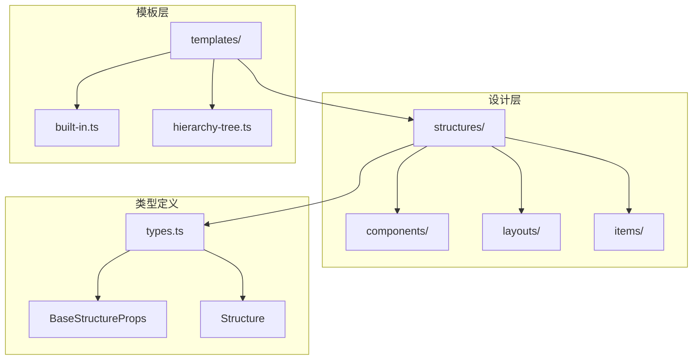
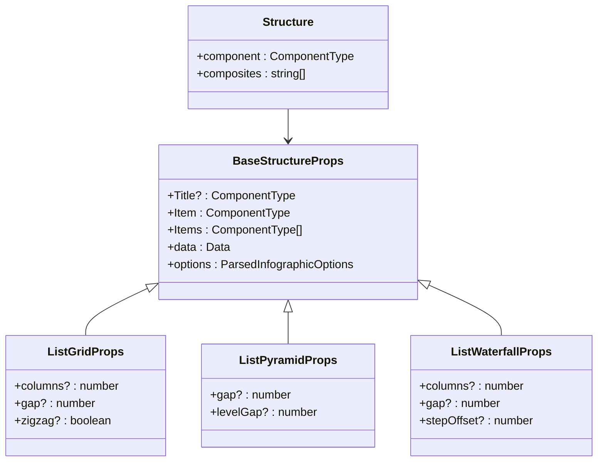
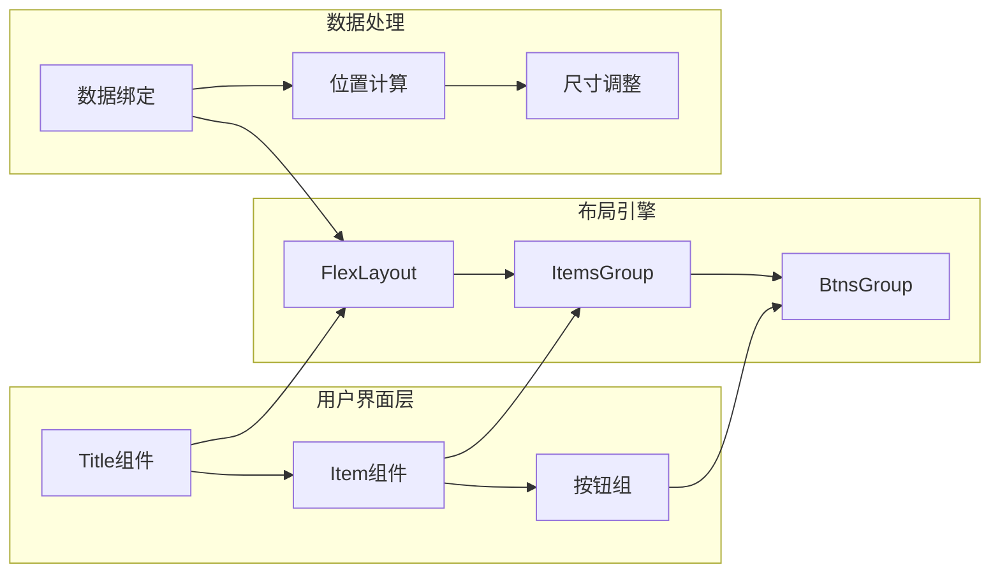
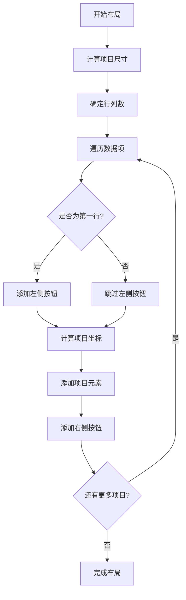
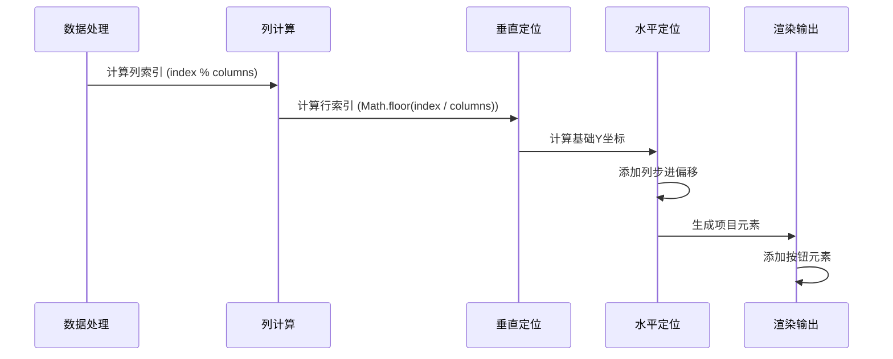
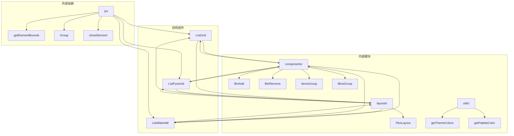
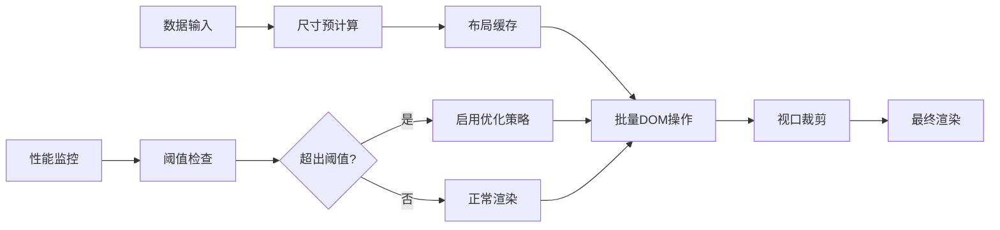

# 列表型结构

<cite>
**本文档引用的文件**
- [list-grid.tsx](file://antv_infographic/infographic/src/designs/structures/list-grid.tsx)
- [list-pyramid.tsx](file://antv_infographic/infographic/src/designs/structures/list-pyramid.tsx)
- [list-waterfall.tsx](file://antv_infographic/infographic/src/designs/structures/list-waterfall.tsx)
- [list-column.tsx](file://antv_infographic/infographic/src/designs/structures/list-column.tsx)
- [list-row.tsx](file://antv_infographic/infographic/src/designs/structures/list-row.tsx)
- [types.ts](file://antv_infographic/infographic/src/designs/structures/types.ts)
- [built-in.ts](file://antv_infographic/infographic/src/templates/built-in.ts)
- [Flex.tsx](file://antv_infographic/infographic/src/designs/layouts/Flex.tsx)
- [ItemsGroup.tsx](file://antv_infographic/infographic/src/designs/components/ItemsGroup.tsx)
</cite>

## 目录
1. [概述](#概述)
2. [项目结构](#项目结构)
3. [核心组件](#核心组件)
4. [架构概览](#架构概览)
5. [详细组件分析](#详细组件分析)
6. [依赖关系分析](#依赖关系分析)
7. [性能考虑](#性能考虑)
8. [故障排除指南](#故障排除指南)
9. [结论](#结论)

## 概述

列表型信息结构是AntV图表库中用于展示并列项、优先级排序和分类汇总的核心布局系统。该系统提供了多种布局模式，包括网格布局（list-grid）、金字塔布局（list-pyramid）、瀑布流布局（list-waterfall）等，每种布局都针对不同的数据展示需求进行了优化。

这些布局组件支持动态数据绑定、响应式调整和丰富的视觉样式控制，能够有效处理大量数据的渲染问题，同时提供直观的用户交互体验。

## 项目结构

列表型结构的实现分布在多个模块中，形成了清晰的分层架构：



**图表来源**
- [types.ts](file://antv_infographic/infographic/src/designs/structures/types.ts#L1-L26)
- [built-in.ts](file://antv_infographic/infographic/src/templates/built-in.ts#L1-L50)

**章节来源**
- [types.ts](file://antv_infographic/infographic/src/designs/structures/types.ts#L1-L26)
- [built-in.ts](file://antv_infographic/infographic/src/templates/built-in.ts#L1-L700)

## 核心组件

### 基础结构接口

所有列表型结构都遵循统一的基础接口规范，确保了组件间的一致性和可扩展性：



**图表来源**
- [types.ts](file://antv_infographic/infographic/src/designs/structures/types.ts#L7-L25)
- [list-grid.tsx](file://antv_infographic/infographic/src/designs/structures/list-grid.tsx#L8-L12)
- [list-pyramid.tsx](file://antv_infographic/infographic/src/designs/structures/list-pyramid.tsx#L8-L11)
- [list-waterfall.tsx](file://antv_infographic/infographic/src/designs/structures/list-waterfall.tsx#L8-L12)

### 布局组件类型

系统提供了六种主要的列表布局组件：

| 布局类型 | 文件名 | 主要特点 | 适用场景 |
|---------|--------|----------|----------|
| 网格布局 | list-grid.tsx | 固定列数，支持交错排列 | 数据表格、产品展示 |
| 金字塔布局 | list-pyramid.tsx | 层级递减，视觉焦点集中 | 优先级排序、层次结构 |
| 瀑布流布局 | list-waterfall.tsx | 多列错位排列，动态高度 | 时间线、进度跟踪 |
| 列布局 | list-column.tsx | 垂直排列，固定宽度 | 文本列表、步骤说明 |
| 行布局 | list-row.tsx | 水平排列，自适应宽度 | 横向流程、对比分析 |
| 序列布局 | sequence-*.tsx | 特殊序列化排列 | 时间序列、渐进展示 |

**章节来源**
- [list-grid.tsx](file://antv_infographic/infographic/src/designs/structures/list-grid.tsx#L1-L118)
- [list-pyramid.tsx](file://antv_infographic/infographic/src/designs/structures/list-pyramid.tsx#L1-L132)
- [list-waterfall.tsx](file://antv_infographic/infographic/src/designs/structures/list-waterfall.tsx#L1-L140)

## 架构概览

列表型结构的整体架构采用组件化设计，通过灵活的组合模式实现多样化的布局效果：



**图表来源**
- [Flex.tsx](file://antv_infographic/infographic/src/designs/layouts/Flex.tsx#L1-L46)
- [ItemsGroup.tsx](file://antv_infographic/infographic/src/designs/components/ItemsGroup.tsx#L1-L8)

## 详细组件分析

### 网格布局（ListGrid）

网格布局是最基础的列表布局形式，支持固定列数和灵活的间距控制：

#### 核心特性
- **列数控制**：通过`columns`参数动态调整列数
- **间距调节**：`gap`参数控制项目间的水平和垂直间距
- **交错排列**：`zigzag`选项实现奇偶行的交错显示效果

#### 布局算法



**图表来源**
- [list-grid.tsx](file://antv_infographic/infographic/src/designs/structures/list-grid.tsx#L34-L96)

#### 数据适配规则

网格布局采用简单的二维数组映射：
- 行索引 = Math.floor(index / columns)
- 列索引 = index % columns
- X坐标 = col * (itemWidth + gap)
- Y坐标 = row * (itemHeight + gap)

**章节来源**
- [list-grid.tsx](file://antv_infographic/infographic/src/designs/structures/list-grid.tsx#L1-L118)

### 金字塔布局（ListPyramid）

金字塔布局实现了经典的倒三角形排列，特别适合展示优先级或层次结构：

#### 核心算法

```mermaid
flowchart TD
A[计算层级数量] --> B[levels = ceil(sqrt(items.length))]
B --> C[初始化层级数组]
C --> D[分配项目到层级]
D --> E{剩余项目 > 0?}
E --> |是| F[分配当前层级项目]
F --> G[减少剩余项目计数]
G --> E
E --> |否| H[计算最大层级宽度]
H --> I[逐层定位项目]
I --> J[添加按钮元素]
J --> K[完成渲染]
```

**图表来源**
- [list-pyramid.tsx](file://antv_infographic/infographic/src/designs/structures/list-pyramid.tsx#L27-L36)

#### 层级占比计算逻辑

金字塔布局的关键在于层级占比的数学计算：

1. **层级数量计算**：`levels = Math.ceil(Math.sqrt(items.length))`
2. **项目分布算法**：每个层级的项目数为`Math.min(level + 1, remainingItems)`
3. **宽度计算公式**：`maxLevelWidth = maxLevelSize * itemWidth + (maxLevelSize - 1) * gap`

#### 视觉平衡技巧

- **居中对齐**：所有层级都相对于最大层级宽度进行居中
- **渐进缩小**：每层项目数量按1, 2, 3, ...递增
- **间距协调**：`levelGap`确保层级间的垂直间距

**章节来源**
- [list-pyramid.tsx](file://antv_infographic/infographic/src/designs/structures/list-pyramid.tsx#L1-L132)

### 瀑布流布局（ListWaterfall）

瀑布流布局结合了多列排列和错位效果，创造出独特的视觉流动感：

#### 核心特性
- **多列支持**：通过`columns`参数控制列数
- **步进偏移**：`stepOffset`参数创造错位效果
- **动态高度**：支持不同高度的项目混合排列

#### 布局计算流程



**图表来源**
- [list-waterfall.tsx](file://antv_infographic/infographic/src/designs/structures/list-waterfall.tsx#L30-L40)

#### 参数配置详解

| 参数 | 默认值 | 作用 | 影响范围 |
|------|--------|------|----------|
| columns | 4 | 控制列数 | 水平布局密度 |
| gap | 20 | 项目间距 | 整体布局紧凑度 |
| stepOffset | 40 | 列间步进偏移 | 视觉流动效果 |

**章节来源**
- [list-waterfall.tsx](file://antv_infographic/infographic/src/designs/structures/list-waterfall.tsx#L1-L140)

### 其他布局组件

#### 列布局（ListColumn）
- **垂直排列**：项目沿Y轴顺序排列
- **固定宽度**：支持内容宽度自定义
- **交错效果**：`zigzag`参数实现左右交替

#### 行布局（ListRow）
- **水平排列**：项目沿X轴顺序排列
- **自适应宽度**：根据内容自动调整
- **简洁设计**：最小化视觉干扰

**章节来源**
- [list-column.tsx](file://antv_infographic/infographic/src/designs/structures/list-column.tsx#L1-L89)
- [list-row.tsx](file://antv_infographic/infographic/src/designs/structures/list-row.tsx#L1-L39)

## 依赖关系分析

列表型结构的依赖关系体现了清晰的分层架构：



**图表来源**
- [list-grid.tsx](file://antv_infographic/infographic/src/designs/structures/list-grid.tsx#L1-L8)
- [list-pyramid.tsx](file://antv_infographic/infographic/src/designs/structures/list-pyramid.tsx#L1-L8)
- [list-waterfall.tsx](file://antv_infographic/infographic/src/designs/structures/list-waterfall.tsx#L1-L8)

**章节来源**
- [list-grid.tsx](file://antv_infographic/infographic/src/designs/structures/list-grid.tsx#L1-L118)
- [list-pyramid.tsx](file://antv_infographic/infographic/src/designs/structures/list-pyramid.tsx#L1-L132)
- [list-waterfall.tsx](file://antv_infographic/infographic/src/designs/structures/list-waterfall.tsx#L1-L140)

## 性能考虑

### 大数据集处理策略

对于包含大量数据的列表布局，系统采用了多种优化策略：

1. **惰性渲染**：只渲染可见区域内的项目
2. **虚拟滚动**：在长列表中实现高效的滚动性能
3. **尺寸缓存**：缓存项目尺寸以避免重复计算
4. **批量更新**：合并DOM操作减少重绘次数

### 渲染性能优化



### 内存管理

- **对象池**：复用布局计算对象
- **垃圾回收**：及时清理不再使用的元素
- **弱引用**：避免循环引用导致的内存泄漏

## 故障排除指南

### 常见问题及解决方案

#### 布局溢出问题

**症状**：项目超出容器边界或出现滚动条
**原因**：间距设置不当或容器尺寸不足
**解决方案**：
1. 调整`gap`参数值
2. 设置适当的容器宽度
3. 启用响应式布局

#### 渲染卡顿问题

**症状**：大量数据时页面响应缓慢
**原因**：DOM操作过多或计算复杂度过高
**解决方案**：
1. 实施虚拟滚动
2. 减少不必要的重新渲染
3. 使用Web Workers处理计算密集任务

#### 样式不一致问题

**症状**：同一布局在不同设备上显示异常
**原因**：CSS单位不一致或媒体查询缺失
**解决方案**：
1. 使用相对单位（rem/em）
2. 实现响应式断点
3. 测试跨设备兼容性

**章节来源**
- [Flex.tsx](file://antv_infographic/infographic/src/designs/layouts/Flex.tsx#L1-L46)

## 结论

AntV图表库的列表型结构系统提供了一套完整而灵活的布局解决方案。通过网格布局、金字塔布局、瀑布流布局等多种形式，满足了从简单数据展示到复杂层次结构的各种需求。

### 主要优势

1. **多样化布局**：支持多种视觉呈现方式
2. **灵活配置**：丰富的参数控制选项
3. **性能优化**：针对大数据集的专门优化
4. **易于扩展**：清晰的架构便于功能扩展
5. **类型安全**：完整的TypeScript类型定义

### 最佳实践建议

1. **根据数据特征选择布局**：优先考虑数据的自然组织方式
2. **合理设置参数**：平衡美观性和可用性
3. **关注性能指标**：监控渲染时间和内存使用
4. **测试跨平台兼容性**：确保在不同设备上的表现一致性
5. **持续优化用户体验**：根据用户反馈调整布局策略

这套列表型结构系统不仅展示了现代前端框架的设计理念，也为数据可视化领域提供了宝贵的参考实现。