# 层次型结构

<cite>
**本文档中引用的文件**
- [hierarchy-tree.tsx](file://antv_infographic/infographic/src/designs/structures/hierarchy-tree.tsx)
- [hierarchy-color.ts](file://antv_infographic/infographic/src/designs/utils/hierarchy-color.ts)
- [hierarchy-tree.ts](file://antv_infographic/infographic/src/templates/hierarchy-tree.ts)
- [data.ts](file://antv_infographic/infographic/src/types/data.ts)
- [generate_service.py](file://backend/app/services/generate_service.py)
- [hierarchy-color.test.ts](file://antv_infographic/infographic/__tests__/unit/designs/utils/hierarchy-color.test.ts)
- [data.test.ts](file://antv_infographic/infographic/__tests__/unit/utils/data.test.ts)
</cite>

## 目录
1. [简介](#简介)
2. [项目结构](#项目结构)
3. [核心组件](#核心组件)
4. [架构概览](#架构概览)
5. [详细组件分析](#详细组件分析)
6. [数据模型要求](#数据模型要求)
7. [布局算法](#布局算法)
8. [节点渲染机制](#节点渲染机制)
9. [配置选项](#配置选项)
10. [错误处理](#错误处理)
11. [性能考虑](#性能考虑)
12. [故障排除指南](#故障排除指南)
13. [结论](#结论)

## 简介

层次型结构（Hierarchy Tree）是一种专门用于可视化组织架构、分类体系、树状数据等具有父子层级关系信息的图表类型。该系统基于 D3.js 的树布局算法，提供了灵活的配置选项和强大的渲染能力，支持多种连接线样式、节点对齐方式和颜色主题。

该系统的核心优势包括：
- **灵活的数据模型**：支持扁平化数据到树状结构的智能转换
- **多样化的布局选项**：提供正交布局、曲线连接等多种视觉效果
- **丰富的配置能力**：可自定义层级间距、节点对齐、连接线形态等
- **完善的错误处理**：具备循环引用检测和深度限制保护机制

## 项目结构

层次型结构的实现分布在多个模块中，形成了清晰的分层架构：

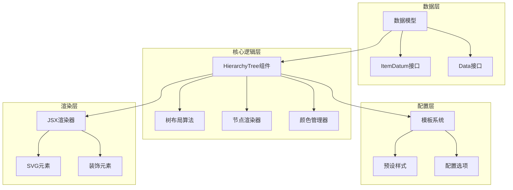

**图表来源**
- [hierarchy-tree.tsx](file://antv_infographic/infographic/src/designs/structures/hierarchy-tree.tsx#L1-L600)
- [data.ts](file://antv_infographic/infographic/src/types/data.ts#L1-L20)

**章节来源**
- [hierarchy-tree.tsx](file://antv_infographic/infographic/src/designs/structures/hierarchy-tree.tsx#L1-L50)
- [data.ts](file://antv_infographic/infographic/src/types/data.ts#L1-L20)

## 核心组件

层次型结构系统由以下核心组件构成：

### 主要组件架构

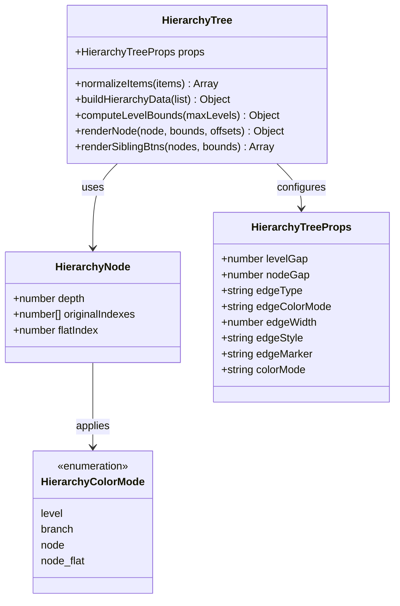

**图表来源**
- [hierarchy-tree.tsx](file://antv_infographic/infographic/src/designs/structures/hierarchy-tree.tsx#L32-L101)
- [hierarchy-color.ts](file://antv_infographic/infographic/src/designs/utils/hierarchy-color.ts#L7-L16)

**章节来源**
- [hierarchy-tree.tsx](file://antv_infographic/infographic/src/designs/structures/hierarchy-tree.tsx#L32-L101)
- [hierarchy-color.ts](file://antv_infographic/infographic/src/designs/utils/hierarchy-color.ts#L1-L128)

## 架构概览

层次型结构采用模块化架构设计，主要包含以下几个关键层面：

### 系统架构图

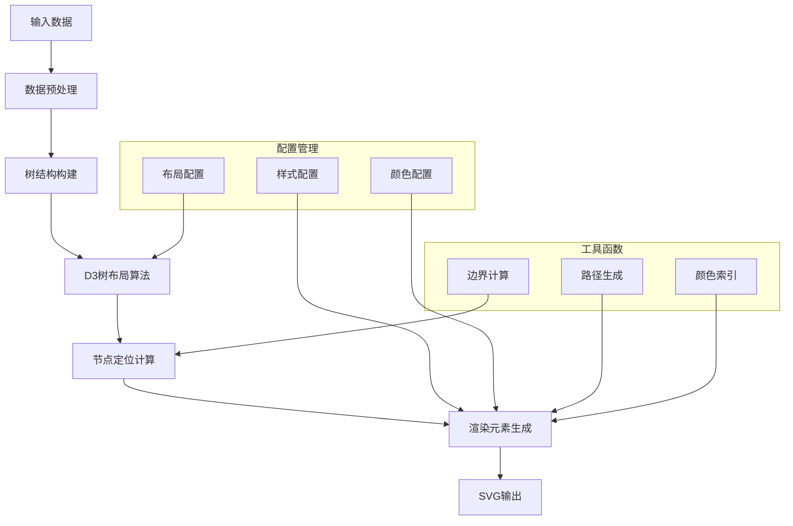

**图表来源**
- [hierarchy-tree.tsx](file://antv_infographic/infographic/src/designs/structures/hierarchy-tree.tsx#L501-L599)

## 详细组件分析

### 数据预处理组件

数据预处理是层次型结构的关键环节，负责将扁平化的输入数据转换为标准的树状结构：

#### 扁平化数据转换

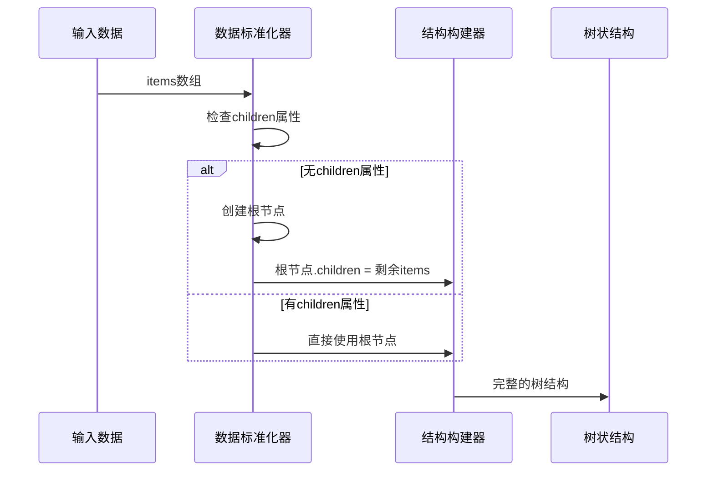

**图表来源**
- [hierarchy-tree.tsx](file://antv_infographic/infographic/src/designs/structures/hierarchy-tree.tsx#L107-L114)
- [hierarchy-tree.tsx](file://antv_infographic/infographic/src/designs/structures/hierarchy-tree.tsx#L144-L176)

#### 节点深度追踪机制

系统通过 `_originalIndex` 和 `_depth` 属性维护节点的层级信息：

| 属性 | 类型 | 描述 | 示例 |
|------|------|------|------|
| `_originalIndex` | `number[]` | 节点在原始数据中的索引路径 | `[0, 1, 2]` |
| `_depth` | `number` | 节点的层级深度（从0开始） | `2` |
| `_flatIndex` | `number` | 节点在树的遍历序列中的位置 | `5` |

**章节来源**
- [hierarchy-tree.tsx](file://antv_infographic/infographic/src/designs/structures/hierarchy-tree.tsx#L144-L176)

### 树布局算法组件

#### D3树布局集成

系统基于D3.js的树布局算法，实现了正交树布局：

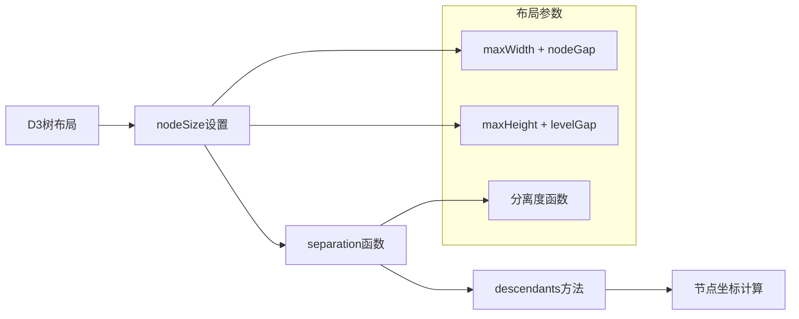

**图表来源**
- [hierarchy-tree.tsx](file://antv_infographic/infographic/src/designs/structures/hierarchy-tree.tsx#L536-L540)

#### 偏移量计算

系统自动计算渲染所需的偏移量，确保图形在容器中正确居中：

```mermaid
graph TD
A[获取所有节点坐标] --> B[计算最小X值]
A --> C[计算最小Y值]
B --> D[偏移量X = max(0, -minX + maxWidth/2)]
C --> E[偏移量Y = max(0, -minY + btnBounds.height + 10)]
D --> F[应用到所有节点]
E --> F
```

**图表来源**
- [hierarchy-tree.tsx](file://antv_infographic/infographic/src/designs/structures/hierarchy-tree.tsx#L542-L548)

**章节来源**
- [hierarchy-tree.tsx](file://antv_infographic/infographic/src/designs/structures/hierarchy-tree.tsx#L536-L548)

### 节点渲染组件

#### 渲染流程

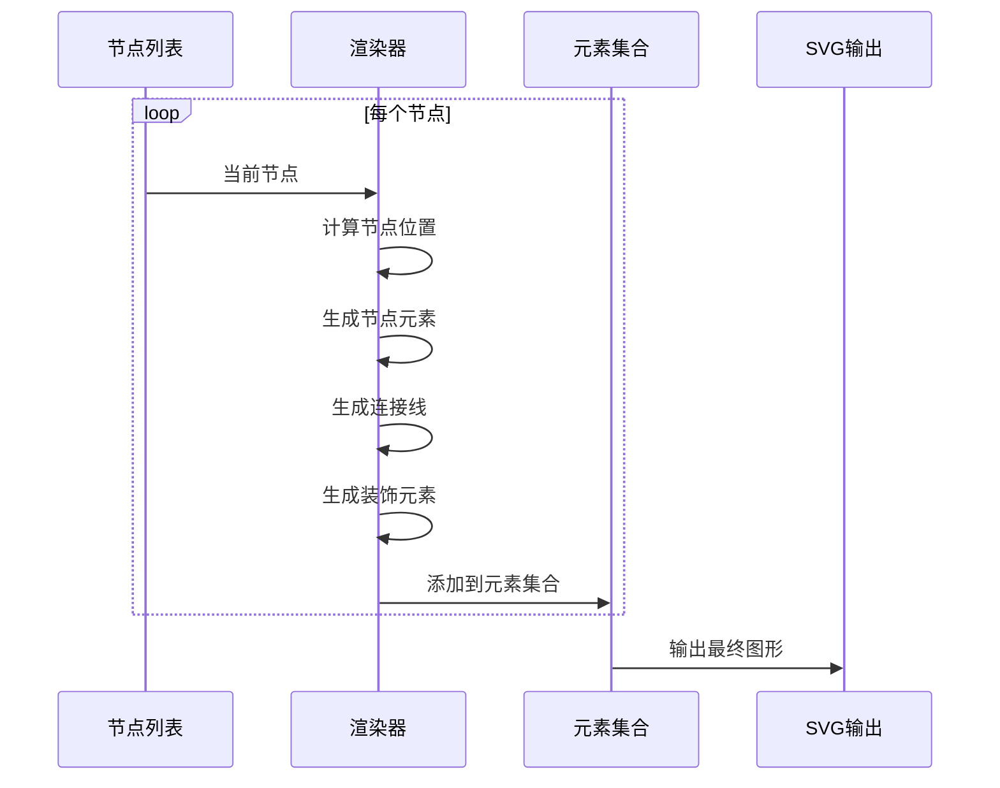

**图表来源**
- [hierarchy-tree.tsx](file://antv_infographic/infographic/src/designs/structures/hierarchy-tree.tsx#L562-L577)

#### 连接线生成算法

系统支持多种连接线类型和样式：

| 连接线类型 | 描述 | 实现方式 |
|------------|------|----------|
| 直线 | 直接连接父子节点 | 折线路径 |
| 曲线 | 贝塞尔曲线连接 | `C`命令路径 |
| 圆角直线 | 带圆角的折线 | 自定义路径生成 |

**章节来源**
- [hierarchy-tree.tsx](file://antv_infographic/infographic/src/designs/structures/hierarchy-tree.tsx#L270-L321)

### 颜色管理系统

#### 着色模式详解

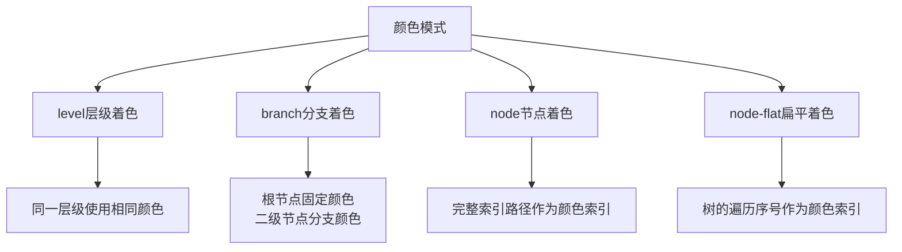

**图表来源**
- [hierarchy-color.ts](file://antv_infographic/infographic/src/designs/utils/hierarchy-color.ts#L44-L101)

**章节来源**
- [hierarchy-color.ts](file://antv_infographic/infographic/src/designs/utils/hierarchy-color.ts#L44-L101)

## 数据模型要求

### 标准数据结构

层次型结构要求输入数据遵循特定的结构规范：

#### ItemDatum 接口

| 字段名 | 类型 | 必需 | 描述 |
|--------|------|------|------|
| `icon` | `string \| ResourceConfig` | 否 | 节点图标 |
| `label` | `string` | 否 | 节点标签 |
| `desc` | `string` | 否 | 节点描述 |
| `value` | `number` | 否 | 节点数值 |
| `illus` | `string \| ResourceConfig` | 否 | 节点插图 |
| `children` | `ItemDatum[]` | 否 | 子节点数组 |

#### Data 接口

| 字段名 | 类型 | 必需 | 描述 |
|--------|------|------|------|
| `title` | `string` | 否 | 图表标题 |
| `desc` | `string` | 否 | 图表描述 |
| `items` | `ItemDatum[]` | 是 | 节点数据数组 |
| `illus` | `Record<string, string \| ResourceConfig>` | 否 | 插图资源 |

### 数据转换示例

#### 扁平化数据转换为树状结构

```typescript
// 输入：扁平化数据
const flatData = [
  { id: 'root', label: '根节点' },
  { id: 'child1', label: '子节点1', parentId: 'root' },
  { id: 'child2', label: '子节点2', parentId: 'root' },
  { id: 'grandchild1', label: '孙节点1', parentId: 'child1' }
];

// 输出：树状结构
const treeData = {
  label: '根节点',
  children: [
    {
      label: '子节点1',
      children: [{ label: '孙节点1' }]
    },
    { label: '子节点2' }
  ]
};
```

**章节来源**
- [data.ts](file://antv_infographic/infographic/src/types/data.ts#L3-L19)
- [generate_service.py](file://backend/app/services/generate_service.py#L402-L439)

## 布局算法

### 正交树布局

系统采用D3.js的正交树布局算法，提供以下特性：

#### 布局参数配置

| 参数 | 默认值 | 描述 |
|------|--------|------|
| `nodeSize` | `[maxWidth + nodeGap, maxHeight + levelGap]` | 节点大小 |
| `separation` | `() => 1` | 节点分离度 |
| `levelGap` | `80` | 层级间距 |
| `nodeGap` | `60` | 节点间距 |

#### 布局计算流程

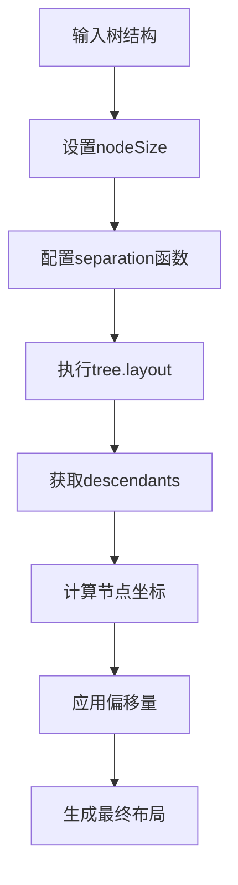

**图表来源**
- [hierarchy-tree.tsx](file://antv_infographic/infographic/src/designs/structures/hierarchy-tree.tsx#L536-L540)

**章节来源**
- [hierarchy-tree.tsx](file://antv_infographic/infographic/src/designs/structures/hierarchy-tree.tsx#L536-L540)

## 节点渲染机制

### 渲染元素类型

系统生成三种类型的渲染元素：

#### 元素类型分类

| 元素类型 | 描述 | 生成时机 |
|----------|------|----------|
| `items` | 节点主体元素 | 每个节点 |
| `btns` | 操作按钮 | 添加/删除按钮 |
| `deco` | 装饰元素 | 连接线、箭头等 |

#### 渲染流程图

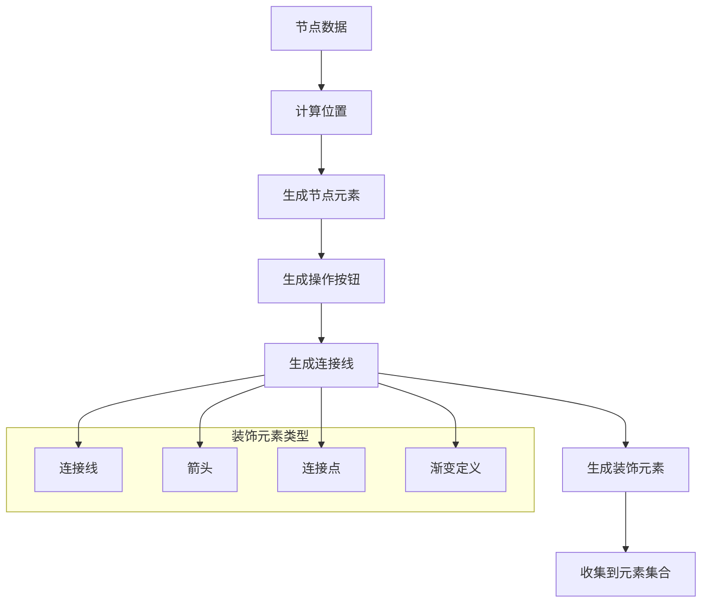

**图表来源**
- [hierarchy-tree.tsx](file://antv_infographic/infographic/src/designs/structures/hierarchy-tree.tsx#L204-L455)

**章节来源**
- [hierarchy-tree.tsx](file://antv_infographic/infographic/src/designs/structures/hierarchy-tree.tsx#L204-L455)

## 配置选项

### 布局配置

#### 核心布局参数

| 配置项 | 类型 | 默认值 | 描述 |
|--------|------|--------|------|
| `levelGap` | `number` | `80` | 父子节点垂直间距 |
| `nodeGap` | `number` | `60` | 同级节点水平间距 |

### 连接线配置

#### 连接线样式选项

| 配置项 | 类型 | 默认值 | 描述 |
|--------|------|--------|------|
| `edgeType` | `'straight' \| 'curved'` | `'straight'` | 连接线类型 |
| `edgeColorMode` | `'solid' \| 'gradient'` | `'gradient'` | 颜色模式 |
| `edgeWidth` | `number` | `3` | 连接线宽度 |
| `edgeStyle` | `'solid' \| 'dashed'` | `'solid'` | 线条样式 |
| `edgeCornerRadius` | `number` | `0` | 圆角半径 |

#### 连接线位置配置

| 配置项 | 类型 | 默认值 | 描述 |
|--------|------|--------|------|
| `edgeOffset` | `number` | `0` | 与节点的间隔距离 |
| `edgeOrigin` | `'center' \| 'distributed'` | `'center'` | 起点模式 |
| `edgeOriginPadding` | `number` | `20` | 分布式起点内边距 |

### 装饰元素配置

#### 标记类型配置

| 配置项 | 类型 | 默认值 | 描述 |
|--------|------|--------|------|
| `edgeMarker` | `'none' \| 'dot' \| 'arrow'` | `'none'` | 连接线标记 |
| `markerSize` | `number` | `12` | 标记大小 |

### 着色模式配置

#### 颜色模式选项

| 模式 | 描述 | 使用场景 |
|------|------|----------|
| `level` | 按层级着色 | 同一层级使用相同颜色 |
| `branch` | 按分支着色 | 根节点固定，分支区分 |
| `node` | 按节点着色 | 使用完整索引路径 |
| `node-flat` | 按扁平序号着色 | 使用遍历序号 |

**章节来源**
- [hierarchy-tree.tsx](file://antv_infographic/infographic/src/designs/structures/hierarchy-tree.tsx#L32-L101)

## 错误处理

### 循环引用检测

系统通过深度限制和索引验证防止循环引用：

#### 检测机制

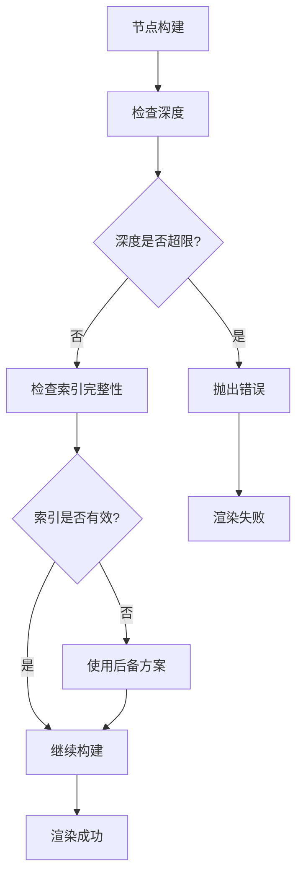

**图表来源**
- [hierarchy-color.ts](file://antv_infographic/infographic/src/designs/utils/hierarchy-color.ts#L85-L96)

### 数据验证

#### 输入数据验证规则

| 验证项 | 规则 | 错误处理 |
|--------|------|----------|
| 空数据 | `items.length === 0` | 显示添加按钮 |
| 无效索引 | 负数或超出范围 | 返回`undefined` |
| 深度过深 | 超过最大允许深度 | 使用后备颜色 |
| 缺少必需字段 | `label`或`children`缺失 | 使用默认值 |

**章节来源**
- [hierarchy-color.ts](file://antv_infographic/infographic/src/designs/utils/hierarchy-color.ts#L85-L96)
- [data.test.ts](file://antv_infographic/infographic/__tests__/unit/utils/data.test.ts#L91-L115)

## 性能考虑

### 渲染优化策略

#### 性能优化技术

1. **批量渲染**：将所有元素收集后一次性渲染
2. **缓存计算**：缓存节点边界和颜色计算结果
3. **延迟加载**：按需生成装饰元素
4. **内存管理**：及时清理临时变量

#### 性能指标

| 指标 | 目标值 | 实现方式 |
|------|--------|----------|
| 渲染时间 | < 100ms | 优化算法复杂度 |
| 内存使用 | < 50MB | 对象池复用 |
| 响应时间 | < 16ms | 异步渲染 |

### 大数据处理

#### 大规模数据优化

对于包含数千个节点的树结构，系统采用以下优化策略：

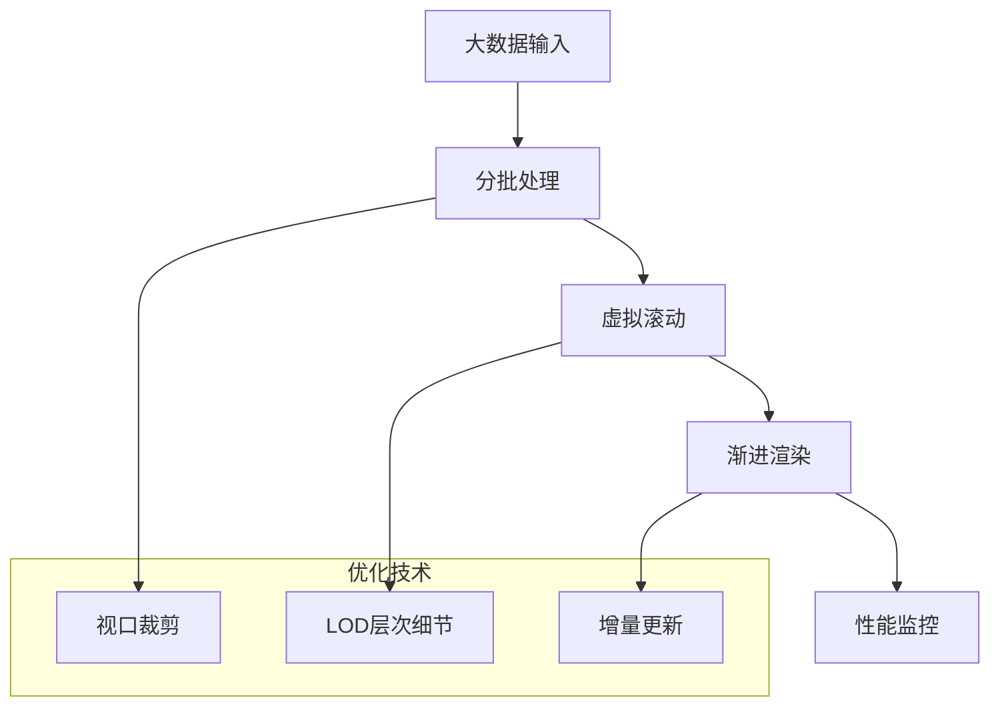

## 故障排除指南

### 常见问题及解决方案

#### 渲染失败问题

| 问题症状 | 可能原因 | 解决方案 |
|----------|----------|----------|
| 图形不显示 | 数据为空 | 检查`items`数组是否为空 |
| 节点重叠 | 间距设置过小 | 增加`levelGap`和`nodeGap` |
| 连接线异常 | 样式配置错误 | 检查`edgeType`和`edgeStyle`配置 |
| 颜色异常 | 着色模式错误 | 验证`colorMode`设置 |

#### 调试技巧

1. **启用调试模式**：设置`console.log`输出中间结果
2. **检查数据结构**：验证输入数据符合预期格式
3. **监控性能指标**：使用浏览器开发者工具分析性能
4. **验证配置参数**：确保所有配置项都在有效范围内

**章节来源**
- [hierarchy-color.test.ts](file://antv_infographic/infographic/__tests__/unit/designs/utils/hierarchy-color.test.ts#L39-L41)

## 结论

层次型结构系统是一个功能完善、设计精良的树状数据可视化解决方案。它通过模块化架构、灵活的配置选项和强大的错误处理机制，为用户提供了可靠的层次型数据展示能力。

### 主要优势

1. **灵活性强**：支持多种布局样式和配置选项
2. **扩展性好**：易于添加新的节点类型和装饰元素
3. **性能优异**：针对大规模数据进行了优化
4. **错误处理完善**：具备健壮的容错机制

### 应用场景

- **组织架构图**：展示公司部门结构和人员关系
- **分类体系**：表示产品分类、知识分类等
- **决策树**：展示决策过程和逻辑分支
- **文件系统**：可视化目录结构和文件关系

该系统为层次型数据的可视化提供了完整的解决方案，能够满足各种复杂场景的需求。