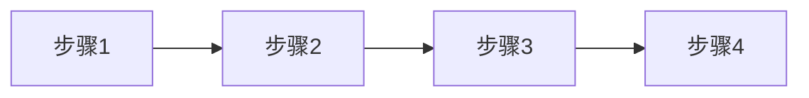
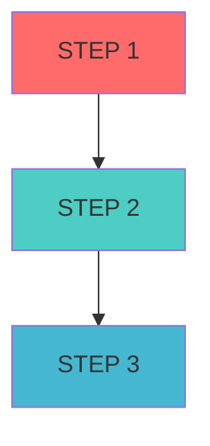
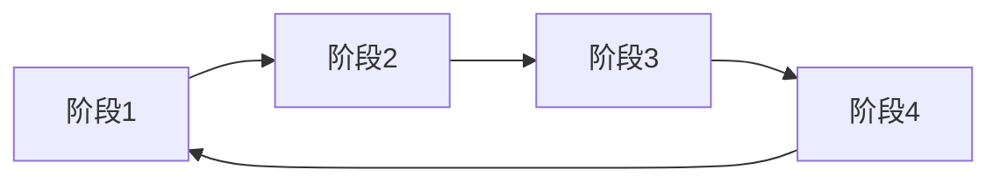
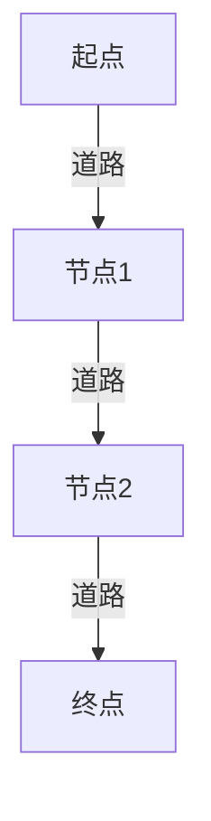

# 序列型结构

<cite>
**本文档引用的文件**  
- [sequence-steps.tsx](file://antv_infographic/infographic/src/designs/structures/sequence-steps.tsx)
- [sequence-timeline.tsx](file://antv_infographic/infographic/src/designs/structures/sequence-timeline.tsx)
- [sequence-circular.tsx](file://antv_infographic/infographic/src/designs/structures/sequence-circular.tsx)
- [sequence-roadmap-vertical.tsx](file://antv_infographic/infographic/src/designs/structures/sequence-roadmap-vertical.tsx)
- [sequence-snake-steps.tsx](file://antv_infographic/infographic/src/designs/structures/sequence-snake-steps.tsx)
- [sequence-zigzag-steps.tsx](file://antv_infographic/infographic/src/designs/structures/sequence-zigzag-steps.tsx)
- [types.ts](file://antv_infographic/infographic/src/designs/structures/types.ts)
- [data.ts](file://antv_infographic/infographic/src/types/data.ts)
- [templates_batch1_high_priority.json](file://archive/temp_files/templates_batch1_high_priority.json)
- [templates_batch3_supplementary.json](file://archive/temp_files/templates_batch3_supplementary.json)
</cite>

## 目录
1. [引言](#引言)
2. [核心序列结构变体](#核心序列结构变体)
3. [数据模型与字段绑定](#数据模型与字段绑定)
4. [渲染参数与样式控制](#渲染参数与样式控制)
5. [代码配置示例](#代码配置示例)
6. [常见渲染问题与调试](#常见渲染问题与调试)
7. [结论](#结论)

## 引言
序列型信息结构是AntV Infographic中用于表达流程、阶段、时间顺序等递进关系的核心视觉组件。这类结构通过线性或环形的布局，将信息以清晰的步骤或阶段形式展现，适用于操作指南、项目里程碑、产品迭代历史等多种场景。本文档将深入解析`sequence-steps`、`sequence-timeline`、`sequence-circular`和`sequence-roadmap-vertical`等主要变体，阐述其视觉语义、数据模型、配置参数及常见问题的解决方案。

## 核心序列结构变体

### 线性步骤 (sequence-steps)
`sequence-steps`是最基础的线性流程结构，以水平排列的节点和箭头连接，直观地展示一系列连续的步骤。每个节点通常包含一个图标和文本描述，适用于简单的操作流程图。



**Diagram sources**
- [sequence-steps.tsx](file://antv_infographic/infographic/src/designs/structures/sequence-steps.tsx#L1-L122)

**Section sources**
- [sequence-steps.tsx](file://antv_infographic/infographic/src/designs/structures/sequence-steps.tsx#L1-L122)
- [templates_batch1_high_priority.json](file://archive/temp_files/templates_batch1_high_priority.json#L296-L344)

### 时间轴 (sequence-timeline)
`sequence-timeline`以垂直方向的线条和节点来表示时间的流逝。每个节点代表一个特定的时间点或事件，节点上的标签（如"STEP 1"）和装饰性圆点增强了时间感。该结构特别适合展示项目里程碑或历史事件。



**Diagram sources**
- [sequence-timeline.tsx](file://antv_infographic/infographic/src/designs/structures/sequence-timeline.tsx#L1-L188)

**Section sources**
- [sequence-timeline.tsx](file://antv_infographic/infographic/src/designs/structures/sequence-timeline.tsx#L1-L188)
- [templates_batch3_supplementary.json](file://archive/temp_files/templates_batch3_supplementary.json#L185-L221)

### 环形流程 (sequence-circular)
`sequence-circular`将流程组织成一个圆形，象征着循环、完整或无始无终的概念。每个阶段以扇形区域表示，通过弧形连接，视觉上更具吸引力和象征意义，常用于展示生命周期或循环过程。



**Diagram sources**
- [sequence-circular.tsx](file://antv_infographic/infographic/src/designs/structures/sequence-circular.tsx#L1-L372)

**Section sources**
- [sequence-circular.tsx](file://antv_infographic/infographic/src/designs/structures/sequence-circular.tsx#L1-L372)

### 垂直路线图 (sequence-roadmap-vertical)
`sequence-roadmap-vertical`采用垂直公路的样式，节点在道路两侧交替排列，并配有编号的图标。这种设计在视觉上更具动感和层次感，适合展示复杂的项目路线图或发展路径。



**Diagram sources**
- [sequence-roadmap-vertical.tsx](file://antv_infographic/infographic/src/designs/structures/sequence-roadmap-vertical.tsx#L1-L338)

**Section sources**
- [sequence-roadmap-vertical.tsx](file://antv_infographic/infographic/src/designs/structures/sequence-roadmap-vertical.tsx#L1-L338)

## 数据模型与字段绑定

### 数据结构要求
所有序列型结构都遵循统一的数据模型，其核心是一个线性数组`items`，确保了流程的递进关系。数据模型定义如下：

```typescript
interface Data {
  title?: string;
  desc?: string;
  items: ItemDatum[];
}

interface ItemDatum {
  icon?: string | ResourceConfig;
  label?: string;
  desc?: string;
  value?: number;
  [key: string]: any;
}
```

**Section sources**
- [data.ts](file://antv_infographic/infographic/src/types/data.ts#L1-L20)
- [prompt.md](file://antv_infographic/infographic/src/designs/items/prompt.md#L61-L69)

### 关键字段绑定规则
- **title**: 绑定到结构的`Title`组件，作为整个流程的标题。
- **content**: 通常由`label`和`desc`字段组合而成，`label`作为主标题，`desc`作为详细描述。
- **status**: 状态信息通常通过`value`字段或自定义字段（如`status`）来表示，并通过主题颜色或图标进行视觉化。

## 渲染参数与样式控制

### 通用Props
所有序列结构都继承自`BaseStructureProps`，包含`Title`和`Item`组件的定义以及`options`配置。

```typescript
interface BaseStructureProps {
  Title?: ComponentType<Pick<TitleProps, 'title' | 'desc'>>;
  Item: ComponentType<Omit<BaseItemProps, 'themeColors'> & Partial<Pick<BaseItemProps, 'themeColors'>>>;
  data: Data;
  options: ParsedInfographicOptions;
}
```

**Section sources**
- [types.ts](file://antv_infographic/infographic/src/designs/structures/types.ts#L7-L16)

### 特定结构Props
- **sequence-steps**: `gap` (节点间距)
- **sequence-timeline**: `gap` (节点间距), `lineOffset` (时间线偏移)
- **sequence-circular**: `outerRadius`, `innerRadius`, `itemDistance` (控制环形大小和距离)
- **sequence-roadmap-vertical**: `spacing` (节点间距), `flipped` (是否左右反转)

## 代码配置示例
以下是一个配置`sequence-timeline`的代码示例：

```typescript
const config = {
  structure: 'sequence-timeline',
  data: {
    title: '项目里程碑',
    items: [
      { label: '需求分析', desc: '完成需求文档', time: '2023-01' },
      { label: '设计阶段', desc: 'UI/UX设计完成', time: '2023-03' },
      { label: '开发启动', desc: '前端后端开发开始', time: '2023-05' }
    ]
  },
  options: {
    themeConfig: { colorPrimary: '#1890ff' }
  }
};
```

**Section sources**
- [sequence-timeline.tsx](file://antv_infographic/infographic/src/designs/structures/sequence-timeline.tsx#L15-L18)
- [templates_batch3_supplementary.json](file://archive/temp_files/templates_batch3_supplementary.json#L194-L208)

## 常见渲染问题与调试

### 节点错位
**问题**: 节点位置计算错误，导致布局混乱。
**调试**: 检查`getElementBounds`的调用，确保在渲染前正确计算了子组件的尺寸。确认`x`和`y`坐标计算逻辑无误。

### 连接线断裂
**问题**: 连接线（如箭头或路径）未能正确连接节点。
**调试**: 检查路径生成逻辑（如`d`属性），确保坐标计算正确。对于`sequence-timeline`，确认`continuousLinePath`的起点和终点坐标。

## 结论
AntV Infographic的序列型结构提供了强大而灵活的工具来可视化流程和时间线。通过理解其数据模型、关键字段绑定和渲染参数，开发者可以高效地创建出专业且美观的信息图。在遇到渲染问题时，应重点检查坐标计算和尺寸测量逻辑，以确保布局的准确性。