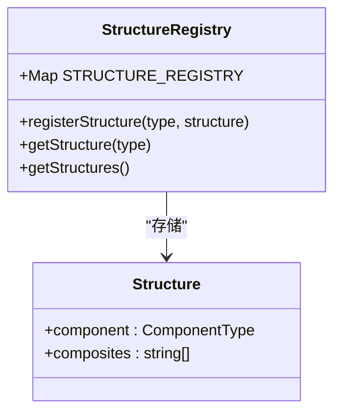
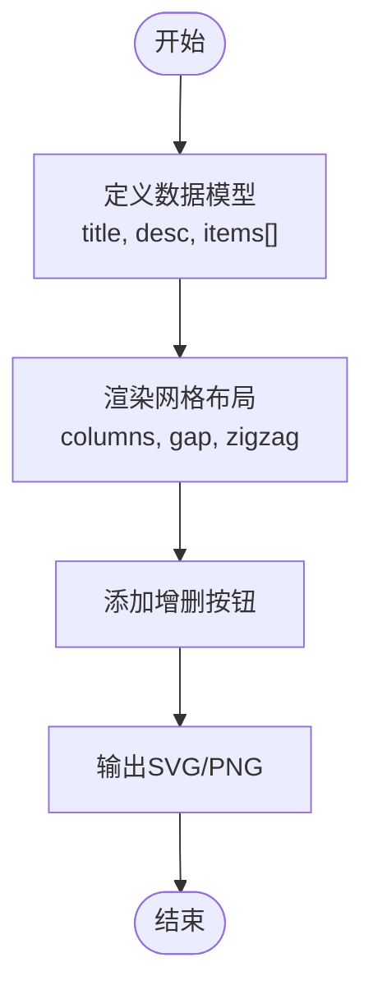

# 核心信息结构

<cite>
**本文档中引用的文件**  
- [registry.ts](file://src/designs/structures/registry.ts)
- [list-grid.tsx](file://src/designs/structures/list-grid.tsx)
- [sequence-pyramid.js](file://esm/designs/structures/sequence-pyramid.js)
- [index.d.ts](file://esm/designs/structures/index.d.ts)
- [hierarchy-tree.ts](file://src/templates/hierarchy-tree.ts)
</cite>

## 目录
1. [引言](#引言)
2. [核心信息结构类型](#核心信息结构类型)
3. [结构注册机制](#结构注册机制)
4. [数据绑定与渲染示例](#数据绑定与渲染示例)
5. [常见问题诊断与解决](#常见问题诊断与解决)
6. [结论](#结论)

## 引言
AntV Infographic 是一个用于生成信息图表的可视化库，支持多种核心信息结构类型，以满足不同场景下的数据表达需求。本文档全面介绍其支持的序列型、层次型、比较型、关系型和列表型结构的视觉语义与数据模型适配规则，详细说明结构注册机制的工作原理及自定义结构的接入流程，并通过典型示例展示不同结构的数据绑定方式与渲染效果，最后提供针对结构渲染异常、数据映射错误等问题的诊断与解决建议。

## 核心信息结构类型

AntV Infographic 支持多种核心信息结构类型，每种结构都有其特定的视觉语义和适用场景：

### 序列型结构
序列型结构用于表示具有时间或逻辑顺序的信息流，主要包括：
- **sequence-steps**：步骤序列，适用于流程说明、操作指南等场景。
- **sequence-timeline**：时间轴结构，适合展示历史事件、项目里程碑等按时间排列的数据。

### 层次型结构
层次型结构用于展示具有层级关系的数据，典型代表为：
- **hierarchy-tree**：树状结构，广泛应用于组织架构图、文件目录、分类体系等场景。

### 比较型结构
比较型结构强调不同层级或类别之间的对比关系：
- **compare-hierarchy-row**：横向层次比较结构，适合并列展示多个层级实体的属性或状态。

### 关系型结构
关系型结构用于表达节点间的连接与网络关系：
- **relation-network**：网络图结构，适用于社交网络、知识图谱、依赖关系等复杂关联场景。

### 列表型结构
列表型结构用于组织和展示同类型项目的集合：
- **list-grid**：网格列表，适用于卡片式布局、产品展示等。
- **list-pyramid**：金字塔列表，常用于优先级排序、层级分布等场景。

这些结构通过统一的注册机制进行管理，开发者可以灵活选择合适的结构来表达数据。

**Section sources**
- [index.d.ts](file://esm/designs/structures/index.d.ts#L3-L29)

## 结构注册机制

### registry.ts 工作原理
AntV Infographic 使用 `registry.ts` 文件中的注册机制来统一管理所有结构类型。该机制基于一个全局的 `Map` 存储结构类型与其对应组件的映射关系。

核心函数包括：
- `registerStructure(type: string, structure: Structure)`：将指定类型的结构注册到全局注册表中。
- `getStructure(type: string)`：根据类型获取已注册的结构定义。
- `getStructures()`：返回所有已注册结构类型的列表。

当用户配置图表时，系统会根据指定的结构类型从注册表中查找对应的组件并进行渲染。

### 自定义结构接入流程
要接入自定义结构，开发者需遵循以下步骤：
1. 定义结构组件，实现其视觉呈现逻辑。
2. 调用 `registerStructure` 方法将新结构注册到系统中。
3. 在配置中使用该结构类型即可生效。

此机制保证了系统的可扩展性与灵活性。

**Diagram sources**
- [registry.ts](file://src/designs/structures/registry.ts#L1-L15)

**Section sources**
- [registry.ts](file://src/designs/structures/registry.ts#L1-L15)

## 数据绑定与渲染示例

### list-grid 结构示例
`list-grid` 是一种典型的列表型结构，支持网格布局与锯齿排列（zigzag）模式。其数据模型包含标题、描述和项目列表，支持动态增删项。

**Diagram sources**
- [list-grid.tsx](file://src/designs/structures/list-grid.tsx#L1-L39)

**Section sources**
- [list-grid.tsx](file://src/designs/structures/list-grid.tsx#L1-L39)

### sequence-pyramid 结构示例
`sequence-pyramid` 用于构建金字塔形的信息结构，常用于战略规划、需求分层等场景。其几何计算逻辑根据层级宽度动态生成顶点坐标。

**Diagram sources**
- [sequence-pyramid.js](file://esm/designs/structures/sequence-pyramid.js#L80-L94)

## 常见问题诊断与解决

### 结构渲染异常
**问题表现**：指定结构未正确渲染或显示为空白。
**可能原因**：
- 结构类型拼写错误或未注册。
- 对应组件未正确导入或注册。
- 数据格式不符合结构预期。

**解决方案**：
1. 检查结构类型是否在 `getStructures()` 返回列表中。
2. 确认调用了 `registerStructure` 注册该结构。
3. 验证数据模型是否符合结构要求。

### 数据映射错误
**问题表现**：数据显示错位、缺失或重复。
**可能原因**：
- 数据字段名与结构期望不匹配。
- 数组索引处理逻辑错误。
- 布局参数（如列数、间距）设置不当。

**解决方案**：
1. 使用调试工具检查 `data` 对象结构。
2. 确保 `items` 数组与 `indexes` 映射一致。
3. 调整 `columns`、`gap` 等布局参数以适配容器尺寸。

**Section sources**
- [list-grid.tsx](file://src/designs/structures/list-grid.tsx#L1-L39)
- [registry.ts](file://src/designs/structures/registry.ts#L1-L15)

## 结论
AntV Infographic 提供了丰富的核心信息结构类型，涵盖序列、层次、比较、关系和列表等多种数据表达形式。通过统一的结构注册机制，系统实现了高度的可扩展性，支持开发者轻松接入自定义结构。合理选择结构类型并正确绑定数据，能够有效提升信息图表的表现力与可读性。对于常见的渲染与数据映射问题，应从结构注册、数据格式和布局参数等方面进行系统排查，确保图表正确呈现。