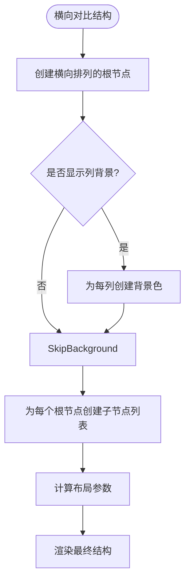
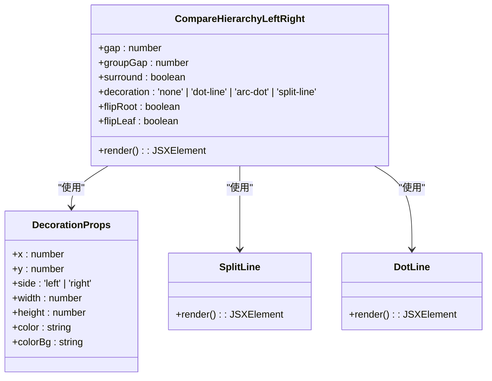
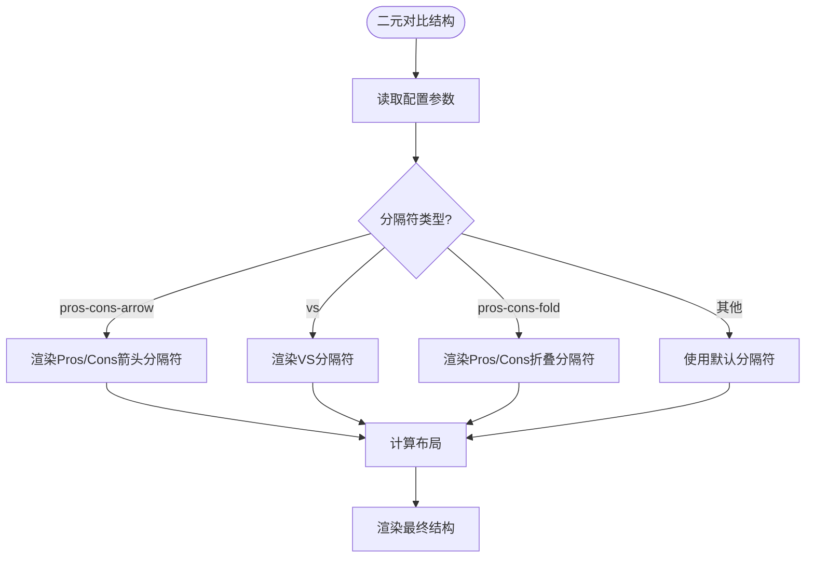
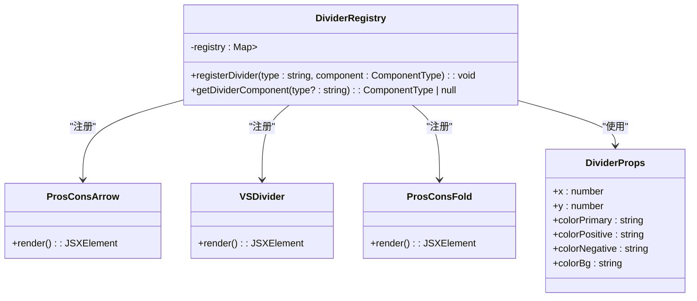
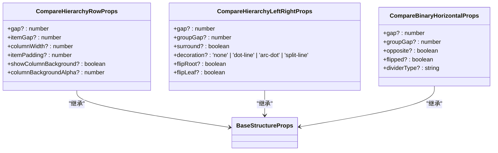

# 比较型结构

<cite>
**本文档引用的文件**
- [compare-hierarchy-row.d.ts](file://antv_infographic\infographic\lib\designs\structures\compare-hierarchy-row.d.ts)
- [compare-hierarchy-left-right.tsx](file://antv_infographic\infographic\src\designs\structures\compare-hierarchy-left-right.tsx)
- [compare-binary-horizontal/index.tsx](file://antv_infographic\infographic\src\designs\structures\compare-binary-horizontal\index.tsx)
- [compare-binary-horizontal/dividers/pros-cons-arrow.tsx](file://antv_infographic\infographic\src\designs\structures\compare-binary-horizontal\dividers\pros-cons-arrow.tsx)
- [compare-binary-horizontal/dividers/vs.tsx](file://antv_infographic\infographic\src\designs\structures\compare-binary-horizontal\dividers\vs.tsx)
- [compare-binary-horizontal/dividers/pros-cons-fold.tsx](file://antv_infographic\infographic\src\designs\structures\compare-binary-horizontal\dividers\pros-cons-fold.tsx)
- [compare-binary-horizontal/dividers/types.ts](file://antv_infographic\infographic\src\designs\structures\compare-binary-horizontal\dividers\types.ts)
- [compare-hierarchy-row.tsx](file://antv_infographic\infographic\src\designs\structures\compare-hierarchy-row.tsx)
- [templates_batch1_high_priority.json](file://archive\temp_files\templates_batch1_high_priority.json)
- [built-in.js](file://antv_infographic\infographic\esm\templates\built-in.js)
</cite>

## 目录
1. [引言](#引言)
2. [横向对比结构](#横向对比结构)
3. [左右对比结构](#左右对比结构)
4. [二元对比结构](#二元对比结构)
5. [分隔符集成](#分隔符集成)
6. [配置与对齐](#配置与对齐)
7. [实际案例](#实际案例)
8. [问题排查](#问题排查)
9. [总结](#总结)

## 引言
比较型信息结构是一种用于展示两个或多个实体之间差异和相似性的可视化方法。这种结构广泛应用于优劣分析、方案对比、A/B测试等场景。本文档将系统阐述三种主要的比较型结构：横向对比（compare-hierarchy-row）、左右对比（compare-hierarchy-left-right）及二元对比（compare-binary-horizontal）。我们将深入解析这些结构的数据模型、布局规则以及分隔符的集成方式，并提供配置维度、统一标尺和高亮差异项的方法。

**本节不分析具体源文件**

## 横向对比结构
横向对比结构（compare-hierarchy-row）是一种多列式布局，适用于分类对比和多维度分析。该结构的第一级是横向排列的根节点，每个根节点下包含一个子节点列表。这种布局特别适合展示多个选项在不同维度上的表现。

该结构支持多种配置选项，包括列间距（gap）、项目间距（itemGap）、列宽（columnWidth）和项目内边距（itemPadding）。此外，还可以选择是否显示列背景色（showColumnBackground）及其透明度（columnBackgroundAlpha），以增强视觉区分度。



**Diagram sources**
- [compare-hierarchy-row.tsx](file://antv_infographic\infographic\src\designs\structures\compare-hierarchy-row.tsx#L1-L221)

**Section sources**
- [compare-hierarchy-row.d.ts](file://antv_infographic\infographic\lib\designs\structures\compare-hierarchy-row.d.ts#L1-L16)
- [compare-hierarchy-row.tsx](file://antv_infographic\infographic\src\designs\structures\compare-hierarchy-row.tsx#L1-L221)

## 左右对比结构
左右对比结构（compare-hierarchy-left-right）是一种双侧布局，用于展示两个实体之间的层级关系。该结构支持同侧数据项上下间隔（gap）、左右两侧间隔（groupGap）以及子节点是否环绕根节点（surround）等配置。

此结构的核心特点是其灵活的装饰样式（decoration），包括无装饰（none）、点线（dot-line）、弧点（arc-dot）和分割线（split-line）等。这些装饰元素可以帮助用户更直观地理解数据之间的关系。



**Diagram sources**
- [compare-hierarchy-left-right.tsx](file://antv_infographic\infographic\src\designs\structures\compare-hierarchy-left-right.tsx#L1-L359)

**Section sources**
- [compare-hierarchy-left-right.tsx](file://antv_infographic\infographic\src\designs\structures\compare-hierarchy-left-right.tsx#L1-L359)

## 二元对比结构
二元对比结构（compare-binary-horizontal）是一种水平布局，专门用于两个实体之间的直接比较。该结构支持多种配置选项，包括整体间距（gap）、组间距（groupGap）、反向排列（opposite）和翻转（flipped）等。

这种结构特别适合A/B测试、优劣分析等场景。通过配置不同的分隔符类型（dividerType），可以实现丰富的视觉效果，从而突出对比的重点。



**Diagram sources**
- [compare-binary-horizontal/index.tsx](file://antv_infographic\infographic\src\designs\structures\compare-binary-horizontal\index.tsx#L1-L100)

**Section sources**
- [compare-binary-horizontal/index.tsx](file://antv_infographic\infographic\src\designs\structures\compare-binary-horizontal\index.tsx#L1-L100)

## 分隔符集成
分隔符是二元对比结构中的关键元素，用于视觉上区分两个对比实体。系统提供了多种分隔符类型，包括"pros-cons-arrow"、"pros-cons-fold"和"vs"等。

分隔符的集成通过注册机制实现。每个分隔符组件都实现了统一的接口（DividerProps），包含位置、颜色等属性。通过registerDivider函数将分隔符注册到全局注册表中，然后在运行时根据配置动态获取并渲染相应的分隔符组件。



**Diagram sources**
- [compare-binary-horizontal/dividers/types.ts](file://antv_infographic\infographic\src\designs\structures\compare-binary-horizontal\dividers\types.ts#L1-L27)
- [compare-binary-horizontal/dividers/pros-cons-arrow.tsx](file://antv_infographic\infographic\src\designs\structures\compare-binary-horizontal\dividers\pros-cons-arrow.tsx#L1-L48)
- [compare-binary-horizontal/dividers/vs.tsx](file://antv_infographic\infographic\src\designs\structures\compare-binary-horizontal\dividers\vs.tsx#L1-L64)
- [compare-binary-horizontal/dividers/pros-cons-fold.tsx](file://antv_infographic\infographic\src\designs\structures\compare-binary-horizontal\dividers\pros-cons-fold.tsx#L1-L71)

**Section sources**
- [compare-binary-horizontal/dividers/types.ts](file://antv_infographic\infographic\src\designs\structures\compare-binary-horizontal\dividers\types.ts#L1-L27)
- [compare-binary-horizontal/dividers/pros-cons-arrow.tsx](file://antv_infographic\infographic\src\designs\structures\compare-binary-horizontal\dividers\pros-cons-arrow.tsx#L1-L48)
- [compare-binary-horizontal/dividers/vs.tsx](file://antv_infographic\infographic\src\designs\structures\compare-binary-horizontal\dividers\vs.tsx#L1-L64)
- [compare-binary-horizontal/dividers/pros-cons-fold.tsx](file://antv_infographic\infographic\src\designs\structures\compare-binary-horizontal\dividers\pros-cons-fold.tsx#L1-L71)

## 配置与对齐
比较型结构的配置主要通过属性系统实现。每个结构都有其特定的属性接口，如CompareHierarchyRowProps、CompareHierarchyLeftRightProps和CompareBinaryHorizontalProps。这些接口继承自BaseStructureProps，确保了配置的一致性。

对齐规则主要通过FlexLayout组件实现，支持水平和垂直方向的对齐。通过配置flexDirection、justifyContent和alignItems等属性，可以精确控制元素的布局。



**Diagram sources**
- [compare-hierarchy-row.d.ts](file://antv_infographic\infographic\lib\designs\structures\compare-hierarchy-row.d.ts#L3-L10)
- [compare-hierarchy-left-right.tsx](file://antv_infographic\infographic\src\designs\structures\compare-hierarchy-left-right.tsx#L10-L23)
- [compare-binary-horizontal/index.tsx](file://antv_infographic\infographic\src\designs\structures\compare-binary-horizontal\index.tsx#L4-L9)

**Section sources**
- [compare-hierarchy-row.d.ts](file://antv_infographic\infographic\lib\designs\structures\compare-hierarchy-row.d.ts#L3-L10)
- [compare-hierarchy-left-right.tsx](file://antv_infographic\infographic\src\designs\structures\compare-hierarchy-left-right.tsx#L10-L23)
- [compare-binary-horizontal/index.tsx](file://antv_infographic\infographic\src\designs\structures\compare-binary-horizontal\index.tsx#L4-L9)

## 实际案例
通过分析模板配置文件，我们可以看到比较型结构的实际应用。例如，在templates_batch1_high_priority.json中，定义了多个基于compare-binary-horizontal结构的模板，如"compare-binary-horizontal-simple-arrow"和"compare-binary-horizontal-underline-text-arrow"。

这些模板通过指定不同的分隔符类型（dividerType）和项目类型（item），实现了多样化的视觉效果。在built-in.js中，可以看到这些模板的具体配置，包括标题样式、结构类型和项目类型等。

```mermaid
erDiagram
TEMPLATE ||--o{ CONFIG : "包含"
CONFIG ||--o{ STRUCTURE : "使用"
CONFIG ||--o{ TITLE : "使用"
CONFIG ||--o{ ITEM : "使用"
class TEMPLATE {
id: string
name: string
category: string
structure_type: string
}
class CONFIG {
design: object
}
class STRUCTURE {
type: string
dividerType: string
}
class TITLE {
type: string
}
class ITEM {
type: string
iconType: string
iconSize: number
}
```

**Diagram sources**
- [templates_batch1_high_priority.json](file://archive\temp_files\templates_batch1_high_priority.json#L781-L928)
- [built-in.js](file://antv_infographic\infographic\esm\templates\built-in.js#L610-L655)

**Section sources**
- [templates_batch1_high_priority.json](file://archive\temp_files\templates_batch1_high_priority.json#L781-L928)
- [built-in.js](file://antv_infographic\infographic\esm\templates\built-in.js#L610-L655)

## 问题排查
在使用比较型结构时，可能会遇到数据维度不匹配、布局错乱等问题。以下是常见问题的排查方法：

1. **数据维度不匹配**：检查左右两侧的数据项数量是否一致。如果不一致，可以通过添加空项或调整布局参数来解决。
2. **布局错乱**：检查配置参数是否正确，特别是间距和尺寸相关的参数。确保所有单位一致，并考虑使用默认值进行调试。
3. **分隔符显示异常**：检查分隔符类型是否正确注册，并确认颜色配置是否符合设计要求。
4. **性能问题**：对于大量数据的比较，考虑使用虚拟滚动或分页技术来优化渲染性能。

通过仔细检查配置文件和日志输出，可以快速定位并解决问题。

**Section sources**
- [compare-hierarchy-row.tsx](file://antv_infographic\infographic\src\designs\structures\compare-hierarchy-row.tsx#L1-L221)
- [compare-hierarchy-left-right.tsx](file://antv_infographic\infographic\src\designs\structures\compare-hierarchy-left-right.tsx#L1-L359)
- [compare-binary-horizontal/index.tsx](file://antv_infographic\infographic\src\designs\structures\compare-binary-horizontal\index.tsx#L1-L100)

## 总结
比较型信息结构为数据分析和展示提供了强大的工具。通过横向对比、左右对比和二元对比三种主要模式，可以灵活应对各种比较场景。分隔符的集成和丰富的配置选项使得这些结构既美观又实用。在实际应用中，通过合理配置和仔细排查，可以充分发挥这些结构的优势，提升信息传达的效果。

**本节不分析具体源文件**