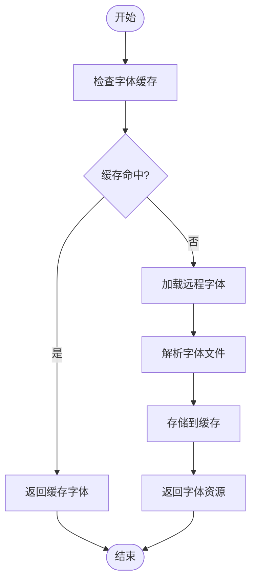
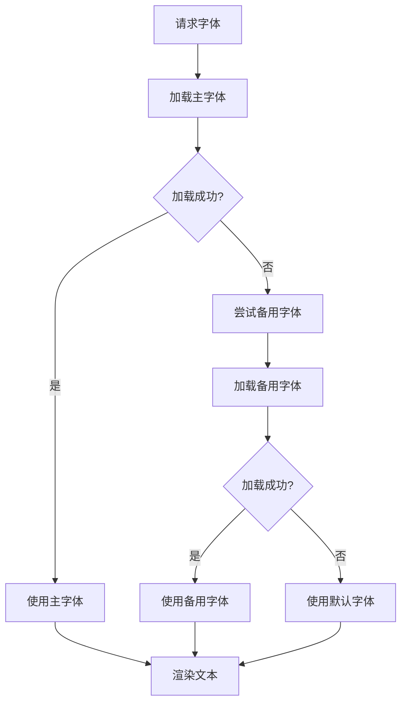
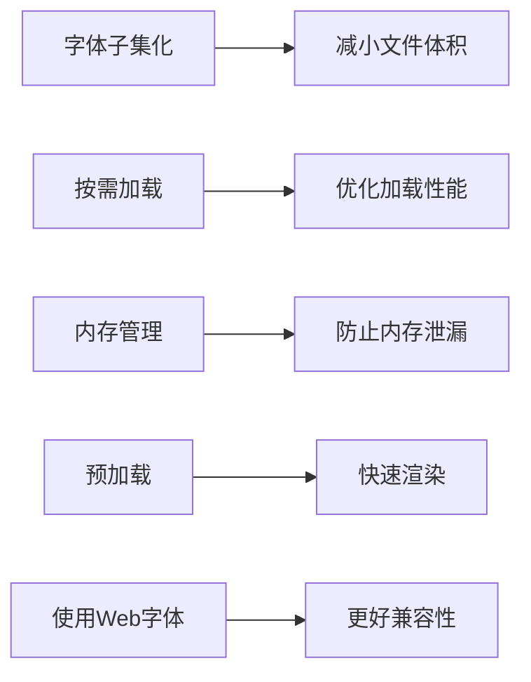

# 字体系统

<cite>
**本文档中引用的文件**  
- [built-in.ts](file://antv_infographic\infographic\src\renderer\fonts\built-in.ts)
- [loader.ts](file://antv_infographic\infographic\src\resource\loader.ts)
- [registry.ts](file://antv_infographic\infographic\src\resource\registry.ts)
- [font.ts](file://antv_infographic\infographic\src\types\font.ts)
- [font.ts](file://antv_infographic\infographic\src\utils\font.ts)
</cite>

## 目录
1. [引言](#引言)
2. [内置字体注册机制](#内置字体注册机制)
3. [字体加载器工作流程](#字体加载器工作流程)
4. [字体注册表API](#字体注册表api)
5. [JSX中字体引用方法](#jsx中字体引用方法)
6. [字体回退机制](#字体回退机制)
7. [错误处理与性能监控](#错误处理与性能监控)
8. [最佳实践](#最佳实践)
9. [结论](#结论)

## 引言
AntV Infographic提供了一套完整的字体管理系统，用于支持信息图表中多样化的文本渲染需求。该系统包含内置字体注册、远程字体加载、字体资源缓存和自定义字体注册等功能，确保在各种场景下都能高效、稳定地使用所需字体。

## 内置字体注册机制
系统通过`built-in.ts`文件预定义了一系列常用字体族配置，这些字体在初始化时自动注册到字体注册表中。内置字体包括常见的中英文字体组合，如"Microsoft YaHei"、"PingFang SC"、"Helvetica"等，覆盖了大多数信息图表的设计需求。

字体配置包含字体族名称、基础URL和不同字重的映射关系。系统在启动时会自动加载这些内置字体配置，并将其注册到全局字体注册表中，供后续使用。

**Section sources**
- [built-in.ts](file://antv_infographic\infographic\src\renderer\fonts\built-in.ts)

## 字体加载器工作流程
字体加载器负责处理本地字体解析和远程字体（如Google Fonts）的异步加载。加载器采用缓存策略，避免重复加载相同的字体资源。

工作流程如下：
1. 接收字体配置请求
2. 检查本地缓存是否存在已加载的字体
3. 如果缓存中不存在，则发起网络请求加载远程字体
4. 将加载的字体资源存入缓存
5. 返回字体引用ID

加载器支持多种字体格式，包括TTF、WOFF等，并能自动处理跨域问题。



**Diagram sources**
- [loader.ts](file://antv_infographic\infographic\src\resource\loader.ts)

**Section sources**
- [loader.ts](file://antv_infographic\infographic\src\resource\loader.ts)

## 字体注册表API
字体注册表提供了注册自定义字体资源的API接口。开发者可以通过`registerResourceLoader`函数注册自定义的字体加载器，以支持特定的字体来源和格式。

主要API包括：
- `registerResourceLoader(loader)`: 注册自定义资源加载器
- `getCustomResourceLoader()`: 获取当前注册的自定义加载器

系统支持TTF、WOFF等多种字体格式，开发者只需提供正确的字体文件URL和配置信息即可完成注册。

**Section sources**
- [registry.ts](file://antv_infographic\infographic\src\resource\registry.ts)

## JSX中字体引用方法
在JSX中，可以通过`fontFamily`属性引用已注册的字体。系统会自动解析字体族名称，并应用相应的字体样式。

引用方式示例：
```jsx
<Text fontFamily="Microsoft YaHei">示例文本</Text>
```

系统会自动处理字体名称的编码和解码，确保正确匹配注册的字体资源。

**Section sources**
- [font.ts](file://antv_infographic\infographic\src\utils\font.ts)

## 字体回退机制
系统实现了完善的字体回退机制，当指定字体无法加载或不存在时，会自动选择备用字体进行渲染。

回退逻辑如下：
1. 尝试加载指定字体
2. 如果加载失败，则使用同一系列的其他字重
3. 如果系列字体都不可用，则使用系统默认的中英文字体
4. 最终确保文本能够正常显示

这种机制保证了信息图表在不同环境下的可读性和一致性。



**Diagram sources**
- [font.ts](file://antv_infographic\infographic\src\utils\font.ts)

## 错误处理与性能监控
系统提供了完善的错误处理机制，包括：
- 字体加载失败的重试机制
- 跨域请求的代理解决方案
- 网络超时处理
- 字体文件损坏检测

性能监控方面，系统记录了字体加载时间、缓存命中率等关键指标，帮助开发者优化字体使用策略。

对于跨域问题，建议使用CDN代理或本地托管字体文件来避免。

**Section sources**
- [loader.ts](file://antv_infographic\infographic\src\resource\loader.ts)

## 最佳实践
为确保大规模文本渲染场景下的稳定性和效率，建议遵循以下最佳实践：

### 字体子集化
对大型字体文件进行子集化处理，只包含实际需要的字符，显著减小文件体积。

### 按需加载
仅在需要时加载特定字体，避免一次性加载所有字体资源。

### 内存管理
定期清理不再使用的字体缓存，防止内存泄漏。

### 预加载关键字体
对关键信息图表中的主要字体进行预加载，确保快速渲染。

### 使用Web字体格式
优先使用WOFF2等现代Web字体格式，获得更好的压缩效果和浏览器支持。



**Diagram sources**
- [loader.ts](file://antv_infographic\infographic\src\resource\loader.ts)

## 结论
AntV Infographic的字体管理系统提供了一套完整、高效的解决方案，满足了信息图表开发中的各种字体需求。通过内置字体注册、灵活的加载机制和完善的API，开发者可以轻松实现专业级的文本渲染效果。遵循最佳实践，可以进一步提升系统性能和用户体验。