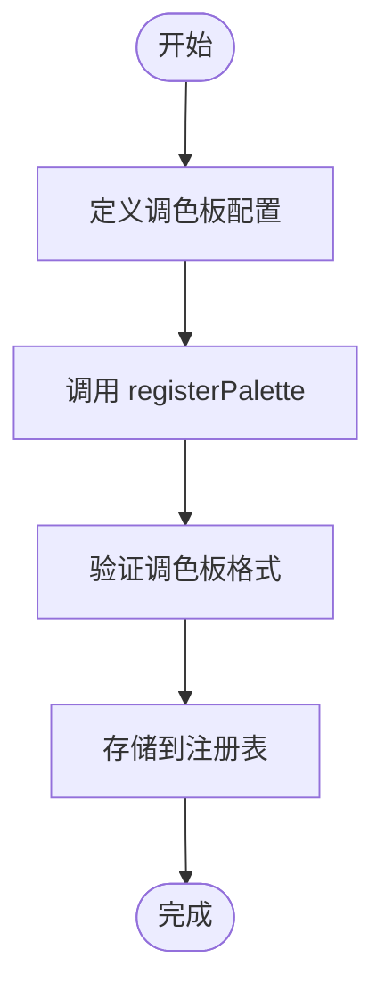
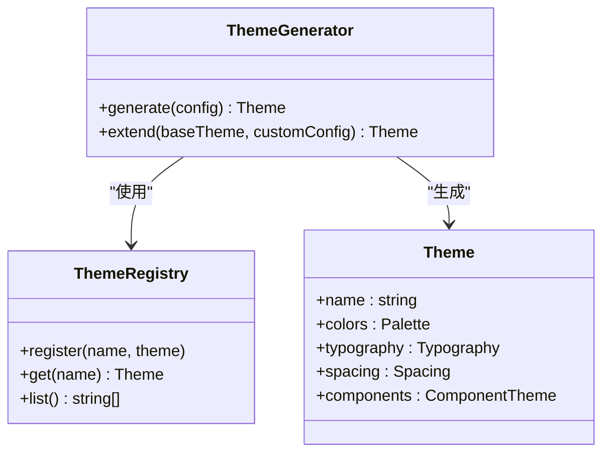
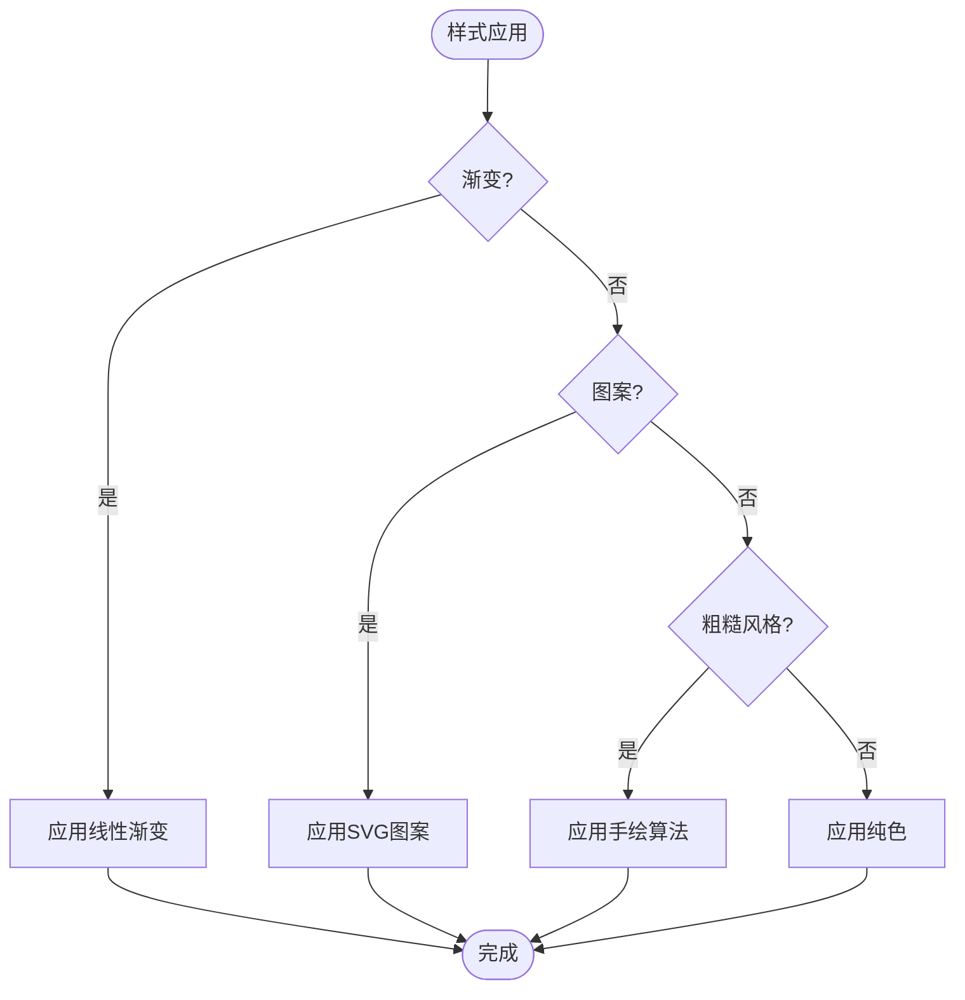
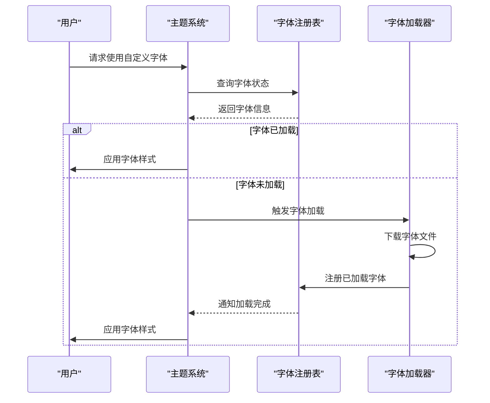

# 样式与主题

<cite>
**本文档中引用的文件**  
- [built-in.ts](file://antv_infographic/infographic/src/themes/built-in.ts)
- [generator.ts](file://antv_infographic/infographic/src/themes/generator.ts)
- [registry.ts](file://antv_infographic/infographic/src/renderer/palettes/registry.ts)
- [built-in.ts](file://antv_infographic/infographic/src/renderer/palettes/built-in.ts)
- [index.ts](file://antv_infographic/infographic/src/renderer/palettes/index.ts)
- [font.ts](file://antv_infographic/infographic/src/renderer/fonts/index.ts)
- [registry.ts](file://antv_infographic/infographic/src/renderer/fonts/registry.ts)
- [types.ts](file://antv_infographic/infographic/src/types/font.ts)
- [stylize.ts](file://antv_infographic/infographic/src/renderer/stylize/index.ts)
- [utils/color.ts](file://antv_infographic/infographic/src/utils/color.ts)
</cite>

## 目录
1. [引言](#引言)
2. [调色板系统](#调色板系统)
3. [主题系统](#主题系统)
4. [样式化功能](#样式化功能)
5. [字体系统](#字体系统)
6. [最佳实践](#最佳实践)
7. [常见问题与解决方案](#常见问题与解决方案)
8. [总结](#总结)

## 引言

AntV Infographic 是一个用于创建信息图表的可视化库，其样式与主题系统为用户提供了高度的定制化能力。本文档系统化地介绍 AntV Infographic 的样式定制和主题系统，涵盖调色板、主题生成、样式化功能（如渐变、图案填充、粗糙草图风格）以及字体管理机制。通过本文档，开发者可以全面了解如何自定义和扩展 Infographic 的视觉表现。

## 调色板系统

调色板（Palettes）是 Infographic 中用于管理颜色方案的核心机制。系统通过调色板注册表统一管理内置和自定义调色板，支持动态注册和切换。

### 内置调色板

Infographic 提供了多种内置调色板，涵盖常见的设计需求。这些调色板在 `src/renderer/palettes/built-in.ts` 中定义，包括但不限于：

- **基础调色板**：提供标准的颜色组合
- **渐变调色板**：支持平滑的颜色过渡
- **对比调色板**：用于强调对比效果

调色板以命名的方式组织，便于在主题配置中引用。

### 自定义调色板注册

开发者可以通过 `registerPalette` 方法注册自定义调色板。注册过程包括：

1. 定义调色板名称
2. 提供颜色数组或生成函数
3. 注册到全局调色板注册表

**Diagram sources**
- [registry.ts](file://antv_infographic/infographic/src/renderer/palettes/registry.ts)

**Section sources**
- [registry.ts](file://antv_infographic/infographic/src/renderer/palettes/registry.ts)
- [built-in.ts](file://antv_infographic/infographic/src/renderer/palettes/built-in.ts)

## 主题系统

主题（Themes）是 Infographic 中控制整体视觉风格的高级配置系统。主题系统通过生成器模式动态创建主题配置，并支持灵活的继承和覆盖机制。

### 主题生成机制

主题生成器（Theme Generator）位于 `src/themes/generator.ts`，负责根据基础配置和调色板生成完整的主题对象。生成过程包括：

- 解析基础主题配置
- 应用调色板颜色
- 合并自定义样式规则
- 生成最终的主题对象

### 内置主题配置

内置主题在 `src/themes/built-in.ts` 中定义，包含：

- **默认主题**：基础视觉风格
- **暗色主题**：适用于深色背景
- **高对比主题**：增强可访问性

每个主题包含完整的样式规则，如字体、间距、边框等。

### 自定义主题开发

自定义主题开发流程如下：

1. 创建主题配置对象
2. 指定基础主题（可选继承）
3. 定义调色板引用
4. 注册主题

**Diagram sources**
- [generator.ts](file://antv_infographic/infographic/src/themes/generator.ts)
- [built-in.ts](file://antv_infographic/infographic/src/themes/built-in.ts)

**Section sources**
- [generator.ts](file://antv_infographic/infographic/src/themes/generator.ts)
- [built-in.ts](file://antv_infographic/infographic/src/themes/built-in.ts)

## 样式化功能

Infographic 提供了丰富的样式化功能，支持创建视觉上丰富的信息图表。

### 渐变（Gradient）

渐变功能通过 SVG 线性渐变实现，支持：

- 多色停止点配置
- 角度控制
- 透明度渐变

渐变定义在 `src/renderer/stylize` 模块中，通过样式处理器应用到图形元素。

### 图案填充（Patterns）

支持多种图案填充类型：

- **点状（dot）**：均匀分布的圆点
- **六边形（hex）**：蜂窝状图案
- **线条（line）**：平行线填充

图案通过 SVG `<pattern>` 元素实现，可自定义大小、间距和颜色。

### 粗糙草图风格（Rough）

粗糙草图风格模拟手绘效果，特点包括：

- 边缘抖动
- 线条不规则
- 填充纹理

该风格通过算法生成近似手绘的路径，增强图表的亲和力。

**Diagram sources**
- [stylize.ts](file://antv_infographic/infographic/src/renderer/stylize/index.ts)

**Section sources**
- [stylize.ts](file://antv_infographic/infographic/src/renderer/stylize/index.ts)

## 字体系统

Infographic 的字体系统支持动态加载和注册自定义字体，确保跨平台一致性。

### 字体加载与注册

字体管理主要在 `src/renderer/fonts` 模块中实现：

1. **字体定义**：通过字体配置对象定义字体属性
2. **字体注册**：使用 `registerFont` 方法注册字体
3. **字体加载**：异步加载字体文件并准备使用

### 字体使用机制

在主题或组件中通过字体名称引用已注册的字体。系统会自动处理字体加载状态，确保渲染时字体可用。

**Diagram sources**
- [font.ts](file://antv_infographic/infographic/src/renderer/fonts/index.ts)
- [registry.ts](file://antv_infographic/infographic/src/renderer/fonts/registry.ts)

**Section sources**
- [font.ts](file://antv_infographic/infographic/src/renderer/fonts/index.ts)
- [registry.ts](file://antv_infographic/infographic/src/renderer/fonts/registry.ts)
- [types.ts](file://antv_infographic/infographic/src/types/font.ts)

## 最佳实践

### 主题切换

主题切换应通过主题管理器进行，避免直接修改样式属性：

1. 预加载所有可能使用的主题
2. 使用事务性切换确保视觉一致性
3. 提供过渡动画提升用户体验

### 样式覆盖

样式覆盖应遵循层级原则：

- 基础主题 < 调色板 < 组件主题 < 实例样式
- 使用 CSS 变量增强可维护性
- 避免 !important 规则

## 常见问题与解决方案

### 样式丢失

**问题原因**：
- 主题未正确注册
- 调色板引用错误
- 样式作用域冲突

**解决方案**：
1. 检查主题注册状态
2. 验证调色板名称拼写
3. 使用开发者工具检查实际应用的样式

### 字体加载失败

**问题原因**：
- 字体文件路径错误
- 跨域限制
- 字体格式不支持

**解决方案**：
1. 验证字体文件 URL 可访问性
2. 配置正确的 CORS 头
3. 提供多种字体格式备选

## 总结

AntV Infographic 的样式与主题系统提供了完整的视觉定制解决方案。通过调色板、主题、样式化功能和字体系统的协同工作，开发者可以创建高度个性化的信息图表。建议在实际使用中遵循最佳实践，合理组织主题和样式配置，以确保系统的可维护性和性能表现。