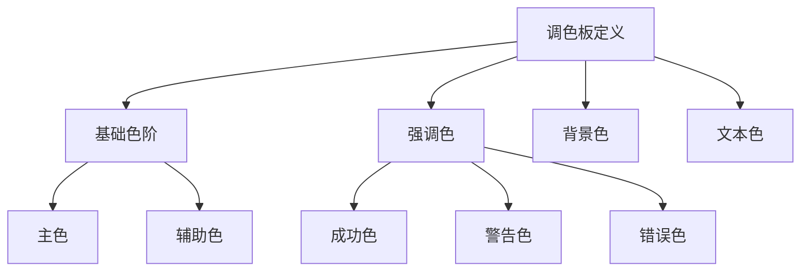
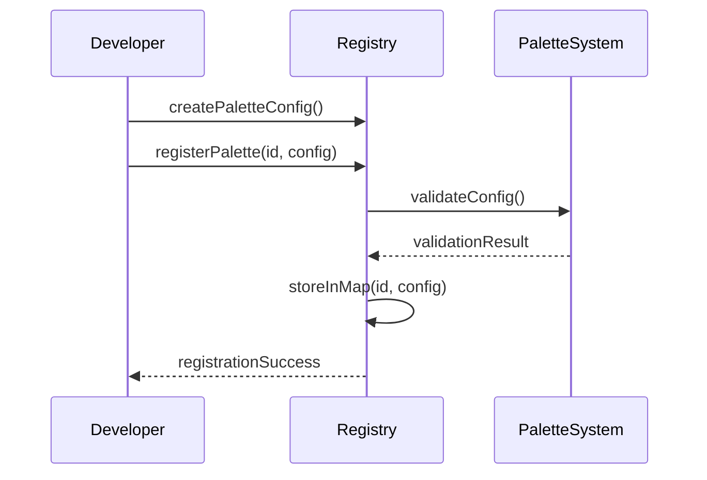
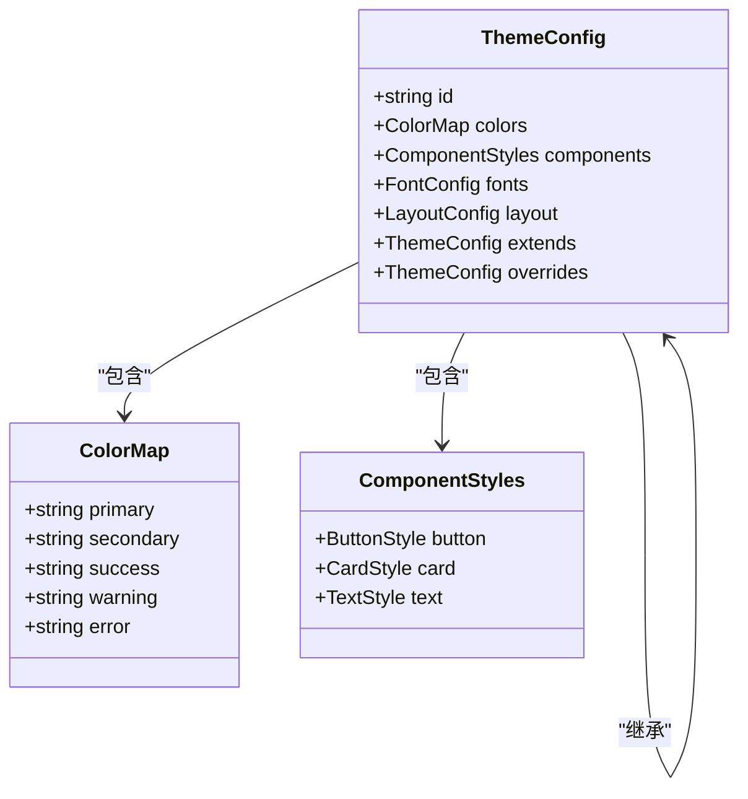
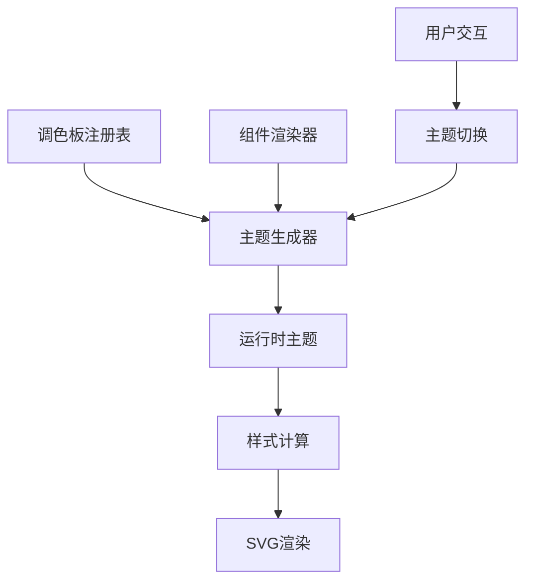

# 调色板与主题

<cite>
**本文档引用的文件**  
- [built-in.ts](file://antv_infographic\infographic\src\themes\built-in.ts)
- [generator.ts](file://antv_infographic\infographic\src\themes\generator.ts)
- [registry.ts](file://antv_infographic\infographic\src\renderer\palettes\registry.ts)
- [types.ts](file://antv_infographic\infographic\src\themes\types.ts)
- [palettes\built-in.ts](file://antv_infographic\infographic\src\renderer\palettes\built-in.ts)
</cite>

## 目录
1. [引言](#引言)
2. [调色板系统](#调色板系统)
3. [内置调色板实现](#内置调色板实现)
4. [自定义调色板注册](#自定义调色板注册)
5. [主题生成机制](#主题生成机制)
6. [内置主题配置](#内置主题配置)
7. [自定义主题开发](#自定义主题开发)
8. [调色板与主题的关联](#调色板与主题的关联)
9. [主题动态管理最佳实践](#主题动态管理最佳实践)
10. [常见问题排查](#常见问题排查)

## 引言
AntV Infographic 提供了一套完整的视觉设计系统，其中调色板（Palettes）与主题（Themes）是核心组成部分。本系统通过结构化的配置和灵活的注册机制，实现了图表视觉样式的统一管理和动态切换。调色板负责定义颜色集合，而主题则在此基础上扩展出完整的样式规则，包括组件样式、字体、间距等。本文档将系统化地说明这两个系统的实现原理和使用方法。

## 调色板系统
调色板系统是AntV Infographic视觉设计的基础，它定义了颜色的组织结构和使用规范。调色板采用分层设计，支持基础色、语义色和状态色的分类管理。每个调色板由唯一的标识符（ID）进行注册，便于在运行时动态引用。系统通过中心化的注册表（Registry）管理所有可用的调色板实例，确保全局一致性。

**Section sources**
- [registry.ts](file://antv_infographic\infographic\src\renderer\palettes\registry.ts#L1-L50)
- [types.ts](file://antv_infographic\infographic\src\themes\types.ts#L1-L30)

## 内置调色板实现
内置调色板在`src/renderer/palettes/built-in.ts`文件中定义，采用模块化的方式组织。每个调色板以常量对象的形式导出，遵循统一的接口规范。调色板对象包含基础色阶（base）、强调色（accent）、背景色（background）等属性，支持深色和浅色模式的配置。颜色值采用十六进制格式，确保跨平台兼容性。

**Diagram sources**
- [palettes\built-in.ts](file://antv_infographic\infographic\src\renderer\palettes\built-in.ts#L1-L100)

**Section sources**
- [palettes\built-in.ts](file://antv_infographic\infographic\src\renderer\palettes\built-in.ts#L1-L120)

## 自定义调色板注册
自定义调色板通过`registry.ts`提供的API进行注册。开发者需要创建符合`Palette`接口的配置对象，然后调用`registerPalette(id, palette)`方法将其注入系统。注册过程支持覆盖现有调色板，便于主题定制。注册表采用单例模式，确保在整个应用生命周期内调色板配置的一致性。

**Diagram sources**
- [registry.ts](file://antv_infographic\infographic\src\renderer\palettes\registry.ts#L20-L60)

**Section sources**
- [registry.ts](file://antv_infographic\infographic\src\renderer\palettes\registry.ts#L15-L80)

## 主题生成机制
主题生成器（Theme Generator）位于`src/themes/generator.ts`，负责将基础配置转换为完整的运行时主题。生成过程包含三个阶段：继承（Inheritance）、覆盖（Override）和解析（Resolution）。系统首先加载基础主题，然后应用用户自定义配置进行覆盖，最后解析所有动态变量和引用，生成最终的主题对象。

**Diagram sources**
- [generator.ts](file://antv_infographic\infographic\src\themes\generator.ts#L10-L40)

**Section sources**
- [generator.ts](file://antv_infographic\infographic\src\themes\generator.ts#L1-L100)

## 内置主题配置
内置主题在`src/themes/built-in.ts`中定义，采用分层继承结构。每个主题配置包含颜色映射、组件样式规则、字体设置和布局参数。主题配置支持条件表达式，可根据设备类型或用户偏好自动调整样式。配置格式遵循JSON Schema规范，便于验证和工具支持。

**Section sources**
- [built-in.ts](file://antv_infographic\infographic\src\themes\built-in.ts#L1-L150)

## 自定义主题开发
创建自定义主题需要遵循标准开发流程：首先定义颜色映射关系，然后编写组件样式规则，最后通过主题注册API注入系统。开发者可以继承现有主题并进行局部覆盖，或从零开始创建全新主题。主题变量支持嵌套引用和计算表达式，提供强大的样式定制能力。

**Diagram sources**
- [types.ts](file://antv_infographic\infographic\src\themes\types.ts#L10-L50)
- [built-in.ts](file://antv_infographic\infographic\src\themes\built-in.ts#L20-L80)

**Section sources**
- [types.ts](file://antv_infographic\infographic\src\themes\types.ts#L1-L100)
- [built-in.ts](file://antv_infographic\infographic\src\themes\built-in.ts#L1-L200)

## 调色板与主题的关联
调色板与主题通过运行时解析系统建立关联。主题配置中的颜色引用指向特定调色板的色值，形成动态绑定关系。在渲染管线中，主题系统优先于调色板被加载，确保样式规则的完整性。这种设计实现了颜色与样式的解耦，支持独立更新和热替换。

**Diagram sources**
- [generator.ts](file://antv_infographic\infographic\src\themes\generator.ts#L15-L35)
- [registry.ts](file://antv_infographic\infographic\src\renderer\palettes\registry.ts#L10-L25)

**Section sources**
- [generator.ts](file://antv_infographic\infographic\src\themes\generator.ts#L1-L120)
- [registry.ts](file://antv_infographic\infographic\src\renderer\palettes\registry.ts#L1-L60)

## 主题动态管理最佳实践
主题动态管理推荐采用按需加载策略，避免初始包体积过大。通过异步加载和缓存机制，实现主题的平滑切换。热更新时应保留当前状态，仅替换样式相关配置。建议使用主题预览功能，在应用变更前验证视觉效果。对于多主题应用，推荐建立主题版本控制系统。

**Section sources**
- [generator.ts](file://antv_infographic\infographic\src\themes\generator.ts#L50-L100)
- [built-in.ts](file://antv_infographic\infographic\src\themes\built-in.ts#L100-L150)

## 常见问题排查
常见问题包括主题未生效、颜色错乱等。排查时应首先检查调色板注册状态，确认ID匹配。其次验证主题配置的继承链是否完整，避免断层。对于颜色错乱问题，需检查变量解析上下文和作用域。建议启用调试模式，查看运行时主题对象的实际结构。

**Section sources**
- [generator.ts](file://antv_infographic\infographic\src\themes\generator.ts#L80-L120)
- [registry.ts](file://antv_infographic\infographic\src\renderer\palettes\registry.ts#L40-L60)