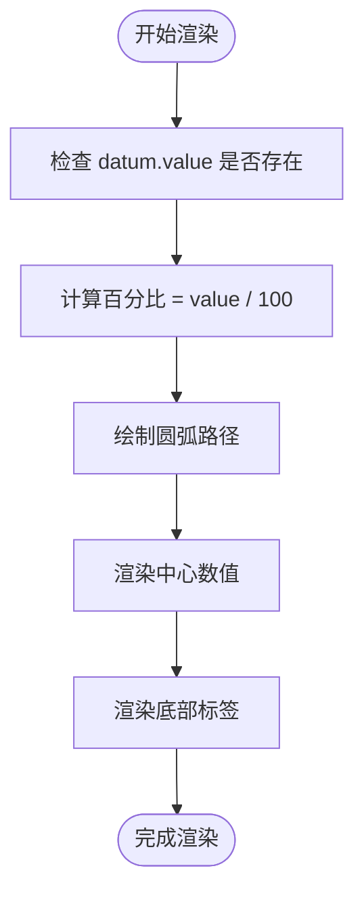
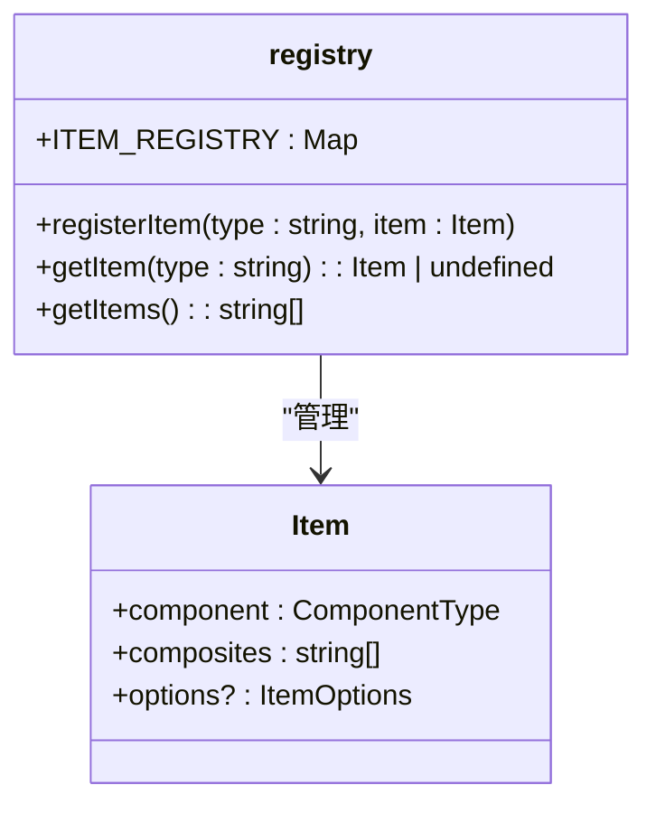
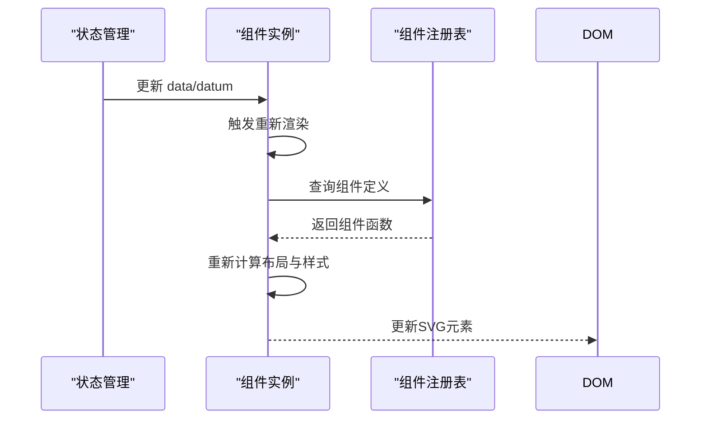
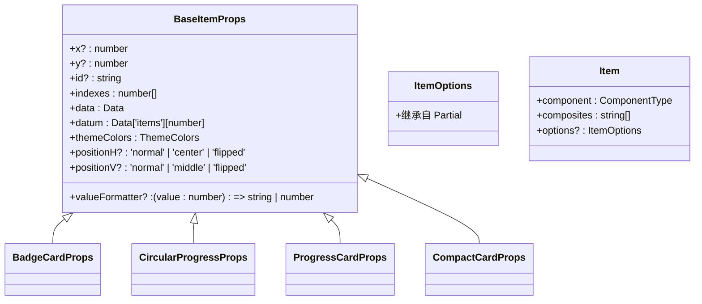

# 信息项组件

<cite>
**本文档引用的文件**  
- [BadgeCard.tsx](file://antv_infographic\infographic\src\designs\items\BadgeCard.tsx)
- [CircularProgress.tsx](file://antv_infographic\infographic\src\designs\items\CircularProgress.tsx)
- [ProgressCard.tsx](file://antv_infographic\infographic\src\designs\items\ProgressCard.tsx)
- [CompactCard.tsx](file://antv_infographic\infographic\src\designs\items\CompactCard.tsx)
- [types.ts](file://antv_infographic\infographic\src\designs\items\types.ts)
- [registry.ts](file://antv_infographic\infographic\src\designs\items\registry.ts)
- [index.ts](file://antv_infographic\infographic\src\designs\items\index.ts)
</cite>

## 目录
1. [简介](#简介)
2. [核心组件属性与数据绑定](#核心组件属性与数据绑定)
3. [组件注册机制](#组件注册机制)
4. [JSX中动态数据渲染示例](#jsx中动态数据渲染示例)
5. [类型系统约束](#类型系统约束)
6. [常见问题排查](#常见问题排查)
7. [性能优化建议](#性能优化建议)

## 简介
本文档全面介绍信息项组件系统，涵盖 `BadgeCard`、`CircularProgress`、`ProgressCard` 和 `CompactCard` 等常用数据展示组件。详细说明各组件的属性定义、数据绑定方式及视觉表现，重点解析组件注册机制如何实现动态加载与扩展，并提供在JSX中使用这些组件渲染动态数据的完整示例。同时解释类型系统对组件配置的约束作用，针对常见问题如进度条不更新、卡片布局错乱提供排查步骤，并建议批量渲染时的性能优化策略。

## 核心组件属性与数据绑定

### BadgeCard 组件
`BadgeCard` 是一种带有徽章图标的卡片组件，适用于展示带图标的指标数据。

**属性定义：**
- `width`: 卡片宽度，默认 200
- `height`: 卡片高度，默认 80
- `iconSize`: 图标大小，默认 24
- `badgeSize`: 徽章尺寸，默认 32
- `gap`: 间距，默认 8
- `positionH`: 水平位置（'normal' | 'center' | 'flipped'）

**数据绑定：**
通过 `datum` 属性绑定单个数据项，包含 `label`、`value`、`desc` 和 `icon` 字段。使用 `valueFormatter` 可自定义数值显示格式。

**视觉表现：**
左侧为圆形徽章图标，右侧为标签和数值内容区，底部可选描述文本。背景采用圆角矩形设计，徽章使用径向渐变增强视觉层次。

**Section sources**
- [BadgeCard.tsx](file://antv_infographic\infographic\src\designs\items\BadgeCard.tsx#L9-L169)

### CircularProgress 组件
`CircularProgress` 是圆形进度条组件，用于可视化百分比或完成度。

**属性定义：**
- `size`: 整体尺寸，默认 120
- `strokeWidth`: 进度环线宽，默认 12
- `gap`: 上下元素间距，默认 8

**数据绑定：**
基于 `datum.value` 计算进度百分比（最大值为100），自动格式化为百分比形式。可通过 `valueFormatter` 自定义显示。

**视觉表现：**
中心显示当前数值，外圈为进度环，底部显示标签。进度环使用SVG路径动态绘制，支持平滑过渡动画。



**Diagram sources**
- [CircularProgress.tsx](file://antv_infographic\infographic\src\designs\items\CircularProgress.tsx#L7-L129)

**Section sources**
- [CircularProgress.tsx](file://antv_infographic\infographic\src\designs\items\CircularProgress.tsx#L7-L129)

### ProgressCard 组件
`ProgressCard` 是包含进度条的完整卡片组件，适合展示任务进度或指标达成情况。

**属性定义：**
- `width`: 宽度，默认 280
- `height`: 高度，默认 120
- `progressHeight`: 进度条高度，默认 8
- `borderRadius`: 圆角半径，默认 12

**数据绑定：**
从 `datum.value` 获取当前值，结合 `data.items` 中的最大值计算进度比例。支持跨数据项比较。

**视觉表现：**
顶部为图标、标签和数值，底部为线性进度条。进度条使用线性渐变填充，背景有轻微对比色区分。

**Section sources**
- [ProgressCard.tsx](file://antv_infographic\infographic\src\designs\items\ProgressCard.tsx#L9-L195)

### CompactCard 组件
`CompactCard` 是紧凑型卡片，适用于空间受限的布局场景。

**属性定义：**
- `width`: 宽度，默认 200
- `height`: 高度，默认 60
- `iconSize`: 图标大小，默认 20

**数据绑定：**
与 `BadgeCard` 类似，通过 `datum` 绑定数据，支持 `label`、`value` 和 `desc`。

**视觉表现：**
左侧有细色条标识，图标居中对齐，右侧为标签与数值并排布局，描述文本位于第二行。整体轻量化设计，带阴影提升层次感。

**Section sources**
- [CompactCard.tsx](file://antv_infographic\infographic\src\designs\items\CompactCard.tsx#L8-L149)

## 组件注册机制

### 动态加载与扩展原理
组件注册机制通过 `registry.ts` 实现，采用单例模式的 `Map` 存储组件映射关系。



**Diagram sources**
- [registry.ts](file://antv_infographic\infographic\src\designs\items\registry.ts#L1-L16)

**Section sources**
- [registry.ts](file://antv_infographic\infographic\src\designs\items\registry.ts#L1-L16)

### 注册流程
1. 组件定义后调用 `registerItem(type, config)`
2. 将组件配置存入全局 `ITEM_REGISTRY` 映射表
3. 运行时通过 `getItem(type)` 动态获取组件

### 扩展方式
开发者可定义新组件并注册，系统自动识别并支持在JSX中使用该类型。

## JSX中动态数据渲染示例

### 基本使用模式
```jsx
// 数据结构示例
const data = {
  items: [
    { label: '销售额', value: 85, desc: '同比增长12%', icon: 'sales' },
    { label: '用户数', value: 92, desc: '活跃用户占比', icon: 'user' }
  ]
};

// JSX 渲染
<Infographic data={data}>
  <ProgressCard indexes={[0]} />
  <ProgressCard indexes={[1]} />
</Infographic>
```

### 状态管理与更新
通过响应式数据绑定实现自动更新：



**Diagram sources**
- [index.ts](file://antv_infographic\infographic\src\designs\items\index.ts#L1-L30)
- [registry.ts](file://antv_infographic\infographic\src\designs\items\registry.ts#L1-L16)

**Section sources**
- [index.ts](file://antv_infographic\infographic\src\designs\items\index.ts#L1-L30)

## 类型系统约束

### 基础类型定义
`types.ts` 文件定义了统一的类型接口：



**Diagram sources**
- [types.ts](file://antv_infographic\infographic\src\designs\items\types.ts#L5-L27)

**Section sources**
- [types.ts](file://antv_infographic\infographic\src\designs\items\types.ts#L5-L27)

### 类型约束作用
- 确保所有组件具有一致的基础属性
- 提供类型安全的属性校验
- 支持IDE智能提示与编译时检查
- 通过泛型 `T extends BaseItemProps` 实现组件特有属性扩展

## 常见问题排查

### 进度条不更新
**可能原因：**
1. `datum.value` 未正确绑定或为 `undefined`
2. 数据未触发重新渲染
3. `maxValue` 计算错误导致比例异常

**排查步骤：**
1. 检查 `datum.value` 是否存在且为数字
2. 确认父级数据变化是否传递到组件
3. 验证 `data.items` 中最大值计算逻辑
4. 使用开发者工具检查组件 props 是否更新

### 卡片布局错乱
**可能原因：**
1. `width`/`height` 设置不合理
2. `positionH` 与实际布局冲突
3. 字体或图标资源加载失败
4. CSS 样式干扰（若存在）

**排查步骤：**
1. 检查组件尺寸是否适配容器
2. 验证 `gap` 间距设置是否一致
3. 确认 `themeColors` 主题颜色正确注入
4. 查看控制台是否有SVG渲染错误

**Section sources**
- [BadgeCard.tsx](file://antv_infographic\infographic\src\designs\items\BadgeCard.tsx#L9-L169)
- [ProgressCard.tsx](file://antv_infographic\infographic\src\designs\items\ProgressCard.tsx#L9-L195)
- [CompactCard.tsx](file://antv_infographic\infographic\src\designs\items\CompactCard.tsx#L8-L149)

## 性能优化建议

### 批量渲染优化策略
1. **虚拟滚动**：对于大量组件，仅渲染可视区域内的实例
2. **防抖更新**：高频数据更新时使用防抖机制减少重渲染
3. **静态属性缓存**：将不变的配置对象提取为常量
4. **懒加载**：非首屏组件延迟初始化

### SVG渲染优化
1. 复用渐变定义（`<Defs>`）
2. 避免频繁创建/销毁SVG元素
3. 使用 `data-element-type` 标记关键元素便于调试
4. 合理使用 `transform` 替代位置重计算

### 组件设计建议
- 优先使用 `React.memo` 或类似机制避免不必要的重渲染
- 复杂计算逻辑移出渲染函数
- 利用 `getItemProps` 统一处理默认值与属性提取