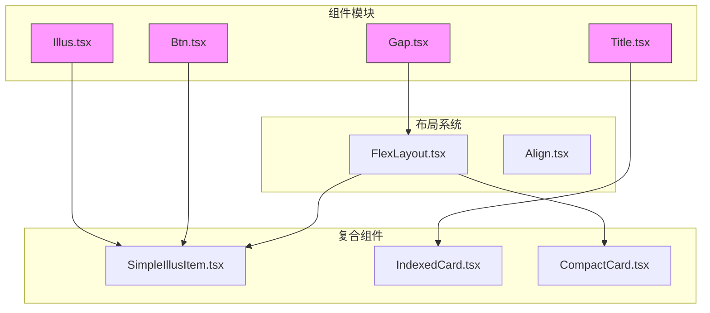
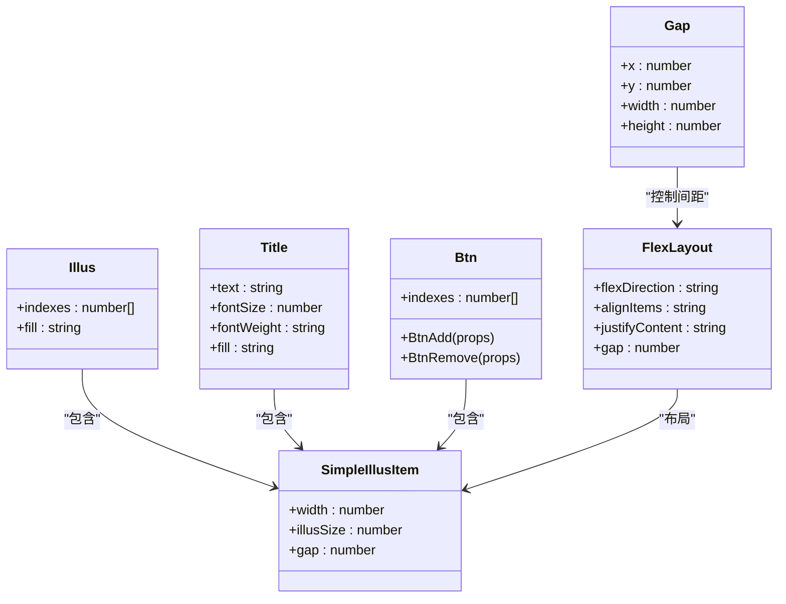
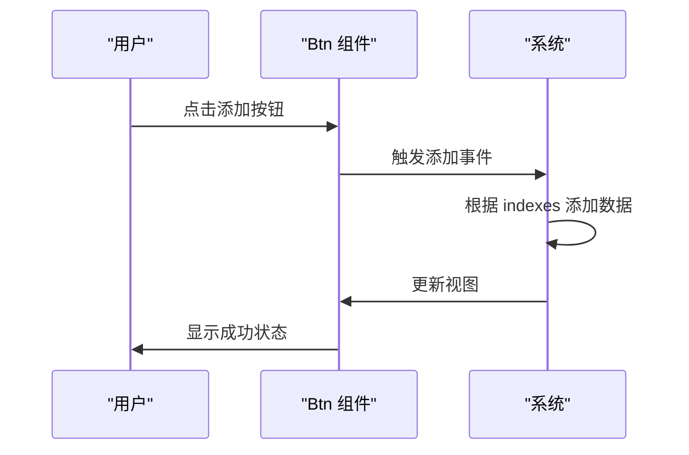
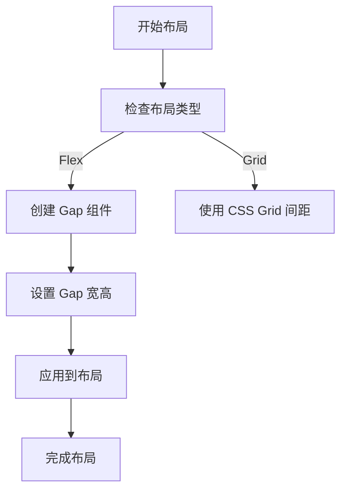
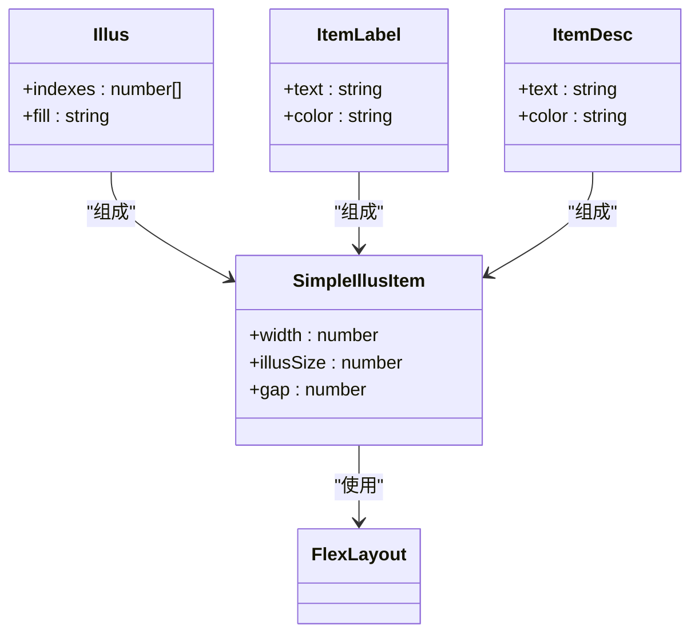
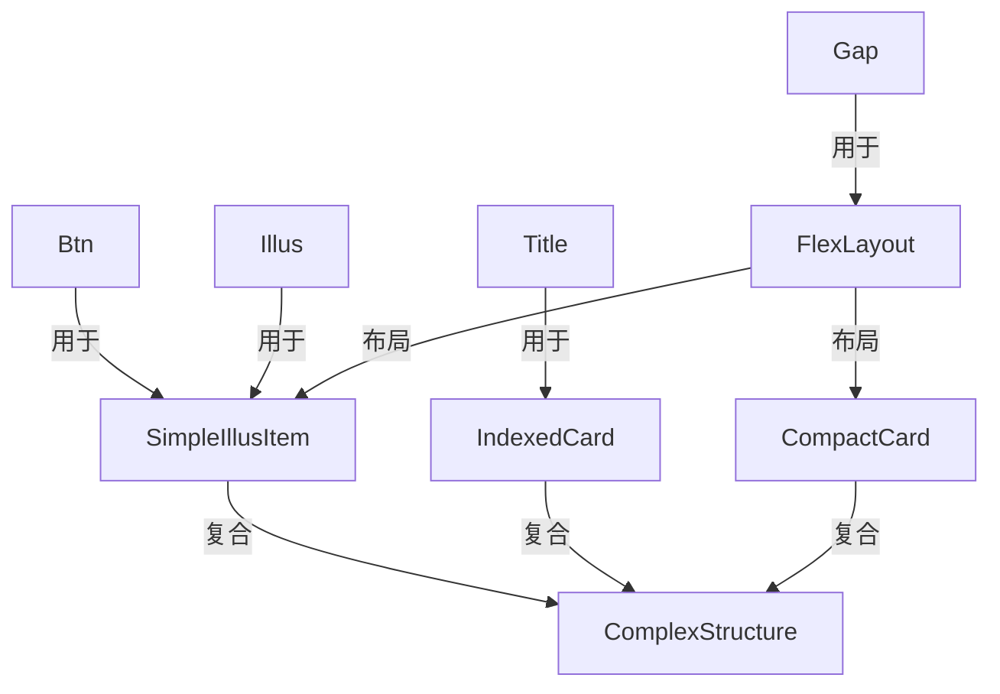

# 基础组件

<cite>
**本文档中引用的文件**  
- [Btn.tsx](file://antv_infographic/infographic/src/designs/components/Btn.tsx)
- [Title.tsx](file://antv_infographic/infographic/src/designs/components/Title.tsx)
- [Gap.tsx](file://antv_infographic/infographic/src/designs/components/Gap.tsx)
- [Illus.tsx](file://antv_infographic/infographic/src/designs/components/Illus.tsx)
- [SimpleIllusItem.tsx](file://antv_infographic/infographic/src/designs/items/SimpleIllusItem.tsx)
- [Btn.d.ts](file://antv_infographic/infographic/esm/designs/components/Btn.d.ts)
- [Title.d.ts](file://antv_infographic/infographic/esm/designs/components/Title.d.ts)
- [Gap.d.ts](file://antv_infographic/infographic/esm/designs/components/Gap.d.ts)
- [Illus.d.ts](file://antv_infographic/infographic/esm/designs/components/Illus.d.ts)
</cite>

## 目录
1. [简介](#简介)
2. [项目结构](#项目结构)
3. [核心组件](#核心组件)
4. [架构概述](#架构概述)
5. [详细组件分析](#详细组件分析)
6. [依赖分析](#依赖分析)
7. [性能考虑](#性能考虑)
8. [故障排除指南](#故障排除指南)
9. [结论](#结论)

## 简介
本文档详细记录了 AntV Infographic 中的四个基础组件：Btn、Title、Gap 和 Illus。这些组件在信息图布局中扮演着关键角色，分别用于交互按钮、标题展示、间距控制和插图嵌入。文档将解释每个组件的用途、属性接口、使用方式、响应式行为和可访问性支持，并提供常见问题的解决方案及性能优化建议。

## 项目结构
AntV Infographic 项目采用模块化设计，基础组件位于 `src/designs/components` 目录下。这些组件作为构建更复杂信息图的原子单元，被更高层级的结构和项目组件所复用。



**图源**
- [Btn.tsx](file://antv_infographic/infographic/src/designs/components/Btn.tsx)
- [Title.tsx](file://antv_infographic/infographic/src/designs/components/Title.tsx)
- [Gap.tsx](file://antv_infographic/infographic/src/designs/components/Gap.tsx)
- [Illus.tsx](file://antv_infographic/infographic/src/designs/components/Illus.tsx)
- [SimpleIllusItem.tsx](file://antv_infographic/infographic/src/designs/items/SimpleIllusItem.tsx)

**节源**
- [Btn.tsx](file://antv_infographic/infographic/src/designs/components/Btn.tsx)
- [Title.tsx](file://antv_infographic/infographic/src/designs/components/Title.tsx)
- [Gap.tsx](file://antv_infographic/infographic/src/designs/components/Gap.tsx)
- [Illus.tsx](file://antv_infographic/infographic/src/designs/components/Illus.tsx)

## 核心组件
本节详细分析 Btn、Title、Gap 和 Illus 四个基础组件的实现和用途。

**节源**
- [Btn.tsx](file://antv_infographic/infographic/src/designs/components/Btn.tsx)
- [Title.tsx](file://antv_infographic/infographic/src/designs/components/Title.tsx)
- [Gap.tsx](file://antv_infographic/infographic/src/designs/components/Gap.tsx)
- [Illus.tsx](file://antv_infographic/infographic/src/designs/components/Illus.tsx)

## 架构概述
AntV Infographic 的基础组件架构遵循原子设计原则，将 UI 分解为可复用的原子单元。Btn、Title、Gap、Illus 作为原子组件，通过组合形成分子（如 SimpleIllusItem），再构成更复杂的有机体。



**图源**
- [Btn.tsx](file://antv_infographic/infographic/src/designs/components/Btn.tsx)
- [Title.tsx](file://antv_infographic/infographic/src/designs/components/Title.tsx)
- [Gap.tsx](file://antv_infographic/infographic/src/designs/components/Gap.tsx)
- [Illus.tsx](file://antv_infographic/infographic/src/designs/components/Illus.tsx)
- [SimpleIllusItem.tsx](file://antv_infographic/infographic/src/designs/items/SimpleIllusItem.tsx)

## 详细组件分析
本节对每个基础组件进行深入分析，包括其属性接口、使用方式和在信息图中的作用。

### Btn 组件分析
Btn 组件用于创建交互式按钮，通常用于添加或删除操作。

#### 属性接口
| 属性 | 类型 | 默认值 | 描述 |
|------|------|--------|------|
| indexes | number[] | 必需 | 数据索引，用于标识按钮关联的数据 |
| width | number | 20 | 按钮宽度 |
| height | number | 20 | 按钮高度 |
| fill | string | #B9EBCA (添加) / #F9C0C0 (删除) | 按钮填充色 |
| fillOpacity | number | 0.3 | 填充透明度 |

#### 使用方式
```jsx
<BtnAdd indexes={[0, 1]} width={24} height={24} />
<BtnRemove indexes={[0, 1]} fill="#FF0000" />
```

#### 在信息图中的作用
- **交互按钮**：提供用户与信息图交互的入口
- **数据绑定**：通过 `indexes` 属性与特定数据项关联
- **视觉反馈**：通过颜色区分添加和删除操作



**图源**
- [Btn.tsx](file://antv_infographic/infographic/src/designs/components/Btn.tsx)

**节源**
- [Btn.tsx](file://antv_infographic/infographic/src/designs/components/Btn.tsx)

### Title 组件分析
Title 组件用于展示信息图的标题内容。

#### 属性接口
Title 组件继承自 `RectProps`，具有矩形元素的所有属性，并可包含文本内容。

#### 使用方式
```jsx
<Title>信息图标题</Title>
```

#### 在信息图中的作用
- **标题展示**：作为信息图的主要标题
- **层级标识**：通过字体大小和粗细区分信息层级
- **布局锚点**：作为其他组件布局的参考点

**节源**
- [Title.tsx](file://antv_infographic/infographic/src/designs/components/Title.tsx)

### Gap 组件分析
Gap 组件是布局中的空白占位符，用于控制组件间的间距。

#### 属性接口
| 属性 | 类型 | 默认值 | 描述 |
|------|------|--------|------|
| x | number | 0 | X 方向偏移 |
| y | number | 0 | Y 方向偏移 |
| width | number | 0 | 间隙宽度 |
| height | number | 0 | 间隙高度 |

#### 使用方式
```jsx
<Gap width={16} />
```

#### 在信息图中的作用
- **间距控制**：在 FlexLayout 等布局组件中创建固定间距
- **响应式布局**：通过动态设置宽高实现自适应布局
- **视觉分隔**：在不同内容区块间创建视觉分隔



**图源**
- [Gap.tsx](file://antv_infographic/infographic/src/designs/components/Gap.tsx)

**节源**
- [Gap.tsx](file://antv_infographic/infographic/src/designs/components/Gap.tsx)

### Illus 组件分析
Illus 组件用于在信息图中嵌入插图。

#### 属性接口
| 属性 | 类型 | 默认值 | 描述 |
|------|------|--------|------|
| indexes | number[] | 可选 | 数据索引 |
| fill | string | lightgray | 填充色 |

#### 使用方式
```jsx
<Illus width={100} height={100} />
```

#### 在信息图中的作用
- **插图嵌入**：作为图像占位符或实际图像容器
- **数据可视化**：通过 `indexes` 与数据关联，实现数据驱动的插图
- **主题适配**：继承主题颜色，保持视觉一致性



**图源**
- [Illus.tsx](file://antv_infographic/infographic/src/designs/components/Illus.tsx)
- [SimpleIllusItem.tsx](file://antv_infographic/infographic/src/designs/items/SimpleIllusItem.tsx)

**节源**
- [Illus.tsx](file://antv_infographic/infographic/src/designs/components/Illus.tsx)

## 依赖分析
基础组件之间存在明确的依赖关系，它们共同构成了信息图的构建基石。



**图源**
- [Btn.tsx](file://antv_infographic/infographic/src/designs/components/Btn.tsx)
- [Title.tsx](file://antv_infographic/infographic/src/designs/components/Title.tsx)
- [Gap.tsx](file://antv_infographic/infographic/src/designs/components/Gap.tsx)
- [Illus.tsx](file://antv_infographic/infographic/src/designs/components/Illus.tsx)
- [SimpleIllusItem.tsx](file://antv_infographic/infographic/src/designs/items/SimpleIllusItem.tsx)

## 性能考虑
在使用基础组件时，应注意以下性能优化建议：

- **避免过度嵌套**：减少不必要的组件包装层级
- **合理使用 Gap**：避免创建过多小间隙组件，可合并为单个较大间隙
- **按需导入**：只导入实际使用的组件，减少包体积
- **虚拟化长列表**：在渲染大量组件时使用虚拟滚动技术

## 故障排除指南
针对常见问题提供解决方案：

**节源**
- [Btn.tsx](file://antv_infographic/infographic/src/designs/components/Btn.tsx)
- [Title.tsx](file://antv_infographic/infographic/src/designs/components/Title.tsx)

### 按钮点击无响应
**问题**：Btn 组件点击后无反应  
**解决方案**：
1. 检查是否正确绑定了事件处理器
2. 确认 `indexes` 属性是否正确设置
3. 验证父组件是否阻止了事件冒泡

### 标题截断
**问题**：Title 组件中文本被截断  
**解决方案**：
1. 增加容器宽度
2. 减小字体大小
3. 启用文本换行（如果支持）

## 结论
Btn、Title、Gap 和 Illus 是 AntV Infographic 的核心基础组件，它们为构建复杂信息图提供了必要的构建块。通过理解这些组件的属性、用途和相互关系，开发者可以更有效地创建美观且功能完整的数据可视化作品。建议在实际使用中遵循最佳实践，注意性能优化和可访问性支持。