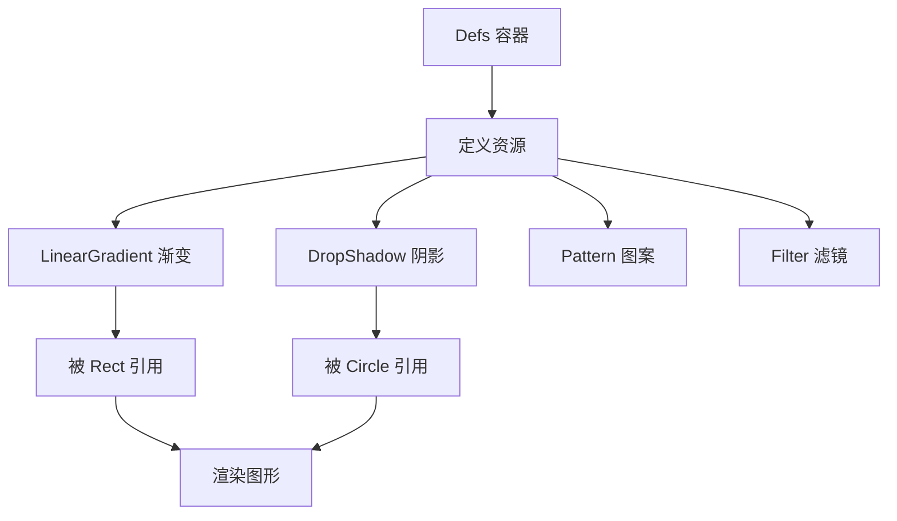
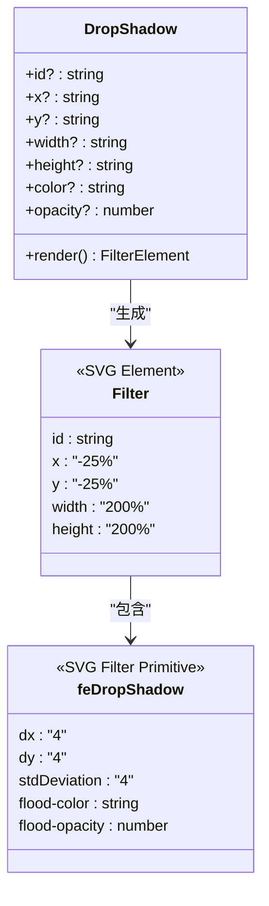
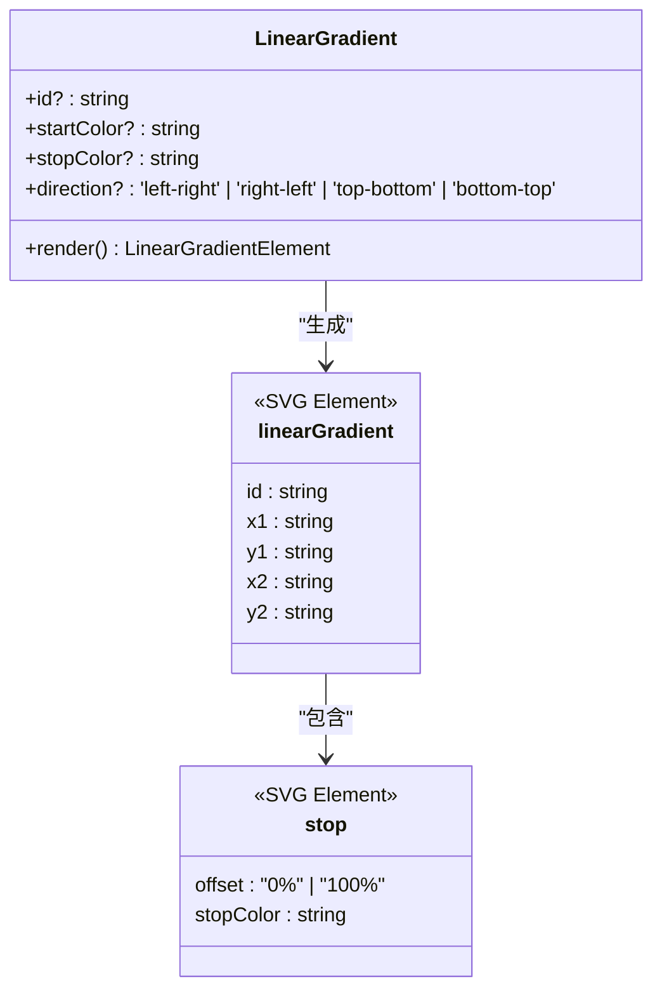
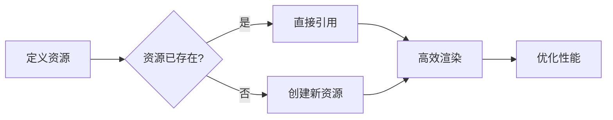

# 定义组件

<cite>
**本文档中引用的文件**  
- [DropShadow.tsx](file://antv_infographic/infographic/src/designs/defs/DropShadow.tsx)
- [LinearGradient.tsx](file://antv_infographic/infographic/src/designs/defs/LinearGradient.tsx)
- [PillBadge.tsx](file://antv_infographic/infographic/src/designs/items/PillBadge.tsx)
- [CapsuleItem.tsx](file://antv_infographic/infographic/src/designs/items/CapsuleItem.tsx)
- [defs.test.tsx](file://antv_infographic/infographic/__tests__/unit/jsx/defs.test.tsx)
</cite>

## 目录
1. [简介](#简介)
2. [Defs 容器的作用](#defs-容器的作用)
3. [DropShadow 组件](#dropshadow-组件)
4. [LinearGradient 组件](#lineargradient-组件)
5. [完整 JSX 使用示例](#完整-jsx-使用示例)
6. [属性配置详解](#属性配置详解)
7. [常见问题与调试方法](#常见问题与调试方法)
8. [资源复用与性能优化](#资源复用与性能优化)

## 简介
`Defs` 组件是 SVG 中用于定义可复用视觉效果资源的核心容器，它允许开发者在 SVG 文档中声明如阴影、渐变、图案等效果，并通过唯一的 ID 在其他图形元素中引用。本文档深入解析 `DropShadow` 和 `LinearGradient` 两个关键组件的实现机制与使用方式，帮助开发者高效创建具有专业视觉效果的信息图表。

## Defs 容器的作用
`Defs` 是一个特殊的 SVG 容器，用于存放不可直接渲染但可被引用的资源定义。所有在 `<Defs>` 标签内声明的资源（如渐变、阴影、图案等）不会直接显示在画布上，而是作为“资源库”供其他图形元素通过 `url(#id)` 的方式引用。

### 核心特性
- **声明式定义**：在 `Defs` 中预先定义视觉效果
- **资源复用**：同一资源可被多个图形元素引用
- **结构清晰**：将效果定义与图形绘制逻辑分离
- **性能优化**：避免重复定义相同效果



**Diagram sources**
- [defs.test.tsx](file://antv_infographic/infographic/__tests__/unit/jsx/defs.test.tsx#L6-L34)

**Section sources**
- [defs.test.tsx](file://antv_infographic/infographic/__tests__/unit/jsx/defs.test.tsx#L6-L34)

## DropShadow 组件
`DropShadow` 组件封装了 SVG 滤镜功能，用于为图形元素添加投影效果。它基于 `<filter>` 和 `<feDropShadow>` 元素实现，提供简洁的 API 来配置阴影的外观。

### 实现原理


**Diagram sources**
- [DropShadow.tsx](file://antv_infographic/infographic/src/designs/defs/DropShadow.tsx#L1-L31)

**Section sources**
- [DropShadow.tsx](file://antv_infographic/infographic/src/designs/defs/DropShadow.tsx#L1-L31)
- [CapsuleItem.tsx](file://antv_infographic/infographic/src/designs/items/CapsuleItem.tsx#L91-L93)

### 属性说明
- `id`：阴影资源的唯一标识符，用于引用
- `color`：阴影颜色，默认为 `black`
- `opacity`：阴影透明度，默认为 `0.8`
- `x`, `y`, `width`, `height`：滤镜区域的坐标和尺寸（可选）

## LinearGradient 组件
`LinearGradient` 组件用于定义线性渐变填充效果，支持多种方向的渐变配置。它通过 `<linearGradient>` 和 `<stop>` 元素实现，提供直观的属性来控制渐变的起止颜色和方向。

### 实现原理


**Diagram sources**
- [LinearGradient.tsx](file://antv_infographic/infographic/src/designs/defs/LinearGradient.tsx#L1-L30)

**Section sources**
- [LinearGradient.tsx](file://antv_infographic/infographic/src/designs/defs/LinearGradient.tsx#L1-L30)
- [PillBadge.tsx](file://antv_infographic/infographic/src/designs/items/PillBadge.tsx#L60-L67)

### 属性说明
- `id`：渐变资源的唯一标识符
- `startColor`：渐变起始颜色，默认为 `black`
- `stopColor`：渐变结束颜色，默认为 `white`
- `direction`：渐变方向，支持 `left-right`、`right-left`、`top-bottom`、`bottom-top`

## 完整 JSX 使用示例
以下示例展示了如何在实际组件中使用 `Defs` 容器定义并应用 `DropShadow` 和 `LinearGradient` 效果：

```jsx
<Group>
  <Defs>
    {/* 定义带颜色的阴影 */}
    <DropShadow 
      id="primary-shadow" 
      color={themeColors.colorPrimary} 
    />
    {/* 定义顶部到底部的白色渐变 */}
    <LinearGradient
      id="white-gradient"
      startColor="#fff"
      stopColor="#ffffff33"
      direction="top-bottom"
    />
  </Defs>
  
  {/* 应用阴影效果 */}
  <Rect
    width={100}
    height={50}
    fill={themeColors.colorPrimaryBg}
    stroke={themeColors.colorPrimary}
    rx={25}
    filter="url(#primary-shadow)"
  />
  
  {/* 应用渐变效果 */}
  <Rect
    width={100}
    height={50}
    fill="url(#white-gradient)"
    opacity={0.7}
    rx={25}
  />
</Group>
```

**Section sources**
- [PillBadge.tsx](file://antv_infographic/infographic/src/designs/items/PillBadge.tsx#L55-L88)

## 属性配置详解
### DropShadow 属性配置
| 属性 | 类型 | 默认值 | 说明 |
|------|------|--------|------|
| `id` | string | "drop-shadow" | 资源唯一标识，用于 `url(#id)` 引用 |
| `color` | string | "black" | 阴影颜色，支持十六进制、RGB、颜色名称 |
| `opacity` | number | 0.8 | 阴影透明度，范围 0-1 |
| `dx` | number | 4 | X轴偏移量 |
| `dy` | number | 4 | Y轴偏移量 |
| `stdDeviation` | number | 4 | 模糊程度 |

### LinearGradient 属性配置
| 属性 | 类型 | 默认值 | 说明 |
|------|------|--------|------|
| `id` | string | "linear-gradient" | 资源唯一标识 |
| `startColor` | string | "black" | 渐变起始颜色 |
| `stopColor` | string | "white" | 渐变结束颜色 |
| `direction` | enum | "left-right" | 渐变方向：<br/>`left-right`：左到右<br/>`right-left`：右到左<br/>`top-bottom`：上到下<br/>`bottom-top`：下到上 |

**Section sources**
- [DropShadow.tsx](file://antv_infographic/infographic/src/designs/defs/DropShadow.tsx#L1-L31)
- [LinearGradient.tsx](file://antv_infographic/infographic/src/designs/defs/LinearGradient.tsx#L1-L30)

## 常见问题与调试方法
### 渐变不显示
**可能原因**：
1. `id` 未正确引用，检查 `url(#id)` 中的 ID 是否匹配
2. `Defs` 容器未正确包裹，确保 `LinearGradient` 在 `Defs` 内部
3. 填充属性错误，应使用 `fill="url(#id)"` 而非 `fill="id"`

**调试方法**：
- 检查浏览器开发者工具中的 SVG 结构
- 确认 `linearGradient` 元素是否被正确生成
- 验证 `stop` 元素的颜色值是否有效

### 阴影失效
**可能原因**：
1. `filter` 属性未正确设置，应为 `filter="url(#id)"`
2. 滤镜区域过小，`DropShadow` 默认使用 `200%` 尺寸以确保覆盖
3. 图形层级问题，确保应用阴影的元素在正确层级

**调试方法**：
- 检查 `feDropShadow` 的 `flood-color` 和 `flood-opacity` 是否生效
- 尝试临时增大 `stdDeviation` 值以确认滤镜是否工作
- 验证 `filter` 属性是否被其他样式覆盖

**Section sources**
- [defs.test.tsx](file://antv_infographic/infographic/__tests__/unit/jsx/defs.test.tsx#L109-L134)
- [CapsuleItem.tsx](file://antv_infographic/infographic/src/designs/items/CapsuleItem.tsx#L91-L93)

## 资源复用与性能优化
### 资源复用优势
- **减少重复定义**：相同效果只需定义一次
- **降低文件体积**：避免在多个元素中重复写入相同 SVG 代码
- **便于维护**：修改一处定义即可更新所有引用处的效果

### 性能影响


**Diagram sources**
- [defs.test.tsx](file://antv_infographic/infographic/__tests__/unit/jsx/defs.test.tsx#L181-L225)

**Section sources**
- [defs.test.tsx](file://antv_infographic/infographic/__tests__/unit/jsx/defs.test.tsx#L181-L225)

通过合理使用 `Defs` 容器中的 `DropShadow` 和 `LinearGradient` 组件，不仅可以创建丰富的视觉效果，还能显著提升渲染性能和代码可维护性。