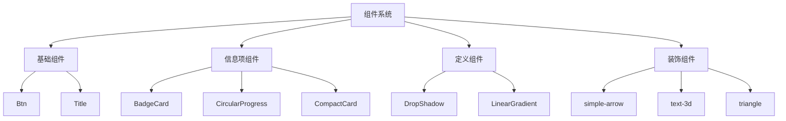
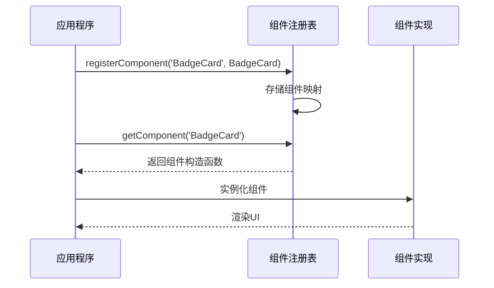
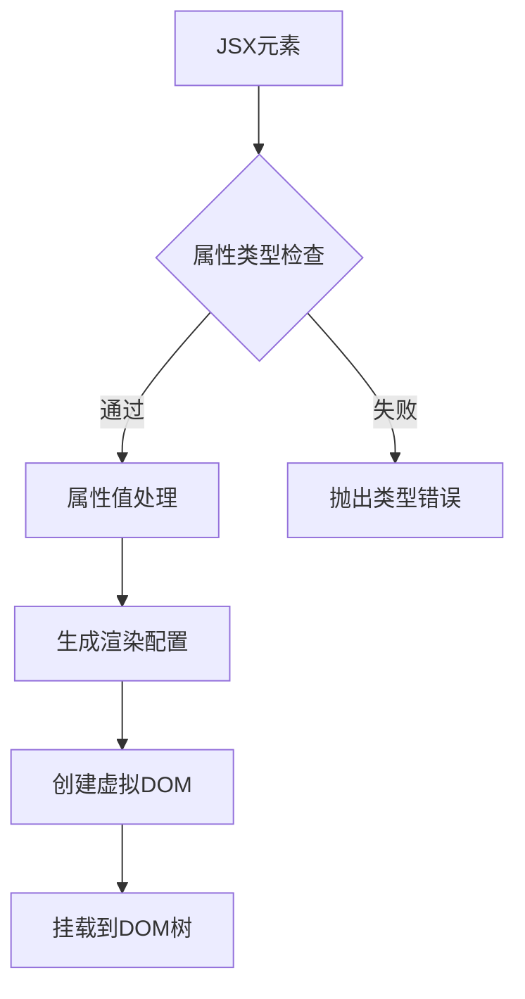

# 组件系统

<cite>
**本文档中引用的文件**  
- [registry.ts](file://antv_infographic/infographic/src/designs/items/registry.ts)
- [types.ts](file://antv_infographic/infographic/src/designs/items/types.ts)
- [index.ts](file://antv_infographic/infographic/src/designs/components/index.ts)
- [Btn.tsx](file://antv_infographic/infographic/src/designs/components/Btn.tsx)
- [Title.tsx](file://antv_infographic/infographic/src/designs/components/Title.tsx)
- [BadgeCard.tsx](file://antv_infographic/infographic/src/designs/items/BadgeCard.tsx)
- [CircularProgress.tsx](file://antv_infographic/infographic/src/designs/items/CircularProgress.tsx)
- [DropShadow.tsx](file://antv_infographic/infographic/src/designs/defs/DropShadow.tsx)
- [LinearGradient.tsx](file://antv_infographic/infographic/src/designs/defs/LinearGradient.tsx)
- [simple-arrow.tsx](file://antv_infographic/infographic/src/designs/decorations/simple-arrow.tsx)
- [text-3d.tsx](file://antv_infographic/infographic/src/designs/decorations/text-3d.tsx)
</cite>

## 目录
1. [引言](#引言)
2. [组件分类体系](#组件分类体系)
3. [核心组件详解](#核心组件详解)
4. [组件注册机制](#组件注册机制)
5. [JSX使用模式](#jsx使用模式)
6. [样式定制与响应式设计](#样式定制与响应式设计)
7. [常见问题排查](#常见问题排查)
8. [性能优化建议](#性能优化建议)

## 引言
AntV Infographic 是一个用于创建信息图表的可视化框架，其组件系统设计旨在提供灵活、可扩展且易于使用的UI构建块。本文档全面记录了该组件系统的设计与实现，涵盖基础组件、信息项组件、定义组件和装饰组件的分类、用途、API接口及使用模式。

## 组件分类体系

AntV Infographic 的组件系统采用分层分类设计，主要分为四类：基础组件、信息项组件、定义组件和装饰组件。这种分类方式有助于开发者快速定位所需组件并理解其用途。

**图示来源**  
- [components/index.ts](file://antv_infographic/infographic/src/designs/components/index.ts)
- [items/index.ts](file://antv_infographic/infographic/src/designs/items/index.ts)
- [defs/index.ts](file://antv_infographic/infographic/src/designs/defs/index.ts)
- [decorations/index.ts](file://antv_infographic/infographic/src/designs/decorations/index.ts)

## 核心组件详解

### 基础组件
基础组件是构建信息图表的基石，提供最基本的UI元素和交互功能。

#### Btn 组件
`Btn` 组件用于创建可点击的按钮元素，支持多种样式变体和事件处理。

**组件来源**  
- [Btn.tsx](file://antv_infographic/infographic/src/designs/components/Btn.tsx)

#### Title 组件
`Title` 组件用于展示标题文本，支持层级、对齐方式和自定义样式配置。

**组件来源**  
- [Title.tsx](file://antv_infographic/infographic/src/designs/components/Title.tsx)

### 信息项组件
信息项组件专门用于展示数据信息，通常包含图标、标签、数值等复合元素。

#### BadgeCard 组件
`BadgeCard` 组件以徽章形式展示关键指标数据，支持颜色编码和状态标识。

**组件来源**  
- [BadgeCard.tsx](file://antv_infographic/infographic/src/designs/items/BadgeCard.tsx)

#### CircularProgress 组件
`CircularProgress` 组件以圆形进度条形式展示百分比数据，支持动画效果和自定义颜色。

**组件来源**  
- [CircularProgress.tsx](file://antv_infographic/infographic/src/designs/items/CircularProgress.tsx)

### 定义组件
定义组件用于创建可重用的视觉效果定义，通常在SVG的`<defs>`元素中声明。

#### DropShadow 组件
`DropShadow` 组件定义投影滤镜效果，可在多个图形元素间共享使用。

**组件来源**  
- [DropShadow.tsx](file://antv_infographic/infographic/src/designs/defs/DropShadow.tsx)

#### LinearGradient 组件
`LinearGradient` 组件定义线性渐变填充，支持多色停止点和方向配置。

**组件来源**  
- [LinearGradient.tsx](file://antv_infographic/infographic/src/designs/defs/LinearGradient.tsx)

### 装饰组件
装饰组件提供视觉增强效果，用于提升信息图表的美观度和表现力。

#### simple-arrow 组件
`simple-arrow` 组件创建简洁的箭头装饰，支持方向和尺寸配置。

**组件来源**  
- [simple-arrow.tsx](file://antv_infographic/infographic/src/designs/decorations/simple-arrow.tsx)

#### text-3d 组件
`text-3d` 组件为文本添加三维视觉效果，增强视觉层次感。

**组件来源**  
- [text-3d.tsx](file://antv_infographic/infographic/src/designs/decorations/text-3d.tsx)

## 组件注册机制

AntV Infographic 采用集中式组件注册机制，通过 `registry.ts` 文件管理所有可注册组件。该机制支持动态注册和按需加载，提高了系统的灵活性和可扩展性。

**图示来源**  
- [registry.ts](file://antv_infographic/infographic/src/designs/items/registry.ts)
- [types.ts](file://antv_infographic/infographic/src/designs/items/types.ts)

## JSX使用模式

### 属性配置
组件通过JSX属性进行配置，支持类型安全的属性定义。

**图示来源**  
- [jsx-runtime.ts](file://antv_infographic/infographic/src/jsx/jsx-runtime.ts)
- [types.ts](file://antv_infographic/infographic/src/designs/items/types.ts)

### 事件处理
组件支持标准的事件处理机制，可通过属性传递事件处理器。

### 嵌套组合
组件支持嵌套组合，形成复杂的UI结构。

**代码来源**  
- [Infographic.tsx](file://antv_infographic/infographic/dev/src/Infographic.tsx)

## 样式定制与响应式设计

组件系统支持通过CSS类名和内联样式进行定制，并提供响应式断点配置。

**组件来源**  
- [utils/style.ts](file://antv_infographic/infographic/src/utils/style.ts)
- [options/parser.ts](file://antv_infographic/infographic/src/options/parser.ts)

## 常见问题排查

### 组件渲染异常
- 检查组件是否已正确注册
- 验证JSX语法是否正确
- 确认依赖组件是否已加载

### 属性不生效
- 检查属性名称拼写
- 验证属性类型是否匹配
- 确认主题配置是否覆盖了自定义样式

**问题排查来源**  
- [renderer.ts](file://antv_infographic/infographic/src/renderer/renderer.ts)
- [utils/recognizer.ts](file://antv_infographic/infographic/src/utils/recognizer.ts)

## 性能优化建议

- 使用组件懒加载减少初始包大小
- 避免在渲染函数中创建新对象
- 合理使用shouldComponentUpdate优化重渲染
- 批量更新状态以减少DOM操作次数

**性能优化来源**  
- [jsx/layout.ts](file://antv_infographic/infographic/src/jsx/layout.ts)
- [renderer/index.ts](file://antv_infographic/infographic/src/renderer/index.ts)