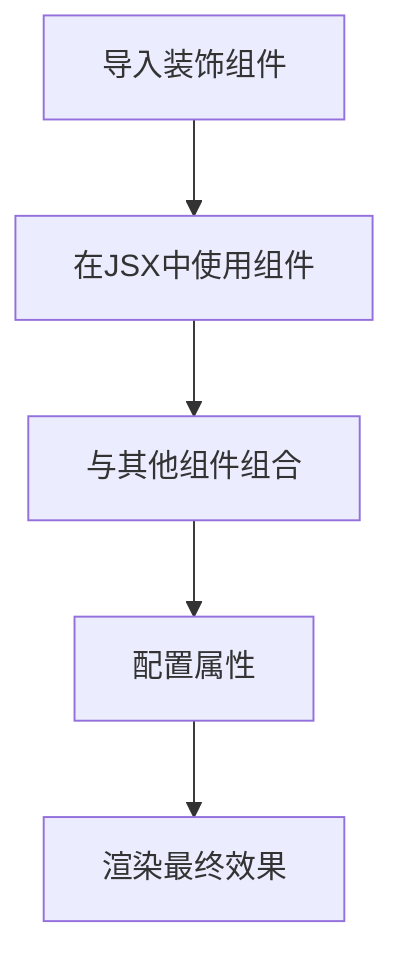
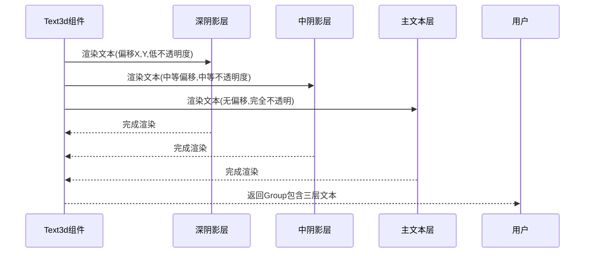

# 装饰组件

<cite>
**本文档引用的文件**
- [simple-arrow.tsx](file://antv_infographic\infographic\src\designs\decorations\simple-arrow.tsx)
- [text-3d.tsx](file://antv_infographic\infographic\src\designs\decorations\text-3d.tsx)
- [triangle.tsx](file://antv_infographic\infographic\src\designs\decorations\triangle.tsx)
- [index.ts](file://antv_infographic\infographic\src\designs\decorations\index.ts)
- [prompt.md](file://antv_infographic\infographic\src\designs\structures\prompt.md)
</cite>

## 目录
1. [简介](#简介)
2. [核心装饰组件](#核心装饰组件)
3. [组件功能与视觉表现](#组件功能与视觉表现)
4. [属性配置选项](#属性配置选项)
5. [JSX组合使用示例](#jsx组合使用示例)
6. [底层SVG实现原理](#底层svg实现原理)
7. [常见问题与解决方案](#常见问题与解决方案)
8. [性能优化建议](#性能优化建议)

## 简介
装饰组件是信息图设计中的关键视觉元素，用于增强信息的可读性和美观性。本文档详细说明了simple-arrow、text-3d和triangle三个核心装饰组件的功能、使用场景、属性配置及实现原理。这些组件通过箭头指示关系、3D文字突出标题、三角形标记重点等方式，显著提升了信息图的视觉表现力。

## 核心装饰组件

本文档重点分析以下三个装饰组件：
- **simple-arrow**: 简单箭头装饰，用于指示方向和关系
- **text-3d**: 3D文字装饰，用于突出显示标题和重要信息
- **triangle**: 三角形装饰，用于标记重点和创建视觉焦点

这些组件均位于`src/designs/decorations/`目录下，并通过`index.ts`文件统一导出，便于在项目中导入和使用。

**Section sources**
- [index.ts](file://antv_infographic\infographic\src\designs\decorations\index.ts#L1-L4)

## 组件功能与视觉表现

### 箭头指示关系
simple-arrow组件通过箭头形状直观地指示元素之间的关系和流向。在信息图中，箭头常用于表示流程、因果关系或数据流向，帮助用户快速理解信息的逻辑结构。

### 3D文字突出标题
text-3d组件通过创建具有深度效果的3D文字，使标题和重要信息更加突出。这种视觉效果能够吸引用户的注意力，增强信息的层次感和专业性。

### 三角形标记重点
triangle组件通过三角形形状标记关键信息点或创建视觉焦点。三角形的尖锐特性使其成为强调和引导视线的理想选择，常用于标注重要数据或指示方向。

**Section sources**
- [simple-arrow.tsx](file://antv_infographic\infographic\src\designs\decorations\simple-arrow.tsx#L3-L57)
- [text-3d.tsx](file://antv_infographic\infographic\src\designs\decorations\text-3d.tsx#L97-L157)
- [triangle.tsx](file://antv_infographic\infographic\src\designs\decorations\triangle.tsx#L3-L39)

## 属性配置选项

### 箭头样式配置
simple-arrow组件提供以下属性配置：
- **width**: 箭头宽度，默认值为25
- **height**: 箭头高度，默认值为25
- **colorPrimary**: 主色调，默认值为'#6699FF'
- **rotation**: 旋转角度，默认值为0
- **...rest**: 其他继承自RectProps的属性

### 3D深度配置
text-3d组件提供精细的3D效果控制：
- **text**: 显示的文本内容（必需）
- **fontSize**: 字体大小，默认值为56
- **fontWeight**: 字体粗细，默认值为'bold'
- **fill**: 文本填充颜色，默认值为'#FFFFFF'
- **shadowOffsetX/Y**: 最深阴影层的偏移量
- **midShadowOffsetX/Y**: 中层阴影的偏移量
- **deepShadowOpacity**: 最深阴影层的不透明度
- **midShadowOpacity**: 中层阴影的不透明度

### 颜色渐变配置
所有装饰组件均支持颜色渐变效果。simple-arrow组件通过Defs和linearGradient实现渐变填充和描边，创建了从主色到透明的平滑过渡效果，增强了箭头的立体感和视觉吸引力。

**Section sources**
- [simple-arrow.tsx](file://antv_infographic\infographic\src\designs\decorations\simple-arrow.tsx#L3-L57)
- [text-3d.tsx](file://antv_infographic\infographic\src\designs\decorations\text-3d.tsx#L4-L87)

## JSX组合使用示例



**Diagram sources**
- [prompt.md](file://antv_infographic\infographic\src\designs\structures\prompt.md#L261-L272)

### 简单箭头使用示例
```tsx
<SimpleArrow
  x={0}
  y={0}
  width={25}
  height={25}
  colorPrimary="#000000"
  rotation={0} // 可选，旋转角度：0, 90, 180, 270
/>
```

### 三角形使用示例
```tsx
<Triangle
  x={0}
  y={0}
  width={10}
  height={8}
  rotation={0}
  colorPrimary="#000000"
/>
```

### 3D文字使用示例
```tsx
<Text3d
  text="重要标题"
  fontSize={64}
  fontWeight="bold"
  fill="#FF6B6B"
  shadowOffsetX={3}
  shadowOffsetY={6}
  deepShadowOpacity={0.4}
/>
```

**Section sources**
- [prompt.md](file://antv_infographic\infographic\src\designs\structures\prompt.md#L261-L284)

## 底层SVG实现原理

### SimpleArrow实现原理
simple-arrow组件基于SVG Polygon元素实现，通过定义一系列坐标点创建箭头形状。组件使用linearGradient定义渐变效果，并通过Defs元素在SVG中声明这些渐变，然后在Polygon元素中引用这些渐变作为填充和描边。

```mermaid
classDiagram
class SimpleArrow {
+width : number
+height : number
+colorPrimary : string
+rotation : number
+render() : JSX.Element
}
class Polygon {
+points : Array<{x : number, y : number}>
+fill : string
+stroke : string
+transform : string
}
class Defs {
+linearGradient : LinearGradient
}
class LinearGradient {
+id : string
+x1 : string
+y1 : string
+x2 : string
+y2 : string
+stop : Array<Stop>
}
class Stop {
+offset : string
+stop-color : string
+stop-opacity : string
}
SimpleArrow --> Polygon : "使用"
SimpleArrow --> Defs : "包含"
Defs --> LinearGradient : "包含"
LinearGradient --> Stop : "包含多个"
```

**Diagram sources**
- [simple-arrow.tsx](file://antv_infographic\infographic\src\designs\decorations\simple-arrow.tsx#L3-L57)

### Text3d实现原理
text-3d组件通过叠加三层文本元素创建3D效果：
1. **深阴影层**: 最大的偏移量和最低的不透明度
2. **中阴影层**: 中等偏移量和中等不透明度
3. **主文本层**: 无偏移，完全不透明

这种分层渲染技术模拟了真实世界中的阴影效果，创造了强烈的深度感。



**Diagram sources**
- [text-3d.tsx](file://antv_infographic\infographic\src\designs\decorations\text-3d.tsx#L97-L157)

### Triangle实现原理
triangle组件使用SVG Polygon元素创建等腰三角形，通过三个坐标点定义形状。组件支持旋转变换，通过计算中心点并应用rotate变换实现任意角度的旋转。

## 常见问题与解决方案

### 3D文字渲染模糊问题
**问题描述**: 在某些情况下，3D文字可能出现渲染模糊或锯齿现象。

**解决方案**:
1. 确保使用高分辨率的显示设备
2. 调整shadowOffset值，避免过大的偏移导致模糊
3. 使用整数像素值而非小数，减少亚像素渲染问题
4. 在CSS中添加`shape-rendering: geometricPrecision`属性

### 箭头方向错误问题
**问题描述**: 箭头旋转后方向不符合预期。

**解决方案**:
1. 检查rotation属性值是否正确（0, 90, 180, 270）
2. 确认transform原点计算正确（基于中心点旋转）
3. 验证坐标系方向，确保没有意外的坐标反转
4. 使用调试工具检查实际渲染的坐标点

**Section sources**
- [simple-arrow.tsx](file://antv_infographic\infographic\src\designs\decorations\simple-arrow.tsx#L30-L31)
- [text-3d.tsx](file://antv_infographic\infographic\src\designs\decorations\text-3d.tsx#L116-L154)

## 性能优化建议

### 复杂场景下的使用建议
在复杂信息图中使用装饰组件时，应注意以下性能优化策略：

1. **适度使用**: 避免在单个视图中使用过多装饰组件，以免造成视觉混乱和性能下降
2. **缓存渲染结果**: 对于静态装饰元素，考虑缓存其SVG渲染结果
3. **简化动画**: 如果需要动画效果，尽量使用CSS transform而非重绘整个组件
4. **按需加载**: 在大型信息图中，实现装饰组件的懒加载机制

### 渲染性能优化
1. **减少DOM节点**: 合并相邻的简单装饰元素
2. **优化渐变计算**: 预计算常用的渐变配置，避免重复创建
3. **使用CSS类**: 对于常见的样式组合，使用CSS类而非内联样式
4. **避免过度重绘**: 使用shouldComponentUpdate或React.memo进行性能优化

**Section sources**
- [simple-arrow.tsx](file://antv_infographic\infographic\src\designs\decorations\simple-arrow.tsx)
- [text-3d.tsx](file://antv_infographic\infographic\src\designs\decorations\text-3d.tsx)
- [triangle.tsx](file://antv_infographic\infographic\src\designs\decorations\triangle.tsx)