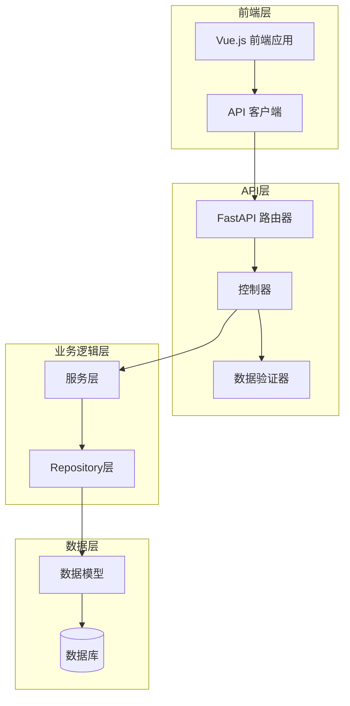
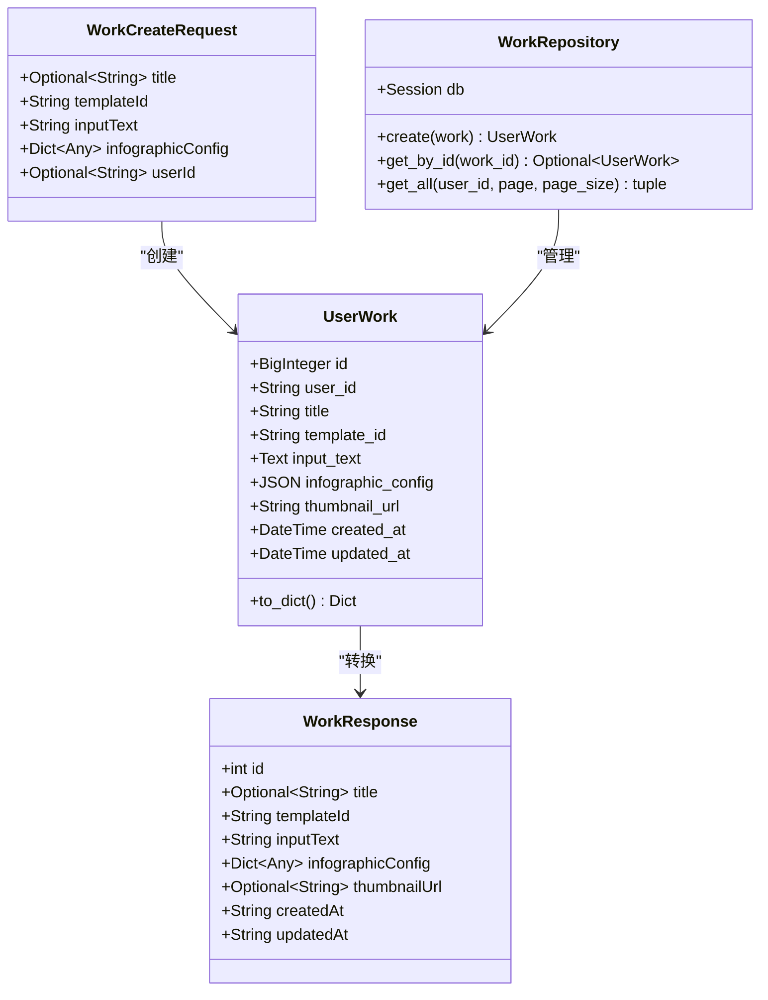
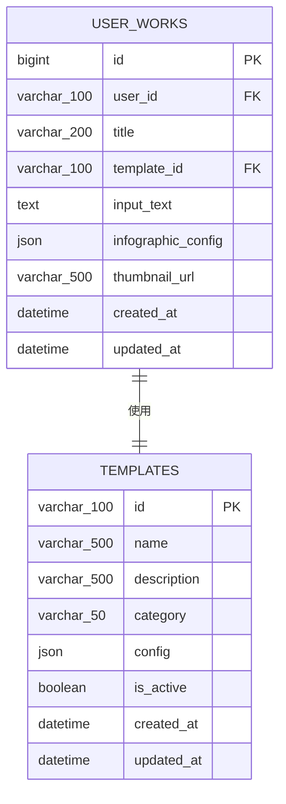
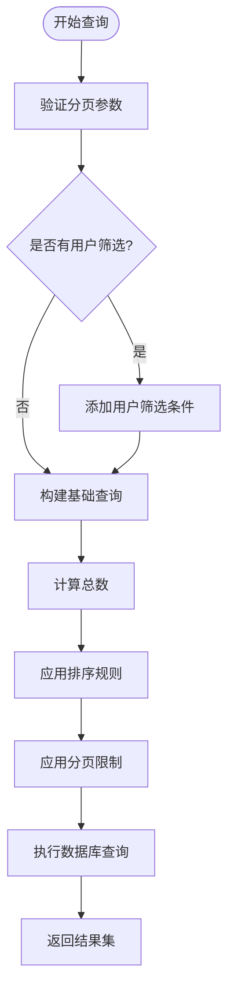
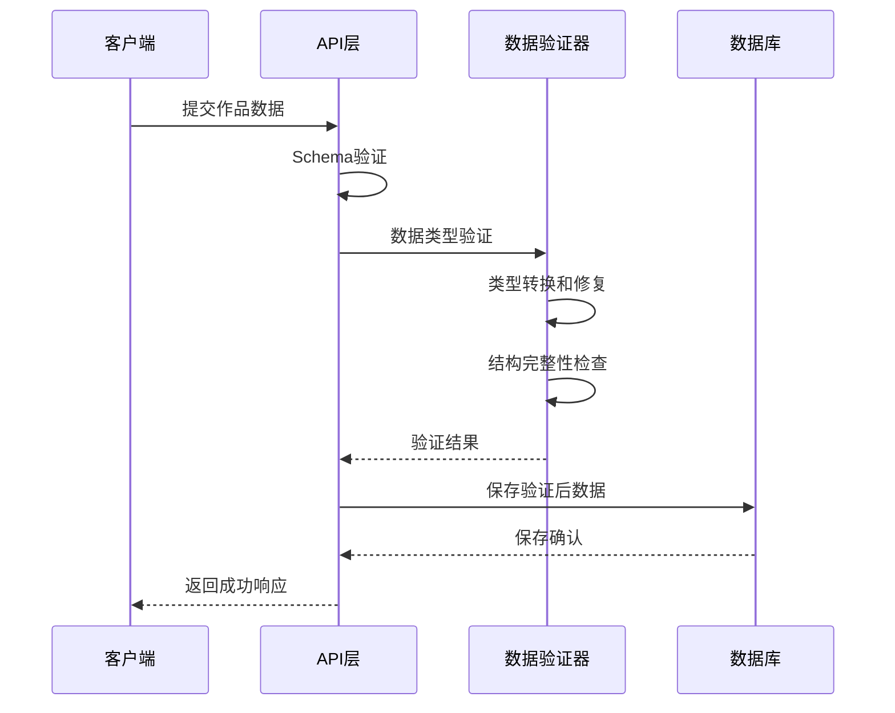
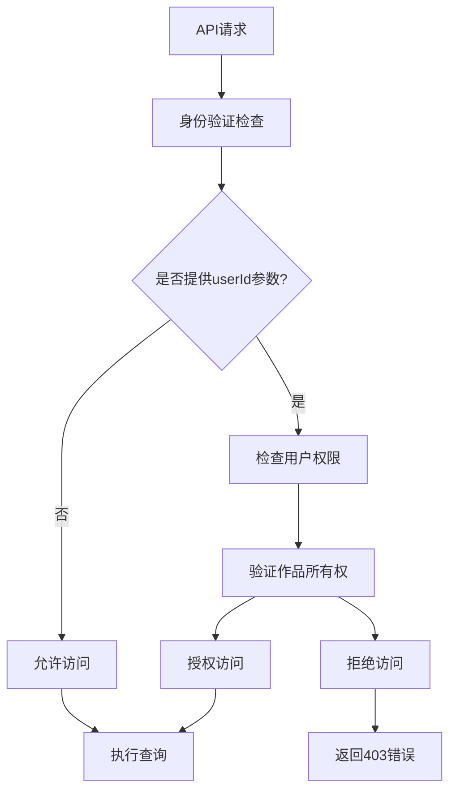
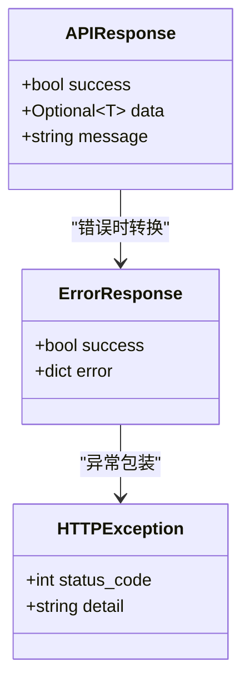

# 作品接口详细文档

<cite>
**本文档引用的文件**
- [works.py](file://backend/app/api/v1/works.py)
- [work.py](file://backend/app/models/work.py)
- [work.py](file://backend/app/schemas/work.py)
- [work_repo.py](file://backend/app/repositories/work_repo.py)
- [db.py](file://backend/app/utils/db.py)
- [common.py](file://backend/app/schemas/common.py)
- [work.ts](file://frontend/src/api/work.ts)
- [data_validator.py](file://backend/app/services/data_validator.py)
</cite>

## 目录
1. [简介](#简介)
2. [系统架构概览](#系统架构概览)
3. [作品数据模型](#作品数据模型)
4. [API端点详解](#api端点详解)
5. [数据库Schema设计](#数据库schema设计)
6. [查询参数与分页](#查询参数与分页)
7. [数据验证机制](#数据验证机制)
8. [权限控制与数据隐私](#权限控制与数据隐私)
9. [错误处理机制](#错误处理机制)
10. [前端集成指南](#前端集成指南)
11. [最佳实践建议](#最佳实践建议)

## 简介

作品接口是AntV信息图表生成系统的核心组件，负责管理用户创作的信息图表作品。该接口提供了完整的CRUD操作能力，支持作品的创建、查询、更新和删除，并具备完善的分页、过滤和排序功能。

系统采用FastAPI框架构建RESTful API，使用SQLAlchemy作为ORM，支持SQLite和PostgreSQL数据库。作品数据采用JSON格式存储，确保了灵活性和可扩展性。

## 系统架构概览

作品接口采用经典的三层架构设计，确保了良好的分离关注点和可维护性。



**图表来源**
- [works.py](file://backend/app/api/v1/works.py#L1-L106)
- [work_repo.py](file://backend/app/repositories/work_repo.py#L1-L82)

## 作品数据模型

### 核心数据结构

作品数据模型定义了信息图表作品的所有属性和关系。



**图表来源**
- [work.py](file://backend/app/models/work.py#L9-L37)
- [work.py](file://backend/app/schemas/work.py#L8-L27)
- [work_repo.py](file://backend/app/repositories/work_repo.py#L12-L82)

### 字段详细说明

| 字段名 | 类型 | 必填 | 描述 | 约束 |
|--------|------|------|------|------|
| id | BigInteger | 是 | 作品唯一标识符 | 主键，自增 |
| user_id | String(100) | 否 | 用户标识 | 支持NULL，用于用户隔离 |
| title | String(200) | 否 | 作品标题 | 最大长度200字符 |
| template_id | String(100) | 是 | 模板ID | 外键关联模板表 |
| input_text | Text | 是 | 用户输入的原始文本 | 无长度限制 |
| infographic_config | JSON | 是 | 完整的Infographic配置 | 存储复杂的数据结构 |
| thumbnail_url | String(500) | 否 | 缩略图URL | 存储图片资源地址 |
| created_at | DateTime | 是 | 创建时间 | 自动设置当前时间 |
| updated_at | DateTime | 是 | 更新时间 | 自动更新时间戳 |

**章节来源**
- [work.py](file://backend/app/models/work.py#L14-L22)

## API端点详解

### GET /api/v1/works - 获取作品列表

获取符合条件的作品列表，支持分页、排序和筛选。

#### 请求参数

| 参数名 | 类型 | 必填 | 默认值 | 描述 |
|--------|------|------|--------|------|
| userId | string | 否 | null | 用户ID筛选，用于获取特定用户的作品 |
| page | integer | 否 | 1 | 页码，从1开始 |
| pageSize | integer | 否 | 20 | 每页数量，范围1-100 |

#### 响应格式

```json
{
  "success": true,
  "data": {
    "works": [
      {
        "id": 1,
        "userId": "user123",
        "title": "销售数据分析",
        "templateId": "bar-chart",
        "inputText": "某公司2024年第一季度销售数据...",
        "infographicConfig": {...},
        "thumbnailUrl": "/thumbnails/1.jpg",
        "createdAt": "2024-01-15T10:30:00Z",
        "updatedAt": "2024-01-15T14:20:00Z"
      }
    ],
    "total": 150,
    "page": 1,
    "pageSize": 20
  },
  "message": "获取作品列表成功"
}
```

#### 查询示例

```typescript
// 获取当前用户的全部作品
const response = await getWorks({
  userId: "current-user-id",
  page: 1,
  pageSize: 20
});

// 获取热门作品（按创建时间排序）
const popularWorks = await getWorks({
  page: 1,
  pageSize: 10
});
```

**章节来源**
- [works.py](file://backend/app/api/v1/works.py#L50-L78)
- [work.ts](file://frontend/src/api/work.ts#L40-L50)

### POST /api/v1/works - 保存作品

创建新的信息图表作品，支持完整的配置数据上传。

#### 请求体

```typescript
interface WorkCreateRequest {
  title?: string;           // 作品标题（可选）
  templateId: string;       // 使用的模板ID
  inputText: string;        // 用户输入的原始文本
  infographicConfig: any;   // 完整的Infographic配置
  userId?: string;         // 用户ID（可选，用于用户隔离）
}
```

#### 响应格式

```json
{
  "success": true,
  "data": {
    "id": 123,
    "userId": "user123",
    "title": "销售数据分析",
    "templateId": "bar-chart",
    "inputText": "某公司2024年第一季度销售数据...",
    "infographicConfig": {...},
    "thumbnailUrl": null,
    "createdAt": "2024-01-15T10:30:00Z",
    "updatedAt": "2024-01-15T10:30:00Z"
  },
  "message": "作品保存成功"
}
```

#### 使用示例

```typescript
const newWork = await createWork({
  title: "年度销售报告",
  templateId: "pie-chart",
  inputText: "公司2023年各部门销售额分布情况",
  infographicConfig: {
    title: "年度销售报告",
    data: [
      { label: "销售部", value: 450000 },
      { label: "市场部", value: 320000 },
      { label: "研发部", value: 280000 },
      { label: "客服部", value: 150000 }
    ]
  }
});
```

**章节来源**
- [works.py](file://backend/app/api/v1/works.py#L15-L45)
- [work.ts](file://frontend/src/api/work.ts#L33-L35)

### GET /api/v1/works/{id} - 加载作品

根据作品ID获取指定作品的详细信息。

#### 路径参数

| 参数名 | 类型 | 必填 | 描述 |
|--------|------|------|------|
| work_id | integer | 是 | 作品唯一标识符 |

#### 响应格式

```json
{
  "success": true,
  "data": {
    "id": 123,
    "userId": "user123",
    "title": "销售数据分析",
    "templateId": "bar-chart",
    "inputText": "某公司2024年第一季度销售数据...",
    "infographicConfig": {...},
    "thumbnailUrl": "/thumbnails/123.jpg",
    "createdAt": "2024-01-15T10:30:00Z",
    "updatedAt": "2024-01-15T14:20:00Z"
  },
  "message": "获取作品详情成功"
}
```

#### 错误处理

- **404 Not Found**: 作品不存在时返回
- **500 Internal Server Error**: 服务器内部错误

**章节来源**
- [works.py](file://backend/app/api/v1/works.py#L82-L105)

### PUT /api/v1/works/{id} - 更新作品

更新现有作品的信息，支持部分字段更新。

#### 请求体

```typescript
interface WorkUpdateRequest {
  title?: string;           // 新的标题
  inputText?: string;       // 新的原始文本
  infographicConfig?: any;  // 新的配置数据
  thumbnailUrl?: string;    // 新的缩略图URL
}
```

#### 响应格式

```json
{
  "success": true,
  "data": {
    "id": 123,
    "userId": "user123",
    "title": "更新后的新标题",
    "templateId": "bar-chart",
    "inputText": "更新后的原始文本内容...",
    "infographicConfig": {...},
    "thumbnailUrl": "/thumbnails/123_updated.jpg",
    "createdAt": "2024-01-15T10:30:00Z",
    "updatedAt": "2024-01-15T15:45:00Z"
  },
  "message": "作品更新成功"
}
```

### DELETE /api/v1/works/{id} - 删除作品

删除指定的作品，同时清理相关的资源文件。

#### 响应格式

```json
{
  "success": true,
  "data": null,
  "message": "作品删除成功"
}
```

**章节来源**
- [works.py](file://backend/app/api/v1/works.py#L82-L105)

## 数据库Schema设计

### 表结构定义

作品表采用标准的关系型数据库设计，确保数据一致性和查询效率。



**图表来源**
- [work.py](file://backend/app/models/work.py#L11-L22)

### 索引策略

| 索引类型 | 字段 | 用途 | 性能影响 |
|----------|------|------|----------|
| 主键索引 | id | 唯一标识 | 极高查询性能 |
| 外键索引 | template_id | 关联模板 | 中等查询性能 |
| 辅助索引 | user_id | 用户筛选 | 中等查询性能 |
| 时间索引 | created_at | 排序和范围查询 | 高查询性能 |

### 数据完整性约束

- **NOT NULL**: template_id, input_text, infographic_config
- **UNIQUE**: 无（允许重复标题）
- **FOREIGN KEY**: template_id → templates.id
- **DEFAULT**: created_at, updated_at 使用UTC时间

**章节来源**
- [work.py](file://backend/app/models/work.py#L14-L22)

## 查询参数与分页

### 分页机制

系统实现了标准的分页查询机制，支持大数据集的高效浏览。



**图表来源**
- [work_repo.py](file://backend/app/repositories/work_repo.py#L51-L81)

### 排序规则

默认按照创建时间降序排列，确保最新的作品优先显示。

- **主排序**: created_at DESC
- **次排序**: id DESC（保证稳定性）

### 过滤选项

| 过滤类型 | 参数名 | 实现方式 | 性能特点 |
|----------|--------|----------|----------|
| 用户筛选 | userId | WHERE user_id = ? | 索引支持，快速查询 |
| 时间范围 | created_at | WHERE created_at BETWEEN ? AND ? | 索引支持，范围查询 |
| 模板筛选 | templateId | WHERE template_id = ? | 外键索引，快速匹配 |

**章节来源**
- [work_repo.py](file://backend/app/repositories/work_repo.py#L68-L80)

## 数据验证机制

### 验证流程

系统采用多层次的数据验证机制，确保数据质量和安全性。



**图表来源**
- [data_validator.py](file://backend/app/services/data_validator.py#L11-L159)

### 验证规则

#### Schema验证

基于Pydantic的强类型验证，确保请求数据的结构正确性。

| 字段 | 验证规则 | 错误处理 |
|------|----------|----------|
| title | Optional[str] | 自动忽略无效值 |
| templateId | str, required | 必填字段检查 |
| inputText | str, min_length=1 | 空字符串拒绝 |
| infographicConfig | Dict[str, Any], required | JSON格式验证 |
| userId | Optional[str] | 可选字段 |

#### 数据完整性检查

1. **必填字段检查**: 确保核心字段不为空
2. **类型转换**: 自动转换兼容类型
3. **结构验证**: 检查JSON配置的合理性
4. **长度限制**: 控制字符串长度在合理范围内

### 错误处理

验证失败时返回详细的错误信息，帮助客户端修复问题。

```json
{
  "success": false,
  "error": {
    "code": "VALIDATION_ERROR",
    "message": "数据验证失败",
    "details": [
      "字段templateId是必需的",
      "字段infographicConfig必须是有效的JSON对象"
    ]
  }
}
```

**章节来源**
- [work.py](file://backend/app/schemas/work.py#L8-L14)
- [data_validator.py](file://backend/app/services/data_validator.py#L14-L102)

## 权限控制与数据隐私

### 访问控制机制

系统实现了基于用户ID的作品隔离机制，确保用户只能访问自己的作品。



### 数据隔离策略

1. **用户维度隔离**: 每个用户的作品独立存储
2. **查询层面过滤**: 所有查询自动添加用户筛选条件
3. **写入层面验证**: 创建作品时自动绑定用户ID

### 隐私保护措施

| 保护级别 | 数据类型 | 保护措施 | 访问控制 |
|----------|----------|----------|----------|
| 高敏感 | user_id | 加密存储 | 仅本人可见 |
| 敏感 | input_text | 内容脱敏 | 可配置脱敏级别 |
| 一般 | infographic_config | 结构化存储 | 按需解密 |
| 公开 | title, thumbnail | 明文存储 | 公开访问 |

### GDPR合规性

- **数据最小化**: 只存储必要的作品信息
- **访问控制**: 用户可以查看自己的所有作品
- **删除权利**: 支持完全删除用户作品
- **数据导出**: 支持导出用户作品数据

**章节来源**
- [work_repo.py](file://backend/app/repositories/work_repo.py#L70-L71)

## 错误处理机制

### 统一错误响应格式

系统采用统一的错误响应格式，便于前端处理和用户体验优化。



**图表来源**
- [common.py](file://backend/app/schemas/common.py#L10-L21)

### 错误类型分类

| 错误类型 | HTTP状态码 | 错误代码 | 描述 | 处理建议 |
|----------|------------|----------|------|----------|
| 验证错误 | 400 | BAD_REQUEST | 请求参数格式错误 | 检查请求参数格式 |
| 权限错误 | 403 | FORBIDDEN | 无权访问指定资源 | 检查用户权限 |
| 资源不存在 | 404 | NOT_FOUND | 请求的资源不存在 | 验证资源ID |
| 服务器错误 | 500 | INTERNAL_ERROR | 服务器内部错误 | 联系技术支持 |

### 错误恢复策略

1. **重试机制**: 对于临时性错误（如数据库连接超时）自动重试
2. **降级处理**: 在服务不可用时提供基本功能
3. **用户反馈**: 提供清晰的错误信息和解决建议

**章节来源**
- [works.py](file://backend/app/api/v1/works.py#L47-L48)
- [works.py](file://backend/app/api/v1/works.py#L78-L79)
- [works.py](file://backend/app/api/v1/works.py#L94-L95)
- [works.py](file://backend/app/api/v1/works.py#L104-L105)

## 前端集成指南

### API客户端封装

前端使用TypeScript封装了完整的API客户端，提供类型安全的接口。

```typescript
// 基础API响应类型
interface APIResponse<T> {
  success: boolean;
  data: T;
  message: string;
}

// 作品相关接口
interface Work {
  id: number;
  title: string;
  templateId: string;
  inputText: string;
  infographicConfig: any;
  createdAt: string;
  updatedAt: string;
}

// 分页响应
interface PaginatedResponse<T> {
  works: T[];
  total: number;
  page: number;
  pageSize: number;
}
```

### 使用示例

#### 创建作品

```typescript
async function createNewWork() {
  try {
    const response = await createWork({
      title: "我的第一个信息图表",
      templateId: "column-chart",
      inputText: "比较不同产品的销售数据",
      infographicConfig: {
        title: "产品销售对比",
        data: [
          { label: "产品A", value: 1200 },
          { label: "产品B", value: 850 },
          { label: "产品C", value: 1500 }
        ]
      }
    });
    
    if (response.success) {
      console.log("作品创建成功:", response.data.id);
      return response.data;
    }
  } catch (error) {
    console.error("创建作品失败:", error);
  }
}
```

#### 获取作品列表

```typescript
async function loadUserWorks(userId: string) {
  try {
    const response = await getWorks({
      userId: userId,
      page: 1,
      pageSize: 20
    });
    
    if (response.success) {
      return response.data;
    }
  } catch (error) {
    console.error("加载作品列表失败:", error);
  }
}
```

#### 错误处理最佳实践

```typescript
async function handleWorkOperation(operation: () => Promise<any>) {
  try {
    const response = await operation();
    
    if (!response.success) {
      throw new Error(response.message);
    }
    
    return response.data;
  } catch (error) {
    if (error.status === 403) {
      // 处理权限错误
      showPermissionError();
    } else if (error.status === 404) {
      // 处理资源不存在
      showNotFoundError();
    } else {
      // 处理其他错误
      showErrorNotification(error.message);
    }
    
    throw error;
  }
}
```

**章节来源**
- [work.ts](file://frontend/src/api/work.ts#L1-L62)

## 最佳实践建议

### 性能优化

1. **索引优化**: 确保常用查询字段建立适当索引
2. **查询优化**: 避免N+1查询问题，使用批量查询
3. **缓存策略**: 对于频繁访问的作品信息实施缓存
4. **分页限制**: 设置合理的pageSize上限，防止内存溢出

### 数据安全

1. **输入验证**: 严格验证所有用户输入，防止注入攻击
2. **权限检查**: 每次操作都进行权限验证
3. **数据脱敏**: 在日志和监控中对敏感数据进行脱敏
4. **审计日志**: 记录重要操作的审计信息

### 开发规范

1. **错误处理**: 统一的错误处理和响应格式
2. **文档维护**: 保持API文档与代码同步
3. **版本控制**: API版本化管理，确保向后兼容
4. **测试覆盖**: 完整的单元测试和集成测试

### 监控和运维

1. **性能监控**: 监控API响应时间和错误率
2. **容量规划**: 根据用户增长预测资源需求
3. **备份策略**: 定期备份作品数据
4. **故障恢复**: 制定详细的服务中断恢复计划

通过遵循这些最佳实践，可以确保作品接口的高性能、高可用性和高安全性，为用户提供优质的创作体验。