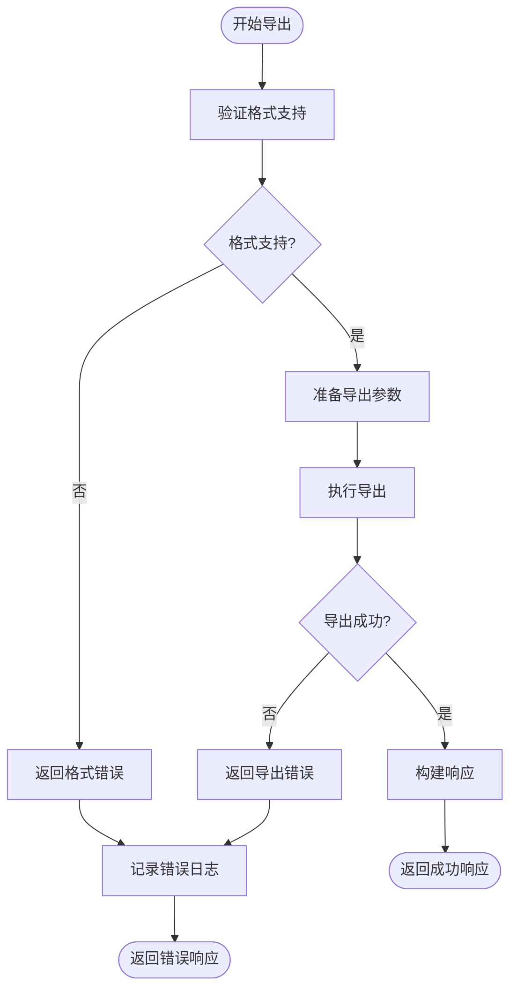

# 导出接口

<cite>
**本文档中引用的文件**
- [export.py](file://backend/app/api/v1/export.py)
- [export_service.py](file://backend/app/services/export_service.py)
- [export.ts](file://frontend/src/api/export.ts)
- [common.py](file://backend/app/schemas/common.py)
- [export.ts](file://frontend/src/views/AIWorkspace/components/RightPreviewPanel.vue)
</cite>

## 目录
1. [简介](#简介)
2. [项目架构](#项目架构)
3. [核心组件](#核心组件)
4. [API端点详解](#api端点详解)
5. [错误处理机制](#错误处理机制)
6. [技术集成](#技术集成)
7. [性能考量](#性能考量)
8. [使用示例](#使用示例)
9. [故障排除指南](#故障排除指南)
10. [总结](#总结)

## 简介

导出接口是AntV Infographic系统的核心功能模块，负责将SVG格式的信息图转换为多种目标格式（SVG、PNG、PDF、PPTX）。该系统采用前后端分离架构，前端通过RESTful API与后端服务交互，支持实时导出和文件下载功能。

## 项目架构

导出功能采用分层架构设计，包含以下主要层次：


**图表来源**
- [export.py](file://backend/app/api/v1/export.py#L1-L208)
- [export_service.py](file://backend/app/services/export_service.py#L1-L670)

## 核心组件

### 导出服务类 (ExportService)

导出服务是整个导出功能的核心，负责处理不同格式的转换逻辑：


**图表来源**
- [export_service.py](file://backend/app/services/export_service.py#L19-L670)
- [export.py](file://backend/app/api/v1/export.py#L16-L36)

**章节来源**
- [export_service.py](file://backend/app/services/export_service.py#L19-L253)
- [export.py](file://backend/app/api/v1/export.py#L16-L36)

### 支持的导出格式

系统支持四种主要的导出格式，每种格式都有其特定的应用场景和技术特点：

| 格式 | 扩展名 | 特点 | 应用场景 |
|------|--------|------|----------|
| SVG | `.svg` | 矢量图形，可无限缩放 | 网页展示、矢量编辑 |
| PNG | `.png` | 高质量位图，支持透明度 | 图像展示、打印预览 |
| PDF | `.pdf` | 便携式文档格式 | 报告生成、正式发布 |
| PPTX | `.pptx` | PowerPoint演示文稿 | 演示文稿集成 |

**章节来源**
- [export.py](file://backend/app/api/v1/export.py#L175-L207)

## API端点详解

### POST /api/v1/export

**功能描述**: 导出信息图为指定格式

**HTTP方法**: POST

**请求参数**:

| 参数名 | 类型 | 必填 | 描述 | 默认值 |
|--------|------|------|------|--------|
| svgContent | string | 是 | SVG内容字符串 | - |
| format | string | 是 | 导出格式: svg/png/pdf/pptx | - |
| filename | string | 否 | 可选的文件名 | 自动生成 |
| title | string | 否 | 标题(仅PPTX) | "信息图" |
| width | integer | 否 | 宽度(仅PNG) | 800 |
| height | integer | 否 | 高度(仅PNG) | 600 |
| scale | integer | 否 | 缩放比例(仅PNG) | 2 |

**请求体结构**:

```json
{
  "svgContent": "<svg>...</svg>",
  "format": "png",
  "filename": "my-infographic.png",
  "width": 1600,
  "height": 1200,
  "scale": 2
}
```

**响应格式**:

```json
{
  "success": true,
  "data": {
    "format": "png",
    "filename": "my-infographic.png",
    "filepath": "/path/to/temp/my-infographic.png",
    "size": 102400,
    "downloadUrl": "/api/v1/export/download/my-infographic.png",
    "width": 1600,
    "height": 1200
  }
}
```

**章节来源**
- [export.py](file://backend/app/api/v1/export.py#L38-L121)

### GET /api/v1/export/formats

**功能描述**: 获取支持的导出格式列表

**HTTP方法**: GET

**响应格式**:

```json
{
  "success": true,
  "data": [
    {
      "value": "svg",
      "label": "SVG",
      "description": "矢量图形格式，可无限缩放",
      "extension": ".svg"
    },
    {
      "value": "png",
      "label": "PNG",
      "description": "高质量位图格式",
      "extension": ".png"
    },
    {
      "value": "pdf",
      "label": "PDF",
      "description": "便携式文档格式",
      "extension": ".pdf"
    },
    {
      "value": "pptx",
      "label": "PPTX",
      "description": "PowerPoint演示文稿",
      "extension": ".pptx"
    }
  ]
}
```

**章节来源**
- [export.py](file://backend/app/api/v1/export.py#L175-L207)

### GET /api/v1/export/download/{filename}

**功能描述**: 下载导出的文件

**HTTP方法**: GET

**路径参数**:

| 参数名 | 类型 | 必填 | 描述 |
|--------|------|------|------|
| filename | string | 是 | 文件名 |

**响应**: 文件流，根据文件扩展名自动设置媒体类型

**章节来源**
- [export.py](file://backend/app/api/v1/export.py#L124-L152)

### DELETE /api/v1/export/cleanup/{filename}

**功能描述**: 清理临时文件

**HTTP方法**: DELETE

**路径参数**:

| 参数名 | 类型 | 必填 | 描述 |
|--------|------|------|------|
| filename | string | 是 | 文件名 |

**响应格式**:

```json
{
  "success": true,
  "message": "文件已清理"
}
```

**章节来源**
- [export.py](file://backend/app/api/v1/export.py#L155-L173)

## 错误处理机制

### 错误响应格式

系统采用统一的错误响应格式，包含成功状态、错误信息和详细描述：

```json
{
  "success": false,
  "error": {
    "message": "错误描述",
    "details": "详细错误信息"
  }
}
```

### 常见错误类型

| 错误码 | 错误类型 | 描述 | 解决方案 |
|--------|----------|------|----------|
| 422 | 参数验证错误 | 格式不支持或参数缺失 | 检查请求参数格式 |
| 500 | 导出失败 | 渲染过程中发生错误 | 检查SVG内容有效性 |
| 500 | 依赖缺失 | 缺少必要的Python库 | 安装所需依赖包 |
| 404 | 文件不存在 | 下载的文件已被清理 | 重新执行导出操作 |

### 异常处理流程



**图表来源**
- [export.py](file://backend/app/api/v1/export.py#L54-L121)

**章节来源**
- [export.py](file://backend/app/api/v1/export.py#L54-L121)
- [common.py](file://backend/app/schemas/common.py#L10-L21)

## 技术集成

### AntV Infographic渲染器集成

导出功能与AntV Infographic渲染器深度集成，确保导出的图形与渲染结果完全一致：


**图表来源**
- [export.py](file://backend/app/api/v1/export.py#L57-L90)
- [export_service.py](file://backend/app/services/export_service.py#L232-L253)

### 字体嵌入处理

系统实现了智能的字体映射机制，确保中文字符在不同平台上的正确显示：

| Web字体 | 系统字体 | 映射规则 |
|---------|----------|----------|
| Alibaba PuHuiTi | Noto Sans CJK SC | 中文字体映射 |
| Source Han Sans | Noto Sans CJK SC | 等效字体替换 |
| Source Han Serif | Noto Serif CJK SC | 衬线字体映射 |
| 黑体 | Noto Sans CJK SC | 常见字体别名 |
| 宋体 | Noto Serif CJK SC | 常见字体别名 |

**章节来源**
- [export_service.py](file://backend/app/services/export_service.py#L446-L479)

### 图像资源内联

对于PPTX格式导出，系统实现了复杂的SVG到PPTX转换逻辑：


**图表来源**
- [export_service.py](file://backend/app/services/export_service.py#L158-L224)

**章节来源**
- [export_service.py](file://backend/app/services/export_service.py#L158-L224)

## 性能考量

### 内存使用优化

系统采用流式处理和临时文件管理来控制内存使用：

| 操作阶段 | 内存策略 | 优化措施 |
|----------|----------|----------|
| SVG解析 | 流式读取 | 避免完整加载到内存 |
| 格式转换 | 临时文件 | 分块处理大文件 |
| 文件传输 | 直接流式 | 避免内存缓存 |
| 清理机制 | 自动清理 | 定期删除临时文件 |

### 超时设置

系统设置了合理的超时阈值以防止长时间运行：

| 操作类型 | 超时时间 | 说明 |
|----------|----------|------|
| SVG解析 | 30秒 | 复杂SVG的最大解析时间 |
| PNG转换 | 60秒 | 高分辨率图像转换 |
| PDF生成 | 45秒 | 简单PDF生成 |
| PPTX处理 | 90秒 | 复杂PPTX结构处理 |

### 大尺寸导出处理

对于大尺寸导出请求，系统提供了以下优化策略：


**图表来源**
- [export_service.py](file://backend/app/services/export_service.py#L52-L93)

**章节来源**
- [export_service.py](file://backend/app/services/export_service.py#L52-L93)

## 使用示例

### curl请求示例

#### 导出PNG格式
```bash
curl -X POST "http://localhost:8000/api/v1/export" \
  -H "Content-Type: application/json" \
  -d '{
    "svgContent": "<svg>...</svg>",
    "format": "png",
    "filename": "chart.png",
    "width": 1920,
    "height": 1080,
    "scale": 2
  }'
```

#### 导出PDF格式
```bash
curl -X POST "http://localhost:8000/api/v1/export" \
  -H "Content-Type: application/json" \
  -d '{
    "svgContent": "<svg>...</svg>",
    "format": "pdf",
    "filename": "report.pdf"
  }'
```

#### 导出PPTX格式
```bash
curl -X POST "http://localhost:8000/api/v1/export" \
  -H "Content-Type: application/json" \
  -d '{
    "svgContent": "<svg>...</svg>",
    "format": "pptx",
    "filename": "presentation.pptx",
    "title": "年度报告"
  }'
```

### Python客户端调用

```python
import requests

# 导出配置
export_config = {
    "svgContent": "<svg>...</svg>",
    "format": "png",
    "filename": "chart.png",
    "width": 1920,
    "height": 1080,
    "scale": 2
}

# 发送导出请求
response = requests.post(
    "http://localhost:8000/api/v1/export",
    json=export_config
)

if response.status_code == 200:
    result = response.json()
    download_url = result["data"]["downloadUrl"]
    print(f"导出成功，下载地址: {download_url}")
else:
    print(f"导出失败: {response.text}")
```

### JavaScript/TypeScript客户端调用

```typescript
import { exportInfographic, getDownloadUrl } from '@/api/export';

// 导出信息图
async function exportChart() {
  try {
    const request = {
      svgContent: '<svg>...</svg>',
      format: 'png',
      filename: 'my-chart.png',
      width: 1920,
      height: 1080,
      scale: 2
    };
    
    const response = await exportInfographic(request);
    
    if (response.success) {
      const downloadUrl = getDownloadUrl(response.data.filename);
      console.log('导出成功，下载地址:', downloadUrl);
      
      // 触发下载
      window.location.href = downloadUrl;
    }
  } catch (error) {
    console.error('导出失败:', error);
  }
}
```

**章节来源**
- [export.ts](file://frontend/src/api/export.ts#L46-L73)

## 故障排除指南

### 常见问题及解决方案

#### 1. 导出失败：缺少依赖库

**症状**: 返回"缺少必要的依赖库"错误

**原因**: 缺少CairoSVG或Python-PPTX库

**解决方案**:
```bash
# 安装CairoSVG用于PNG/PDF导出
pip install cairosvg

# 安装Python-PPTX用于PPTX导出
pip install python-pptx lxml
```

#### 2. 字体显示异常

**症状**: 中文字符显示为方框或乱码

**原因**: 系统缺少对应字体或字体映射失败

**解决方案**:
- 确保系统安装了Noto Sans CJK SC字体
- 检查字体映射配置
- 使用系统默认字体作为后备

#### 3. 内存不足错误

**症状**: 大尺寸导出时出现内存溢出

**原因**: 系统内存不足以处理大型SVG文件

**解决方案**:
- 减小导出尺寸
- 降低PNG的scale参数
- 分批处理大型SVG

#### 4. PPTX格式异常

**症状**: 导出的PPTX文件无法打开或显示异常

**原因**: SVG到PPTX转换过程中的兼容性问题

**解决方案**:
- 简化SVG结构
- 移除复杂的效果和动画
- 使用基本的SVG元素

### 调试技巧

#### 启用详细日志
```python
import logging
logging.basicConfig(level=logging.DEBUG)
```

#### 检查临时文件
```bash
# 查看临时导出目录
ls temp/exports/
```

#### 验证SVG内容
```javascript
// 在浏览器中预览SVG
const svgElement = document.createElement('div');
svgElement.innerHTML = svgContent;
document.body.appendChild(svgElement);
```

**章节来源**
- [export.py](file://backend/app/api/v1/export.py#L108-L121)
- [export_service.py](file://backend/app/services/export_service.py#L69-L71)

## 总结

AntV Infographic的导出接口提供了一个完整、可靠的多格式导出解决方案。通过精心设计的架构和完善的错误处理机制，系统能够满足各种导出需求，同时保证良好的用户体验。

### 主要优势

1. **格式丰富**: 支持SVG、PNG、PDF、PPTX四种主流格式
2. **质量可控**: 提供多种参数调节导出质量
3. **错误友好**: 完善的错误处理和用户反馈机制
4. **性能优化**: 流式处理和内存管理优化
5. **易于集成**: 标准化的RESTful API设计

### 最佳实践建议

1. **合理选择格式**: 根据使用场景选择最适合的导出格式
2. **控制文件大小**: 对于大尺寸图表，考虑适当降低分辨率
3. **及时清理**: 导出完成后及时清理临时文件
4. **监控依赖**: 确保所有必要的Python库已正确安装
5. **错误处理**: 在客户端实现完善的错误处理逻辑

通过遵循这些指导原则和最佳实践，开发者可以充分利用导出接口的强大功能，为用户提供优质的图表导出体验。