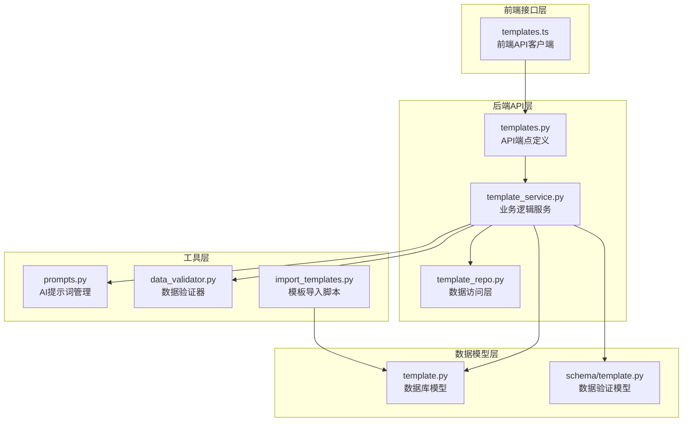
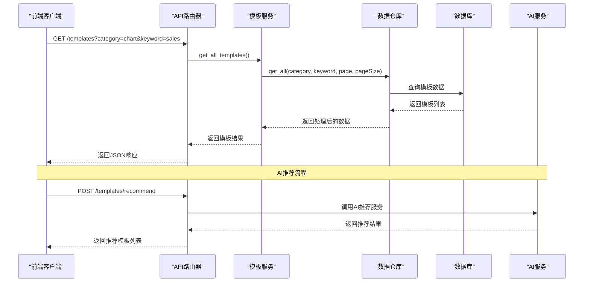
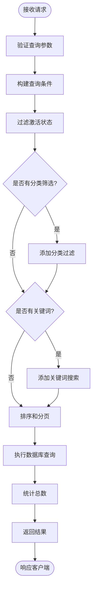
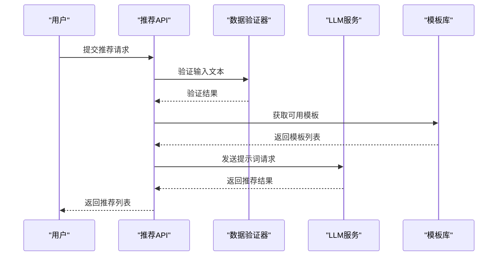
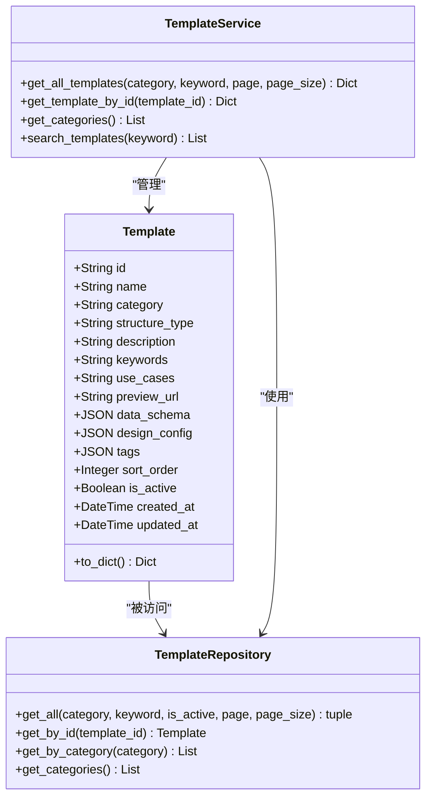
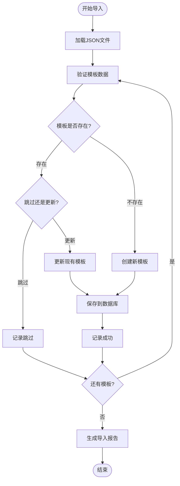

# 模板接口

<cite>
**本文档中引用的文件**
- [templates.py](file://backend/app/api/v1/templates.py)
- [template.py](file://backend/app/models/template.py)
- [template.py](file://backend/app/schemas/template.py)
- [template_service.py](file://backend/app/services/template_service.py)
- [template_repo.py](file://backend/app/repositories/template_repo.py)
- [templates.ts](file://frontend/src/api/templates.ts)
- [prompts.py](file://backend/app/utils/prompts.py)
- [common.py](file://backend/app/schemas/common.py)
- [data_validator.py](file://backend/app/services/data_validator.py)
- [import_templates.py](file://backend/scripts/import_templates.py)
- [types.ts](file://antv_infographic/infographic/src/templates/types.ts)
</cite>

## 目录
1. [简介](#简介)
2. [项目结构](#项目结构)
3. [核心组件](#核心组件)
4. [架构概览](#架构概览)
5. [详细端点分析](#详细端点分析)
6. [数据模型](#数据模型)
7. [模板注册机制](#模板注册机制)
8. [权限控制与验证](#权限控制与验证)
9. [性能考虑](#性能考虑)
10. [故障排除指南](#故障排除指南)
11. [结论](#结论)

## 简介

本文档详细介绍了AntV Infographic项目的模板接口系统，该系统提供了完整的信息图模板管理功能。模板接口支持模板的列表查询、详情获取、分类统计、AI推荐等功能，为用户提供丰富的信息图制作工具。

系统采用前后端分离架构，后端使用FastAPI框架提供RESTful API，前端通过Vue.js应用与后端进行交互。模板数据存储在数据库中，支持动态管理和扩展。

## 项目结构

模板接口系统的核心文件分布在以下目录结构中：



**图表来源**
- [templates.py](file://backend/app/api/v1/templates.py#L1-L99)
- [template_service.py](file://backend/app/services/template_service.py#L1-L281)
- [template_repo.py](file://backend/app/repositories/template_repo.py#L1-L144)

**章节来源**
- [templates.py](file://backend/app/api/v1/templates.py#L1-L99)
- [template_service.py](file://backend/app/services/template_service.py#L1-L281)
- [template_repo.py](file://backend/app/repositories/template_repo.py#L1-L144)

## 核心组件

### API路由器组件

模板接口的核心是FastAPI路由系统，提供了标准化的HTTP端点：

- **GET /api/v1/templates** - 模板列表查询
- **GET /api/v1/templates/{id}** - 单个模板详情
- **GET /api/v1/templates/categories** - 分类统计
- **POST /api/v1/templates/recommend** - AI模板推荐

### 服务层组件

模板服务层负责业务逻辑处理，包括：

- 模板检索和过滤
- 分类统计计算
- AI推荐算法集成
- 数据验证和转换

### 数据访问层组件

Repository模式实现了数据访问的抽象，支持：

- 分页查询
- 条件过滤
- 排序和统计
- 数据库连接管理

**章节来源**
- [templates.py](file://backend/app/api/v1/templates.py#L14-L99)
- [template_service.py](file://backend/app/services/template_service.py#L160-L281)
- [template_repo.py](file://backend/app/repositories/template_repo.py#L13-L144)

## 架构概览

模板接口系统采用分层架构设计，确保了良好的可维护性和扩展性：



**图表来源**
- [templates.py](file://backend/app/api/v1/templates.py#L17-L99)
- [template_service.py](file://backend/app/services/template_service.py#L170-L210)
- [template_repo.py](file://backend/app/repositories/template_repo.py#L25-L73)

## 详细端点分析

### GET /api/v1/templates - 模板列表查询

此端点提供分页的模板列表查询功能，支持多种筛选条件。

#### 查询参数

| 参数名 | 类型 | 必需 | 默认值 | 描述 |
|--------|------|------|--------|------|
| category | string | 否 | - | 按分类筛选（chart/comparison/hierarchy/list/quadrant/relationship/sequence） |
| keyword | string | 否 | - | 搜索关键词，支持名称、描述、适用场景模糊匹配 |
| page | integer | 否 | 1 | 页码，从1开始 |
| pageSize | integer | 否 | 20 | 每页数量，范围1-100 |

#### 请求示例

```bash
GET /api/v1/templates?category=chart&keyword=销售&page=1&pageSize=20
```

#### 响应结构

```json
{
  "success": true,
  "data": {
    "templates": [
      {
        "id": "sales-chart-bar",
        "name": "销售柱状图",
        "category": "chart",
        "description": "展示销售数据的柱状图模板",
        "useCases": "销售业绩、市场份额、产品销量",
        "previewUrl": "/assets/previews/sales-chart.png",
        "dataSchema": {...},
        "designConfig": {...},
        "tags": ["销售", "图表"],
        "sortOrder": 100,
        "isActive": true,
        "createdAt": "2024-01-01T00:00:00Z",
        "updatedAt": "2024-01-01T00:00:00Z"
      }
    ],
    "total": 150,
    "page": 1,
    "pageSize": 20
  },
  "message": "获取模板列表成功"
}
```

#### 实现流程



**图表来源**
- [templates.py](file://backend/app/api/v1/templates.py#L17-L39)
- [template_repo.py](file://backend/app/repositories/template_repo.py#L25-L73)

**章节来源**
- [templates.py](file://backend/app/api/v1/templates.py#L17-L39)
- [template_repo.py](file://backend/app/repositories/template_repo.py#L25-L73)

### GET /api/v1/templates/{id} - 模板详情查询

此端点返回指定ID的模板详细信息。

#### 路径参数

| 参数名 | 类型 | 必需 | 描述 |
|--------|------|------|------|
| template_id | string | 是 | 模板唯一标识符 |

#### 响应处理

- 如果模板存在，返回完整的模板数据
- 如果模板不存在，返回404错误

#### 实现细节

服务层通过模板ID查询数据库，自动过滤已禁用的模板。查询结果通过to_dict()方法转换为标准化的字典格式。

**章节来源**
- [templates.py](file://backend/app/api/v1/templates.py#L61-L74)
- [template_service.py](file://backend/app/services/template_service.py#L202-L217)

### GET /api/v1/templates/categories - 分类统计

此端点返回所有模板分类及其统计信息。

#### 分类体系

系统支持7大分类体系：

| 分类代码 | 中文名称 | 描述 | 示例场景 |
|----------|----------|------|----------|
| chart | 图表型 | 数值展示、统计图表 | 销售数据、用户增长、KPI指标 |
| comparison | 对比型 | 优劣对比、SWOT分析 | 产品对比、竞品分析、方案比较 |
| hierarchy | 层级型 | 组织架构、分类信息 | 公司架构、产品分类、知识体系 |
| list | 列表型 | 步骤说明、清单 | 产品功能、解决方案、特性列表 |
| quadrant | 四象限型 | 市场定位、风险评估 | 时间管理、优先级分类、SWOT分析 |
| relationship | 关系型 | 关系网络、关联分析 | 因果分析、业务流程、系统架构 |
| sequence | 顺序型 | 时间线、流程图 | 操作流程、项目进度、用户旅程 |

#### 响应结构

```json
{
  "success": true,
  "data": [
    {
      "code": "chart",
      "name": "图表型",
      "description": "数值展示,柱状图等可视化图表",
      "count": 45
    },
    {
      "code": "comparison",
      "name": "对比型", 
      "description": "优劣对比、SWOT分析",
      "count": 23
    }
  ],
  "message": "获取分类列表成功"
}
```

**章节来源**
- [templates.py](file://backend/app/api/v1/templates.py#L42-L58)
- [template_repo.py](file://backend/app/repositories/template_repo.py#L105-L144)

### POST /api/v1/templates/recommend - AI模板推荐

此端点使用AI算法为用户提供个性化的模板推荐。

#### 请求参数

| 参数名 | 类型 | 必需 | 默认值 | 描述 |
|--------|------|------|--------|------|
| text | string | 是 | - | 用户输入的文本内容 |
| maxRecommendations | integer | 否 | 5 | 最多推荐数量（1-10） |

#### 请求示例

```json
{
  "text": "分析2023年第四季度的销售数据，包括销售额、增长率和市场份额",
  "maxRecommendations": 3
}
```

#### 响应结构

```json
{
  "success": true,
  "data": {
    "recommendations": [
      {
        "templateId": "sales-chart-bar",
        "templateName": "销售柱状图",
        "confidence": 0.92,
        "reason": "文本包含具体数值和增长率信息，适合使用图表型模板展示销售数据",
        "category": "chart"
      }
    ],
    "analysisTime": 0.156
  },
  "message": "模板推荐成功"
}
```

#### AI推荐流程



**图表来源**
- [templates.py](file://backend/app/api/v1/templates.py#L77-L99)
- [prompts.py](file://backend/app/utils/prompts.py#L9-L128)

**章节来源**
- [templates.py](file://backend/app/api/v1/templates.py#L77-L99)
- [prompts.py](file://backend/app/utils/prompts.py#L9-L128)

## 数据模型

### 模板数据库模型

模板数据模型定义了完整的模板元数据结构：



**图表来源**
- [template.py](file://backend/app/models/template.py#L9-L54)
- [template_repo.py](file://backend/app/repositories/template_repo.py#L13-L144)
- [template_service.py](file://backend/app/services/template_service.py#L160-L281)

### 模板元数据结构

#### 核心字段说明

| 字段名 | 类型 | 必需 | 描述 |
|--------|------|------|------|
| id | string | 是 | 模板唯一标识符，长度不超过100字符 |
| name | string | 是 | 模板名称，中文显示，最大200字符 |
| category | string | 是 | 分类代码，必须为预定义的7种之一 |
| structure_type | string | 否 | AntV结构类型，如list-row、sequence-timeline |
| description | text | 否 | 模板描述信息 |
| keywords | text | 否 | 关键词列表，逗号分隔 |
| use_cases | text | 否 | 适用场景说明 |
| preview_url | string | 否 | 预览图URL，最大500字符 |
| data_schema | json | 是 | 数据结构Schema定义 |
| design_config | json | 是 | AntV设计配置 |
| tags | json | 否 | 标签数组 |
| sort_order | integer | 否 | 排序权重，默认0 |
| is_active | boolean | 否 | 是否启用，默认true |

#### 数据Schema示例

```json
{
  "description": "横向流程图，带箭头",
  "dataFields": {
    "title": {
      "type": "string", 
      "required": false, 
      "description": "标题"
    },
    "desc": {
      "type": "string", 
      "required": false, 
      "description": "描述"
    },
    "items": {
      "type": "array",
      "required": true,
      "description": "数据项列表",
      "itemSchema": {
        "label": {
          "type": "string", 
          "required": true, 
          "description": "步骤标签"
        },
        "desc": {
          "type": "string", 
          "required": false, 
          "description": "步骤描述"
        }
      }
    }
  }
}
```

#### 设计配置示例

```json
{
  "structure": {
    "type": "list-row",
    "direction": "horizontal"
  },
  "title": {
    "style": {
      "fontSize": 24,
      "fontWeight": "bold"
    }
  },
  "item": {
    "style": {
      "padding": 10,
      "borderRadius": 4
    },
    "icon": {
      "enabled": true,
      "size": 24
    }
  }
}
```

**章节来源**
- [template.py](file://backend/app/models/template.py#L9-L54)
- [prompts.py](file://backend/app/utils/prompts.py#L212-L247)

## 模板注册机制

### 前端模板注册

AntV Infographic使用注册机制管理模板：

```typescript
// 注册模板
registerTemplate('custom-template', {
  structure: { type: 'list-row' },
  title: 'default',
  item: 'simple'
});

// 获取模板
const template = getTemplate('custom-template');

// 获取所有模板
const templates = getTemplates();
```

### 后端模板导入

系统提供了完整的模板导入机制：

#### 导入流程



**图表来源**
- [import_templates.py](file://backend/scripts/import_templates.py#L48-L146)

#### 验证规则

模板导入时会进行严格的数据验证：

- 必填字段检查（id, name, category, data_schema, design_config）
- 分类有效性验证
- 数据类型和格式检查
- JSON结构完整性验证

**章节来源**
- [import_templates.py](file://backend/scripts/import_templates.py#L24-L45)
- [types.ts](file://antv_infographic/infographic/src/templates/types.ts#L1-L12)

## 权限控制与验证

### 数据验证机制

系统实现了多层次的数据验证：

#### 前端验证

前端API客户端提供基本的类型检查和参数验证：

```typescript
interface TemplateRecommendRequest {
  text: string;           // 必填，最小长度1
  maxRecommendations: number; // 默认5，范围1-10
}
```

#### 后端验证

后端使用Pydantic模型进行严格的数据验证：

```python
class TemplateRecommendRequest(BaseModel):
    text: str = Field(..., description="用户输入的文本内容", min_length=1)
    maxRecommendations: int = Field(5, description="最多推荐数量", ge=1, le=10)
```

#### 数据库验证

模板导入时的验证规则：

```python
def validate_template(template_data: dict) -> tuple[bool, str]:
    required_fields = ['id', 'name', 'category', 'data_schema', 'design_config']
    valid_categories = ['chart', 'comparison', 'hierarchy', 'list', 'quadrant', 'relation', 'sequence']
```

### 权限控制

#### 访问控制

- 所有模板查询自动过滤已禁用的模板（is_active=true）
- 分类统计包含每个分类的模板数量
- 模板详情查询支持软删除（已禁用的模板返回404）

#### 数据安全

- 输入参数严格验证，防止SQL注入
- JSON字段进行序列化验证
- 敏感信息（如设计配置）进行适当的脱敏处理

**章节来源**
- [template.py](file://backend/app/models/template.py#L9-L54)
- [template.py](file://backend/app/schemas/template.py#L8-L11)
- [import_templates.py](file://backend/scripts/import_templates.py#L24-L45)

## 性能考虑

### 查询优化

#### 索引策略

数据库表设计包含复合索引以优化查询性能：

```sql
CREATE INDEX idx_category_sort ON templates (category, sort_order);
```

#### 分页查询

- 支持大数据量的分页查询
- 默认每页20条记录，最大100条
- 使用OFFSET/LIMIT实现分页
- 统计总数时使用COUNT查询

#### 缓存策略

- 分类统计结果可以缓存
- 热门模板可以建立内存缓存
- AI推荐结果可以短期缓存

### 并发处理

- 数据库连接使用连接池管理
- 模板服务使用单例模式减少资源消耗
- 异步处理AI推荐请求

## 故障排除指南

### 常见问题

#### 模板查询无结果

**可能原因：**
- 分类参数错误
- 关键词拼写错误
- 模板已被禁用

**解决方法：**
- 检查分类代码是否正确
- 使用更宽泛的关键词
- 确认模板状态为激活

#### AI推荐失败

**可能原因：**
- LLM服务不可用
- 输入文本过短或格式错误
- 模板库为空

**解决方法：**
- 检查AI服务状态
- 确保输入文本至少1个字符
- 验证模板数据完整性

#### 模板导入失败

**可能原因：**
- JSON格式错误
- 必填字段缺失
- 数据库连接问题

**解决方法：**
- 验证JSON语法
- 检查必填字段
- 确认数据库连接

### 调试技巧

#### 日志分析

系统提供了详细的日志记录：

```python
logger.info(f"[TemplateService] 获取模板列表 - 分类: {category}, 关键词: {keyword}")
logger.warning(f"[DataValidator] 校验失败 - 模板: {template_id}, 错误: {errors}")
```

#### 性能监控

- 监控数据库查询时间
- 跟踪AI服务响应时间
- 分析API响应延迟

**章节来源**
- [template_repo.py](file://backend/app/repositories/template_repo.py#L25-L73)
- [data_validator.py](file://backend/app/services/data_validator.py#L11-L123)

## 结论

AntV Infographic的模板接口系统提供了完整而强大的信息图模板管理功能。系统采用现代化的架构设计，具备良好的可扩展性和维护性。

### 主要特性

- **完整的API覆盖**：支持模板的查询、详情、分类、推荐等所有核心功能
- **灵活的查询机制**：支持分类筛选、关键词搜索、分页查询
- **智能推荐**：集成AI算法，提供个性化模板推荐
- **严格的数据验证**：多层验证确保数据质量和系统稳定性
- **高效的性能表现**：优化的数据库查询和缓存策略

### 技术优势

- **前后端分离**：清晰的职责分工，便于团队协作
- **模块化设计**：各层职责明确，易于维护和扩展
- **类型安全**：使用TypeScript和Pydantic提供强类型支持
- **异步处理**：支持高并发请求处理

### 应用价值

该模板接口系统为用户提供了便捷的信息图制作体验，大大降低了信息可视化的门槛。通过AI智能推荐和丰富的模板库，用户可以快速创建专业级的信息图表，提升工作效率和数据表达效果。