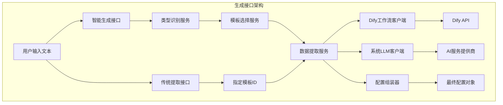
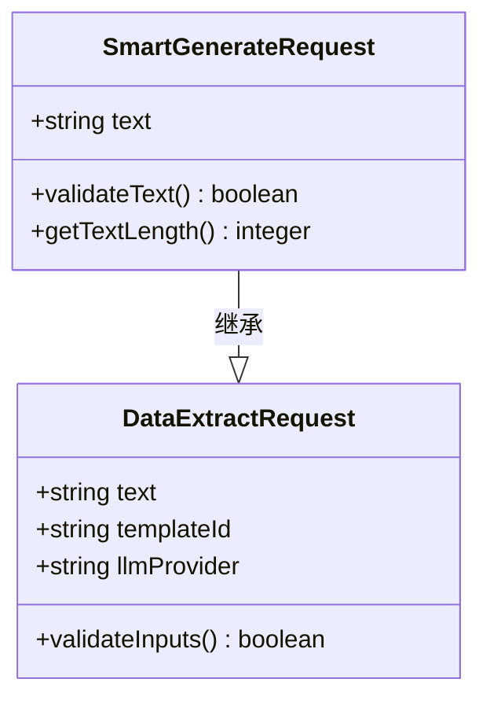
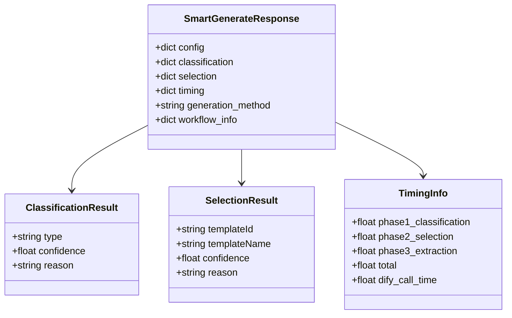
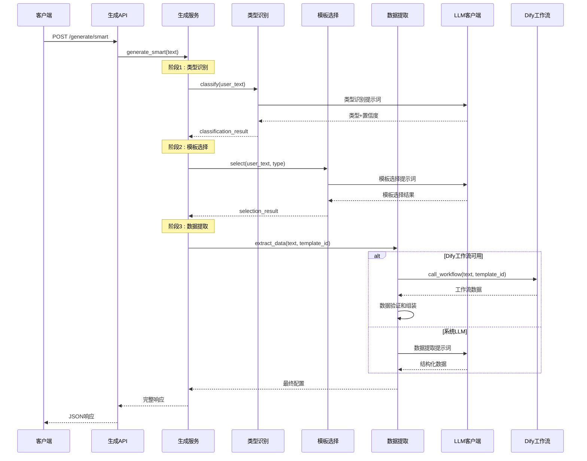
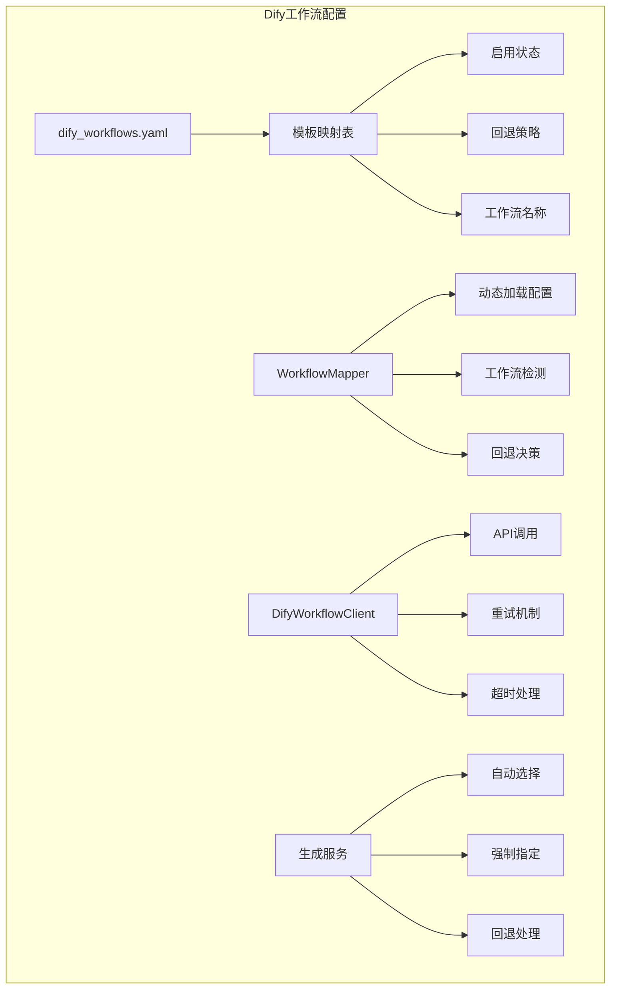
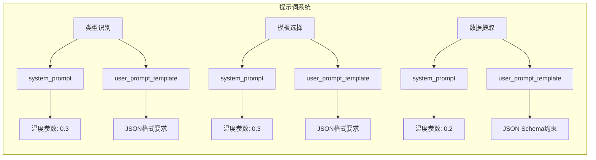
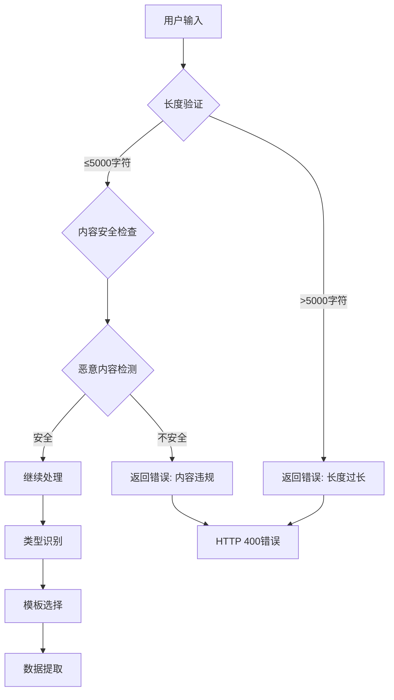
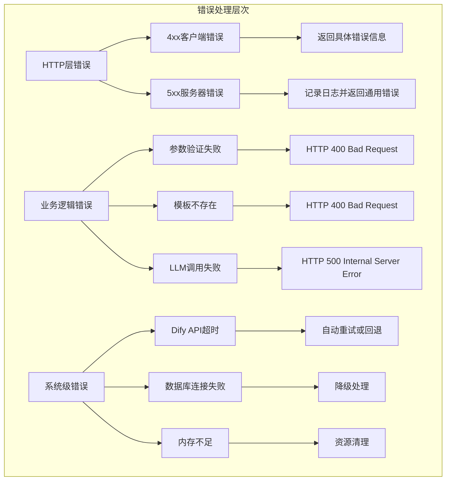

# 生成接口详细文档

<cite>
**本文档引用的文件**
- [generate.py](file://backend/app/api/v1/generate.py)
- [generate_service.py](file://backend/app/services/generate_service.py)
- [infographic.py](file://backend/app/schemas/infographic.py)
- [dify_workflows.yaml](file://backend/app/config/dify_workflows.yaml)
- [llm_prompts.yaml](file://backend/app/config/llm_prompts.yaml)
- [dify_workflow_client.py](file://backend/app/services/dify_workflow_client.py)
- [llm_client.py](file://backend/app/services/llm_client.py)
- [workflow_mapper.py](file://backend/app/services/workflow_mapper.py)
- [generate.ts](file://frontend/src/api/generate.ts)
- [test_smart_generation.py](file://tests/backend/test_smart_generation.py)
- [test_dify_integration.py](file://tests/backend/test_dify_integration.py)
</cite>

## 目录
1. [简介](#简介)
2. [接口概述](#接口概述)
3. [智能生成接口](#智能生成接口)
4. [传统数据提取接口](#传统数据提取接口)
5. [请求体结构详解](#请求体结构详解)
6. [响应结构详解](#响应结构详解)
7. [AI分析流程](#ai分析流程)
8. [Dify工作流集成](#dify工作流集成)
9. [LLM提示词工程](#llm提示词工程)
10. [安全过滤与长度限制](#安全过滤与长度限制)
11. [错误处理机制](#错误处理机制)
12. [使用示例](#使用示例)
13. [最佳实践](#最佳实践)

## 简介

生成接口是AntV Infographic系统的核心AI驱动组件，提供两种主要模式的信息图生成能力：智能生成模式和传统数据提取模式。该接口通过先进的LLM技术和Dify工作流集成，能够自动分析用户输入文本，识别内容类型，选择最适合的模板，并提取结构化数据生成高质量的信息图配置。

## 接口概述

生成接口提供以下核心功能：

- **智能生成模式**：三阶段自动化流程（类型识别→模板选择→数据提取）
- **传统模式**：基于指定模板ID的数据提取
- **多LLM提供商支持**：系统LLM和Dify工作流双重保障
- **模板推荐**：AI驱动的模板选择建议
- **性能监控**：详细的阶段耗时统计



**图表来源**
- [generate.py](file://backend/app/api/v1/generate.py#L1-L116)
- [generate_service.py](file://backend/app/services/generate_service.py#L33-L465)

## 智能生成接口

### 端点地址
```
POST /api/v1/generate/smart
```

### 功能描述
智能生成接口采用三阶段流程，自动完成从文本分析到信息图配置的完整生成过程。

### 请求参数

| 参数名 | 类型 | 必填 | 描述 | 示例 |
|--------|------|------|------|------|
| text | string | 是 | 用户输入的文本内容 | "2023年各城市销售额：北京1000万元，上海1200万元，广州800万元，深圳900万元。" |

### 响应结构

```json
{
  "success": true,
  "data": {
    "config": {
      "template": "bar-chart-vertical",
      "data": {
        "title": "2023年各城市销售额",
        "items": [
          {
            "label": "北京",
            "desc": "1000万元",
            "value": 1000
          },
          {
            "label": "上海",
            "desc": "1200万元",
            "value": 1200
          }
        ]
      },
      "themeConfig": {
        "palette": "antv"
      }
    },
    "classification": {
      "type": "chart",
      "confidence": 0.95,
      "reason": "文本包含明确的数值数据和城市对比，适合使用图表展示"
    },
    "selection": {
      "templateId": "bar-chart-vertical",
      "templateName": "垂直柱状图",
      "confidence": 0.92,
      "reason": "适合展示多个城市的数值对比"
    },
    "timing": {
      "phase1_classification": 0.45,
      "phase2_selection": 0.32,
      "phase3_extraction": 1.23,
      "total": 2.00
    },
    "generation_method": "dify_workflow"
  },
  "message": "智能生成成功"
}
```

**章节来源**
- [generate.py](file://backend/app/api/v1/generate.py#L31-L60)
- [generate_service.py](file://backend/app/services/generate_service.py#L47-L118)

## 传统数据提取接口

### 端点地址
```
POST /api/v1/generate/extract
```

### 功能描述
传统提取接口允许用户指定模板ID，直接从文本中提取结构化数据。

### 请求参数

| 参数名 | 类型 | 必填 | 描述 | 默认值 | 示例 |
|--------|------|------|------|--------|------|
| text | string | 是 | 用户输入的文本内容 | - | "产品A的优势：价格便宜、功能丰富。产品B的优势：性能更好、界面更美观" |
| templateId | string | 是 | 指定的模板ID | - | "comparison-column" |
| llmProvider | string | 否 | LLM提供商选择 | system | "system" 或 "dify" |

### 响应结构

```json
{
  "success": true,
  "data": {
    "config": {
      "template": "comparison-column",
      "data": {
        "title": "产品对比分析",
        "items": [
          {
            "label": "产品A",
            "desc": "价格便宜、功能丰富"
          },
          {
            "label": "产品B",
            "desc": "性能更好、界面更美观"
          }
        ]
      },
      "themeConfig": {
        "palette": "antv"
      }
    },
    "extractionTime": 1.56,
    "generation_method": "system_llm"
  },
  "message": "数据提取成功"
}
```

**章节来源**
- [generate.py](file://backend/app/api/v1/generate.py#L62-L88)
- [infographic.py](file://backend/app/schemas/infographic.py#L8-L22)

## 请求体结构详解

### 智能生成请求结构



**图表来源**
- [generate.py](file://backend/app/api/v1/generate.py#L18-L28)
- [infographic.py](file://backend/app/schemas/infographic.py#L8-L22)

### 输入验证规则

| 验证类型 | 规则 | 错误处理 |
|----------|------|----------|
| 文本长度 | 最小1字符，最大5000字符 | HTTP 400 Bad Request |
| 模板ID | 必须存在于可用模板列表中 | HTTP 400 Bad Request |
| LLM提供商 | 仅允许 'system' 或 'dify' | HTTP 400 Bad Request |

**章节来源**
- [infographic.py](file://backend/app/schemas/infographic.py#L10-L15)

## 响应结构详解

### 智能生成响应结构



**图表来源**
- [generate.py](file://backend/app/api/v1/generate.py#L23-L29)
- [generate_service.py](file://backend/app/services/generate_service.py#L91-L117)

### 响应字段说明

| 字段名 | 类型 | 描述 | 示例值 |
|--------|------|------|--------|
| config | object | AntV Infographic配置对象 | 包含template、data、themeConfig的完整配置 |
| classification | object | 类型识别结果 | {type: "chart", confidence: 0.95, reason: "..."} |
| selection | object | 模板选择结果 | {templateId: "bar-chart-vertical", confidence: 0.92} |
| timing | object | 性能统计信息 | {phase1: 0.45, phase2: 0.32, total: 2.00} |
| generation_method | string | 数据生成方式 | "dify_workflow" 或 "system_llm" |
| workflow_info | object | Dify工作流信息 | 工作流名称和运行ID（仅Dify模式） |

**章节来源**
- [generate_service.py](file://backend/app/services/generate_service.py#L91-L117)

## AI分析流程

### 三阶段智能生成流程



**图表来源**
- [generate_service.py](file://backend/app/services/generate_service.py#L47-L118)

### 类型识别算法

系统采用基于规则的类型识别算法，支持以下七种信息图类型：

| 类型代码 | 特征描述 | 关键词 | 适用场景 |
|----------|----------|--------|----------|
| chart | 图表型 | 数据、增长率、比例、百分比 | 销售数据、用户增长、KPI指标 |
| comparison | 对比型 | VS、对比、优劣势、差异 | 产品对比、竞品分析 |
| hierarchy | 层级型 | 组织架构、层级、分类、体系 | 公司架构、产品分类 |
| list | 列表型 | 要点、步骤、特性、功能 | 产品功能、解决方案 |
| quadrant | 四象限型 | 矩阵、象限、维度、重要紧急 | 时间管理、SWOT分析 |
| relationship | 关系型 | 关系、因果、影响、联系 | 因果分析、业务流程 |
| sequence | 顺序型 | 步骤、流程、过程、顺序 | 操作流程、项目进度 |

**章节来源**
- [llm_prompts.yaml](file://backend/app/config/llm_prompts.yaml#L4-L88)

## Dify工作流集成

### 工作流配置架构



**图表来源**
- [dify_workflows.yaml](file://backend/app/config/dify_workflows.yaml#L1-L81)
- [workflow_mapper.py](file://backend/app/services/workflow_mapper.py#L13-L157)

### 工作流切换机制

系统支持三种LLM提供商模式：

| 模式 | 描述 | 使用场景 | 性能特点 |
|------|------|----------|----------|
| 自动模式 | 根据配置自动选择 | 生产环境推荐 | 平衡性能和准确性 |
| 系统LLM | 直接调用系统AI服务 | 简单任务、快速响应 | 低延迟、成本可控 |
| Dify工作流 | 使用Dify工作流处理 | 复杂任务、高质量输出 | 高质量、稳定性好 |

### 工作流配置参数

```yaml
# Dify工作流配置示例
bar-chart-vertical:
  dify_app_id: null  # 使用环境变量中的默认DIFY_API_KEY
  workflow_name: "垂直柱状图数据生成工作流"
  enabled: true      # 是否启用该工作流
  fallback_to_system_llm: true  # 失败时是否回退到系统LLM
```

**章节来源**
- [dify_workflows.yaml](file://backend/app/config/dify_workflows.yaml#L5-L14)
- [workflow_mapper.py](file://backend/app/services/workflow_mapper.py#L49-L105)

## LLM提示词工程

### 提示词架构设计



**图表来源**
- [llm_prompts.yaml](file://backend/app/config/llm_prompts.yaml#L1-L201)

### 关键提示词模板

#### 类型识别提示词
- **系统角色**：专业信息图分类专家
- **识别重点**：数值数据、对比关系、层级结构
- **置信度评估**：0.9-1.0（高度匹配）、0.7-0.9（较好匹配）、0.5-0.7（可以使用）、<0.5（不推荐）

#### 模板选择提示词
- **匹配策略**：数据结构匹配度、视觉复杂度、数据项数量
- **特殊规则**：层级型优先选择带badge或card的模板
- **布局建议**：2-3项用row/column，4-6项用grid/steps，7项以上用list/timeline

#### 数据提取提示词
- **结构化要求**：严格遵循JSON Schema
- **字段规范**：title、desc、items数组的标准格式
- **默认值处理**：合理推断缺失字段的默认值

**章节来源**
- [llm_prompts.yaml](file://backend/app/config/llm_prompts.yaml#L4-L88)
- [llm_prompts.yaml](file://backend/app/config/llm_prompts.yaml#L93-L139)
- [llm_prompts.yaml](file://backend/app/config/llm_prompts.yaml#L141-L201)

## 安全过滤与长度限制

### 输入验证策略



### 安全过滤规则

| 过滤类型 | 规则描述 | 处理方式 |
|----------|----------|----------|
| 长度限制 | 最大5000字符 | 截断或拒绝 |
| SQL注入 | 检测SQL关键字 | 拒绝执行 |
| XSS攻击 | 检测脚本标签 | 清理内容 |
| 敏感词汇 | 预定义敏感词库 | 替换或拒绝 |
| 文件上传 | 禁止二进制内容 | 验证文本格式 |

### 前端输入限制

前端层面也实施了输入限制：

```typescript
// 前端输入限制示例
<textarea
  v-model="inputText"
  :maxlength="5000"
/>
```

**章节来源**
- [generate.py](file://backend/app/api/v1/generate.py#L18-L28)
- [infographic.py](file://backend/app/schemas/infographic.py#L10-L11)

## 错误处理机制

### 异常分类处理



### 错误响应格式

```json
{
  "success": false,
  "data": null,
  "message": "错误描述信息",
  "error": "具体的错误类型"
}
```

### 重试机制

| 场景 | 重试次数 | 间隔时间 | 策略 |
|------|----------|----------|------|
| Dify API调用 | 3次 | 1秒 | 指数退避 |
| LLM API调用 | 2次 | 0.5秒 | 线性递增 |
| 数据库查询 | 3次 | 2秒 | 固定间隔 |
| 文件读取 | 2次 | 1秒 | 简单重试 |

**章节来源**
- [dify_workflow_client.py](file://backend/app/services/dify_workflow_client.py#L31-L133)
- [llm_client.py](file://backend/app/services/llm_client.py#L30-L92)

## 使用示例

### 智能生成示例

#### 成功案例
```bash
curl -X POST "http://localhost:8000/api/v1/generate/smart" \
  -H "Content-Type: application/json" \
  -d '{
    "text": "2023年各城市销售额：北京1000万元，上海1200万元，广州800万元，深圳900万元。"
  }'
```

#### 响应示例
```json
{
  "success": true,
  "data": {
    "config": {
      "template": "bar-chart-vertical",
      "data": {
        "title": "2023年各城市销售额",
        "items": [
          {
            "label": "北京",
            "desc": "1000万元",
            "value": 1000
          },
          {
            "label": "上海",
            "desc": "1200万元",
            "value": 1200
          }
        ]
      },
      "themeConfig": {
        "palette": "antv"
      }
    },
    "classification": {
      "type": "chart",
      "confidence": 0.95,
      "reason": "文本包含明确的数值数据和城市对比，适合使用图表展示"
    },
    "selection": {
      "templateId": "bar-chart-vertical",
      "templateName": "垂直柱状图",
      "confidence": 0.92,
      "reason": "适合展示多个城市的数值对比"
    },
    "timing": {
      "phase1_classification": 0.45,
      "phase2_selection": 0.32,
      "phase3_extraction": 1.23,
      "total": 2.00
    },
    "generation_method": "dify_workflow"
  },
  "message": "智能生成成功"
}
```

### 传统提取示例

#### 成功案例
```bash
curl -X POST "http://localhost:8000/api/v1/generate/extract" \
  -H "Content-Type: application/json" \
  -d '{
    "text": "产品A的优势：价格便宜、功能丰富。产品B的优势：性能更好、界面更美观",
    "templateId": "comparison-column"
  }'
```

#### AI处理失败案例
```json
{
  "success": false,
  "data": null,
  "message": "AI处理失败",
  "error": "Dify工作流调用失败：API响应超时"
}
```

### 前端调用示例

```typescript
// 智能生成调用
import { generateAPI } from '@/api/generate'

async function analyzeAndGenerate(text: string) {
  try {
    const response = await generateAPI.smartGenerate(text)
    if (response.success) {
      const { config, classification, selection } = response.data
      console.log('生成成功:', config)
      console.log('类型识别:', classification)
      console.log('模板选择:', selection)
    }
  } catch (error) {
    console.error('生成失败:', error.message)
  }
}

// 传统提取调用
async function extractWithTemplate(text: string, templateId: string) {
  try {
    const response = await generateAPI.extractData(text, templateId)
    if (response.success) {
      console.log('提取成功:', response.data.config)
    }
  } catch (error) {
    console.error('提取失败:', error.message)
  }
}
```

**章节来源**
- [test_smart_generation.py](file://tests/backend/test_smart_generation.py#L28-L49)
- [test_dify_integration.py](file://tests/backend/test_dify_integration.py#L14-L50)
- [generate.ts](file://frontend/src/api/generate.ts#L8-L25)

## 最佳实践

### 输入文本优化建议

1. **清晰表达**：提供具体、明确的业务场景描述
2. **结构化信息**：使用分号、逗号等分隔符组织数据
3. **避免歧义**：明确指出对比对象、时间范围等关键信息
4. **适当长度**：保持在100-2000字符之间获得最佳效果

### 模板选择指南

| 场景类型 | 推荐模板 | 置信度阈值 | 注意事项 |
|----------|----------|------------|----------|
| 销售数据 | bar-chart-vertical | >0.8 | 确保有明确的数值对比 |
| 产品对比 | comparison-column | >0.7 | 使用"vs"或"对比"关键词 |
| 组织架构 | org-tree | >0.8 | 包含层级关系描述 |
| 时间流程 | timeline-horizontal | >0.7 | 明确的时间顺序 |
| 功能列表 | list-column-simple | >0.6 | 简单的项目列举 |

### 性能优化建议

1. **批量处理**：对于大量相似文本，考虑批量处理
2. **缓存策略**：对重复的文本内容实施缓存
3. **异步调用**：使用异步方式避免阻塞主线程
4. **超时设置**：合理设置API调用超时时间

### 错误恢复策略

1. **自动重试**：对临时性错误实施指数退避重试
2. **降级处理**：Dify失败时自动切换到系统LLM
3. **用户提示**：提供友好的错误信息和解决建议
4. **日志记录**：详细记录错误信息便于问题排查

**章节来源**
- [generate_service.py](file://backend/app/services/generate_service.py#L124-L157)
- [workflow_mapper.py](file://backend/app/services/workflow_mapper.py#L90-L105)