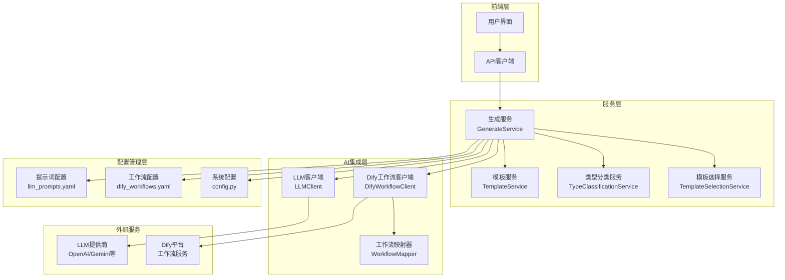
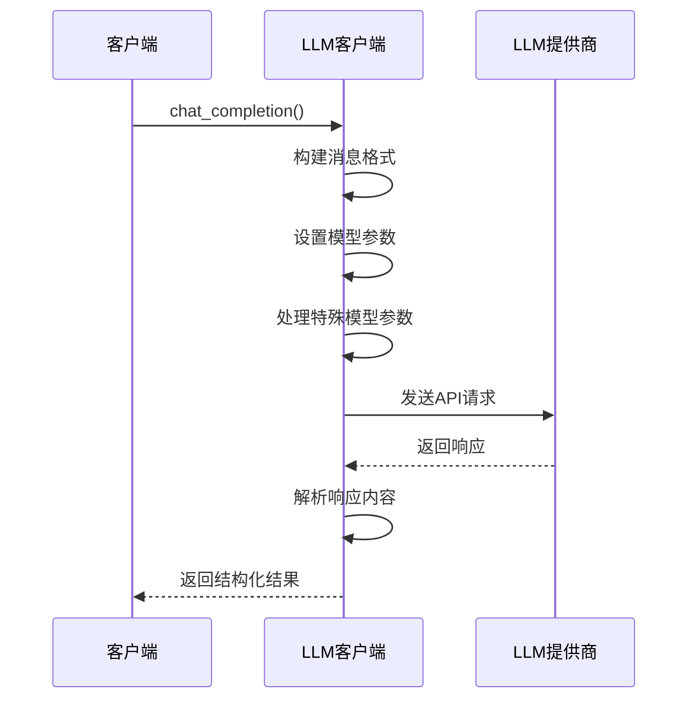
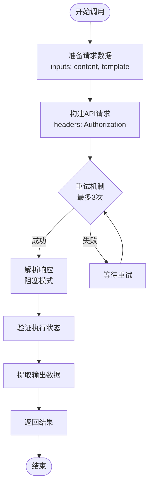
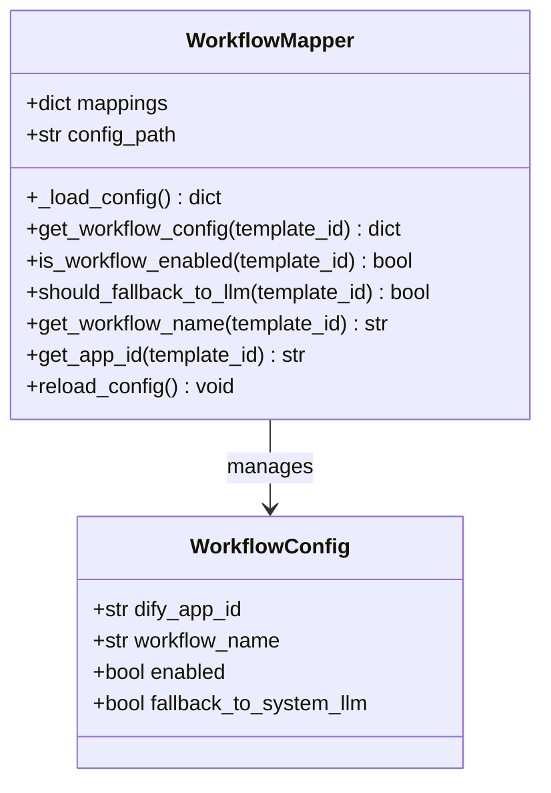
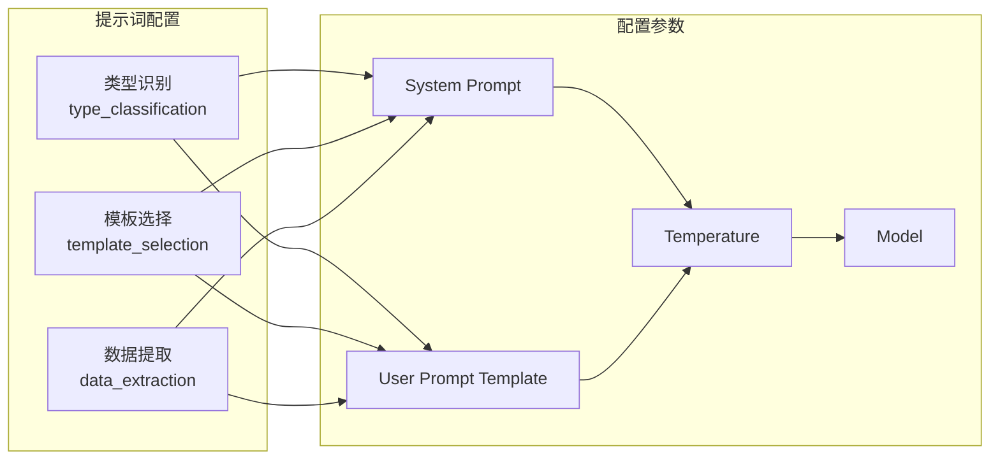
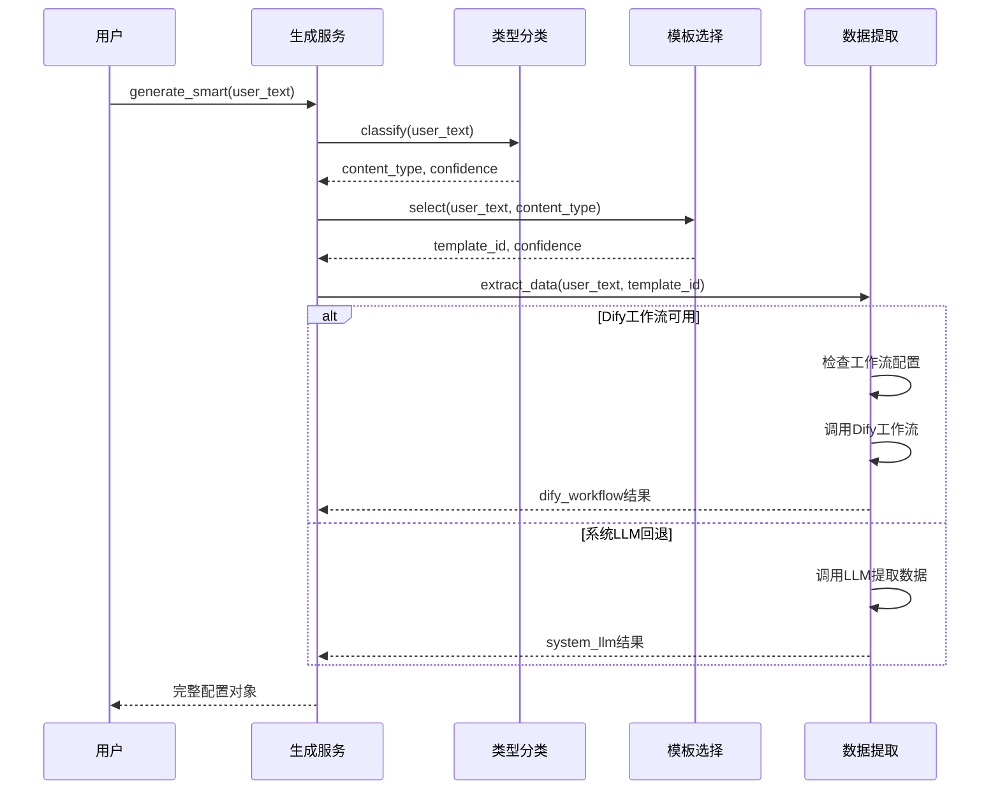
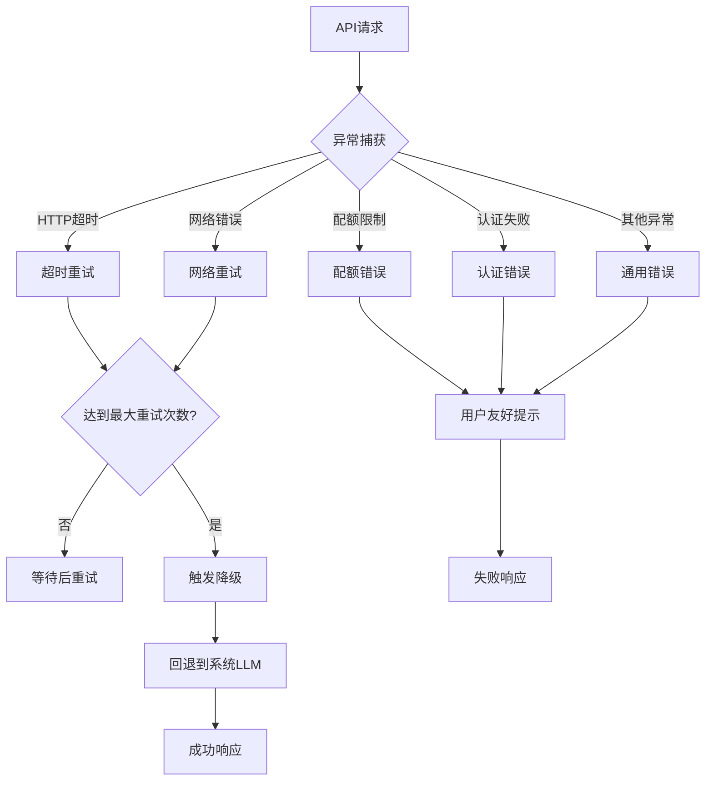
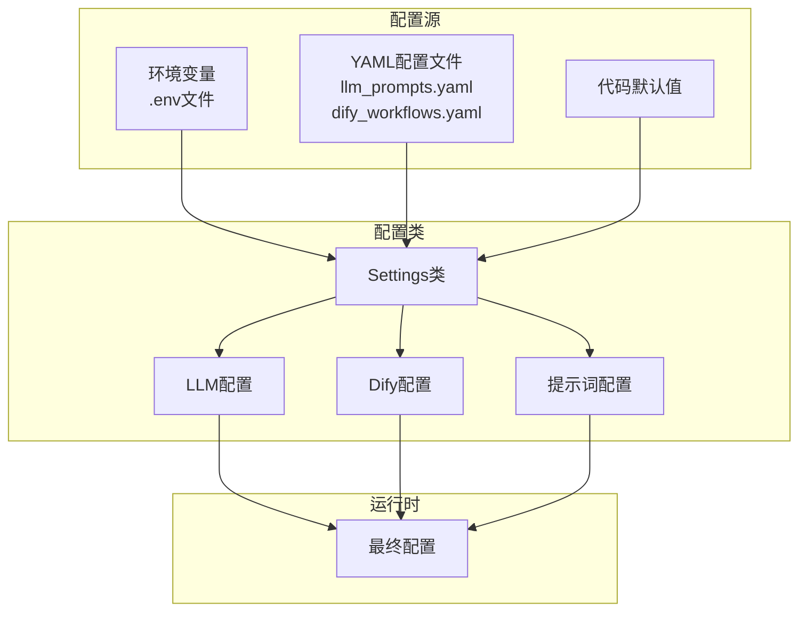

# AI集成服务

<cite>
**本文档引用的文件**
- [llm_client.py](file://backend/app/services/llm_client.py)
- [dify_workflow_client.py](file://backend/app/services/dify_workflow_client.py)
- [workflow_mapper.py](file://backend/app/services/workflow_mapper.py)
- [generate_service.py](file://backend/app/services/generate_service.py)
- [prompts.py](file://backend/app/utils/prompts.py)
- [llm_prompts.yaml](file://backend/app/config/llm_prompts.yaml)
- [dify_workflows.yaml](file://backend/app/config/dify_workflows.yaml)
- [config.py](file://backend/app/config.py)
- [test_dify_integration.py](file://tests/backend/test_dify_integration.py)
- [test_dify_simple.py](file://tests/backend/test_dify_simple.py)
</cite>

## 目录
1. [简介](#简介)
2. [系统架构概览](#系统架构概览)
3. [LLM客户端服务](#llm客户端服务)
4. [Dify工作流客户端](#dify工作流客户端)
5. [工作流映射管理器](#工作流映射管理器)
6. [提示词管理系统](#提示词管理系统)
7. [生成服务流程](#生成服务流程)
8. [错误处理与降级策略](#错误处理与降级策略)
9. [配置管理](#配置管理)
10. [实际调用示例](#实际调用示例)
11. [性能优化建议](#性能优化建议)
12. [故障排除指南](#故障排除指南)

## 简介

AI集成服务是一个综合性的智能信息图生成系统，通过整合多种AI服务提供商的能力，为用户提供智能化的数据可视化解决方案。该系统采用分层架构设计，支持多种LLM提供商和Dify工作流平台，具备完善的错误处理、超时控制和降级机制。

核心功能包括：
- **智能模板推荐**：基于用户输入自动推荐最适合的信息图模板
- **结构化数据提取**：从自然语言中提取结构化数据并转换为可视化配置
- **多提供商支持**：支持多种LLM服务提供商和Dify工作流平台
- **智能降级机制**：当主要服务不可用时自动回退到备用方案
- **实时监控与日志**：完整的调用链路追踪和性能监控

## 系统架构概览



**图表来源**
- [generate_service.py](file://backend/app/services/generate_service.py#L33-L46)
- [llm_client.py](file://backend/app/services/llm_client.py#L14-L28)
- [dify_workflow_client.py](file://backend/app/services/dify_workflow_client.py#L15-L30)

## LLM客户端服务

LLM客户端是系统的核心AI服务封装，负责与各种大型语言模型提供商的通信。它提供了统一的接口来处理不同LLM提供商的API调用。

### 核心特性

#### 1. 多模型支持
- **推荐模型**：用于模板推荐和智能分析（默认：gpt-4o-mini）
- **提取模型**：专门用于结构化数据提取（默认：gpt-4o-mini）
- **推理模型兼容**：支持o1系列推理模型的特殊参数

#### 2. 请求构建机制


**图表来源**
- [llm_client.py](file://backend/app/services/llm_client.py#L30-L78)

#### 3. 方法详解

##### 通用聊天补全
- **功能**：执行标准的对话式AI交互
- **参数**：支持温度控制、响应格式、推理强度等高级参数
- **模型适配**：自动处理不同模型的参数差异

##### 模板推荐
- **输入**：用户文本和可用模板列表
- **输出**：按置信度排序的推荐模板
- **JSON格式**：确保返回结果的结构化

##### 数据提取
- **用途**：从非结构化文本中提取结构化数据
- **验证**：自动验证提取结果的完整性
- **转换**：支持树形结构等复杂数据格式

**章节来源**
- [llm_client.py](file://backend/app/services/llm_client.py#L30-L217)

### 错误处理机制

LLM客户端实现了完善的错误处理策略：

| 错误类型 | 处理方式 | 用户反馈 |
|---------|---------|---------|
| API超时 | 重试机制 | "AI服务请求超时，请稍后重试" |
| 配额限制 | 立即失败 | "AI服务配额已用完，请联系管理员" |
| 认证失败 | 立即失败 | "AI服务调用失败" |
| 网络错误 | 重试机制 | "网络连接异常，请检查网络设置" |

## Dify工作流客户端

Dify工作流客户端专门负责与Dify平台的集成，提供高效的工作流调用能力。

### 核心功能

#### 1. 工作流调用流程


**图表来源**
- [dify_workflow_client.py](file://backend/app/services/dify_workflow_client.py#L31-L132)

#### 2. 配置参数

| 参数 | 默认值 | 说明 |
|------|--------|------|
| 基础URL | http://dify-uat.42lab.cn/v1 | Dify API基础地址 |
| API密钥 | 环境变量 | 认证令牌 |
| 超时时间 | 30秒 | 请求超时限制 |
| 响应模式 | blocking | 阻塞模式调用 |

#### 3. 响应处理

Dify工作流客户端能够处理多种响应状态：

- **成功状态**：返回工作流生成的数据
- **失败状态**：抛出详细错误信息
- **异常状态**：记录日志并返回默认值

**章节来源**
- [dify_workflow_client.py](file://backend/app/services/dify_workflow_client.py#L15-L196)

## 工作流映射管理器

工作流映射管理器负责维护模板ID与Dify工作流之间的映射关系，提供灵活的工作流配置管理。

### 配置结构



**图表来源**
- [workflow_mapper.py](file://backend/app/services/workflow_mapper.py#L13-L157)

### 配置选项

每个模板的工作流配置包含以下字段：

| 字段 | 类型 | 说明 |
|------|------|------|
| dify_app_id | string/null | Dify应用ID，null使用默认密钥 |
| workflow_name | string | 工作流显示名称 |
| enabled | boolean | 是否启用该工作流 |
| fallback_to_system_llm | boolean | 失败时是否回退到系统LLM |

**章节来源**
- [workflow_mapper.py](file://backend/app/services/workflow_mapper.py#L13-L157)

## 提示词管理系统

提示词管理系统通过YAML配置文件定义了不同类型AI任务的提示词模板，确保AI服务的一致性和专业性。

### 配置文件结构



**图表来源**
- [llm_prompts.yaml](file://backend/app/config/llm_prompts.yaml#L1-L201)

### 主要提示词类型

#### 1. 类型识别提示词
- **用途**：识别用户输入的文本属于哪种信息图类型
- **支持类型**：图表型、对比型、层级型、列表型、四象限型、关系型、顺序型
- **输出格式**：JSON包含类型代码、置信度和判定理由

#### 2. 模板选择提示词
- **用途**：从可用模板中选择最适合的一个
- **决策因素**：数据匹配度、视觉复杂度、数据项数量、特殊特征
- **优先规则**：层级型优先选择带badge或card的模板

#### 3. 数据提取提示词
- **用途**：从文本中提取结构化数据
- **输出格式**：符合AntV Infographic标准的配置对象
- **字段要求**：title、desc、items数组等

**章节来源**
- [llm_prompts.yaml](file://backend/app/config/llm_prompts.yaml#L1-L201)

## 生成服务流程

生成服务是整个AI集成系统的核心协调器，实现了智能信息图生成的三阶段流程。

### 三阶段生成流程



**图表来源**
- [generate_service.py](file://backend/app/services/generate_service.py#L47-L118)

### 数据提取策略

生成服务采用智能的数据提取策略：

#### 1. 自动选择机制
- **优先级**：Dify工作流 → 系统LLM
- **条件**：检查工作流是否启用且可用
- **降级**：工作流失败时自动回退到系统LLM

#### 2. 强制模式
- **system**：强制使用系统LLM
- **dify**：强制使用Dify工作流（失败则抛出异常）

#### 3. 结构类型转换
对于不支持的结构类型，系统会自动转换为兼容的模板：

| 原类型 | 转换后 | 说明 |
|--------|--------|------|
| timeline-horizontal | list-row-horizontal-icon-arrow | 时间轴转流程图 |
| comparison-column | list-column-simple | 对比图转简单列表 |
| quadrant-swot | pyramid-layer | 四象限转金字塔 |
| mindmap-radial | org-tree | 思维导图转组织架构 |

**章节来源**
- [generate_service.py](file://backend/app/services/generate_service.py#L159-L465)

## 错误处理与降级策略

系统实现了多层次的错误处理和降级机制，确保服务的高可用性。

### 错误处理层次



**图表来源**
- [dify_workflow_client.py](file://backend/app/services/dify_workflow_client.py#L80-L132)
- [llm_client.py](file://backend/app/services/llm_client.py#L81-L92)

### 降级策略

#### 1. Dify工作流降级
- **触发条件**：工作流调用失败、超时、返回无效数据
- **降级动作**：自动切换到系统LLM数据提取
- **配置控制**：可通过dify_workflows.yaml配置回退行为

#### 2. LLM服务降级
- **触发条件**：API调用失败、配额不足、认证错误
- **降级动作**：返回默认配置或空数据
- **用户通知**：提供清晰的错误信息

#### 3. 配置热更新
- **工作流映射**：支持动态重新加载配置
- **提示词配置**：无需重启即可更新提示词模板
- **日志级别**：支持运行时调整日志详细程度

**章节来源**
- [generate_service.py](file://backend/app/services/generate_service.py#L238-L245)
- [workflow_mapper.py](file://backend/app/services/workflow_mapper.py#L138-L142)

## 配置管理

系统采用分层配置管理，支持环境变量、配置文件和运行时参数的灵活组合。

### 配置层次结构



**图表来源**
- [config.py](file://backend/app/config.py#L9-L51)

### 主要配置项

#### LLM服务配置
| 配置项 | 默认值 | 说明 |
|--------|--------|------|
| AIHUBMIX_API_KEY | "" | LLM提供商API密钥 |
| AIHUBMIX_BASE_URL | https://aihubmix.com/v1 | API基础URL |
| AIHUBMIX_MODEL_RECOMMEND | gpt-4o-mini | 模板推荐模型 |
| AIHUBMIX_MODEL_EXTRACT | gpt-4o-mini | 数据提取模型 |
| AIHUBMIX_TIMEOUT | 30 | 请求超时（秒） |
| AIHUBMIX_MAX_RETRIES | 3 | 最大重试次数 |

#### Dify工作流配置
| 配置项 | 默认值 | 说明 |
|--------|--------|------|
| DIFY_API_BASE_URL | http://dify-uat.42lab.cn/v1 | Dify API地址 |
| DIFY_API_KEY | "" | Dify API密钥 |
| DIFY_API_TIMEOUT | 30 | 请求超时（秒） |
| DIFY_RESPONSE_MODE | blocking | 响应模式 |

**章节来源**
- [config.py](file://backend/app/config.py#L9-L51)

## 实际调用示例

以下是系统中常见的AI服务调用示例，展示了不同场景下的使用方式。

### 基础LLM调用

```python
# 获取LLM客户端实例
llm_client = get_llm_client()

# 推荐模板
recommendations = await llm_client.recommend_templates(
    user_text="2023年各城市销售额数据",
    available_templates=templates,
    max_recommendations=5
)

# 提取结构化数据
data = await llm_client.extract_structured_data(
    user_text="产品A功能介绍：1.智能推荐 2.数据分析 3.用户界面",
    template_id="list-column-simple",
    template_schema=schema
)
```

### Dify工作流调用

```python
# 获取Dify客户端实例
dify_client = get_dify_workflow_client()

# 调用工作流
result = await dify_client.call_workflow(
    user_text="项目开发流程：需求分析-设计-开发-测试-上线",
    template_id="list-row-horizontal-icon-arrow",
    max_retries=3
)
```

### 生成服务调用

```python
# 获取生成服务实例
generate_service = get_generate_service()

# 智能生成流程
result = await generate_service.generate_smart(
    user_text="2023年公司组织架构：CEO-部门经理-员工"
)

# 强制使用Dify工作流
result = await generate_service.extract_data(
    user_text="产品功能对比：A产品vsB产品",
    template_id="comparison-column",
    force_provider='dify'
)
```

### 测试用例

系统提供了完整的测试用例来验证AI集成服务的功能：

```python
# 运行Dify集成测试
async def test_dify_integration():
    service = get_generate_service()
    result = await service.extract_data(
        user_text="2023年各城市销售额：北京1000万元，上海1200万元",
        template_id="bar-chart-vertical"
    )
    assert result['generation_method'] == 'dify_workflow'
```

**章节来源**
- [test_dify_integration.py](file://tests/backend/test_dify_integration.py#L14-L64)
- [test_dify_simple.py](file://tests/backend/test_dify_simple.py#L12-L41)

## 性能优化建议

为了确保AI集成服务的最佳性能，建议采取以下优化措施：

### 1. 缓存策略
- **模板缓存**：缓存常用模板的配置信息
- **提示词缓存**：预加载常用的提示词模板
- **工作流配置缓存**：避免频繁读取配置文件

### 2. 并发控制
- **连接池**：使用连接池管理HTTP请求
- **请求限流**：避免对LLM提供商造成过大压力
- **异步处理**：充分利用异步I/O提高并发性能

### 3. 超时优化
- **合理设置超时**：根据网络状况调整超时时间
- **渐进式重试**：采用指数退避算法
- **资源清理**：及时释放不再使用的资源

### 4. 监控指标
- **响应时间**：监控各环节的处理时间
- **成功率**：跟踪API调用的成功率
- **错误分布**：分析错误类型和频率

## 故障排除指南

### 常见问题及解决方案

#### 1. Dify工作流调用失败
**症状**：工作流返回错误或超时
**排查步骤**：
1. 检查DIFY_API_KEY是否正确配置
2. 验证网络连接和防火墙设置
3. 确认工作流在Dify平台上的状态
4. 检查模板ID是否在配置中启用

**解决方案**：
```python
# 启用调试日志
import logging
logging.getLogger('app.services.dify_workflow_client').setLevel(logging.DEBUG)

# 手动测试工作流
client = get_dify_workflow_client()
result = await client.call_workflow("测试文本", "chart-column-simple")
```

#### 2. LLM API调用失败
**症状**：LLM客户端抛出异常
**排查步骤**：
1. 检查API密钥有效性
2. 验证网络连接
3. 确认模型可用性
4. 检查请求格式是否正确

**解决方案**：
```python
# 检查配置
settings = get_settings()
print(f"API Key: {settings.AIHUBMIX_API_KEY[:10]}...")
print(f"Base URL: {settings.AIHUBMIX_BASE_URL}")

# 测试基本连接
llm_client = get_llm_client()
try:
    response = await llm_client.chat_completion([
        {"role": "user", "content": "测试"}
    ])
except Exception as e:
    print(f"LLM调用失败: {e}")
```

#### 3. 模板推荐不准确
**症状**：推荐的模板与用户输入不匹配
**排查步骤**：
1. 检查提示词配置是否正确
2. 验证模板描述是否清晰
3. 确认用户输入的语义是否明确

**解决方案**：
```python
# 调整提示词温度参数
# 在llm_prompts.yaml中修改temperature值
# 较低的temperature值产生更确定的回答
```

#### 4. 数据提取格式错误
**症状**：LLM返回非JSON格式数据
**排查步骤**：
1. 检查提示词中是否明确要求JSON格式
2. 验证模型是否支持JSON输出
3. 确认响应格式参数设置正确

**解决方案**：
```python
# 对于o1系列模型，移除response_format参数
if "o1" in model or "o3" in model:
    kwargs.pop("response_format", None)
```

### 日志分析

系统提供了详细的日志记录，有助于问题诊断：

```python
# 启用详细日志
import logging
logging.basicConfig(level=logging.INFO)

# 关键日志位置
# 1. LLM客户端日志
# 2. Dify工作流客户端日志
# 3. 生成服务日志
# 4. 工作流映射器日志
```

### 性能监控

建议监控以下关键指标：
- **API响应时间**：平均响应时间和95%分位数
- **成功率**：各服务的成功率统计
- **错误类型分布**：按错误类型分类统计
- **资源使用情况**：CPU、内存、网络带宽使用

通过这些监控指标，可以及时发现和解决潜在的问题，确保AI集成服务的稳定运行。