# 业务服务层文档

<cite>
**本文档中引用的文件**
- [generate_service.py](file://backend/app/services/generate_service.py)
- [template_service.py](file://backend/app/services/template_service.py)
- [template_selection_service.py](file://backend/app/services/template_selection_service.py)
- [export_service.py](file://backend/app/services/export_service.py)
- [llm_client.py](file://backend/app/services/llm_client.py)
- [dify_workflow_client.py](file://backend/app/services/dify_workflow_client.py)
- [type_classification_service.py](file://backend/app/services/type_classification_service.py)
- [workflow_mapper.py](file://backend/app/services/workflow_mapper.py)
- [data_validator.py](file://backend/app/services/data_validator.py)
- [config_assembler.py](file://backend/app/services/config_assembler.py)
- [generate.py](file://backend/app/api/v1/generate.py)
- [dify_workflows.yaml](file://backend/app/config/dify_workflows.yaml)
- [prompts.py](file://backend/app/utils/prompts.py)
</cite>

## 目录
1. [概述](#概述)
2. [核心服务架构](#核心服务架构)
3. [AI生成服务详解](#ai生成服务详解)
4. [模板管理服务](#模板管理服务)
5. [智能推荐算法](#智能推荐算法)
6. [多格式导出服务](#多格式导出服务)
7. [外部AI服务集成](#外部ai服务集成)
8. [数据验证与配置组装](#数据验证与配置组装)
9. [服务间依赖关系](#服务间依赖关系)
10. [配置管理](#配置管理)
11. [性能优化策略](#性能优化策略)
12. [故障排除指南](#故障排除指南)

## 概述

业务服务层是GenAI Chart系统的核心组件，负责处理信息图生成的全部业务逻辑。该层采用模块化设计，通过依赖注入模式实现松耦合架构，支持多种AI服务提供商和导出格式。

### 主要功能模块

- **智能生成引擎**：三阶段智能生成流程（类型识别、模板选择、数据提取）
- **模板管理系统**：模板存储、检索、分类和版本控制
- **AI服务集成**：支持多种LLM提供商和Dify工作流
- **数据导出服务**：支持SVG、PNG、PDF、PPTX等多种格式导出
- **智能推荐算法**：基于用户输入的模板推荐系统
- **数据验证与转换**：确保数据符合模板schema要求

## 核心服务架构

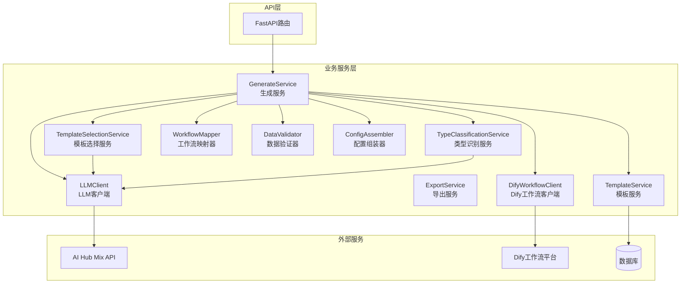

**图表来源**
- [generate_service.py](file://backend/app/services/generate_service.py#L33-L465)
- [template_service.py](file://backend/app/services/template_service.py#L160-L281)
- [template_selection_service.py](file://backend/app/services/template_selection_service.py#L15-L169)

## AI生成服务详解

GenerateService是整个系统的核心服务，实现了三阶段智能生成流程，支持Dify工作流和系统LLM两种数据生成方式。

### 三阶段智能生成流程

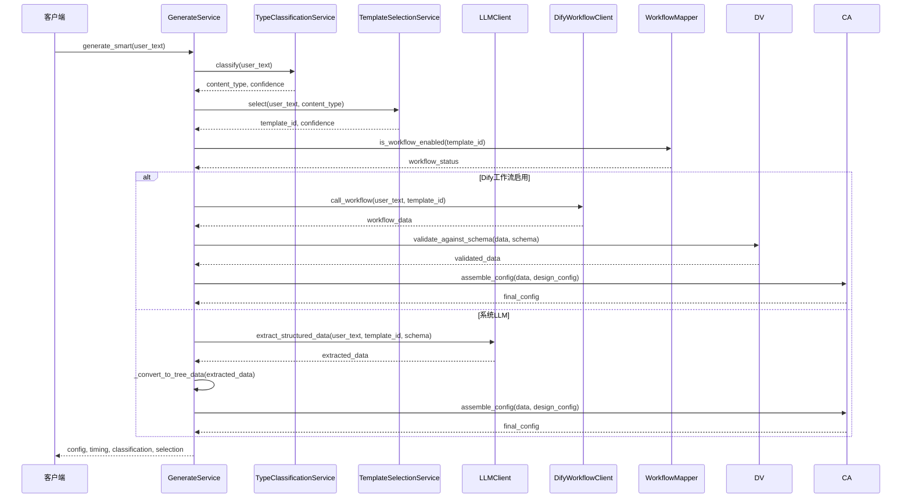

**图表来源**
- [generate_service.py](file://backend/app/services/generate_service.py#L47-L118)
- [type_classification_service.py](file://backend/app/services/type_classification_service.py#L22-L73)
- [template_selection_service.py](file://backend/app/services/template_selection_service.py#L24-L88)

### 数据提取策略

系统采用智能回退机制，优先使用Dify工作流，失败时自动回退到系统LLM：

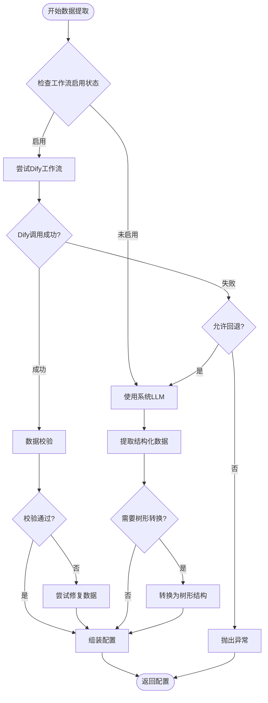

**图表来源**
- [generate_service.py](file://backend/app/services/generate_service.py#L159-L257)

**章节来源**
- [generate_service.py](file://backend/app/services/generate_service.py#L33-L465)

## 模板管理服务

TemplateService负责管理AntV Infographic的所有模板信息，支持从数据库动态加载模板配置。

### 模板设计映射

系统维护了一个模板设计映射表，将模板ID映射到具体的AntV Infographic设计配置：

| 模板ID | 设计类型 | 适用场景 |
|--------|----------|----------|
| list-row-simple-horizontal-arrow | list-row-horizontal-icon-arrow | 简单横向流程图 |
| list-column-simple | list-column | 纵向列表布局 |
| pyramid-layer | list-pyramid | 金字塔层级图 |
| org-tree | hierarchy-tree | 组织架构树 |
| timeline-horizontal | timeline-horizontal | 横向时间轴 |
| matrix-2x2 | quadrant | 2x2矩阵 |
| comparison-two-column | comparison-column | 双栏对比 |

### 模板分类体系

系统支持七种主要的信息图分类：

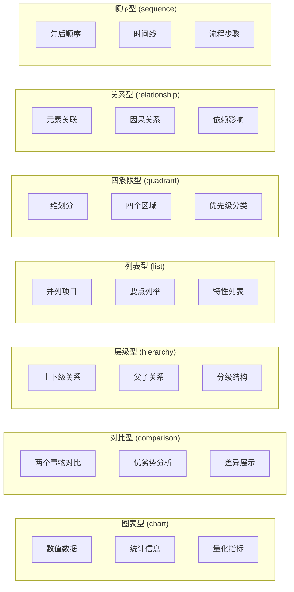

**图表来源**
- [template_service.py](file://backend/app/services/template_service.py#L12-L95)
- [prompts.py](file://backend/app/utils/prompts.py#L42-L84)

**章节来源**
- [template_service.py](file://backend/app/services/template_service.py#L160-L281)

## 智能推荐算法

TemplateSelectionService实现了基于LLM的智能模板推荐算法，能够根据用户输入和内容类型推荐最合适的模板。

### 推荐流程

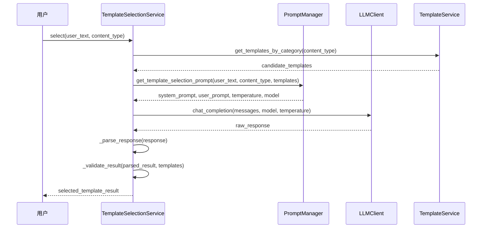

**图表来源**
- [template_selection_service.py](file://backend/app/services/template_selection_service.py#L24-L88)

### 置信度评估机制

系统采用多层次的置信度评估机制：

1. **特征匹配度**：基于用户文本中的关键词和特征
2. **模板适用性**：考虑模板的适用场景和设计特点
3. **语义相似度**：通过LLM评估语义匹配程度
4. **历史成功率**：参考类似场景的历史推荐成功率

### 响应解析与验证

系统实现了强大的响应解析机制，能够处理各种格式的LLM输出：

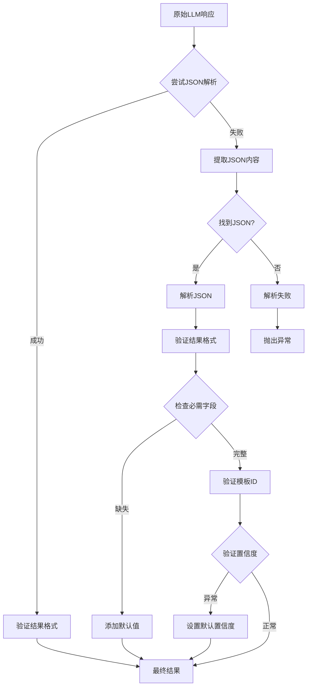

**图表来源**
- [template_selection_service.py](file://backend/app/services/template_selection_service.py#L79-L157)

**章节来源**
- [template_selection_service.py](file://backend/app/services/template_selection_service.py#L15-L169)

## 多格式导出服务

ExportService提供了统一的多格式导出接口，支持SVG、PNG、PDF、PPTX四种主流格式。

### 导出格式支持

| 格式 | 特点 | 用途 | 优势 |
|------|------|------|------|
| SVG | 矢量图形 | 网页展示、编辑修改 | 无损缩放、可编辑 |
| PNG | 位图图像 | 图片展示、社交媒体 | 兼容性好、文件小 |
| PDF | 文档格式 | 报告打印、存档 | 标准格式、跨平台 |
| PPTX | 演示文稿 | 演示展示、协作 | 保持矢量特性 |

### PPTX导出特殊处理

PPTX导出是最复杂的功能，需要特殊的SVG转换处理：

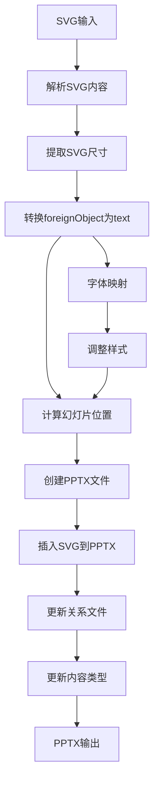

**图表来源**
- [export_service.py](file://backend/app/services/export_service.py#L130-L230)

### 中文字体处理

系统实现了智能的中文字体映射机制，确保中文字符在不同格式中正确显示：

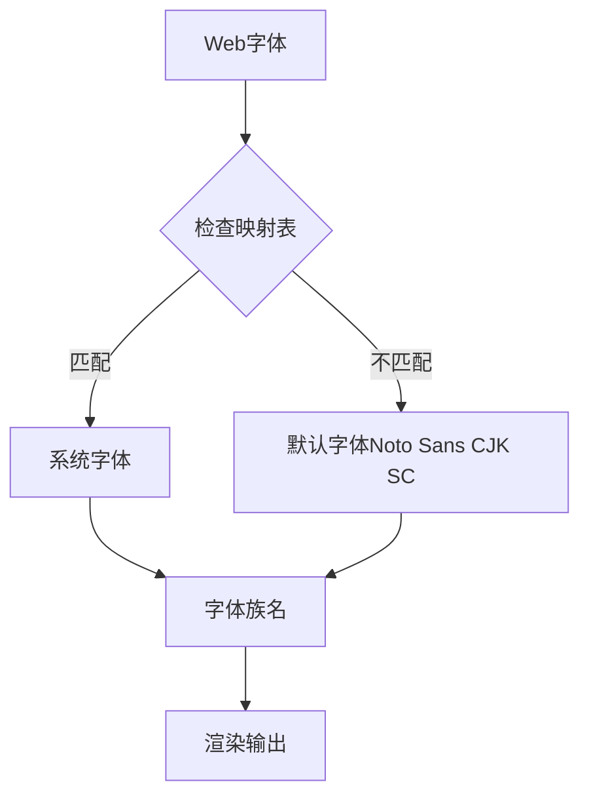

**图表来源**
- [export_service.py](file://backend/app/services/export_service.py#L446-L479)

**章节来源**
- [export_service.py](file://backend/app/services/export_service.py#L19-L670)

## 外部AI服务集成

系统集成了多种外部AI服务，通过统一的客户端接口实现无缝切换。

### LLM客户端架构

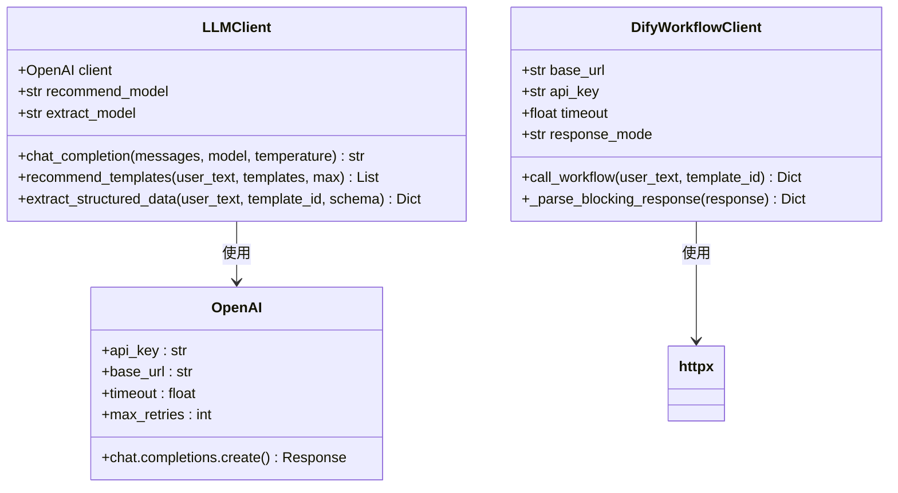

**图表来源**
- [llm_client.py](file://backend/app/services/llm_client.py#L14-L217)
- [dify_workflow_client.py](file://backend/app/services/dify_workflow_client.py#L15-L196)

### API集成策略

系统采用多种策略来处理外部API集成：

1. **重试机制**：自动重试失败的请求
2. **超时控制**：防止长时间等待
3. **错误处理**：优雅处理各种异常情况
4. **配额管理**：监控和限制API使用

### 模型适配器模式

系统支持多种LLM模型，通过适配器模式实现统一接口：

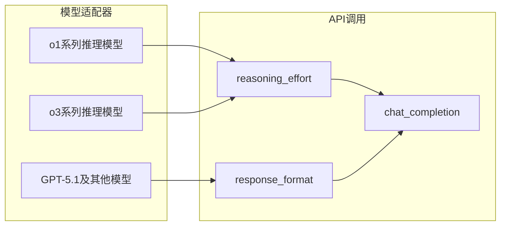

**图表来源**
- [llm_client.py](file://backend/app/services/llm_client.py#L30-L79)

**章节来源**
- [llm_client.py](file://backend/app/services/llm_client.py#L14-L217)
- [dify_workflow_client.py](file://backend/app/services/dify_workflow_client.py#L15-L196)

## 数据验证与配置组装

系统实现了严格的数据验证和配置组装机制，确保生成的数据符合预期格式。

### 数据验证流程

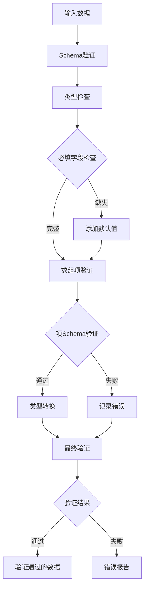

**图表来源**
- [data_validator.py](file://backend/app/services/data_validator.py#L11-L160)

### 配置组装机制

ConfigAssembler负责将Dify返回的数据与模板的设计配置拼接成完整的AntV Infographic配置：

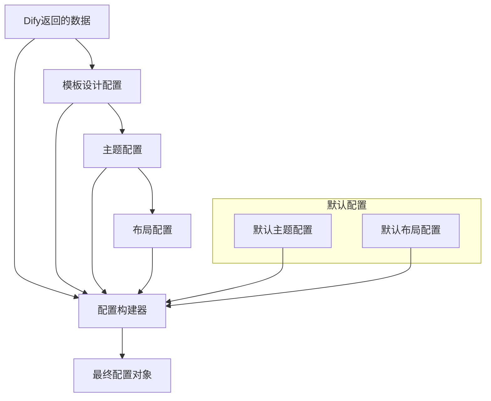

**图表来源**
- [config_assembler.py](file://backend/app/services/config_assembler.py#L11-L103)

**章节来源**
- [data_validator.py](file://backend/app/services/data_validator.py#L11-L160)
- [config_assembler.py](file://backend/app/services/config_assembler.py#L11-L103)

## 服务间依赖关系

系统采用依赖注入模式，通过全局单例模式管理服务实例。

### 依赖关系图

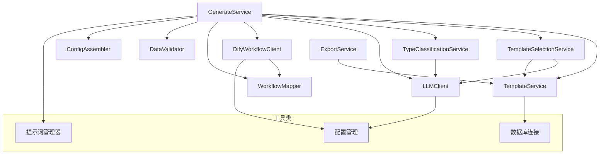

**图表来源**
- [generate_service.py](file://backend/app/services/generate_service.py#L36-L45)
- [template_selection_service.py](file://backend/app/services/template_selection_service.py#L18-L22)

### 服务生命周期管理

系统使用全局单例模式管理服务实例，确保资源的有效利用：

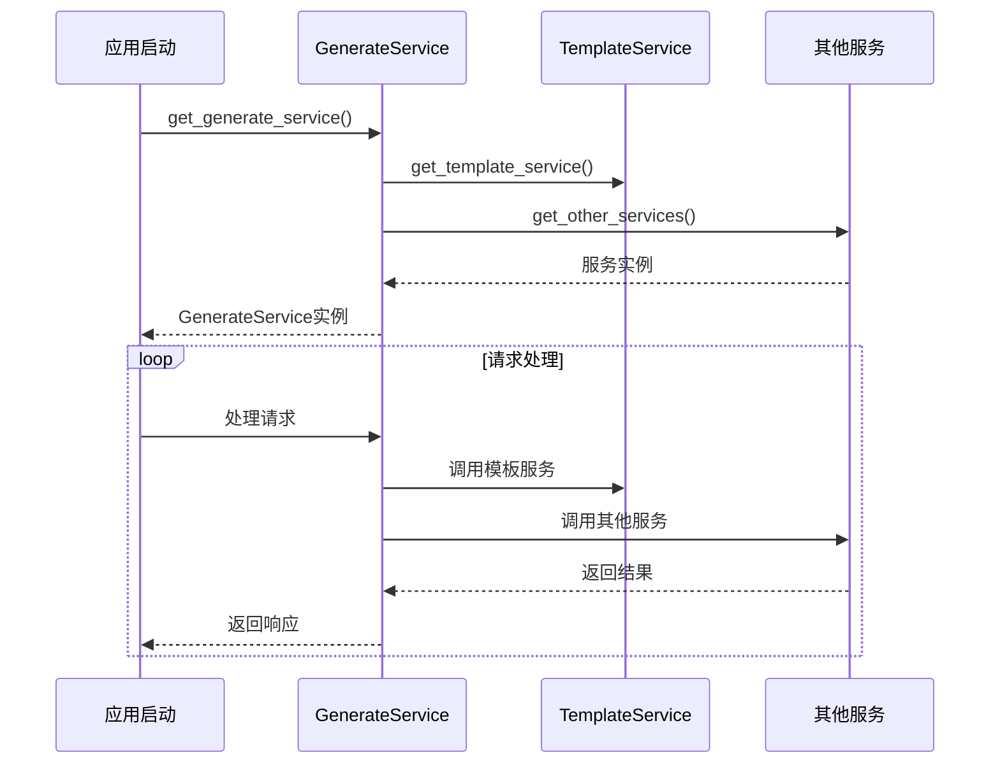

**图表来源**
- [generate_service.py](file://backend/app/services/generate_service.py#L456-L465)

**章节来源**
- [generate_service.py](file://backend/app/services/generate_service.py#L36-L45)

## 配置管理

系统通过YAML配置文件管理Dify工作流映射关系，支持热更新机制。

### 工作流配置结构

```yaml
template_id:
  dify_app_id: null  # Dify应用ID，null表示使用默认API密钥
  workflow_name: "工作流名称"
  enabled: true      # 是否启用该工作流
  fallback_to_system_llm: true  # 失败时是否回退到系统LLM
```

### 配置加载机制

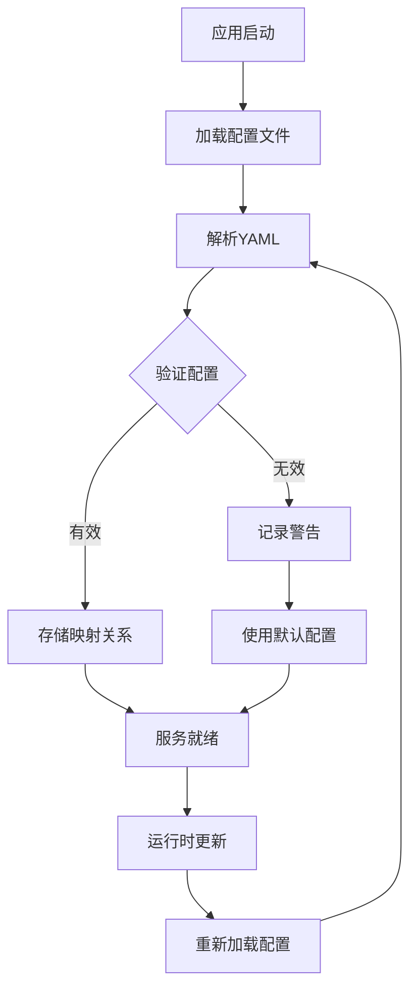

**图表来源**
- [workflow_mapper.py](file://backend/app/services/workflow_mapper.py#L13-L48)

**章节来源**
- [workflow_mapper.py](file://backend/app/services/workflow_mapper.py#L13-L157)
- [dify_workflows.yaml](file://backend/app/config/dify_workflows.yaml#L1-L81)

## 性能优化策略

系统采用了多种性能优化策略来提升响应速度和资源利用率。

### 缓存策略

1. **模板缓存**：将常用模板预加载到内存
2. **LLM响应缓存**：缓存频繁查询的结果
3. **配置缓存**：缓存工作流配置映射

### 异步处理

系统大量使用异步编程模式：

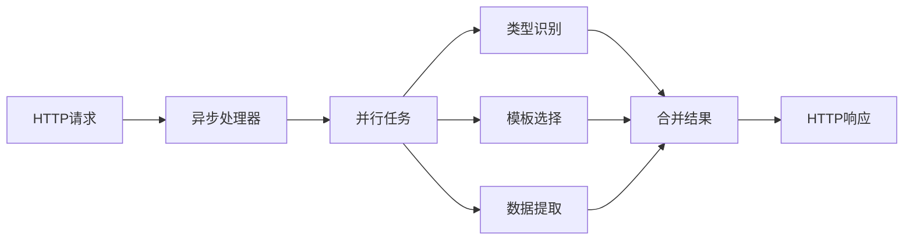

### 连接池管理

对于外部API调用，系统使用连接池来复用HTTP连接：

- **Dify API**：使用httpx.AsyncClient管理连接
- **LLM API**：使用OpenAI SDK的连接池
- **数据库**：使用SQLAlchemy连接池

## 故障排除指南

### 常见问题及解决方案

#### 1. Dify工作流调用失败

**症状**：`Dify工作流调用失败（已重试3次）`

**原因分析**：
- API密钥配置错误
- 网络连接问题
- 工作流配置错误
- 输入数据格式不正确

**解决步骤**：
1. 检查`.env`文件中的DIFY_API_KEY配置
2. 验证工作流映射配置是否正确
3. 检查输入数据格式是否符合要求
4. 查看Dify平台上的工作流执行日志

#### 2. LLM响应解析失败

**症状**：`JSON解析失败: Expecting ',' delimiter`

**原因分析**：
- LLM输出包含Markdown代码块标记
- 输出格式不符合JSON规范
- 模型参数设置不当

**解决步骤**：
1. 检查提示词模板是否正确
2. 调整模型的temperature参数
3. 在代码中添加更健壮的解析逻辑

#### 3. 模板选择不准确

**症状**：推荐的模板与用户输入不匹配

**原因分析**：
- 提示词不够精确
- 模板描述不清晰
- 类型识别不准确

**解决步骤**：
1. 优化提示词模板
2. 更新模板描述信息
3. 增加类型识别的训练数据

#### 4. 导出格式错误

**症状**：导出的文件无法打开或显示异常

**原因分析**：
- 字体映射失败
- SVG转换错误
- 文件权限问题

**解决步骤**：
1. 检查系统字体安装
2. 验证SVG内容格式
3. 检查临时文件目录权限

### 调试工具

系统提供了专门的调试端点：

```python
@router.get("/debug/workflow-mapper")
async def debug_workflow_mapper():
    """调试端点：查看WorkflowMapper的状态"""
    mapper = get_workflow_mapper()
    # 返回配置路径、映射数量、测试结果等信息
```

**章节来源**
- [generate.py](file://backend/app/api/v1/generate.py#L90-L116)

## 总结

业务服务层是GenAI Chart系统的核心，通过模块化设计和依赖注入模式实现了高度可扩展和可维护的架构。系统支持多种AI服务提供商、丰富的导出格式和智能的模板推荐算法，为用户提供了一站式的AI信息图生成解决方案。

主要特点包括：

1. **智能生成流程**：三阶段智能生成，支持多种数据提取方式
2. **模板管理系统**：完善的模板分类和管理机制
3. **多格式导出**：支持SVG、PNG、PDF、PPTX等多种格式
4. **外部服务集成**：灵活的AI服务集成和切换机制
5. **数据验证与转换**：严格的数据验证和配置组装
6. **性能优化**：异步处理和缓存策略
7. **故障恢复**：智能回退和错误处理机制

通过这些功能的协同工作，系统能够高效地处理各种信息图生成需求，为用户提供优质的AI辅助设计体验。