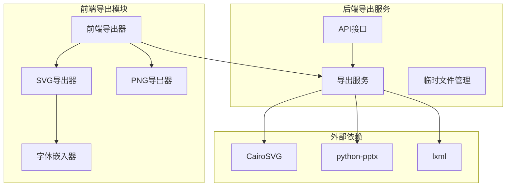
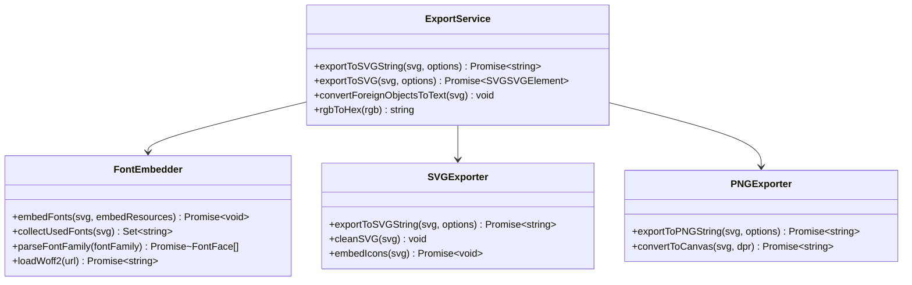
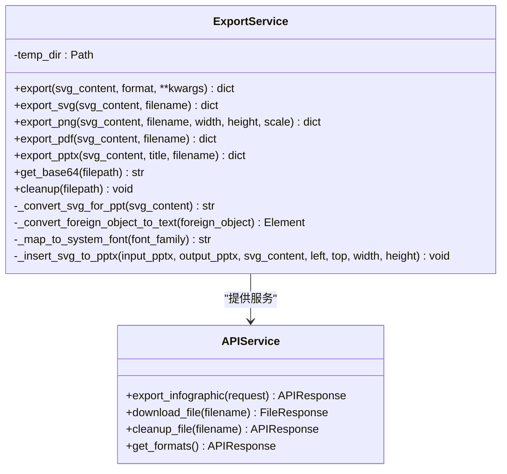
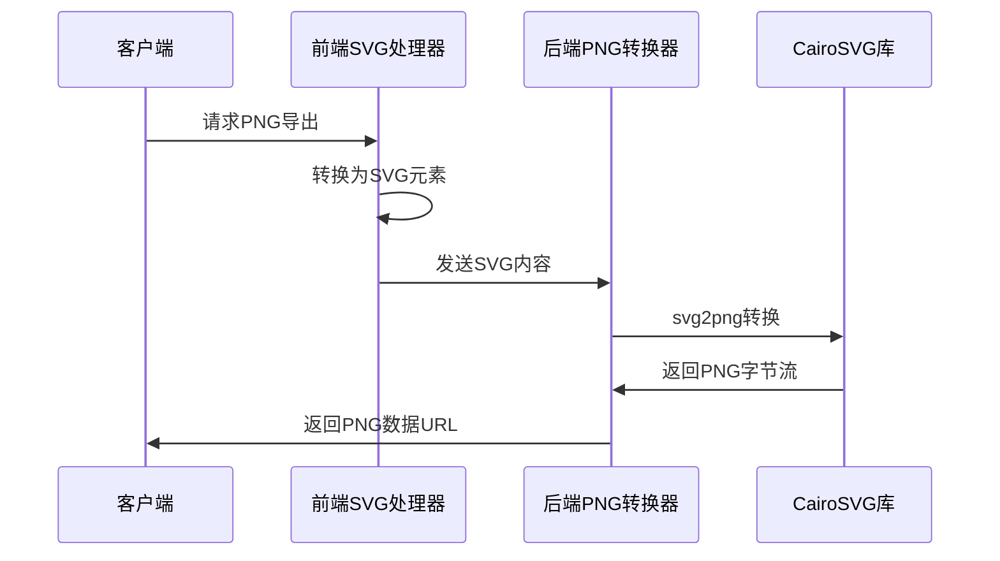
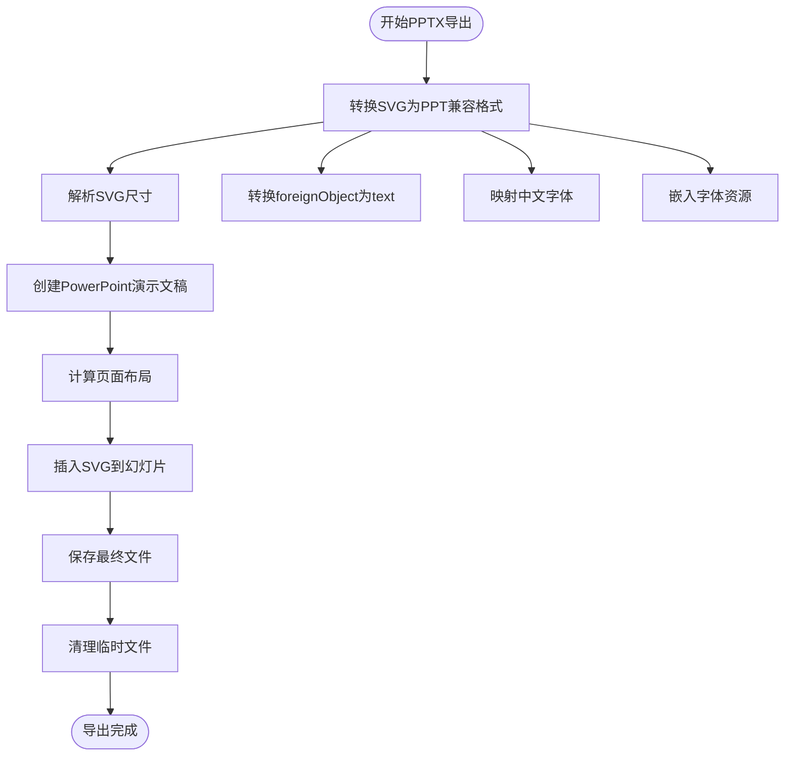
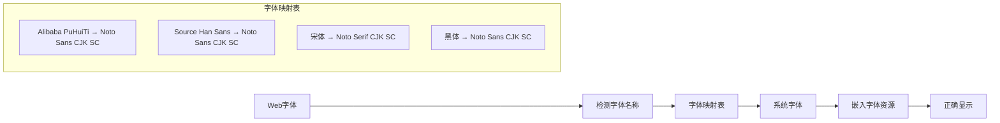
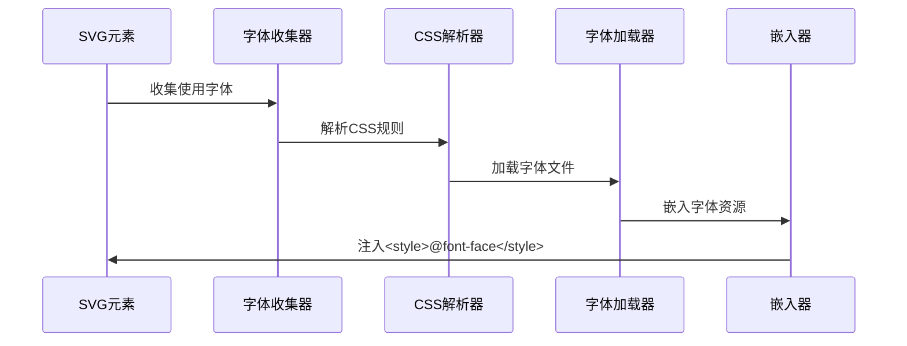
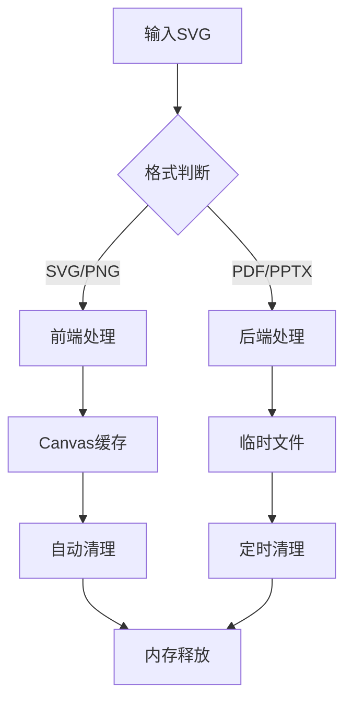
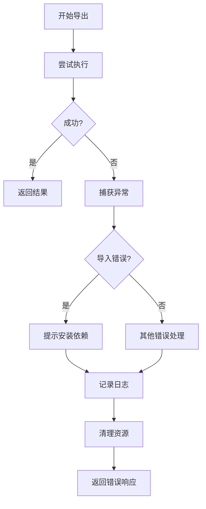

# 导出服务

<cite>
**本文档中引用的文件**
- [export_service.py](file://backend/app/services/export_service.py)
- [export.py](file://backend/app/api/v1/export.py)
- [index.ts](file://antv_infographic/infographic/src/exporter/index.ts)
- [svg.ts](file://antv_infographic/infographic/src/exporter/svg.ts)
- [png.ts](file://antv_infographic/infographic/src/exporter/png.ts)
- [font.ts](file://antv_infographic/infographic/src/exporter/font.ts)
- [types.ts](file://antv_infographic/infographic/src/exporter/types.ts)
- [test_pptx_chinese.py](file://tests/backend/test_pptx_chinese.py)
- [check_pptx.py](file://tests/backend/check_pptx.py)
- [test_backend_svg_conversion.py](file://tests/backend/test_backend_svg_conversion.py)
</cite>

## 目录
1. [简介](#简介)
2. [项目架构](#项目架构)
3. [核心组件](#核心组件)
4. [多格式导出功能](#多格式导出功能)
5. [PPTX导出特殊处理](#pptx导出特殊处理)
6. [前端导出模块](#前端导出模块)
7. [性能考量](#性能考量)
8. [错误处理与文件清理](#错误处理与文件清理)
9. [API接口设计](#api接口设计)
10. [最佳实践](#最佳实践)

## 简介

导出服务是一个综合性的多格式信息图导出解决方案，支持将AntV Infographic生成的信息图转换为SVG、PNG、PDF和PPTX四种格式。该服务采用前后端分离架构，前端负责基础的SVG和PNG导出，后端提供高级的PDF和PPTX导出功能，特别是针对PowerPoint的特殊优化。

## 项目架构



**图表来源**
- [export_service.py](file://backend/app/services/export_service.py#L1-L50)
- [export.py](file://backend/app/api/v1/export.py#L1-L30)

## 核心组件

### 前端导出模块

前端导出模块位于 `antv_infographic/infographic/src/exporter/` 目录下，提供了基础的导出功能：



**图表来源**
- [svg.ts](file://antv_infographic/infographic/src/exporter/svg.ts#L1-L50)
- [png.ts](file://antv_infographic/infographic/src/exporter/png.ts#L1-L30)
- [font.ts](file://antv_infographic/infographic/src/exporter/font.ts#L1-L50)

**节来源**
- [index.ts](file://antv_infographic/infographic/src/exporter/index.ts#L1-L8)
- [svg.ts](file://antv_infographic/infographic/src/exporter/svg.ts#L1-L194)
- [png.ts](file://antv_infographic/infographic/src/exporter/png.ts#L1-L59)
- [font.ts](file://antv_infographic/infographic/src/exporter/font.ts#L1-L274)

### 后端导出服务

后端导出服务位于 `backend/app/services/export_service.py`，提供了完整的导出功能：



**图表来源**
- [export_service.py](file://backend/app/services/export_service.py#L19-L100)
- [export.py](file://backend/app/api/v1/export.py#L38-L120)

**节来源**
- [export_service.py](file://backend/app/services/export_service.py#L19-L670)
- [export.py](file://backend/app/api/v1/export.py#L1-L208)

## 多格式导出功能

### SVG导出

SVG导出是最基础的格式，支持矢量图形的无损导出：

| 功能特性 | 实现方式 | 参数配置 |
|---------|---------|---------|
| 字体嵌入 | 自动收集使用字体并嵌入CSS @font-face | `embedResources: boolean` |
| 图标嵌入 | 复制use元素引用的symbol到defs中 | 自动处理 |
| 元素清理 | 移除按钮组、瞬态容器等非必要元素 | 自动清理 |
| 样式转换 | 将foreignObject转换为标准text元素 | 可选转换 |

**节来源**
- [svg.ts](file://antv_infographic/infographic/src/exporter/svg.ts#L14-L32)

### PNG导出

PNG导出通过Canvas API将SVG转换为位图格式：



**图表来源**
- [png.ts](file://antv_infographic/infographic/src/exporter/png.ts#L5-L59)
- [export_service.py](file://backend/app/services/export_service.py#L52-L93)

**节来源**
- [png.ts](file://antv_infographic/infographic/src/exporter/png.ts#L1-L59)
- [export_service.py](file://backend/app/services/export_service.py#L52-L93)

### PDF导出

PDF导出同样基于CairoSVG库，支持高质量的矢量文档输出：

| 配置参数 | 默认值 | 说明 |
|---------|--------|------|
| 输出质量 | 高清 | 基于SVG原始分辨率 |
| 页面尺寸 | 自动检测 | 从SVG viewBox获取 |
| 边距设置 | 无边距 | 保持原始布局 |

**节来源**
- [export_service.py](file://backend/app/services/export_service.py#L95-L129)

### PPTX导出

PPTX导出是最复杂的格式，需要特殊的处理逻辑：



**图表来源**
- [export_service.py](file://backend/app/services/export_service.py#L130-L230)

**节来源**
- [export_service.py](file://backend/app/services/export_service.py#L130-L230)

## PPTX导出特殊处理

### 页面布局优化

PPTX导出实现了智能的页面布局算法：

| 布局参数 | 计算方式 | 目标效果 |
|---------|---------|---------|
| 幻灯片尺寸 | 16:9标准比例 | PowerPoint兼容性 |
| 内容区域 | 9.5×5.125英寸 | 留出工具栏空间 |
| 缩放比例 | 自适应内容尺寸 | 保持原始比例 |
| 居中对齐 | 计算偏移量 | 内容居中显示 |

### 字体嵌入与映射

PPTX导出特别注重中文字体的正确显示：



**图表来源**
- [export_service.py](file://backend/app/services/export_service.py#L446-L479)

**节来源**
- [export_service.py](file://backend/app/services/export_service.py#L446-L479)

### 图像压缩与优化

PPTX导出过程中实现了智能的图像处理：

| 处理阶段 | 技术手段 | 性能影响 |
|---------|---------|---------|
| SVG解析 | ElementTree XML处理 | 内存占用低 |
| 元素转换 | 正则表达式匹配 | 处理速度快 |
| 关系建立 | ZIP文件结构操作 | 直接二进制写入 |
| 类型注册 | Content Types自动添加 | 无需额外依赖 |

**节来源**
- [export_service.py](file://backend/app/services/export_service.py#L481-L644)

## 前端导出模块

### 字体处理机制

前端导出模块实现了完整的字体处理链：



**图表来源**
- [font.ts](file://antv_infographic/infographic/src/exporter/font.ts#L23-L88)

**节来源**
- [font.ts](file://antv_infographic/infographic/src/exporter/font.ts#L1-L274)

### SVG清理与优化

前端导出模块提供了全面的SVG清理功能：

| 清理项目 | 处理方法 | 目的 |
|---------|---------|------|
| 按钮组元素 | 移除[data-element-type=btns-group] | 移除编辑器控件 |
| 瞬态容器 | 移除临时容器元素 | 清理内部状态 |
| 无用属性 | 移除x/y/width/height属性 | 优化DOM结构 |
| 数据集 | 清空dataset对象 | 移除调试信息 |

**节来源**
- [svg.ts](file://antv_infographic/infographic/src/exporter/svg.ts#L58-L97)

## 性能考量

### 内存管理

导出服务实现了多层次的内存管理策略：



### 并发处理

后端服务支持并发导出多个文件：

| 并发策略 | 实现方式 | 限制条件 |
|---------|---------|---------|
| 异步处理 | Python asyncio | CPU密集型任务 |
| 进程隔离 | 多进程执行 | 系统资源限制 |
| 文件锁 | 临时文件保护 | 防止冲突访问 |

### 缓存机制

前端导出模块实现了字体资源缓存：

| 缓存类型 | 存储方式 | 生命周期 |
|---------|---------|---------|
| 字体数据URL | Map缓存 | 会话期间 |
| CSS解析结果 | 内存缓存 | 页面生命周期 |
| 转换结果 | 临时文件 | 手动清理 |

## 错误处理与文件清理

### 错误处理策略

导出服务实现了完善的错误处理机制：



**图表来源**
- [export.py](file://backend/app/api/v1/export.py#L108-L121)

### 文件清理机制

服务提供了多层次的文件清理功能：

| 清理级别 | 触发时机 | 清理范围 |
|---------|---------|---------|
| 自动清理 | 导出完成后 | 临时文件 |
| 手动清理 | API调用 | 指定文件 |
| 定时清理 | 系统维护 | 过期文件 |
| 异常清理 | 异常发生 | 所有临时文件 |

**节来源**
- [export_service.py](file://backend/app/services/export_service.py#L646-L669)
- [export.py](file://backend/app/api/v1/export.py#L155-L172)

## API接口设计

### RESTful API架构

导出服务提供了完整的RESTful API接口：

```mermaid
graph LR
subgraph "导出API"
POST[POST /api/v1/export]
GET[GET /api/v1/export/download/{filename}]
DELETE[DELETE /api/v1/export/cleanup/{filename}]
GET2[GET /api/v1/export/formats]
end
subgraph "请求模型"
ExportRequest[ExportRequest]
ExportResponse[ExportResponse]
end
POST --> ExportRequest
POST --> ExportResponse
GET --> FileResponse
DELETE --> APIResponse
GET2 --> APIResponse
```

**图表来源**
- [export.py](file://backend/app/api/v1/export.py#L16-L37)

### 接口参数规范

| 接口 | 方法 | 参数 | 响应 |
|------|------|------|------|
| 导出 | POST | svgContent, format, filename, title, width, height, scale | ExportResponse |
| 下载 | GET | filename | FileResponse |
| 清理 | DELETE | filename | APIResponse |
| 格式 | GET | 无 | APIResponse |

**节来源**
- [export.py](file://backend/app/api/v1/export.py#L1-L208)

## 最佳实践

### 使用建议

1. **格式选择指南**
   - SVG：需要可编辑性和矢量特性的场景
   - PNG：需要高质量位图的打印或网页展示
   - PDF：需要专业文档格式的报告
   - PPTX：需要在PowerPoint中进一步编辑

2. **性能优化建议**
   - 控制SVG复杂度，避免过多元素
   - 合理设置PNG导出的分辨率参数
   - 及时清理临时文件，避免磁盘空间占用

3. **错误处理最佳实践**
   - 捕获ImportError异常，提示安装依赖
   - 处理文件不存在的HTTP异常
   - 实现优雅的降级方案

### 部署注意事项

1. **依赖管理**
   - 前端：无需额外依赖，纯JavaScript实现
   - 后端：需要安装cairosvg、python-pptx等Python包

2. **资源配置**
   - 临时文件目录权限设置
   - 内存和CPU资源监控
   - 文件大小限制配置

3. **安全考虑**
   - 输入验证，防止恶意SVG注入
   - 文件上传大小限制
   - 临时文件访问控制

**节来源**
- [export_service.py](file://backend/app/services/export_service.py#L1-L670)
- [export.py](file://backend/app/api/v1/export.py#L1-L208)