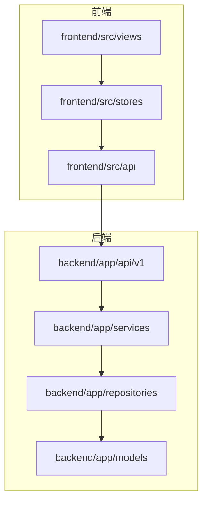
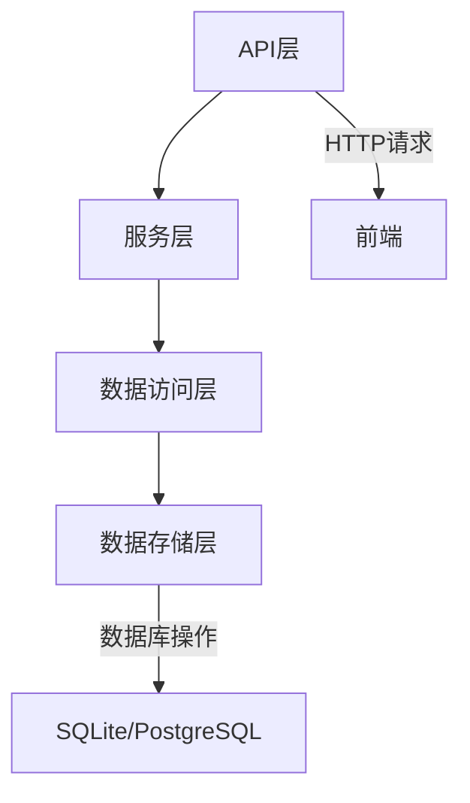
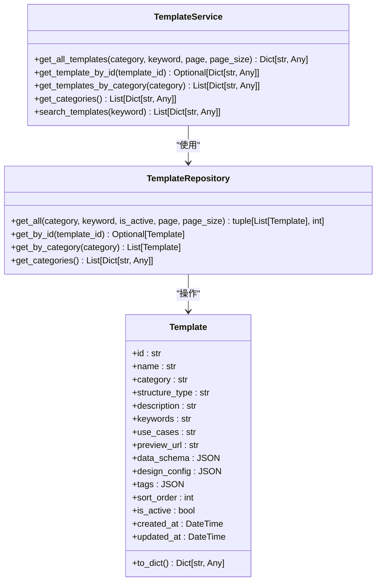
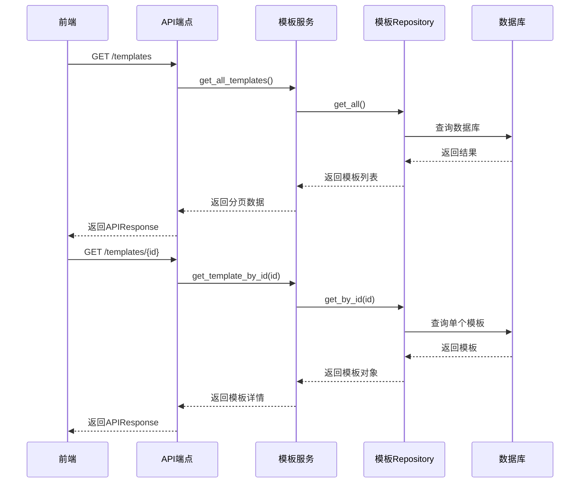
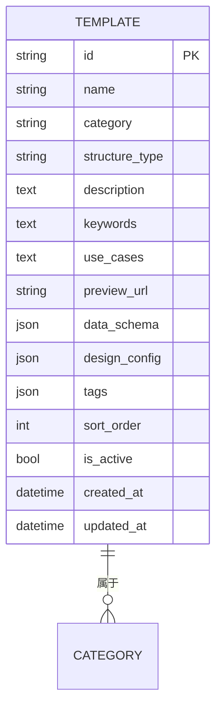
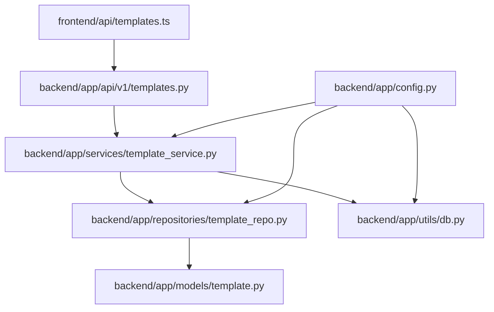

# 模板服务

<cite>
**本文档引用的文件**  
- [template_service.py](file://backend/app/services/template_service.py)
- [template_repo.py](file://backend/app/repositories/template_repo.py)
- [template.py](file://backend/app/models/template.py)
- [templates.py](file://backend/app/api/v1/templates.py)
- [db.py](file://backend/app/utils/db.py)
- [base.py](file://backend/app/models/base.py)
- [config.py](file://backend/app/config.py)
- [template_selection_service.py](file://backend/app/services/template_selection_service.py)
- [templates.ts](file://frontend/src/api/templates.ts)
- [template.ts](file://frontend/src/stores/template.ts)
</cite>

## 目录
1. [简介](#简介)
2. [项目结构](#项目结构)
3. [核心组件](#核心组件)
4. [架构概述](#架构概述)
5. [详细组件分析](#详细组件分析)
6. [依赖分析](#依赖分析)
7. [性能考虑](#性能考虑)
8. [故障排除指南](#故障排除指南)
9. [结论](#结论)

## 简介
本项目是一个基于AntV Infographic的信息图生成系统，核心功能是通过AI智能推荐和模板管理来生成可视化信息图。模板服务（template_service）作为系统的核心组件，负责管理所有信息图模板的元数据、分类体系、搜索功能以及与数据库的交互。系统采用分层架构，通过Repository模式封装数据访问逻辑，实现了模板的增删改查操作。前端通过API路由与后端服务通信，结合数据模型实现了完整的模板生命周期管理。系统还集成了AI推荐功能，能够根据用户输入的文本内容智能推荐最合适的模板。

## 项目结构
本项目采用典型的前后端分离架构，后端使用Python FastAPI框架，前端使用Vue.js技术栈。主要目录结构包括：antv_infographic（包含AntV Infographic核心库）、backend（后端服务）、frontend（前端应用）、reference_doc（参考文档）和tests（测试代码）。后端服务采用模块化设计，包含api、models、repositories、services等目录，实现了清晰的分层架构。前端应用采用Pinia进行状态管理，通过API客户端与后端服务通信。

**图示来源**  
- [templates.py](file://backend/app/api/v1/templates.py)
- [templates.ts](file://frontend/src/api/templates.ts)
- [template.ts](file://frontend/src/stores/template.ts)

## 核心组件
模板服务的核心组件包括TemplateService类、TemplateRepository类和Template模型。TemplateService提供高层次的业务逻辑接口，TemplateRepository封装数据访问操作，Template模型定义数据库表结构。这些组件通过依赖注入的方式协同工作，实现了关注点分离。服务层通过单例模式提供全局访问点，确保系统资源的有效利用。数据访问层采用SQLAlchemy ORM框架，提供了强大的数据库操作能力。

**本节来源**  
- [template_service.py](file://backend/app/services/template_service.py#L160-L281)
- [template_repo.py](file://backend/app/repositories/template_repo.py#L13-L144)
- [template.py](file://backend/app/models/template.py#L9-L54)

## 架构概述
系统采用经典的分层架构模式，从上到下分为API层、服务层、数据访问层和数据存储层。API层定义RESTful接口，服务层实现业务逻辑，数据访问层处理数据库操作，数据存储层使用SQLite或PostgreSQL存储数据。各层之间通过明确定义的接口通信，实现了松耦合和高内聚。系统还采用了Repository模式，将数据访问逻辑从业务逻辑中分离出来，提高了代码的可测试性和可维护性。

**图示来源**  
- [templates.py](file://backend/app/api/v1/templates.py)
- [template_service.py](file://backend/app/services/template_service.py)
- [template_repo.py](file://backend/app/repositories/template_repo.py)
- [db.py](file://backend/app/utils/db.py)

## 详细组件分析

### 模板服务分析
模板服务（TemplateService）是系统的核心业务逻辑组件，负责管理模板的全生命周期操作。它提供了获取所有模板、按ID获取模板、按分类获取模板、获取分类列表和搜索模板等方法。服务采用单例模式，通过get_template_service函数提供全局访问点。服务内部依赖于数据库会话工厂和模板Repository，实现了业务逻辑与数据访问的分离。

**图示来源**  
- [template_service.py](file://backend/app/services/template_service.py#L160-L281)
- [template_repo.py](file://backend/app/repositories/template_repo.py#L13-L144)
- [template.py](file://backend/app/models/template.py#L9-L54)

### API端点分析
API端点层定义了模板相关的RESTful接口，包括获取模板列表、获取分类列表、获取模板详情和AI推荐模板等。这些接口采用FastAPI框架实现，通过APIRouter进行路由管理。每个端点都有详细的文档说明，包括参数描述和返回值格式。接口返回统一的APIResponse格式，包含success、data和message字段，便于前端处理。

**图示来源**  
- [templates.py](file://backend/app/api/v1/templates.py#L17-L75)
- [template_service.py](file://backend/app/services/template_service.py#L170-L219)
- [template_repo.py](file://backend/app/repositories/template_repo.py#L25-L88)

### 数据模型分析
模板数据模型定义了数据库表结构和字段约束。Template类继承自SQLAlchemy的Base类，使用声明式语法定义表结构。模型包含id、name、category等基本字段，以及data_schema和design_config等JSON字段用于存储复杂结构。模型还定义了to_dict方法，用于将数据库对象转换为字典格式，便于JSON序列化。复合索引idx_category_sort提高了按分类和排序查询的性能。

**图示来源**  
- [template.py](file://backend/app/models/template.py#L9-L54)
- [template_repo.py](file://backend/app/repositories/template_repo.py#L105-L143)

## 依赖分析
系统各组件之间的依赖关系清晰明确。前端API模块依赖于后端API端点，模板服务依赖于模板Repository，Repository依赖于数据库模型。这种分层依赖结构确保了系统的可维护性和可测试性。通过依赖注入，服务层可以轻松替换数据访问实现，便于单元测试。配置管理模块被多个组件共享，确保了配置的一致性。

**图示来源**  
- [templates.ts](file://frontend/src/api/templates.ts)
- [templates.py](file://backend/app/api/v1/templates.py)
- [template_service.py](file://backend/app/services/template_service.py)
- [template_repo.py](file://backend/app/repositories/template_repo.py)
- [template.py](file://backend/app/models/template.py)
- [db.py](file://backend/app/utils/db.py)
- [config.py](file://backend/app/config.py)

## 性能考虑
系统在性能方面做了多项优化。数据库层面，通过在category和sort_order字段上创建复合索引，提高了查询性能。服务层面，采用分页机制避免一次性加载大量数据，减少内存占用。API层面，通过合理的缓存策略和异步处理，提高了响应速度。连接池配置优化了数据库连接管理，避免了频繁创建和销毁连接的开销。对于SQLite数据库，特别配置了StaticPool连接池，确保多线程环境下的稳定性。

## 故障排除指南
常见问题包括数据库连接失败、模板查询返回空结果和API调用超时。对于数据库连接问题，检查DATABASE_URL配置是否正确，确保数据库文件路径可访问。对于查询结果为空，验证查询参数是否正确，检查模板数据是否已正确导入。对于API超时，检查网络连接，确认后端服务是否正常运行。日志文件是诊断问题的重要工具，建议开启DEBUG_MODE以获取更详细的日志信息。使用init_db.py脚本可以重新初始化数据库结构，解决表结构不一致的问题。

**本节来源**  
- [db.py](file://backend/app/utils/db.py#L1-L94)
- [config.py](file://backend/app/config.py#L1-L51)
- [template_repo.py](file://backend/app/repositories/template_repo.py#L25-L73)

## 结论
模板服务作为信息图生成系统的核心组件，通过清晰的分层架构和良好的设计模式，实现了模板管理的完整功能。系统采用Repository模式封装数据访问逻辑，提高了代码的可维护性和可测试性。API设计遵循RESTful原则，提供了简洁易用的接口。前后端分离的架构使得开发和部署更加灵活。通过集成AI推荐功能，系统能够智能地为用户推荐最合适的模板，提升了用户体验。整体设计考虑了性能和可扩展性，为系统的持续发展奠定了良好基础。