# 生成服务

<cite>
**本文档引用的文件**
- [generate_service.py](file://backend/app/services/generate_service.py)
- [data_validator.py](file://backend/app/services/data_validator.py)
- [type_classification_service.py](file://backend/app/services/type_classification_service.py)
- [config_assembler.py](file://backend/app/services/config_assembler.py)
- [llm_client.py](file://backend/app/services/llm_client.py)
- [template_service.py](file://backend/app/services/template_service.py)
- [dify_workflow_client.py](file://backend/app/services/dify_workflow_client.py)
- [workflow_mapper.py](file://backend/app/services/workflow_mapper.py)
- [prompt_manager.py](file://backend/app/utils/prompt_manager.py)
- [generate.py](file://backend/app/api/v1/generate.py)
</cite>

## 目录
1. [简介](#简介)
2. [项目结构](#项目结构)
3. [核心组件](#核心组件)
4. [架构概览](#架构概览)
5. [详细组件分析](#详细组件分析)
6. [依赖关系分析](#依赖关系分析)
7. [性能考虑](#性能考虑)
8. [故障排除指南](#故障排除指南)
9. [结论](#结论)

## 简介

生成服务是AntV Infographic项目的核心AI生成引擎，负责将用户输入的自然语言文本转换为结构化的信息图配置。该服务采用三阶段智能生成流程，结合了先进的LLM技术和Dify工作流，提供了灵活的数据提取方案。

服务的主要特点包括：
- **智能三阶段流程**：类型识别 → 模板选择 → 数据提取
- **双模式数据生成**：支持Dify工作流和系统LLM两种数据生成方式
- **强大的容错机制**：自动回退和重试策略
- **灵活的配置管理**：支持模板映射和工作流配置
- **完善的监控体系**：详细的性能统计和错误追踪

## 项目结构

生成服务的项目结构体现了清晰的分层架构设计：

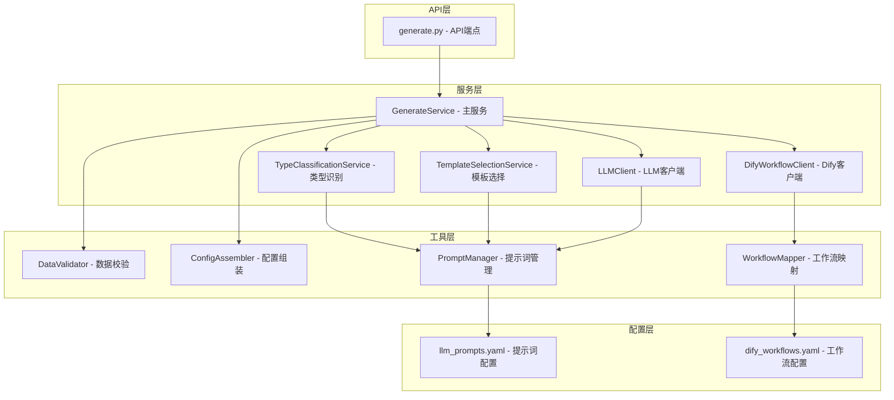

**图表来源**
- [generate_service.py](file://backend/app/services/generate_service.py#L33-L465)
- [generate.py](file://backend/app/api/v1/generate.py#L1-L116)

**章节来源**
- [generate_service.py](file://backend/app/services/generate_service.py#L1-L50)
- [generate.py](file://backend/app/api/v1/generate.py#L1-L30)

## 核心组件

生成服务由以下核心组件构成：

### 主服务类 (GenerateService)
主服务类是整个生成流程的协调者，负责：
- 协调三个主要阶段的执行
- 管理不同数据生成方式的选择
- 处理异常和重试逻辑
- 收集性能统计数据

### 类型识别服务 (TypeClassificationService)
负责分析用户输入并识别内容类型：
- 支持7种内容类型：chart、comparison、hierarchy、list、quadrant、relationship、sequence
- 使用专门的提示词模板
- 提供置信度评估和原因说明

### 数据校验器 (DataValidator)
确保Dify工作流返回的数据符合模板要求：
- Schema驱动的严格校验
- 自动类型转换和修复
- 详细的错误报告

### 配置组装器 (ConfigAssembler)
将业务数据与设计配置拼接成完整配置：
- 默认主题和布局配置
- 灵活的配置合并策略
- 版本兼容性保证

**章节来源**
- [generate_service.py](file://backend/app/services/generate_service.py#L33-L120)
- [type_classification_service.py](file://backend/app/services/type_classification_service.py#L14-L80)
- [data_validator.py](file://backend/app/services/data_validator.py#L11-L100)
- [config_assembler.py](file://backend/app/services/config_assembler.py#L11-L50)

## 架构概览

生成服务采用模块化架构，支持多种数据生成策略：

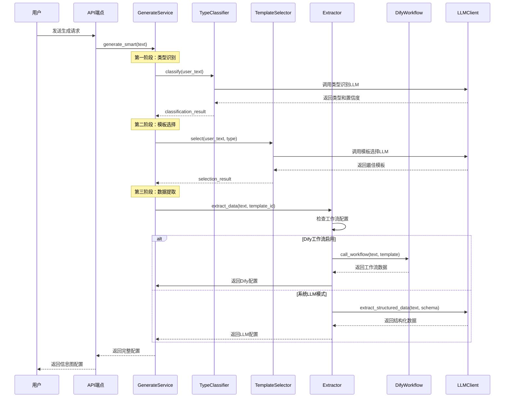

**图表来源**
- [generate_service.py](file://backend/app/services/generate_service.py#L47-L118)
- [type_classification_service.py](file://backend/app/services/type_classification_service.py#L22-L73)
- [dify_workflow_client.py](file://backend/app/services/dify_workflow_client.py#L31-L132)

## 详细组件分析

### 智能生成流程详解

智能生成流程是生成服务的核心功能，采用三阶段流水线设计：

#### 第一阶段：类型识别
类型识别服务负责分析用户输入并确定最适合的图表类型：

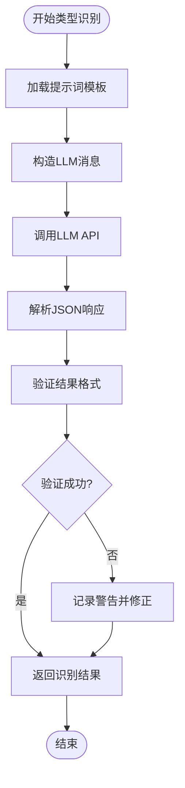

**图表来源**
- [type_classification_service.py](file://backend/app/services/type_classification_service.py#L22-L73)

类型识别支持以下7种内容类型：
- **chart**: 图表类型，适用于数值数据可视化
- **comparison**: 对比类型，适用于多组数据比较
- **hierarchy**: 层级类型，适用于组织结构展示
- **list**: 列表类型，适用于线性内容展示
- **quadrant**: 象限类型，适用于二维数据分析
- **relationship**: 关系类型，适用于关联关系展示
- **sequence**: 序列类型，适用于流程步骤展示

#### 第二阶段：模板选择
模板选择服务根据识别的类型和可用模板库，选择最适合的模板：

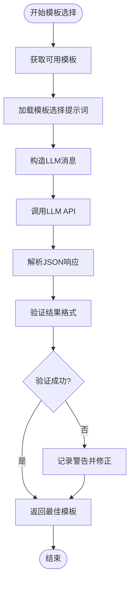

**图表来源**
- [generate_service.py](file://backend/app/services/generate_service.py#L76-L80)

#### 第三阶段：数据提取
数据提取是最复杂的一环，支持两种数据生成方式：

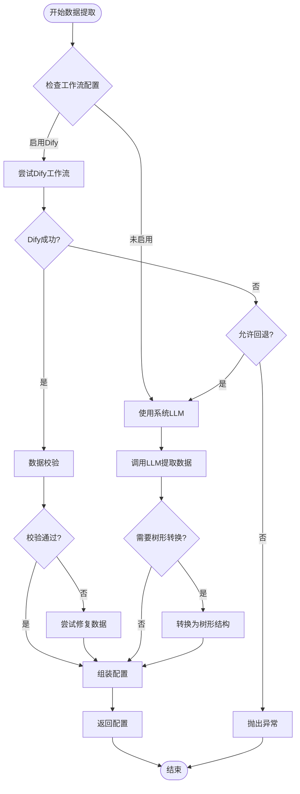

**图表来源**
- [generate_service.py](file://backend/app/services/generate_service.py#L159-L257)

**章节来源**
- [generate_service.py](file://backend/app/services/generate_service.py#L47-L118)
- [type_classification_service.py](file://backend/app/services/type_classification_service.py#L22-L73)

### LLM交互机制

生成服务与LLM的交互采用了精心设计的提示词管理和响应处理机制：

#### 提示词管理系统
提示词管理器负责加载和管理各种LLM提示词配置：

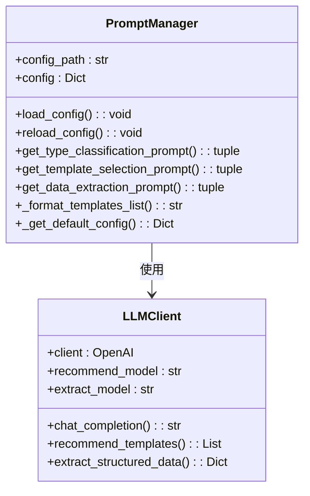

**图表来源**
- [prompt_manager.py](file://backend/app/utils/prompt_manager.py#L15-L216)
- [llm_client.py](file://backend/app/services/llm_client.py#L15-L217)

#### 响应解析和错误处理
LLM客户端实现了robust的响应解析和错误处理机制：

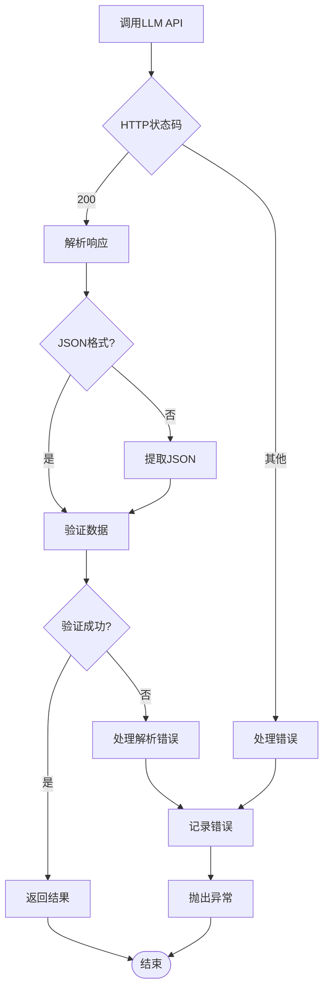

**图表来源**
- [llm_client.py](file://backend/app/services/llm_client.py#L30-L92)

**章节来源**
- [llm_client.py](file://backend/app/services/llm_client.py#L1-L217)
- [prompt_manager.py](file://backend/app/utils/prompt_manager.py#L1-L216)

### Dify工作流集成

Dify工作流提供了企业级的数据生成能力，生成服务通过专门的客户端进行集成：

#### 工作流调用流程
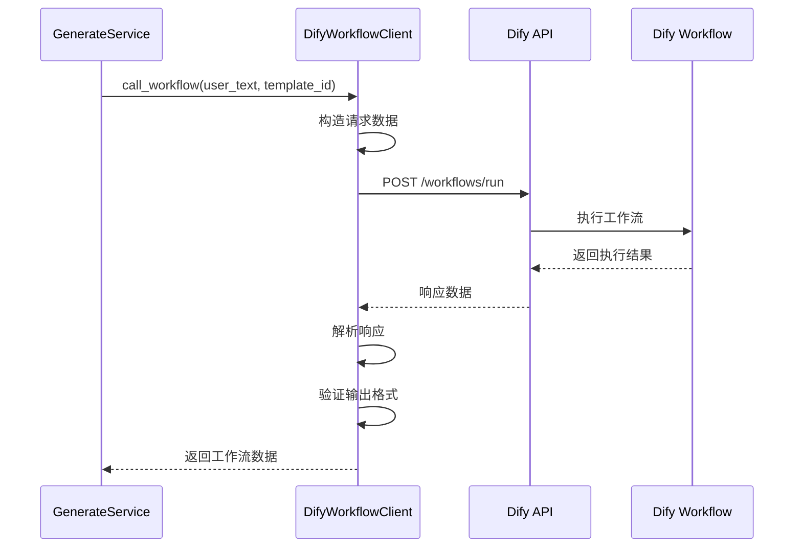

**图表来源**
- [dify_workflow_client.py](file://backend/app/services/dify_workflow_client.py#L31-L132)

#### 工作流配置管理
工作流映射器负责管理模板到Dify工作流的映射关系：

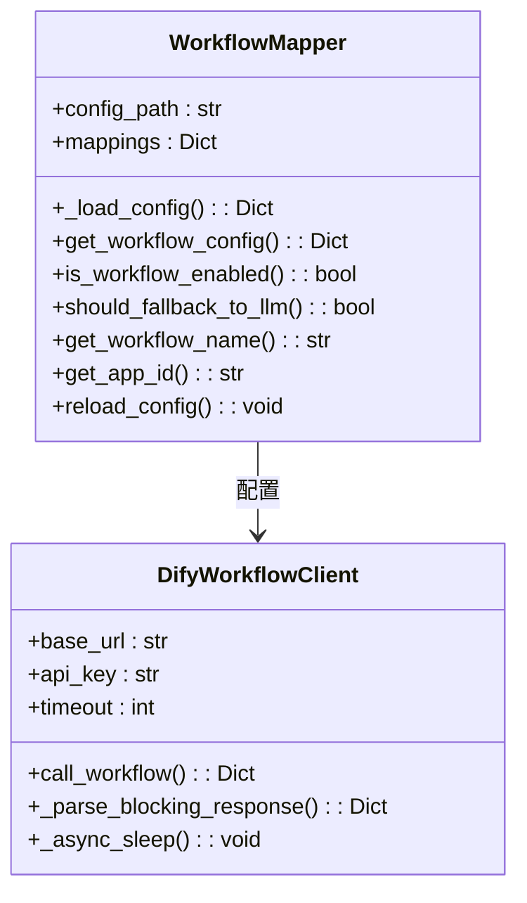

**图表来源**
- [workflow_mapper.py](file://backend/app/services/workflow_mapper.py#L13-L157)
- [dify_workflow_client.py](file://backend/app/services/dify_workflow_client.py#L15-L196)

**章节来源**
- [dify_workflow_client.py](file://backend/app/services/dify_workflow_client.py#L1-L196)
- [workflow_mapper.py](file://backend/app/services/workflow_mapper.py#L1-L157)

### 数据校验和配置组装

#### 数据校验机制
数据校验器采用Schema驱动的严格校验策略：

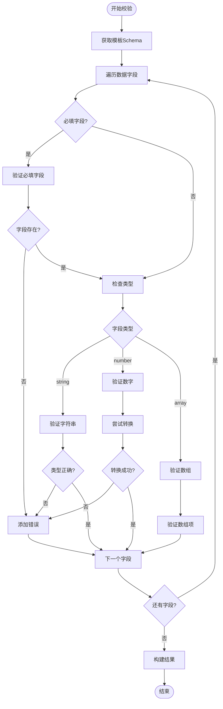

**图表来源**
- [data_validator.py](file://backend/app/services/data_validator.py#L14-L102)

#### 配置组装策略
配置组装器负责将业务数据与设计配置无缝整合：

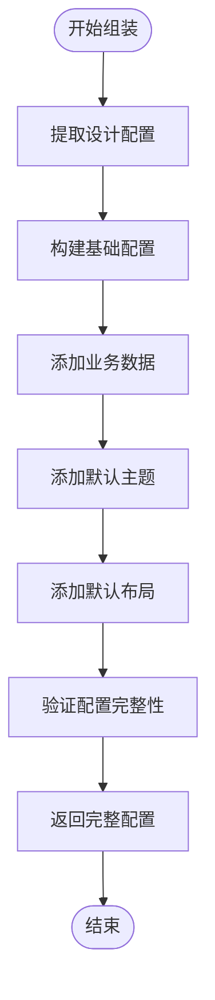

**图表来源**
- [config_assembler.py](file://backend/app/services/config_assembler.py#L14-L52)

**章节来源**
- [data_validator.py](file://backend/app/services/data_validator.py#L1-L160)
- [config_assembler.py](file://backend/app/services/config_assembler.py#L1-L103)

## 依赖关系分析

生成服务的依赖关系体现了清晰的分层架构：

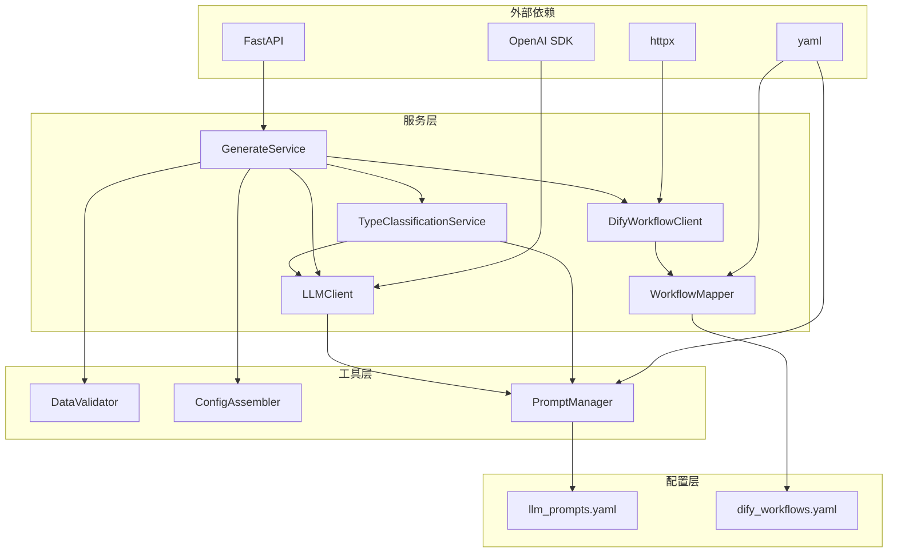

**图表来源**
- [generate_service.py](file://backend/app/services/generate_service.py#L1-L16)
- [workflow_mapper.py](file://backend/app/services/workflow_mapper.py#L1-L10)

### 循环依赖处理
生成服务通过以下策略避免循环依赖：
- 使用工厂函数获取服务实例
- 采用延迟初始化策略
- 通过接口抽象解耦具体实现

**章节来源**
- [generate_service.py](file://backend/app/services/generate_service.py#L1-L16)
- [workflow_mapper.py](file://backend/app/services/workflow_mapper.py#L1-L10)

## 性能考虑

生成服务在设计时充分考虑了性能优化：

### 并发处理
- 异步API调用减少I/O等待时间
- 并行执行多个独立的服务调用
- 连接池复用提高网络效率

### 缓存策略
- 提示词配置的内存缓存
- 模板元数据的本地缓存
- 工作流配置的热重载支持

### 错误恢复
- 指数退避重试机制
- 自动降级到备用服务
- 完善的错误边界处理

## 故障排除指南

### 常见问题和解决方案

#### LLM调用失败
**症状**: API调用超时或配额限制
**解决方案**: 
1. 检查API密钥配置
2. 调整超时参数
3. 实现重试机制

#### Dify工作流失败
**症状**: 工作流执行失败或返回空数据
**解决方案**:
1. 检查工作流配置
2. 验证模板映射关系
3. 查看工作流执行日志

#### 数据校验失败
**症状**: Dify返回的数据不符合Schema
**解决方案**:
1. 检查模板Schema定义
2. 验证工作流输出格式
3. 实现数据修复逻辑

**章节来源**
- [llm_client.py](file://backend/app/services/llm_client.py#L80-L92)
- [dify_workflow_client.py](file://backend/app/services/dify_workflow_client.py#L115-L132)
- [data_validator.py](file://backend/app/services/data_validator.py#L90-L102)

## 结论

生成服务代表了现代AI驱动的信息图生成系统的最佳实践。通过精心设计的三阶段流程、灵活的双模式数据生成策略、robust的错误处理机制，以及完善的监控体系，该服务能够可靠地将用户的自然语言输入转换为高质量的信息图配置。

### 主要优势
- **智能化程度高**: 通过类型识别和模板选择实现精准匹配
- **灵活性强**: 支持多种数据生成方式和配置策略
- **可靠性高**: 完善的错误处理和回退机制
- **可扩展性好**: 模块化设计便于功能扩展

### 技术特色
- **混合AI策略**: 结合传统LLM和现代工作流技术
- **Schema驱动**: 基于严格Schema的数据验证和转换
- **实时监控**: 详细的性能统计和错误追踪
- **热配置**: 支持运行时配置更新

生成服务为用户提供了一个强大而易用的信息图生成平台，大大降低了专业图表制作的门槛，同时保持了高度的定制化能力。