# 后端服务

<cite>
**本文档引用的文件**   
- [main.py](file://backend/app/main.py)
- [config.py](file://backend/app/config.py)
- [generate.py](file://backend/app/api/v1/generate.py)
- [templates.py](file://backend/app/api/v1/templates.py)
- [works.py](file://backend/app/api/v1/works.py)
- [export.py](file://backend/app/api/v1/export.py)
- [generate_service.py](file://backend/app/services/generate_service.py)
- [template_service.py](file://backend/app/services/template_service.py)
- [export_service.py](file://backend/app/services/export_service.py)
- [template.py](file://backend/app/models/template.py)
- [work.py](file://backend/app/models/work.py)
- [template_repo.py](file://backend/app/repositories/template_repo.py)
- [work_repo.py](file://backend/app/repositories/work_repo.py)
- [common.py](file://backend/app/schemas/common.py)
- [infographic.py](file://backend/app/schemas/infographic.py)
- [template.py](file://backend/app/schemas/template.py)
- [work.py](file://backend/app/schemas/work.py)
</cite>

## 目录
1. [简介](#简介)
2. [项目结构](#项目结构)
3. [核心组件](#核心组件)
4. [架构概述](#架构概述)
5. [详细组件分析](#详细组件分析)
6. [依赖分析](#依赖分析)
7. [性能考虑](#性能考虑)
8. [故障排除指南](#故障排除指南)
9. [结论](#结论)

## 简介
本文档详细描述了基于FastAPI的后端服务实现，该服务是AI信息图生成系统的核心。系统通过集成AntV Infographic库，实现了从用户文本输入到信息图生成、模板管理、作品保存和多格式导出的完整流程。后端服务采用模块化设计，包含API路由、服务层、数据模型、仓库和工具组件，支持智能生成（三阶段流程）和传统生成两种模式。文档重点阐述了API设计、服务架构、数据模型、业务逻辑处理以及错误处理和安全性考虑。

## 项目结构
后端服务位于`backend/app`目录下，采用标准的FastAPI项目结构，按功能模块进行分层组织。

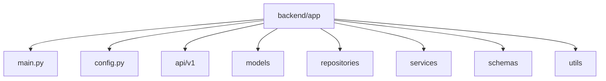

**Diagram sources**
- [main.py](file://backend/app/main.py)
- [config.py](file://backend/app/config.py)

**Section sources**
- [main.py](file://backend/app/main.py)
- [config.py](file://backend/app/config.py)

## 核心组件
后端服务的核心组件包括API路由、服务层、数据模型和仓库。API路由定义了`export`、`generate`、`templates`和`works`四个主要端点，分别处理导出、信息图生成、模板管理和作品管理。服务层（`generate_service`、`template_service`、`export_service`）封装了核心业务逻辑，实现了关注点分离。数据模型（`Template`、`UserWork`）定义了数据库实体及其关系，通过SQLAlchemy ORM进行映射。仓库层（`template_repo`、`work_repo`）提供了对数据库的抽象访问，实现了数据访问逻辑与业务逻辑的解耦。

**Section sources**
- [generate.py](file://backend/app/api/v1/generate.py)
- [templates.py](file://backend/app/api/v1/templates.py)
- [works.py](file://backend/app/api/v1/works.py)
- [export.py](file://backend/app/api/v1/export.py)
- [generate_service.py](file://backend/app/services/generate_service.py)
- [template_service.py](file://backend/app/services/template_service.py)
- [export_service.py](file://backend/app/services/export_service.py)
- [template.py](file://backend/app/models/template.py)
- [work.py](file://backend/app/models/work.py)
- [template_repo.py](file://backend/app/repositories/template_repo.py)
- [work_repo.py](file://backend/app/repositories/work_repo.py)

## 架构概述
系统采用分层架构，从上到下分为API层、服务层、仓库层和数据层。API层通过FastAPI路由接收HTTP请求，调用服务层的业务逻辑。服务层协调多个仓库和外部客户端（如LLM），处理复杂的业务流程。仓库层负责与数据库交互，执行CRUD操作。数据层由SQLite（开发环境）或PostgreSQL（生产环境）数据库组成。这种分层设计确保了代码的可维护性和可测试性。

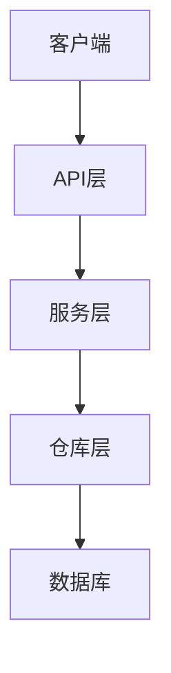

**Diagram sources**
- [main.py](file://backend/app/main.py)
- [generate_service.py](file://backend/app/services/generate_service.py)
- [template_service.py](file://backend/app/services/template_service.py)
- [export_service.py](file://backend/app/services/export_service.py)

## 详细组件分析

### API路由设计
API路由设计遵循RESTful原则，为不同的功能域提供了清晰的端点。

#### 生成端点分析
`generate`端点支持两种信息图生成模式：智能生成和传统生成。

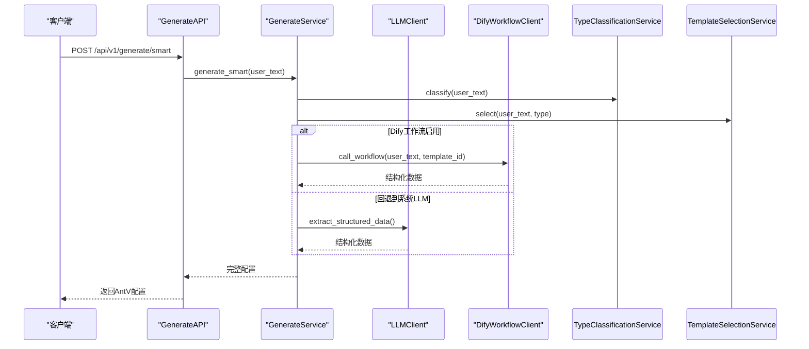

**Diagram sources**
- [generate.py](file://backend/app/api/v1/generate.py)
- [generate_service.py](file://backend/app/services/generate_service.py)

#### 模板端点分析
`templates`端点提供了模板的查询和推荐功能。

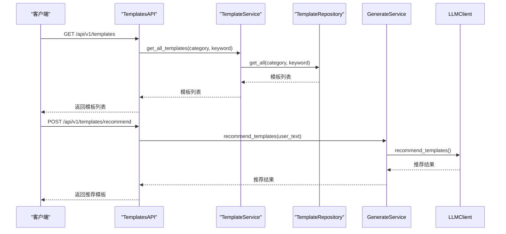

**Diagram sources**
- [templates.py](file://backend/app/api/v1/templates.py)
- [template_service.py](file://backend/app/services/template_service.py)
- [template_repo.py](file://backend/app/repositories/template_repo.py)

#### 作品管理端点分析
`works`端点负责用户作品的持久化。

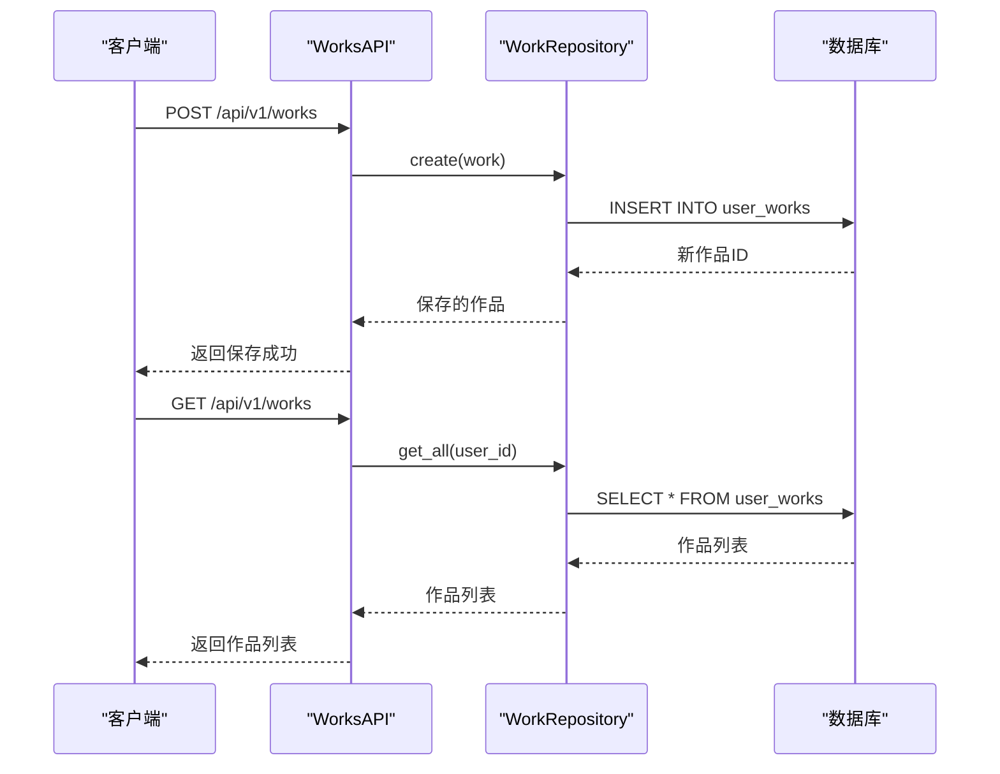

**Diagram sources**
- [works.py](file://backend/app/api/v1/works.py)
- [work_repo.py](file://backend/app/repositories/work_repo.py)

#### 导出端点分析
`export`端点处理信息图的多格式导出。

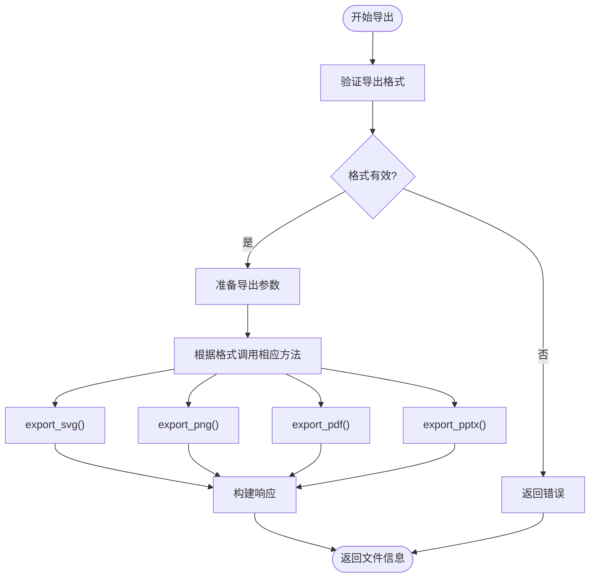

**Diagram sources**
- [export.py](file://backend/app/api/v1/export.py)
- [export_service.py](file://backend/app/services/export_service.py)

### 服务层架构
服务层是业务逻辑的核心，各服务职责分明。

#### GenerateService职责分析
`GenerateService`是信息图生成的核心，实现了三阶段智能生成流程。

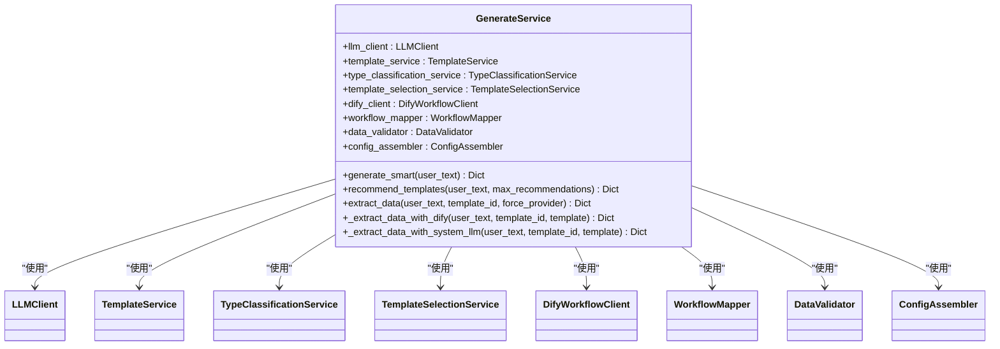

**Diagram sources**
- [generate_service.py](file://backend/app/services/generate_service.py)

#### TemplateService职责分析
`TemplateService`负责管理模板的元数据和配置。

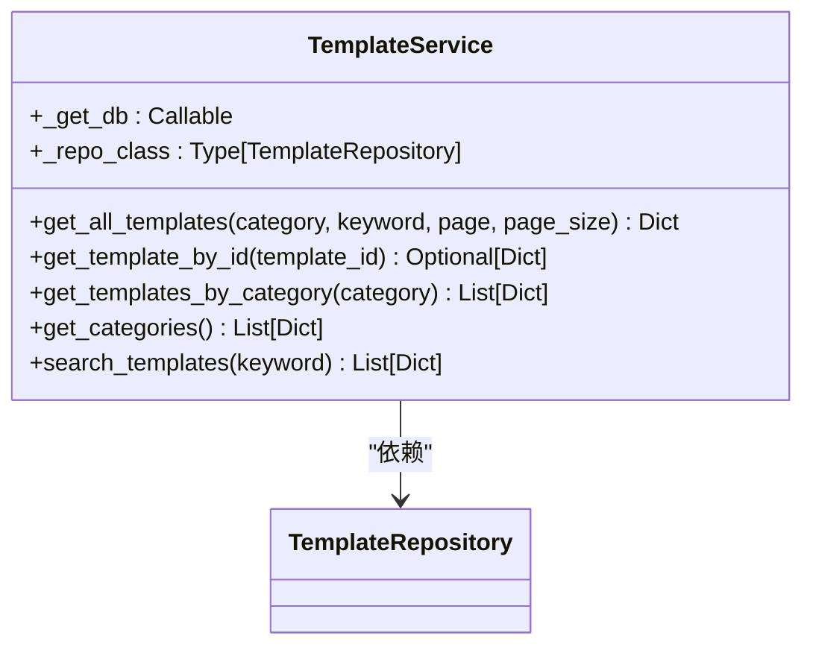

**Diagram sources**
- [template_service.py](file://backend/app/services/template_service.py)

#### ExportService职责分析
`ExportService`提供了统一的导出接口。

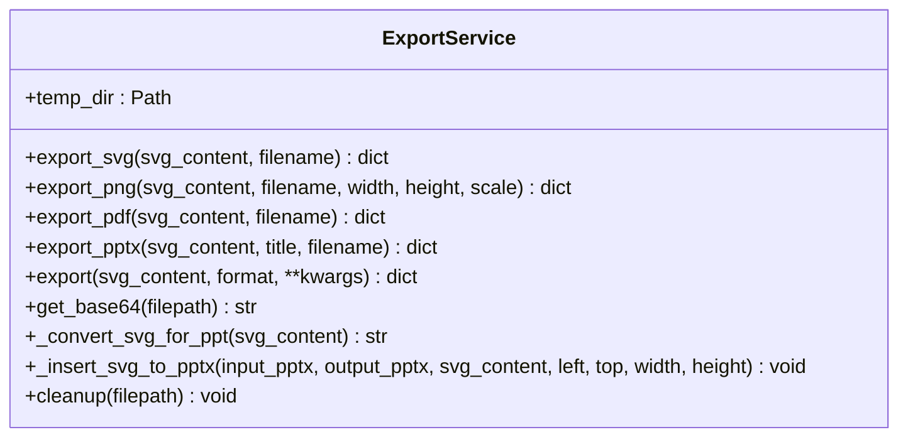

**Diagram sources**
- [export_service.py](file://backend/app/services/export_service.py)

### 数据模型定义
数据模型定义了系统中的核心实体及其关系。

#### Template和Work实体关系
`Template`和`UserWork`实体通过外键关联，表示一个模板可以被多个作品使用。

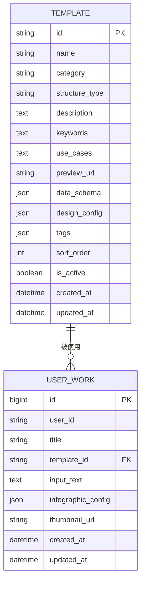

**Diagram sources**
- [template.py](file://backend/app/models/template.py)
- [work.py](file://backend/app/models/work.py)

### 业务逻辑处理流程
系统实现了复杂的业务逻辑，包括模板推荐和数据提取。

#### 模板推荐算法
模板推荐算法利用LLM分析用户输入文本，并从可用模板中选择最合适的。

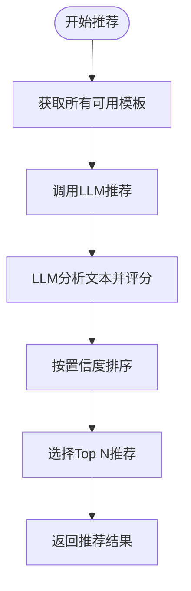

**Diagram sources**
- [generate_service.py](file://backend/app/services/generate_service.py)

#### 数据提取逻辑
数据提取逻辑优先尝试使用Dify工作流，失败时回退到系统LLM。

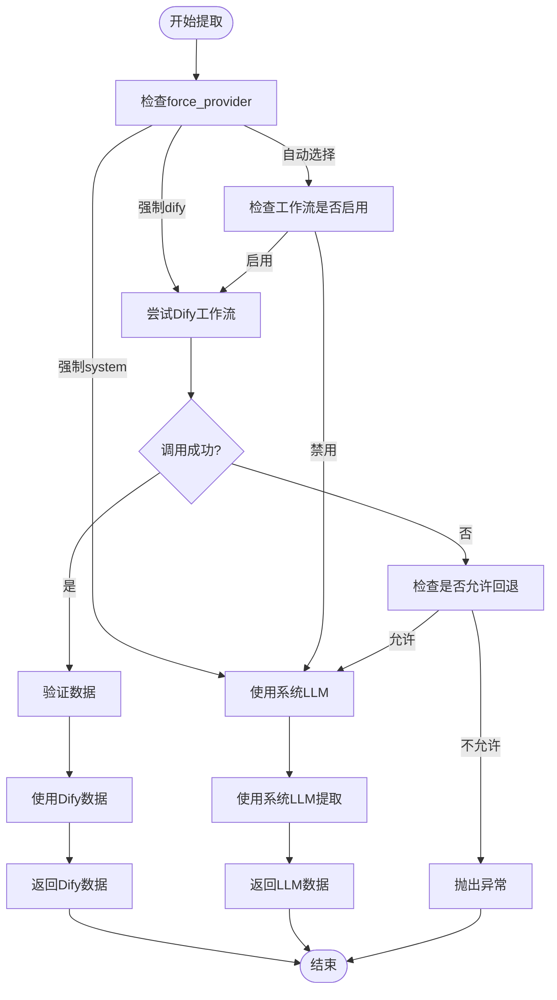

**Diagram sources**
- [generate_service.py](file://backend/app/services/generate_service.py)

### 错误处理机制
系统实现了全面的错误处理机制，确保API的健壮性。

#### 全局异常处理
在`main.py`中定义了全局异常处理器，捕获未处理的异常。

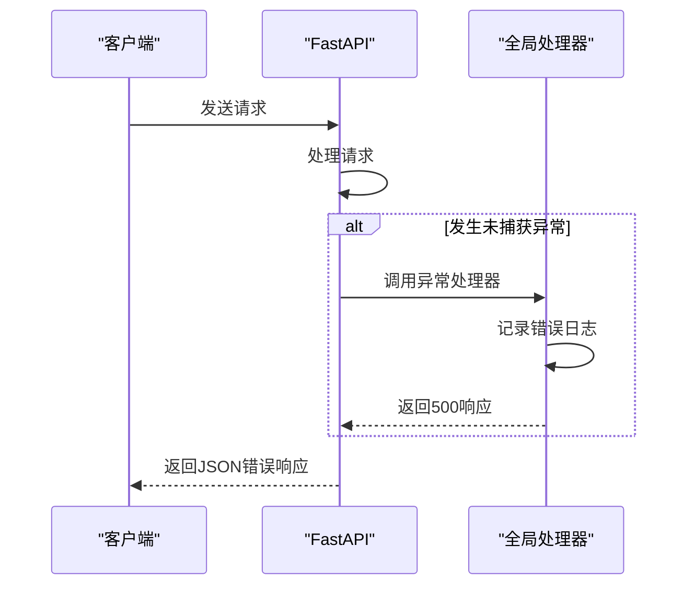

**Diagram sources**
- [main.py](file://backend/app/main.py)

#### 输入验证
使用Pydantic模型进行输入验证，确保请求数据的合法性。

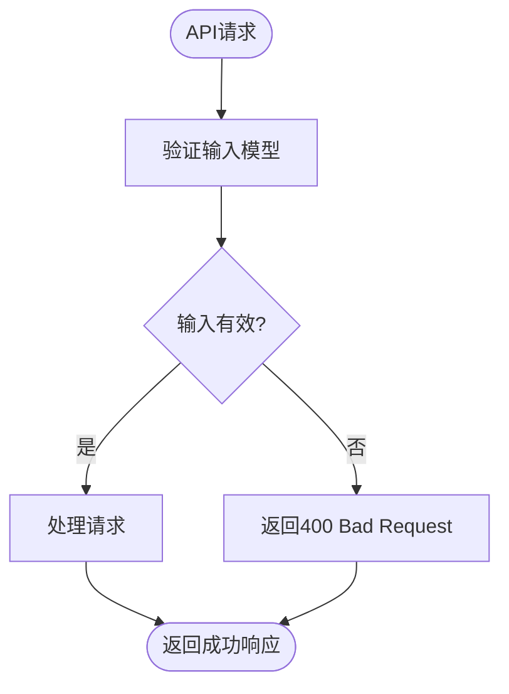

**Diagram sources**
- [infographic.py](file://backend/app/schemas/infographic.py)
- [work.py](file://backend/app/schemas/work.py)

### API安全性考虑
API安全性通过CORS配置和输入验证来保障。

#### CORS配置
系统配置了CORS中间件，允许特定来源的跨域请求。

```python
app.add_middleware(
    CORSMiddleware,
    allow_origins=["*"],  # 临时允许所有来源，用于调试
    allow_credentials=False,
    allow_methods=["*"],
    allow_headers=["*"],
)
```

**Section sources**
- [main.py](file://backend/app/main.py#L28-L36)

### 性能监控和日志记录
系统集成了日志记录，为性能监控和故障排除提供支持。

#### 日志记录最佳实践
使用Python标准库的`logging`模块进行日志记录。

```python
logging.basicConfig(
    level=logging.INFO,
    format='%(asctime)s - %(name)s - %(levelname)s - %(message)s'
)
logger = logging.getLogger(__name__)
```

关键操作（如API调用、数据库操作、外部服务调用）都会记录日志，便于追踪和分析。

**Section sources**
- [main.py](file://backend/app/main.py#L11-L15)
- [generate_service.py](file://backend/app/services/generate_service.py#L8-L9)

## 依赖分析
系统依赖于多个外部库和内部模块。

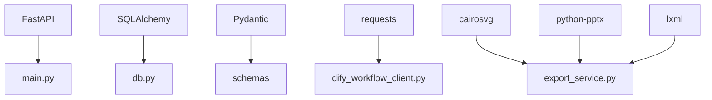

**Diagram sources**
- [main.py](file://backend/app/main.py)
- [db.py](file://backend/app/utils/db.py)
- [schemas](file://backend/app/schemas/)
- [dify_workflow_client.py](file://backend/app/services/dify_workflow_client.py)
- [export_service.py](file://backend/app/services/export_service.py)

## 性能考虑
系统在性能方面进行了以下考虑：
- **数据库连接池**：在生产环境中使用连接池，避免频繁创建和销毁数据库连接。
- **异步处理**：API端点使用`async`/`await`，提高并发处理能力。
- **缓存**：虽然当前代码未实现，但建议对模板列表等不常变化的数据进行缓存。
- **资源管理**：导出服务将文件保存在临时目录，避免占用过多内存。

## 故障排除指南
### 常见问题
1. **导出PPTX失败**：确保安装了`python-pptx`和`lxml`库。
2. **Dify工作流调用失败**：检查`DIFY_API_KEY`和`DIFY_API_BASE_URL`配置是否正确。
3. **数据库连接失败**：检查`DATABASE_URL`环境变量。

### 调试端点
系统提供了调试端点`/api/v1/generate/debug/workflow-mapper`，可用于查看工作流映射状态。

**Section sources**
- [generate.py](file://backend/app/api/v1/generate.py#L90-L115)

## 结论
本文档详细描述了FastAPI后端服务的实现。系统通过清晰的分层架构和模块化设计，实现了信息图生成的核心功能。API设计合理，服务层职责分明，数据模型定义准确。系统支持智能生成和传统生成两种模式，并提供了完善的错误处理和日志记录机制。未来可考虑增加缓存、更精细的权限控制和更全面的性能监控。