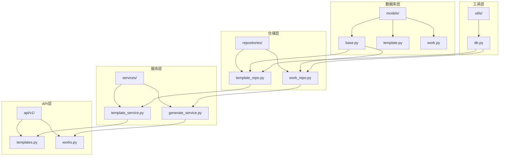
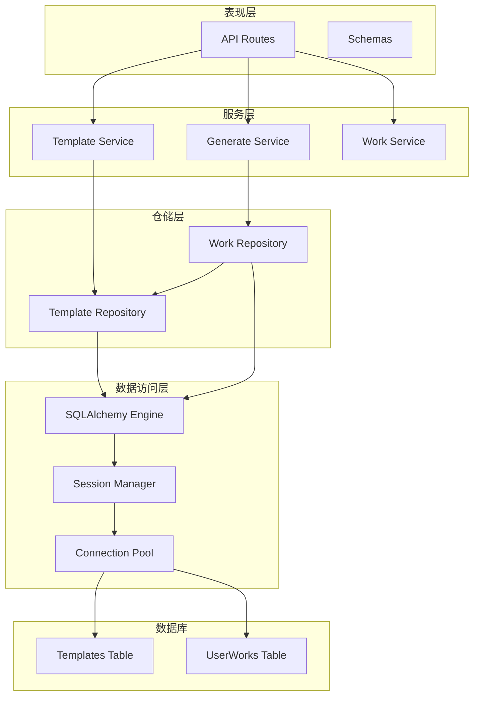
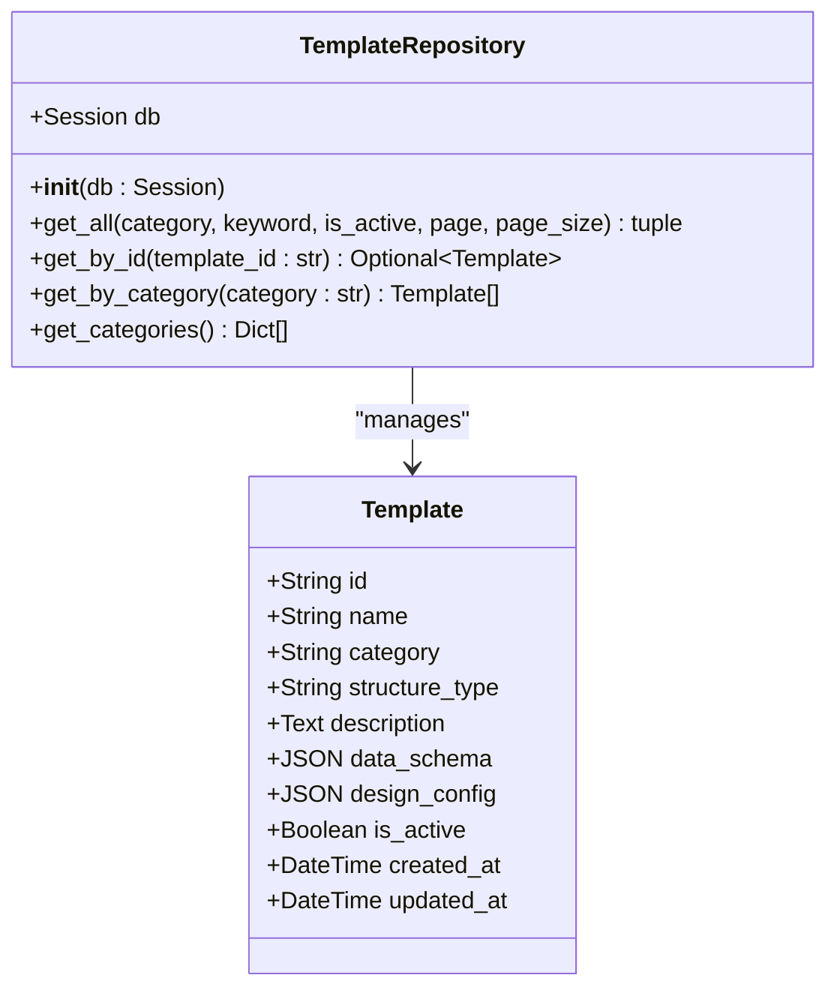
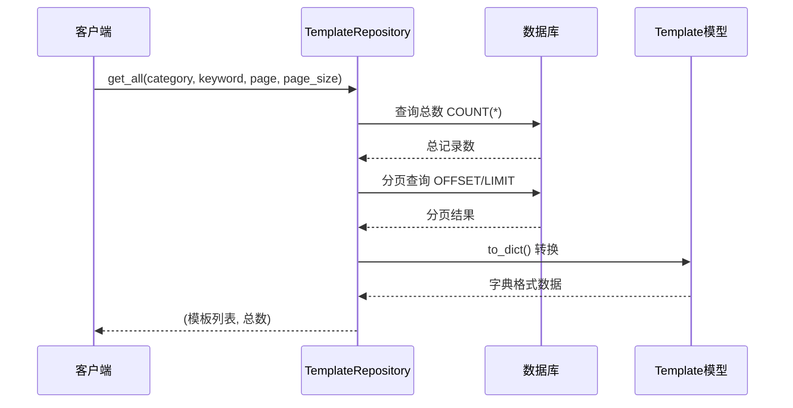
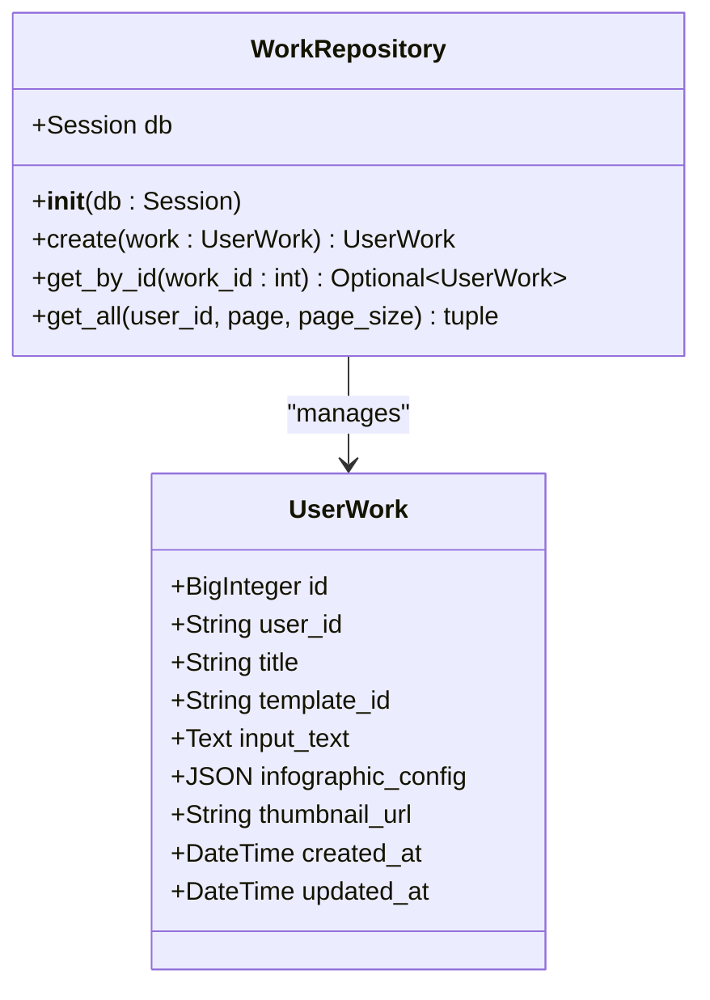
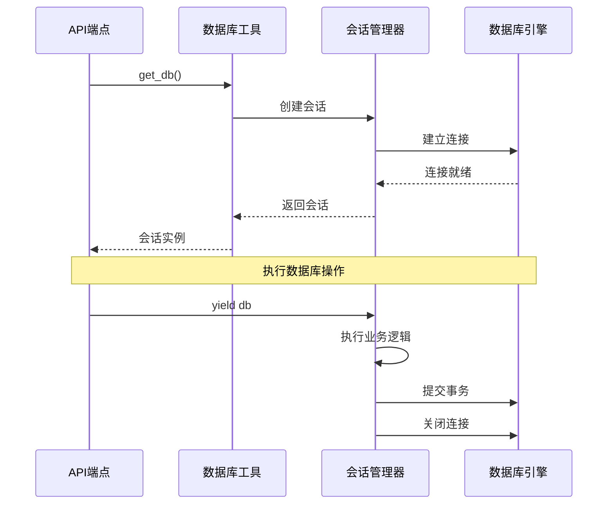
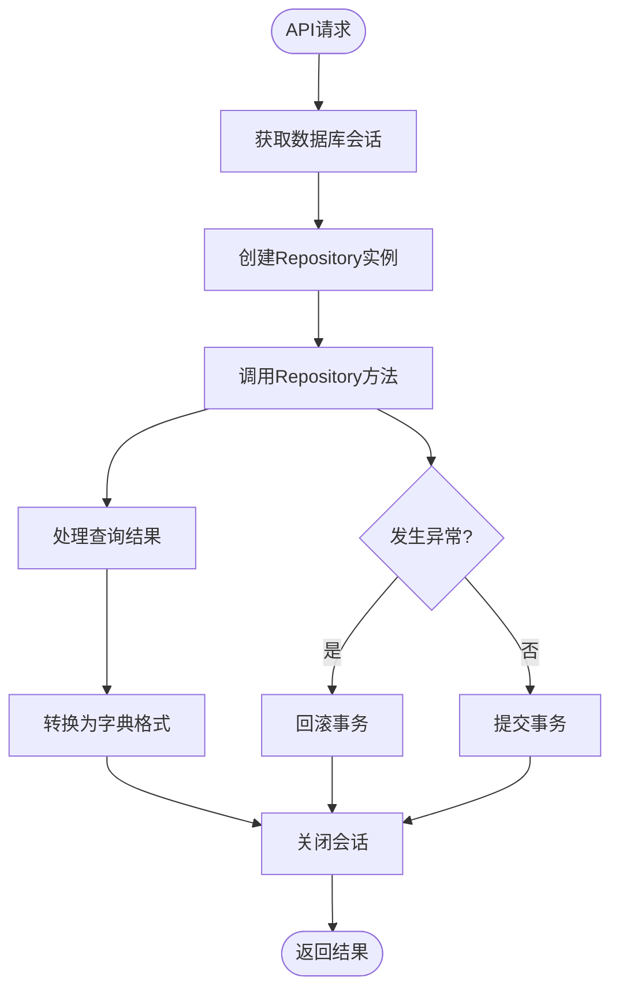
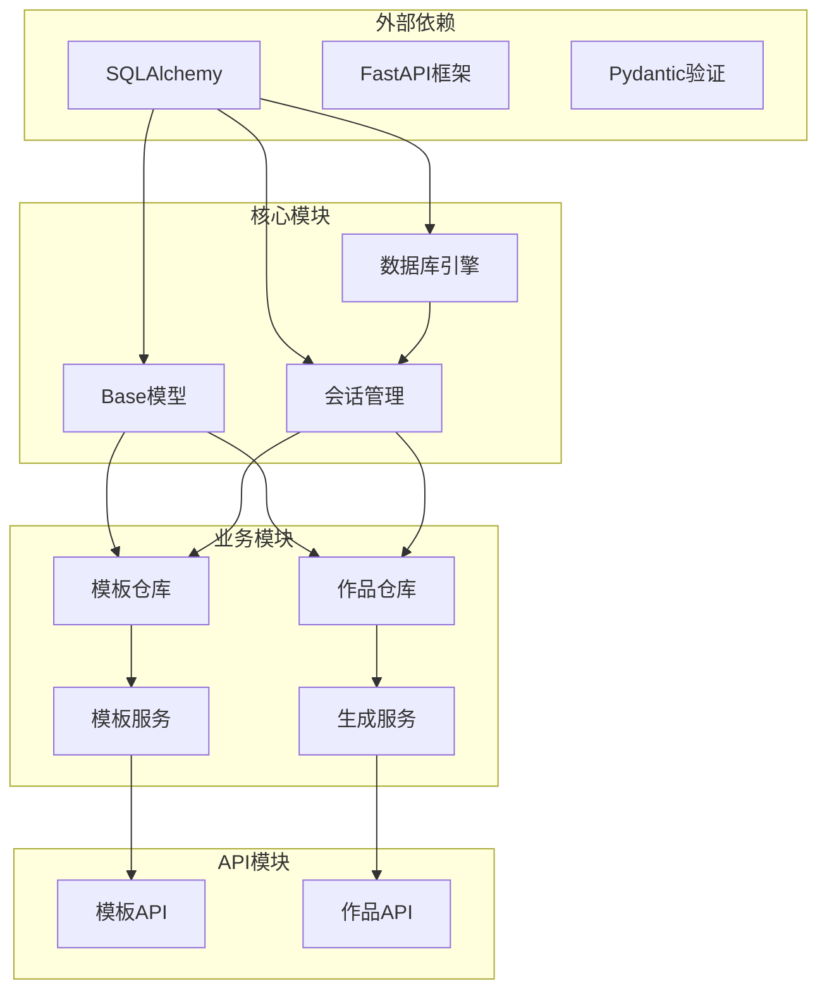
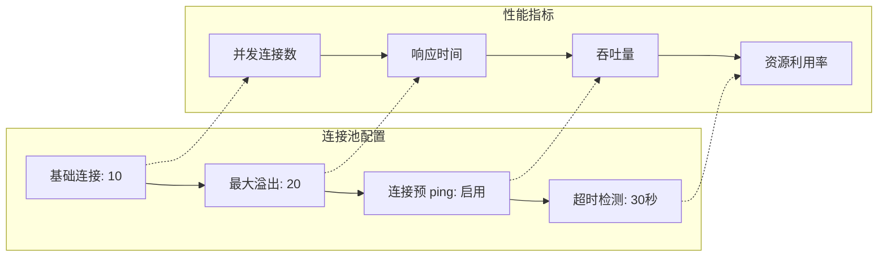
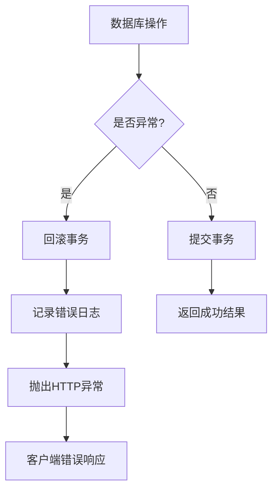

# 数据库操作

<cite>
**本文档引用的文件**
- [template_repo.py](file://backend/app/repositories/template_repo.py)
- [work_repo.py](file://backend/app/repositories/work_repo.py)
- [db.py](file://backend/app/utils/db.py)
- [base.py](file://backend/app/models/base.py)
- [template.py](file://backend/app/models/template.py)
- [work.py](file://backend/app/models/work.py)
- [main.py](file://backend/app/main.py)
- [config.py](file://backend/app/config.py)
- [templates.py](file://backend/app/api/v1/templates.py)
- [works.py](file://backend/app/api/v1/works.py)
- [template_service.py](file://backend/app/services/template_service.py)
- [generate_service.py](file://backend/app/services/generate_service.py)
</cite>

## 目录
1. [简介](#简介)
2. [项目结构](#项目结构)
3. [核心组件](#核心组件)
4. [架构概览](#架构概览)
5. [详细组件分析](#详细组件分析)
6. [依赖关系分析](#依赖关系分析)
7. [性能考虑](#性能考虑)
8. [故障排除指南](#故障排除指南)
9. [结论](#结论)

## 简介

本文档详细描述了基于 SQLAlchemy 的数据库操作实现，重点关注数据访问层的设计和实现。系统采用仓库模式（Repository Pattern）封装数据库访问逻辑，实现了清晰的服务层与数据层分离，提供了完整的 CRUD 操作功能，并包含了复杂查询、事务管理和性能优化策略。

## 项目结构

数据库相关的核心文件组织结构如下：

**图表来源**
- [base.py](file://backend/app/models/base.py#L1-L8)
- [template_repo.py](file://backend/app/repositories/template_repo.py#L1-L144)
- [work_repo.py](file://backend/app/repositories/work_repo.py#L1-L82)
- [db.py](file://backend/app/utils/db.py#L1-L94)

**章节来源**
- [base.py](file://backend/app/models/base.py#L1-L8)
- [template_repo.py](file://backend/app/repositories/template_repo.py#L1-L144)
- [work_repo.py](file://backend/app/repositories/work_repo.py#L1-L82)
- [db.py](file://backend/app/utils/db.py#L1-L94)

## 核心组件

### 数据库引擎配置

系统支持开发环境（SQLite）和生产环境（PostgreSQL）的数据库配置，通过连接池优化数据库连接管理：

- **SQLite 配置**：适用于开发和测试环境，使用静态连接池
- **PostgreSQL 配置**：适用于生产环境，支持连接预 ping 和动态连接池
- **连接池参数**：
  - `pool_size`: 连接池大小（默认10）
  - `max_overflow`: 最大溢出连接数（默认20）
  - `pool_pre_ping`: 启用连接预 ping 检查

### ORM 模型设计

系统定义了两个核心数据模型，分别对应模板和用户作品：

#### 模板模型 (Template)
- 主键：字符串类型的唯一标识符
- 分类字段：支持7种预定义分类
- 结构类型：AntV 结构类型映射
- 数据架构：JSON 格式存储数据结构
- 设计配置：JSON 格式存储设计配置
- 索引优化：复合索引支持高效查询

#### 用户作品模型 (UserWork)
- 主键：自增的 BigInteger 类型
- 外键关联：与模板模型建立关联
- 输入文本：原始用户输入内容
- 配置数据：完整的 Infographic 配置
- 时间戳：自动维护创建和更新时间

**章节来源**
- [db.py](file://backend/app/utils/db.py#L18-L36)
- [template.py](file://backend/app/models/template.py#L1-L54)
- [work.py](file://backend/app/models/work.py#L1-L37)

## 架构概览

系统采用分层架构设计，实现了清晰的关注点分离：

**图表来源**
- [templates.py](file://backend/app/api/v1/templates.py#L1-L99)
- [works.py](file://backend/app/api/v1/works.py#L1-L106)
- [template_service.py](file://backend/app/services/template_service.py#L1-L281)
- [generate_service.py](file://backend/app/services/generate_service.py#L1-L465)

## 详细组件分析

### TemplateRepository - 模板仓库

TemplateRepository 是模板数据访问的核心组件，提供了丰富的查询功能：

#### 核心查询方法

**图表来源**
- [template_repo.py](file://backend/app/repositories/template_repo.py#L13-L144)
- [template.py](file://backend/app/models/template.py#L9-L54)

#### 分页查询实现

系统实现了高效的分页查询机制，支持多种筛选条件：

- **基础筛选**：分类、激活状态
- **全文搜索**：名称、描述、适用场景的模糊匹配
- **排序规则**：按排序权重降序、创建时间降序
- **性能优化**：先执行 COUNT 查询获取总数，再执行分页查询

#### 复杂查询示例

**图表来源**
- [template_repo.py](file://backend/app/repositories/template_repo.py#L25-L73)

**章节来源**
- [template_repo.py](file://backend/app/repositories/template_repo.py#L1-L144)

### WorkRepository - 作品仓库

WorkRepository 专注于用户作品的 CRUD 操作：

#### 核心操作方法

**图表来源**
- [work_repo.py](file://backend/app/repositories/work_repo.py#L12-L82)
- [work.py](file://backend/app/models/work.py#L9-L37)

#### 事务处理机制

系统通过上下文管理器实现自动事务管理：

- **自动提交**：正常执行完成后自动提交
- **自动回滚**：发生异常时自动回滚
- **资源清理**：确保数据库连接正确关闭

**章节来源**
- [work_repo.py](file://backend/app/repositories/work_repo.py#L1-L82)

### 数据库会话管理

#### 上下文管理器模式

**图表来源**
- [db.py](file://backend/app/utils/db.py#L58-L76)

#### 连接池配置策略

系统根据环境自动调整连接池配置：

- **开发环境**：使用 SQLite，静态连接池，禁用连接预 ping
- **生产环境**：使用 PostgreSQL，动态连接池，启用连接预 ping
- **性能参数**：
  - 连接池大小：10个基础连接
  - 最大溢出：20个额外连接
  - 连接超时：30秒

**章节来源**
- [db.py](file://backend/app/utils/db.py#L1-L94)

### 服务层集成

#### 模板服务集成

**图表来源**
- [template_service.py](file://backend/app/services/template_service.py#L170-L200)

**章节来源**
- [template_service.py](file://backend/app/services/template_service.py#L1-L281)
- [generate_service.py](file://backend/app/services/generate_service.py#L1-L465)

## 依赖关系分析

### 组件依赖图

**图表来源**
- [base.py](file://backend/app/models/base.py#L1-L8)
- [db.py](file://backend/app/utils/db.py#L1-L94)
- [template_repo.py](file://backend/app/repositories/template_repo.py#L1-L144)
- [work_repo.py](file://backend/app/repositories/work_repo.py#L1-L82)

### 循环依赖避免

系统通过以下策略避免循环依赖：

- **接口抽象**：使用抽象基类定义接口
- **延迟导入**：在方法内部导入依赖模块
- **服务单例**：通过全局变量管理服务实例
- **依赖注入**：通过构造函数注入依赖

**章节来源**
- [template_service.py](file://backend/app/services/template_service.py#L160-L170)
- [generate_service.py](file://backend/app/services/generate_service.py#L455-L465)

## 性能考虑

### 查询优化策略

#### 索引设计

系统在关键字段上建立了复合索引：

- **模板表**：`(category, sort_order)` 复合索引
- **作品表**：`user_id` 单字段索引
- **外键索引**：自动为外键字段创建索引

#### 查询性能优化

- **分页查询**：使用 OFFSET/LIMIT 实现高效分页
- **条件过滤**：支持多条件组合查询
- **字段选择**：仅查询必要的字段
- **批量操作**：支持批量插入和更新

### 连接池优化

#### 生产环境配置

**图表来源**
- [db.py](file://backend/app/utils/db.py#L30-L36)

### 内存管理

- **会话生命周期**：严格控制会话的创建和销毁
- **对象缓存**：合理使用 SQLAlchemy 的对象缓存机制
- **垃圾回收**：及时释放不再使用的数据库连接

## 故障排除指南

### 常见问题及解决方案

#### 数据库连接问题

**问题症状**：连接超时、连接拒绝

**解决方案**：
1. 检查数据库服务状态
2. 验证连接字符串配置
3. 调整连接池参数
4. 检查防火墙设置

#### 查询性能问题

**问题症状**：查询响应缓慢

**解决方案**：
1. 分析 SQL 查询计划
2. 添加适当的索引
3. 优化查询条件
4. 考虑查询缓存

#### 事务处理问题

**问题症状**：数据不一致、死锁

**解决方案**：
1. 确保事务边界清晰
2. 避免长时间持有锁
3. 使用合适的隔离级别
4. 实现重试机制

### 错误处理机制

#### 全局异常处理

**图表来源**
- [main.py](file://backend/app/main.py#L39-L54)

**章节来源**
- [main.py](file://backend/app/main.py#L1-L113)
- [db.py](file://backend/app/utils/db.py#L58-L76)

## 结论

本文档全面介绍了基于 SQLAlchemy 的数据库操作实现，展示了现代 Python Web 应用中数据访问层的最佳实践。系统通过仓库模式实现了清晰的分层架构，通过上下文管理器确保了事务的正确处理，通过连接池优化了数据库性能。

### 关键优势

1. **架构清晰**：分层设计实现了关注点分离
2. **性能优化**：连接池和索引优化提升了查询效率
3. **事务安全**：自动事务管理确保数据一致性
4. **可扩展性**：模块化设计便于功能扩展

### 最佳实践总结

- 使用仓库模式封装数据库访问逻辑
- 通过上下文管理器管理数据库会话
- 合理设计索引提升查询性能
- 实现完善的错误处理机制
- 控制事务范围确保数据一致性

这套数据库操作方案为企业级应用提供了稳定、高效的数据访问能力，为系统的整体性能和可靠性奠定了坚实基础。