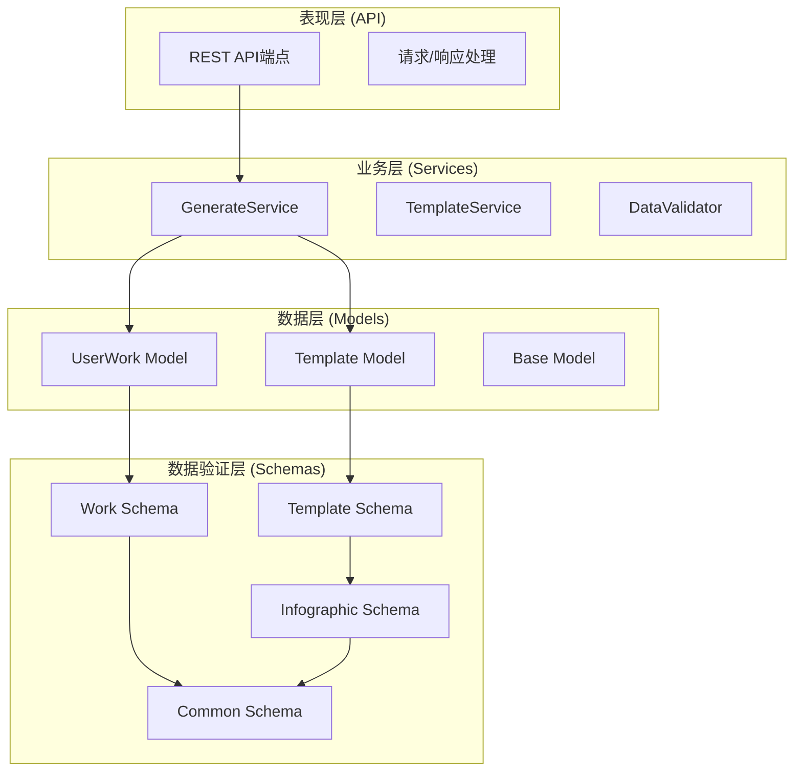
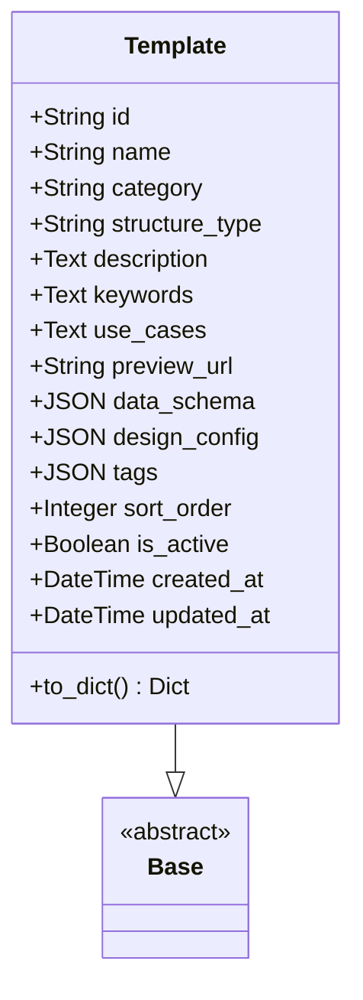
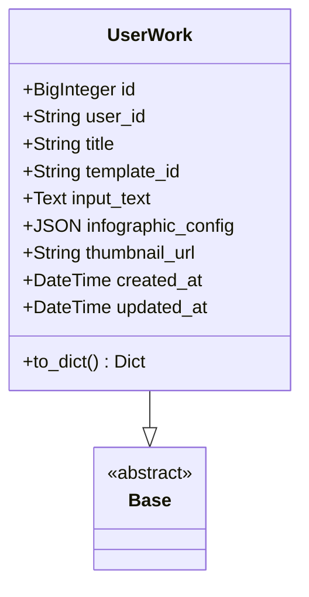
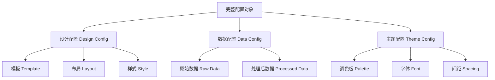
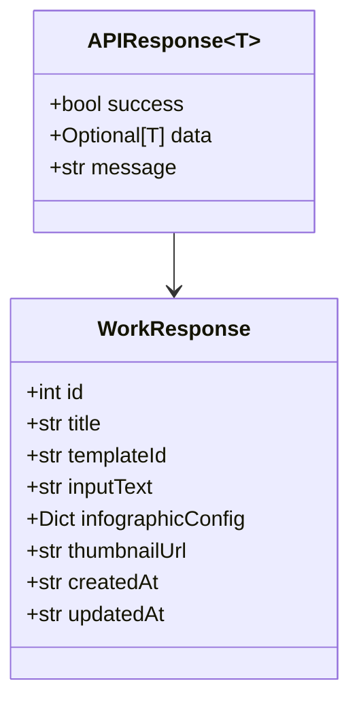
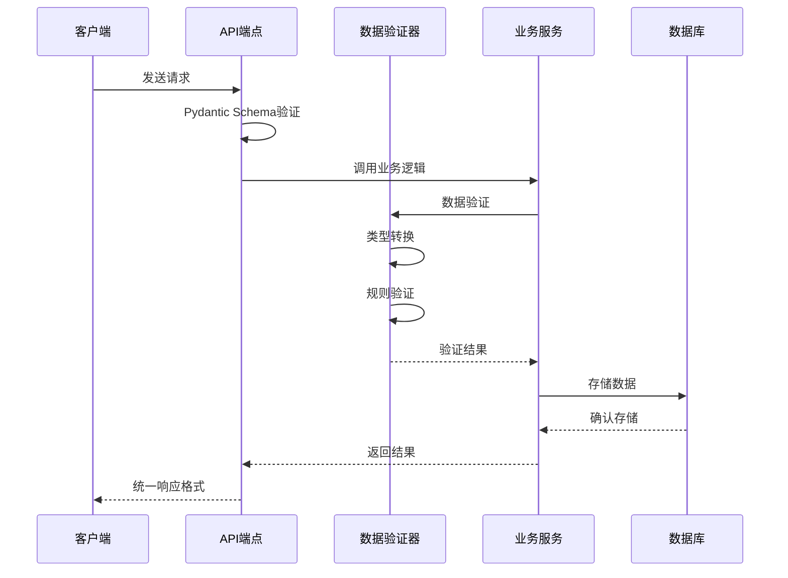
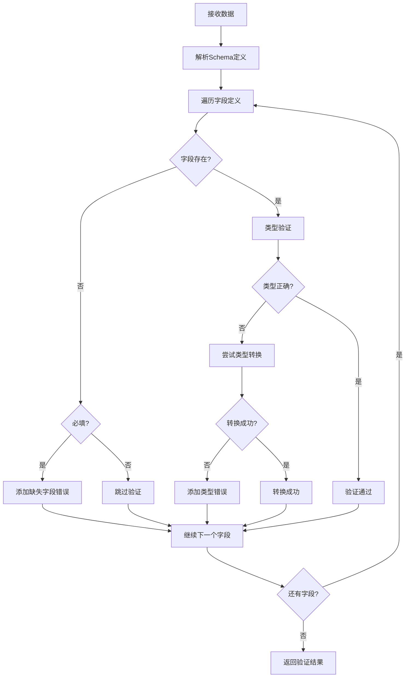

# API数据模型

<cite>
**本文档引用的文件**
- [backend/app/models/template.py](file://backend/app/models/template.py)
- [backend/app/models/work.py](file://backend/app/models/work.py)
- [backend/app/models/base.py](file://backend/app/models/base.py)
- [backend/app/schemas/template.py](file://backend/app/schemas/template.py)
- [backend/app/schemas/work.py](file://backend/app/schemas/work.py)
- [backend/app/schemas/infographic.py](file://backend/app/schemas/infographic.py)
- [backend/app/schemas/common.py](file://backend/app/schemas/common.py)
- [backend/app/api/v1/templates.py](file://backend/app/api/v1/templates.py)
- [backend/app/api/v1/works.py](file://backend/app/api/v1/works.py)
- [backend/app/services/data_validator.py](file://backend/app/services/data_validator.py)
- [backend/app/services/generate_service.py](file://backend/app/services/generate_service.py)
- [backend/app/utils/db.py](file://backend/app/utils/db.py)
</cite>

## 目录
1. [简介](#简介)
2. [项目结构概览](#项目结构概览)
3. [核心数据模型](#核心数据模型)
4. [Pydantic Schema设计](#pydantic-schema设计)
5. [信息图配置数据结构](#信息图配置数据结构)
6. [通用响应格式](#通用响应格式)
7. [数据转换机制](#数据转换机制)
8. [验证器与自定义验证](#验证器与自定义验证)
9. [实际使用示例](#实际使用示例)
10. [最佳实践与故障排除](#最佳实践与故障排除)

## 简介

本文档详细介绍了GenAI Chart项目中API数据模型的设计与应用，重点阐述了Pydantic Schema在数据验证、序列化和API交互中的核心作用。项目采用分层架构设计，通过清晰的模型分离实现了数据层、业务层和表现层的有效解耦。

## 项目结构概览

项目的数据模型采用三层架构设计：



**图表来源**
- [backend/app/api/v1/templates.py](file://backend/app/api/v1/templates.py#L1-L99)
- [backend/app/api/v1/works.py](file://backend/app/api/v1/works.py#L1-L106)
- [backend/app/services/generate_service.py](file://backend/app/services/generate_service.py#L1-L465)

## 核心数据模型

### 模板模型 (Template)

模板模型定义了信息图模板的基本结构，包含了模板的所有元数据信息。



**图表来源**
- [backend/app/models/template.py](file://backend/app/models/template.py#L9-L54)

**节来源**
- [backend/app/models/template.py](file://backend/app/models/template.py#L1-L54)

### 作品模型 (UserWork)

作品模型记录了用户创建的信息图作品，包括作品的基本信息和配置数据。



**图表来源**
- [backend/app/models/work.py](file://backend/app/models/work.py#L9-L37)

**节来源**
- [backend/app/models/work.py](file://backend/app/models/work.py#L1-L37)

## Pydantic Schema设计

### 模板相关Schema

#### TemplateRecommendRequest - 模板推荐请求

该Schema定义了模板推荐功能的请求格式，包含用户输入文本和推荐数量限制。

| 字段名 | 类型 | 必填 | 默认值 | 描述 |
|--------|------|------|--------|------|
| text | str | ✓ | - | 用户输入的文本内容，最小长度1字符 |
| maxRecommendations | int | ✗ | 5 | 最多推荐数量，范围1-10 |

#### TemplateRecommendation - 单个模板推荐结果

定义了单个模板推荐结果的结构，包含推荐置信度和原因说明。

| 字段名 | 类型 | 必填 | 默认值 | 描述 |
|--------|------|------|--------|------|
| templateId | str | ✓ | - | 模板唯一标识符 |
| templateName | str | ✓ | - | 模板显示名称 |
| confidence | float | ✓ | - | 推荐置信度分数 |
| reason | str | ✓ | - | 推荐理由说明 |
| category | str | ✗ | None | 模板分类（可选） |

#### TemplateRecommendResponse - 模板推荐响应

封装了完整的模板推荐结果，包含多个推荐项和分析时间信息。

| 字段名 | 类型 | 必填 | 默认值 | 描述 |
|--------|------|------|--------|------|
| recommendations | List[TemplateRecommendation] | ✓ | - | 推荐结果列表 |
| analysisTime | float | ✓ | - | 分析处理时间（秒） |

**节来源**
- [backend/app/schemas/template.py](file://backend/app/schemas/template.py#L1-L27)

### 作品相关Schema

#### WorkCreateRequest - 作品创建请求

定义了创建用户作品的请求格式，包含了作品的基本信息和配置数据。

| 字段名 | 类型 | 必填 | 默认值 | 描述 |
|--------|------|------|--------|------|
| title | Optional[str] | ✗ | None | 作品标题（可选） |
| templateId | str | ✓ | - | 使用的模板ID |
| inputText | str | ✓ | - | 用户输入的原始文本，最小长度1字符 |
| infographicConfig | Dict[str, Any] | ✓ | - | 完整的Infographic配置 |
| userId | Optional[str] | ✗ | None | 用户ID（可选） |

#### WorkResponse - 作品响应

定义了作品查询和返回的标准格式，包含了完整的作品信息。

| 字段名 | 类型 | 必填 | 默认值 | 描述 |
|--------|------|------|--------|------|
| id | int | ✓ | - | 作品唯一标识符 |
| title | Optional[str] | ✗ | None | 作品标题 |
| templateId | str | ✓ | - | 使用的模板ID |
| inputText | str | ✓ | - | 用户输入的原始文本 |
| infographicConfig | Dict[str, Any] | ✓ | - | 完整的Infographic配置 |
| thumbnailUrl | Optional[str] | ✗ | None | 缩略图URL |
| createdAt | str | ✓ | - | 创建时间（ISO格式） |
| updatedAt | str | ✓ | - | 更新时间（ISO格式） |

**节来源**
- [backend/app/schemas/work.py](file://backend/app/schemas/work.py#L1-L27)

### 信息图相关Schema

#### DataExtractRequest - 数据提取请求

定义了数据提取功能的请求格式，支持多种LLM提供商的选择。

| 字段名 | 类型 | 必填 | 默认值 | 描述 |
|--------|------|------|--------|------|
| text | str | ✓ | - | 用户输入的文本内容，最小长度1字符 |
| templateId | str | ✓ | - | 模板ID |
| llmProvider | Optional[Literal['system', 'dify']] | ✗ | 'system' | LLM提供商：system或dify |

#### DataExtractResponse - 数据提取响应

封装了数据提取的结果，包含配置数据和处理时间信息。

| 字段名 | 类型 | 必填 | 默认值 | 描述 |
|--------|------|------|--------|------|
| config | Dict[str, Any] | ✓ | - | 提取得到的配置数据 |
| extractionTime | float | ✓ | - | 数据提取处理时间（秒） |

**节来源**
- [backend/app/schemas/infographic.py](file://backend/app/schemas/infographic.py#L1-L22)

## 信息图配置数据结构

信息图配置数据结构是整个系统的核心，它定义了如何将用户输入转换为AntV Infographic可视化的完整配置。

### 配置结构层次



### 数据验证规则

系统实现了多层次的数据验证机制：

1. **Schema级别验证**：通过Pydantic Schema进行基本类型和格式验证
2. **业务逻辑验证**：通过DataValidator进行复杂的数据结构验证
3. **运行时验证**：在配置组装过程中进行最终验证

**节来源**
- [backend/app/services/data_validator.py](file://backend/app/services/data_validator.py#L1-L159)

## 通用响应格式

### APIResponse - 统一API响应格式

提供了标准化的API响应格式，支持泛型类型以适应不同的响应数据类型。



**图表来源**
- [backend/app/schemas/common.py](file://backend/app/schemas/common.py#L10-L15)

### ErrorResponse - 错误响应格式

定义了统一的错误响应格式，便于前端进行错误处理和用户提示。

| 字段名 | 类型 | 必填 | 默认值 | 描述 |
|--------|------|------|--------|------|
| success | bool | ✓ | False | 操作是否成功 |
| error | dict | ✓ | - | 错误信息对象 |

**节来源**
- [backend/app/schemas/common.py](file://backend/app/schemas/common.py#L1-L21)

## 数据转换机制

### SQLAlchemy ORM模型与Pydantic Schema的转换

项目采用了多种数据转换策略来实现ORM模型与Pydantic Schema之间的无缝转换。

#### 方法一：手动转换（to_dict方法）

对于简单的模型转换，项目在ORM模型中提供了`to_dict()`方法：

```python
# 示例：Template模型的to_dict方法
def to_dict(self):
    return {
        "id": self.id,
        "name": self.name,
        "category": self.category,
        "structureType": self.structure_type,
        "description": self.description,
        "keywords": self.keywords.split(',') if self.keywords else [],
        "useCases": self.use_cases,
        "previewUrl": self.preview_url,
        "dataSchema": self.data_schema,
        "designConfig": self.design_config,
        "tags": self.tags,
        "sortOrder": self.sort_order,
        "isActive": self.is_active,
        "createdAt": self.created_at.isoformat() if self.created_at else None,
        "updatedAt": self.updated_at.isoformat() if self.updated_at else None
    }
```

#### 方法二：依赖注入和上下文管理

通过FastAPI的依赖注入机制，自动处理模型到Schema的转换：

```python
# 示例：API端点中的自动转换
@router.post("")
async def create_work(request: WorkCreateRequest):
    db = get_db()
    try:
        repo = WorkRepository(db)
        work = UserWork(
            title=request.title,
            template_id=request.templateId,
            input_text=request.inputText,
            infographic_config=request.infographicConfig,
            user_id=request.userId
        )
        created_work = repo.create(work)
        return APIResponse(success=True, data=created_work.to_dict(), message="作品保存成功")
    except Exception as e:
        raise HTTPException(status_code=500, detail=f"保存作品失败: {str(e)}")
```

**节来源**
- [backend/app/models/template.py](file://backend/app/models/template.py#L35-L53)
- [backend/app/api/v1/works.py](file://backend/app/api/v1/works.py#L15-L46)

### 数据验证与转换流程



**图表来源**
- [backend/app/services/generate_service.py](file://backend/app/services/generate_service.py#L160-L257)
- [backend/app/services/data_validator.py](file://backend/app/services/data_validator.py#L14-L102)

## 验证器与自定义验证

### DataValidator - 数据验证器

系统实现了专门的数据验证器来处理复杂的数据结构验证和类型转换。

#### 验证功能特性

1. **类型验证**：支持字符串、数字、数组等多种数据类型的验证
2. **必填字段检查**：自动检测和报告缺失的必填字段
3. **数据转换**：尝试将不符合要求的数据转换为正确的类型
4. **嵌套结构验证**：支持复杂嵌套数据结构的验证
5. **错误聚合**：收集所有验证错误并提供详细的错误信息

#### 验证流程



**图表来源**
- [backend/app/services/data_validator.py](file://backend/app/services/data_validator.py#L44-L89)

**节来源**
- [backend/app/services/data_validator.py](file://backend/app/services/data_validator.py#L1-L159)

### 自定义验证器实现模式

项目展示了多种自定义验证器的实现模式：

1. **字段级验证**：通过Pydantic的Field参数进行基本验证
2. **模型级验证**：通过Pydantic的validator装饰器进行跨字段验证
3. **外部验证器**：独立的验证类，提供复杂的业务逻辑验证

## 实际使用示例

### 模板推荐API示例

#### 请求示例
```json
{
  "text": "分析公司2023年销售业绩，包括各地区销售额和增长率",
  "maxRecommendations": 3
}
```

#### 响应示例
```json
{
  "success": true,
  "data": {
    "recommendations": [
      {
        "templateId": "bar-chart-vertical",
        "templateName": "垂直柱状图",
        "confidence": 0.92,
        "reason": "数据包含多个地区的数值比较，适合使用柱状图展示",
        "category": "chart"
      },
      {
        "templateId": "pie-chart",
        "templateName": "饼图",
        "confidence": 0.85,
        "reason": "需要展示各地区销售额占比情况",
        "category": "chart"
      }
    ],
    "analysisTime": 0.45
  },
  "message": "模板推荐成功"
}
```

### 作品创建API示例

#### 请求示例
```json
{
  "title": "2023年销售数据分析",
  "templateId": "bar-chart-vertical",
  "inputText": "2023年各地区销售数据：华东地区1200万，华南地区950万，华北地区800万，华中地区700万",
  "infographicConfig": {
    "data": {
      "title": "2023年销售数据",
      "items": [
        {"label": "华东地区", "value": 1200},
        {"label": "华南地区", "value": 950},
        {"label": "华北地区", "value": 800},
        {"label": "华中地区", "value": 700}
      ]
    }
  },
  "userId": "user123"
}
```

#### 响应示例
```json
{
  "success": true,
  "data": {
    "id": 1,
    "title": "2023年销售数据分析",
    "templateId": "bar-chart-vertical",
    "inputText": "2023年各地区销售数据：华东地区1200万，华南地区950万，华北地区800万，华中地区700万",
    "infographicConfig": {
      "data": {
        "title": "2023年销售数据",
        "items": [
          {"label": "华东地区", "value": 1200},
          {"label": "华南地区", "value": 950},
          {"label": "华北地区", "value": 800},
          {"label": "华中地区", "value": 700}
        ]
      }
    },
    "thumbnailUrl": "https://example.com/thumbnail/1.png",
    "createdAt": "2023-12-01T10:30:00Z",
    "updatedAt": "2023-12-01T10:30:00Z"
  },
  "message": "作品保存成功"
}
```

### 数据验证错误处理示例

#### 验证失败响应
```json
{
  "success": false,
  "error": {
    "type": "ValidationError",
    "errors": [
      {
        "loc": ["infographicConfig", "data", "items", 0, "value"],
        "msg": "字段value类型错误，期望number，实际str",
        "type": "type_error.integer"
      },
      {
        "loc": ["infographicConfig", "data", "items"],
        "msg": "缺少必填字段: items",
        "type": "value_error.missing"
      }
    ]
  }
}
```

## 最佳实践与故障排除

### 数据模型设计最佳实践

1. **明确的职责分离**：ORM模型专注于数据持久化，Schema专注于数据验证和序列化
2. **一致的命名约定**：保持数据库字段名和Python属性名的一致性
3. **适当的字段约束**：合理设置字段的可空性和默认值
4. **版本兼容性**：考虑未来可能的数据结构变更

### 常见问题与解决方案

#### 问题1：数据类型转换失败
**症状**：Pydantic验证器抛出类型错误
**解决方案**：
- 在DataValidator中添加类型转换逻辑
- 提供默认值或使用可选类型
- 实现自定义验证器处理特殊情况

#### 问题2：嵌套数据结构验证困难
**症状**：复杂嵌套结构无法通过验证
**解决方案**：
- 使用递归验证函数处理嵌套结构
- 分层验证：先验证外层结构，再验证内层结构
- 提供详细的错误信息帮助调试

#### 问题3：性能优化
**症状**：大量数据验证导致性能下降
**解决方案**：
- 实现缓存机制避免重复验证
- 使用异步验证提高并发性能
- 优化验证逻辑减少不必要的计算

### 调试技巧

1. **启用详细日志**：在开发环境中启用SQLAlchemy的echo功能
2. **使用Pydantic的调试模式**：通过`model_dump()`查看模型内部状态
3. **单元测试覆盖**：为每个Schema编写完整的单元测试
4. **集成测试**：验证端到端的数据流

通过遵循这些最佳实践和解决方案，可以构建出健壮、高效且易于维护的API数据模型系统。