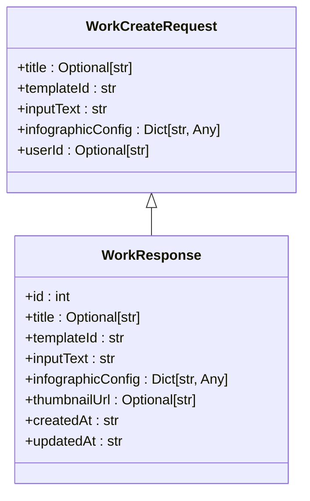
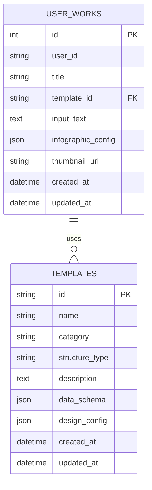
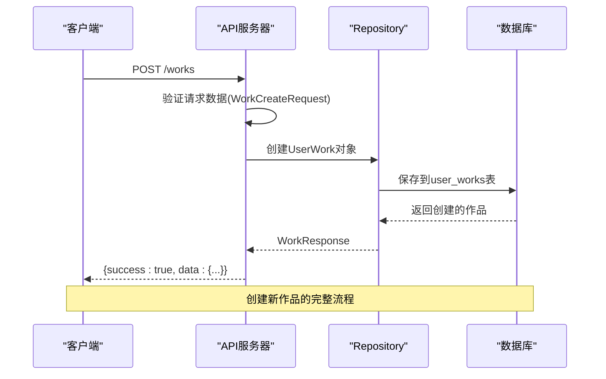
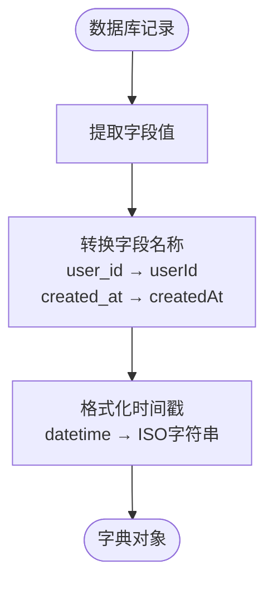

# 作品数据模型

<cite>
**本文档引用的文件**   
- [work.py](file://backend/app/models/work.py)
- [work.py](file://backend/app/schemas/work.py)
- [works.py](file://backend/app/api/v1/works.py)
- [work_repo.py](file://backend/app/repositories/work_repo.py)
- [common.py](file://backend/app/schemas/common.py)
- [work.ts](file://frontend/src/api/work.ts)
</cite>

## 目录
1. [简介](#简介)
2. [核心模型定义](#核心模型定义)
3. [作品与模板的关联关系](#作品与模板的关联关系)
4. [配置数据结构设计](#配置数据结构设计)
5. [API交互示例](#api交互示例)
6. [数据持久化与转换](#数据持久化与转换)

## 简介
作品数据模型是系统中用于存储和管理用户创建的信息图作品的核心数据结构。该模型定义了作品的元数据、用户输入内容、生成的结构化数据以及与模板的关联关系。通过Pydantic模型实现API请求和响应的数据验证，确保数据的一致性和完整性。

**Section sources**
- [work.py](file://backend/app/models/work.py#L1-L36)
- [work.py](file://backend/app/schemas/work.py#L1-L26)

## 核心模型定义

### WorkCreateRequest 模型
`WorkCreateRequest` 模型用于定义创建新作品时的请求体结构，包含以下字段：

- **title**: 作品标题（可选），字符串类型，用于标识作品
- **templateId**: 使用的模板ID，字符串类型，必填项，标识作品所使用的模板
- **inputText**: 用户输入的原始文本，字符串类型，必填项，最小长度为1，包含用户提供的原始内容
- **infographicConfig**: 完整的Infographic配置，字典类型，必填项，包含生成信息图所需的所有配置数据
- **userId**: 用户ID（可选），字符串类型，用于标识创建作品的用户

该模型作为API端点的输入验证，确保客户端提交的数据符合预期格式。

### WorkResponse 模型
`WorkResponse` 模型用于定义获取作品详情时的响应结构，包含以下字段：

- **id**: 作品ID，整数类型，唯一标识一个作品
- **title**: 作品标题（可选），字符串类型
- **templateId**: 使用的模板ID，字符串类型
- **inputText**: 用户输入的原始文本，字符串类型
- **infographicConfig**: 完整的Infographic配置，字典类型
- **thumbnailUrl**: 缩略图URL（可选），字符串类型
- **createdAt**: 创建时间，字符串类型，ISO格式的时间戳
- **updatedAt**: 更新时间，字符串类型，ISO格式的时间戳

该模型作为API响应的数据结构，向客户端提供作品的完整信息。

**Diagram sources **
- [work.py](file://backend/app/schemas/work.py#L8-L26)

**Section sources**
- [work.py](file://backend/app/schemas/work.py#L8-L26)

## 作品与模板的关联关系

作品与模板之间存在明确的关联关系，通过`template_id`字段建立外键关联。每个作品必须关联到一个模板，而一个模板可以被多个作品使用。

在数据库模型中，`UserWork`类的`template_id`字段定义为`String(100)`类型，并设置为外键引用`templates.id`，确保数据完整性。这种设计支持灵活的模板复用机制，用户可以基于同一模板创建多个不同的作品。

前端API通过`work.ts`文件中的`WorkCreateRequest`接口定义了模板ID的传递方式，后端API在`works.py`中接收并验证该参数，确保创建作品时指定的模板存在且有效。

**Diagram sources **
- [work.py](file://backend/app/models/work.py#L9-L36)
- [template.py](file://backend/app/models/template.py#L9-L54)

**Section sources**
- [work.py](file://backend/app/models/work.py#L9-L36)
- [template.py](file://backend/app/models/template.py#L9-L54)

## 配置数据结构设计

作品的`infographic_config`字段采用嵌套的JSON结构设计，包含信息图生成所需的完整配置。该结构设计具有以下特点：

1. **灵活性**: 使用`Dict[str, Any]`类型允许配置数据包含任意层次的嵌套结构，适应不同模板的复杂需求
2. **可扩展性**: JSON格式支持动态添加新字段，无需修改数据库表结构
3. **完整性**: 存储完整的AntV Infographic配置，包括数据、主题、设计参数等

配置数据通常包含以下组成部分：
- `data`: 从用户输入文本提取的结构化数据
- `themeConfig`: 主题配置，如配色方案
- `designConfig`: 设计参数，如布局、样式等

这种设计使得系统能够保存生成信息图所需的所有上下文信息，支持后续的编辑、导出和分享功能。

**Section sources**
- [work.py](file://backend/app/models/work.py#L19)
- [work.py](file://backend/app/schemas/work.py#L13)

## API交互示例

### 创建作品API
创建作品的API端点接收`WorkCreateRequest`格式的请求体，并返回`WorkResponse`格式的响应。

**Diagram sources **
- [works.py](file://backend/app/api/v1/works.py#L15-L45)
- [work_repo.py](file://backend/app/repositories/work_repo.py#L24-L37)

**Section sources**
- [works.py](file://backend/app/api/v1/works.py#L15-L45)
- [work.ts](file://frontend/src/api/work.ts#L33-L35)

## 数据持久化与转换

### 数据库模型
`UserWork`数据库模型定义了作品在数据库中的存储结构，包含以下字段：

- **id**: 作品ID，主键，自增
- **user_id**: 用户标识，字符串类型，可为空，建立索引
- **title**: 作品标题，字符串类型，可为空
- **template_id**: 模板ID，字符串类型，非空，外键引用模板表
- **input_text**: 用户输入的原始文本，文本类型，非空
- **infographic_config**: Infographic配置，JSON类型，非空
- **thumbnail_url**: 缩略图URL，字符串类型，可为空
- **created_at**: 创建时间，日期时间类型，默认为当前UTC时间
- **updated_at**: 更新时间，日期时间类型，默认为当前UTC时间，更新时自动更新

### 数据转换
`UserWork`模型提供了`to_dict()`方法，用于将数据库对象转换为字典格式，便于序列化为JSON响应。该方法将数据库字段转换为驼峰命名的JSON字段，如`user_id`转换为`userId`，`created_at`转换为`createdAt`，并处理时间格式化。

**Diagram sources **
- [work.py](file://backend/app/models/work.py#L24-L36)

**Section sources**
- [work.py](file://backend/app/models/work.py#L9-L36)
- [works.py](file://backend/app/api/v1/works.py#L30-L36)