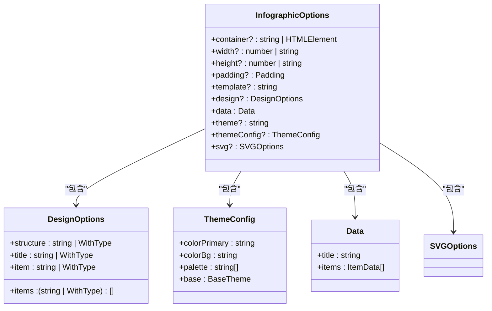
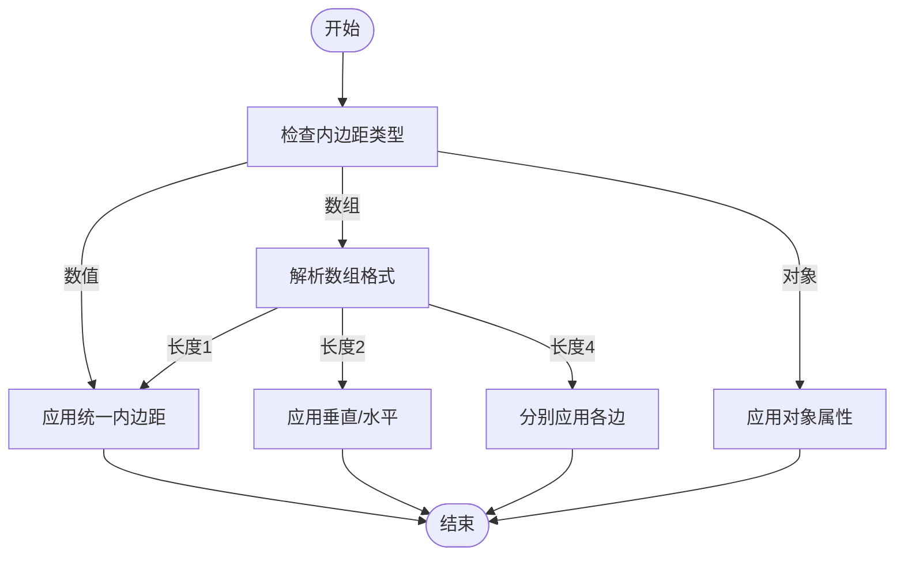
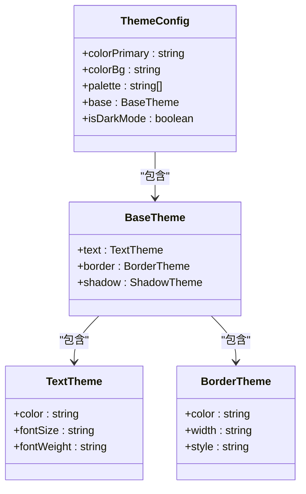
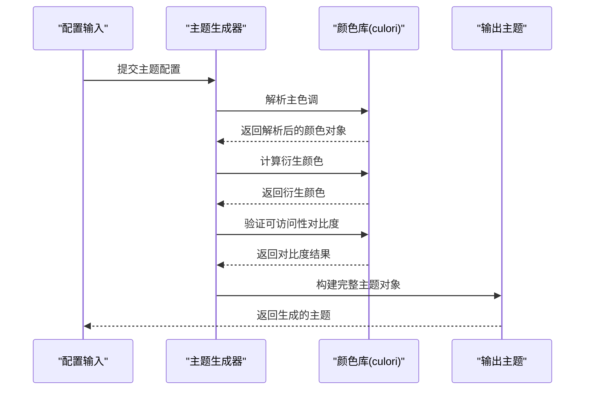
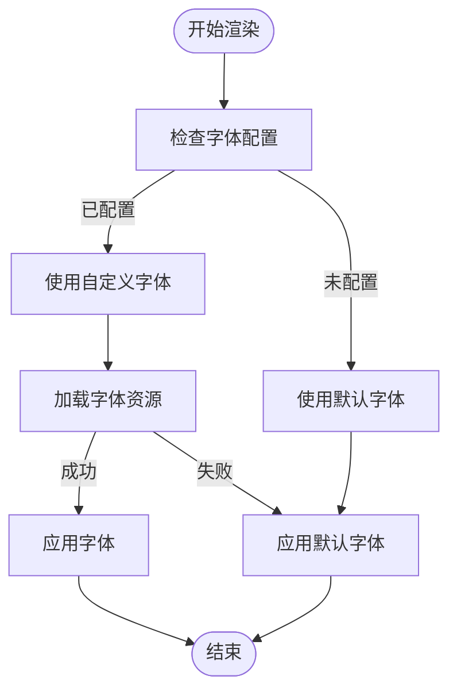
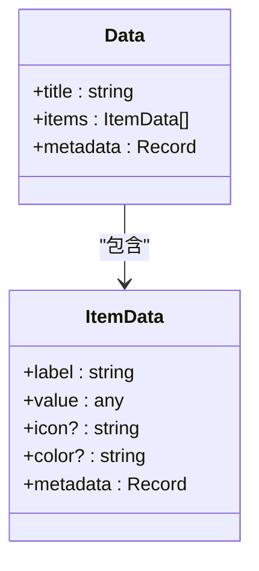
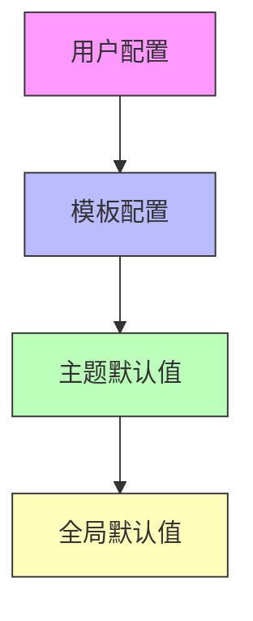
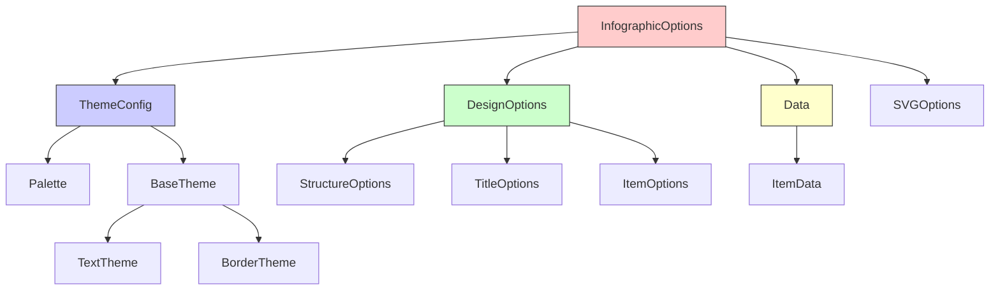

# 信息图配置数据模型

<cite>
**本文档中引用的文件**  
- [infographic.py](file://backend/app/schemas/infographic.py)
- [types.ts](file://antv_infographic/infographic/src/types/data.ts)
- [options.ts](file://antv_infographic/infographic/src/options/types.ts)
- [theme.ts](file://antv_infographic/infographic/src/themes/types.ts)
- [designs.ts](file://antv_infographic/infographic/src/designs/types.ts)
- [generator.js](file://antv_infographic/infographic/src/themes/generator.ts)
</cite>

## 目录
1. [简介](#简介)
2. [核心配置模型](#核心配置模型)
3. [画布设置](#画布设置)
4. [主题与调色板](#主题与调色板)
5. [字体配置](#字体配置)
6. [数据源结构](#数据源结构)
7. [配置继承与默认值](#配置继承与默认值)
8. [完整配置示例](#完整配置示例)
9. [依赖关系分析](#依赖关系分析)

## 简介
信息图配置数据模型定义了AntV Infographic引擎的输入结构，通过标准化的Pydantic模型确保配置的类型安全和数据完整性。该模型作为生成服务的核心输入，驱动信息图的渲染过程，支持从基础画布设置到复杂主题配置的全面控制。

## 核心配置模型
信息图配置的核心是`InfographicOptions`接口，它定义了所有可用的配置项及其类型约束。该模型通过嵌套结构组织不同维度的配置，包括画布、设计、主题、数据等。



**图源**  
- [options.ts](file://antv_infographic/infographic/src/options/types.ts)
- [designs.ts](file://antv_infographic/infographic/src/designs/types.ts)

**本节来源**  
- [options.ts](file://antv_infographic/infographic/src/options/types.ts#L5-L26)

## 画布设置
画布配置定义了信息图的基本尺寸和布局参数，包括容器、尺寸和内边距。

### 尺寸配置
- **宽度(width)**：支持数值（像素）或字符串（百分比）格式
- **高度(height)**：支持数值（像素）或字符串（百分比）格式
- **容器(container)**：可以是CSS选择器或直接的HTMLElement引用

### 内边距配置
`padding`属性支持多种格式：
- 单一数值：统一应用于所有边
- 数组格式：[上, 右, 下, 左] 或 [垂直, 水平] 或 [上, 水平, 下]
- 对象格式：{ top, right, bottom, left } 分别指定



**图源**  
- [padding.ts](file://antv_infographic/infographic/src/types/padding.ts)
- [utils.ts](file://antv_infographic/infographic/src/utils/padding.ts)

**本节来源**  
- [options.ts](file://antv_infographic/infographic/src/options/types.ts#L12)
- [types.ts](file://antv_infographic/infographic/src/types/padding.ts)

## 主题与调色板
主题系统提供了灵活的视觉风格控制，包括主色调、背景色和自定义调色板。

### 主题配置结构


**图源**  
- [theme.ts](file://antv_infographic/infographic/src/themes/types.ts)
- [generator.js](file://antv_infographic/infographic/src/themes/generator.ts)

**本节来源**  
- [theme.ts](file://antv_infographic/infographic/src/themes/types.ts#L1-L50)

### 颜色值约束
- **格式要求**：支持十六进制（#RRGGBB、#RGB）、RGB/RGBA、HSL/HSLA等标准CSS颜色格式
- **主色调验证**：必须是有效的CSS颜色值，通过culori库进行解析验证
- **调色板数组**：至少包含3种颜色，最多10种颜色

### 主题生成逻辑
当提供`colorPrimary`时，系统会自动生成完整的主题颜色体系：
1. 基于主色调生成不同明度的变体
2. 根据背景色计算文本可访问性对比度
3. 生成语义化颜色（成功、警告、错误等）



**图源**  
- [generator.js](file://antv_infographic/infographic/src/themes/generator.ts)
- [theme.ts](file://antv_infographic/infographic/src/themes/types.ts)

## 字体配置
字体系统确保信息图的文本呈现一致且美观。

### 字体配置项
- **字体族(font-family)**：指定优先使用的字体栈
- **字体大小(font-size)**：支持px、em、rem等单位
- **字体粗细(font-weight)**：支持数值或关键字（normal, bold等）

### 默认字体
系统内置默认字体栈：
```json
["-apple-system", "BlinkMacSystemFont", "Segoe UI", "Roboto", "Helvetica", "Arial", "sans-serif"]
```

### 字体加载


**图源**  
- [fonts.ts](file://antv_infographic/infographic/src/renderer/fonts.ts)
- [svg.js](file://antv_infographic/infographic/src/renderer/composites/svg.ts)

**本节来源**  
- [fonts.ts](file://antv_infographic/infographic/src/renderer/fonts.ts)
- [types.ts](file://antv_infographic/infographic/src/types/font.ts)

## 数据源结构
数据配置定义了信息图的内容和结构。

### 数据模型


**图源**  
- [data.ts](file://antv_infographic/infographic/src/types/data.ts)
- [infographic.py](file://backend/app/schemas/infographic.py)

**本节来源**  
- [data.ts](file://antv_infographic/infographic/src/types/data.ts)
- [infographic.py](file://backend/app/schemas/infographic.py#L8-L22)

### 数据验证规则
- **标题**：必须为非空字符串，长度限制200字符
- **数据项**：至少包含一个数据项
- **值类型**：支持字符串、数字、布尔值及嵌套对象
- **元数据**：可用于存储额外的上下文信息

## 配置继承与默认值
系统实现了多层次的配置继承机制，确保灵活性和易用性。

### 继承层次


**图源**  
- [options.ts](file://antv_infographic/infographic/src/options/parser.ts)
- [themes.ts](file://antv_infographic/infographic/src/themes/index.ts)

### 默认值策略
- **画布尺寸**：默认宽度800px，高度600px
- **内边距**：默认20px
- **主题**：默认使用"light"主题
- **字体**：使用系统默认字体栈

## 完整配置示例
```json
{
  "width": 800,
  "height": 600,
  "padding": 40,
  "data": {
    "title": "年度销售报告",
    "items": [
      {
        "label": "Q1 销售额",
        "value": 1200000,
        "color": "#f94144"
      },
      {
        "label": "Q2 销售额", 
        "value": 1500000,
        "color": "#f3722c"
      }
    ]
  },
  "themeConfig": {
    "colorPrimary": "#1890ff",
    "colorBg": "#ffffff",
    "palette": [
      "#f94144",
      "#f3722c", 
      "#f8961e",
      "#f9c74f",
      "#90be6d"
    ],
    "base": {
      "text": {
        "fontSize": "14px"
      }
    }
  },
  "design": {
    "structure": "bar-chart",
    "title": {
      "type": "main",
      "text": "年度销售趋势"
    }
  }
}
```

**本节来源**  
- [infographic.py](file://backend/app/schemas/infographic.py)
- [options.ts](file://antv_infographic/infographic/src/options/types.ts)

## 依赖关系分析
配置模型各组件之间的依赖关系如下：



**图源**  
- [options.ts](file://antv_infographic/infographic/src/options/types.ts)
- [designs.ts](file://antv_infographic/infographic/src/designs/types.ts)
- [theme.ts](file://antv_infographic/infographic/src/themes/types.ts)

**本节来源**  
- [options.ts](file://antv_infographic/infographic/src/options/types.ts)
- [designs.ts](file://antv_infographic/infographic/src/designs/types.ts)
- [theme.ts](file://antv_infographic/infographic/src/themes/types.ts)