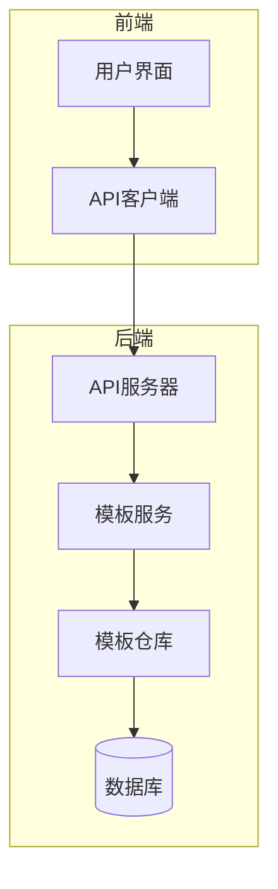
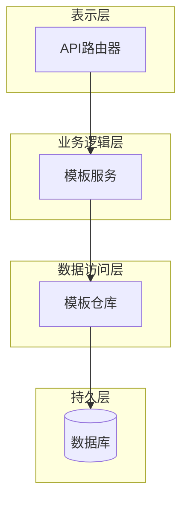
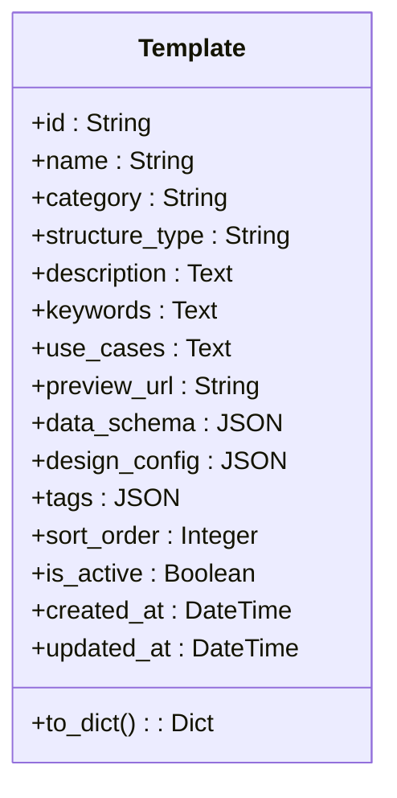
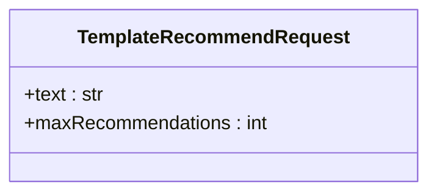
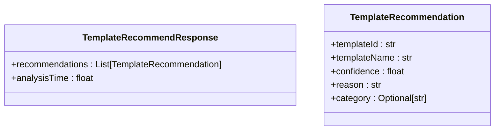
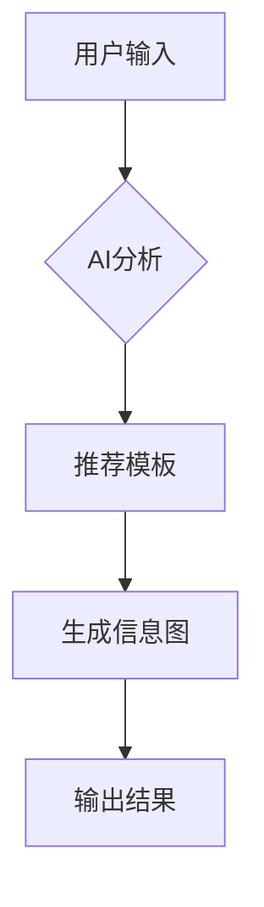
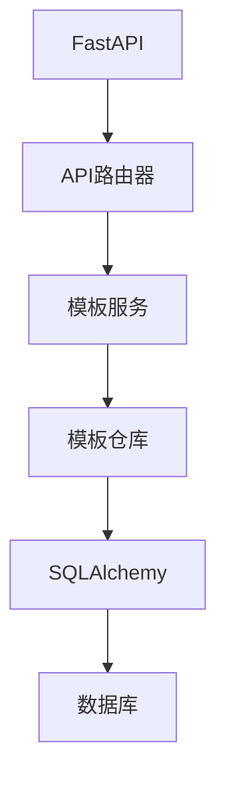

# 模板数据模型

<cite>
**本文档引用的文件**
- [template.py](file://backend/app/models/template.py)
- [template.py](file://backend/app/schemas/template.py)
- [templates.py](file://backend/app/api/v1/templates.py)
- [template_service.py](file://backend/app/services/template_service.py)
- [template_repo.py](file://backend/app/repositories/template_repo.py)
- [import_templates.py](file://backend/scripts/import_templates.py)
</cite>

## 目录
1. [简介](#简介)
2. [项目结构](#项目结构)
3. [核心组件](#核心组件)
4. [架构概述](#架构概述)
5. [详细组件分析](#详细组件分析)
6. [依赖分析](#依赖分析)
7. [性能考虑](#性能考虑)
8. [故障排除指南](#故障排除指南)
9. [结论](#结论)
10. [附录](#附录)（如有必要）

## 简介
本文档详细说明了模板数据模型的设计与实现，重点关注`template.py`中定义的Pydantic模型。文档将深入解析`TemplateCreate`、`TemplateUpdate`和`TemplateResponse`等模型的字段定义、数据类型约束、默认值设置以及验证规则。同时，文档将解释模板元数据（如名称、分类、结构类型、预览图）的结构设计，以及模板配置（JSON格式）的嵌套数据结构。此外，文档还将描述这些模型在API中的使用场景，包括创建新模板时的请求验证、更新模板时的可选字段处理、以及返回模板列表时的序列化输出。最后，文档将提供实际的JSON示例，展示合法请求体和响应体的结构，并说明数据验证失败时的错误信息格式。

## 项目结构
本项目采用分层架构设计，主要分为前端、后端和测试三个部分。后端服务基于FastAPI框架构建，使用Pydantic进行数据验证和序列化。模板相关的数据模型定义在`backend/app/models/template.py`和`backend/app/schemas/template.py`文件中。API端点定义在`backend/app/api/v1/templates.py`文件中，而业务逻辑则封装在`backend/app/services/template_service.py`文件中。数据访问层通过`backend/app/repositories/template_repo.py`文件实现，与数据库进行交互。

**图表来源**
- [templates.py](file://backend/app/api/v1/templates.py#L1-L99)
- [template_service.py](file://backend/app/services/template_service.py#L1-L281)
- [template_repo.py](file://backend/app/repositories/template_repo.py#L1-L144)

**章节来源**
- [templates.py](file://backend/app/api/v1/templates.py#L1-L99)
- [template_service.py](file://backend/app/services/template_service.py#L1-L281)
- [template_repo.py](file://backend/app/repositories/template_repo.py#L1-L144)

## 核心组件
核心组件包括模板数据库模型和Pydantic模型。模板数据库模型定义在`backend/app/models/template.py`文件中，使用SQLAlchemy ORM实现。Pydantic模型定义在`backend/app/schemas/template.py`文件中，用于API请求和响应的数据验证与序列化。

**章节来源**
- [template.py](file://backend/app/models/template.py#L1-L54)
- [template.py](file://backend/app/schemas/template.py#L1-L27)

## 架构概述
系统架构采用典型的分层设计，包括表示层、业务逻辑层、数据访问层和持久层。表示层由FastAPI框架提供，负责处理HTTP请求和响应。业务逻辑层封装在`TemplateService`类中，负责处理模板相关的业务逻辑。数据访问层通过`TemplateRepository`类实现，与数据库进行交互。持久层使用SQLAlchemy ORM，将Python对象映射到数据库表。

**图表来源**
- [templates.py](file://backend/app/api/v1/templates.py#L1-L99)
- [template_service.py](file://backend/app/services/template_service.py#L1-L281)
- [template_repo.py](file://backend/app/repositories/template_repo.py#L1-L144)

## 详细组件分析
### 模板模型分析
模板模型是系统的核心数据结构，定义了模板的元数据和配置信息。模型包括多个字段，如名称、分类、结构类型、描述、关键词、适用场景、预览图URL、数据结构Schema、设计配置、标签、排序权重、是否启用、创建时间和更新时间。

#### 模板数据库模型

**图表来源**
- [template.py](file://backend/app/models/template.py#L9-L54)

#### 模板推荐请求模型

**图表来源**
- [template.py](file://backend/app/schemas/template.py#L8-L12)

#### 模板推荐响应模型

**图表来源**
- [template.py](file://backend/app/schemas/template.py#L22-L27)

### 概念概述
模板数据模型的设计旨在支持灵活的信息图生成。通过定义清晰的元数据和配置结构，系统能够根据用户输入的内容智能推荐合适的模板，并生成符合要求的信息图。模板的分类体系涵盖了图表型、对比型、层级型、列表型、四象限型、关系型和顺序型七种类型，满足不同场景下的可视化需求。

## 依赖分析
系统依赖于多个外部库和内部模块。主要外部依赖包括FastAPI、SQLAlchemy、Pydantic等。内部模块之间通过清晰的接口进行通信，确保了系统的可维护性和可扩展性。

**图表来源**
- [templates.py](file://backend/app/api/v1/templates.py#L1-L99)
- [template_service.py](file://backend/app/services/template_service.py#L1-L281)
- [template_repo.py](file://backend/app/repositories/template_repo.py#L1-L144)

**章节来源**
- [templates.py](file://backend/app/api/v1/templates.py#L1-L99)
- [template_service.py](file://backend/app/services/template_service.py#L1-L281)
- [template_repo.py](file://backend/app/repositories/template_repo.py#L1-L144)

## 性能考虑
在设计模板数据模型时，考虑了性能优化。例如，对分类和排序权重字段建立了复合索引，以提高查询效率。此外，通过分页机制获取模板列表，避免一次性加载大量数据，减轻了数据库和网络的负担。

## 故障排除指南
当遇到模板相关的问题时，可以检查以下几个方面：
1. 确认模板ID是否正确。
2. 检查模板的分类是否在支持的范围内。
3. 验证数据结构Schema是否符合预期。
4. 确认设计配置是否正确。

**章节来源**
- [template.py](file://backend/app/models/template.py#L1-L54)
- [template.py](file://backend/app/schemas/template.py#L1-L27)
- [templates.py](file://backend/app/api/v1/templates.py#L1-L99)

## 结论
本文档详细介绍了模板数据模型的设计与实现。通过清晰的字段定义、严格的数据类型约束和合理的验证规则，确保了模板数据的完整性和一致性。同时，通过分层架构设计和模块化实现，提高了系统的可维护性和可扩展性。未来，可以进一步优化模板推荐算法，提升用户体验。

## 附录
### 模板分类说明
| 分类代码 | 名称 | 描述 |
| --- | --- | --- |
| chart | 图表型 | 数值展示，柱状图等可视化图表 |
| comparison | 对比型 | 优劣对比、SWOT分析 |
| hierarchy | 层级型 | 组织结构、分类信息 |
| list | 列表型 | 步骤说明、清单、简单信息罗列 |
| quadrant | 四象限型 | 市场定位、风险评估 |
| relation | 关系型 | 关系网络、关联分析 |
| sequence | 顺序型 | 时间线、流程图、递进关系 |

**章节来源**
- [template_repo.py](file://backend/app/repositories/template_repo.py#L113-L121)