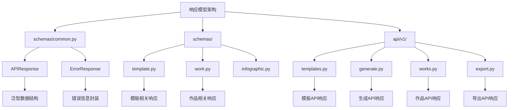
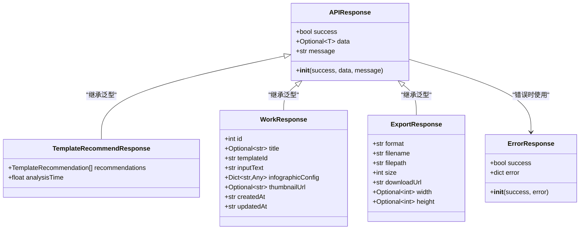
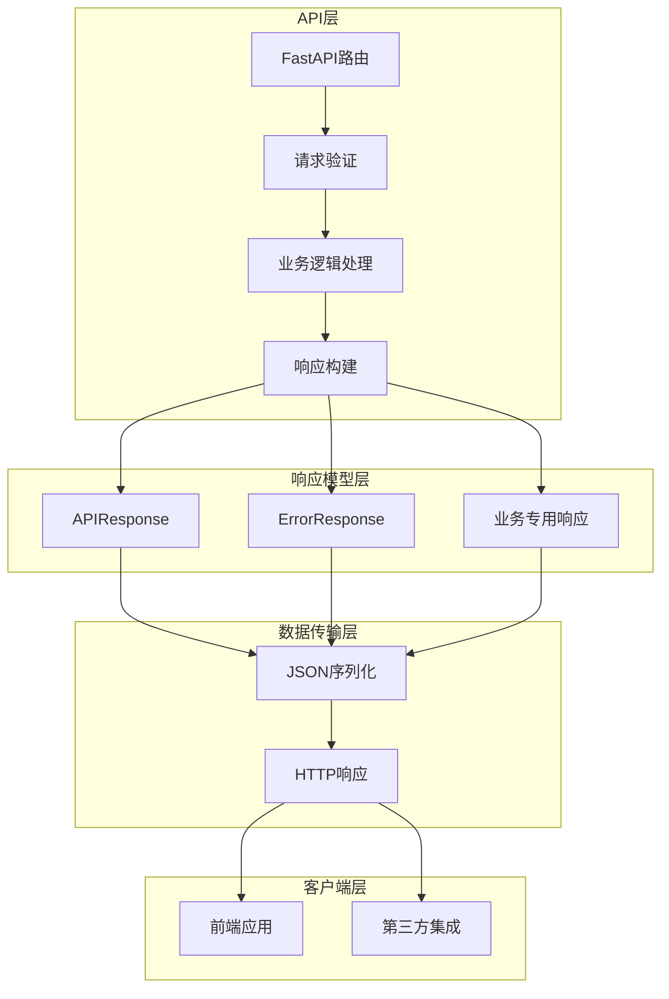
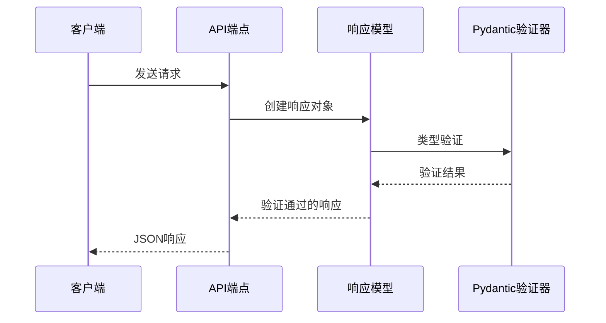
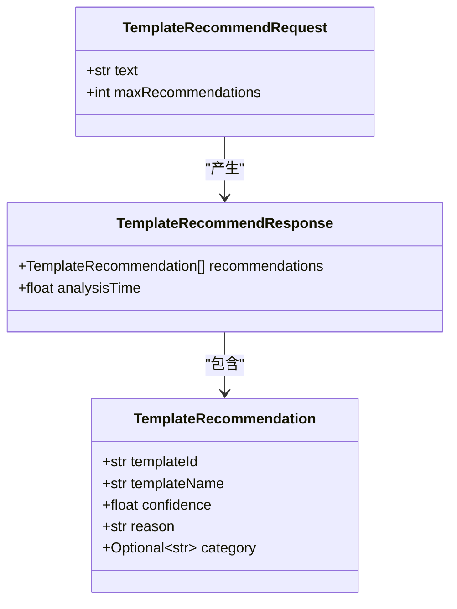
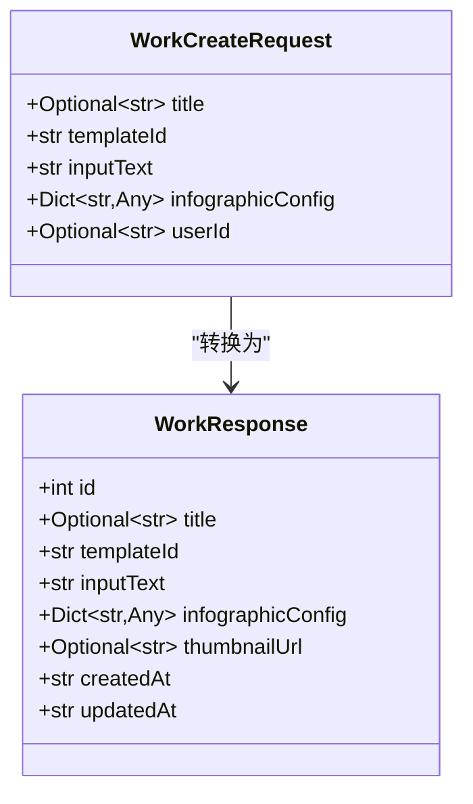
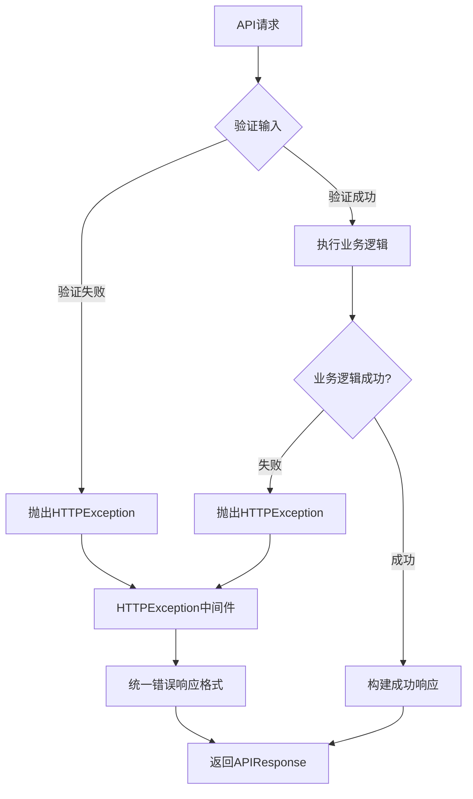

# 通用响应数据模型

<cite>
**本文档中引用的文件**
- [common.py](file://backend/app/schemas/common.py)
- [templates.py](file://backend/app/schemas/template.py)
- [work.py](file://backend/app/schemas/work.py)
- [generate.py](file://backend/app/api/v1/generate.py)
- [templates.py](file://backend/app/api/v1/templates.py)
- [works.py](file://backend/app/api/v1/works.py)
- [export.py](file://backend/app/api/v1/export.py)
</cite>

## 目录
1. [简介](#简介)
2. [项目结构](#项目结构)
3. [核心响应模型](#核心响应模型)
4. [架构概览](#架构概览)
5. [详细组件分析](#详细组件分析)
6. [分页响应模型](#分页响应模型)
7. [错误处理机制](#错误处理机制)
8. [响应格式示例](#响应格式示例)
9. [最佳实践指南](#最佳实践指南)
10. [总结](#总结)

## 简介

本文档详细介绍了GenAI Chart项目中统一的API响应数据模型设计。该项目采用标准化的响应格式，确保所有API端点返回一致的数据结构，便于前端集成和错误处理。核心响应模型包括基础响应格式、分页响应格式和专门的业务响应模型。

## 项目结构

项目的响应模型主要分布在以下目录结构中：



**图表来源**
- [common.py](file://backend/app/schemas/common.py#L1-L21)
- [templates.py](file://backend/app/schemas/template.py#L1-L27)
- [works.py](file://backend/app/schemas/work.py#L1-L27)

**章节来源**
- [common.py](file://backend/app/schemas/common.py#L1-L21)
- [templates.py](file://backend/app/schemas/template.py#L1-L27)
- [work.py](file://backend/app/schemas/work.py#L1-L27)

## 核心响应模型

### BaseResponse (APIResponse) 设计

系统的核心响应模型是基于Pydantic的泛型响应结构，提供了类型安全和数据验证功能。



**图表来源**
- [common.py](file://backend/app/schemas/common.py#L9-L20)
- [template.py](file://backend/app/schemas/template.py#L22-L27)
- [work.py](file://backend/app/schemas/work.py#L16-L27)
- [export.py](file://backend/app/api/v1/export.py#L26-L36)

### 核心字段详解

| 字段名 | 类型 | 必填 | 默认值 | 描述 |
|--------|------|------|--------|------|
| success | bool | 是 | - | 操作是否成功的标志，true表示成功，false表示失败 |
| data | Optional[T] | 否 | None | 泛型数据字段，包含实际的业务数据，可以是任何类型 |
| message | str | 否 | "操作成功" | 人类可读的操作结果描述信息 |
| error | dict | 否 | - | 错误信息字典，包含错误代码和详细信息 |

**章节来源**
- [common.py](file://backend/app/schemas/common.py#L9-L20)

## 架构概览

系统的响应模型架构采用了分层设计，确保了代码的可维护性和扩展性：



**图表来源**
- [templates.py](file://backend/app/api/v1/templates.py#L17-L99)
- [generate.py](file://backend/app/api/v1/generate.py#L17-L116)
- [works.py](file://backend/app/api/v1/works.py#L15-L106)

## 详细组件分析

### 基础响应模型 (APIResponse)

基础响应模型是整个系统的核心，采用了Python泛型设计，提供了类型安全的响应结构：

#### 泛型设计原理



**图表来源**
- [common.py](file://backend/app/schemas/common.py#L9-L15)

#### 使用示例模式

系统中的各种API端点都遵循统一的响应模式：

```python
# 成功响应示例
return APIResponse(
    success=True,
    data=result_data,
    message="操作成功"
)

# 失败响应示例  
return APIResponse(
    success=False,
    error={"code": "INVALID_INPUT", "message": "参数验证失败"}
)
```

**章节来源**
- [templates.py](file://backend/app/api/v1/templates.py#L38-L39)
- [generate.py](file://backend/app/api/v1/generate.py#L52-L57)
- [works.py](file://backend/app/api/v1/works.py#L41-L45)

### 业务专用响应模型

#### 模板推荐响应模型

模板推荐功能使用了专门的响应结构，包含了推荐算法的详细信息：



**图表来源**
- [template.py](file://backend/app/schemas/template.py#L8-L27)

#### 作品管理响应模型

作品管理模块包含了完整的作品信息结构：



**图表来源**
- [work.py](file://backend/app/schemas/work.py#L8-L27)

**章节来源**
- [template.py](file://backend/app/schemas/template.py#L8-L27)
- [work.py](file://backend/app/schemas/work.py#L8-L27)

## 分页响应模型

虽然项目中没有显式的PaginationResponse类，但系统在多个API端点中实现了分页功能，通过统一的响应结构提供分页信息：

### 分页响应结构

```mermaid
sequenceDiagram
participant Client as 客户端
participant API as 分页API
participant Service as 服务层
participant Repo as 数据仓库
Client->>API : GET /api/v1/templates?page=1&pageSize=20
API->>Service : 处理分页请求
Service->>Repo : 查询数据和总数
Repo-->>Service : (数据列表, 总数)
Service->>API : 构建分页响应
API->>API : 包装到APIResponse
API-->>Client : {
"success" : true,
"data" : {
"works" : [...],
"total" : 100,
"page" : 1,
"pageSize" : 20
},
"message" : "获取作品列表成功"
}
```

**图表来源**
- [works.py](file://backend/app/api/v1/works.py#L68-L77)

### 分页元数据字段

| 字段名 | 类型 | 描述 |
|--------|------|------|
| works | List | 当前页的数据列表 |
| total | int | 总记录数 |
| page | int | 当前页码（从1开始） |
| pageSize | int | 每页显示数量 |

**章节来源**
- [works.py](file://backend/app/api/v1/works.py#L68-L77)

## 错误处理机制

### HTTPException与标准响应结合

系统采用了混合的错误处理策略，既使用FastAPI的HTTPException进行状态码控制，又保持统一的响应格式：



**图表来源**
- [generate.py](file://backend/app/api/v1/generate.py#L58-L59)
- [works.py](file://backend/app/api/v1/works.py#L46-L47)

### 错误响应格式

当发生错误时，系统会返回标准化的错误响应：

```python
# HTTPException自动转换为标准错误响应
raise HTTPException(status_code=404, detail="模板不存在: {template_id}")

# 自动转换为：
{
    "success": false,
    "error": {
        "detail": "模板不存在: {template_id}"
    }
}
```

### 错误状态码映射

| HTTP状态码 | 场景 | 响应格式 |
|------------|------|----------|
| 200 | 成功操作 | success=true, data包含结果 |
| 400 | 客户端错误 | success=false, error包含错误信息 |
| 404 | 资源不存在 | success=false, error包含详细信息 |
| 500 | 服务器内部错误 | success=false, error包含错误详情 |

**章节来源**
- [generate.py](file://backend/app/api/v1/generate.py#L58-L59)
- [works.py](file://backend/app/api/v1/works.py#L46-L47)
- [templates.py](file://backend/app/api/v1/templates.py#L71-L72)

## 响应格式示例

### 成功响应示例

#### 模板列表响应
```json
{
    "success": true,
    "data": [
        {
            "id": "bar-chart-vertical",
            "name": "垂直柱状图",
            "category": "图表型",
            "description": "适用于数值比较的垂直柱状图模板"
        }
    ],
    "message": "获取模板列表成功"
}
```

#### 作品创建响应
```json
{
    "success": true,
    "data": {
        "id": 123,
        "title": "销售数据分析",
        "templateId": "bar-chart-vertical",
        "inputText": "2023年销售额：北京1000万元，上海800万元",
        "infographicConfig": {},
        "thumbnailUrl": "/api/v1/export/download/thumbnail_123.png",
        "createdAt": "2024-01-15T10:30:00Z",
        "updatedAt": "2024-01-15T10:30:00Z"
    },
    "message": "作品保存成功"
}
```

#### 分页响应
```json
{
    "success": true,
    "data": {
        "works": [
            {
                "id": 1,
                "title": "第一季度销售报告",
                "templateId": "chart-column-simple",
                "createdAt": "2024-01-01T00:00:00Z"
            }
        ],
        "total": 15,
        "page": 1,
        "pageSize": 20
    },
    "message": "获取作品列表成功"
}
```

### 客户端错误响应示例

#### 参数验证错误
```json
{
    "success": false,
    "error": {
        "detail": "模板不存在: invalid-template-id"
    }
}
```

#### 输入格式错误
```json
{
    "success": false,
    "error": {
        "detail": "用户输入的文本内容不能为空"
    }
}
```

### 服务器错误响应示例

#### 内部服务错误
```json
{
    "success": false,
    "error": {
        "detail": "数据库连接失败: Connection refused"
    }
}
```

#### 导出服务错误
```json
{
    "success": false,
    "error": {
        "detail": "缺少必要的依赖库: cairosvg"
    }
}
```

**章节来源**
- [templates.py](file://backend/app/api/v1/templates.py#L38-L39)
- [works.py](file://backend/app/api/v1/works.py#L41-L45)
- [works.py](file://backend/app/api/v1/works.py#L68-L77)
- [export.py](file://backend/app/api/v1/export.py#L111-L114)

## 最佳实践指南

### 响应设计原则

1. **一致性原则**：所有API端点必须使用统一的响应格式
2. **完整性原则**：成功响应必须包含完整的业务数据
3. **可读性原则**：message字段应该提供人类可读的操作结果描述
4. **错误友好原则**：错误响应应该提供足够的调试信息

### 使用建议

#### 成功场景
```python
# ✅ 推荐：提供有意义的消息
return APIResponse(
    success=True,
    data=processed_data,
    message="模板推荐成功完成"
)

# ❌ 不推荐：使用默认消息
return APIResponse(success=True, data=result)
```

#### 错误场景
```python
# ✅ 推荐：明确的错误信息
try:
    result = process_data(input_data)
except ValueError as e:
    return APIResponse(
        success=False,
        error={"code": "INVALID_DATA", "message": str(e)}
    )

# ❌ 不推荐：过于笼统的错误
return APIResponse(success=False, error={"message": "处理失败"})
```

#### 分页场景
```python
# ✅ 推荐：包含完整的分页信息
return APIResponse(
    success=True,
    data={
        "items": paginated_items,
        "total": total_count,
        "page": current_page,
        "pageSize": page_size
    }
)
```

### 性能考虑

1. **数据序列化**：利用Pydantic的自动序列化功能，避免手动转换
2. **内存优化**：对于大数据集，考虑使用生成器或流式处理
3. **缓存策略**：对频繁访问的静态数据实施适当的缓存

### 安全注意事项

1. **敏感信息过滤**：确保错误信息不泄露敏感数据
2. **错误信息标准化**：使用统一的错误代码和消息格式
3. **日志记录**：在服务器端记录详细的错误信息，但不在响应中暴露

## 总结

GenAI Chart项目的通用响应数据模型设计体现了现代API开发的最佳实践。通过统一的响应格式、类型安全的模型设计和完善的错误处理机制，系统确保了：

1. **一致性**：所有API端点使用相同的响应结构，便于前端集成
2. **可维护性**：基于Pydantic的类型验证确保了数据的正确性
3. **可扩展性**：泛型设计允许轻松添加新的业务响应模型
4. **用户体验**：标准化的错误处理提供了良好的开发者体验
5. **性能优化**：合理的数据结构设计减少了不必要的数据传输

这套响应模型不仅满足了当前的功能需求，还为未来的功能扩展提供了坚实的基础。通过遵循本文档中的最佳实践指南，开发团队可以继续构建高质量、一致性的API接口。